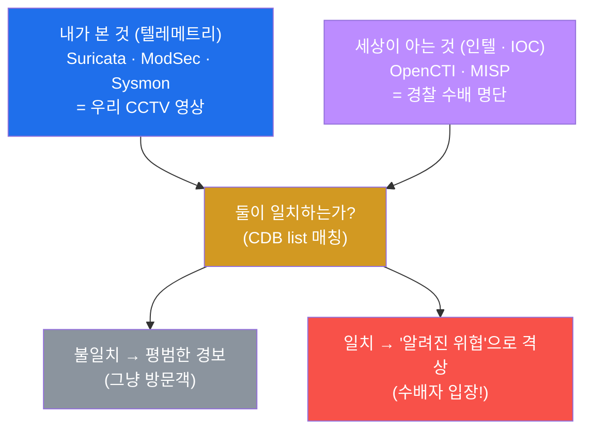
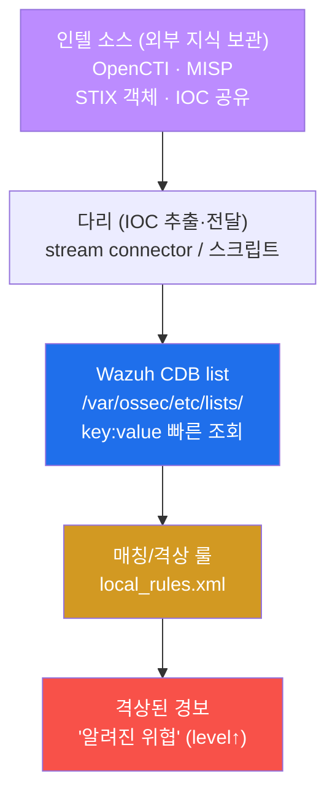
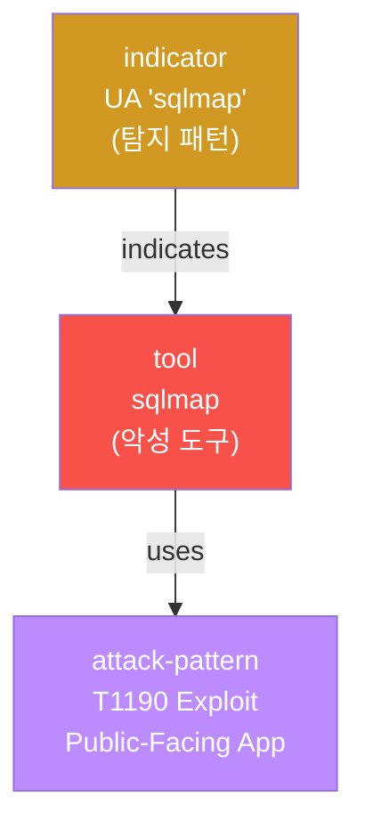
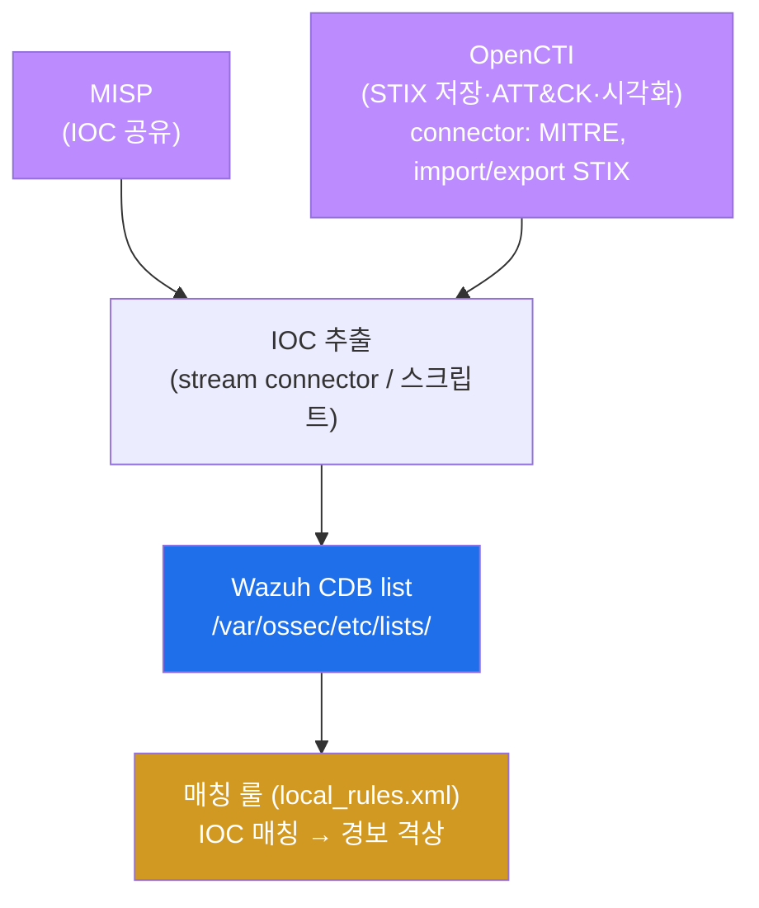
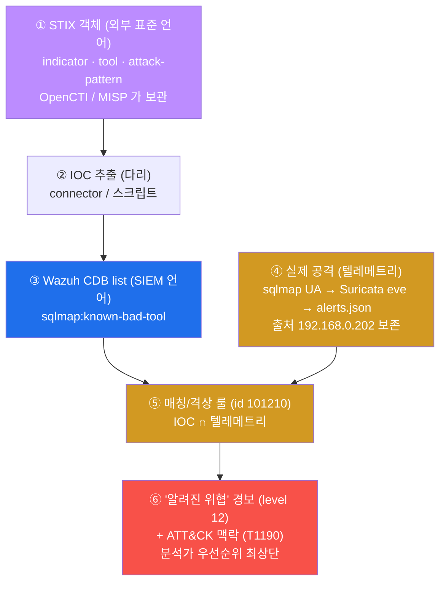

# Week 12 — 위협의 언어: 세상이 이미 아는 "악성"을 우리 SIEM이 알아듣게 만들기

> **본 주차의 한 줄 요약**
>
> W09–W11 동안 학생은 **우리 환경 안에서 일어난 일**(Suricata 네트워크 탐지, ModSecurity
> 웹 공격, Sysmon 호스트 이벤트)을 SIEM 으로 모았다. 그런데 세상에는 이미 **"이 IP·이
> 도구·이 해시는 악성이다"** 라고 정리해 둔 외부 지식이 있다 — 이것을 **위협 인텔리전스
> (CTI, Cyber Threat Intelligence)** 라고 부른다. 이번 주의 단 하나의 질문은 이것이다.
> **"그 외부 지식을 어떻게 우리 SIEM(Wazuh)이 알아듣게 만드는가?"** 답은 세 부품의 연결
> 이다 — 위협을 기계가 읽는 표준 형식으로 적는 **STIX/TAXII**, 그 표준 객체를 보관·공유
> 하는 **OpenCTI/MISP**(el34 에 실제 가동 중), 그리고 그 지식을 SIEM 이 빠르게 조회하는
> 형식으로 옮긴 **Wazuh CDB list + 매칭 룰** 이다. 학생은 알려진 악성 도구(sqlmap)로 공격
> 을 흘리고, 그 IOC 를 CDB list 로 표현한 뒤, 매칭 룰로 평범한 경보를 **"알려진 위협"으로
> 격상** 하는 전 과정을 본인 손으로 검증한다.
>
> **운영자 한 줄 결론**: SIEM 은 "내가 본 것" 만으로 판결하지 않는다. **"세상이 이미 아는
> 것"(IOC)을 내 판결 기준에 합쳐야** 같은 공격이 묻히지 않고 분석가의 시선을 먼저 끈다.
> W09 가 "raw 로그 → 평결" 이었다면, W12 는 그 평결에 **외부 지식이라는 가중치** 를 더하는
> 단계다.

---

## 학습 목표

본 주차 종료 시 학생은 다음 6가지를 **본인 손으로** 할 수 있어야 한다.

1. **위협 인텔리전스(CTI)** 와 **침해 지표(IOC)** 가 무엇인지, "내가 본 로그(텔레메트리)"
   와 "세상이 아는 악성(인텔)" 의 차이를 비유 없이 1분 안에 설명한다.
2. **STIX 2.1** 의 핵심 객체(indicator / malware·tool / attack-pattern / relationship)와
   **TAXII 2.1** 전송 프로토콜의 역할을 짚고, "왜 위협을 사람 메모가 아니라 기계가 읽는
   표준 객체로 적어야 하는가" 를 설명한다.
3. el34 에 실제 가동 중인 **OpenCTI / MISP / MITRE connector** 컨테이너를 `docker ps` 로
   확인하고, "인텔 소스(OpenCTI/MISP) → CDB → 적용 지점(Wazuh)" 의 운영 흐름을 그린다.
4. **Wazuh CDB list**(`/var/ossec/etc/lists/`)가 IOC 를 `key:value` 로 담는 빠른 조회
   테이블임을 이해하고, IOC 저장소 파일을 직접 작성한다. 운영의 `<list>` 등록 + `.cdb`
   컴파일(restart 필요)과 공유 인프라에서의 안전한 대안(logtest 검증)을 구분한다.
5. **IOC 매칭/격상 룰**(id **101210**, level 12)을 `local_rules.xml` 에 직접 작성하고,
   **라이브 manager 를 재시작하지 않고** `wazuh-logtest` 만으로 격상 발화를 검증한 뒤,
   베이스를 원상복구(self-clean)한다.
6. 알려진 악성 도구(sqlmap)로 공격을 재현해 IOC 가 Wazuh `alerts.json`(ids 그룹)으로
   수렴하고 **출처 IP(192.168.0.202)가 보존** 됨을 데이터로 확인하며, 그 IOC 를 **MITRE
   ATT&CK technique(T1190 등)** 에 매핑해 공격 단계 맥락을 부여한다.

---

## 0. 용어 해설 (위협 인텔리전스 운영 입문)

이번 주에 처음 등장하거나 의미를 정확히 해야 하는 용어를 먼저 모아 둔다. 본문에서 다시
나올 때 막히면 이 표로 돌아오면 된다.

| 용어 | 영문 | 뜻 | 비유 |
|------|------|----|------|
| **CTI** | Cyber Threat Intelligence | 외부에서 정리된 위협 지식(악성 IP·도구·해시·전술) | 경찰의 수배 정보망 |
| **IOC** | Indicator of Compromise | 침해를 가리키는 구체 지표(악성 IP·해시·도메인·도구명) | 수배범의 지문·차량번호 |
| **TTP** | Tactics, Techniques, Procedures | 공격자의 전술·기법·절차(IOC 보다 상위 개념) | 범행 수법·습관 |
| **텔레메트리** | telemetry | 내가 직접 수집한 관측 데이터(로그·alert) | 우리 건물 CCTV 영상 |
| **STIX** | Structured Threat Information eXpression | 위협을 기계가 읽는 표준 객체로 적는 포맷(2.1) | 표준 양식의 수배 전단 |
| **TAXII** | Trusted Automated eXchange of Indicator Information | STIX 를 주고받는 전송 프로토콜(2.1) | 수배 전단을 배포하는 우편망 |
| **indicator** | STIX indicator | 탐지 패턴 객체(예: UA "sqlmap") | "이 지문을 보면 그놈이다" |
| **tool / malware** | STIX tool/malware | 악성 도구·코드 객체(sqlmap, nikto) | 범행 도구 목록 |
| **attack-pattern** | STIX attack-pattern | ATT&CK 기법에 대응하는 객체 | 범행 수법 분류 |
| **relationship** | STIX relationship | 객체 사이의 연결(indicator —indicates→ tool) | "이 지문은 이 도구의 것" |
| **OpenCTI** | Open Cyber Threat Intelligence | STIX 저장·시각화·ATT&CK 연동 플랫폼 | 수배 정보 통합 DB |
| **MISP** | Malware Information Sharing Platform | IOC 수집·공유 플랫폼 | 기관 간 정보 공유망 |
| **connector** | OpenCTI connector | 외부 피드를 STIX 로 자동 수집·가공하는 모듈 | 정보 수집 요원 |
| **CDB list** | Constant DataBase list | Wazuh 가 IOC 를 빠르게 조회하는 `key:value` 테이블 | 검문소의 수배자 명단 |
| **field-match 룰** | — | 디코딩된 단일 필드 값으로 매치하는 룰(`<field>`) | 명단에서 이름 하나 대조 |
| **list lookup** | `<list lookup>` | CDB 의 수천 IOC 를 한 번에 조회하는 룰 조건 | 명단 전체와 자동 대조 |
| **격상** | escalation | 평범한 경보를 더 높은 level 로 끌어올리는 것 | 일반 사건 → 중요 사건 재분류 |
| **wazuh-logtest** | — | 로그 한 줄을 넣어 룰 매치를 안전하게 검증하는 도구 | 모의재판 |
| **MITRE ATT&CK** | Adversarial Tactics, Techniques & Common Knowledge | 공격 전술·기법 분류 체계(예: T1190) | 범죄 유형 표준 코드 |

---

## 0.5 핵심 개념 — "내가 본 것"에 "세상이 아는 것"을 더한다

위 용어 표는 한 줄 정의라서 그림을 그리기엔 부족하다. 본 절에서는 W12 의 가장 중요한
직관 세 가지를 일상 비유로 풀어 둔다. 이 세 비유가 W12 전체를 관통한다.

### 0.5.1 텔레메트리 vs 인텔 — 우리 CCTV와 경찰 수배망의 비유

학생이 한 건물의 경비실에서 일한다고 하자. 경비실에는 두 종류의 정보가 있다.

- **우리 CCTV 영상(텔레메트리)** — 우리 건물 안에서 실제로 일어난 일을 찍은 화면이다.
  "오후 3시에 누가 뒷문으로 들어왔다" 같은 **내가 직접 관측한 사실** 이다. W09–W11 에서
  모은 Suricata·ModSec·Sysmon 로그가 전부 여기에 해당한다.
- **경찰의 수배 명단(인텔, CTI)** — 우리 건물과는 무관하게, **세상이 이미 "이 사람은
  위험하다" 고 정리해 둔 외부 지식** 이다. "이 지문, 이 차량번호는 수배 대상" 같은
  정보다.

두 정보는 **따로 있을 때보다 합쳐졌을 때 훨씬 강하다.** CCTV 에 누군가 찍혔는데(텔레메트리),
그 얼굴이 수배 명단(인텔)과 일치하면, 경비는 "그냥 방문객 한 명" 이 아니라 **"수배자가
들어왔다"** 로 즉시 대응 우선순위를 올린다.

W12 가 하는 일이 정확히 이것이다. 우리 SIEM 의 텔레메트리에 등장한 어떤 흔적(예: sqlmap)
이 외부 인텔(IOC) 의 "알려진 악성" 명단에 있으면, 그 경보를 **평범한 경보에서 "알려진
위협" 으로 격상** 한다.

| 경비실 비유 | W12 의 실체 |
|-------------|-------------|
| 우리 CCTV 영상 | 텔레메트리(Suricata·ModSec·Sysmon·Wazuh alerts.json) |
| 경찰 수배 명단 | 외부 인텔 = IOC(OpenCTI/MISP 가 보관) |
| 명단 한 줄(지문·차량번호) | IOC 한 개(악성 도구명·IP·해시) |
| CCTV ∩ 수배 명단 일치 → 비상 | 텔레메트리 ∩ IOC 일치 → 경보 격상 |



### 0.5.2 STIX/TAXII — 위협을 "사람 메모"가 아니라 "표준 양식"으로 적는 이유

학생이 어느 경찰서에서 옆 경찰서로 수배 정보를 넘긴다고 하자. 두 가지 방식이 있다.

- **사람 메모 방식.** "키 크고 검은 옷 입은 수상한 남자가 어제 보였음" 이라고 자유 문장
  으로 적는다. 받는 쪽 사람은 읽을 수 있지만, **컴퓨터는 이걸 자동으로 대조하지
  못한다.** 경찰서마다 적는 방식도 제각각이라 공유·자동화가 안 된다.
- **표준 양식 방식.** "유형=지문, 값=AB12CD, 연결된 도구=○○" 처럼 **칸이 정해진 양식** 에
  적는다. 받는 쪽 컴퓨터가 그 칸을 그대로 읽어 자기 명단과 자동 대조한다.

위협 정보 세계에서 이 표준 양식이 **STIX 2.1** 이고, 그 양식을 경찰서끼리 주고받는
우편망이 **TAXII 2.1** 이다.

핵심 통찰은 이것이다. 위협을 사람 메모로 적으면 한 사람만 쓰고 끝나지만, **STIX 같은
기계가 읽는 표준 객체로 적으면 공유되고 자동화** 된다 — OpenCTI 가 그 객체를 보관하고,
connector 가 자동으로 받아오고, 결국 Wazuh CDB 로 내려가 자동 매칭된다. "표준" 이 곧
"자동화의 전제" 다.

### 0.5.3 CDB list — 검문소가 수배 명단을 빨리 뒤지는 비유

검문소를 떠올려보자. 차 한 대가 지나갈 때마다 경관이 수배 명단에서 그 차량번호를
찾는다. 만약 명단이 정리 안 된 종이 뭉치라면 한 대 검문에 몇 분이 걸려 도로가 마비된다.
그래서 검문소는 **차량번호로 즉시 찾을 수 있게 색인된 명단** 을 쓴다 — "번호를 넣으면
바로 수배 여부가 튀어나오는" 형식이다.

Wazuh 에서 이 색인된 명단이 **CDB(Constant DataBase) list** 다. IOC 를 `key:value` 형식
(`sqlmap:known-bad-tool`)으로 담아 두면, 룰이 로그의 한 필드 값을 그 명단에 던져 **즉시
일치 여부** 를 받는다. 수천 개 IOC 가 있어도 한 번의 조회로 끝난다 — 이것이 `<field>`
하나하나 비교하는 방식과의 결정적 차이다(§5.3).

> **el34 공유 인프라 수칙(반드시 지킬 것).** el34-siem 은 모든 학생이 함께 쓰는 단일
> manager 다. CDB list 를 운영에 진짜 반영하려면 `ossec.conf` 등록 + `.cdb` 컴파일 +
> manager 재시작이 필요한데, **재시작하면 다른 학생의 ingest 가 끊긴다.** 그래서 본 주차
> 는 (1) **IOC 저장소(list 파일)는 형식만 만들어 보이고**, (2) **매칭/격상 로직은
> `wazuh-logtest` 로만 검증** 하며, (3) 끝나면 **룰·list 잔재를 전부 삭제** 해 베이스를
> 원상복구한다(§4.3 · §5.4 · 실습 9). 이는 W09 에서 익힌 "공유 SIEM 보존" 원칙의 연장이다.

---

## 1. "내가 본 것"만으로는 부족하다 — 왜 외부 인텔이 필요한가

### 1.1 한 줄 답: 같은 공격이 텔레메트리만으로는 "평범한 경보"에 묻히기 때문

W09–W11 에서 모은 모든 데이터는 **텔레메트리** — 우리 환경이 직접 관측한 것이다. 문제는,
텔레메트리만 보면 위협의 **경중을 구분할 단서가 부족** 하다는 점이다. 예를 들어 외부에서
들어온 sqlmap 공격은 Suricata 와 ModSec 에 흔적을 남기지만, 기본 룰셋에서는 그저 평범한
웹 스캔 경보(낮은 level)로 처리되기 쉽다. 분당 수백 건 쏟아지는 경보 속에서 그 한 줄은
묻힌다.

그런데 세상은 이미 sqlmap 이 **"알려진 악성 자동화 도구"** 임을 안다. 그 지식(IOC)을
우리 판결에 합치면, 같은 경보를 "평범한 스캔" 이 아니라 **"알려진 악성 도구 사용"** 으로
격상해 분석가가 먼저 보게 만들 수 있다. 이것이 외부 인텔이 필요한 이유다.

### 1.2 왜 중요한가 — IOC 는 "이미 검증된 위험 신호" 다

운영자가 모든 위협을 스스로 처음부터 분석할 수는 없다. 전 세계 보안 커뮤니티·벤더가
악성 IP·도메인·해시·도구를 끊임없이 수집해 IOC 로 공유한다. 이 IOC 는 **이미 누군가
검증한 위험 신호** 이므로, 내 환경에서 그것이 보이면 의심의 출발점이 아니라 **상당히
확실한 경고** 다. 외부 인텔을 쓰는 것은 곧 **전 세계의 분석 결과를 내 SIEM 에 빌려오는
것** 이다.

### 1.3 el34 에서 어떻게 — 인텔 소스와 적용 지점이 분리돼 있다

el34 에는 인텔을 **보관·공유하는 곳**(OpenCTI/MISP)과 그것을 **적용하는 곳**(Wazuh)이
따로 있다. OpenCTI/MISP 가 IOC 를 모으고, 그 IOC 가 CDB list 로 내려가 Wazuh 의 룰이
참조한다.



> **el34 사실.** `docker ps` 를 하면 `el34-opencti-1`, `el34-misp-core-1`,
> `el34-connector-mitre-1`, `el34-elasticsearch-1`, `el34-worker-*` 등 OpenCTI/MISP
> 스택 컨테이너가 실제로 떠 있다(W01 §3.2 에서 "W12–W14 대상" 으로 미뤄 둔 그 스택이다).
> 적용 지점은 W09–W11 에서 쓰던 그 `el34-siem`(Wazuh manager 4.10) 그대로다.

### 1.4 한계 — IOC 는 "이미 알려진 것" 만 잡는다

IOC 매칭의 본질적 한계는 **"알려진 것" 만 잡는다** 는 점이다. 공격자가 도구 이름을 바꾸거나
(UA 위장), 처음 보는 IP·해시를 쓰면 IOC 명단에 없으므로 격상되지 않는다. 그래서 IOC 매칭은
**탐지의 전부가 아니라 한 축** 이다 — 행위 기반 탐지(W09 의 커스텀 룰, W11 의 Sysmon
이벤트)와 **함께** 써야 한다. 또한 IOC 는 시간이 지나면 낡으므로(악성 IP 가 정상으로
회수되는 등) 주기적 갱신이 전제다. 다음 주(W13)에서 다룰 enrichment·빈도가 바로 이 한계를
보완하는 다음 단계다.

---

## 2. STIX 2.1 / TAXII 2.1 — 위협의 표준 언어

### 2.1 한 줄 정의 — STIX 는 위협을 적는 표준 양식, TAXII 는 그 전송망

**STIX(Structured Threat Information eXpression) 2.1** 은 위협 정보를 사람 메모가 아니라
**기계가 읽는 표준 객체** 로 적는 포맷이다. **TAXII(Trusted Automated eXchange of
Indicator Information) 2.1** 은 그 STIX 객체를 server↔client 가 주고받는 전송 프로토콜
이다. 둘 다 OASIS 표준이며, 사실상 전 세계 위협 인텔 공유의 공용어다.

### 2.2 왜 중요한가 — 표준이라야 공유되고 자동화된다

§0.5.2 의 비유 그대로다. 위협을 자유 문장으로 적으면 한 사람만 읽고 끝이지만, STIX 객체로
적으면 **다른 플랫폼·조직이 그대로 받아 자동 처리** 한다. OpenCTI 가 STIX 를 저장하고,
connector 가 TAXII 로 외부 피드를 받아오고, 결국 그 IOC 가 CDB 로 내려가 Wazuh 룰이
자동 매칭하는 — 이 **자동화 사슬 전체가 "표준" 위에서만** 성립한다.

### 2.3 el34 에서 어떻게 — STIX 핵심 4객체

STIX 2.1 은 객체 종류가 많지만, 운영 입문에서 외울 핵심은 네 가지다.

| STIX 2.1 객체 | 뜻 | 본 주차 예시 |
|---------------|----|--------------|
| **indicator** | 탐지 패턴(이걸 보면 위협) | UA "sqlmap", 악성 IP 패턴 |
| **tool / malware** | 악성 도구·코드 | sqlmap, nikto |
| **attack-pattern** | ATT&CK 기법 객체 | T1190(공개 앱 익스플로잇) |
| **relationship** | 객체 사이의 연결 | indicator —indicates→ tool, indicator —uses→ attack-pattern |

핵심은 **relationship** 이다. IOC(indicator) 하나만 있으면 "이게 보이면 위험" 까지지만,
그것을 tool(sqlmap)·attack-pattern(T1190)과 relationship 으로 묶으면 분석가가 IOC 를 보는
순간 **"어떤 도구의, 어느 공격 단계인가"** 라는 맥락을 함께 본다.



el34 의 **OpenCTI 가 이 STIX 객체들을 보관** 하고, **MITRE connector 가 ATT&CK technique
를 attack-pattern STIX 객체로 자동 수집** 한다(§3, §6). 운영자는 indicator 를 만들면서
이미 들어와 있는 attack-pattern 에 relationship 으로 연결하기만 하면 된다.

### 2.4 한계 — 표준 객체가 곧 SIEM 탐지는 아니다

STIX 객체가 OpenCTI 에 잘 보관돼 있어도, 그 자체로는 우리 SIEM 이 탐지하지 못한다. STIX 는
**"위협을 표현·공유하는 언어"** 일 뿐, Wazuh 가 그것을 조회하려면 IOC 를 **CDB list 라는
SIEM 의 형식으로 옮겨야** 한다(§4). 즉 "STIX(공유 언어) → CDB(SIEM 언어)" 라는 번역이
반드시 한 단계 끼어든다. 이 번역을 자동화하는 것이 운영의 stream connector 이고, 본 주차는
그 마지막 한 칸(CDB + 룰)을 학생이 직접 손으로 만들어 본다.

---

## 3. el34 의 위협인텔 스택 — OpenCTI + MISP + Wazuh

### 3.1 한 줄 정의 — 세 부품: 보관(OpenCTI) · 공유(MISP) · 적용(Wazuh)

el34 의 위협인텔 스택은 역할이 다른 세 부품의 협업체다.

| 부품 | 역할 | el34 컨테이너(예) |
|------|------|-------------------|
| **OpenCTI** | STIX 객체 저장·시각화·ATT&CK 연동, connector 로 피드 자동 수집 | `el34-opencti-1`, `el34-elasticsearch-1`, `el34-worker-*`, `el34-connector-mitre-1` |
| **MISP** | IOC 수집·공유 플랫폼(커뮤니티/기관 간) | `el34-misp-core-1` 등 |
| **Wazuh** | 인텔을 **적용** 하는 지점(CDB list + 매칭 룰 → 격상) | `el34-siem`(W09–W11 과 동일) |

OpenCTI/MISP 가 **"세상이 아는 것" 을 모으는 곳**, Wazuh 가 **"내가 본 것" 에 그 지식을
적용하는 곳** 이다.

### 3.2 왜 중요한가 — 인텔 소스와 적용 지점을 분리해야 운영이 산다

인텔 소스(OpenCTI/MISP)와 적용 지점(Wazuh)이 분리돼 있는 것은 우연이 아니다. 인텔은
끊임없이 갱신되는 거대한 지식 베이스이고(수십만 IOC), SIEM 은 그중 **내 환경에 필요한 것
만 빠르게 조회** 하면 된다. 이 분리 덕분에 인텔 팀은 OpenCTI 에서 IOC 를 관리하고, 운영
팀은 Wazuh 에서 탐지를 운영하며, 그 사이를 **자동 다리(connector/스크립트)** 가 잇는다.

### 3.3 el34 에서 어떻게 — 스택 가동 확인

```bash
# el34 호스트(ssh ccc@192.168.0.80)에서
docker ps --format '{{.Names}}\t{{.Status}}' | grep -iE 'opencti|misp|mitre'
#  → el34-opencti-1 (healthy), el34-misp-core-1 (healthy), el34-connector-mitre-1 …
```

출력에서 `el34-opencti-1` 이 `healthy` 면 STIX 저장소가 살아 있고, `el34-connector-mitre-1`
이 보이면 ATT&CK 가 STIX 로 자동 수집되고 있으며, `el34-misp-core-1` 이 보이면 IOC 공유
플랫폼이 가동 중이다. 이 세 가지가 인텔 소스의 가용성 점검이다(적용 지점 Wazuh 의 가용성은
§5 와 W09 의 `wazuh-control status` 로 별도 확인).



### 3.4 한계 — 플랫폼이 살아도 "다리"가 없으면 IOC 는 안 내려온다

OpenCTI/MISP 가 `healthy` 라고 해서 자동으로 Wazuh 가 똑똑해지는 것은 아니다. 인텔 소스의
IOC 가 CDB 로 내려가는 **다리(stream connector/스크립트)** 가 동작해야 비로소 적용된다.
본 트레이닝은 그 다리의 자동화까지는 다루지 않고(운영 영역), **마지막 칸 — CDB list 형식
작성 + 매칭 룰 격상 — 을 학생이 직접** 만들어 "다리 끝에서 무슨 일이 일어나는가" 를 손으로
이해한다.

---

## 4. Wazuh CDB list — IOC 를 SIEM 이 읽는 형식

### 4.1 한 줄 정의 — IOC 를 담는 `key:value` 빠른 조회 테이블

**CDB(Constant DataBase) list** 는 Wazuh 가 IOC 를 `key:value` 형식으로 담아 두는 빠른
조회 테이블이다. 위치는 `/var/ossec/etc/lists/` 다. §0.5.3 의 "검문소의 색인된 수배
명단" 이며, 룰이 로그의 한 필드 값을 이 명단에 던져 즉시 일치 여부를 받는다.

```bash
# /var/ossec/etc/lists/edu-w12-ioc 의 내용 예시
sqlmap:known-bad-tool
nikto:known-bad-tool
```

각 줄은 `키:값` 이다. 여기서 **키(sqlmap)** 가 로그에서 찾을 IOC 이고, **값
(known-bad-tool)** 은 그것이 매치됐을 때 룰이 활용할 태그(분류)다.

### 4.2 왜 중요한가 — 수천 IOC 를 한 번에, 빠르게 조회한다

IOC 는 수백~수천 개에 이른다. 이것을 룰에서 `<field>` 로 하나하나 비교하면 룰이 수천 줄로
불어나고 평가도 느려진다. CDB list 는 색인된 테이블이라 **IOC 가 아무리 많아도 한 번의
조회(lookup)로 일치 여부** 를 돌려준다. 그래서 "외부에서 받은 대량 IOC 를 SIEM 에 싣는"
운영 작업의 표준 형식이 CDB 다.

### 4.3 el34 에서 어떻게 — IOC 저장소 형식 작성(공유 인프라 안전 모드)

```bash
# el34-siem 안에서: IOC 저장소 형식 작성 → 확인 → 정리
sudo bash -c 'printf "sqlmap:known-bad-tool\nnikto:known-bad-tool\n" > /var/ossec/etc/lists/edu-w12-ioc'
cat /var/ossec/etc/lists/edu-w12-ioc
sudo rm -f /var/ossec/etc/lists/edu-w12-ioc   # 실습 후 정리(공유 인프라 보존)
```

**운영의 정식 절차(참고).** 실제로 이 CDB 를 탐지에 쓰려면 세 단계가 더 필요하다.

1. `ossec.conf` 에 `<list>etc/lists/edu-w12-ioc</list>` 로 등록한다.
2. manager 가 그 list 를 이진 `.cdb` 로 **컴파일** 한다 — 이때 **`wazuh-control restart`
   가 필요** 하다.
3. 룰에서 `<list field="..." lookup="match_key">etc/lists/edu-w12-ioc</list>` 로 조회한다.

그러나 **el34-siem 은 공유 자원** 이라 2단계의 재시작이 금지된다(다른 학생 ingest 중단,
§0.5.3). 그래서 본 주차는 **IOC 저장소 형식만 작성·확인** 하고, 실제 매칭/격상 **로직은
다음 절(§5)에서 `<field>` 매치 + `wazuh-logtest`** 로 검증한다. `<field>` 와 `<list lookup>`
은 "한 줄 비교 vs 명단 전체 비교" 의 차이일 뿐, **격상의 논리는 동일** 하므로 학습 목적상
field-match 로 검증해도 운영 로직을 정확히 이해할 수 있다.

### 4.4 한계 — list 작성만으로는 탐지가 안 된다

CDB list 파일을 만들어 두기만 하면 아무 일도 일어나지 않는다. (1) `ossec.conf` 등록, (2)
`.cdb` 컴파일(restart), (3) 룰의 `<list lookup>` 조회 — 이 세 가지가 모두 맞아야 라이브
탐지가 된다. 본 주차가 list 를 "작성·확인 후 삭제" 만 하는 이유가 이 제약(공유 인프라
restart 금지) 때문임을 분명히 이해해야 한다. "list 를 만들었으니 잡힐 것" 이라는 오해가
실전에서 흔한 함정이다.

---

## 5. IOC 매칭/격상 룰 — 평범한 경보를 "알려진 위협"으로

### 5.1 한 줄 정의 — IOC 가 보이면 level 을 끌어올리는 룰

**IOC 매칭/격상 룰** 은 디코딩된 로그에 IOC 가 나타나면 그 경보의 **level 을 상위로
격상** 하는 커스텀 룰이다. W09 에서 배운 `local_rules.xml` 커스텀 룰 패턴을 그대로
재사용한다 — 다만 매치 조건이 "내 환경의 특정 패턴" 이 아니라 **"외부 인텔의 IOC"** 라는
점이 다르다.

```xml
<group name="edu_w12,">
  <rule id="101210" level="12">
    <decoded_as>json</decoded_as>        <!-- ① json decoder 가 잡은 로그만 대상 -->
    <field name="tool">sqlmap</field>    <!-- ② tool 필드 값이 IOC 'sqlmap' 인 경우 -->
    <description>EDU W12 - known IOC (sqlmap) matched, escalate</description>
  </rule>
</group>
```

각 줄의 의미:

- `id="101210" level="12"` — 이 룰의 고유 번호와 격상 후 형량. **level 12 는 고위험** 이다
  (W09 §5.2: 7 이상 기록, 12 이상 고위험).
- `<decoded_as>json</decoded_as>` — "json decoder 가 파싱한 로그만" 으로 대상을 좁힌다.
- `<field name="tool">sqlmap</field>` — 그 로그의 `tool` 필드 값이 IOC `sqlmap` 일 때만
  매치한다. (운영에서는 이 한 줄을 `<list lookup>` 으로 바꿔 수천 IOC 를 한 번에 본다.)
- `<description>` — 판결문에 적히는 사람이 읽는 설명.

### 5.2 왜 중요한가 — 격상이 곧 "분석가 시선의 우선순위" 다

분석가의 화면에는 분당 수백 건의 경보가 흐른다. 같은 sqlmap 공격이 level 5 의 평범한 웹
스캔으로 묻히면 분석가는 못 본다. 그러나 IOC 매칭으로 **level 12 로 격상** 되면 대시보드
최상단에 떠 **먼저 처리** 된다. 즉 IOC 격상은 단순한 "라벨 붙이기" 가 아니라 **한정된
분석 인력의 주의를 어디로 보낼지 결정하는 운영 기술** 이다.

### 5.3 el34 에서 어떻게 — field-match 격상 + logtest 검증 + self-clean

본 트랙의 표준 절차는 W09 와 동일하다: (1) 백업 → (2) 커스텀 룰 추가 → (3) **라이브
재시작 없이 `wazuh-logtest` 로 발화 검증** → (4) 원복(self-clean).

```bash
# el34-siem 안에서
# (1) 백업
sudo cp /var/ossec/etc/rules/local_rules.xml /tmp/w12_lr.bak

# (2) IOC 매칭/격상 룰 추가 — id 네임스페이스: 본 트랙 W12 = 1012xx
sudo bash -c 'cat >> /var/ossec/etc/rules/local_rules.xml <<EOF
<group name="edu_w12,">
  <rule id="101210" level="12">
    <decoded_as>json</decoded_as>
    <field name="tool">sqlmap</field>
    <description>EDU W12 - known IOC (sqlmap) matched, escalate</description>
  </rule>
</group>
EOF'

# (3) 발화 검증 — 라이브 manager 무중단(모의재판)
echo '{"tool":"sqlmap","src_ip":"9.9.9.9"}' | sudo /var/ossec/bin/wazuh-logtest
#   → Phase 3: id 101210, level 12, "Alert to be generated."   (IOC 격상 확인)

# (4) self-clean — 베이스 원상복구
sudo cp /tmp/w12_lr.bak /var/ossec/etc/rules/local_rules.xml; sudo rm -f /tmp/w12_lr.bak
```

이 룰이 하는 일: json decoder 가 잡은 로그 중 `tool` 필드 값이 IOC `sqlmap` 인 것을 level
12 로 격상한다. `wazuh-logtest` 가 **현재 룰셋을 새로 읽어 별도의 테스트 인스턴스에서**
한 줄을 판결하므로(W09 §0.5.3) 라이브 analysisd 는 전혀 건드리지 않는다 — 그래서 공유
el34-siem 에서도 안전하다. `<field>` 한 줄을 `<list field="tool" lookup="match_key">
etc/lists/edu-w12-ioc</list>` 로 바꾸면 그대로 CDB 의 수천 IOC 를 보는 운영 룰이 된다(격상
논리는 동일).

### 5.4 한계와 안전 수칙 — id 충돌 금지 · XML 문법 · 공유 보존

- **id 네임스페이스.** **100000 미만은 Wazuh 예약** 이라 사용 금지다(W09 §6.4). 본 트랙
  W12 는 `1012xx`(예: 101210)로 격리하고 끝나면 그룹째 삭제한다. (참고: W09=1009xx 였다.)
- **라이브 반영의 조건.** 실제 운영 적용은 `wazuh-control restart` 가 필요하지만, 공유
  el34 에서는 **logtest 검증만** 하고 끝나면 룰을 지운다.
- **XML 문법 주의.** local_rules.xml 에 문법 오류가 있으면 analysisd 가 룰셋 로딩에
  실패한다. `wazuh-logtest` 는 시작 시 룰셋 로드 에러를 보여주므로, 검증 단계에서 문법
  오류를 먼저 잡을 수 있다.
- **공유 인프라 보존.** 끝나면 반드시 cp 복원으로 베이스 `local_rules.xml` 을 원래대로
  되돌리고 CDB list 파일도 삭제한다. 잔재가 남으면 다른 학생의 평결에 영향을 준다(실습 9).

---

## 6. MITRE ATT&CK 매핑 — IOC 에 "어느 단계의 공격인가" 맥락을 더한다

### 6.1 한 줄 정의 — IOC 를 공격 기법 표준 코드에 연결하는 것

**MITRE ATT&CK** 은 공격자의 전술(Tactics)·기법(Techniques)을 표준 코드로 정리한 지식
체계다(예: **T1190** = Exploit Public-Facing Application). IOC 를 이 technique 에 매핑하면,
"악성 도구 sqlmap" 이라는 단편 정보가 **"공개 웹 애플리케이션 익스플로잇 단계"** 라는
공격 사슬 위의 위치 정보로 격상된다.

### 6.2 왜 중요한가 — 단편 IOC 에 "스토리" 를 부여한다

IOC 하나(sqlmap)는 점(point) 정보다. 그러나 ATT&CK 에 매핑하면 그 점이 공격의 **어느
단계** 인지, 다음에 무엇이 올지(예: 익스플로잇 → 권한상승 → 지속성)를 가늠하는 **선
(line)** 이 된다. 분석가는 IOC 를 보는 순간 "이건 초기 침투 단계구나, 그럼 다음은…" 하고
대응을 설계한다. ATT&CK 매핑이 IOC 에 **수사 맥락** 을 주는 것이다.

### 6.3 el34 에서 어떻게 — 본 주차 IOC 의 technique 대응

| IOC / 행위 | ATT&CK technique |
|------------|------------------|
| sqlmap SQLi (공개 웹 익스플로잇) | **T1190** Exploit Public-Facing Application |
| base64 인코딩 셸 (W11 의 리버스셸) | **T1059** Command and Scripting Interpreter |
| 백도어 계정 (W08/W11 의 persistence) | **T1136** Create Account |

el34 의 **OpenCTI MITRE connector** 가 이 technique 들을 STIX **attack-pattern** 객체로
보관한다(§3). 따라서 운영자가 indicator(sqlmap UA)를 만들면서 이미 들어와 있는
attack-pattern(T1190)에 **relationship 으로 연결** 해 두면, 분석가가 그 IOC 를 보는 순간
ATT&CK 맥락을 함께 본다(§2.3 의 relationship 이 여기서 실전으로 쓰인다).

### 6.4 한계 — 매핑은 분석을 돕지만 자동 대응을 대신하진 않는다

ATT&CK 매핑은 **맥락 부여·우선순위·보고서 작성** 에 강력하지만, 그 자체가 차단이나
복구 같은 자동 대응을 하지는 않는다. technique 코드는 "무엇인지" 를 말할 뿐 "어떻게
막을지" 는 별도(W10 의 active-response 등)다. 또한 매핑은 분석가의 판단이 들어가는
작업이라, IOC 하나가 여러 technique 에 걸칠 수도 있음을 염두에 둬야 한다.

---

## 7. IOC 가 Wazuh 로 수렴 — ingest 추적과 출처 보존

### 7.1 한 줄 정의 — IOC 공격이 alerts.json 까지 흘러드는 전 과정

지금까지(§4–§6)는 인텔을 SIEM 언어로 옮기는 "준비" 였다. 이제 실제 공격을 흘려, IOC 가
텔레메트리를 거쳐 **Wazuh `alerts.json` 까지 수렴** 하고 **출처 IP 가 보존** 되는지를
데이터로 확인한다. 격상 룰이 라이브였다면 이 경보가 바로 level 12 로 떴을 대상이다.

### 7.2 왜 중요한가 — 출처 보존이 인텔 매칭의 전제

여러 계층의 흔적을 하나의 IOC 사건으로 묶으려면 공통 키가 필요한데, 그 핵심이 **출처
IP** 다. el34 는 fw 가 SNAT(출처 IP 를 게이트웨이 IP 로 바꿈)를 하지 않아, **내부 공격자
192.168.0.202 / 외부 공격자 192.168.0.202** 의 출처 IP 가 ips·web·siem 전 계층에 그대로
보존된다(W09 §7.2 와 동일한 사실). 출처가 보존돼야 "이 IOC 도구를 누가 썼나" 를 IP 단위로
추적·상관할 수 있다.

### 7.3 el34 에서 어떻게 — IOC 공격 재현 → alerts.json ids 그룹

```bash
# 외부 공격자 sqlmap UA + SQLi → Suricata eve → ips agent → manager → alerts.json
ssh att@192.168.0.202 "curl -s -o /dev/null -A sqlmap/1.7 \
  \"http://dvwa.el34.lab/?id=ct12-7%27%20UNION%20SELECT%201--%20-\""
sleep 8
ssh ccc@10.20.32.100 'tail -300 /var/ossec/logs/alerts/alerts.json \
  | jq -c "select(.rule.groups|index(\"ids\"))|{r:.rule.id,s:.data.src_ip}" | tail -2'
#   → {"r":"86601","s":"192.168.0.202"}   (ids 그룹 경보, 출처 보존)
```

흐름: IOC 공격(sqlmap UA + UNION SELECT) → Suricata 가 eve.json 에 기록 → ips agent 가
`json` 으로 수집 → 1514 → manager 의 decoder/rule → `alerts.json` 의 **ids 그룹**. 출력의
`s:"192.168.0.202"` 가 출처가 보존됐다는 증거다. `sleep 8` 은 공격이 eve.json 을 거쳐
alerts.json 에 반영되기까지의 파이프라인 지연을 기다리는 것이다(W09 §7.3 과 동일 패턴).
이 경보가 §5 의 CDB 매칭 룰이 라이브였다면 level 12 로 격상됐을 바로 그 대상이다.

### 7.4 한계 — 기본 디코딩은 IOC 를 자동 격상하지 않는다

el34 의 기본 Wazuh decoder 는 이 경보를 ids 그룹의 평범한 Suricata 경보로 적재할 뿐,
"이건 알려진 악성 도구" 라는 인텔 맥락을 스스로 붙이지 않는다. 그 gap 을 메우는 것이
바로 §5 의 IOC 매칭/격상 룰이며, 이는 W09·W11 에서 익힌 **Purple Team 의 표준 산출물
(미탐지/미격상 발견 → 룰 추가)** 의 연장이다.

---

## 8. 전체 그림 — STIX 에서 격상된 경보까지 한눈에

지금까지의 §2–§7 을 한 흐름으로 잇는다. 외부 표준 객체(STIX)가 어떻게 우리 SIEM 의 격상된
경보로 끝나는지가 이번 주의 큰 그림이다.



이 그림의 핵심은 ⑤에서 **두 줄기(③ 외부 인텔 + ④ 내 텔레메트리)가 만나는 지점** 이다.
어느 한쪽만으로는 격상이 안 된다 — "세상이 아는 IOC" 와 "내가 본 공격" 이 일치할 때 비로소
경보가 "알려진 위협" 으로 격상된다. 이것이 §0.5.1 의 "CCTV ∩ 수배 명단" 비유의 데이터
버전이다.

---

## 9. 실습 안내 (총 9 미션)

각 실습은 **4축 설명** 을 포함한다. 모든 명령은 el34 호스트(`ssh ccc@192.168.0.80`)에서
(각 장비에 직접 접속(fw 10.20.30.1/ips 31.2/web 32.80/siem 32.100, 공격 192.168.0.202, root은 sudo)해 실행한다). 매칭 룰은 **logtest 로만 검증**(라이브 restart
금지)하고, 끝나면 룰·list 잔재를 삭제(공유 인프라 보존)한다.

### 실습 1 — 위협인텔 스택(Wazuh + OpenCTI + MISP) 점검

> **이 실습을 왜 하는가?**
> IOC 를 SIEM 에 연결하려면 적용 지점(Wazuh manager 의 평결 엔진 analysisd)과 인텔 소스
> (OpenCTI/MISP)가 모두 살아 있어야 한다(§3). 운영 인수 첫 점검이다.
>
> **이걸 하면 무엇을 알 수 있는가?**
> - `wazuh-control status | grep analysisd` 로 평결 엔진 가용성
> - `docker ps` 로 `el34-opencti-1`·`el34-misp-core-1` 의 `healthy` 여부
>
> **결과 해석**
> 정상: `wazuh-analysisd is running` + OpenCTI/MISP 컨테이너 `healthy`. 비정상: analysisd
> 가 멈추면 격상은커녕 평결 자체가 안 난다(최우선 복구). OpenCTI 가 `starting`/`unhealthy`
> 면 인텔 소스가 아직 준비 안 된 것이므로 잠시 후 재확인.
>
> **실전 활용**
> "인텔을 SIEM 에 연결할 준비가 됐는가" 를 1분에 답하는 점검. 소스(OpenCTI)와 적용 지점
> (Wazuh)을 따로 보는 습관이 핵심이다.

### 실습 2 — IOC 공격 재현: 알려진 악성 도구(sqlmap)

> **이 실습을 왜 하는가?**
> 굳이 새 수법을 만들 필요가 없다. 이미 CTI 에 "악성" 으로 등록된 도구(sqlmap, UA 에 이름이
> 박힘)로 공격하면, 그 도구 시그니처 자체가 곧 IOC 다(§1, §4).
>
> **이걸 하면 무엇을 알 수 있는가?**
> - 외부 attacker 의 sqlmap UA 가 ModSecurity audit log 에 남는 것
> - "도구 시그니처 = IOC" 라는 개념(913 scanner 그룹으로 탐지됨)
>
> **결과 해석**
> 정상: `modsec_audit.log` 에 `sqlmap` UA 흔적 + CRS 913xxx(스캐너 탐지) 룰 매치. 안 보이면
> 외부 공격 경로(Host 헤더 `dvwa.el34.lab`)나 web 컨테이너 로그 권한을 점검.
>
> **실전 활용**
> 인텔 매칭을 검증하기 전, "IOC 가 실제 텔레메트리에 나타나는가" 를 먼저 만드는 detection
> validation 의 출발점.

### 실습 3 — CDB list 작성: IOC 를 SIEM 이 읽는 형식

> **이 실습을 왜 하는가?**
> IOC 를 Wazuh 가 빠르게 조회하는 형식(CDB `key:value`)으로 옮기는 것이 "STIX(공유 언어)
> → CDB(SIEM 언어)" 번역의 마지막 칸이다(§2.4, §4).
>
> **이걸 하면 무엇을 알 수 있는가?**
> - `/var/ossec/etc/lists/edu-w12-ioc` 에 `sqlmap:known-bad-tool` 형식으로 IOC 저장
> - 운영의 정식 적용(`<list>` 등록 + `.cdb` 컴파일 + restart)과 공유 인프라 제약의 차이
>
> **결과 해석**
> 정상: CDB list 에 `known-bad-tool` 값이 `key:value` 로 작성된다. 본 실습은 형식 작성·확인
> 후 즉시 삭제한다(공유 인프라라 컴파일·restart 를 하지 않음).
>
> **실전 활용**
> 외부에서 받은 대량 IOC 를 SIEM 에 싣는 운영 작업의 표준 형식. "list 만 만들면 잡힌다" 는
> 오해(§4.4)를 피하는 것이 학습 포인트다.

### 실습 4 — IOC 매칭/격상 룰(id 101210) logtest 검증 → self-clean

> **이 실습을 왜 하는가?**
> 평범한 경보를 "알려진 위협" 으로 격상하는 핵심 로직을 직접 작성하고, 라이브를 안 건드리고
> 검증한다(§5). W09 의 커스텀 룰 패턴을 IOC 매칭으로 재사용한다.
>
> **이걸 하면 무엇을 알 수 있는가?**
> - `local_rules.xml` 에 `decoded_as`/`field` 매치 룰(id 101210, level 12)을 쓰는 법
> - 라이브 재시작 없이 `wazuh-logtest` 로 격상 발화를 검증하는 무중단 절차
> - 끝나면 cp 복원으로 베이스를 보존하는 self-clean
>
> **결과 해석**
> 정상: logtest Phase 3 에 rule `101210` level 12 가 "Alert to be generated" 로 발화하고,
> 정리 후 잔재(`grep -c 101210`)가 0 이다. 발화 안 하면 XML 문법 오류일 가능성이 크다
> (logtest 시작 시 룰셋 로드 에러를 표시).
>
> **실전 활용**
> Purple Team 의 표준 산출물 — 미격상 IOC 를 발견하면 그 자리에서 격상 룰을 쓴다. 단, 공유
> 인프라에선 logtest 검증 후 반드시 정리한다.

### 실습 5 — ATT&CK 매핑: IOC 에 공격 단계 맥락 부여

> **이 실습을 왜 하는가?**
> IOC 단편(sqlmap)에 "어느 단계의 공격인가" 라는 맥락을 더한다(§6). 점 정보를 공격 사슬
> 위의 위치로 격상하는 작업이다.
>
> **이걸 하면 무엇을 알 수 있는가?**
> - sqlmap SQLi → T1190, 인코딩 셸 → T1059, 백도어 계정 → T1136 매핑
> - OpenCTI MITRE connector 가 technique 를 STIX attack-pattern 으로 보관하고, indicator
>   와 relationship 으로 연결한다는 점
>
> **결과 해석**
> 정상: IOC/행위가 ATT&CK technique(예: `T1190`)에 매핑된다. 매핑은 분석가 판단이 들어가
> IOC 하나가 여러 technique 에 걸칠 수 있다.
>
> **실전 활용**
> 사고 보고서·위협 헌팅의 공용어. ATT&CK 코드로 적으면 다른 팀·조직과 즉시 소통된다.

### 실습 6 — 인텔 플랫폼: OpenCTI(STIX/ATT&CK) + MISP + MITRE connector

> **이 실습을 왜 하는가?**
> el34 에 실제 가동 중인 인텔 플랫폼을 확인한다. OpenCTI 가 STIX 객체·ATT&CK 을 보관하고
> connector 가 피드를 자동 수집한다(§3, §6).
>
> **이걸 하면 무엇을 알 수 있는가?**
> - `el34-opencti-1` + `el34-connector-mitre-1` + `el34-misp-core-1` 가동
> - "OpenCTI/MISP → (connector/스크립트) → Wazuh CDB" 운영 흐름의 출발점
>
> **결과 해석**
> 정상: opencti + MITRE connector + MISP 가 가동 중. connector-mitre 가 보이면 ATT&CK 가
> STIX 로 들어오는 경로가 살아 있는 것.
>
> **실전 활용**
> 인텔 운영의 자산 인벤토리 — "우리가 어떤 인텔 소스를 갖고 있나" 를 즉시 답하는 점검.

### 실습 7 — IOC 가 Wazuh 로 수렴(출처 보존)

> **이 실습을 왜 하는가?**
> 준비(§4–§6)가 책상 위 이론이 아니라 실제로 도는지, IOC 공격을 재현해 alerts.json 까지의
> 수렴과 출처 보존을 증명한다(§7).
>
> **이걸 하면 무엇을 알 수 있는가?**
> - 외부 sqlmap 공격 → Suricata eve → ips agent → manager → `alerts.json` ids 그룹
> - 출처 IP(192.168.0.202)가 전 계층에 보존됨 → 인텔 매칭의 전제
>
> **결과 해석**
> 정상: alerts.json ids 그룹에 출처 `192.168.0.202` 의 최근 경보(rule 86601 등)가 적재된다.
> `sleep 8` 후에도 안 보이면 ips agent 수집 또는 analysisd 를 점검.
>
> **실전 활용**
> "인텔 매칭 대상 텔레메트리가 실제로 SIEM 에 도착하는가" 를 합성 공격으로 확인하는
> detection validation 의 기본형.

### 실습 8 — 종합 보고서: STIX → CDB → Wazuh 격상

> **이 실습을 왜 하는가?**
> 실습 1~7 을 "위협인텔 운영화" 관점으로 한 장에 묶는다. "막았다" 가 아니라 "외부 지식을
> 어떻게 내 탐지에 합쳤다" 를 증거로 쓰는 훈련이다.
>
> **이걸 하면 무엇을 알 수 있는가?**
> - 인텔 스택 / IOC·STIX / CDB+매칭 룰(101210) 격상 / ATT&CK / 수렴·출처 보존을 하나의
>   흐름으로 종합하는 법
>
> **결과 해석**
> 정상: 보고서에 "STIX → CDB → 매칭 룰 → 격상(level 12)" 흐름과 ATT&CK 매핑이 포함된다.
>
> **실전 활용**
> 인텔 도입 보고·사고 보고의 기본 양식. "외부 지식 → 내 탐지" 의 다리를 단계별로 배치하는
> 습관이 핵심.

### 실습 9 — 정리 확인: 공유 인프라 베이스 보존

> **이 실습을 왜 하는가?**
> el34-siem 은 공유 자원이다(§0.5.3, §5.4). 커스텀 룰(101210)이나 CDB list(edu-w12-ioc)
> 잔재가 남으면 다른 학생의 평결에 영향을 준다.
>
> **이걸 하면 무엇을 알 수 있는가?**
> - `local_rules.xml` 에 id 101210 / edu_w12 잔재가 0 인지
> - CDB list 파일과 백업(`/tmp/w12_lr.bak`)이 정리됐고 라이브 manager 가 무중단인지
>
> **결과 해석**
> 정상: 101210/list/백업 잔재 0 + `check done`. 잔재가 있으면 즉시 cp 복원·rm 으로 제거.
>
> **실전 활용**
> 공유 SIEM 운영의 기본 의무 — "내가 심은 것은 내가 정리한다". 라이브 룰셋·CDB·백업 파일을
> 항상 원래 상태로 되돌린다.

---

## 10. 핵심 정리 (1줄씩)

1. **"내가 본 것"에 "세상이 아는 것"을 더한다** — 텔레메트리(W09–W11)에 외부 인텔(IOC)을
   합쳐야 같은 공격이 묻히지 않고 격상된다.
2. **STIX/TAXII = 위협의 표준 언어** — 사람 메모가 아니라 기계가 읽는 표준 객체라야
   공유·자동화된다. 핵심 4객체 + relationship.
3. **el34 인텔 스택 = 보관(OpenCTI) · 공유(MISP) · 적용(Wazuh)** — 소스와 적용 지점이
   분리되고 connector/스크립트가 잇는다.
4. **CDB list = IOC 를 SIEM 이 읽는 빠른 조회 테이블** — `key:value`. 운영은 등록+컴파일
   +restart, 공유 el34 는 형식만 작성 후 삭제.
5. **IOC 매칭/격상 룰 = 격상의 실제** — id 1012xx, level 12. logtest 로만 검증, 끝나면
   그룹·list 삭제. `<field>` ↔ `<list lookup>` 은 논리 동일.
6. **출처 보존 + ATT&CK 매핑** — el34 는 SNAT 안 해 IOC 공격의 출처(192.168.0.202)가
   보존되고, technique(T1190 등) 매핑으로 공격 단계 맥락이 붙는다.

---

## 11. 다음 주차 (W13) 예고 — 맥락이 평결을 바꾼다: enrichment + 빈도

W12 는 IOC 를 **"아느냐 모르느냐"(정적 매칭)** 로 격상했다. 하지만 현실에선 **같은 경보라도
맥락이 위험도를 바꾼다.** 처음 보는 평범한 IP 의 SQLi 1회와, 평판 불량(VirusTotal/abuse.ch)
+ 적대 국가(GeoIP) + 2분에 5회 반복하는 SQLi 는 같은 경보라도 평결이 달라야 한다. W13 은
한 걸음 더 나아가 **enrichment(평판·지리·자산 가치)** 와 **빈도(같은 출발지의 반복)** 를
결합해 경보 우선순위를 **동적** 으로 조정하고, 그것을 **자동화(Stream Connector)** 한다.

- **주제**: enrichment(맥락 보강) + frequency(빈도) → 동적 우선순위 + 자동화
- **실습 환경**: `el34-siem` + OpenCTI/MISP(W12 와 동일 스택)
- **핵심 도구**: Wazuh frequency 룰, enrichment 데이터, Stream Connector
- **선수 학습**: 본 주차 §4(CDB)·§5(매칭/격상 룰)·§7(출처 보존) 복습
