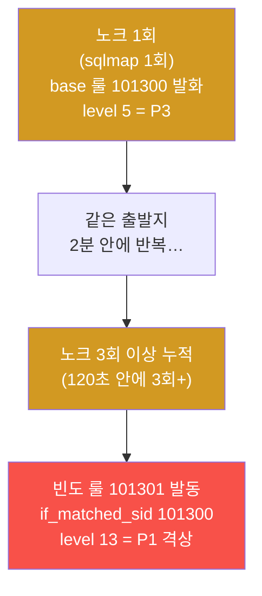
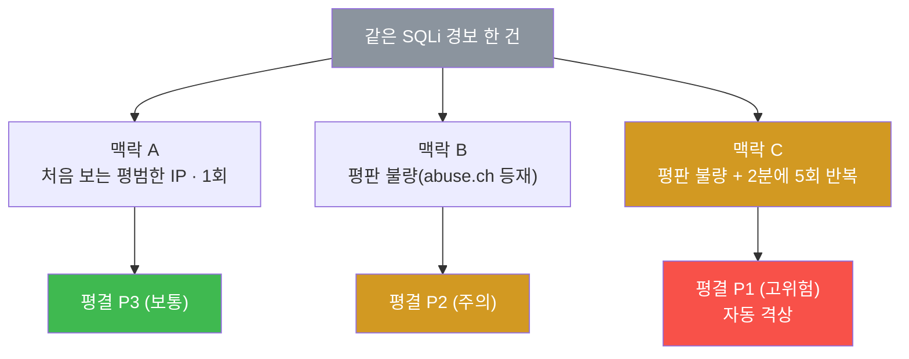
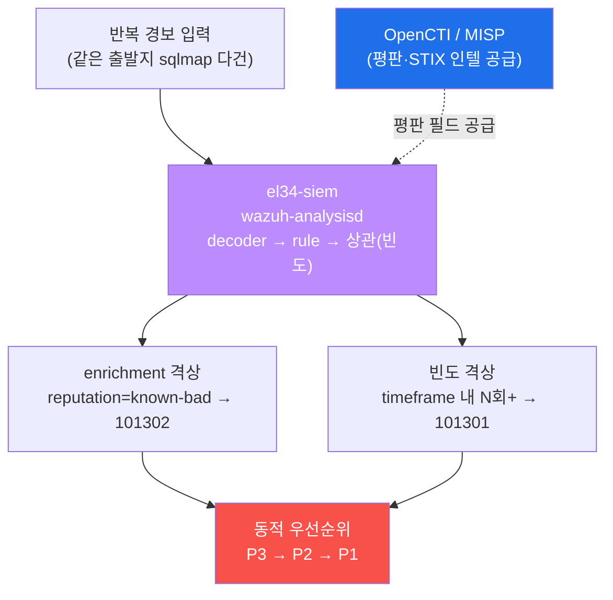
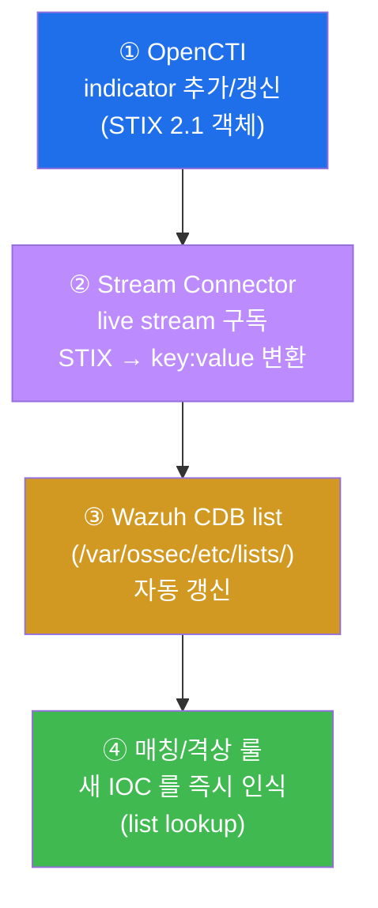

# Week 13 — 맥락이 평결을 바꾼다: enrichment·빈도로 경보 우선순위를 자동 격상하기

> **본 주차의 한 줄 요약**
>
> W12 에서 학생은 "이 IP·도구·해시가 알려진 악성인가(IOC 매칭)" 라는 **정적(static)**
> 질문에 답했다. 하지만 현장의 분석가는 더 어려운 질문을 받는다 — "똑같은 SQLi 경보가
> 하루에 수백 건 뜨는데, **이 한 건은 왜 더 위험한가?**" 답은 **맥락(context)** 이다. 같은
> 경보라도 출발지의 **평판(reputation)** 이 나쁘거나, 적대 국가에서 왔거나(**GeoIP**),
> 짧은 시간에 **반복(frequency)** 되면 위험도가 달라진다. 이번 주는 이 맥락을 경보에
> 자동으로 덧붙이는 **enrichment(맥락 보강)** 와, 반복을 잡아 우선순위를 끌어올리는
> **빈도 격상 룰(frequency / timeframe)** 을 직접 작성한다. 마지막엔 사람이 손으로 IOC 를
> 넣던 W12 의 한계를 **OpenCTI Stream Connector → Wazuh CDB 자동 동기화** 로 넘어선다.
>
> **운영자 한 줄 결론**: W12 의 평결이 "아느냐 / 모르느냐(0 또는 1)" 였다면, W13 의 평결은
> "얼마나 위험한가(P3 → P2 → P1)" 다. 경보 자체를 지우거나 만드는 게 아니라, **맥락으로
> 우선순위(level)를 동적으로 다시 매기는 것** — 이것이 alert fatigue(과다 경보) 시대의
> 관제 성숙도다.

---

## 학습 목표

본 주차 종료 시 학생은 다음 6가지를 **본인 손으로** 할 수 있어야 한다.

1. **enrichment(맥락 보강)** 가 무엇이며 "경보를 지우거나 만들지 않고 **우선순위만 바꾼다**"
   는 원칙을 설명하고, GeoIP·평판·자산 가치·빈도 네 가지 enrichment 신호를 각각 예로 든다.
2. Wazuh 상관 룰의 **`frequency` / `timeframe`** 문법과 **`if_matched_sid`**(특정 룰이
   먼저 발화한 뒤에만 발동) 의 의미를 설명하고, "120 초 안에 3 회 이상이면 critical 로
   격상" 룰(el34 rule id **101301**, level 13)을 직접 작성한다.
3. **평판 enrichment 격상 룰**(el34 rule id **101302**, level 12) 을 `local_rules.xml` 에
   써서, `reputation` 필드가 `known-bad` 인 경보를 상위 level 로 끌어올린다.
4. **빈도 룰은 한 줄로는 발화하지 않는다** 는 점을 이해하고, `wazuh-logtest` 에 **같은
   로그를 여러 줄(다중 라인)** 입력해 빈도 누적을 재현하여 격상을 검증한다. 라이브
   manager 는 재시작하지 않는다(공유 인프라 무중단).
5. **enrichment(평판/지역) + 빈도(반복)** 를 **결합** 하면 같은 경보가 P3 → P2 → P1 로
   동적으로 격상되는 우선순위 로직을 설명하고, 외부 공격자의 반복 SQLi 가 `alerts.json` 에
   **같은 출처 IP(10.20.30.202)로 보존되어 누적** 됨을 데이터로 확인한다.
6. 사람이 손으로 IOC 를 넣던 W12 의 한계를 **OpenCTI Stream Connector → Wazuh CDB 자동
   동기화** 가 어떻게 넘는지 그림으로 설명하고, el34 에서 가동 중인 connector 컨테이너를
   확인한 뒤, 커스텀 룰 잔재(101300/101301/101302)를 정리해 **베이스를 보존** 한다.

---

## 0. 용어 해설 (동적 우선순위 운영 입문)

이번 주에 처음 등장하거나 의미를 정확히 해야 하는 용어를 먼저 모아 둔다. 본문에서 다시
나올 때 막히면 이 표로 돌아오면 된다.

| 용어 | 영문 | 뜻 | 비유 |
|------|------|----|------|
| **enrichment** | enrichment / 맥락 보강 | raw 경보에 외부 지식(평판·지역·자산)을 덧붙여 판단을 돕는 것 | 신고 전화에 "그 번호 전과 있음" 메모를 붙이기 |
| **평판** | reputation | 어떤 IP·도메인·해시가 과거에 악성이었는지의 평가 | 사람의 전과 기록 |
| **GeoIP** | Geolocation by IP | IP 를 지리적 위치(국가·도시)로 변환하는 것 | 발신지 우편 소인 |
| **자산 가치** | asset value | 공격 대상이 조직에 얼마나 중요한지 | 털린 집이 금고방인지 창고인지 |
| **빈도** | frequency | 정해진 시간 안에 같은 일이 몇 번 일어났는가 | 같은 사람이 하루에 몇 번 문을 두드렸나 |
| **timeframe** | — | 빈도를 세는 시간 창(초 단위) | "최근 2분 동안" 의 그 2분 |
| **frequency 룰** | frequency rule | "timeframe 안에 N 회 이상이면 격상" 하는 상관 룰 | 누범 가중 기준 |
| **상관** | correlation | 흩어진 여러 경보를 묶어 하나의 더 큰 사건으로 보는 것 | 흩어진 목격담을 한 사건으로 엮기 |
| **if_matched_sid** | `<if_matched_sid>` | "지정한 rule id 가 (timeframe 안에) 먼저 발화한 뒤에만" 발동하는 조건 | "그 죄가 반복됐을 때만" 가중 |
| **if_matched_group** | `<if_matched_group>` | 특정 group 의 경보가 반복됐을 때 발동 | 같은 종류 범죄의 반복 |
| **same_source_ip** | `<same_source_ip/>` | 빈도를 "같은 출발지 IP" 로만 좁히는 조건 | "같은 사람" 이 반복했을 때만 |
| **same_field** | `<same_field>` | 빈도를 "같은 필드 값" 으로 좁히는 조건 | "같은 대상" 에 반복했을 때만 |
| **격상** | escalation | 평범한 level 의 경보를 더 높은 level 로 끌어올리는 것 | 경범죄 → 중범죄 재분류 |
| **동적 우선순위** | dynamic priority | 맥락에 따라 같은 경보의 우선순위를 실시간으로 다시 매기는 것 | 상황 따라 출동 순서 바꾸기 |
| **CDB list** | Constant DataBase list | Wazuh 가 빠르게 조회하는 key:value 목록(IOC·평판 저장) | 즉석 조회용 수배 명부 |
| **`<list lookup>`** | — | 룰 안에서 CDB list 를 조회해 필드를 판정하는 문법 | 명부에서 번호 대조 |
| **Stream Connector** | OpenCTI Stream Connector | OpenCTI 의 indicator 변경을 실시간 구독해 외부로 내보내는 모듈 | 수배 명부 자동 업데이트 봇 |
| **OpenCTI** | Open Cyber Threat Intelligence | STIX 기반 위협 인텔 저장·시각화 플랫폼 | 위협 정보 중앙 도서관 |
| **STIX** | Structured Threat Information eXpression | 위협 정보를 기계가 읽는 표준 객체 포맷 | 표준 양식의 수배 전단 |
| **IOC** | Indicator of Compromise | 침해 지표(악성 IP·해시·도메인·도구) | 수배범의 지문·차량번호 |
| **wazuh-logtest** | — | 로그를 넣어 decoder/rule 매치를 라이브 무중단으로 검증하는 도구 | 모의재판 |
| **P1 / P2 / P3** | Priority 1/2/3 | 운영자가 쓰는 사건 우선순위(P1 = 가장 급함) | 응급실 중증도 분류(triage) |

---

## 0.5 핵심 개념 — "같은 신고, 다른 출동"

위 용어 표는 한 줄 정의라서 신입생이 그림을 그리기엔 부족하다. 본 절에서는 W13 의 가장
중요한 직관 세 가지를 일상 비유로 풀어 둔다. 이 세 비유가 W13 전체를 관통한다.

### 0.5.1 enrichment — 신고 전화에 "전과 메모" 를 붙이는 일

경찰서에 "누가 우리 집 문을 두드린다" 는 신고가 들어왔다고 하자. 신고 내용 자체는 똑같다.
하지만 접수 담당자가 발신 번호를 조회해서 메모를 덧붙인다.

- **메모 A**: "이 번호는 처음 보는 번호입니다." → 일반 출동.
- **메모 B**: "이 번호는 지난달 절도 전과가 있습니다." → 우선 출동.
- **메모 C**: "이 번호는 전과가 있고, **방금 3 분 동안 다섯 집에 같은 신고가** 들어왔습니다."
  → 최우선 출동.

여기서 핵심은 **신고 내용 자체는 바뀌지 않았다** 는 것이다. 담당자가 붙인 **메모(맥락)** 만
달라졌고, 그 메모 때문에 **출동 순서(우선순위)** 가 바뀌었다.

이 "메모를 붙이는 일" 이 보안에서는 **enrichment(맥락 보강)** 다.

**enrichment** 는 raw 경보(예: "SQLi 시도 감지") 에 외부 지식을 덧붙여 판단을 돕는 것이다.
덧붙이는 지식에는 네 종류가 있다.

| 신고 비유 | enrichment 신호 | 무엇을 보는가 |
|-----------|-----------------|----------------|
| 발신 번호의 전과 | **평판(reputation)** | 출발지 IP 가 알려진 악성/봇넷인가 (VirusTotal·abuse.ch·MISP) |
| 발신지 우편 소인 | **GeoIP(지역)** | 출발지가 적대/이상 국가인가 (MaxMind GeoLite) |
| 털린 집이 금고방인가 | **자산 가치** | 공격 대상이 중요 시스템인가 (내부 CMDB) |
| 3 분에 다섯 번 | **빈도(frequency)** | 짧은 시간에 반복되는가 (Wazuh 상관) |

> **반드시 기억할 enrichment 의 철칙.** enrichment 는 경보를 **지우지도, 새로 만들지도
> 않는다.** 오직 **우선순위(level)만 바꾼다.** SQLi 경보는 어차피 한 건 있었고, enrichment
> 는 그 한 건을 "P3 로 둘 것이냐, P1 로 올릴 것이냐" 만 결정한다. 이 철칙을 잊으면
> "enrichment 로 오탐을 지운다" 같은 잘못된 기대를 하게 된다.

### 0.5.2 빈도 격상 — 한 번 두드리면 방문객, 다섯 번 두드리면 침입 시도

누군가 우리 집 문을 **한 번** 두드렸다면 택배일 수도, 길 묻는 사람일 수도 있다. 그러나 같은
사람이 **2 분 안에 다섯 번** 두드린다면 이야기가 다르다. 행위 하나하나는 "노크" 로 똑같지만,
**짧은 시간에 반복** 된다는 사실이 위험 신호다.

Wazuh 의 **빈도(frequency) 룰** 이 정확히 이 일을 한다. "정해진 시간(**timeframe**) 안에
같은 일이 N 번(**frequency**) 이상 일어나면 격상" 한다. 이때 두 개의 룰이 짝을 이룬다.

- **base 룰** — 노크 한 번을 잡는 평범한 룰(예: el34 rule id **101300**, level 5). sqlmap
  도구가 보이면 일단 잡지만, 한 번이니 우선순위는 낮다.
- **빈도 룰** — base 룰이 timeframe 안에 N 번 이상 발화했을 때만 발동하는 격상 룰(예:
  rule id **101301**, level 13). `<if_matched_sid>101300</if_matched_sid>` 가 "101300 이
  반복됐을 때만" 이라는 뜻이다.



> **꼭 알아둘 함정 — 빈도 룰은 "한 줄" 로는 절대 발화하지 않는다.** 빈도 룰의 본질은 "여러
> 번 누적" 이다. 그래서 `wazuh-logtest` 에 로그를 **한 줄만** 넣으면 base 룰(101300)만
> 발화하고 빈도 룰(101301)은 조용하다. 누적이 안 됐기 때문이다. 빈도 격상을 검증하려면
> **같은 로그를 여러 줄(다중 라인)** 입력해 timeframe 안의 반복을 재현해야 한다(§4.4, 실습 4).
> el34 에서는 sqlmap 로그를 **5 줄** 넣으면 frequency=3 임계를 넘겨 101301(level 13)이
> 발화한다.

### 0.5.3 동적 우선순위 — 응급실 중증도 분류(triage)

응급실에는 환자가 동시에 여러 명 들어온다. 의료진은 도착 순서대로 보지 않는다. **중증도
(triage)** 에 따라 가장 위급한 환자(P1) 부터 본다. 손가락 베인 환자는 한참 기다리고, 심정지
환자는 즉시 처치한다.

관제실의 분석가도 똑같다. 경보가 분당 수백 건 쏟아질 때, 도착 순서대로 보면 정작 중요한
것을 놓친다. 그래서 **맥락(enrichment + 빈도)으로 우선순위를 매겨 P1 부터** 본다.

| 응급실 triage | 관제 우선순위 | W13 의 격상 신호 |
|---------------|----------------|------------------|
| 경상 — 대기 | **P3 (보통)** | 처음 보는 평범한 IP, 1 회 |
| 중등도 — 곧 처치 | **P2 (주의)** | 평판 불량(101302) 또는 적대 국가(GeoIP) |
| 중증 — 즉시 | **P1 (고위험)** | 평판 불량 + 반복(101301 빈도 격상) |

핵심 통찰은 이것이다. **같은 SQLi 경보가 맥락에 따라 P3 도, P1 도 될 수 있다.** enrichment
와 빈도는 그 맥락을 자동으로 읽어 우선순위를 동적으로(=실시간으로 다시) 매기는 장치다. W12
의 정적 매칭("알려진 악성이냐") 을 넘어, "**얼마나 급한가**" 를 자동으로 분류하는 것이 W13 의
목표다.

---

## 1. 왜 정적 매칭(W12)만으로는 부족한가 — 같은 경보, 다른 평결

### 1.1 한 줄 답: 현실의 위험도는 "아느냐" 가 아니라 "맥락" 으로 갈리기 때문

W12 에서 학생은 IOC 매칭을 배웠다. "sqlmap 이라는 도구 = 알려진 악성" 이면 격상한다. 이건
**이분법(0 또는 1)** 이다. 하지만 현장에서는 같은 sqlmap 경보가 하루에 수백 건 뜬다. 전부
같은 level 로 격상하면 결국 전부 묻힌다(alert fatigue). 진짜 질문은 "이 도구가 악성이냐"
가 아니라 "**이 한 건이 왜 다른 건보다 위험한가**" 다.



세 경우 모두 "SQLi 경보 한 건" 으로 똑같다. 그러나 맥락이 평결을 갈랐다. CTI 운영의 성숙은
정적 매칭(W12)을 넘어 **enrichment(맥락 보강) + 빈도(반복)** 로 우선순위를 **동적** 으로
조정하는 데 있다. 그리고 그걸 손이 아니라 **자동화** 한다(§5).

### 1.2 왜 중요한가 — alert fatigue 시대의 생존 기술

현대 SIEM 은 분당 수천 건의 경보를 만든다. 사람이 전부 볼 수 없다. 모든 것을 높은 level 로
격상하면(W09 §5.4 의 경고) 고위험 알림이 홍수가 되어 오히려 진짜를 놓친다. 반대로 전부 낮게
두면 위험을 못 본다. **해법은 맥락 기반 동적 우선순위** — 평범한 건 낮게 두되, 맥락이 나쁜
소수만 자동으로 끌어올려 분석가의 시선을 그쪽으로 모으는 것이다. 이것이 본 주차가 다루는
운영 기술이다.

### 1.3 el34 에서 어떻게 — analysisd 가 상관까지 담당

W09 에서 배운 대로, el34 의 평결 엔진은 `el34-siem` 컨테이너의 **wazuh-analysisd**(판사) 다.
이 daemon 은 단순히 decoder→rule 을 돌릴 뿐 아니라, **여러 경보를 시간 창(timeframe) 안에서
세는 상관(correlation)** 까지 담당한다. 즉 빈도 격상도 analysisd 의 일이다. enrichment 의
인텔 소스(평판·STIX)는 같은 호스트의 **OpenCTI / MISP 스택** 이 공급한다.



### 1.4 한계 — 맥락이 틀리면 우선순위도 틀린다

enrichment 와 빈도는 강력하지만 입력이 부정확하면 오히려 해롭다. 평판 데이터가 낡았으면
멀쩡한 IP 를 P1 로 올리고(오탐), GeoIP DB 가 부정확하면 엉뚱한 국가로 분류한다. 빈도 룰의
timeframe 이 너무 짧으면 느린 공격(low-and-slow) 을 놓치고, 너무 길면 정상 트래픽까지
격상한다. 그래서 enrichment 소스의 신선도 관리와 빈도 임계값 튜닝이 운영의 핵심 부담이다.

---

## 2. enrichment — 경보에 맥락을 붙이는 네 가지 신호

### 2.1 한 줄 정의 — raw 경보에 외부 지식을 덧붙여 판단을 돕는 것

**enrichment(맥락 보강)** 는 출발지 IP·공격 유형만 담긴 raw 경보에, 외부에서 가져온 지식
(평판·지역·자산·빈도)을 덧붙여 위험도 판단을 정밀하게 만드는 과정이다. §0.5.1 의 "신고
전화에 전과 메모를 붙이는 일" 이다.

### 2.2 네 가지 enrichment 신호 상세

| enrichment | 출처(예) | 무엇을 보는가 | 격상 신호의 의미 |
|------------|----------|----------------|------------------|
| **GeoIP(지역)** | MaxMind GeoLite2 | 출발지 IP → 국가/도시 | 우리 서비스를 쓸 일 없는 적대/이상 국가에서 온 공격 |
| **평판(reputation)** | VirusTotal · abuse.ch · MISP | 그 IP/해시가 과거 악성이었나 | 이미 봇넷·C2 로 등재된 출발지 |
| **자산 가치** | 내부 CMDB | 대상이 얼마나 중요한가 | 결제 DB·관리자 콘솔 같은 핵심 자산 대상 |
| **빈도(frequency)** | Wazuh 상관(analysisd) | 짧은 시간 반복 횟수 | 단발이 아닌 집요한 반복 시도 |

이 중 GeoIP·평판·자산 가치는 **외부 지식(static knowledge)** 을 붙이는 것이고, 빈도는
**시간에 따른 행위 패턴** 을 보는 것이다. 네 신호는 서로 독립이므로 결합할수록 판단이
정밀해진다(§5).

### 2.3 el34 에서 어떻게 — Wazuh 가 맥락을 더하는 두 경로

el34 의 Wazuh 가 경보에 맥락을 더하는 길은 두 가지다.

- **GeoLocation 자동 부착** — Wazuh manager 에 GeoIP DB 를 설정하면, 출발지 IP 를 가진
  alert 에 `GeoLocation`(국가·좌표) 필드가 자동으로 붙는다. 그러면 룰이 그 필드를 보고
  "적대 국가면 격상" 할 수 있다.
- **CDB list 평판 조회** — W12 에서 만든 IOC 저장소처럼, 평판 IOC 를 CDB list 에 넣고 룰
  안에서 `<list lookup>` 으로 출발지 IP 를 조회한다. 등재돼 있으면 `reputation` 같은 맥락
  필드가 채워지고, 룰이 그걸 보고 격상한다.

본 주차 실습에서는 이 평판 맥락을 단순화해, 경보에 이미 `reputation` 필드가 붙어 있다고
가정하고 그 값을 보고 격상하는 룰(101302)을 직접 작성한다(§4, 실습 2).

### 2.4 한계 — enrichment 는 우선순위만, 판단은 사람이

enrichment 가 P1 을 매겼다고 그 경보가 100% 진짜 침해라는 보장은 아니다. 평판이 나쁜
IP 에서 와도 오탐일 수 있고, 평범한 IP 가 신종 공격일 수도 있다. enrichment 는 **분석가가
무엇을 먼저 볼지를 정해주는 분류기** 이지, 최종 판단을 대신하지 않는다. P1 은 "가장 먼저
조사하라" 는 뜻이지 "확정 침해" 가 아니다.

---

## 3. 빈도 격상 — frequency / timeframe (이번 주의 핵심)

### 3.1 한 줄 정의 — "정해진 시간 안에 N 회 이상이면 격상"

Wazuh 의 상관 룰은 **`timeframe`**(시간 창, 초 단위) 안에 어떤 룰/그룹이 **`frequency`**(횟수)
이상 매칭되면 더 높은 level 로 격상한다. §0.5.2 의 "한 번 노크는 방문객, 다섯 번 노크는
침입 시도" 다.

### 3.2 base 룰 + 빈도 룰의 두 단 구조

빈도 격상은 항상 **두 개의 룰이 짝** 을 이룬다. 먼저 한 건을 잡는 base 룰이 있고, 그 base
룰의 반복을 세는 빈도 룰이 있다.

```xml
<group name="edu_w13,">
  <!-- ① base 룰: sqlmap 도구 1회를 평범하게 잡는다 -->
  <rule id="101300" level="5">
    <decoded_as>json</decoded_as>
    <field name="tool">sqlmap</field>
    <description>EDU W13 base - known-bad tool</description>
  </rule>

  <!-- ② 빈도 룰: 위 base(101300)가 120초 안에 3회 이상 발화하면 격상 -->
  <rule id="101301" level="13" frequency="3" timeframe="120">
    <if_matched_sid>101300</if_matched_sid>
    <description>EDU W13 - repeated known-bad tool, escalate to critical</description>
  </rule>
</group>
```

각 요소의 의미를 정확히 짚는다.

- `id="101300" level="5"` — base 룰. el34 의 사용자 룰 네임스페이스는 **1013xx**(W13)이며,
  level 5 는 낮은 우선순위(단발이라 P3)다.
- `<decoded_as>json</decoded_as>` — "json decoder 가 파싱한 로그만" 으로 대상을 좁힌다
  (W09 §4.3 의 json decoder 가 JSON 키를 그대로 필드로 만든다).
- `<field name="tool">sqlmap</field>` — 그 로그의 `tool` 필드 값이 `sqlmap` 일 때 매치.
- `id="101301" level="13"` — 빈도 격상 룰. level 13 은 고위험(P1)이다.
- `frequency="3" timeframe="120"` — "**120 초 안에 3 회 이상**" 이 임계. 이 임계를 넘어야
  발화한다.
- `<if_matched_sid>101300</if_matched_sid>` — "**101300 이 그 시간 창 안에 반복** 됐을 때만"
  발동. 즉 빈도 룰은 base 룰의 반복을 세는 것이다.

### 3.3 빈도를 "같은 출발지" 로 좁히기 — same_source_ip

위 룰만으로는 "서로 다른 IP 에서 한 번씩 온 3 건" 도 격상된다. 보통은 그게 아니라 "**같은
출발지가** 반복" 했을 때만 격상하고 싶다. 그럴 때 좁히는 조건을 더한다.

- `<same_source_ip/>` — 빈도를 "같은 출발지 IP" 로만 센다. (예: "같은 사람" 이 다섯 번
  두드렸을 때만)
- `<same_field>tool</same_field>` — 빈도를 "같은 필드 값" 으로 좁힌다. (예: "같은 도구" 의
  반복)
- `<if_matched_group>web|ids</if_matched_group>` — 특정 rule 대신 **그룹 단위** 반복으로
  센다. (예: web/ids 계열 탐지가 반복될 때)

이 좁히기 조건이 빈도 룰을 정밀하게 만든다. el34 는 출발지 IP 를 보존(SNAT 없음, §7)하므로
`same_source_ip` 가 정확히 동작한다.

### 3.4 el34 에서 어떻게 — 다중 라인 logtest 로 빈도 발화 재현

빈도 룰의 검증에는 함정이 있다. **`wazuh-logtest` 에 로그를 한 줄만 넣으면 빈도 룰은
발화하지 않는다**(§0.5.2 의 함정). 누적이 안 됐기 때문이다. el34 에서는 같은 로그를 **여러
줄(다중 라인)** 표준입력으로 넣어 timeframe 안의 반복을 재현한다.

```bash
# 같은 IOC(sqlmap)를 5줄 → 빈도 룰이 임계(frequency=3)를 넘겨 격상 (wazuh-logtest로 검증)
printf '%s\n%s\n%s\n%s\n%s\n' \
  '{"tool":"sqlmap"}' '{"tool":"sqlmap"}' '{"tool":"sqlmap"}' \
  '{"tool":"sqlmap"}' '{"tool":"sqlmap"}' \
  | sudo /var/ossec/bin/wazuh-logtest
#  → id 101301, level 13, frequency 3, "Alert to be generated."  (반복 누적 → 격상!)
```

처음 몇 줄은 base 룰 101300(level 5)만 발화하다가, 누적이 frequency=3 임계를 넘는 순간
빈도 룰 101301(level 13)이 발화한다. 출력의 `frequency` 표시와 level 13 이 격상이
일어났다는 증거다. `wazuh-logtest` 가 룰셋을 새로 읽어 별도 테스트 인스턴스에서 돌리므로
라이브 analysisd 는 건드리지 않는다(W09 §0.5.3).

> **공유 인프라 수칙(반드시 지킬 것).** el34-siem 은 모든 학생이 함께 쓰는 단일 manager 다.
> 빈도 룰의 **라이브 적용은 `wazuh-control restart` 가 필요** 하지만, 재시작하면 다른
> 학생의 ingest 가 끊긴다. 그래서 공유 el34 에서는 **`wazuh-logtest` 로 격상 로직만 검증** 하고,
> 끝나면 룰을 **그룹째 삭제** 해 베이스 `local_rules.xml` 을 원상복구한다(§6, 실습 9).

### 3.5 한계 — timeframe 튜닝이 곧 탐지 품질

빈도 룰의 품질은 임계값(frequency / timeframe)에 달려 있다. timeframe 이 너무 짧으면(예:
10 초) 분산 시도나 느린 공격(low-and-slow)을 놓치고, 너무 길면(예: 1 시간) 정상적인 반복
요청까지 격상해 오탐을 만든다. 또한 빈도 룰은 본질적으로 **누적이 일어난 뒤에야** 발화하므로,
첫 1~2 회 시점에는 격상되지 않는다(탐지 지연). 임계값은 환경의 정상 트래픽 기준선(baseline)
을 보고 정해야 한다.

---

## 4. 평판 enrichment 격상 — 맥락 필드를 룰이 본다

### 4.1 한 줄 정의 — enrichment 로 붙은 평판 필드를 보고 격상

빈도 외에 **평판(reputation) 맥락** 도 강력한 격상 신호다. enrichment 단계에서 경보에 붙은
`reputation` 필드를 룰이 읽어, 값이 나쁘면(`known-bad`) level 을 끌어올린다.

```xml
<rule id="101302" level="12">
  <decoded_as>json</decoded_as>
  <field name="reputation">known-bad</field>   <!-- enrichment 결과 필드 -->
  <description>EDU W13 - bad-reputation source, escalate</description>
</rule>
```

- `id="101302" level="12"` — 평판 격상 룰. level 12 는 고위험(P2 이상)이다.
- `<field name="reputation">known-bad</field>` — 경보에 붙은 `reputation` 필드가
  `known-bad` 일 때만 매치. 이 필드는 enrichment(CDB 평판 조회 또는 인텔 연동)가 채운 것이다.

### 4.2 왜 빈도와 별개인가 — 단발이라도 위험한 출발지

빈도 격상은 "반복" 을 보지만, 평판 격상은 "**단 한 번이라도** 알려진 악성 출발지면 위험" 이라는
관점이다. abuse.ch 에 등재된 봇넷 IP 라면 첫 시도부터 P2 로 봐야 한다. 그래서 평판 룰에는
frequency 가 없다 — 한 줄로도 발화한다.

### 4.3 el34 에서 어떻게 — reputation 필드 격상 + logtest 검증

```bash
# (1) 백업
sudo cp /var/ossec/etc/rules/local_rules.xml /tmp/w13_lr.bak

# (2) 평판 격상 룰 추가 (id 네임스페이스: W13 = 1013xx)
sudo bash -c 'cat >> /var/ossec/etc/rules/local_rules.xml <<EOF
<group name="edu_w13,">
  <rule id="101302" level="12">
    <decoded_as>json</decoded_as>
    <field name="reputation">known-bad</field>
    <description>EDU W13 - bad-reputation source, escalate</description>
  </rule>
</group>
EOF'

# (3) 발화 검증 — 평판 룰은 한 줄로도 발화(빈도 룰과 달리 누적 불필요)
echo '{"reputation":"known-bad","src_ip":"9.9.9.9"}' | sudo /var/ossec/bin/wazuh-logtest
#   → Phase 3: id 101302, level 12, "Alert to be generated."

# (4) self-clean — 베이스 원상복구
sudo cp /tmp/w13_lr.bak /var/ossec/etc/rules/local_rules.xml; sudo rm -f /tmp/w13_lr.bak
```

운영에서는 `reputation` 필드를 사람이 손으로 넣지 않는다. **CDB list(평판 IOC) + `<list
lookup>`** 으로 출발지 IP 를 조회해 자동으로 평판을 판정한다. 실습은 그 결과 필드만 단순화해
격상 로직을 검증하는 것이다.

### 4.4 한계 — 평판은 시간이 지나면 낡는다

평판 데이터는 살아 움직인다. 어제의 악성 IP 가 오늘은 정리(takedown)됐을 수 있고, 멀쩡하던
클라우드 IP 가 오늘 봇넷에 감염될 수 있다. 그래서 평판 enrichment 는 **신선도(freshness)**
관리가 생명이다. 이 신선도를 사람이 손으로 유지하는 건 불가능에 가깝다 — 그래서 자동화가
필요하다(§5).

---

## 5. 자동화 — OpenCTI Stream Connector → Wazuh CDB 동기화

### 5.1 한 줄 정의 — 인텔 변경을 실시간 구독해 SIEM 으로 내려보낸다

W12 에서 학생은 IOC 를 **손으로** CDB list 에 넣었다. 이 방식은 인텔이 매일 수천 건씩
바뀌는 현실에서는 불가능하다. 운영에서는 **OpenCTI Stream Connector**(또는 Python
스크립트)가 OpenCTI 의 indicator 변경을 **실시간 구독(live stream)** 해 Wazuh CDB list 로
**자동 동기화** 한다.

### 5.2 자동 동기화 파이프라인



각 단계를 따라가 보자.

1. **OpenCTI** 에 새 위협 indicator 가 추가되거나 갱신된다(STIX 2.1 객체로 저장).
2. **Stream Connector** 가 OpenCTI 의 변경 스트림을 실시간 구독해, STIX 객체를 Wazuh 가
   읽는 **key:value** 형식으로 변환한다.
3. 변환된 IOC 가 **Wazuh CDB list**(`/var/ossec/etc/lists/`) 에 자동으로 반영된다.
4. CDB 를 조회하는 **매칭/격상 룰** 이 별도 작업 없이 **새 IOC 를 즉시 인식** 한다.

### 5.3 el34 에서 어떻게 — 가동 중인 connector 확인

el34 에는 OpenCTI 의 connector 컨테이너들(MITRE, import/export STIX, opencti 본체)이
가동 중이다.

```bash
docker ps --format '{{.Names}}' | grep -iE 'connector' | head
#  el34-connector-mitre-1, el34-connector-import-* 등이 보인다
```

이 그림을 이해하면 "인텔이 들어오면 SIEM 이 자동으로 알아본다" 는 운영 자동화의 끝그림이
보인다. W12 의 수작업(IOC 를 손으로 CDB 에 입력) → W13 의 자동화(connector 가 실시간
동기화) 로 이어지는 흐름이다.

### 5.4 한계 — 자동화는 신뢰할 수 있는 소스 위에서만

자동 동기화는 편리하지만, 입력 인텔의 품질이 곧 SIEM 의 품질이 된다. 신뢰도 낮은 피드를
무비판적으로 동기화하면 오탐 IOC 가 그대로 격상 룰을 발화시켜 alert fatigue 를 키운다. 그래서
운영에서는 피드의 신뢰도(confidence) 점수로 필터링하고, 동기화 전에 검증 단계를 둔다.

---

## 6. 공유 인프라 보존 — 커스텀 룰은 검증 후 반드시 정리

### 6.1 한 줄 정의 — 내가 심은 룰은 내가 지운다

el34-siem 은 모든 학생이 함께 쓰는 단일 manager 다(W09 §0.5.3, §6.4). 본 주차에서 만드는
세 커스텀 룰(101300 base / 101301 빈도 / 101302 평판)은 **`wazuh-logtest` 로만 검증** 하고,
끝나면 **그룹째 삭제** 해 베이스 `local_rules.xml` 을 원상복구한다.

### 6.2 안전 수칙 정리

- **id 네임스페이스.** 100000 미만은 Wazuh 예약이라 사용 금지. 본 트랙 W13 은 **1013xx**
  (101300/101301/101302)로 격리하고 끝나면 그룹째 삭제한다.
- **라이브 무재시작.** 빈도 룰의 실제 운영 적용은 `wazuh-control restart` 가 필요하지만,
  공유 el34 에서 재시작하면 다른 학생의 ingest 가 끊긴다. 그래서 logtest 검증만 한다.
- **XML 문법 주의.** local_rules.xml 에 문법 오류가 있으면 analysisd 가 룰셋 로딩에
  실패한다. `wazuh-logtest` 가 시작 시 룰셋 로드 에러를 보여주므로 검증 단계에서 먼저 잡는다.
- **백업·복원.** 작업 전 `cp ... /tmp/w13_lr.bak` 로 백업하고, 끝나면 cp 복원 후 백업
  파일까지 지운다. 잔재가 남으면 다른 학생의 평결에 영향을 준다(실습 9 에서 잔재 0 확인).

---

## 7. 출처 보존 — 빈도 상관의 전제

### 7.1 한 줄 정의 — 같은 출발지를 같은 출발지로 인식해야 빈도가 센다

빈도 룰의 `same_source_ip`(§3.3) 가 동작하려면 같은 공격자의 여러 경보가 **모두 같은 출처
IP** 로 기록돼야 한다. 만약 중간 장비가 출처를 바꾸면(SNAT) 같은 공격자가 매번 다른 IP 로
보여 빈도가 세어지지 않는다.

### 7.2 el34 에서 어떻게 — SNAT 없이 출처 보존

W09 §7.2 에서 확인했듯, **el34 의 fw 는 SNAT 를 하지 않아** 공격자 출처 IP 가 ips·web·siem
전 계층에 그대로 보존된다(내부 공격자 10.20.30.202, 외부 공격자 192.168.0.202). 그래서 외부
공격자가 같은 SQLi 를 반복하면 `alerts.json` 에 **같은 출처 IP 로 누적** 되고, 이 누적이 곧
빈도 룰의 입력원이 된다.

```bash
# 외부 공격자가 같은 출발지에서 반복 SQLi → alerts.json 에 같은 출처로 누적 확인
docker exec el34-siem sh -c 'tail -400 /var/ossec/logs/alerts/alerts.json \
  | jq -rc "select(.rule.groups|index(\"ids\"))|.data.src_ip" | sort | uniq -c | tail -3'
#   →   N  "10.20.30.202"   (같은 출처가 N건 누적 = 빈도 상관의 입력)
```

출력의 `10.20.30.202` 가 N 건으로 묶여 나오는 것이 "출처가 보존되어 같은 공격자로 인식됐다"
는 증거다. 이 보존이 깨지면(SNAT) 빈도 상관과 W08 의 다계층 상관이 모두 무너진다.

### 7.3 한계 — 분산 공격은 빈도로 안 잡힌다

출처 보존은 "같은 IP 의 반복" 을 잡게 해준다. 그러나 공격자가 여러 IP(봇넷)로 분산하면 각
IP 는 한 번씩만 보여 `same_source_ip` 빈도 룰을 우회한다. 이 경우엔 출처 IP 대신 **공통
페이로드·대상·도구** 를 기준으로 묶거나(`same_field`/`if_matched_group`), 평판 enrichment
(§4)로 개별 봇넷 IP 를 잡아야 한다. 빈도와 enrichment 가 서로를 보완하는 이유다.

---

## 8. 실습 안내 (총 9 미션)

각 실습은 **4축 설명** 을 포함한다. 모든 명령은 el34 호스트(`ssh ccc@192.168.0.80`)에서
`docker exec el34-<comp>` 로 실행한다. 격상 룰은 **logtest 로만 검증**(라이브 restart 금지)
하고 끝나면 삭제한다(공유 인프라 보존).

### 실습 1 — 상관 엔진과 인텔 스택이 살아 있는가 (점검)

> **이 실습을 왜 하는가?**
> 동적 격상의 두 기반은 (1) 빈도 상관을 돌리는 엔진(analysisd)과 (2) enrichment 인텔을
> 공급하는 플랫폼(OpenCTI/connector)이다. 둘 중 하나라도 죽어 있으면 이번 주의 격상은
> 일어나지 않는다(§1.3).
>
> **이걸 하면 무엇을 알 수 있는가?**
> - `wazuh-control status | grep analysisd` 로 상관 엔진(판사)의 running 여부
> - `docker ps | grep -ciE 'opencti|connector'` 로 인텔/자동화 스택의 가동 수
>
> **결과 해석**
> 정상: `wazuh-analysisd is running` + OpenCTI/connector 컨테이너가 1개 이상 가동.
> 비정상: analysisd 가 멈췄으면 빈도 상관 자체가 안 도는 것 → 최우선 복구(W09 §2.2).
>
> **실전 활용**
> "우리 SIEM 이 동적 우선순위를 매길 준비가 됐나?" 를 30 초에 답하는 운영 인수 점검.

### 실습 2 — 평판 enrichment 격상 룰 (id 101302, manipulation)

> **이 실습을 왜 하는가?**
> enrichment 의 가장 직접적인 형태 — "출발지 평판이 나쁘면 같은 경보라도 올린다" 를 직접
> 룰로 구현한다(§4). enrichment 가 경보를 지우지 않고 우선순위만 바꾼다는 철칙을 손으로
> 확인한다.
>
> **이걸 하면 무엇을 알 수 있는가?**
> - `local_rules.xml` 에 `decoded_as`/`field` 매치 룰(id 101302, level 12)을 쓰는 법
> - 평판 룰은 빈도 룰과 달리 **한 줄로도 발화** 한다는 점(누적 불필요)
> - 검증 후 cp 복원으로 베이스를 보존하는 self-clean
>
> **결과 해석**
> 정상: logtest Phase 3 에 rule `101302` level 12 가 "Alert to be generated" 로 발화하고,
> 정리 후 잔재가 0 이다. 비정상: 발화 안 하면 `reputation` 필드명/값 또는 `decoded_as`
> 오타를 점검.
>
> **실전 활용**
> Purple Team 의 표준 산출물 — 평판 인텔을 우선순위에 반영하는 격상 룰. 단, 공유 인프라에선
> logtest 검증 후 반드시 정리한다.

### 실습 3 — 반복 IOC 공격으로 빈도 신호 만들기 (recon)

> **이 실습을 왜 하는가?**
> 빈도 룰의 입력은 "같은 출발지의 반복" 이다. 그 입력을 실제로 만들어내야 빈도 격상을
> 논할 수 있다(§3, §7). 외부 공격자에서 같은 도구로 반복 공격을 흘려보낸다.
>
> **이걸 하면 무엇을 알 수 있는가?**
> - 같은 출발지(10.20.30.202)에서 sqlmap 을 반복하면 web 의 modsec audit 에 여러 건 남음
> - 단발이면 P3 지만 반복되면 빈도 룰의 격상 대상이 된다는 직관
>
> **결과 해석**
> 정상: audit 로그의 sqlmap 카운트가 여러 건(반복 횟수만큼). 비정상: 0 이면 공격이 web 에
> 도달 못 한 것 → fw/ips 경로 또는 Host 헤더 점검.
>
> **실전 활용**
> 빈도 탐지를 검증하기 전, "반복 신호" 를 합성으로 만드는 detection validation 의 준비 단계.

### 실습 4 — 빈도 격상 룰: 반복되면 critical (id 101301, manipulation)

> **이 실습을 왜 하는가?**
> 이번 주의 핵심 — "120 초 안에 3 회 이상이면 격상" 룰을 직접 쓰고, **다중 라인 입력** 으로
> 빈도 누적을 재현해 격상을 검증한다(§3.4). 빈도 룰이 한 줄로는 안 뜬다는 함정을 몸으로
> 익힌다.
>
> **이걸 하면 무엇을 알 수 있는가?**
> - base 룰(101300, level 5) + 빈도 룰(101301, level 13, frequency=3 timeframe=120)의
>   두 단 구조
> - `if_matched_sid` 로 base 의 반복을 세는 법, `same_source_ip` 로 "같은 출처" 만 좁히는 법
> - `wazuh-logtest` 에 같은 로그를 **5 줄** 넣어야 frequency 임계를 넘겨 101301 이 발화함
>
> **결과 해석**
> 정상: logtest 출력에 rule `101301` level 13 + `frequency` 표시가 떠 빈도 격상이 발화.
> 비정상: 101300(level 5)만 보이면 입력 줄 수가 임계 미만이거나 frequency/timeframe 오타.
>
> **실전 활용**
> brute-force·반복 익스플로잇·스캔 같은 "반복형 위협" 을 자동 격상하는 핵심 룰 작성법. 공유
> 인프라에선 logtest 검증 후 그룹째 삭제한다.

### 실습 5 — 결합 분석: enrichment + 빈도 → 동적 우선순위 (analysis)

> **이 실습을 왜 하는가?**
> 두 신호를 따로 본 뒤, 결합하면 평결이 어떻게 바뀌는지 정리한다(§5, §0.5.3 의 triage).
> "같은 경보가 맥락에 따라 P3 도 P1 도 된다" 를 명시적으로 묶는다.
>
> **이걸 하면 무엇을 알 수 있는가?**
> - 단발 평범 → P3 / 평판 불량(101302) → P2 / 평판 불량 + 반복(101301) → P1 의 격상 사다리
> - enrichment(맥락)와 빈도(반복)가 독립 신호라 결합할수록 우선순위가 올라간다는 논리
>
> **결과 해석**
> 정상: P3 → P2 → P1 의 단계가 맥락 신호와 매핑되어 정리된다.
>
> **실전 활용**
> 관제 triage 정책 문서의 기본 골격 — 어떤 맥락 조합을 어떤 우선순위로 볼지 정하는 운영 규칙.

### 실습 6 — 자동화: OpenCTI Stream Connector → CDB (survey)

> **이 실습을 왜 하는가?**
> 손으로 IOC 를 넣던 W12 의 한계를 자동화가 어떻게 넘는지 가동 중인 connector 로 확인한다
> (§5). "인텔이 들어오면 SIEM 이 자동으로 알아본다" 는 끝그림을 본다.
>
> **이걸 하면 무엇을 알 수 있는가?**
> - el34 에서 가동 중인 OpenCTI connector 컨테이너(MITRE/import/export 등)
> - OpenCTI indicator → Stream Connector(STIX→key:value) → Wazuh CDB → 매칭 룰의 흐름
>
> **결과 해석**
> 정상: `connector` 이름의 컨테이너가 하나 이상 가동. 비정상: 없으면 OpenCTI 스택 점검(W12).
>
> **실전 활용**
> 인텔 운영의 자동화 성숙도 점검 — 수작업 동기화에서 실시간 자동 동기화로 넘어가는 기준선.

### 실습 7 — 반복 공격이 같은 출처로 수렴 (출처 보존, detect)

> **이 실습을 왜 하는가?**
> 빈도 상관이 책상 위 이론이 아니라 실제 데이터로 성립함을 증명한다(§7). 출처 보존이
> `same_source_ip` 빈도 룰의 전제임을 데이터로 확인한다.
>
> **이걸 하면 무엇을 알 수 있는가?**
> - 외부 SQLi 반복 → Suricata → ips agent → manager → `alerts.json` ids 그룹의 누적
> - 출처 IP(10.20.30.202)가 보존되어 같은 출발지로 N 건 묶임 → 빈도의 입력원
>
> **결과 해석**
> 정상: alerts.json ids 그룹에서 `10.20.30.202` 가 여러 건으로 집계. `sleep 8` 후에도 안
> 보이면 ips agent 수집 또는 analysisd 점검(W09 §7.3).
>
> **실전 활용**
> "우리 빈도 룰이 같은 공격자를 같은 공격자로 보고 있나?" 를 합성 공격으로 검증하는 방법.

### 실습 8 — 종합 보고서: 맥락이 평결을 바꾼다 (report)

> **이 실습을 왜 하는가?**
> 실습 1~7 을 "동적 우선순위" 관점으로 묶어 운영 보고서로 정리한다. "막았다" 가 아니라
> "어떤 맥락이 우선순위를 어떻게 바꿨다" 를 증거로 쓰는 훈련이다.
>
> **이걸 하면 무엇을 알 수 있는가?**
> - enrichment(평판/지역/자산) + 빈도(frequency/timeframe) + 결합(P3→P2→P1) + 자동화
>   (Stream Connector) + 출처 보존을 한 장으로 종합하는 법
>
> **결과 해석**
> 정상: 보고서에 평판 격상(101302)·빈도 격상(101301)·결합 P1·자동화 흐름이 모두 포함된다.
>
> **실전 활용**
> 관제 운영 보고·triage 정책 수립의 기본 양식 — 단계별 격상 근거를 증거로 배치하는 습관.

### 실습 9 — 공유 manager 베이스 보존 (정리 확인, cleanup)

> **이 실습을 왜 하는가?**
> el34-siem 은 공유 자원이다(§6). 커스텀 룰 잔재(101300/101301/101302)가 남으면 다른
> 학생의 평결에 영향을 준다.
>
> **이걸 하면 무엇을 알 수 있는가?**
> - local_rules.xml 에 101300/101301/101302 잔재가 0 인지
> - 백업 파일(/tmp/w13_lr.bak)이 정리됐고 라이브 manager 가 무중단(무재시작)인지
>
> **결과 해석**
> 정상: 세 룰 잔재 0 + `check done`. 잔재가 있으면 즉시 cp 복원으로 제거.
>
> **실전 활용**
> 공유 SIEM 운영의 기본 의무 — "내가 심은 것은 내가 정리한다". 라이브 룰셋과 베이스 파일을
> 항상 원래 상태로 되돌린다.

---

## 9. 핵심 정리 (1줄씩)

1. **같은 경보, 다른 평결** — W12 의 정적 매칭(아느냐/모르느냐)을 넘어, 맥락으로 우선순위를
   동적으로 매긴다(P3→P2→P1).
2. **enrichment 의 철칙** — 평판·GeoIP·자산·빈도를 덧붙이되, 경보를 지우거나 만들지 않고
   **우선순위(level)만** 바꾼다.
3. **빈도 격상** — `frequency`/`timeframe` + `if_matched_sid` 로 "timeframe 안 N 회+" 를
   격상(base 101300 level5 → 빈도 101301 level13). `same_source_ip` 로 같은 출처만 좁힌다.
4. **빈도 룰의 함정** — 한 줄로는 안 뜬다. `wazuh-logtest` 에 **다중 라인(5 줄)** 을 넣어
   누적을 재현해야 101301 이 발화한다.
5. **평판 격상** — `reputation=known-bad` 면 level 12(101302). 반복 불필요(한 줄로 발화).
   enrichment + 빈도를 결합하면 즉시 P1.
6. **자동화와 보존** — OpenCTI Stream Connector 가 인텔을 실시간 CDB 동기화. el34 는 출처
   보존(SNAT 없음)으로 빈도 상관이 성립. 커스텀 룰은 logtest 검증 후 그룹째 삭제(공유 보존).

---

## 10. 다음 주차 (W14) 예고 — 기다리지 말고 사냥하라(Threat Hunting)

W13 까지는 경보가 **오면** 반응했다(enrichment·빈도로 우선순위를 매겨 P1 부터 처리). W14 는
한 걸음 더 나아가 **능동(proactive)** 이다. 경보를 기다리지 않고, 분석가가 먼저 **가설을
세우고**("이 호스트에 인코딩된 셸이 숨어 있지 않을까?"), **데이터를 직접 질의** 하며
(osquery / Wazuh / sysmon), 발견을 **Sighting** 으로 남긴다. 즉 W13 의 "경보 우선순위 자동
조정" 에서 W14 의 "경보 없이도 위협을 먼저 찾아내는 헌팅" 으로 관점이 전환된다.

- **주제**: Threat Hunting — 가설 기반 능동 탐색, osquery/Wazuh/sysmon 질의, Sighting 기록
- **실습 환경**: `el34-siem` + 호스트 가시화(osquery/sysmon) + OpenCTI
- **핵심 도구**: osquery(OS 를 SQL 로 질의), Wazuh 검색, sysmon(이벤트 스트림), OpenCTI Sighting
- **선수 학습**: 본 주차 §3(빈도 상관)·§4(평판 enrichment)·§7(출처 보존) 복습
