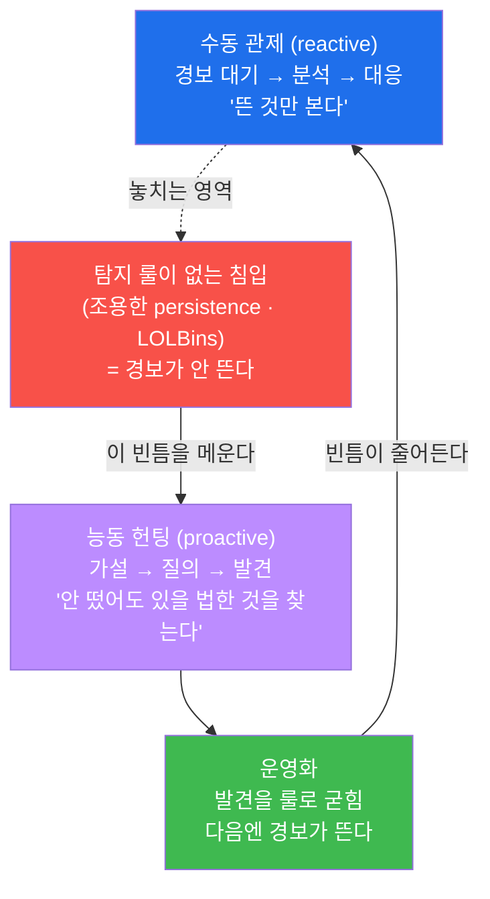
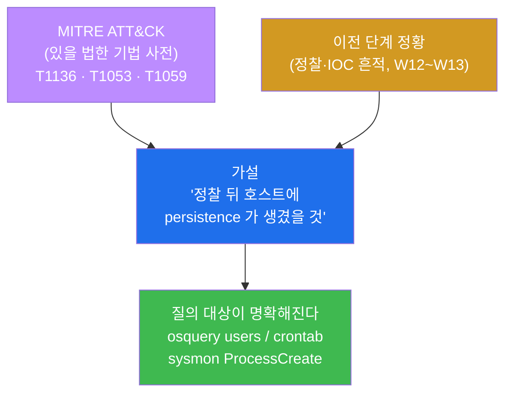
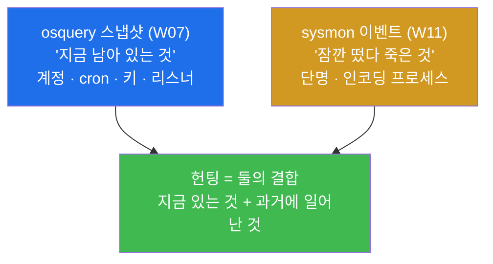
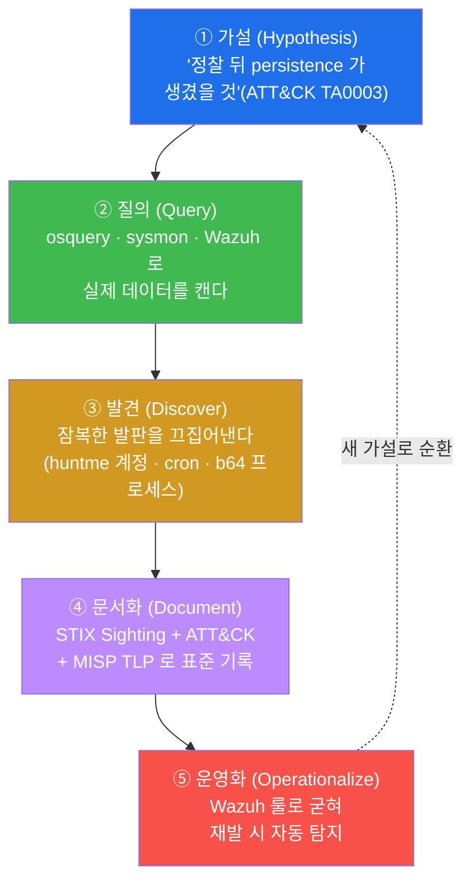

# Week 14 — 기다리지 말고 사냥하라: Threat Hunting (가설 → 질의 → Sighting → 운영화)

> **본 주차의 한 줄 요약**
>
> W09~W13 내내 우리는 **경보(alert)가 뜨면 그것을 분석**했다. 그러나 솜씨 좋은 침입자는
> 애초에 경보를 띄우지 않는다 — 조용히 만든 계정, 정상 도구로 위장한 명령(LOLBins),
> 잠깐 떴다 사라지는 인코딩 셸은 탐지 룰이 없으면 alerts.json 에 한 줄도 남기지 않는다.
> 이번 주는 그 **침묵을 깨는 능동 방어 — 위협 헌팅(Threat Hunting)** 을 배운다. 핵심
> 질문은 하나다. "경보가 안 떴다고 정말 깨끗한가? 있을 법한 침입을 **내가 먼저 찾아낼**
> 수는 없는가?" 답은 **가설(hypothesis)을 세우고 텔레메트리를 직접 질의해 잠복한 발판을
> 끄집어내는 것** 이다. 학생은 W07 의 osquery 스냅샷과 W11 의 sysmon 이벤트, W09 의 Wazuh
> 평결을 **하나로 결합**해, 경보 없이 심어진 persistence(계정 + cron + 인코딩 프로세스)를
> 사냥하고, 발견을 STIX Sighting·ATT&CK·MISP TLP 로 문서화한 뒤, Wazuh 룰로 굳혀 **재발
> 시 자동 탐지**로 전환한다.
>
> **운영자 한 줄 결론**: 관제(monitoring)는 "뜬 것을 본다" 이고, 헌팅(hunting)은 "안 떴어도
> 있을 법한 것을 찾는다" 이다. 경보를 기다리는 한 분석가는 항상 공격자보다 한 박자 늦다.
> 가설을 세워 먼저 사냥할 때 비로소 능동 방어가 된다. 그리고 1회 발견을 SIEM 룰로 굳혀야
> 그 노력이 영구히 남는다 — 헌팅의 끝은 "발견" 이 아니라 "자동화" 다.

---

## 학습 목표

본 주차 종료 시 학생은 다음 6가지를 **본인 손으로** 할 수 있어야 한다.

1. **위협 헌팅(threat hunting)** 이 수동 관제(reactive monitoring)와 어떻게 다른지, 그리고
   **가설 기반 헌팅(hypothesis-driven hunting)** 5단계(가설 → 질의 → 발견 → 문서화 →
   운영화)가 각각 무엇인지 비유 없이 1분 안에 설명한다.
2. 헌팅의 전제인 **3종 텔레메트리** — osquery 스냅샷(현재 상태) + sysmon 이벤트(과거에
   일어난 일) + Wazuh 평결(경보) — 가 el34 에서 살아 있는지 첫 30초 안에 점검하고, 각
   소스가 무엇에 강한지 짝지어 설명한다.
3. **MITRE ATT&CK** technique(T1136 / T1053 / T1059 등)에서 출발해 구체적이고 검증
   가능한 헌팅 가설을 세우고, 경보가 뜨지 않는 **조용한 persistence**(백도어 계정 + cron)를
   사냥 대상으로 재현한다.
4. **IOC 헌팅과 TTP 헌팅의 차이** 를 이해하고, osquery `users` / `crontab` /
   `authorized_keys`(스냅샷)와 sysmon `b64decode` 헌팅(이벤트)으로 잠복한 발판을 끄집어내,
   "스냅샷이 강한 것 + 이벤트가 강한 것" 을 결합해 빠짐없이 캔다.
5. 헌팅으로 찾은 1회성 발견을 **STIX Sighting / STIX Report / ATT&CK 매핑 / MISP TLP** 라는
   표준으로 문서화하고, 그 발견 패턴을 **Wazuh local_rules.xml(id 101401, level 12)** 로
   굳혀 **재발 시 자동 경보**가 뜨게 운영화(operationalize)한다.
6. 위 전 과정을 헌팅 5단계 1페이지 보고서로 종합하고, **공유 el34-siem** 의 룰은
   `wazuh-logtest` 로만 검증한 뒤 실습 발판(계정/cron/룰)을 **self-clean** 해 베이스를
   원래대로 보존한다.

---

## 강의 시간 배분 (총 3시간 40분)

| 시간      | 내용                                                                          | 유형      |
|-----------|-------------------------------------------------------------------------------|-----------|
| 0:00–0:25 | 이론 — 왜 경보를 기다리면 늦는가 (수동 관제 vs 능동 헌팅)                       | 강의      |
| 0:25–0:55 | 이론 — 위협 헌팅 5단계 + 가설의 출처(ATT&CK)                                   | 강의      |
| 0:55–1:05 | 휴식                                                                          | —         |
| 1:05–1:35 | 이론 — 3종 텔레메트리 결합 + IOC 헌팅 vs TTP 헌팅                              | 강의/토론 |
| 1:35–2:00 | 실습 1, 2 — 텔레메트리 점검 + 가설 수립 + 잠복 persistence 재현                | 실습      |
| 2:00–2:30 | 실습 3, 4, 5 — osquery 계정/cron 헌팅 + sysmon 인코딩 프로세스 헌팅            | 실습      |
| 2:30–2:40 | 휴식                                                                          | —         |
| 2:40–3:10 | 실습 6, 7 — 발견의 운영화(Wazuh 룰) + STIX Sighting/ATT&CK/TLP 문서화          | 실습      |
| 3:10–3:30 | 실습 8, 9 — 헌팅 5단계 종합 보고 + self-clean(베이스 보존) 확인                | 실습      |
| 3:30–3:40 | 정리 + 과제 안내 + 다음 주차(W15 기말) 예고                                    | 정리      |

---

## 0. 용어 해설 (위협 헌팅 입문)

이번 주에 처음 등장하거나 의미를 정확히 해야 하는 용어를 먼저 모아 둔다. 본문에서 다시
나올 때 막히면 이 표로 돌아오면 된다.

| 용어 | 영문 | 뜻 | 비유 |
|------|------|----|------|
| **위협 헌팅** | Threat Hunting | 경보를 기다리지 않고 가설을 세워 침입을 선제적으로 찾는 활동 | 신고를 기다리지 않고 순찰·잠복하는 형사 |
| **수동 관제** | reactive monitoring | 경보가 뜬 것을 받아 분석·대응하는 활동 | 신고 전화를 받고 출동하는 것 |
| **능동 방어** | proactive defense | 공격이 드러나기 전에 먼저 찾아 나서는 방어 자세 | 범죄 발생 전 예방 순찰 |
| **가설 기반 헌팅** | hypothesis-driven hunting | "이런 침입이 있을 법하다" 는 가설을 세우고 데이터로 검증하는 헌팅 방식 | "이 골목에 절도범이 숨었을 것" 이라는 추리 후 수색 |
| **가설** | hypothesis | 검증 가능한 구체적 추정("호스트에 백도어 계정이 생겼을 것") | 수사관의 추리 |
| **텔레메트리** | telemetry | 호스트·네트워크가 내보내는 관찰 신호(상태/이벤트/경보) | 현장에 남은 단서·증거 |
| **스냅샷** | snapshot | "지금 이 순간" 의 상태를 한 장 찍는 것(osquery) | 현장의 현재 사진 |
| **이벤트 스트림** | event stream | "일어난 모든 일" 을 순간순간 기록하는 것(sysmon) | 24시간 녹화 CCTV |
| **persistence** | 지속성 | 재부팅·로그아웃 후에도 공격자가 다시 들어오게 만든 장치 | 몰래 복제해 둔 현관 열쇠 |
| **LOLBins** | Living-Off-the-Land Binaries | 시스템에 원래 있는 정상 도구를 악용하는 기법 | 집 안 식칼을 흉기로 쓰는 침입자 |
| **IOC 헌팅** | IOC hunting | 알려진 침해 지표(악성 IP·해시·도구명)를 단서로 찾는 헌팅 | 수배범 인상착의로 검문 |
| **TTP 헌팅** | TTP hunting | 공격자의 전술·기법·절차(행동 패턴)를 단서로 찾는 헌팅 | 범행 수법(MO)으로 추적 |
| **MITRE ATT&CK** | — | 공격 전술(Tactic)·기법(Technique)을 표준 코드로 분류한 지식베이스 | 범죄 유형 표준 분류표 |
| **technique** | ATT&CK Technique | 공격의 구체적 기법(예: T1136 = Create Account) | 구체적 범행 수법 코드 |
| **tactic** | ATT&CK Tactic | 공격의 상위 목적(예: TA0003 = Persistence) | 범행의 목적 분류 |
| **STIX** | Structured Threat Information eXpression | 위협 정보를 기계가 읽게 표준화한 객체 포맷(2.1) | 표준 양식의 수사 보고서 |
| **Sighting** | STIX Sighting | "이 indicator 를 (언제/어디서) 실제로 봤다" 는 관측 기록 | 목격 진술서 |
| **STIX Report** | — | 여러 STIX 객체를 묶은 보고서 객체 | 사건 종합 보고서 |
| **MISP** | Malware Information Sharing Platform | IOC 를 조직 간 공유하는 플랫폼 | 경찰서 간 수배 정보 공유망 |
| **TLP** | Traffic Light Protocol | 정보 공유 범위 등급(RED/AMBER/GREEN/CLEAR) | 문서 보안 등급(대외비/제한 등) |
| **OpenCTI** | — | STIX 객체를 저장·시각화·ATT&CK 연동하는 CTI 플랫폼 | 위협 정보 종합 관제 시스템 |
| **운영화** | operationalize | 1회성 발견을 상시 자동 탐지(룰)로 굳히는 것 | 한 번 잡은 수법을 검문 매뉴얼에 등재 |
| **baseline** | — | "정상 상태" 의 기준 목록(정상 계정·정상 cron) | 평상시 현장 사진 |
| **wazuh-logtest** | — | 로그 한 줄을 넣어 룰 매치를 안전하게 검증하는 도구(라이브 무중단) | 모의재판 |
| **self-clean** | — | 공유 인프라에서 실습 흔적을 끝까지 제거해 베이스 보존 | 현장 원상 복구 |

---

## 0.5 신입생 친화 핵심 개념 — "헌팅은 신고를 기다리지 않는 형사다"

위 용어 표는 한 줄 정의라서 신입생이 그림을 그리기엔 부족하다. 본 절에서는 W14 의 가장
중요한 직관 세 가지를 일상 비유로 풀어 둔다. 이 세 비유가 W14 전체를 관통한다.

### 0.5.1 수동 관제 vs 능동 헌팅 — "112 접수원 vs 잠복 형사"

학생이 경찰서를 떠올려 보자. 경찰서에는 두 종류의 일이 있다.

- **112 접수원** 은 신고 전화를 받는다. 누군가 "강도가 들었어요!" 라고 신고해야 비로소
  움직인다. 신고가 없으면 사건이 있어도 모른다. 그리고 노련한 범죄자는 **애초에 신고가
  들어가지 않게** 조용히 일을 벌인다.
- **잠복·순찰 형사** 는 신고를 기다리지 않는다. "요즘 이 동네에 빈집털이가 늘었다 →
  저 빈집에 누가 숨어 있을 법하다" 라는 **추리(가설)** 를 세우고, 먼저 가서 확인한다.
  신고가 없어도 잠복한 범인을 끄집어낸다.

이 두 자리가 보안 운영에서는 다음과 같다.

| 경찰서 비유 | 보안 운영 |
|-------------|-----------|
| 112 접수원 (신고 대기) | **수동 관제** — Wazuh 경보(alerts.json)가 떠야 분석 |
| 신고 안 한 조용한 범죄 | **경보가 안 뜨는 침입** — 탐지 룰이 없는 백도어 계정·cron·LOLBins |
| 잠복·순찰 형사 (추리 후 수색) | **위협 헌팅** — 가설을 세워 텔레메트리를 직접 질의 |
| 형사의 추리 | **가설**(보통 ATT&CK technique 에서 출발) |

핵심 통찰은 이것이다. **경보가 안 떴다는 것은 "공격이 없다" 가 아니라 "그 공격을 잡는
탐지 룰이 아직 없다" 일 수 있다.** W09~W13 에서 만든 모든 룰은 "알려진" 위협을 잡는다.
하지만 룰이 없는 새 수법, 정상으로 위장한 행위는 그 그물을 빠져나간다. 그 빈틈을 메우는
것이 헌팅이다.



### 0.5.2 가설 기반 헌팅 — "막연히 뒤지지 말고, 추리하고 뒤져라"

형사가 단서 없이 온 동네를 무작정 수색하면 시간만 버린다. 노련한 형사는 다르다 — "최근
정찰 흔적이 있었다 → 그렇다면 그 다음 단계로 **잠입 발판(은신처)** 을 만들었을 것" 이라는
**구체적이고 검증 가능한 추리** 를 먼저 세운다. 그 추리가 좋아야 수색이 산다.

위협 헌팅도 똑같다. **막연한 헌팅("뭔가 이상한 거 없나")은 거의 실패한다.** 좋은 헌팅은
**가설(hypothesis)** 에서 출발한다. 그리고 그 가설은 보통 두 곳에서 나온다.

1. **MITRE ATT&CK** — 공격자가 쓰는 전술·기법의 표준 사전. "공격자가 발판을 유지하려면
   (Persistence, TA0003) → 보통 계정을 만들거나(T1136) cron 을 심는다(T1053)" 처럼,
   ATT&CK 가 "있을 법한 행동" 의 목록을 준다.
2. **이전 단계의 정황** — W12~W13 에서 본 정찰·IOC 흔적. "정찰이 있었으니 그 다음
   persistence 가 생겼을 것" 처럼, 앞 단계가 뒤 단계의 가설을 만든다.

가설이 구체적일수록("호스트에 uid≥1000 인 예상 밖 bash 계정이 생겼을 것") 질의가
명확해지고, 검증 가능할수록("osquery `users` 로 확인 가능") 결과가 분명해진다.



### 0.5.3 스냅샷 + 이벤트 — "현재 사진과 녹화 영상을 함께 봐야 한다"

형사가 현장을 조사할 때 두 종류의 자료를 본다.

- **현재 사진**(스냅샷) — "지금 이 방에 무엇이 있나" 를 한 장 찍는다. 책상 위 흉기,
  벽에 걸린 열쇠처럼 **지금 남아 있는 물건** 은 사진에 잘 나온다. 하지만 범인이 잠깐
  들고 있다 가져간 물건은 사진에 안 나온다.
- **녹화 영상**(이벤트 스트림) — CCTV 가 "몇 시에 누가 무엇을 했다" 를 순간순간 기록한다.
  잠깐 나타났다 사라진 행동까지 다 남는다. 다만 영상은 "그 순간의 행위" 를 보여줄 뿐,
  "지금 무엇이 남아 있나" 는 사진이 더 직관적이다.

이 두 자료가 헌팅에서는 다음과 같이 대응한다.

| 형사의 자료 | 헌팅 텔레메트리 | 강한 영역 |
|-------------|-----------------|-----------|
| 현재 사진 | **osquery 스냅샷**(W07) | 지금 남아 있는 것 — 계정·cron·키·리스너 |
| 녹화 영상 | **sysmon 이벤트**(W11) | 잠깐 떴다 죽은 것 — 단명·인코딩 프로세스 |
| 종합 판단 | **Wazuh 평결**(W09) | 둘이 만든 경보를 한 곳에서 |

핵심은 **둘 중 하나만으로는 반쪽** 이라는 것이다. 백도어 계정처럼 **상태로 남는**
persistence 는 osquery 스냅샷이 강하고, base64 로 인코딩되어 **잠깐 실행되고 사라지는**
셸은 sysmon 이벤트만 잡는다. 헌팅은 이 둘을 **결합** 해 "지금 있는 것 + 과거에 일어난
것" 을 빠짐없이 캔다. 이것이 W07(osquery)과 W11(sysmon)을 이번 주에 한자리에 모으는
이유다.



---

## 1. 왜 경보를 기다리면 늦는가 — 수동 관제의 사각지대

### 1.1 한 줄 답: 탐지 룰이 없는 침입은 경보를 안 띄우기 때문

W09 에서 우리는 SIEM 을 "법원" 에 비유했다. raw 로그(증거)가 decoder(정리)와 rule(양형)을
거쳐 alert(판결문)이 된다고 했다. 그런데 여기엔 숨은 전제가 있다 — **그 위협을 잡는 rule 이
이미 있어야** 판결이 난다. rule 이 없는 행위는 raw 로그로는 흘러갈지언정 **alerts.json 에
"경보" 로는 한 줄도 안 남는다.**

W09~W13 에서 만든 룰은 모두 "알려진" 위협을 잡는다 — sshd 인증 실패(5760), Suricata
시그니처(86601), 알려진 악성 도구 sqlmap(101210), 빈도 격상(101301). 하지만 다음 셋은
이 그물을 빠져나간다.

- **조용한 persistence** — 공격자가 정상적인 `useradd` 명령으로 계정을 하나 만들고
  `/etc/cron.d/` 에 cron 한 줄을 넣는다. 이건 정상 운영 행위와 똑같이 생겨서, 기본 룰은
  경보로 격상하지 않는다.
- **LOLBins**(Living-Off-the-Land Binaries) — 공격자가 새 악성코드를 안 떨어뜨리고
  시스템에 원래 있는 정상 도구(`bash`, `python3`, `curl`)만 악용한다. 시그니처가 잡을
  "악성 파일" 이 없다.
- **단명·인코딩 프로세스** — base64 로 인코딩된 셸이 1초도 안 되게 실행되고 사라진다.
  스냅샷 기반 점검은 그 순간을 놓친다.

### 1.2 왜 중요한가 — 침입자는 "경보를 안 띄우는" 쪽으로 진화한다

침해 사고 분석의 반복되는 결론은, 성숙한 공격자(특히 APT)일수록 **요란한 익스플로잇보다
조용한 발판 유지** 를 선호한다는 것이다. 한 번 들어온 뒤에는 정상 계정·정상 도구로
위장해 **오래 머문다**(dwell time). 실제로 침입부터 발각까지 수개월이 걸린 사고가 흔한데,
그 침묵의 기간 동안 수동 관제는 "경보가 없으니 깨끗하다" 고 오판한다. 헌팅은 이 **dwell
time 을 줄이는** 활동이다 — 경보가 없어도 "있을 법한 발판" 을 먼저 찾아 나선다.

### 1.3 el34 에서 어떻게 — 경보 없는 발판을 가설로 캔다

el34 에서 이번 주의 시나리오는 이렇다. 이전 주차에서 정찰·웹 침투가 있었다고 가정하면,
공격자는 그 다음 단계로 호스트(el34-web)에 **발판을 심었을 법** 하다. 그런데 그 발판
(계정 `huntme` + cron `huntme_persist`)은 정상 운영 행위처럼 생겨서 **Wazuh 경보가 안
뜬다.** 우리는 경보를 기다리는 대신, "persistence 가 생겼을 것"(ATT&CK TA0003)이라는
가설을 세우고 osquery·sysmon 으로 **선제적으로** 캔다(§4, 실습 2~5).

### 1.4 한계 — 헌팅은 텔레메트리가 없으면 불가능하다

헌팅은 마법이 아니다. **캘 데이터(텔레메트리)가 없으면 아무것도 못 찾는다.** osquery 가
설치돼 있지 않으면 계정·cron 을 못 캐고, sysmon 이 안 돌면 단명 프로세스의 흔적이
애초에 어디에도 없다. 그래서 헌팅의 첫 단계는 항상 **텔레메트리 가용성 점검** 이다
(실습 1). "사냥하려면 사냥감의 발자국이 찍힐 땅이 먼저 있어야 한다."

---

## 2. 위협 헌팅 5단계 — 가설부터 운영화까지

### 2.1 한 줄 정의 — 헌팅은 추리·검증·기록·자동화의 닫힌 루프

**위협 헌팅** 은 경보를 기다리지 않고 가설을 세워 침입을 선제적으로 찾는 활동이며, 다음
5단계로 돈다. 이 다섯 단계가 W14 의 뼈대이고, 실습 1~9 가 모두 이 단계 위에 놓인다.



### 2.2 각 단계가 하는 일

각 단계의 역할과 "어디서 일어나는가" 를 짚으면 다음과 같다.

| 단계 | 하는 일 | el34 에서 어디서 | 실습 |
|------|---------|------------------|------|
| **① 가설** | ATT&CK·정황에서 "있을 법한 침입" 을 구체적·검증가능하게 세운다 | (분석가의 추론) | 실습 2 |
| **② 질의** | 가설을 데이터로 검증하려 텔레메트리를 질의한다 | osquery(el34-web) · sysmon(호스트 syslog) | 실습 3·4·5 |
| **③ 발견** | 잠복한 발판을 끄집어내고 baseline 과 대조해 비정상을 식별 | osquery/sysmon 출력 | 실습 3·4·5 |
| **④ 문서화** | 발견을 STIX Sighting·ATT&CK·TLP 표준으로 남긴다 | OpenCTI/MISP(운영) | 실습 7 |
| **⑤ 운영화** | 발견 패턴을 Wazuh 룰로 굳혀 재발 자동 탐지 | local_rules.xml(el34-siem) | 실습 6 |

### 2.3 왜 5단계가 닫힌 루프인가 — 발견은 끝이 아니라 시작

초보 분석가는 ③ 발견에서 멈춘다("백도어 계정을 찾았다, 끝!"). 그러나 그건 절반이다.
**문서화(④)** 하지 않으면 그 발견은 분석가의 머릿속에만 있다가 사라지고, **운영화(⑤)**
하지 않으면 똑같은 공격이 다음에 또 들어와도 여전히 경보가 안 뜬다. 5단계의 마지막
화살표가 다시 ①로 돌아가는 이유가 이것이다 — 한 번의 헌팅이 새 baseline 과 새 가설을
만들고, 그 위에서 다음 헌팅이 더 깊어진다. **헌팅은 1회성 조사가 아니라 조직의 탐지
능력을 키우는 닫힌 루프** 다.

### 2.4 한계 — 가설이 나쁘면 5단계가 다 헛돈다

5단계의 품질은 전적으로 ① 가설에 달려 있다. 가설이 막연하거나("뭔가 이상한 거")
검증 불가능하면("공격자가 어딘가 있을 것") 질의 대상이 흐려져 아무것도 못 찾는다. 그래서
다음 절에서 "좋은 가설을 어떻게 세우는가" 를 ATT&CK 와 함께 다룬다.

---

## 3. ① 가설 — MITRE ATT&CK 에서 출발한다

### 3.1 한 줄 정의 — 가설은 ATT&CK technique 에 매단 구체적 추정

좋은 헌팅 가설은 **구체적**(무엇을, 어디서)이고 **검증 가능**(어느 데이터로 확인)해야
한다. 이를 위한 가장 좋은 출발점이 **MITRE ATT&CK** 다. ATT&CK 는 공격자가 실제로 쓰는
전술(Tactic)과 기법(Technique)을 표준 코드로 정리한 지식베이스로, "공격자가 발판을
유지하려면 보통 무엇을 하는가" 라는 질문에 **검증 가능한 기법 목록** 으로 답해 준다.

> **ATT&CK 용어 두 가지.** **Tactic** 은 공격의 상위 목적(예: TA0003 = Persistence,
> "발판 유지"), **Technique** 은 그 목적을 이루는 구체적 기법(예: T1136 = Create Account,
> "계정 생성")이다. 가설은 보통 "이 Tactic 을 노린다면 → 이 Technique 들로 나타날 것"
> 형태로 세운다.

### 3.2 왜 중요한가 — ATT&CK 가 "있을 법한 것" 의 체크리스트를 준다

분석가가 모든 공격 수법을 외울 수는 없다. ATT&CK 는 그 빈자리를 메우는 **공통 사전** 이다.
"Persistence 를 노린 공격자가 있을 법하다" 는 직관이 들면, ATT&CK 의 Persistence 전술
아래 기법들(계정 생성·예약 작업·SSH 키 추가 등)을 펼쳐 **하나도 빠짐없이** 가설로 만들
수 있다. 또한 ATT&CK 코드는 전 세계 공통이라, 문서화(④) 단계에서 다른 팀·도구와 같은
언어로 소통하게 해 준다.

### 3.3 el34 에서 어떻게 — Persistence(TA0003) 가설 4종

이번 주 시나리오("정찰 뒤 호스트에 발판이 생겼을 것")를 ATT&CK Persistence 로 펼치면
다음 가설들이 나온다. 각 가설은 곧장 어느 텔레메트리로 검증할지가 정해진다.

| 가설(있을 법한 침입) | 근거 ATT&CK | 질의 대상(텔레메트리) |
|----------------------|-------------|------------------------|
| 백도어 계정이 생겼을 것 | **T1136** Create Account | osquery `users` |
| cron 으로 지속성을 심었을 것 | **T1053** Scheduled Task/Job | osquery `crontab` |
| SSH 키로 재진입로를 열었을 것 | **T1098** Account Manipulation | osquery `authorized_keys` |
| 인코딩 셸을 실행했을 것 | **T1059** Command Interpreter / **T1027** Obfuscation | sysmon ProcessCreate(cmdline) |

이번 주 실습은 이 가운데 **백도어 계정(T1136)·cron(T1053)·인코딩 셸(T1059/T1027)** 세
가설을 직접 재현하고 사냥한다. 비표준 포트 콜백(T1571) 같은 가설도 같은 방식으로 확장
가능하다(W11 의 NetworkConnect 이벤트, W15 기말에서 종합).

### 3.4 한계 — ATT&CK 는 "있을 법한 것" 이지 "있는 것" 이 아니다

ATT&CK 가 가설의 후보를 주지만, 그 가설이 실제로 참인지는 **반드시 데이터로 검증**
해야 한다(② 질의). ATT&CK 에 있는 기법이라고 다 일어난 것도 아니고, ATT&CK 에 없는
새 기법이 나타날 수도 있다. ATT&CK 는 출발점이지 정답표가 아니다. 그래서 다음 절의
질의가 필수다.

---

## 4. ② 질의 — 스냅샷 + 이벤트로 캔다

### 4.1 한 줄 정의 — 질의는 가설을 텔레메트리로 검증하는 단계

**질의(query)** 는 §3 의 가설을 실제 데이터에 던져 참/거짓을 가리는 단계다. el34 에서
우리는 두 종류의 텔레메트리를 던진다 — **osquery 스냅샷**(지금 남아 있는 상태)과
**sysmon 이벤트**(과거에 일어난 일). §0.5.3 에서 봤듯 둘은 강한 영역이 다르므로 **결합**
해야 빠짐없이 캔다.

### 4.2 왜 중요한가 — 한 텔레메트리만 보면 절반을 놓친다

persistence 가설을 osquery 만으로 검증하면, 백도어 계정·cron 은 잡아도 **잠깐 실행되고
사라진 인코딩 셸** 은 영영 못 본다(스냅샷의 한계, W11 §1). 반대로 sysmon 만 보면 단명
프로세스는 잡아도 "지금 시스템에 남아 있는 계정/cron 의 현재 상태" 를 직관적으로 못
본다. 두 소스를 함께 던져야 "지금 있는 것 + 과거에 일어난 것" 이 모두 드러난다.

### 4.3 el34 에서 어떻게 — 세 갈래 질의

이번 주의 세 가설을 각각의 텔레메트리로 검증하는 핵심 질의는 다음과 같다. 모든 명령은
el34 호스트(`ssh ccc@192.168.0.151`)에서 실행하며, osquery 는 `docker exec el34-web`,
sysmon 은 호스트의 `/var/log/syslog` 를 본다.

```bash
# (가설 T1136) 백도어 계정 — osquery 스냅샷: uid>=1000 + 로그인 가능 shell 로 좁힌다
docker exec el34-web osqueryi --json \
  'SELECT username,uid,shell,directory FROM users WHERE uid>=1000 AND shell LIKE "%/bash";'

# (가설 T1053) cron persistence — osquery 스냅샷: crontab 테이블
docker exec el34-web osqueryi --json \
  'SELECT command,path FROM crontab WHERE path LIKE "%huntme%";'

# (가설 T1098) SSH 키 재진입로 — osquery 스냅샷: authorized_keys
docker exec el34-web osqueryi --json \
  'SELECT key_file,algorithm FROM authorized_keys LIMIT 3;'

# (가설 T1059/T1027) 인코딩 셸 — sysmon 이벤트: 단명이라 스냅샷은 못 잡는다
grep -a "Linux-Sysmon" /var/log/syslog | grep -a "b64decode" | tail -3
```

각 질의의 해석은 이렇다.

- **osquery `users`** — 운영체제의 계정 목록을 SQL 테이블로 본다. `uid>=1000` 은 시스템
  계정(보통 uid<1000)을 빼고 사람/공격자가 만든 계정으로 좁히는 조건이고, `shell LIKE
  "%/bash"` 는 **로그인 가능한** 계정만 추리는 조건이다. 출력을 **baseline(정상 계정
  목록)** 과 대조해 예상 밖 계정을 식별한다.
- **osquery `crontab`** — 등록된 예약 작업을 본다. `/etc/cron.d/` 에 심은 백도어 cron 이
  여기 잡힌다. `path` 로 의심 경로를 좁힐 수 있다.
- **osquery `authorized_keys`** — 각 사용자의 SSH 공개키를 본다. 공격자가 자기 키를
  넣어 비밀번호 없이 재진입하는 경로(T1098)를 캔다.
- **sysmon `b64decode` grep** — sysmon 이 `/var/log/syslog` 에 남긴 ProcessCreate(EventID
  1) 이벤트 중 base64 디코딩 흔적을 찾는다. 이 프로세스는 osquery 스냅샷으로는 이미
  사라져 안 보이지만(`SELECT ... WHERE cmdline LIKE "%b64decode%"` → 빈 결과), sysmon
  이벤트에는 **생성된 그 순간** 이 그대로 남아 있다.

### 4.4 IOC 헌팅 vs TTP 헌팅 — 두 가지 사냥 방식

질의를 세울 때 **무엇을 단서로 삼는가** 에 따라 헌팅은 크게 두 갈래로 나뉜다. 이 구분은
W12~W13 과 W14 를 잇는 핵심 개념이므로 분명히 짚는다.

| 구분 | IOC 헌팅 | TTP 헌팅 |
|------|----------|----------|
| 단서 | **알려진 침해 지표**(악성 IP·해시·도구명) | **공격자의 행동 패턴**(전술·기법·절차) |
| 질문 | "이 **알려진 악성** 이 우리 환경에 있나?" | "이런 **행동** 이 우리 환경에 있나?" |
| 비유 | 수배범 인상착의로 검문 | 범행 수법(MO)으로 추적 |
| 예 | `tool=sqlmap`(W12 의 CDB IOC) 매칭 | "uid≥1000 인 예상 밖 bash 계정" 패턴(T1136) |
| 강점 | 빠르고 정확(알려진 것 한정) | 변종·신종도 잡음(행동은 안 변함) |
| 약점 | **모르는 위협은 못 잡음** | 정의가 까다롭고 오탐 가능 |

- **IOC 헌팅** 은 W12 에서 했다 — OpenCTI/MISP 의 IOC(sqlmap 등)를 Wazuh CDB list 에
  넣고 매칭했다. 단서가 "알려진 악성 그 자체" 다.
- **TTP 헌팅** 은 이번 주 W14 의 중심이다 — "백도어 계정을 만든다(T1136)" 는 **행동**
  을 단서로 삼는다. 공격자가 계정 이름을 `huntme` 가 아니라 다른 무엇으로 바꿔도, "uid≥
  1000 인 예상 밖 bash 계정" 이라는 **패턴(TTP)** 은 변하지 않으므로 잡힌다. IOC 헌팅이
  "알려진 것" 에 강하다면, TTP 헌팅은 **변종·신종까지** 잡는 데 강하다.

성숙한 헌팅은 둘을 함께 쓴다 — IOC 로 빠르게 알려진 위협을 걸러내고, TTP 로 그 그물을
빠져나간 새 수법을 잡는다.

### 4.5 한계 — 질의는 baseline 이 있어야 의미가 있다

osquery 가 계정 50개를 뱉어도, **무엇이 정상인지(baseline)** 모르면 어느 것이 백도어인지
가릴 수 없다. 그래서 실전 헌팅은 평상시 "정상 계정·정상 cron 목록" 을 baseline 으로
확보해 두고, 질의 결과를 그것과 **차집합(diff)** 으로 비교한다. baseline 없는 질의는
"숲에서 나무 한 그루를 찾는" 막막함에 빠진다.

---

## 5. ④ 문서화 — STIX Sighting + ATT&CK + MISP TLP

### 5.1 한 줄 정의 — 발견을 사람 메모가 아니라 표준 객체로 남긴다

헌팅으로 무언가를 찾았다면(③ 발견), 그 결과를 **기계가 읽고 조직 간에 공유 가능한
표준** 으로 남겨야 재사용된다. 분석가의 머릿속이나 채팅 메시지에만 있는 발견은 사라진다.
이 표준이 **STIX(구조화 위협 정보 표현)** 이고, 그중 헌팅에 가장 잘 맞는 객체가
**Sighting** 이다.

### 5.2 STIX Sighting 과 STIX Report

W12 에서 STIX 객체로 indicator·malware·attack-pattern·relationship 을 배웠다. 헌팅의
산출물에는 여기에 두 객체가 더해진다.

- **STIX Sighting** — "이 indicator 를 **(언제 / 어디서) 실제로 봤다**" 는 **관측 기록**
  이다. 예: "huntme 계정(persistence indicator)을 el34-web 에서 2026-06-XX 에 관측했다."
  Sighting 은 단순한 메모가 아니라 indicator 의 **신뢰도를 높이는** 증거다 — "이론상
  악성" 이던 indicator 가 "실제로 우리 환경에서 목격된" 것으로 격상된다.
- **STIX Report** — 헌팅 한 바퀴의 결과(여러 객체: indicator + sighting + attack-pattern
  관계)를 하나로 묶은 **보고서 객체** 다. 사건 종합 보고서에 해당한다.

### 5.3 MISP 와 TLP — 공유 범위를 통제한다

발견을 **공유** 할 때는 "누구까지 봐도 되는가" 를 반드시 표시해야 한다. 민감한 발견을
아무 데나 공유하면 공격자에게 "탐지됐다" 는 신호를 줄 수 있다. 이 공유 범위 등급이
**TLP(Traffic Light Protocol)** 다.

| TLP 등급 | 공유 범위 |
|----------|-----------|
| **TLP:RED** | 비공개 — 직접 받은 당사자만 |
| **TLP:AMBER** | 제한 공유 — 조직 내부 / 신뢰 파트너만 |
| **TLP:GREEN** | 커뮤니티 공유 — 신뢰 커뮤니티까지 |
| **TLP:CLEAR** | 공개 — 제한 없음 |

**MISP**(Malware Information Sharing Platform)는 IOC 와 이 TLP 등급을 붙여 조직 간에
공유하는 플랫폼이다. 헌팅으로 찾은 발견(예: huntme 계정 persistence)은 보통 내부/신뢰
파트너까지만 공유하므로 **TLP:AMBER** 를 붙인다.

### 5.4 el34 에서 어떻게 — OpenCTI 에 Sighting, MISP 로 TLP 공유

el34 에는 **OpenCTI 와 MISP 가 실제로 가동 중** 이다(W12 §3). 운영에서는 헌팅 발견을
다음과 같이 처리한다.

- **OpenCTI** — Sighting 객체를 올려 indicator(huntme persistence)에 "el34-web 에서
  관측됨" 을 기록하고, ATT&CK technique(T1136/T1053/T1059)에 relationship 으로 연결해
  단계 맥락을 붙인다.
- **MISP** — 같은 발견을 TLP:AMBER 로 등급을 붙여 신뢰 파트너 범위로 공유한다.

본 실습(실습 7)에서는 이 문서화의 **내용** 을 STIX Sighting + ATT&CK 매핑 + TLP 등급
형태로 정리한다(OpenCTI/MISP 웹 업로드는 운영 단계의 일).

### 5.5 한계 — 문서화는 형식만 채우면 죽은 문서가 된다

Sighting·ATT&CK·TLP 라는 칸을 형식적으로 채우는 것만으로는 부족하다. 핵심은 "이
indicator 를 **언제 어디서 어떤 근거로** 봤는가" 가 구체적으로 들어가야 다음 분석가가
재사용할 수 있다는 점이다. "huntme 계정 봄" 한 줄짜리 Sighting 보다, "uid 1001,
/home/huntme, 2026-06-XX 14:30, osquery users 질의로 baseline 대비 신규" 가 살아 있는
문서다.

---

## 6. ⑤ 운영화 — 발견을 Wazuh 룰로 굳힌다

### 6.1 한 줄 정의 — 1회 발견을 상시 자동 탐지로 전환한다

헌팅의 마무리는 **재발 자동 탐지** 다. 한 번 손으로 찾은 패턴을 Wazuh 룰로 굳혀 두면,
**다음에 같은 침입이 들어올 때는 헌팅하지 않아도 경보가 자동으로 뜬다.** 이것이
**운영화(operationalize)** 다 — 헌터의 1회성 노력을 SIEM 에 영구 저장하는 것.

### 6.2 왜 중요한가 — 헌팅을 안 하면 도로 사각지대가 된다

§1 에서 본 사각지대(탐지 룰 없는 침입)는 헌팅으로 한 번 메워도, 룰로 굳히지 않으면
**다음 번엔 다시 사각지대** 가 된다. 똑같은 백도어 계정이 또 들어와도 여전히 경보가 안
뜬다. 운영화는 헌팅의 발견을 W09 의 "법원(SIEM)" 에 **새 판례(rule)** 로 등재해, 그
패턴을 영구히 "관제 가능한 사건" 으로 만든다. §0.5.1 그림의 마지막 화살표(운영화 →
수동 관제의 빈틈 축소)가 이것이다.

### 6.3 el34 에서 어떻게 — local_rules.xml 격상 + logtest + self-clean

W09·W12·W13 에서 익힌 커스텀 룰 패턴을 그대로 쓴다. 헌팅으로 찾은 "backdoor-account"
패턴을 level 12(고위험)로 격상하는 룰을 `local_rules.xml` 에 쓰고, **라이브 재시작 없이
`wazuh-logtest`** 로 발화를 검증한 뒤 원복한다.

```bash
# (1) 백업
sudo cp /var/ossec/etc/rules/local_rules.xml /tmp/w14_lr.bak

# (2) 운영화 룰 추가 — id 네임스페이스: 본 트랙 W14 = 1014xx
sudo bash -c 'cat >> /var/ossec/etc/rules/local_rules.xml <<EOF
<group name="edu_w14,">
  <rule id="101401" level="12">
    <decoded_as>json</decoded_as>
    <field name="hunt_finding">backdoor-account</field>
    <description>EDU W14 - hunted persistence, auto-detect on recurrence</description>
  </rule>
</group>
EOF'

# (3) 발화 검증 — 라이브 manager 무중단(모의재판)
echo '{"hunt_finding":"backdoor-account","user":"huntme"}' | sudo /var/ossec/bin/wazuh-logtest
#   → Phase 3: id 101401, level 12, "Alert to be generated."

# (4) self-clean — 베이스 원상복구(공유 인프라)
sudo cp /tmp/w14_lr.bak /var/ossec/etc/rules/local_rules.xml; sudo rm -f /tmp/w14_lr.bak
```

이 룰이 하는 일: json decoder 가 잡은 로그 중 `hunt_finding` 필드 값이 `backdoor-account`
인 것을 level 12 로 격상한다. 운영에서는 헌팅 발견 시 alerts 파이프라인에 이 필드가 실려
들어오게 enrichment 를 붙이지만, 본 실습은 `wazuh-logtest` 로 **격상 로직** 만 검증한다.
logtest 는 룰셋을 새로 읽어 별도 테스트 인스턴스에서 돌리므로 라이브 analysisd 는 전혀
건드리지 않는다(W09 §0.5.3).

### 6.4 한계와 안전 수칙 — 운영은 영구 유지, 공유 실습은 삭제

여기에 운영과 실습의 **결정적 차이** 가 있으니 혼동하지 말아야 한다.

- **운영에서는 이 룰을 영구히 유지** 한다. 그래야 재발이 자동 탐지된다. 운영화의 목적
  자체가 "남기는 것" 이다.
- **그러나 el34-siem 은 모든 학생이 공유하는 단일 manager** 다(W09 §0.5.3). 한 학생의
  룰 잔재가 남으면 다른 학생의 평결에 영향을 준다. 그래서 **본 실습에서만** 예외적으로
  logtest 검증 후 그룹째 삭제(self-clean)한다.
- **id 네임스페이스.** 100000 미만은 Wazuh 예약이라 사용 금지다. 본 트랙은 `1014xx`(예:
  101401)로 격리한다.
- **XML 문법 주의.** local_rules.xml 에 문법 오류가 있으면 룰셋 로딩이 실패한다.
  `wazuh-logtest` 가 시작 시 로드 에러를 보여주므로 검증 단계에서 먼저 잡을 수 있다.

---

## 7. 실습 안내 (총 9 미션)

각 실습은 **4축 설명**(왜 하는가 / 무엇을 알 수 있는가 / 결과 해석 / 실전 활용)을
포함한다. 모든 명령은 el34 호스트(`ssh ccc@192.168.0.151`)에서 실행하며, osquery·계정·cron
작업은 `docker exec el34-web`, sysmon 관측은 호스트의 `/var/log/syslog`, Wazuh 룰은
`docker exec el34-siem` 로 한다.

### 실습 1 — 헌팅 텔레메트리 점검(osquery + sysmon + Wazuh)

> **이 실습을 왜 하는가?**
> 헌팅의 전제는 캘 데이터(텔레메트리)가 있다는 것이다(§1.4). 세 소스 중 하나라도 죽어
> 있으면 그 영역은 사냥이 불가능하다. 운영 인수 첫 30초의 점검이다.
>
> **이걸 하면 무엇을 알 수 있는가?**
> - osquery 5.x(스냅샷) 가용성 — "지금 남아 있는 것" 을 캘 수 있는가
> - sysmon active(이벤트) 가용성 — "과거에 일어난 것" 이 어딘가 남는가
> - Wazuh analysisd running(평결) — 발견을 룰로 굳힐 manager 가 사는가
>
> **결과 해석**
> 정상: osquery 5.x + sysmon active + analysisd running 세 줄이 모두 보인다. 비정상:
> sysmon 이 inactive 면 단명 프로세스 헌팅(실습 5)이 불가, analysisd 가 stopped 면
> 운영화(실습 6)가 불가다.
>
> **실전 활용**
> 헌팅 세션을 시작하기 전 분석가가 가장 먼저 하는 "사냥터 점검". 텔레메트리가 죽은 채로
> "경보가 없으니 깨끗하다" 고 말하는 것은 카메라가 꺼진 줄 모르고 "CCTV 에 안 찍혔으니
> 안전하다" 고 하는 것과 같다.

### 실습 2 — 가설 수립 + 잠복 persistence 재현(조용한 발판)

> **이 실습을 왜 하는가?**
> "경보가 안 뜨는 침입" 이 무엇인지 직접 만들어 봐야 헌팅의 필요성이 체감된다(§1.1).
> ATT&CK Persistence(TA0003)를 근거로 가설을 세우고, 그 가설에 해당하는 조용한 발판
> (계정 + cron)을 사냥 대상으로 재현한다.
>
> **이걸 하면 무엇을 알 수 있는가?**
> - ATT&CK technique(T1136 계정 / T1053 cron)에서 검증 가능한 가설을 세우는 법
> - 정상 명령(`useradd`, cron 한 줄)으로 만든 발판은 기본 룰로 경보가 안 뜬다는 사실
> - "경보 없음 ≠ 침입 없음" 이라는 핵심 직관
>
> **결과 해석**
> 정상: 계정 `huntme` + cron `huntme_persist` 가 심어지고 `planted` 가 출력되되, **이
> 시점에 Wazuh 경보는 뜨지 않는다.** 이 "조용함" 이 바로 헌팅이 필요한 이유다.
>
> **실전 활용**
> Purple Team 의 헌팅 훈련 — 먼저 조용한 발판을 심어(Red) 두고, 그것을 헌팅으로 찾아내
> (Blue) 탐지 룰을 만든다(Purple). 탐지 룰을 검증하려면 먼저 "잡아야 할 대상" 을 만들어야
> 한다.

### 실습 3 — 질의 1(osquery): 비정상 계정 헌팅

> **이 실습을 왜 하는가?**
> 가설(백도어 계정 T1136)을 데이터로 검증하는 첫 질의다. osquery 스냅샷이 강한 영역
> (지금 남아 있는 계정)을 사냥한다(§4.3).
>
> **이걸 하면 무엇을 알 수 있는가?**
> - osquery `users` 테이블로 OS 계정을 SQL 로 캐는 법
> - `uid>=1000 AND shell LIKE "%/bash"` 로 사람/공격자 계정으로 좁히는 필터
> - 질의 결과를 baseline 과 대조해 비정상(huntme)을 식별하는 법
>
> **결과 해석**
> 정상: 출력에 `huntme` 계정이 나타난다. baseline(정상 계정 목록)에 없던 계정이므로
> "발견" 으로 확정한다. baseline 을 모르면 huntme 가 정상인지 가릴 수 없다(§4.5).
>
> **실전 활용**
> 계정 기반 persistence(가장 흔한 백도어)를 찾는 표준 헌팅 쿼리. 정기적으로 돌려 baseline
> 대비 신규 계정을 감시하면 백도어 계정의 dwell time 을 크게 줄인다.

### 실습 4 — 질의 2(osquery): persistence 다(多)벡터 헌팅

> **이 실습을 왜 하는가?**
> persistence 는 한 벡터가 아니다(§3.3). 계정 외에 cron·SSH 키 등 다른 발현도 빠짐없이
> 캐야 한다. 좋은 헌팅은 가설의 여러 발현을 모두 질의한다.
>
> **이걸 하면 무엇을 알 수 있는가?**
> - osquery `crontab` 테이블로 예약 작업(T1053) persistence 를 캐는 법
> - osquery `authorized_keys` 로 SSH 키 재진입로(T1098)도 함께 점검하는 법
> - "한 가설 = 여러 벡터" 라는 헌팅의 폭넓은 사고
>
> **결과 해석**
> 정상: crontab 질의에 `huntme_persist` 가 나타난다. authorized_keys 는 이번 시나리오에선
> 비어 있을 수 있으나, "벡터를 빠짐없이 점검했다" 는 절차 자체가 산출물이다.
>
> **실전 활용**
> 실전에서 공격자는 한 발판이 제거돼도 다른 발판으로 재진입한다. 계정만 지우고 cron 을
> 놓치면 그 cron 이 계정을 다시 만든다. 다벡터 헌팅이 이 "꼬리 자르기 실패" 를 막는다.

### 실습 5 — 질의 3(sysmon): 인코딩 프로세스 이벤트 헌팅

> **이 실습을 왜 하는가?**
> osquery 스냅샷이 놓치는 영역 — 잠깐 실행되고 사라진 인코딩 셸 — 을 sysmon 이벤트로
> 캔다(§0.5.3, §4.2). 스냅샷과 이벤트를 **결합** 해야 빠짐없다는 것을 데이터로 체감한다.
>
> **이걸 하면 무엇을 알 수 있는가?**
> - 단명·인코딩 프로세스(T1059/T1027)는 osquery 스냅샷에 안 잡힌다는 한계
> - sysmon ProcessCreate(EventID 1)가 `/var/log/syslog` 에 그 순간을 남긴다는 사실
> - `grep -a "Linux-Sysmon" ... | grep -a "b64decode"` 로 인코딩 흔적을 캐는 법
>
> **결과 해석**
> 정상: sysmon syslog 에서 `b64decode` 흔적이 발견된다. 같은 프로세스를 osquery 로 찾으면
> (이미 죽어서) 빈 결과가 나온다 — 이 대비가 "이벤트만 잡는 영역" 의 증거다.
>
> **실전 활용**
> 인코딩 명령은 탐지 회피의 단골 수법이다. 스냅샷만 믿으면 "조사 시점에 살아 있는 것" 만
> 보여 단명 공격을 통째로 놓친다. 이벤트 스트림 헌팅이 그 사각지대를 메운다.

### 실습 6 — 운영화: 발견을 Wazuh 룰로 굳힘(id 101401)

> **이 실습을 왜 하는가?**
> 헌팅의 마무리는 재발 자동 탐지다(§6). 손으로 찾은 패턴(backdoor-account)을 Wazuh 룰로
> 굳혀, 다음엔 헌팅 없이 경보가 뜨게 한다 — 수동 헌팅을 상시 자동 탐지로 전환한다.
>
> **이걸 하면 무엇을 알 수 있는가?**
> - local_rules.xml 에 `decoded_as`/`field` 매치 룰(id 101401, level 12)을 쓰는 법
> - 라이브 재시작 없이 wazuh-logtest 로 발화를 검증하는 무중단 절차(공유 인프라)
> - 끝나면 cp 복원으로 베이스를 보존하는 self-clean
>
> **결과 해석**
> 정상: logtest Phase 3 에 rule `101401`, level 12 가 "Alert to be generated" 로 발화하고,
> 복원 후 잔재 grep 카운트가 0 이다.
>
> **실전 활용**
> Purple Team 의 핵심 산출물 — 미탐지(헌팅 발견)를 그 자리에서 탐지 룰로 메운다. **운영
> 에서는 이 룰을 영구 유지** 하지만, 공유 el34 에서는 검증 후 반드시 삭제한다(§6.4).

### 실습 7 — 문서화/공유: STIX Sighting + ATT&CK + MISP TLP

> **이 실습을 왜 하는가?**
> 발견을 표준으로 남겨야 재사용·공유된다(§5). 사람 메모로 남긴 발견은 사라진다.
>
> **이걸 하면 무엇을 알 수 있는가?**
> - STIX Sighting("이 indicator 를 언제/어디서 봤다") 이 indicator 신뢰도를 높이는 이유
> - ATT&CK 매핑(T1136/T1053/T1059)으로 발견에 단계 맥락을 붙이는 법
> - MISP TLP(RED/AMBER/GREEN/CLEAR)로 공유 범위를 통제하는 법
>
> **결과 해석**
> 정상: 발견이 STIX Sighting + ATT&CK 매핑 + TLP 등급(여기선 AMBER)으로 문서화된다.
> "huntme 봄" 한 줄이 아니라 언제/어디서/어떤 근거가 들어가야 살아 있는 문서다(§5.5).
>
> **실전 활용**
> 운영에서는 이 내용을 OpenCTI(Sighting/ATT&CK 관계)와 MISP(TLP 공유)에 올린다. 헌팅
> 발견이 조직의 위협 인텔로 축적되어, 다음 분석가와 파트너 조직이 같은 적을 더 빨리
> 알아본다.

### 실습 8 — 종합 보고: 헌팅 5단계 한 바퀴

> **이 실습을 왜 하는가?**
> 실습 1~7 을 위협 헌팅 5단계(가설 → 질의 → 발견 → 문서화 → 운영화) 관점으로 묶어
> 보고서로 정리한다. "막았다" 가 아니라 "어떤 가설로, 어디서, 무엇을 찾아, 어떻게
> 자동화했다" 를 증거로 쓰는 훈련이다.
>
> **이걸 하면 무엇을 알 수 있는가?**
> - 가설(ATT&CK persistence) / 질의(osquery+sysmon) / 발견(huntme+cron+b64) / 문서화
>   (Sighting+TLP) / 운영화(룰 101401)를 한 장으로 종합하는 법
>
> **결과 해석**
> 정상: 보고서에 5단계가 모두 포함되고, 특히 ⑤ 운영화(수동 → 상시 전환)와 ④ 문서화가
> 빠지지 않는다 — 발견에서 멈추지 않는 것이 핵심(§2.3).
>
> **실전 활용**
> 헌팅 세션 보고의 표준 양식. 5단계로 정리하는 습관이 1회성 조사를 조직의 탐지 능력
> 향상으로 잇는다.

### 실습 9 — 정리 확인: 공유 인프라 보존(self-clean)

> **이 실습을 왜 하는가?**
> el34-web(호스트)과 el34-siem(매니저)은 모든 학생이 공유한다(§6.4). 실습 발판(계정/cron)
> 과 운영화 룰(101401)의 잔재가 남으면 다른 학생의 헌팅·평결에 영향을 준다.
>
> **이걸 하면 무엇을 알 수 있는가?**
> - huntme 계정 / huntme_persist cron 잔재가 0 인지
> - local_rules.xml 에 id 101401 / edu_w14 잔재가 0 인지
>
> **결과 해석**
> 정상: 계정·cron 잔재 0 + 룰 잔재 0 + `check done`. 잔재가 있으면 즉시 userdel /
> rm / cp 복원으로 제거한다.
>
> **실전 활용**
> 공유 환경 운영의 기본 의무 — "내가 심은 것은 내가 정리한다". **단, 운영에서는 운영화
> 룰(101401)은 영구 유지** 한다는 점을 기억할 것 — 여기서 지우는 것은 어디까지나 공유
> 실습 환경이기 때문이다.

---

## 8. 핵심 정리 (1줄씩)

1. **헌팅은 신고를 기다리지 않는 형사** — 수동 관제는 "뜬 것을 보고", 헌팅은 "안 떴어도
   있을 법한 것을 찾는다". 탐지 룰이 없는 침입은 경보가 안 뜬다.
2. **5단계 닫힌 루프** — 가설 → 질의 → 발견 → 문서화 → 운영화. 발견에서 멈추면 절반이다.
3. **가설은 ATT&CK 에서** — Persistence(TA0003) → 계정(T1136)·cron(T1053)·키(T1098)·
   인코딩 셸(T1059/T1027)처럼 구체적·검증가능하게.
4. **스냅샷 + 이벤트 결합** — osquery(지금 남은 것: 계정/cron)와 sysmon(과거에 일어난 것:
   단명 인코딩 프로세스)을 합쳐야 빠짐없다.
5. **IOC 헌팅 vs TTP 헌팅** — IOC 는 알려진 것에 빠르고, TTP 는 변종·신종까지 잡는다.
   W14 의 중심은 행동 패턴을 단서로 하는 TTP 헌팅.
6. **문서화 + 운영화가 핵심** — STIX Sighting/ATT&CK/TLP 로 남기고, Wazuh 룰(1014xx)로
   굳혀 재발 자동 탐지로. 공유 el34 에선 logtest 검증 + self-clean(운영은 영구 유지).

---

## 9. 다음 주차 (W15) 예고 — 기말: 한 APT 캠페인을 5종 장비 + 위협인텔로 끝까지 막기 (수료)

W14 까지 14주의 무기를 다 익혔다 — 방화벽·IDS·WAF·SIEM·osquery·sysmon·위협인텔, 그리고
이번 주의 능동 헌팅. W15 는 수료 시험이다. 한 **APT 그룹** 이 **5단계 킬체인**(정찰 → 웹
익스플로잇 침투 → 호스트 발판·측면이동 → C2 채널·유출 → 대응·복구)으로 들어오고, 너는
배운 모든 무기를 **하나의 캠페인에 총동원** 해 각 단계를 탐지·차단·헌팅하고 APT IR
보고서로 종합한다. 특히 본 주차의 헌팅은 W15 의 **③ 호스트 발판·측면이동** 단계에서
직접 쓰인다 — 조용히 심긴 발판을 가설로 찾아내는 능력이 APT 의 dwell time 을 끊는다.

- **주제**: 5단계 APT 킬체인 통합 탐지·대응 + APT IR 보고서
- **실습 환경**: el34 전 계층(fw · ips · web · siem · osquery · sysmon · OpenCTI/MISP)
- **핵심 평가**: 단일 무기 실력이 아니라 한 캠페인을 전 계층에서 추적·대응하는 통합 능력
- **선수 학습**: W08(5계층 수렴) · W09~W13(SIEM·인텔) · 본 주차(헌팅) 전체 복습
