# W15 — 기말(수료): 한 APT 캠페인을 5종 장비 + 위협인텔로 끝까지 막아내기

> **본 주차의 한 줄 요약**
>
> 지난 14주 동안 학생은 방화벽(W02) · IDS(W03–W04) · WAF(W05) · 호스트 가시화(W06) ·
> 엔드포인트 침해대응(W07) · SIEM(W09–W10) · sysmon(W11) · 위협인텔(W12–W14)을 **하나씩**
> 익혔다. W08 중간고사가 한 침입자의 **3 단계 사슬**(정찰 → 웹 침투 → 호스트 발판)을 5종
> 장비로 끊는 시험이었다면, 기말은 그것을 끝까지 확장한다 — 한 **APT 그룹**이 **5 단계
> 킬체인**(정찰 → 웹 익스플로잇 → 호스트 발판·측면이동 → C2 채널·유출 → 대응·복구)으로
> 들어오고, 학생은 **14주의 모든 무기를 하나의 캠페인에 총동원**해 각 단계를 탐지·차단·
> 헌팅한 뒤, 출처 IP 하나로 5 단계를 한 타임라인에 엮어 **APT 침해대응(IR) 보고서**로
> 종합한다.
>
> **운영자 한 줄 결론**: APT 는 한 단계만 막으면 다른 단계로 우회한다. 어떤 단일 장비도
> 캠페인 전체를 못 막는다. 정답은 W01 부터 줄곧 말해 온 두 가지다 — **다층 방어(defense in
> depth)** 로 각 단계를 다른 계층에서 끊고, **통합 가시성(SIEM 수렴) + 위협인텔 격상** 으로
> 흩어진 흔적을 한 캠페인으로 엮어 재발까지 자동 탐지하는 것. 이걸 한 시나리오에서 끝까지
> 해내면 보안운영 과정을 **수료**할 자격이 있다.

---

## 학습 목표

본 주차(기말 평가) 종료 시 학생은 다음 6가지를 **본인 손으로** 할 수 있어야 한다.

1. APT(끈질긴 표적 공격)가 단발 공격과 어떻게 다른지, 그리고 **5 단계 킬체인**(정찰 → 웹
   익스플로잇 → 호스트 발판·측면이동 → C2·유출 → 대응)이 각각 **어느 계층의 어느 장비**로
   탐지·차단되는지를 한 표로 그린다.
2. APT 1·2 단계(정찰·웹 익스플로잇)를 재현하고, 같은 `sqlmap` 요청 하나가 **IDS(커스텀 sid
   9015001)** 와 **WAF(913 스캐너 → 942 SQLi → 949110 anomaly 403)** 에 **서로 다른
   층위**로 잡힘을 증거로 보인다.
3. APT 3 단계(호스트 발판·측면이동)에서 네트워크 장비가 못 보는 **백도어 계정(w15ghost)**
   과 **C2 리스너(61515)** 를 osquery 의 SQL 질의로 사냥한다.
4. APT 4 단계(C2 채널)에서 **단명·인코딩된 C2 명령**을 sysmon ProcessCreate(EventID 1)로
   포착하고, 이 APT 의 IOC 를 **Wazuh 인텔 룰(id 101510, level 13)** 로 격상해 재발을 자동
   탐지하게 만든 뒤 `wazuh-logtest` 로 검증한다.
5. APT 5 단계(대응)에서 el34 가 **SNAT 를 하지 않아 출처 IP(192.168.0.202)가 전 계층에
   보존**됨을 이용해, 5 단계의 흔적이 Wazuh `alerts.json` 한 곳으로 수렴하고 같은 출처 IP 로
   **한 캠페인 타임라인**에 엮임을 데이터로 증명한다.
6. 위 모든 단계를 단계별 무기·증거·출처 상관·재발 방지(인텔 격상)로 종합한 **APT IR
   보고서**를 작성하고, 공유 인프라에 심은 모든 흔적(계정·리스너·IDS 룰·Wazuh 룰)을
   self-clean 해 베이스 상태로 복원한다.

---

## 0. 용어 해설 (기말에서 다시 쓰는 핵심어)

본 주차는 W01–W14 의 용어를 한 캠페인 위에서 종합한다. 처음 나오거나 기말에서 특히
중요한 용어를 다시 정리한다. 이미 앞 주차에서 정의한 용어라도, 기말에서 **이 의미로
쓴다**는 것을 분명히 하기 위해 다시 적는다.

| 용어 | 영문 | 뜻 | 비유 |
|------|------|----|------|
| **APT** | Advanced Persistent Threat | 목표를 정해 끈질기게 단계적으로 침투하는 표적 공격 | 한 집을 점찍고 몇 주에 걸쳐 침입하는 전문 절도단 |
| **킬체인** | kill chain | 공격자가 목표 달성까지 거치는 단계들의 연쇄 | 절도단의 작업 순서(정찰→침입→내부 거점→반출→흔적 지우기) |
| **정찰** | Recon(naissance) | 공격 전 표면을 훑어 약점을 찾는 단계 | 집 주위를 며칠 돌며 약한 창문을 찾음 |
| **웹 익스플로잇** | Exploit | 발견한 약점(웹앱 취약점)으로 실제 침입하는 단계 | 따낸 창문으로 안에 들어감 |
| **측면이동** | Lateral Movement | 침입한 거점에서 다른 자산/계정으로 옮겨가는 단계 | 들어온 방에서 다른 방·금고로 이동 |
| **C2** | Command & Control | 공격자가 침입한 호스트를 외부에서 조종하는 통신 채널 | 안에 심어둔 무전기로 밖과 교신 |
| **유출** | Exfiltration | 탈취한 데이터를 외부로 빼내는 단계 | 훔친 물건을 밖으로 반출 |
| **IR** | Incident Response | 침해를 탐지·분석·차단·복구·보고하는 대응 전 과정 | 사건 발생 후 수사·복구·보고서 작성 |
| **다층 방어** | Defense in Depth | 여러 보안 계층을 동시에 두어 한 번의 우회로 뚫리지 않게 함 | 담장+출입통제+금고+CCTV |
| **상관 분석** | correlation | 여러 소스의 흔적을 공통 키(IP·시각)로 묶어 한 사건으로 봄 | 여러 CCTV 영상을 시간·인물로 한 줄로 이음 |
| **SNAT** | Source NAT | 통과하는 패킷의 **출발지 IP** 를 다른 IP 로 바꾸는 변환 | 봉투의 보내는 사람 주소를 바꿔치기 |
| **출처 보존** | source preservation | SNAT 를 안 해서 공격자의 진짜 출발지 IP 가 끝까지 남는 것 | 봉투의 보낸 주소가 위조 없이 그대로 남음 |
| **IOC** | Indicator of Compromise | 침해 지표(악성 IP·도구·해시·포트) | 수배범의 지문·차량번호 |
| **인텔 격상** | intel escalation | IOC 가 나타나면 경보를 상위 level 로 끌어올림 | 수배자 일치 시 경계 단계 즉시 상향 |
| **anomaly score** | — | ModSec CRS 가 룰 위반마다 점수를 누적해 임계 초과 시 차단 | 벌점 누적 — 일정 점수 넘으면 퇴장 |
| **fast_pattern** | — | Suricata 가 룰 매칭 전 빠르게 거르는 핵심 문자열 | 검문소의 1차 키워드 필터 |
| **이벤트 스트림** | event stream | 일어난 일을 순간순간 기록(단명 프로세스도 포착) | 24시간 녹화 CCTV(스냅샷이 아닌 연속 영상) |
| **self-clean** | — | 실습 중 심은 흔적을 그 단계에서 스스로 정리함 | 훈련 후 사격장 탄피 회수 |

> **헷갈리기 쉬운 한 쌍 — 일반 공격 vs APT.** 둘 다 침해지만 결정적 차이는 **끈질김
> (persistent)** 과 **단계성** 이다. 일반 공격은 한 약점을 한 번 찔러보고 안 되면 떠난다.
> **APT** 는 목표를 정해두고 정찰 → 침투 → 거점 → 조종 → 유출을 **몇 단계에 걸쳐** 진행하며,
> 한 단계가 막히면 다른 경로로 우회한다. 그래서 APT 대응의 핵심은 "한 장비로 한 번 막기"가
> 아니라 **"전 계층에서 단계마다 끊고, 흩어진 흔적을 한 캠페인으로 엮어 재발까지 막기"** 다.
> 이 시험이 정확히 그 능력을 본다.

---

## 1. APT 란 무엇이고, 왜 한 단계만 막으면 안 되는가

### 1.1 한 줄 답: APT 는 목표를 정해 끈질기게 단계적으로 들어온다

**APT(Advanced Persistent Threat)** 는 단발 공격이 아니라, 특정 표적을 정해 **끈질기게
(persistent)** 여러 단계로 침투하는 공격이다. 이름 그대로 풀면 — **Advanced**(정교한
기법), **Persistent**(목표를 정해 오래 끈질기게), **Threat**(실제 위협 행위자)다. 일반
공격이 한 약점을 한 번 찔러보고 떠난다면, APT 는 정찰 → 침투 → 거점 → 조종 → 유출을 **단계
적으로** 진행하며, 한 단계가 막히면 다른 경로로 우회한다.

이 끈질김·단계성에서 세 가지 운영 원칙이 나온다.

- **한 단계만 막으면 부족하다.** 정찰을 못 막아도 침투에서, 침투를 못 막아도 발판 단계에서
  끊을 수 있어야 한다. 그래서 **다층 방어** 가 필수다.
- **출처 IP·시각으로 단계를 한 캠페인으로 엮어야 한다.** 각 단계는 서로 다른 장비에 흔적을
  남긴다. 이 흩어진 흔적을 한 공격자의 한 캠페인으로 묶지 못하면, 운영자는 "정찰 한 건,
  침투 한 건, 계정 한 건"을 **따로따로 본 별개 사건**으로 착각한다. el34 는 출처를 보존
  하므로(§4) 이 상관이 가능하다.
- **IOC 를 인텔로 격상해 재발/변형을 자동 탐지해야 한다.** APT 는 끈질기다 — 한 번 쫓아내도
  변형해 다시 온다. 그래서 이번 캠페인의 IOC(C2 도구·포트)를 Wazuh 룰로 굳혀, 같은 APT 가
  재발하면 **자동으로 고위험 경보** 가 뜨게 만든다.

이 시험의 APT 는 외부 공격자(`el34-attacker`, 출처 IP `192.168.0.202`)가 **일관된 출처** 로
5 단계를 진행하는 시나리오다.

### 1.2 5 단계 킬체인 — 한 캠페인의 전체 그림

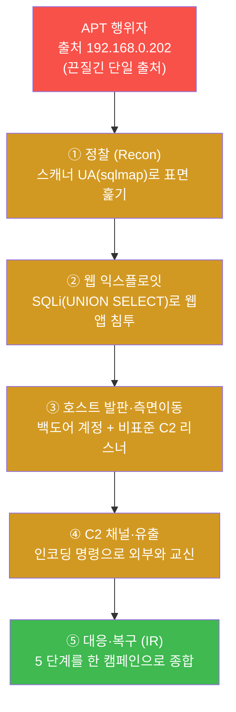

W08 중간고사가 ①②③ 의 3 단계까지였다면, 기말은 여기에 **④ C2 채널·유출** 과 **⑤
대응·복구(IR)** 를 더해 킬체인 전 주기를 다룬다. 이 두 단계가 더해지면서 W11(sysmon)과
W12–W14(위협인텔)에서 배운 무기가 비로소 캠페인 안에서 제 역할을 한다.

### 1.3 14주의 무기를 한 캠페인에 — 어느 단계를 어느 장비로 끊나

같은 5 단계에 "어느 장비가 그 단계를 1차로 끊는가" 를 겹쳐 보면, 14주 동안 하나씩 익힌
무기가 한 캠페인 위에 전부 배치된다.

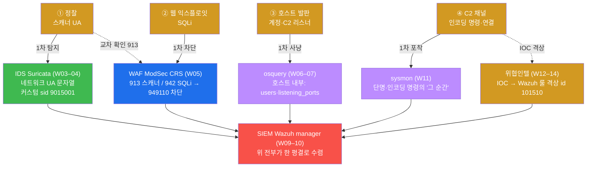

이 그림이 기말 전체의 지도다. 정찰은 IDS 가(WAF 가 보조로), 웹 익스플로잇은 WAF 가, 호스트
발판은 osquery 가, C2 채널의 단명 명령은 sysmon 이 1차로 잡고, 그 IOC 는 위협인텔 룰로
격상되며, **모든 흔적은 마지막에 SIEM(Wazuh)으로 수렴** 한다. 학생이 시험에서 할 일은 이
지도를 실제 명령과 증거로 채우고, 마지막에 5 단계를 한 캠페인으로 엮는 것이다.

### 1.4 핵심 평가 — 단일 무기 실력이 아니라 통합 능력

기말의 채점 시선은 W08 과 같되 더 넓다. **개별 장비를 다룰 줄 아는가** 가 아니라, **한
캠페인을 전 계층에서 추적·대응하고 한 사건으로 종합하는가** 다. 방화벽만 믿었다면 정찰의
스캐너 UA 를 못 봤을 것이고(L4 라 UA 못 봄), IDS·WAF 만 믿었다면 침투 후 심긴 백도어 계정을
못 봤을 것이며(네트워크 장비는 호스트 내부 못 봄), osquery 스냅샷만 믿었다면 단명한 C2
명령을 놓쳤을 것이다(스냅샷은 '그 순간'을 못 잡음). 그래서 5종 장비 + 위협인텔을 모두
동원하는 통합 사고가 정답이다.

### 1.5 한계 — 이 시험이 다루는 범위

본 기말은 W01–W14 의 범위 안에서 한 APT 캠페인을 종합 평가한다. 실제 APT 는 더 많은 단계와
정교한 회피를 쓰지만(예: 0-day 익스플로잇, 합법 도구 악용, 장기 잠복), 본 시험은 14주에
배운 무기로 **탐지·차단·헌팅·상관·격상이 가능한 형태** 로 5 단계를 재현한다. 또한 모든
공격은 학습용 마커(`apt15-*`, 포트 61515, 계정 w15ghost, IOC `apt15-c2`)를 써서 다른 학생·
운영과 겹치지 않게 하고, 끝나면 전부 정리한다(§8).

---

## 2. 5 단계 킬체인 상세 — 어느 무기로 끊나

이번 시험의 시나리오는 한 APT 행위자(`el34-attacker`, 출처 IP `192.168.0.202`)가 fw 의
게이트웨이(`10.20.30.1`)를 통해 `dvwa.el34.lab` vhost 를 노려 5 단계를 진행하는 것이다.
el34 는 SNAT 를 하지 않으므로 출처 IP `192.168.0.202` 가 모든 단계·모든 계층에 그대로
보존된다(§4).

### 2.1 ① 정찰(Recon) — IDS + WAF

**한 줄 정의.** 정찰은 공격 전에 표적의 표면을 훑어 어떤 서비스·약점이 있는지 알아내는
단계다.

**무엇을 하나.** APT 는 `sqlmap`, `nikto` 같은 자동화 스캐너로 요청을 보낸다. 이런 도구는
자기 정체를 드러내는 **User-Agent(UA)** 문자열(예: `sqlmap/1.7`)을 HTTP 헤더에 담는다.

**el34 에서 어떻게 잡히나.** 같은 sqlmap 요청 하나가 두 계층에 동시에, 그러나 다른 층위로
잡힌다.

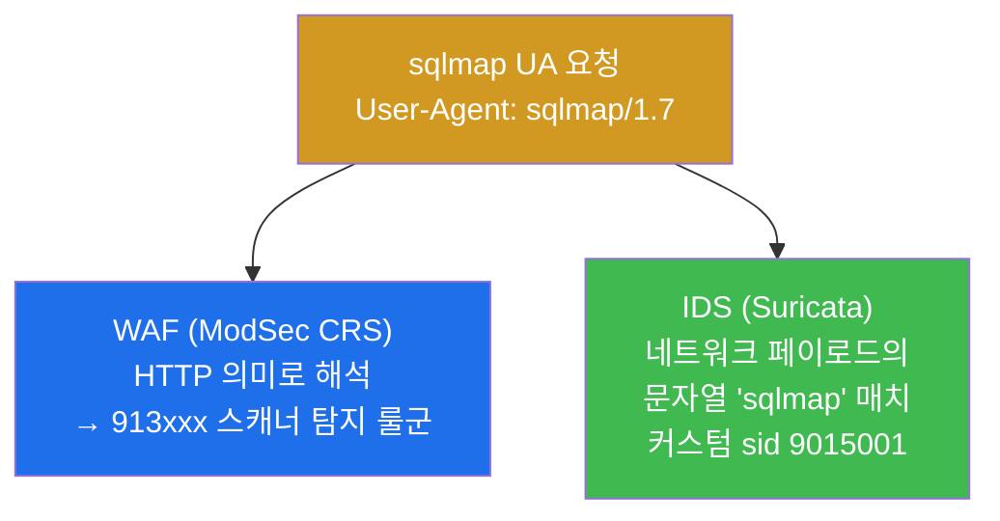

- **WAF** 에는 CRS 의 **913 룰군(scanner detection)** 으로 잡힌다 — WAF 는 이 요청을 "알려진
  스캐너의 HTTP 패턴" 으로 해석한다(lab STEP 2).
- **IDS** 에는 네트워크를 흐르는 페이로드 안의 문자열 `sqlmap` 으로 잡힌다 — 단, 이 룰
  (**sid 9015001**)은 학생이 직접 만들어야 한다(lab STEP 3). IDS 는 이 요청을 "특정 바이트
  문자열을 포함한 네트워크 트래픽" 으로 본다.

**한계.** 방화벽은 이 단계를 **전혀 못 본다.** 방화벽은 L3/L4(IP·포트)만 보므로, HTTP 헤더
안의 UA 문자열은 가시 범위 밖이다. 정찰 탐지는 IDS/WAF 의 영역이다.

### 2.2 ② 웹 익스플로잇(Exploit) — WAF anomaly 차단

**한 줄 정의.** 웹 익스플로잇은 정찰로 찾은 약점을 실제로 악용해 웹앱 안으로 들어가는
단계다.

**무엇을 하나.** APT 는 **SQL Injection(SQLi)** 을 시도한다 — 파라미터에
`' UNION SELECT user,password FROM users` 같은 SQL 조각을 끼워 넣어 웹앱이 의도하지 않은 DB
질의를 실행하게 만든다.

**el34 에서 어떻게 막히나.** `dvwa.el34.lab` vhost 는 **차단 모드** 다(W05 — dvwa 차단 /
juice 탐지만). WAF(ModSecurity + CRS)가 이 요청을 잡아 **403(Forbidden)** 으로 응답한다.
중요한 점은 차단이 **단일 룰** 의 결과가 아니라는 것이다.

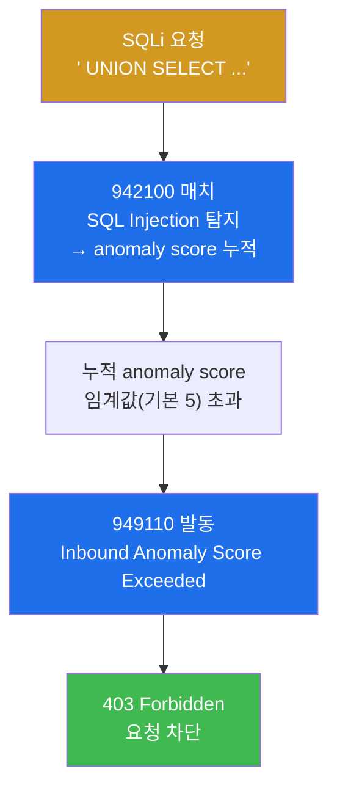

CRS 는 룰 위반마다 **anomaly score** 를 누적한다. SQLi 를 잡는 **942 룰군(942100)** 이 점수를
올리고, 누적 점수가 임계값을 넘으면 **949110(Inbound Anomaly Score Exceeded)** 룰이 발동해
403 으로 차단한다. 즉 "942 가 직접 차단" 이 아니라 "942 가 점수를 올리고 949110 이 누적
임계 초과로 차단" 이라는 2 단계 메커니즘이다(lab STEP 4–5 에서 audit 로그로 확인).

**한계.** osquery 는 이 네트워크 단계를 **못 본다.** osquery 는 호스트 내부 상태를 보는
도구이므로, 네트워크를 흐르는 SQLi 요청 자체는 가시 범위 밖이다. 웹 익스플로잇 차단은
WAF 의 영역이다.

### 2.3 ③ 호스트 발판·측면이동(Foothold) — osquery 헌팅

**한 줄 정의.** 호스트 발판은 침입에 성공한 APT 가 그 호스트에 **재진입 수단을 심고** 내부
로 거점을 넓히는 단계다.

**무엇을 하나.** APT 는 (1) **백도어 계정**(`w15ghost`)을 만들어 정상 계정처럼 다시 로그인
하고, (2) 비표준 포트(예: **61515**)에 **C2 리스너** 를 띄워 외부와 통신할 통로를 만든다.
이런 행위는 MITRE ATT&CK 의 **T1136(계정 생성)**, **T1571(비표준 포트)** 에 해당한다.

> **용어 — MITRE ATT&CK.** 실제 공격에서 관찰된 전술(Tactic)·기법(Technique)을 표준 번호로
> 정리한 지식 베이스다. `T1571` 같은 번호로 "이 행위는 알려진 어떤 기법인가" 를 공통 언어로
> 가리킨다. W12 에서 IOC 를 technique 에 연결해 맥락을 더한 그 체계다.

**el34 에서 어떻게 잡히나.** 이 단계는 네트워크 장비(방화벽·IDS·WAF)가 모두 못 보는 **호스트
내부** 에서 일어난다. 그래서 osquery 가 OS 를 SQL 테이블로 질의해 사냥한다(W06–W07).

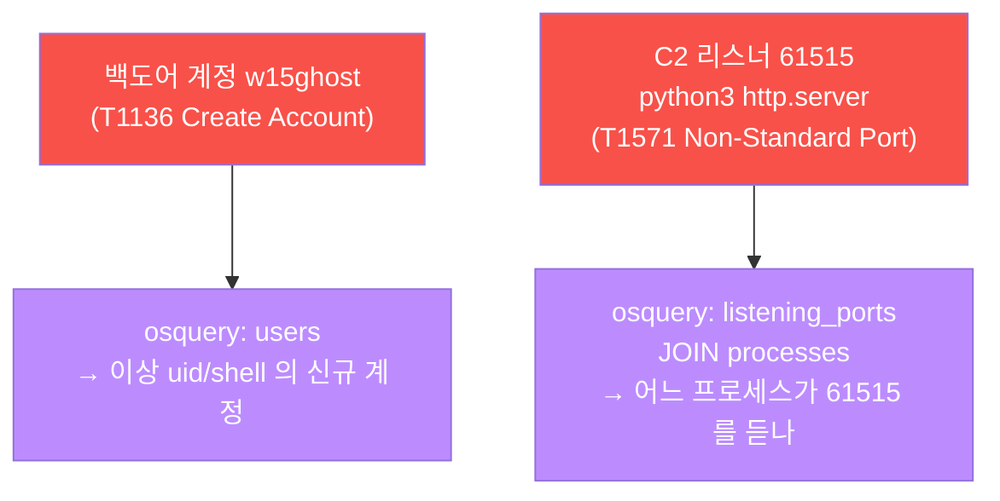

osquery 는 `users` 테이블로 이상 계정을 찾고, `listening_ports` 와 `processes` 를 `pid` 로
JOIN 해 "어느 프로세스가 비표준 포트 61515 를 듣는가" 를 식별한다(lab STEP 6–7). 포트만 보면
"누가 듣는지" 를 모르지만, JOIN 으로 **그 포트의 주인 프로세스** 를 짚어내는 것이 헌팅의
핵심이다.

**한계.** 방화벽·IDS 는 이 단계를 **못 본다.** 호스트 내부의 리스너·계정은 네트워크
시그니처로 잡히지 않는다. 호스트 발판 사냥은 osquery(+ Wazuh FIM)의 영역이다.

### 2.4 ④ C2 채널·유출 — sysmon + 위협인텔 격상

**한 줄 정의.** C2(Command & Control)는 공격자가 침입한 호스트를 외부에서 조종하는 통신
채널이고, 유출은 그 채널로 데이터를 빼내는 것이다.

**무엇을 하나.** APT 는 탐지를 피하려 명령을 **base64 등으로 인코딩** 해 실행하고(예:
`base64.b64decode(...)`), 그 명령은 **짧게 실행되고 사라진다**(단명 프로세스). 이런 인코딩·
단명 명령은 MITRE **T1059(명령·스크립트 인터프리터)** / **T1027(난독화)** 에 해당한다.

**왜 osquery 로는 부족한가 — 스냅샷의 한계(W11 복습).** osquery 는 **스냅샷** 이다. "지금 이
순간 떠 있는 것" 을 SQL 로 찍는다. 그런데 인코딩된 C2 명령은 짧게 살다 죽으므로, 다음
스냅샷 때는 이미 없다. 그래서 **이벤트 스트림** 이 필요하다.

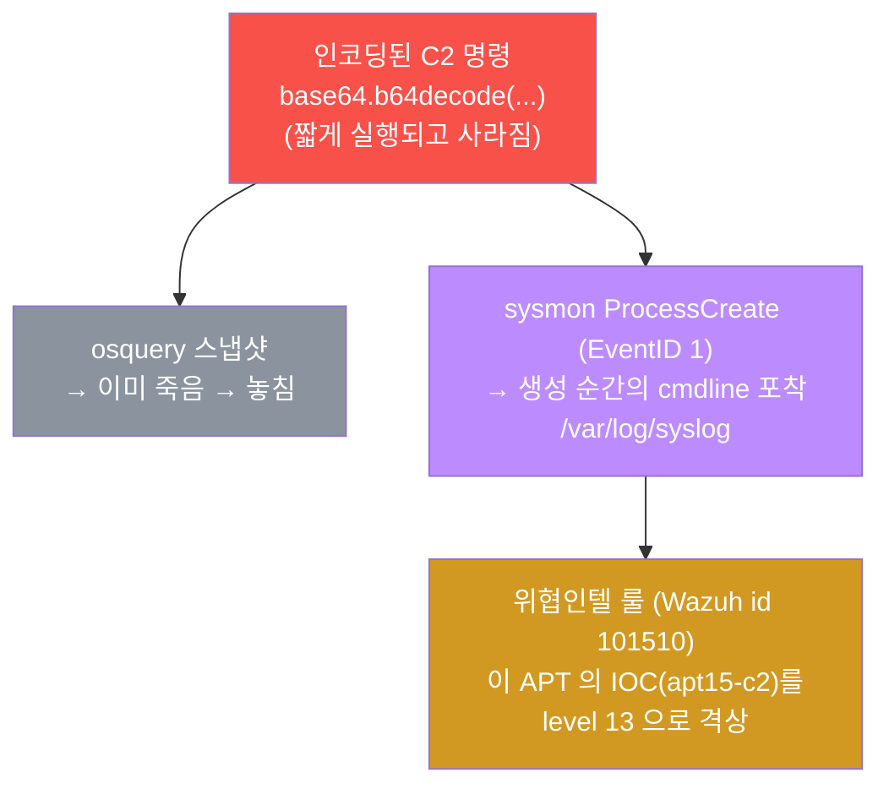

- **sysmon** 은 프로세스가 **생성되는 순간** 의 cmdline 을 EventID 1(ProcessCreate)로 남긴다.
  단명이라 osquery 가 놓친 인코딩 명령도, sysmon 에는 생성 사실이 그대로 남는다(lab STEP 8).
  el34 에서 sysmon 은 **호스트(192.168.0.80)** 에 설치돼 있고, 컨테이너 프로세스도 결국
  호스트 커널 프로세스이므로 el34-web 내부의 명령까지 포착한다. 로그는 호스트의
  `/var/log/syslog` 에 `Linux-Sysmon` 소스로 남는다(W11).
- **위협인텔 격상** — 이 APT 의 IOC(C2 도구·포트, 예: `apt15-c2`)를 **Wazuh 룰(id 101510,
  level 13)** 로 격상한다(lab STEP 9). 그러면 같은 APT 가 재발/변형해 같은 IOC 를 쓰면 평범한
  경보로 묻히지 않고 **자동으로 고위험(level 13)** 으로 뜬다. W12 의 IOC 매칭 + W13 의 격상
  패턴을 이 캠페인에 적용하는 것이다.

> **용어 — C2 / sysmon EventID.** **C2** 는 침입한 호스트를 외부에서 조종하는 채널(무전기에
> 비유). **sysmon** 의 이 환경 config 는 세 이벤트를 남긴다 — **EventID 1 ProcessCreate**
> (프로세스 생성+cmdline), **3 NetworkConnect**(연결), **11 FileCreate**(파일 생성). 기말의
> C2 단계는 이 중 **EventID 1** 로 인코딩 명령의 cmdline 을 잡는 것이 핵심이다.

**한계.** 단일 무기로는 이 단계를 완결하지 못한다. sysmon 은 '그 순간' 을 잡지만 그 자체로
"이게 알려진 위협인가" 를 판단하지 않는다. 그 판단(IOC 격상)은 위협인텔 룰이 한다. 두 무기가
보완 관계다.

### 2.5 ⑤ 대응·복구(IR) — SIEM 수렴 + 출처 상관 + IR 보고서

**한 줄 정의.** 대응·복구는 흩어진 5 단계 흔적을 SIEM 한 곳으로 모아 **한 캠페인으로 엮고**,
이를 침해대응(IR) 보고서로 종합하는 마지막 단계다.

**무엇을 하나.** ①②③④ 의 흔적이 Wazuh `alerts.json` 한 곳으로 수렴하고, 모두 같은 출처
IP(`192.168.0.202`)를 가리킴을 확인한다. 그리고 출처 IP + 시각으로 5 단계를 한 캠페인
타임라인에 엮어 IR 보고서로 종합한다(lab STEP 10–11).

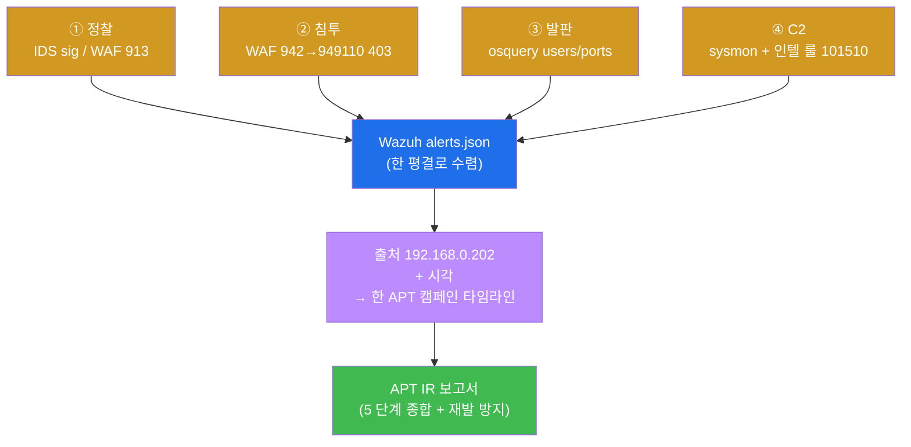

이 단계가 기말의 정점이다. 개별 탐지(①②③④)는 W08 도 했지만, 기말은 그것을 **한 캠페인으로
종합** 하고 **재발 방지(인텔 격상)** 까지 보고서에 담는 것을 요구한다(§3).

**한계.** 상관의 전제는 출처 보존이다. 만약 fw 가 SNAT 를 했다면 안쪽 장비가 fw IP 만 보게
되어 5 단계를 한 출처로 엮을 수 없다. el34 는 SNAT 를 하지 않으므로 이 상관이 가능하다(§4).

---

## 3. APT IR 보고서 — 5 단계 종합 (수료의 마무리)

기말의 마무리는 **APT IR(Incident Response) 보고서** 다. 개별 탐지를 넘어, 5 단계를 한
캠페인으로 종합하고 재발 방지까지 담는 것이 보안운영자의 최종 산출물이다.

> **용어 — IR(Incident Response).** 침해를 탐지·분석·차단·복구·보고하는 대응 전 과정이다.
> "막았다" 로 끝나는 게 아니라, **무엇이·어느 단계에서·어느 증거로 일어났고, 어떻게 끊었으며,
> 재발을 어떻게 막을 것인가** 를 문서로 남기는 것까지가 IR 이다.

### 3.1 보고서가 채워야 할 5 단계 표

| 단계 | 공격 | 끊은 무기 | 핵심 증거 |
|------|------|-----------|-----------|
| ① 정찰 | 스캐너 UA(sqlmap) | IDS(sid 9015001) + WAF(913) | eve.json 시그니처 / audit 913 |
| ② 침투 | SQLi(UNION SELECT) | WAF(942 → 949110, 403) | audit 403 + remote 192.168.0.202 |
| ③ 발판 | 계정 w15ghost / 리스너 61515 | osquery(users / listening_ports) | uid / pid:port(JOIN) |
| ④ C2 | 인코딩 명령 / IOC | sysmon(EventID 1) + 인텔 룰(101510) | b64decode cmdline / logtest level 13 |
| ⑤ 대응 | — | SIEM 수렴 + 출처 상관 | alerts.json 다계층, src 192.168.0.202 |

이 표를 **증거와 함께** 채울 수 있으면 보안운영 과정을 수료할 자격이 있다. 핵심은 마지막
열 — "막았다" 가 아니라 **증거(로그·audit·eve.json·osquery·logtest 결과)** 가 점수다.

### 3.2 IR 보고서의 표준 구조

좋은 IR 보고서는 다음 흐름을 따른다(lab STEP 11 양식).

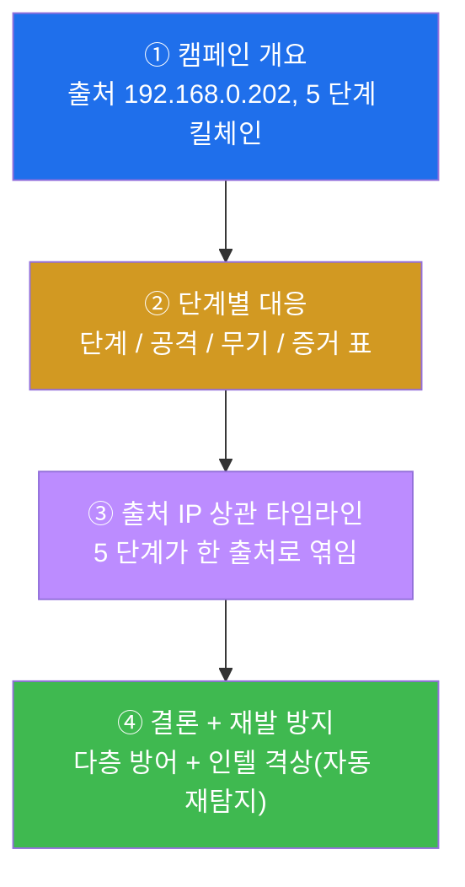

이 구조는 실제 사고 대응 후 경영진·감사에 제출하는 보고서의 표준이다 — 개요 → 단계별 대응
→ 상관 타임라인 → 결론·재발 방지. 특히 마지막 "재발 방지" 에 **인텔 격상(id 101510)** 을
담는 것이 APT 대응의 특징이다. 일반 사고는 "막았다" 로 끝나지만, APT 는 끈질기므로 "다음에
같은 IOC 가 오면 자동으로 잡히게 했다" 까지 보고해야 대응이 완결된다.

---

## 4. 출처 IP 보존 — 5 단계를 한 캠페인으로 엮는 키

### 4.1 왜 출처 보존이 캠페인 상관의 전제인가

5 단계는 서로 다른 장비에 흔적을 남긴다 — 정찰은 IDS·WAF 에, 침투는 WAF 에, 발판은 osquery
에, C2 는 sysmon 에. 이 흩어진 흔적을 한 공격자의 한 캠페인으로 묶으려면 **공통 키** 가
필요한데, 그 핵심이 **출처 IP** 다.

> **헷갈리기 쉬운 한 쌍 — SNAT vs DNAT(W08 복습).** 둘 다 NAT(주소 변환)지만 바꾸는 곳이
> 정반대다. **DNAT** 는 **목적지** 를 바꾼다 — el34 의 fw 가 공개 주소 `10.20.30.1` 로 온
> 요청을 내부 web `10.20.32.80` 으로 보내는 것(우체국이 사서함 → 실제 집주소). **SNAT** 는
> **출발지** 를 바꾼다 — 만약 el34 가 SNAT 를 했다면 안쪽 장비들은 공격자의 진짜 IP 대신 fw
> 의 IP 만 보게 된다(봉투의 보낸 사람을 위조). **el34 는 SNAT 를 하지 않는다.**

### 4.2 el34 는 출처를 보존한다 — 그래서 캠페인이 보인다

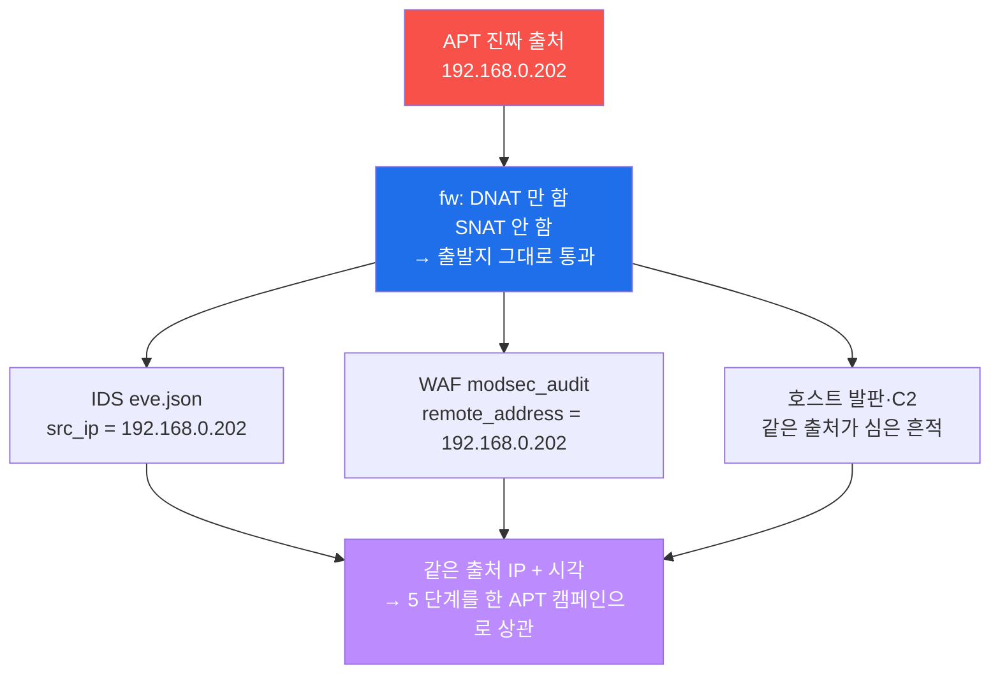

fw 가 SNAT 를 하지 않으므로, 안쪽의 모든 장비가 APT 의 **진짜 출처 IP `192.168.0.202`** 를
본다. Suricata 의 `src_ip`, ModSec 의 `remote_address`, 그리고 그 출처가 호스트에 심은
발판·C2 가 모두 같은 IP 로 연결된다. 이 한 IP 가 정찰·침투·발판·C2 라는 흩어진 흔적을 **한
APT 의 한 캠페인** 으로 엮는 키다(lab STEP 10 의 수렴·상관이 바로 이것을 증명한다).

el34 의 4-tier 세그먼트는 `ext 10.20.30` / `pipe 10.20.31` / `dmz 10.20.32` / `int
10.20.40` 이며, 공격자(ext .202) → fw(ext .1) → web(dmz .80) 경로로 흐른다.

---

## 5. 장비별 빠른 복습 — 기말에서 동원하는 무기

기말에서 각 장비를 점검·조작하는 핵심 명령을 한 번에 정리한다. 모든 명령은 el34
각 장비에 직접 접속(fw 10.20.30.1/ips 31.2/web 32.80/siem 32.100, 공격 192.168.0.202, root은 sudo)해 실행한다.
sysmon 관측은 호스트의 `/var/log/syslog`).

### 5.1 방화벽 (el34-fw / nftables) — W02

nftables 는 Linux 커널의 표준 패킷 필터다(iptables 후속). el34 는 `inet six_filter`(필터)와
`ip six_nat`(DNAT) 두 테이블을 운영한다.

```bash
ssh ccc@10.20.30.1 'sudo nft list ruleset 2>/dev/null | grep -c dnat'   # DNAT 규칙 수
```

무엇을 보나 — 공개 포트가 내부로 DNAT 되는지(L4 정책). **주의: baseline 정책은 수정하지
말 것**(공유 인프라). 점검만 한다.

### 5.2 IDS (el34-ips / Suricata 6.0.4) — W03–W04

Suricata 는 네트워크 페이로드를 시그니처로 검사하는 IDS 다. 룰 파일은
`/etc/suricata/rules/` 아래에 있고, **내 룰은 `local.rules` 에만** 추가한다.

```bash
# local.rules 에 커스텀 룰 추가 (sqlmap UA 탐지, sid 9015001)
ssh ccc@10.20.31.2 'sudo bash -c "cat >> /etc/suricata/rules/local.rules <<EOF
alert http any any -> any any (msg:\"APT15 sqlmap recon UA\"; http.user_agent; content:\"sqlmap\"; nocase; fast_pattern; sid:9015001; rev:1;)
EOF"'
ssh ccc@10.20.31.2 'sudo suricata -T -S /etc/suricata/rules/local.rules'   # 문법 검사(-T 테스트, -S 룰 지정)
ssh ccc@10.20.31.2 'sudo suricatasc -c reload-rules'                        # 무중단 reload
# 트리거 후: /var/log/suricata/eve.json 에서 sid 확인
ssh ccc@10.20.31.2 'sudo sed -i "/sid:9015001/d" /etc/suricata/rules/local.rules; sudo suricatasc -c reload-rules'   # 정리(베이스 보존)
```

무엇을 보나 — 내가 만든 룰이 `eve.json` 에 시그니처로 잡히는지. **base 룰(sid 1000001–
1000005)은 보존** 하고, 내 룰은 `9015xxx` 네임스페이스를 쓰며 끝나면 sid 로 삭제한다.

> **용어 — fast_pattern / suricatasc.** `fast_pattern` 은 Suricata 가 룰 전체를 검사하기
> 전에 빠르게 후보를 거르는 핵심 문자열 지정이다(성능 최적화). `suricatasc` 는 Suricata 에
> 명령을 보내는 소켓 클라이언트로, `reload-rules` 는 데몬을 멈추지 않고 룰만 다시 읽게 한다
> (무중단 reload).

### 5.3 WAF (el34-web / Apache + ModSecurity CRS) — W05

ModSecurity + OWASP CRS 는 HTTP L7 페이로드를 검사하는 WAF 다. audit 로그는 JSON 라인으로
`/var/log/apache2/modsec_audit.log` 에 남는다.

```bash
ssh ccc@10.20.32.80 'sudo tail -80 /var/log/apache2/modsec_audit.log | grep -oE "94[29]1[0-9]{2}" | sort -u'
```

무엇을 보나 — SQLi 가 **단일 룰(942100)이 아니라 anomaly score 누적 → 949110 으로 차단
(403)** 된다는 것, 그리고 `remote_address` 가 출처 IP 라는 것. dvwa vhost 는 차단 모드다.

### 5.4 호스트 (el34-web / osquery) — W06–W07

osquery 는 OS 를 SQL 테이블로 질의하는 호스트 가시화 도구다. 네트워크 장비가 못 보는 호스트
내부 발판을 SQL 로 사냥한다.

```bash
# C2 리스너의 주인 프로세스 (포트 → 프로세스 JOIN)
ssh ccc@10.20.32.80 osqueryi --json 'SELECT p.pid,p.name,s.port FROM processes p JOIN listening_ports s USING(pid) WHERE s.port=61515;'
# 백도어 계정
ssh ccc@10.20.32.80 osqueryi --json 'SELECT username,uid,shell FROM users WHERE username="w15ghost";'
```

무엇을 보나 — 비표준 포트 리스너의 주인 프로세스, 백도어 계정 같은 호스트 내부 발판.

### 5.5 sysmon (호스트 / Sysmon for Linux) — W11

sysmon 은 프로세스 생성·네트워크 연결·파일 생성을 **이벤트 스트림** 으로 남기는 호스트의
비행기록장치다. el34 에서는 **호스트(192.168.0.80)에 설치** 돼 있고, 컨테이너 프로세스도
호스트 커널 프로세스이므로 컨테이너 내부까지 포착한다. 로그는 호스트
`/var/log/syslog` 의 `Linux-Sysmon` 소스다.

```bash
systemctl is-active sysmon                                          # 호스트에서 sysmon 데몬 가동
grep -a "Linux-Sysmon" /var/log/syslog | grep -a "b64decode" | tail -1   # 인코딩 명령의 cmdline
```

무엇을 보나 — osquery 스냅샷이 놓치는 **단명·인코딩 C2 명령** 의 생성 순간 cmdline(EventID 1).

### 5.6 위협인텔 (el34-siem / Wazuh local_rules.xml) — W12–W14

Wazuh 룰로 이 APT 의 IOC 를 격상해 재발을 자동 탐지하게 만든다. 공유 인프라이므로 라이브
재시작 없이 `wazuh-logtest` 로만 검증하고 끝나면 룰을 지운다.

```bash
# IOC 격상 룰(id 101510, level 13) 추가 → logtest 검증 → cp 복원 (lab STEP 9 참조)
echo '{"apt_ioc":"apt15-c2","src_ip":"192.168.0.202"}' | ssh ccc@10.20.32.100 sudo /var/ossec/bin/wazuh-logtest
#  → Phase 3: id 101510, level 13, "Alert to be generated."
```

무엇을 보나 — 이 APT 의 IOC(`apt15-c2`)가 평범한 경보가 아니라 **level 13 고위험** 으로
격상되는지. **id 네임스페이스:** 사용자 룰 100000+, 본 트랙 W15 = `1015xx`(W09=1009xx,
W12=1012xx, W13=1013xx 와 격리).

### 5.7 SIEM (el34-siem / Wazuh manager 4.10) — W09–W10

Wazuh manager 는 흩어진 로그를 한 평결로 수렴시키는 SIEM 의 두뇌다. el34 의 활성 agent 는
**ips(003)** 와 **web(004)** 둘이다.

```bash
ssh ccc@10.20.32.100 /var/ossec/bin/wazuh-control status | grep analysisd            # 평결 엔진(심장) 가동
ssh ccc@10.20.32.100 'tail -400 /var/ossec/logs/alerts/alerts.json | jq -rc "select(.rule.groups|index(\"ids\"))|.data.src_ip" | sort | uniq -c'   # 출처별 수렴
```

무엇을 보나 — ips·web agent 의 경보가 한 manager 로 수렴하고, 그 출처가 모두 같은 APT
IP(192.168.0.202)인지. 이것이 5 단계를 한 캠페인으로 보는 통합 가시성의 실체다.

---

## 6. 판단 프레임워크 — "어느 단계를 어느 무기로 끊나"

기말의 가장 중요한 능력은 **"이 단계는 어느 무기로 끊어야 하는가"** 를 즉시 판단하는
것이다. 다음 표가 그 판단의 정답지다. 학생은 이 표를 머릿속에 두고, 각 단계를 알맞은 무기로
끊은 뒤 그 증거를 제시한다.

| 킬체인 단계 | 1차 탐지/차단 | 보조(교차 확인) | 못 잡는 무기 | 핵심 증거 |
|-------------|--------------|----------------|-------------|----------|
| ① 정찰(스캐너 UA) | IDS(Suricata sid 9015001) | WAF(913 scanner) | 방화벽(L4 라 UA 못 봄) | eve.json sig / audit 913 |
| ② 웹 익스플로잇(SQLi) | WAF(942 → 949110, 403) | IDS(payload 룰) | osquery(네트워크 못 봄) | audit 403 + remote IP |
| ③ 호스트 발판(계정·리스너) | osquery(users / listening_ports JOIN) | Wazuh FIM | 방화벽·IDS(호스트 내부 못 봄) | uid / pid:port |
| ④ C2 채널(인코딩 명령) | sysmon(ProcessCreate EventID 1) | 위협인텔 룰(id 101510) | osquery 스냅샷(단명 못 봄) | b64decode cmdline / logtest |
| ⑤ 대응(전 단계 수렴) | SIEM(Wazuh alerts.json) | 출처 IP 상관 | — | 다계층 수렴 + src 보존 |

이 표를 읽는 법은 두 방향이다. **"무엇으로 끊나"** — 정찰은 IDS, 침투는 WAF, 발판은
osquery, C2 는 sysmon+인텔, 수렴은 SIEM. 그리고 **"무엇이 못 보나"** — 방화벽은 UA·호스트
내부를, osquery 는 네트워크와 단명 프로세스를 못 본다. 두 방향을 모두 말할 수 있으면 다층
방어의 원리를 체득한 것이다.

> **시험의 채점 포인트.** 각 단계를 올바른 무기로 끊고, 그 증거(로그·audit·eve·osquery·
> sysmon·logtest 결과)를 제시하며, 마지막에 5 단계가 SIEM 으로 수렴함과 출처 IP 로 한
> 캠페인이 됨을 보이는 것. "막았다" 는 선언이 아니라 **증거** 가 점수다.

---

## 7. 실습 안내 — 기말 lab 12 미션 (4 축 설명)

기말 실습은 12 미션으로 구성된다. 각 미션을 **4 축** 으로 설명한다 — 왜 하는가 / 무엇을 알
수 있는가 / 결과 해석(정상 vs 비정상) / 실전 활용. 미션은 한 APT 캠페인을 따라 점검 → ①
정찰 → ② 침투 → ③ 발판·헌팅 → ④ C2·인텔 → ⑤ 수렴·상관·보고 → 정리 순서로 흐른다.

> **시험 진행 원칙.** 각 장비에 직접 접속(공격 ssh att@192.168.0.202, 장비 ssh ccc@<IP>: fw 10.20.30.1/ips 31.2/web 32.80/siem 32.100)해 실행한다(sysmon 관측은 호스트 syslog). 각 미션은 **독립적** 이며, 심은 것은 그
> 미션에서 정리한다(self-clean). IDS/Wazuh 룰은 추가 → 검증 → 삭제, 발판(계정·리스너)은
> self-clean. 합격 임계값은 0.7 이다.

### 미션 1 — 점검: 전 무기가 모두 살아있나 (8점)

> **왜 하는가?** APT 종합 대응의 전제는 동원할 모든 무기가 가용해야 한다는 것이다. 하나라도
> 죽으면 그 단계가 사각(blind spot)이 된다.
>
> **무엇을 알 수 있는가?** fw(nftables DNAT) · ips(Suricata) · web(osquery) · sysmon · siem
> (Wazuh analysisd)이 모두 응답하는지. 5 단계를 끊을 무기가 전부 살아 있는지.
>
> **결과 해석.** 정상: fw/ips/web(osquery)/sysmon/siem 이 모두 응답. 비정상: 어느 하나라도
> 응답이 없으면 그 단계는 동원 불가 — 먼저 원인을 파악해야 한다.
>
> **실전 활용.** 사건 대응 전 첫 점검. 동원 가능한 무기를 확인하지 않고 대응에 들어가면 그
> 계층의 공격을 통째로 놓친다.

### 미션 2 — ① 정찰 재현: 스캐너 UA → WAF 913 (8점)

> **왜 하는가?** APT 킬체인의 첫 단계인 정찰을 직접 재현해, 스캐너 UA 가 WAF audit 에 어떻게
> 남는지 본다.
>
> **무엇을 알 수 있는가?** APT(192.168.0.202)의 `sqlmap` UA 요청이 WAF 의 CRS **913 룰군
> (스캐너 탐지)** 에 잡힌다는 것. 같은 UA 는 다음 미션에서 만들 IDS 룰로 IPS 에도 잡힌다(두
> 무기 관점 교차).
>
> **결과 해석.** 정상(탐지 성공): modsec_audit 에 `913` 이 보임. 핵심 깨달음 — **방화벽은 이
> UA 를 못 본다**(L4 라 HTTP 헤더 밖). 정찰은 IDS/WAF 의 영역이다.
>
> **실전 활용.** 자동화 스캐너의 정찰을 캠페인 초기에 식별하는 1차 신호가 WAF 의 913 이다.

### 미션 3 — ① IDS 정찰 탐지 룰: sid 9015001 작성→reload→트리거→정리 (12점)

> **왜 하는가?** 정찰을 캠페인 초기에 끊으려면 IDS 가 네트워크에서 잡아야 한다. WAF 는 HTTP
> 도착 후에 보지만 IDS 는 네트워크에서 본다. 학생이 직접 탐지 룰을 설계하는 능력을 본다.
>
> **무엇을 알 수 있는가?** Suricata `local.rules` 에 `http.user_agent; content:"sqlmap";
> fast_pattern` 룰(sid 9015001)을 추가하고, 문법 검사 → 무중단 reload → 트리거 → eve.json
> 확인 → **sed 로 삭제** 까지의 룰 수명주기 전체. 같은 sqlmap UA 를 WAF 는 HTTP 의미(913)로,
> IDS 는 네트워크 UA 문자열로 본다는 교차.
>
> **결과 해석.** 정상: eve.json 에 `APT15 sqlmap` 시그니처가 잡히고, 정리 후 local.rules 에서
> 9015001 이 사라짐. 비정상: 트리거 후에도 안 잡히면 룰 문법·reload 를 점검.
>
> **실전 활용.** 신종 정찰 도구가 나타나면 운영자가 직접 탐지 룰을 작성·배포·검증한 뒤, 임시
> 룰은 정리해 baseline 을 깨끗이 유지한다.

### 미션 4 — ② 웹 익스플로잇 재현: SQLi → 403 (10점)

> **왜 하는가?** 정찰 다음 단계인 실제 침투를 재현해, SQLi 가 WAF 에 차단되는지 본다.
>
> **무엇을 알 수 있는가?** dvwa(차단 모드) vhost 에 `UNION SELECT` 를 보내면 WAF 가 403 으로
> 막는다는 것. 차단 모드(dvwa)와 탐지만 모드(juice)의 차이.
>
> **결과 해석.** 정상: 응답이 `403`(WAF 차단). 핵심 깨달음 — **osquery 는 이 네트워크 단계를
> 못 본다**. 웹 익스플로잇 차단은 WAF 의 영역.
>
> **실전 활용.** vhost 별 차단/탐지 모드 정책을 이해하고, 어느 자산을 차단 모드로 둘지
> 판단한다.

### 미션 5 — ② WAF anomaly 차단 확인: 942 → 949110 (12점)

> **왜 하는가?** "막았다" 를 넘어, **왜·어떻게** 막혔는지를 audit 로그에서 증명한다. CRS 의
> anomaly 누적 메커니즘(W05)을 기말에서 다시 확인한다.
>
> **무엇을 알 수 있는가?** 차단이 단일 룰이 아니라 **942100(SQLi)이 점수를 올리고
> 949110(Inbound Anomaly Score Exceeded)이 누적 임계 초과로 403** 하는 2 단계라는 것.
>
> **결과 해석.** 정상: audit 에 `942100` 과 `949110` 이 함께 보임. 비정상: 949110 없이 942
> 만 보이면 anomaly 임계 설정을 확인.
>
> **실전 활용.** 오탐/정탐 튜닝 시 anomaly score 구조를 이해해야 임계값과 paranoia 수준을
> 조정할 수 있다.

### 미션 6 — ③ 호스트 발판 재현: C2 리스너(61515) + 백도어 계정(w15ghost) (10점)

> **왜 하는가?** 침투를 발판으로 호스트에 C2 리스너(T1571)와 백도어 계정(T1136)을 심는 행위를
> 재현하고, 다음 미션에서 osquery 로 사냥할 대상을 만든다.
>
> **무엇을 알 수 있는가?** 비표준 포트(61515) 리스너와 백도어 계정(w15ghost)이 어떻게 심기는
> 지. 이는 네트워크 장비가 못 보는 호스트 내부의 측면이동·지속성 흔적이다.
>
> **결과 해석.** 정상: 리스너 61515 와 계정 생성이 재현됨. 핵심 — **네트워크 장비는 이 호스트
> 내부 발판을 못 본다**. 계정은 다음 헌팅 미션을 위해 남긴다.
>
> **실전 활용.** APT 의 측면이동·지속성(계정·리스너) 흔적이 어떤 모습인지 알아야 사냥할 수
> 있다 — 공격을 알아야 방어가 보인다.

### 미션 7 — ③ osquery 헌팅: 발판 사냥 (12점)

> **왜 하는가?** APT 의 호스트 발판을 osquery 로 직접 사냥한다. 네트워크 장비가 못 보는
> 호스트 내부를 SQL 질의로 끄집어낸다(W06–W07, W14 헌팅).
>
> **무엇을 알 수 있는가?** `listening_ports` 와 `processes` 를 JOIN 해 "포트 61515 의 주인
> 프로세스" 를 식별하는 법, `users` 로 백도어 계정 w15ghost 를 찾는 법.
>
> **결과 해석.** 정상: JOIN 결과에 포트 61515 와 그 주인 프로세스가, users 에 w15ghost 가
> 보임. 핵심 — 포트만 보면 "누가 듣는지" 모르지만 JOIN 으로 주인 프로세스를 짚는다.
>
> **실전 활용.** C2 통신·역방향 셸의 비표준 리스너와 백도어 계정을 호스트에서 직접 사냥하는
> 표준 헌팅 패턴.

### 미션 8 — ④ C2 채널: sysmon 이벤트(인코딩 명령) (12점)

> **왜 하는가?** APT 4 단계의 인코딩된 C2 명령은 단명이라 osquery 스냅샷이 놓친다. 이벤트
> 스트림(sysmon)이 '그 순간' 을 어떻게 잡는지 본다(W11).
>
> **무엇을 알 수 있는가?** 인코딩·단명 명령(`b64decode`)이 sysmon ProcessCreate(EventID 1)의
> cmdline 으로 호스트 syslog 에 남는다는 것. 스냅샷(osquery) vs 이벤트 스트림(sysmon)의 역할
> 차이.
>
> **결과 해석.** 정상: sysmon syslog 에 `b64decode` cmdline 이 보임. 핵심 — **단명 프로세스는
> 이벤트 스트림(sysmon)만 잡는다**. 비정상: 안 보이면 sysmon 데몬 가동·필터를 점검.
>
> **실전 활용.** 인코딩 셸·LOLBins 같은 회피성 명령을 사후에도 추적하는 호스트 이벤트
> 텔레메트리의 가치.

### 미션 9 — ④ APT IOC 인텔 룰: Wazuh id 101510 격상 → logtest → 정리 (14점)

> **왜 하는가?** APT 는 끈질기다 — 쫓아내도 변형해 다시 온다. 이 APT 의 IOC 를 Wazuh 룰로
> 굳혀 재발 시 자동 고위험으로 잡히게 만든다(W12 IOC 매칭 + W13 격상).
>
> **무엇을 알 수 있는가?** local_rules.xml 에 IOC 매칭 룰(id 101510, level 13)을 쓰고, 라이브
> 재시작 없이 `wazuh-logtest` 로 격상을 검증한 뒤, cp 복원으로 베이스를 보존하는 절차.
>
> **결과 해석.** 정상: logtest Phase 3 에 rule `101510` level 13 이 "Alert to be generated"
> 로 발화하고, 정리 후 잔재 0. 비정상: 발화 안 하면 XML 문법·필드명을 점검.
>
> **실전 활용.** 캠페인의 IOC 를 운영화(operationalize)해 재발/변형을 자동 탐지하는 것이 APT
> 대응의 특징 — "막았다" 를 넘어 "다음에 자동으로 잡힌다" 까지. 단, 공유 인프라에선 logtest
> 검증 후 반드시 정리한다.

### 미션 10 — ⑤ SIEM 수렴 + 출처 상관: 5 단계를 한 캠페인으로 (12점)

> **왜 하는가?** 종합의 핵심 — 5 단계의 흔적이 **SIEM 한 곳으로 수렴** 하고, 같은 출처 IP 로
> 한 캠페인에 엮이는지 확인한다(§4).
>
> **무엇을 알 수 있는가?** Wazuh `alerts.json` 의 ids 그룹에 출처 `192.168.0.202` 가 (다단계)
> 수렴함. el34 가 SNAT 를 안 하므로 출처가 전 계층에 보존된다는 사실.
>
> **결과 해석.** 정상: alerts.json 에 출처 192.168.0.202 가 수렴. 비정상: 출처가 fw IP 로
> 보이면 SNAT 가 끼었거나 다른 사건 — 상관 전제를 재점검. `sleep 8` 후에도 안 보이면 ips
> agent·analysisd 점검.
>
> **실전 활용.** 실제 사고 조사에서 출처 IP + 시각으로 다중 소스 로그를 한 캠페인 타임라인으로
> 재구성하는 핵심 기법.

### 미션 11 — ⑤ APT IR 보고서: 5 단계 종합 (수료) (6점)

> **왜 하는가?** 미션 1–10 을 APT 5 단계 IR 보고서로 종합해, 통합 대응 능력을 문서로
> 입증한다. 수료의 핵심 산출물이다(§3).
>
> **무엇을 알 수 있는가?** 5 단계를 단계별 무기·증거 + 출처 상관 타임라인 + 재발 방지(인텔
> 격상)로 종합하는 법. IR 보고서의 표준 구조(개요 → 단계별 → 상관 → 결론·재발 방지).
>
> **결과 해석.** 정상: 보고서에 APT 5 단계 표 + 단계별 무기/증거 + 출처 상관 + 다층 방어·재발
> 방지 결론이 포함됨.
>
> **실전 활용.** 사고 대응 후 경영진·감사에 제출하는 IR 보고서의 표준. 특히 "재발 방지" 에
> 인텔 격상을 담는 것이 APT 대응의 완결이다.

### 미션 12 — 정리 확인: 공유 인프라 베이스 복원 (수료 마무리) (6점)

> **왜 하는가?** 공유 인프라에서는 기말 실습 흔적을 끝까지 남기지 않아야 한다. 다음 학생·운영
> 에 영향을 주면 안 된다.
>
> **무엇을 알 수 있는가?** 각 미션 self-clean 결과 — 계정 w15ghost / 리스너 61515 / IDS sid
> 9015001 / Wazuh 룰 101510 이 모두 사라졌는지.
>
> **결과 해석.** 정상: 모든 흔적 0 이고 `check done` 출력. 비정상: 잔재가 있으면 해당 미션의
> 정리 명령을 다시 실행.
>
> **실전 활용.** 운영·훈련 환경에서 변경분을 추적·원복하는 변경 관리 규율 — "내가 심은 것은
> 내가 정리한다".

---

## 8. 시험 수칙 — 공유 인프라 보존

el34 는 여러 학생이 함께 쓰는 공유 인프라다. 기말도 다음 수칙을 반드시 지킨다.

- **baseline 을 수정/삭제하지 말 것.** fw 정책, suricata base 룰(sid 1000001–1000005),
  apache vhost, Wazuh 베이스 룰셋, 정상 계정은 점검만 하고 절대 바꾸지 않는다.
- **내 흔적은 내가 정리(self-clean).** IDS 룰은 sid 로 삭제, Wazuh 룰은 cp 복원, 리스너는
  kill, 계정은 userdel. 각 미션 안에서 즉시 정리한다.
- **라이브 manager 를 재시작하지 말 것.** Wazuh 인텔 룰(101510)은 `wazuh-logtest` 로만
  검증한다. `wazuh-control restart` 는 다른 학생의 ingest 를 끊는다(W09 §0.5.3).
- **네임스페이스를 지킨다.** IDS sid 는 `9015xxx`, Wazuh 룰은 `1015xx`, 리스너 포트는
  `61515`, 계정은 `w15ghost`, IOC 마커는 `apt15-c2` 로 고정해 다른 학생과 겹치지 않게 한다.
- **증거 우선.** "막았다" 가 아니라 **로그/audit/eve/osquery/sysmon/logtest 결과를 제시**
  해야 점수다. 결과 선언만으로는 채점되지 않는다.

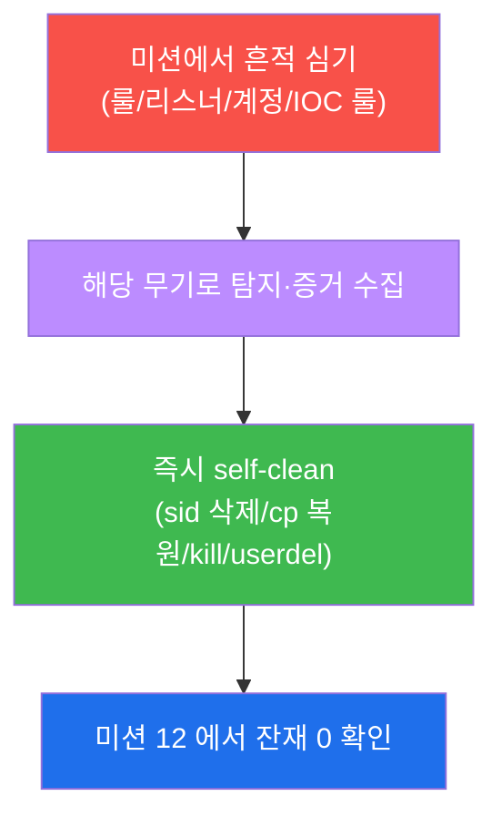

---

## 9. 수료 — 보안 운영자가 되었다

15주 동안 학생은 한 침입을 **방화벽에서 막고(W02), IDS 로 탐지하고(W03–W04), WAF 로
차단하고(W05), osquery 로 호스트를 사냥하고(W06–W07), Wazuh 로 한 평결로 모으고(W09–W10),
sysmon 으로 '그 순간' 을 잡고(W11), 위협인텔로 격상하고(W12–W13), 능동적으로 헌팅하는
(W14)** 보안운영의 전 주기를 익혔다.

기말에서는 그 모든 무기를 **하나의 APT 캠페인** 에 총동원해, 5 단계 킬체인을 전 계층에서
탐지·차단·헌팅하고, 출처 IP 하나로 한 캠페인에 엮어 IR 보고서로 종합하고, IOC 를 격상해
재발까지 자동 탐지하게 만들었다. 이제 학생은 한 캠페인을 전 계층에서 끝까지 막아내는 **보안
운영자** 다.

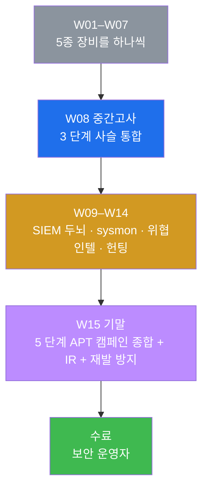

다음 단계는 더 넓은 실전이다 — 실제 위협 인텔 피드 구독, 더 정교한 APT 시뮬레이션(레드팀
훈련), 탐지 룰의 지속적 튜닝과 자동화(SOAR). 하지만 그 모든 것의 토대 — **다층 방어로 단계
마다 끊고, 흩어진 흔적을 한 사건으로 엮으며, 증거로 말하고, 재발까지 막는** 사고방식 — 을
학생은 이미 갖추었다. 수료를 축하한다. 🎓
