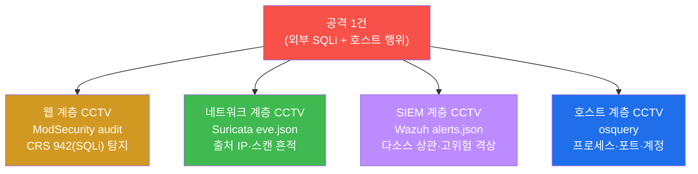
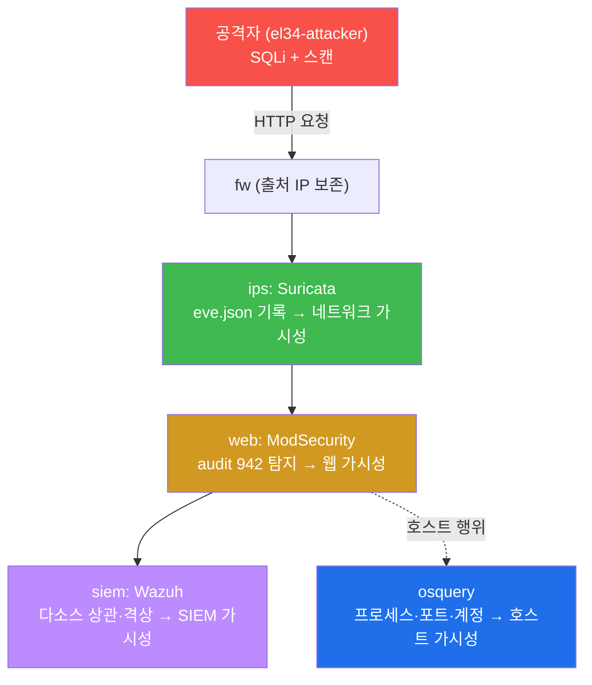
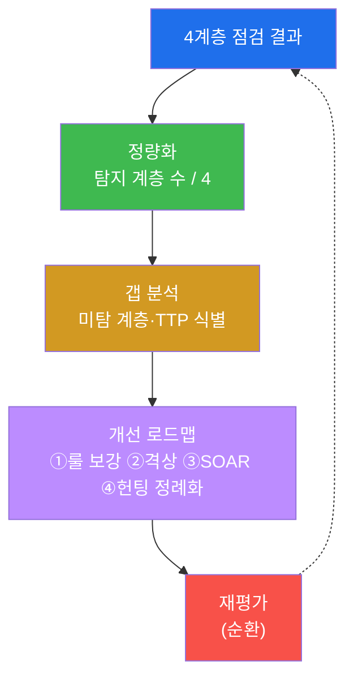

# SOC고급 W01 — SOC 성숙도 평가: 가시성 공백 점검과 탐지역량 정량화

> **본 주차의 한 줄 요약**
>
> SOC 고급 과정의 첫 주차는 **SOC 성숙도(SOC-CMM)** 를 다룬다. 그러나 성숙도는 정책 문서의 두께가 아니라
> **"우리가 실제로 무엇을 탐지하는가"** 로 증명된다. 이번 주차에 학생은 el34 인프라에 공격을 한 차례
> 흘려 보내고, 그 공격이 **웹(ModSecurity) · 네트워크(Suricata) · SIEM(Wazuh) · 호스트(osquery)** 의 4계층에
> 각각 탐지로 남는지를 직접 확인한다. 탐지되는 계층은 "가시성 있음", 탐지 못 하는 계층은 "가시성 공백"이며,
> 이 공백을 정량화해 개선 로드맵으로 잇는 것이 SOC 성숙도 평가의 본질이다.
>
> **관제자 한 줄 결론**: 성숙도는 "우리는 잘하고 있다"는 선언이 아니라, **공격을 흘렸을 때 몇 계층에서
> 증거가 남는가**라는 측정값이다. 보이지 않는 것은 막을 수 없고, 측정되지 않는 것은 개선할 수 없다.

---

## 학습 목표

본 주차 종료 시 학생은 다음 6가지를 **본인 손으로** 할 수 있어야 한다.

1. **SOC-CMM(SOC Capability Maturity Model)** 의 5개 도메인(Business·People·Process·Technology·Services)을
   설명하고, 성숙도를 "문서"가 아니라 "실제 탐지 역량"으로 측정해야 하는 이유를 논증한다.
2. 한 번의 공격(SQLi)을 흘려, 그것이 **웹 계층(ModSecurity audit, CRS 942)** 에 탐지로 남는지 확인한다.
3. 같은 공격의 **네트워크 계층(Suricata eve.json)** · **SIEM 계층(Wazuh alerts.json 고위험 상관)** 흔적을
   추적해, 다계층 가시성을 정량화한다.
4. **호스트 계층(osquery)** 으로 프로세스·포트·계정을 질의해, 네트워크 시그니처로 안 잡히는 호스트 행위까지
   헌팅할 수 있는지 점검한다.
5. 4계층 점검 결과로 **가시성 공백(gap)** 을 식별하고, 위험 기반 **개선 로드맵**(룰 보강 → 격상 → 자동화 →
   헌팅 정례화)을 작성한다.
6. 점검·평가·로드맵을 하나의 **SOC 성숙도 보고서**로 종합한다.

> **이 주차의 시선** — 본 주차는 새 공격 기법을 배우는 주가 아니라, 지금까지(soc 기본 트랙) 익힌 탐지 역량을
> **하나의 측정 가능한 평가 체계**로 묶는 주다. 채점은 "탐지룰을 안다"가 아니라, **공격을 흘려 4계층 중 몇
> 곳에서 증거를 확보했고, 공백을 어떻게 메울지**를 본다.

---

## 0. 용어 해설 (SOC 성숙도·가시성 입문)

본 주차에 처음 나오거나 특히 중요한 용어를 먼저 정리한다.

| 용어 | 영문 | 뜻 | 비유 |
|------|------|----|------|
| **SOC** | Security Operations Center | 보안 이벤트를 24/7 탐지·분석·대응하는 조직 | 도시의 119 종합상황실 |
| **성숙도** | maturity | 역량이 얼마나 체계적·반복가능·측정가능한가의 수준 | 견습 → 숙련 → 명장 단계 |
| **SOC-CMM** | SOC Capability Maturity Model | SOC 역량을 5도메인으로 평가하는 모델 | 종합병원 인증 평가표 |
| **가시성** | visibility | 무슨 일이 일어나는지 데이터로 볼 수 있는 정도 | CCTV가 닿는 범위 |
| **가시성 공백** | visibility gap | 탐지 데이터가 없어 안 보이는 영역 | CCTV 사각지대 |
| **정량화** | quantification | "잘한다"를 숫자(탐지 계층 수 등)로 바꾸는 것 | 체감 온도를 온도계 수치로 |
| **다계층 상관** | correlation | 여러 계층의 단서를 한 사건으로 잇는 것 | 흩어진 신고를 한 사건으로 묶기 |
| **갭 분석** | gap analysis | 목표 역량과 현재 역량의 차이를 도출 | 건강검진 결과의 부족 항목 |
| **ModSecurity** | ModSec | Apache의 웹 애플리케이션 방화벽(WAF) | 입구 금속탐지기 |
| **CRS 942** | Core Rule Set 942 | ModSec의 SQL Injection 탐지 룰군 | SQLi 전용 검문 매뉴얼 |
| **Suricata** | — | 네트워크 침입 탐지 엔진(eve.json 로그) | 도로 감시 카메라 |
| **Wazuh** | — | 로그를 모아 상관·격상하는 SIEM | 관제실 통합 모니터 |
| **osquery** | — | OS를 SQL로 질의하는 호스트 가시화 도구 | 건물 내부 입실 기록 조회 |

> **헷갈리기 쉬운 한 쌍 — 가시성 vs 차단.** 둘은 다르다. **가시성**은 "보이는가(탐지·기록되는가)"이고,
> **차단**은 "막는가"다. 성숙도 평가의 1순위는 **가시성**이다 — 보이지 않으면 막을 수도, 분석할 수도, 개선할
> 수도 없기 때문이다. dvwa vhost가 SQLi를 403으로 막아도(차단), 그 시도가 audit에 **기록**되어야(가시성)
> SOC가 그 위협을 인지하고 룰을 다듬는다. 본 주차는 차단 여부가 아니라 **기록·탐지 여부**를 본다.

---

## 0.5 신입생 친화 핵심 개념

### 0.5.1 왜 "문서 성숙도"는 가짜일 수 있는가 — 소방 훈련 비유

건물에 "화재 대응 절차서"가 두껍게 비치되어 있다고 그 건물이 화재에 강한 것은 아니다. 정작 불이 났을 때
**감지기가 울리고, 스프링클러가 작동하고, 대피로에 불이 들어오는가**가 진짜 역량이다. SOC도 똑같다 —
"우리는 SIEM이 있고 탐지룰이 있습니다"라는 말(문서)이 아니라, **실제 공격을 흘렸을 때 몇 계층에서 경보가
울리는가**가 성숙도다. 그래서 이번 주차는 문서를 읽는 대신, 공격을 한 발 흘려 **탐지가 실제로 발생하는지를
손으로 확인**한다.

### 0.5.2 가시성 4계층 — 네 대의 CCTV

공격 하나가 들어올 때, 그 흔적은 서로 다른 위치의 "CCTV"에 남는다.

네 대 중 몇 대가 그 공격을 잡았는가 — 그것이 가시성의 정량적 척도다. 한 대라도 사각지대(공백)이면, 그
계층을 노린 공격은 SOC의 눈을 피한다.

### 0.5.3 출처 IP 보존이 왜 성숙도의 기반인가

el34는 방화벽이 SNAT를 하지 않아 **외부 공격자의 출처 IP(192.168.0.202 / 내부 발판 10.20.30.202)가
웹·네트워크·SIEM 전 계층에 그대로 보존**된다. 출처가 보존되어야 "이 SQLi와 저 스캔과 그 호스트 행위가
같은 공격자의 것"이라고 **상관(correlation)** 할 수 있다. 출처가 NAT로 뭉개지면 다계층 상관이 무너지고,
성숙도의 핵심인 "사건 단위 재구성"이 불가능해진다.

---

## 1. SOC-CMM — 5개 도메인

**한 줄 정의.** SOC-CMM은 SOC의 역량을 다섯 도메인으로 나눠 각각의 성숙 수준(보통 0~5단계)을 평가하는
국제적으로 널리 쓰이는 모델이다.

| 도메인 | 무엇을 보는가 |
|--------|---------------|
| **Business** | SOC의 목표·범위·후원(경영진 지원)이 명확한가 |
| **People** | 분석가 역량·교육·인력 충분성 |
| **Process** | 탐지·triage·대응·헌팅 절차의 문서화·반복가능성 |
| **Technology** | SIEM·IDS·WAF·EDR 등 도구의 도입·통합·튜닝 |
| **Services** | 모니터링·인시던트 대응·위협 헌팅·인텔리전스 등 제공 서비스 |

**왜 중요한가.** 다섯 도메인은 서로를 떠받친다 — 좋은 도구(Technology)가 있어도 절차(Process)가 없으면
탐지가 일관되지 않고, 사람(People)이 부족하면 경보가 방치된다. 성숙도 평가는 약한 도메인을 드러내 투자
우선순위를 정한다.

**el34에서 어떻게.** 본 실습은 Technology(도구가 실제로 탐지하는가)와 Services(가시성 서비스가 4계층을
덮는가)를 **공격을 흘려 정량 측정**한다. Process/People/Business는 측정 결과를 해석하는 틀로 쓴다.

**한계.** 성숙도 점수 자체가 목적이 아니다. 점수는 "어디를 개선할지"의 출발점이며, 높은 점수가 곧 안전을
보장하지는 않는다(미성숙한 영역 하나가 침해 경로가 된다).

---

## 2. 가시성 4계층 점검 (실습의 핵심)

각 계층은 서로 다른 도구·데이터·증거를 가진다. 같은 공격이 각 계층에 어떻게 남는지를 본다.

### 2.1 웹 계층 — ModSecurity (CRS 942)

**한 줄 정의.** dvwa vhost는 ModSecurity가 차단형으로 동작해, SQLi 시도가 **modsec_audit.log**에 CRS
942(SQLi) 룰 탐지로 남는다. **왜 중요한가** — 웹은 가장 많이 노출된 표면이라 첫 번째 가시성 확인 대상이다.
**el34에서 어떻게** — 공격자가 `?id=1' UNION SELECT ...`를 보내고, web 컨테이너의 audit 로그에서 942 룰
ID가 잡히는지 본다. **한계** — DetectionOnly vhost(juice)는 차단은 안 하나 탐지는 기록하므로, vhost별
ModSec 모드를 알고 해석해야 한다.

### 2.2 네트워크 계층 — Suricata (eve.json)

**한 줄 정의.** Suricata는 pipe↔dmz 인라인에서 트래픽을 보고 **eve.json**에 이벤트를 남긴다. **왜 중요한가**
— 웹 로그에 안 남는 포트 스캔·비-HTTP 트래픽도 네트워크 계층은 본다. **el34에서 어떻게** — 출처
IP(10.20.30.202)가 eve.json에 보존되므로, 그 IP의 흔적 수로 네트워크 가시성을 정량화한다. **한계** —
암호화 트래픽 내부·소규모 스캔(임계 미달)은 못 볼 수 있다.

### 2.3 SIEM 계층 — Wazuh (상관·격상)

**한 줄 정의.** Wazuh manager는 ips·web agent의 로그를 모아 **alerts.json**에 적재하고, 룰 레벨로 위험도를
매긴다. **왜 중요한가** — 단일 계층 단서를 **다소스 상관**으로 한 사건으로 엮고, 고위험(level≥10)으로
격상해 분석가의 주의를 모은다. **el34에서 어떻게** — 고위험 알림 집계로 SIEM 상관 가시성을 본다. **한계** —
디코더·룰이 없으면 raw 로그만 쌓여 상관이 안 된다(고급 트랙 W02~W03에서 보강).

### 2.4 호스트 계층 — osquery

**한 줄 정의.** osquery는 OS의 프로세스·포트·계정을 SQL 테이블로 질의하게 한다. **왜 중요한가** —
네트워크 시그니처로 안 잡히는 호스트 내부 행위(백도어 계정, 숨은 리스너)는 호스트 계층만 본다. **el34에서
어떻게** — `SELECT ... FROM processes/listening_ports/users`로 헌팅 가능한지 점검한다. **한계** — 스냅샷
방식이라 짧게 생겼다 사라지는 행위는 이벤트 스트림(sysmon, 고급 트랙 후속)으로 보완한다.

---

## 3. 가시성 정량화·갭 분석·로드맵

성숙도는 **한 번의 평가로 끝나지 않는다.** 점검 → 정량화 → 갭 → 개선 → 재평가의 순환이며, 매 순환마다
탐지 계층 수와 TTP 커버리지가 올라가는 것이 성숙이다. 개선 로드맵의 우선순위는 **가시성 공백이 큰 계층 +
위험이 높은 TTP**부터다.

---

## 4. 실습 안내 (8 미션)

각 미션은 **이 미션을 왜 하는가 / 무엇을 알 수 있는가 / 결과 해석 / 실전 활용** 4축으로 진행한다.

1. **대상 도달** — 점검의 전제(도달성).
2. **웹 가시성** — SQLi를 흘려 ModSec 942 탐지 확인. *결과 해석*: 942 보이면 웹 가시성 있음.
3. **네트워크 가시성** — Suricata eve.json의 출처 흔적. *실전*: 출처 보존으로 다계층 상관의 기반.
4. **SIEM 가시성** — Wazuh 고위험 집계. *해석*: 다소스 상관·격상 역량.
5. **호스트 가시성** — osquery 헌팅 가능성. *실전*: 네트워크로 안 보이는 호스트 행위 탐지.
6. **SOC-CMM 평가** — 5도메인 + 가시성 정량화.
7. **갭 분석·로드맵** — 미탐 계층 → 위험 기반 개선 순서.
8. **성숙도 보고서** — 4계층·평가·로드맵 종합.

> 명령은 el34 호스트(`ssh ccc@192.168.0.151`)에서 `docker exec` 로. **인가된 실습 환경(el34)에서만** 수행하고,
> 점검은 읽기 전용을 원칙으로 한다.

---

## 5. 다음 주차 (W02) 예고 — SIEM 상관분석

W01은 4계층 가시성의 "존재"를 점검했다. W02는 그중 SIEM 계층을 깊게 — **다벡터 공격을 하나의 사건으로
묶는 상관분석(correlation) 룰**을 직접 만든다.
