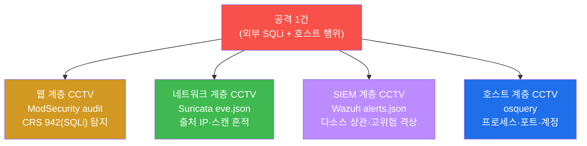
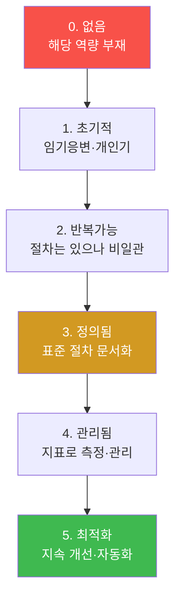
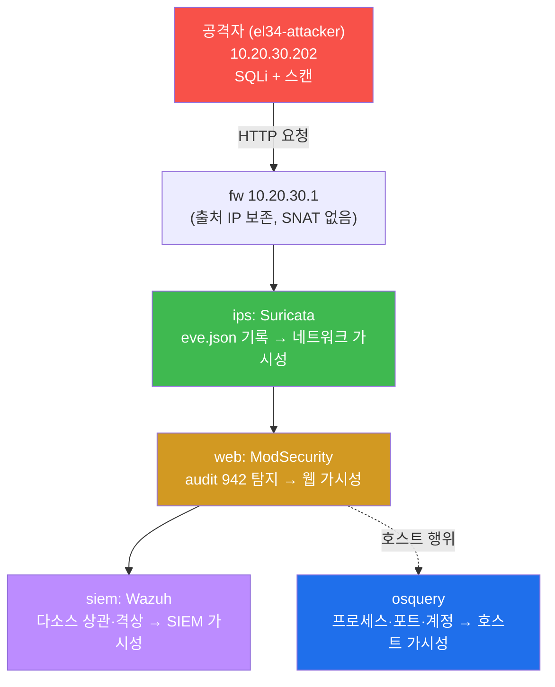
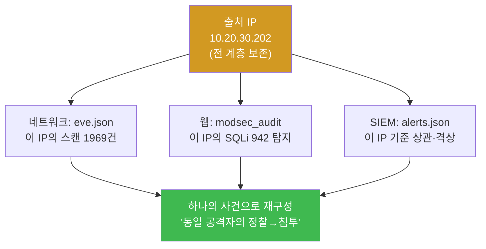
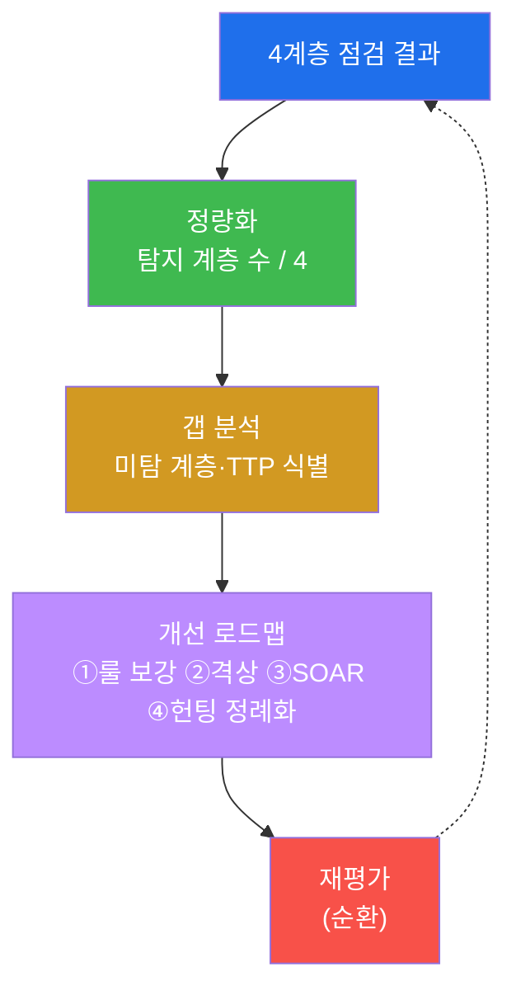

# SOC고급 W01 — SOC 성숙도 평가: 가시성 공백 점검과 탐지역량 정량화

> **본 주차의 한 줄 요약**
>
> SOC 고급 과정의 첫 주차는 **SOC 성숙도(SOC-CMM)** 를 다룬다. 그러나 성숙도는 정책 문서의 두께가 아니라
> **"우리가 실제로 무엇을 탐지하는가"** 로 증명된다. 이번 주차에 학생은 el34 인프라에 공격을 한 차례
> 흘려 보내고, 그 공격이 **웹(ModSecurity) · 네트워크(Suricata) · SIEM(Wazuh) · 호스트(osquery)** 의 4계층에
> 각각 탐지로 남는지를 직접 확인한다. 탐지되는 계층은 "가시성 있음", 탐지 못 하는 계층은 "가시성 공백"이며,
> 이 공백을 정량화해 개선 로드맵으로 잇는 것이 SOC 성숙도 평가의 본질이다.
>
> **관제자 한 줄 결론**: 성숙도는 "우리는 잘하고 있다"는 선언이 아니라, **공격을 흘렸을 때 몇 계층에서
> 증거가 남는가**라는 측정값이다. 보이지 않는 것은 막을 수 없고, 측정되지 않는 것은 개선할 수 없다.

---

## 학습 목표

본 주차 종료 시 학생은 다음 6가지를 **본인 손으로** 할 수 있어야 한다.

1. **SOC-CMM(SOC Capability Maturity Model)** 의 5개 도메인(Business·People·Process·Technology·Services)을
   설명하고, 성숙도를 "문서"가 아니라 "실제 탐지 역량"으로 측정해야 하는 이유를 논증한다.
2. 한 번의 공격(SQLi)을 흘려, 그것이 **웹 계층(ModSecurity audit, CRS 942)** 에 탐지로 남는지 확인한다.
3. 같은 공격의 **네트워크 계층(Suricata eve.json)** · **SIEM 계층(Wazuh alerts.json 고위험 상관)** 흔적을
   추적해, 다계층 가시성을 정량화한다.
4. **호스트 계층(osquery)** 으로 프로세스·포트·계정을 질의해, 네트워크 시그니처로 안 잡히는 호스트 행위까지
   헌팅할 수 있는지 점검한다.
5. 4계층 점검 결과로 **가시성 공백(gap)** 을 식별하고, 위험 기반 **개선 로드맵**(룰 보강 → 격상 → 자동화 →
   헌팅 정례화)을 작성한다.
6. 점검·평가·로드맵을 하나의 **SOC 성숙도 보고서**로 종합한다.

> **이 주차의 시선** — 본 주차는 새 공격 기법을 배우는 주가 아니라, 지금까지(soc 기본 트랙) 익힌 탐지 역량을
> **하나의 측정 가능한 평가 체계**로 묶는 주다. 채점은 "탐지룰을 안다"가 아니라, **공격을 흘려 4계층 중 몇
> 곳에서 증거를 확보했고, 공백을 어떻게 메울지**를 본다.

---

## 0. 용어 해설 (SOC 성숙도·가시성 입문)

본 주차에 처음 나오거나 특히 중요한 용어를 먼저 정리한다. 표를 한 번 훑고, 본문에서 다시 만나면
"아, 그거"가 되도록 한다.

| 용어 | 영문 | 뜻 | 비유 |
|------|------|----|------|
| **SOC** | Security Operations Center | 보안 이벤트를 24/7 탐지·분석·대응하는 조직 | 도시의 119 종합상황실 |
| **성숙도** | maturity | 역량이 얼마나 체계적·반복가능·측정가능한가의 수준 | 견습 → 숙련 → 명장 단계 |
| **SOC-CMM** | SOC Capability Maturity Model | SOC 역량을 5도메인으로 평가하는 모델 | 종합병원 인증 평가표 |
| **가시성** | visibility | 무슨 일이 일어나는지 데이터로 볼 수 있는 정도 | CCTV가 닿는 범위 |
| **가시성 공백** | visibility gap | 탐지 데이터가 없어 안 보이는 영역 | CCTV 사각지대 |
| **정량화** | quantification | "잘한다"를 숫자(탐지 계층 수 등)로 바꾸는 것 | 체감 온도를 온도계 수치로 |
| **다계층 상관** | correlation | 여러 계층의 단서를 한 사건으로 잇는 것 | 흩어진 신고를 한 사건으로 묶기 |
| **갭 분석** | gap analysis | 목표 역량과 현재 역량의 차이를 도출 | 건강검진 결과의 부족 항목 |
| **TTP** | Tactics·Techniques·Procedures | 공격자의 전술·기법·절차(행동 패턴) | 범인의 수법(MO) |
| **ModSecurity** | ModSec | Apache의 웹 애플리케이션 방화벽(WAF) | 입구 금속탐지기 |
| **CRS** | Core Rule Set | ModSec의 표준 탐지 룰 묶음(OWASP) | 검문 매뉴얼 전집 |
| **CRS 942** | Core Rule Set 942 | ModSec의 SQL Injection 탐지 룰군 | SQLi 전용 검문 매뉴얼 |
| **Suricata** | — | 네트워크 침입 탐지 엔진(eve.json 로그) | 도로 감시 카메라 |
| **eve.json** | Extensible Event format | Suricata가 이벤트를 한 줄씩 남기는 JSON 로그 | 감시카메라 영상 인덱스 |
| **Wazuh** | — | 로그를 모아 상관·격상하는 SIEM | 관제실 통합 모니터 |
| **alerts.json** | — | Wazuh가 격상한 경보를 적재하는 로그 | 관제실 경보 대장 |
| **level(레벨)** | rule level | Wazuh 룰이 매기는 위험도 점수(0~16) | 화재경보 1~3급 |
| **osquery** | — | OS를 SQL로 질의하는 호스트 가시화 도구 | 건물 내부 입실 기록 조회 |
| **SNAT** | Source NAT | 패킷의 출발지 IP를 게이트웨이 IP로 바꾸는 것 | 발신번호를 대표번호로 바꿈 |
| **SOAR** | Security Orchestration, Automation & Response | 대응을 자동화·오케스트레이션하는 체계 | 자동 소화 설비 |

> **헷갈리기 쉬운 한 쌍 — 가시성 vs 차단.** 둘은 다르다. **가시성**은 "보이는가(탐지·기록되는가)"이고,
> **차단**은 "막는가"다. 성숙도 평가의 1순위는 **가시성**이다 — 보이지 않으면 막을 수도, 분석할 수도, 개선할
> 수도 없기 때문이다. dvwa vhost가 SQLi를 403으로 막아도(차단), 그 시도가 audit에 **기록**되어야(가시성)
> SOC가 그 위협을 인지하고 룰을 다듬는다. 본 주차는 차단 여부가 아니라 **기록·탐지 여부**를 본다.

> **헷갈리기 쉬운 한 쌍 — 탐지 vs 분석.** 탐지(detection)는 "단서가 로그에 남는 것"이고, 분석(analysis)은
> "그 단서들을 사람·SIEM이 한 사건으로 엮어 의미를 부여하는 것"이다. 4계층 점검은 탐지가 되는지를 보고,
> 다계층 상관(SIEM)은 분석이 되는지를 본다.

---

## 0.5 신입생 친화 핵심 개념

처음 보는 용어·숫자·문법이 본문에서 "갑자기" 튀어나오지 않도록, 이번 주차에 꼭 필요한 개념을 일상 비유로
먼저 풀어 둔다.

### 0.5.1 왜 "문서 성숙도"는 가짜일 수 있는가 — 소방 훈련 비유

건물에 "화재 대응 절차서"가 두껍게 비치되어 있다고 그 건물이 화재에 강한 것은 아니다. 정작 불이 났을 때
**감지기가 울리고, 스프링클러가 작동하고, 대피로에 불이 들어오는가**가 진짜 역량이다. SOC도 똑같다 —
"우리는 SIEM이 있고 탐지룰이 있습니다"라는 말(문서)이 아니라, **실제 공격을 흘렸을 때 몇 계층에서 경보가
울리는가**가 성숙도다. 그래서 이번 주차는 문서를 읽는 대신, 공격을 한 발 흘려 **탐지가 실제로 발생하는지를
손으로 확인**한다.

### 0.5.2 가시성 4계층 — 네 대의 CCTV

공격 하나가 들어올 때, 그 흔적은 서로 다른 위치의 "CCTV"에 남는다. 한 대의 카메라가 모든 각도를 다 보지
못하듯, 한 계층의 로그가 모든 공격을 다 잡지 못한다. 그래서 SOC는 **계층을 겹쳐** 사각지대를 줄인다.



네 대 중 몇 대가 그 공격을 잡았는가 — 그것이 가시성의 정량적 척도다. 한 대라도 사각지대(공백)이면, 그
계층을 노린 공격은 SOC의 눈을 피한다.

### 0.5.3 출처 IP 보존이 왜 성숙도의 기반인가

el34는 방화벽이 SNAT를 하지 않아 **외부 공격자의 출처 IP(192.168.0.202 / 내부 발판 10.20.30.202)가
웹·네트워크·SIEM 전 계층에 그대로 보존**된다. 출처가 보존되어야 "이 SQLi와 저 스캔과 그 호스트 행위가
같은 공격자의 것"이라고 **상관(correlation)** 할 수 있다. 출처가 NAT로 뭉개지면 다계층 상관이 무너지고,
성숙도의 핵심인 "사건 단위 재구성"이 불가능해진다. (대부분의 상용 환경은 게이트웨이에서 SNAT를 하기
때문에 X-Forwarded-For 같은 헤더에 기대야 하지만, el34는 학습을 위해 출처를 살려 두었다.)

### 0.5.4 HTTP 상태 코드 빠르게 읽기 — `dvwa=302`, `sqli=403`, `=000`

실습에서 `curl ... -w '...=%{http_code}'` 로 응답 코드를 찍는다. 세 자리 숫자의 첫 자리가 큰 뜻을 가진다.

| 코드 | 분류 | 이번 주차에서의 의미 |
|------|------|----------------------|
| **2xx** (200) | 성공 | 요청이 정상 처리됨(juice 같은 탐지전용 vhost는 공격도 200) |
| **3xx** (302) | 리다이렉트 | dvwa가 로그인 페이지로 보냄 = **표적에 정상 도달**(STEP 1) |
| **4xx** (403) | 클라이언트 차단 | ModSec(WAF)가 공격을 **차단**함(STEP 2의 `sqli=403`) |
| **5xx** (500) | 서버 오류 | 앱 내부 오류(때로는 취약점의 신호) |
| **000** | 응답 없음 | **연결 자체가 실패**(표적 미도달 — 네트워크/컨테이너부터 점검) |

핵심: STEP 1에서 `000`이 아니라 세 자리 코드가 찍히면, 이후 "안 보임"은 미도달이 아니라 진짜 탐지 공백으로
해석할 수 있다.

### 0.5.5 SQLi `UNION SELECT` 한 줄 이해

이번 주차의 공격 페이로드는 `?id=1' UNION SELECT user,password--` (URL 인코딩하면 `1%27%20UNION...`)다.
원래 앱은 `SELECT ... WHERE id=1` 처럼 질의하는데, 공격자가 `1'` 로 따옴표를 닫고 `UNION SELECT
user,password` 를 덧붙여 **원래 결과에 다른 테이블(계정·비밀번호)의 행을 이어 붙이려는** 시도다. `--` 는 SQL
주석으로 뒤를 무력화한다. 우리는 이 공격을 **성공시키려는 게 아니라**, 이 시도가 WAF audit에 942(SQLi) 룰로
**탐지되는지**를 보려고 흘린다.

### 0.5.6 Wazuh 경보 레벨(`"level":12`)이란 — 임의 숫자가 아니다

Wazuh의 모든 룰에는 **레벨(0~16)** 이 붙는다. 이 숫자는 누가 막 정한 게 아니라 **위험도 등급**이다.

| 레벨 | 의미 |
|------|------|
| 0~3 | 무시·정보성(로그인 성공 등) |
| 4~7 | 경미(설정 변경, 일반 오류) |
| 8~11 | 주의(인증 실패 반복, 웹 공격) |
| **12~16** | **고위험**(다중 실패 후 성공, 룰 상관으로 격상된 공격) |

실습 STEP 4는 `"level":1[0-9]` 패턴(즉 10~19, 실질적으로 10~16)을 세어 **고위험 경보 수**를 구한다. 이 숫자가
0보다 크면, Wazuh가 단순 로그를 넘어 "위험한 것"을 골라 격상하고 있다는 증거다.

### 0.5.7 완료 마커(`netvis_done`, `soc_cmm_assessed` …)는 무엇인가

실습 명령 끝에 `echo netvis_done` 같은 영어 단어가 자주 찍힌다. 이건 도구 출력이 아니라 **이 단계가 끝까지
실행됐음을 알리는 우리(채점)의 약속 문자열**이다. 채점기는 이 마커가 출력에 있으면 그 단계를 통과로 본다.
주의할 점: 마커는 "스크립트가 끝까지 돌았다"는 신호일 뿐, **진짜 근거는 그 위에 찍힌 실제 수치**(942 건수,
eve 흔적 수, 고위험 경보 수)다. 그래서 잘 만든 실습의 마커는 항상 `[ 조건 ] && echo 마커` 처럼 **실제 결과에
게이트**되어, 점검이 실패하면 마커도 안 찍히게 설계한다.

---

## 1. SOC-CMM — 5개 도메인과 성숙 단계

**한 줄 정의.** SOC-CMM은 SOC의 역량을 다섯 도메인으로 나눠 각각의 성숙 수준(보통 0~5단계)을 평가하는,
국제적으로 널리 쓰이는 모델이다. 네덜란드의 SOC-CMM 프로젝트가 공개한 무료 평가 프레임워크에서 출발했다.

| 도메인 | 무엇을 보는가 | el34 실습과의 연결 |
|--------|---------------|--------------------|
| **Business** | SOC의 목표·범위·후원(경영진 지원)이 명확한가 | 평가 결과를 "투자 우선순위"로 해석하는 틀 |
| **People** | 분석가 역량·교육·인력 충분성 | 본 과정(soc-adv) 자체가 People 투자 |
| **Process** | 탐지·triage·대응·헌팅 절차의 문서화·반복가능성 | STEP 7의 개선 로드맵이 Process 산출물 |
| **Technology** | SIEM·IDS·WAF·EDR 등 도구의 도입·통합·튜닝 | STEP 2~5에서 도구가 실제로 탐지하는가 측정 |
| **Services** | 모니터링·인시던트 대응·위협 헌팅·인텔 등 제공 서비스 | 4계층 가시성이 서비스 커버리지를 결정 |

**성숙 단계(0~5)는 무엇인가.** CMM 계열 모델은 보통 다음처럼 단계를 나눈다 — 이 사다리를 한 칸씩 올리는
것이 "성숙"이다.



**왜 중요한가.** 다섯 도메인은 서로를 떠받친다 — 좋은 도구(Technology)가 있어도 절차(Process)가 없으면
탐지가 일관되지 않고, 사람(People)이 부족하면 경보가 방치된다. 성숙도 평가는 약한 도메인을 드러내 투자
우선순위를 정한다. "레벨 4 도구 + 레벨 1 절차"라면, 다음 투자는 새 도구가 아니라 절차 정비다.

**el34에서 어떻게.** 본 실습은 측정 가능한 두 도메인 — Technology(도구가 실제로 탐지하는가)와
Services(가시성 서비스가 4계층을 덮는가) — 를 **공격을 흘려 정량 측정**한다. Process/People/Business는
측정 결과를 해석하는 틀로 쓴다(예: "호스트 계층 미탐 → Process에 호스트 헌팅 정례화 추가").

**한계.** 성숙도 점수 자체가 목적이 아니다. 점수는 "어디를 개선할지"의 출발점이며, 높은 점수가 곧 안전을
보장하지는 않는다(미성숙한 영역 하나가 침해 경로가 된다). 또한 자가평가는 과대평가되기 쉬워, 본 주차처럼
**실측(공격을 흘려 본 증거)** 으로 보정해야 한다.

---

## 2. 가시성 4계층 점검 (실습의 핵심)

각 계층은 서로 다른 도구·데이터·증거를 가진다. 같은 공격이 각 계층에 어떻게 남는지를, 실제 명령과 그
출력 해석까지 함께 본다. 아래는 공격 한 건이 el34의 4-tier를 통과하며 각 계층에 흔적을 남기는 경로다.



### 2.1 웹 계층 — ModSecurity (CRS 942)

**한 줄 정의.** dvwa vhost는 ModSecurity가 차단형으로 동작해, SQLi 시도가 **modsec_audit.log**에 CRS
942(SQLi) 룰 탐지로 남는다.

**CRS 룰 번호는 임의 숫자가 아니다.** OWASP Core Rule Set은 공격 유형별로 번호대를 나눠 쓴다 — 이 번호만
봐도 "무슨 공격으로 탐지됐는지"를 안다.

| 룰군 | 공격 유형 |
|------|-----------|
| 913 | 스캐너·봇 탐지 |
| 930 | LFI(로컬 파일 인클루전) |
| 931 | RFI(원격 파일 인클루전) |
| 932 | RCE(원격 명령 실행) |
| 933 | PHP 인젝션 |
| 941 | XSS |
| **942** | **SQL Injection** |
| 949 | 이상 점수 합산(anomaly) |

**왜 중요한가.** 웹은 가장 많이 노출된 표면이라 첫 번째 가시성 확인 대상이다. 그리고 942 같은 번호로
탐지가 분류되므로, SOC는 "어떤 공격이 얼마나 들어오는지"를 룰군 단위로 통계낼 수 있다.

**el34에서 어떻게 — 실측 예.** 공격자가 SQLi를 보낸 뒤 web 컨테이너에서 audit 로그의 942 룰을 집계한다.

```bash
# el34-attacker: SQLi 한 발
curl -s -o /dev/null -w 'sqli=%{http_code}\n' -H 'Host: dvwa.el34.lab' \
  "http://10.20.30.1/?id=1%27%20UNION%20SELECT%20user,password--"
# el34-web: audit 로그에서 942 룰군만 집계
sudo tail -400 /var/log/apache2/modsec_audit.log | grep -oE '942[0-9]{3}' | sort | uniq -c | head -3
```

```
sqli=403
     52 942100
      2 942160
     10 942190
```

**읽는 법.** `sqli=403` 은 WAF가 이 SQLi를 차단했다는 뜻이지만, **핵심은 그 아래 942 줄이다.** `52 942100`
은 "942100 룰이 52번 발화"라는 뜻 — 즉 SQLi 시도가 audit에 탐지로 또렷이 남았다 = **웹 계층 가시성 있음**.

**한계.** DetectionOnly vhost(juice)는 차단은 안 하나 탐지는 기록하므로(공격해도 200), vhost별 ModSec
모드를 알고 해석해야 한다. 또 el34의 modsec_audit.log는 **멀티라인 JSON**이라 `tail -1 | jq` 가 안 되고,
매치된 룰 ID는 per-vhost `*_error.log` 에서 더 정확히 본다(soc 기본 트랙에서 다룸).

### 2.2 네트워크 계층 — Suricata (eve.json)

**한 줄 정의.** Suricata는 pipe↔dmz 인라인에서 트래픽을 보고 **eve.json**(이벤트를 한 줄당 하나의 JSON으로
남기는 로그)에 이벤트를 기록한다.

**왜 중요한가.** 웹 로그에 안 남는 포트 스캔·비-HTTP 트래픽도 네트워크 계층은 본다. 공격의 "정찰" 단계는
대개 HTTP가 아니라 raw TCP 스캔이라, 웹 로그만 보는 SOC는 이 단계를 통째로 놓친다.

**el34에서 어떻게 — 실측 예.** 포트 스캔을 흘리고 eve.json에서 공격자 출처 IP 흔적을 센다.

```bash
# el34-attacker: SYN 스캔
nmap -sS -T4 --top-ports 50 10.20.30.1 | grep -c open
# el34-ips: eve.json에서 공격자 IP가 찍힌 이벤트 수
tail -2000 /var/log/suricata/eve.json | grep -c '10.20.30.202'
```

```
4
1969
```

**읽는 법.** 첫 줄 `4` = 열린 포트 수. 둘째 줄 `1969` = 최근 eve.json에서 출처 IP `10.20.30.202` 가 등장한
이벤트 수. 둘째 줄이 0보다 크면 IPS가 그 출처를 **보고 있다**(네트워크 가시성 있음). 출처가 보존되므로 이
흔적을 뒤(SIEM)에서 같은 공격자의 다른 단서와 묶을 수 있다.

> `nmap -sS` 의 `-sS` 는 **SYN(half-open) 스캔** — 3-way 핸드셰이크를 끝까지 안 맺고 SYN만 보내 응답으로
> 포트 개방을 판별하는, 빠르고 흔적이 비교적 적은 스캔이다. `-T4` 는 속도(타이밍) 단계, `--top-ports 50` 은
> 가장 흔한 50개 포트만 본다는 뜻.

**한계.** 암호화 트래픽의 내부 페이로드, 그리고 임계치에 못 미치는 소규모 스캔은 못 볼 수 있다. 그래서
대규모/반복 스캔일수록 잘 잡히고, 한두 포트만 살짝 건드리는 정찰은 빠질 수 있다.

### 2.3 SIEM 계층 — Wazuh (상관·격상)

**한 줄 정의.** Wazuh manager는 ips·web agent의 로그를 모아 **alerts.json**에 적재하고, 룰 레벨로 위험도를
매긴다. el34는 Wazuh 4.10이며, 활성 에이전트는 **ips(003)·web(004)** 두 개다.

**왜 중요한가.** 단일 계층 단서 하나하나는 약하다. SIEM은 여러 소스를 **다소스 상관**으로 한 사건으로 엮고,
고위험(level≥10)으로 격상해 분석가의 주의를 모은다. "웹 941 한 건"은 약하지만 "같은 IP의 스캔 + 941 +
인증 실패 반복"이 묶이면 강한 신호가 된다 — 그 격상이 SIEM의 일이다.

**el34에서 어떻게 — 실측 예.**

```bash
# el34-siem: alerts.json에서 고위험(level 10~19) 경보 수
N=$(tail -3000 /var/ossec/logs/alerts/alerts.json | grep -oE '"level":1[0-9]' | wc -l); echo "siem_high=$N"
```

```
siem_high=44
```

**읽는 법.** `siem_high=44` 는 최근 3000줄에서 고위험 경보가 44건이라는 뜻. 0보다 크면 Wazuh가 raw 로그를
넘어 위험한 것을 골라 격상하고 있다 = SIEM 가시성 있음.

**한계.** 디코더·룰이 없으면 raw 로그만 쌓이고 상관이 안 된다(0이 나옴). 이 보강이 고급 트랙 W02(상관 룰)·
W03(SIGMA)·W12(로그 엔지니어링)의 핵심 주제다.

### 2.4 호스트 계층 — osquery

**한 줄 정의.** osquery는 OS의 프로세스·포트·계정 등을 **SQL 테이블처럼 질의**하게 해 주는 호스트 가시화
도구다. `SELECT pid,name FROM processes` 처럼 운영체제 상태를 데이터베이스 다루듯 조회한다.

**왜 중요한가.** 네트워크 시그니처로 안 잡히는 호스트 내부 행위 — 백도어 계정, 숨은 리스너, 삭제됐는데도
메모리에서 도는 프로세스 — 는 호스트 계층만 본다. 네트워크가 "문을 통과하는 사람"을 본다면, 호스트는
"건물 안에서 무슨 일이 벌어지는가"를 본다.

**el34에서 어떻게 — 실측 예.**

```bash
# el34-web: 프로세스 1건 질의
osqueryi --json 'SELECT pid,name FROM processes LIMIT 1' | head -c 40
```

```
[
  {"name":"sshd","pid":"1"}
```

**읽는 법.** JSON 한 건이 나오면 osquery 질의가 동작하는 것(`head -c 40` 으로 앞부분만 잘라 보여줌). 질의가
되면 `processes`·`listening_ports`·`users` 같은 테이블로 백도어/은닉을 헌팅할 수 있다 = 호스트 가시성 있음.

**한계.** osquery는 '지금 이 순간'의 **스냅샷**이라, 잠깐 생겼다 사라지는 행위(짧은 실행, 파일리스)는 놓칠 수
있다. 이벤트 스트림(sysmon — 시간순으로 모든 프로세스 생성/네트워크 연결을 기록)으로 보완하며, 이는 고급
트랙 후속 주차(W08 메모리 포렌식, attack-adv W11 안티포렌식의 방어 측)에서 다룬다.

---

## 3. 출처 IP 보존과 다계층 상관 — el34가 성숙도를 가르치기 좋은 이유

4계층에 흔적이 남아도, 그 흔적들이 **같은 공격자의 것**이라고 묶이지 않으면 사건 재구성이 안 된다. 묶는
열쇠가 바로 **출처 IP**다.



el34는 fw가 SNAT를 하지 않아 출처가 전 계층에 그대로 남는다. 그래서 "네트워크의 스캔"과 "웹의 SQLi"가
같은 `10.20.30.202` 임을 보고 **한 공격자의 정찰→침투 시퀀스**로 엮을 수 있다. 상용 환경에서 이 묶기가 잘
안 되는 가장 흔한 이유가 출처 소실(SNAT)이며, 그래서 SOC 성숙의 한 지표가 "출처를 끝까지 추적할 수
있는가"다. 본 주차의 4계층 점검은 사실상 **이 상관의 재료가 각 계층에 갖춰져 있는지**를 확인하는 일이다.

---

## 4. 가시성 정량화·갭 분석·로드맵



**정량화 — 한 줄 워크드 예제.** 4계층 중 웹·네트워크·SIEM은 탐지되고 호스트만 안 됐다면 가시성은 **3/4**.
점수가 75%라고 안심할 게 아니라, "빠진 1/4(호스트)이 어떤 공격을 보이지 않게 하는가"를 본다 — 호스트
미탐이면 백도어 계정·파일리스 악성코드가 사각지대다.

**갭 분석 — 두 종류의 갭.** (1) **소스 갭**: 로그 소스 자체가 없는 경우(eve.json/alerts.json/osquery 부재).
STEP 7이 이걸 프로브한다. (2) **품질 갭**: 소스는 있는데 룰·디코더가 약해 "보이지만 못 잡는" 경우. 이건
STEP 2~5의 실제 탐지 결과로 판단한다. 성숙한 SOC는 두 갭을 구분해 보고한다.

**개선 로드맵의 우선순위.** `가시성 공백이 큰 계층 + 위험이 높은 TTP` 부터다. 표준 순서는 ①룰 보강
(SIGMA·Suricata 시그니처) → ②격상(Wazuh 상관·레벨 조정) → ③SOAR(대응 자동화) → ④헌팅 정례화(주기적
osquery·로그 헌팅). 이 네 단계가 그대로 고급 트랙 W02~W14의 뼈대이기도 하다.

성숙도는 **한 번의 평가로 끝나지 않는다.** 점검 → 정량화 → 갭 → 개선 → 재평가의 순환이며, 매 순환마다
탐지 계층 수와 TTP 커버리지가 올라가는 것이 성숙이다.

---

## 5. 실습 안내 (8 미션)

각 미션을 **① 왜 하는가 / ② 무엇을 알 수 있는가 / ③ 결과 해석(정상 vs 비정상) / ④ 실전 활용** 4축으로
설명한다. 모든 명령은 el34 호스트(`ssh ccc@192.168.0.80`, pw `1`)에서 수행하며, 점검은 읽기 전용을
원칙으로 한다. **인가된 실습 환경(el34)에서만** 한다.

### STEP 1 — 표적 도달 확인 (`dvwa=` 코드)
- **왜**: 뒤에서 "안 보인다"가 나왔을 때, 진짜 탐지 공백인지 그냥 표적 미도달인지 구분하려면 도달성부터
  확정해야 한다. 점검의 전제다.
- **무엇을**: 공격자→fw→ips→web→dvwa 경로가 살아 있는지.
- **해석**: 세 자리 코드(예 `dvwa=302`)면 도달 OK. `dvwa=000` 이면 미도달 → 네트워크/컨테이너 상태부터.
- **실전**: 모든 점검·모의훈련의 0단계 = "내가 표적에 닿는가"를 먼저 못 박는다.

### STEP 2 — 웹 가시성 (ModSec 942)
- **왜**: 가장 노출된 웹 표면에서 "막았는가"가 아니라 "탐지·기록되는가"를 본다.
- **무엇을**: SQLi 시도가 modsec_audit에 942 룰로 남는지.
- **해석**: `942xxx` 가 1건이라도 보이면 웹 가시성 '있음'. 안 보이면 `tail` 범위를 늘리거나(-2000) vhost의
  ModSec 모드를 확인(dvwa=차단, juice=탐지만).
- **실전**: 룰군 번호로 공격 유형별 통계·추세를 낸다(942 급증 = SQLi 캠페인 신호).

### STEP 3 — 네트워크 가시성 (Suricata eve.json)
- **왜**: 웹 로그에 안 남는 포트 스캔·비-HTTP를 네트워크 계층이 본다.
- **무엇을**: 출처 IP(10.20.30.202) 흔적이 eve.json에 쌓이는지(건수).
- **해석**: 둘째 줄 건수가 0보다 크면 네트워크 가시성 '있음'. `netvis_done` 은 완료 표시일 뿐, 근거는 건수.
- **실전**: 출처 보존 흔적이 SIEM 상관의 재료가 된다("이 IP의 스캔 + 저 SQLi = 한 공격자").

### STEP 4 — SIEM 가시성 (Wazuh 고위험)
- **왜**: 약한 단서들을 모아 위험한 것을 골라 격상하는 게 SIEM의 일.
- **무엇을**: alerts.json의 고위험(level 10~19) 경보 수.
- **해석**: `siem_high=` 뒤 숫자가 0보다 크면 상관·격상 '있음'. 0이면 디코더·룰 부족(W02~W03 보강).
- **실전**: 분석가의 큐는 고위험부터 — 격상이 곧 분석 우선순위 결정.

### STEP 5 — 호스트 가시성 (osquery)
- **왜**: 네트워크로 안 보이는 호스트 내부 행위(백도어 계정·숨은 리스너)는 호스트 계층만 본다.
- **무엇을**: osquery 질의가 동작해 processes/ports/users를 헌팅할 수 있는지.
- **해석**: JSON 한 건이 나오면 호스트 가시성 '있음'. `hostvis_done` 은 완료 표시, 근거는 JSON 출력.
- **실전**: 침해 의심 호스트에서 `SELECT ... FROM processes/listening_ports/users` 로 즉시 헌팅.

### STEP 6 — 정량화 (SOC-CMM)
- **왜**: 성숙도는 말이 아니라 "몇 계층 확보"라는 숫자다.
- **무엇을**: 네트워크/SIEM/호스트 3계층 소스가 살아 있는지 프로브해 `N/3` 산출(웹은 STEP 2에서 이미 확인).
- **해석**: `N≥2` 면 최소 기준 통과 → `soc_cmm_assessed`. 단 "소스 있음 ≠ 탐지 품질 좋음"에 주의.
- **실전**: 경영 보고용 한 줄 지표("가시성 N/4계층")의 원천.

### STEP 7 — 갭 분석·로드맵
- **왜**: 탐지 못 하는 계층이 곧 공격자의 사각지대 → 어디부터 투자할지 정한다.
- **무엇을**: 각 계층 프로브가 '실패'하는 곳(미탐 계층=갭)을 모으고 표준 로드맵을 붙인다.
- **해석**: el34는 3계층 소스가 다 살아 보통 "갭 없음". 실무에선 빠진 계층이 1순위. `gap_roadmap_done` 으로 완료.
- **실전**: 로드맵(룰보강→격상→SOAR→헌팅)이 다음 분기 투자·과제 목록이 된다.

### STEP 8 — 성숙도 보고서
- **왜**: 의사결정자는 느낌이 아니라 실측 수치를 보고 움직인다.
- **무엇을**: 앞에서 잰 N계층을 인용한 보고서 골격 출력.
- **해석**: `N≥2` 실측이 인용되면 `soc_maturity_report_done`. 제출용은 STEP 2~7의 구체 수치를 본문으로 채움.
- **실전**: "증거 기반 보고" — 942 건수·eve 흔적·고위험 수·갭별 개선안을 묶어 경영진/기술진 두 층으로 작성.

---

## 6. 흔한 오해·관제자 노트

- **"403이면 안전하다"** — 차단(403)은 좋지만, 차단됐다고 그 시도가 **기록**됐다는 보장은 없다. 성숙도는
  차단율이 아니라 **탐지·기록율**로 잰다. 막혔어도 안 남으면 추세 분석·상관이 불가능하다.
- **"마커가 찍혔으니 통과"** — 마커(`*_done`)는 스크립트 완주 신호일 뿐이다. 잘 설계된 마커는 실제 수치에
  게이트되지만, 항상 그 위의 **실수치**를 근거로 봐야 한다.
- **"점수 높으면 성숙"** — 자가평가 점수는 과대평가되기 쉽다. 본 주차처럼 **공격을 흘려 본 증거**로 보정해야
  믿을 수 있다.
- **"소스만 있으면 가시성 완성"** — 소스 갭(로그 자체 부재)과 품질 갭(룰·디코더 약함)은 다르다. 둘을
  구분해 보고하는 SOC가 성숙한 SOC다.

---

## 7. 다음 주차 (W02) 예고 — SIEM 상관분석

W01은 4계층 가시성의 "존재"를 점검했다. W02는 그중 **SIEM 계층을 깊게** 들어가 — 흩어진 단서(스캔 +
SQLi + 인증 실패)를 **하나의 사건으로 묶는 상관분석(correlation) 룰**을 직접 만든다. 이번 주차에서 본
"출처 IP 보존"이 그때 상관의 열쇠가 되고, "Wazuh 레벨 격상"이 그때 룰의 결과물이 된다.
