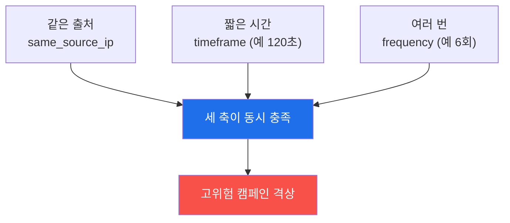
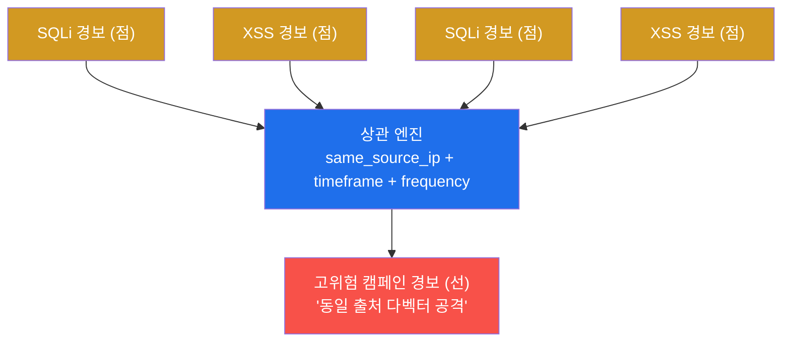
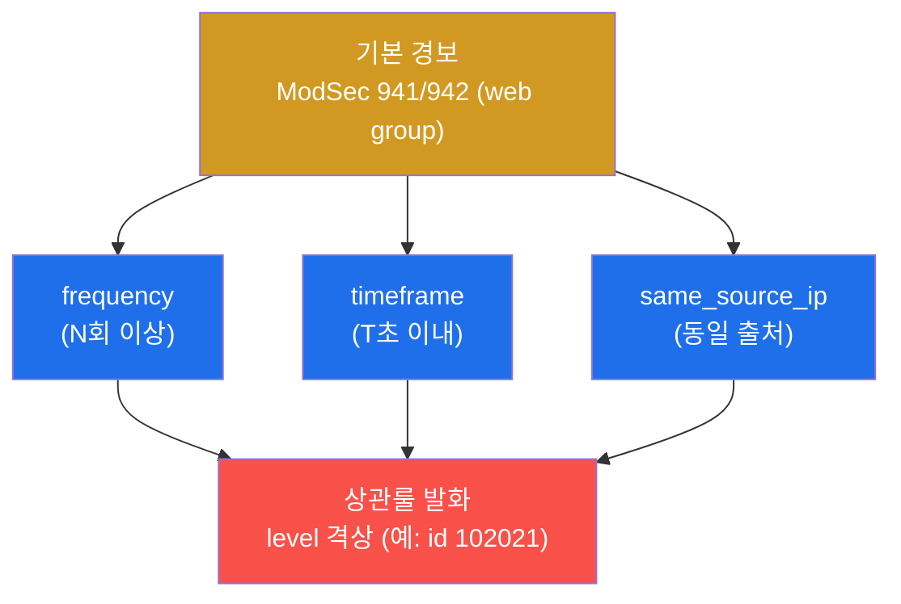
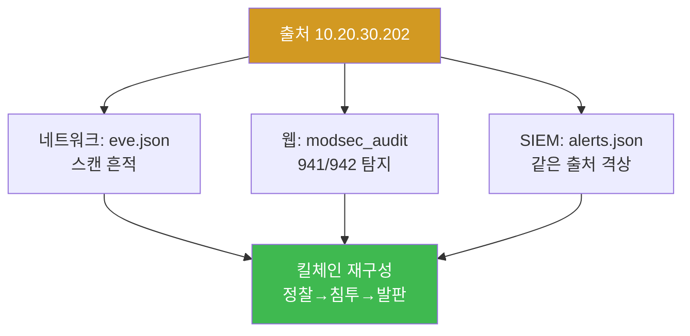

# SOC고급 W02 — SIEM 상관분석: 다벡터 공격을 복합 탐지로 묶기

> **본 주차의 한 줄 요약**
>
> 미성숙한 SOC는 경보를 한 건씩 본다. 성숙한 SOC는 **여러 경보의 패턴**을 본다 — "같은 출처가 1~2분 안에
> SQLi와 XSS를 섞어 퍼붓는다"는 것은 개별로는 노이즈여도, 묶으면 분명한 **공격 캠페인**이다. 본 주차에
> 학생은 다벡터 웹 공격(SQLi+XSS 반복)을 흘려 ModSecurity에 다수 탐지를 만들고, 이를 **출처(same_source_ip)·
> 시간창(timeframe)·횟수(frequency)** 의 세 축으로 묶는 **상관분석(correlation)** 룰을 설계해 고위험으로
> 격상한다.
>
> **관제자 한 줄 결론**: 상관분석은 "점(개별 경보)을 선(캠페인)으로 잇는" 기술이다. 단일 경보의 임계를
> 낮추면 오탐이 폭주하지만, **여러 약한 신호의 동시 발생**을 보면 적은 오탐으로 강한 캠페인을 잡는다.

---

## 학습 목표

본 주차 종료 시 학생은 다음 5가지를 **본인 손으로** 할 수 있어야 한다.

1. **상관분석(correlation)** 이 단일 룰 탐지와 무엇이 다른지(여러 경보의 패턴 vs 한 경보)를 설명한다.
2. 같은 출처에서 **SQLi(CRS 942)+XSS(CRS 941)** 를 반복 투입해 다벡터 캠페인 패턴을 만들고 ModSec에서 확인한다.
3. 상관의 세 축 — **same_source_ip · timeframe · frequency** — 로 흩어진 경보를 한 사건으로 묶는 룰을 설계한다.
4. 상관룰이 유발하는 **오탐(내부 스캐너)** 을 화이트리스트 예외로 다스린다.
5. 웹+네트워크+호스트 **교차 상관**으로 킬체인을 재구성하고, 룰을 **MITRE ATT&CK 커버리지**로 관리한다.

> **이 주차의 시선** — 채점은 "룰을 만들었다"가 아니라, **다벡터 패턴을 만들고 → 세 축으로 묶고 → 오탐을
> 다스리고 → ATT&CK으로 커버리지를 관리**했는가를 본다.

---

## 0. 용어 해설

| 용어 | 영문 | 뜻 | 비유 |
|------|------|----|------|
| **상관분석** | correlation | 여러 경보·로그를 한 사건으로 묶어 의미를 찾는 분석 | 흩어진 목격담을 한 사건으로 정리 |
| **다벡터 공격** | multi-vector | 여러 공격 기법(SQLi·XSS 등)을 함께 쓰는 공격 | 정문·창문·뒷문을 동시에 두드림 |
| **CRS 941 / 942** | Core Rule Set | ModSec의 XSS(941)·SQLi(942) 탐지 룰군 | 공격 유형별 검문 매뉴얼 |
| **same_source_ip** | — | 같은 출발지 IP로 경보를 묶는 상관 축 | "같은 사람이 한 짓" 기준 |
| **timeframe** | — | 상관을 적용할 시간 창(예: 120초) | "2분 안에 벌어진 일" |
| **frequency** | — | 시간 창 안의 발생 횟수 임계 | "같은 일이 N번 이상" |
| **if_matched_sid** | — | 특정 룰(sid)이 N회 발생 시 발화하는 Wazuh 상관 조건 | "이 경보가 여러 번이면 격상" |
| **격상** | escalation | 약한 경보들을 묶어 고위험 경보로 올림 | 잔불 여러 개 → 화재 경보 |
| **오탐 예외** | whitelist | 정상 행위(내부 스캐너)를 상관에서 제외 | 정기 점검 차량은 통과 |
| **wazuh-logtest** | — | 로그 한 줄을 넣어 디코딩·룰 발화를 단계별로 보는 도구 | 모의 시험지 채점기 |
| **MITRE ATT&CK** | — | 공격 전술·기법을 번호(T####)로 정리한 지식 베이스 | 범죄 수법 백과사전 |
| **ATT&CK 커버리지** | — | 어떤 Technique를 탐지하는지의 지도 | 검문소가 막는 범죄 유형 목록 |
| **킬체인** | kill chain | 정찰→침투→발판→… 공격 단계의 사슬 | 범행의 시간순 재구성 |

> **헷갈리기 쉬운 한 쌍 — 임계 낮추기 vs 상관.** 단일 룰의 임계를 낮춰 민감하게 하면 **오탐이 폭주**한다.
> 상관은 다르다 — 각 신호는 그대로 두되, **여러 약한 신호가 같은 출처·시간에 겹칠 때만** 격상하므로,
> 적은 오탐으로 강한 캠페인을 잡는다. "민감도를 높이는" 게 아니라 "패턴을 보는" 것이 상관의 본질이다.

---

## 0.5 신입생 친화 핵심 개념

### 0.5.1 상관의 세 축 — 은행 이상거래 탐지 비유

은행은 결제 한 건만으로 사기를 판단하지 않는다. "**같은 카드**(same_source_ip)가 **10분 안에**(timeframe)
**전국 5개 도시에서**(frequency) 결제"라는 **조합**을 보고 차단한다. SOC 상관도 똑같다 — 세 축이 동시에
맞아떨어질 때만 격상한다. 한 축만으로는(예: "SQLi 1건") 평범한 노이즈다.



### 0.5.2 XSS 페이로드 한 줄 이해 — `<script>alert(1)</script>`

이번 주차의 두 번째 벡터는 XSS다. 페이로드 `?q=<script>alert(1)</script>`(URL 인코딩 시
`%3Cscript%3Ealert(1)%3C/script%3E`)는 입력값에 **자바스크립트를 끼워 넣어** 피해자 브라우저에서 실행시키려는
시도다. `alert(1)` 은 "스크립트가 실행되면 경고창을 띄운다"는 무해한 증명용이다. SQLi(942)와 XSS(941)를
번갈아 보내면 ModSec에 두 룰군이 함께 찍혀 **다벡터** 패턴이 만들어진다.

### 0.5.3 Wazuh 상관룰은 어떻게 생겼나 — `frequency`/`timeframe`/`if_matched_sid`

Wazuh 룰은 XML이다. 상관룰은 "기본 룰이 여러 번이면 새 고위험 룰을 발화"하는 구조다.

```xml
<rule id="102021" level="12" frequency="6" timeframe="120">
  <if_matched_sid>31100</if_matched_sid>   <!-- 이 sid(웹 공격 룰)가 -->
  <same_source_ip/>                          <!-- 같은 출처에서 -->
  <description>동일 출처 다벡터 웹 공격 캠페인</description>
</rule>
```

읽는 법: "sid 31100(웹 공격) 경보가 **같은 출처**(`same_source_ip`)에서 **120초 안**(`timeframe`)에 **6회
이상**(`frequency`) 누적되면, **id 102021**(우리가 정한 번호) 룰을 **level 12**(고위험)로 발화." 여기서
`id 102021` 과 `level 12` 는 우리가 부여한 값이다 — 임의로 보이지만 규칙이 있다(아래 0.5.5).

### 0.5.4 wazuh-logtest의 Phase 1·2·3이란

`wazuh-logtest` 는 로그 한 줄을 넣으면 **세 단계**로 처리 과정을 보여준다 — 라이브 SIEM을 건드리지 않는
"모의 채점기"다.

| 단계 | 하는 일 |
|------|---------|
| **Phase 1: pre-decoding** | 타임스탬프·호스트명 등 공통 필드 분리 |
| **Phase 2: decoding** | 디코더가 `srcip` 같은 의미 필드 추출 |
| **Phase 3: filtering (rules)** | 추출된 필드 위에서 룰이 매칭(발화) |

Phase 3까지 갔다 = 디코더가 필드를 뽑고 그 위에서 룰이 발화했다는 뜻. 상관·커버리지 검증의 핵심 도구다.

### 0.5.5 임의로 보이는 번호들 — 사실은 네임스페이스다

학생이 "왜 하필 이 숫자?"라고 느낄 번호들을 정리한다. 전부 **약속된 네임스페이스**다.

| 번호 | 무엇 | 규칙 |
|------|------|------|
| **CRS 941/942** | OWASP ModSec 룰군 | 941=XSS, 942=SQLi (국제 표준 번호대) |
| **Wazuh rule 5760** | 내장 룰 | "sshd Failed password" = SSH 인증 실패 (Wazuh 기본 룰셋) |
| **커스텀 rule 1020xx** | 우리가 만든 상관룰 | 100000+ 대역 = 사용자 정의(내장과 충돌 방지) |
| **level 0~16** | 위험도 | 12+ = 고위험(W01 §0.5.6) |
| **T1190 / T1110** | MITRE ATT&CK | T1190=공개 앱 익스플로잇, T1110=무차별 대입 |
| **마커(`corr_axis` 등)** | 단계 완료 신호 | 채점이 통과를 확인하는 약속 문자열 |

핵심: 번호는 "외우는 것"이 아니라 "어느 출처(OWASP/Wazuh/우리/MITRE)의 무슨 분류인지"를 아는 것이다.

---

## 1. 단일 룰 탐지 vs 상관분석

### 1.1 한 줄 답: 점이 아니라 선을 본다

단일 룰은 한 이벤트(SQLi 한 발)에 한 경보를 낸다. 공격자는 이 점들을 흩어 노이즈에 섞는다 — SQLi 한 번,
XSS 한 번은 매일 인터넷에서 쏟아지는 자동 스캔과 구분이 안 된다. **상관분석**은 이 점들을 출처·시간으로
이어 "같은 IP가 2분 안에 SQLi 3번 + XSS 3번"이라는 **선(캠페인)** 을 본다.



### 1.2 왜 중요한가 — 오탐과 미탐의 균형

SOC의 영원한 딜레마는 오탐(너무 많아 분석가가 지침)과 미탐(놓침)의 균형이다. 상관은 이 균형의 좋은 답이다 —
개별 경보의 임계를 건드리지 않으므로 미탐이 늘지 않고, "여러 신호 동시 발생"이라는 강한 조건이라 오탐이 적다.

### 1.3 el34에서 어떻게 — 실측 예

같은 출처에서 SQLi(942)+XSS(941)를 번갈아 3회씩 보낸 뒤, web 컨테이너에서 두 룰군을 집계한다.

```bash
# el34-web: audit 로그에서 941/942 룰군 집계
sudo tail -400 /var/log/apache2/modsec_audit.log | grep -oE '94[12]' | sort | uniq -c
```

```
   1674 941
    229 942
```

**읽는 법.** `941`(XSS)과 `942`(SQLi)가 **함께** 보이면 다벡터 패턴이 만들어진 것. 숫자가 크게 나오는 건
공유 로그라 다른 트래픽까지 합산되기 때문 — 핵심은 두 룰군이 **동시에** 존재한다는 사실이다.

### 1.4 한계

상관은 **출처가 보존**되어야 동작한다(el34는 SNAT 없이 출처 보존 — soc-adv W01 §0.5.3). 또 공격자가 출처를
분산(분산 스캔)하면 same_source_ip 축이 무너진다 — 이때는 행위·타깃 기반 상관이나 위협 인텔(W05)로 보완한다.

---

## 2. Wazuh 상관룰 — 세 축의 조합



Wazuh 상관룰은 §0.5.3의 XML처럼 `frequency="N"` · `timeframe="T"` · `<if_matched_sid>` · `<same_source_ip/>`
를 조합한다. 예: "web 그룹(941/942) 경보가 같은 출처에서 120초 안에 6회 이상 → level 12로 격상".

**검증의 함정 — 빈도 룰은 여러 줄을 넣어야 발화한다.** 빈도(frequency) 룰은 단일 이벤트가 아니라 **여러
이벤트가 누적**되어야 발화한다. 그래서 `wazuh-logtest` 로 검증할 때 한 줄만 넣으면 절대 안 깨운다 — 같은
로그를 **연속으로 여러 줄 입력**해야 누적 임계를 넘겨 발화를 볼 수 있다(secuops W13의 빈도룰 검증과 동일한
함정). 본 실습 STEP 7은 검증이 안정적인 내장 룰(5760)로 발화 단계를 보여 이 함정을 피해 간다.

---

## 3. 오탐 예외 · 교차 상관 · ATT&CK 커버리지

### 3.1 오탐 예외 — 내부 스캐너

상관룰은 강력한 만큼 오탐도 증폭한다. 내부 정기 취약점 스캐너·헬스체크는 같은 다벡터 패턴을 만들어 매일
상관룰을 울린다. 대응은 **출처 IP/UA 화이트리스트 예외룰** — 정상 출처를 상관에서 배제한다. 단 예외는
**'출처 + 패턴'을 좁게** 지정해야 한다. 출처 IP만으로 통째 제외하면, 그 IP가 진짜로 침해됐을 때 공격까지
눈감게 된다. 그래서 실습 STEP 5는 막연한 예외가 아니라 **그 출처의 이벤트 볼륨을 수치로 잡아** 예외 근거를
정량화한다.

### 3.2 교차 상관 — 계층을 넘어

진짜 캠페인은 한 계층에 머물지 않는다. 같은 출처의 **웹 SQLi(ModSec) → 포트 스캔(Suricata) → 백도어 계정
(osquery)** 을 출처·시간으로 묶으면 "정찰 → 침투 → 발판"의 킬체인이 드러난다.



실습 STEP 6은 공격 한 발을 흘린 뒤 같은 출처(10.20.30.202)를 **네트워크(eve)와 SIEM(alerts) 두 계층에서
각각 집계**해 교차한다 — '네트워크에서 스캔하던 그 IP가 SIEM에서도 웹 공격으로 잡힌다'를 수치로 확인한다.

### 3.3 ATT&CK 커버리지

상관룰은 만들고 끝이 아니다. 각 룰을 **MITRE ATT&CK Technique** 에 매핑해 "우리가 어떤 전술·기법을
탐지하는가"의 지도를 그리고, 빈 칸(미탐 Technique)을 다음 개선 대상으로 삼는다. 본 주차의 SQLi 같은 웹
익스플로잇은 **T1190(Exploit Public-Facing Application)**, 인증 무차별 대입은 **T1110(Brute Force)** 에
매핑된다. 룰이 진짜 발화하는지는 `wazuh-logtest` 로 확인하고, 정상 트래픽으로 오탐 없음을 검증한다.

---

## 4. 실습 안내 (8 미션)

각 미션을 **① 왜 하는가 / ② 무엇을 알 수 있는가 / ③ 결과 해석 / ④ 실전 활용** 4축으로 설명한다. 명령은
el34 호스트(`ssh ccc@192.168.0.80`)에서 `docker exec` 로. **인가된 실습 환경(el34)에서만**, 점검은 읽기 전용.

### STEP 1 — 표적 도달 확인
- **왜**: 상관분석은 로그가 쌓여야 시작된다. 로그가 비면 "공격이 없어서"인지 "표적 미도달"인지부터 가린다.
- **무엇을**: 공격자→dvwa 경로의 응답 코드.
- **해석**: `dvwa=302` 면 도달 OK. `000` 이면 미도달.
- **실전**: 모든 점검의 0단계 — 표적 도달 확정.

### STEP 2 — 다벡터 캠페인 생성 (SQLi+XSS)
- **왜**: 분석할 '다벡터 패턴'을 직접 만든다. 개별 요청은 노이즈, 같은 출처의 다벡터 반복이 캠페인.
- **무엇을**: SQLi(942)+XSS(941)를 번갈아 6회 → audit에 두 룰군이 함께 찍히는지.
- **해석**: `941` 과 `942` 가 **둘 다** 보이면 다벡터 성립. 숫자 크기는 공유 로그라 부차적.
- **실전**: 룰군 동시 출현이 캠페인 탐지의 1차 신호.

### STEP 3 — same_source_ip 축
- **왜**: 상관의 핵심 축은 '같은 출처가 짧은 시간에 여러 번'.
- **무엇을**: 웹 access.log에서 출처 IP(10.20.30.202)의 요청 건수.
- **해석**: 한 출처에서 다수 요청 → same_source_ip + frequency 축 성립. `corr_axis` 는 완료 표시.
- **실전**: 이 IP로 묶으면 흩어진 941/942가 '한 공격자의 한 캠페인'으로 모인다.

### STEP 4 — Wazuh 상관 입력 확인
- **왜**: 상관룰이 동작하려면 Wazuh가 ModSec/Suricata 알림을 실제 적재하고 있어야 한다.
- **무엇을**: alerts.json의 웹 관련 알림(web/modsec/941/942) 건수.
- **해석**: `web_alerts=` 가 0보다 크면 상관 입력 준비됨. 0이면 agent/디코더 적재부터 점검.
- **실전**: 상관룰을 만들기 전, 입력 데이터의 존재를 먼저 확인하는 습관.

### STEP 5 — 오탐 예외 근거 정량화
- **왜**: 내부 스캐너가 같은 패턴으로 상관룰을 오탐시킨다 — 예외 근거를 수치로 잡아야 한다.
- **무엇을**: 스캔을 흘린 출처의 이벤트 볼륨.
- **해석**: 볼륨을 수치로 잡으면 화이트리스트 예외를 정량 근거로 설계 가능. `fp_exception_designed` 로 완료.
- **실전**: 예외는 '출처+패턴'을 좁게 — 출처만 통째 제외 금지.

### STEP 6 — 교차 상관 (네트워크+SIEM)
- **왜**: 단일 계층 상관을 넘어, 같은 출처를 여러 계층에서 동시에 보면 킬체인이 드러난다.
- **무엇을**: 공격 한 발 후 같은 출처를 eve(네트워크)·alerts(SIEM) 두 계층에서 각각 집계.
- **해석**: 양쪽에서 함께 집계되면 교차 상관 성립 → `cross_correlation`.
- **실전**: '스캔하던 IP가 웹 공격으로도 잡힌다' 식 계층 가로지르기.

### STEP 7 — ATT&CK 커버리지·룰 테스트
- **왜**: "어느 기법을 탐지하는가"를 관리하려면 룰 발화를 검증하고 ATT&CK 번호로 분류해야 한다.
- **무엇을**: 샘플 로그를 wazuh-logtest에 넣어 Phase 1~3 발화 확인 + ATT&CK 매핑.
- **해석**: Phase 3 도달 = 디코더가 필드 뽑고 룰 발화. 샘플은 발화가 안정적인 SSH 실패(rule 5760)→T1110.
- **실전**: 웹 SQLi는 T1190, 인증 무차별은 T1110 — 탐지 기법별로 커버리지 지도 작성.

### STEP 8 — 상관 보고서
- **왜**: 보고는 추측이 아니라 집계 수치를 근거로 해야 신뢰받는다.
- **무엇을**: 교차 상관 건수(네트워크·SIEM)를 다시 집계해 인용한 보고서 골격.
- **해석**: 실측 인용되면 `siem_correlation_report_done`. 제출용은 STEP 2~7 구체값을 본문으로.
- **실전**: 다벡터·상관룰·예외·ATT&CK 매핑을 묶은 캠페인 분석 보고.

---

## 5. 흔한 오해·블루팀 노트

- **"임계를 낮추면 더 잘 잡는다"** — 단일 룰 임계를 낮추면 오탐만 폭주한다. 상관은 임계가 아니라 **패턴**을
  본다 — 약한 신호들의 동시 발생.
- **"빈도 룰이 안 깨진다"** — 한 줄만 넣어 테스트했을 가능성. frequency 룰은 **여러 줄 누적**이라야 발화한다.
- **"출처 IP를 통째 화이트리스트"** — 그 IP가 침해되면 공격까지 눈감는다. 예외는 출처+패턴을 좁게.
- **"룰 만들면 끝"** — ATT&CK 매핑으로 커버리지 지도를 그려야 미탐 기법(빈 칸)이 보인다.

---

## 6. 다음 주차 (W03) 예고 — SIGMA 탐지 엔지니어링

W02는 Wazuh 상관룰로 패턴을 묶었다. W03은 벤더 독립적 탐지 표준인 **SIGMA**로 탐지룰을 작성하고 여러
백엔드(Wazuh·Suricata)로 변환하는 탐지 엔지니어링을 다룬다. 이번 주에 만든 상관 개념(출처·시간·빈도)이
SIGMA의 `detection`·`condition` 문법으로 어떻게 표현되는지로 이어진다.
