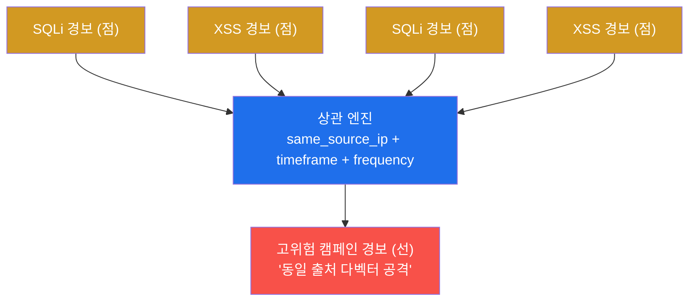
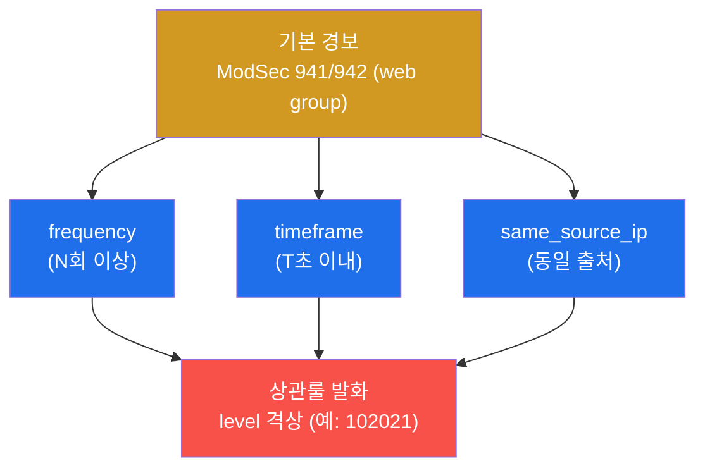

# SOC고급 W02 — SIEM 상관분석: 다벡터 공격을 복합 탐지로 묶기

> **본 주차의 한 줄 요약**
>
> 미성숙한 SOC는 경보를 한 건씩 본다. 성숙한 SOC는 **여러 경보의 패턴**을 본다 — "같은 출처가 1~2분 안에
> SQLi와 XSS를 섞어 퍼붓는다"는 것은 개별로는 노이즈여도, 묶으면 분명한 **공격 캠페인**이다. 본 주차에
> 학생은 다벡터 웹 공격(SQLi+XSS 반복)을 흘려 ModSecurity에 다수 탐지를 만들고, 이를 **출처(same_source_ip)·
> 시간창(timeframe)·횟수(frequency)** 의 세 축으로 묶는 **상관분석(correlation)** 룰을 설계해 고위험으로
> 격상한다.
>
> **관제자 한 줄 결론**: 상관분석은 "점(개별 경보)을 선(캠페인)으로 잇는" 기술이다. 단일 경보의 임계를
> 낮추면 오탐이 폭주하지만, **여러 약한 신호의 동시 발생**을 보면 적은 오탐으로 강한 캠페인을 잡는다.

---

## 학습 목표

본 주차 종료 시 학생은 다음 5가지를 **본인 손으로** 할 수 있어야 한다.

1. **상관분석(correlation)** 이 단일 룰 탐지와 무엇이 다른지(여러 경보의 패턴 vs 한 경보)를 설명한다.
2. 같은 출처에서 **SQLi(CRS 942)+XSS(CRS 941)** 를 반복 투입해 다벡터 캠페인 패턴을 만들고 ModSec에서 확인한다.
3. 상관의 세 축 — **same_source_ip · timeframe · frequency** — 로 흩어진 경보를 한 사건으로 묶는 룰을 설계한다.
4. 상관룰이 유발하는 **오탐(내부 스캐너)** 을 화이트리스트 예외로 다스린다.
5. 웹+네트워크+호스트 **교차 상관**으로 킬체인을 재구성하고, 룰을 **MITRE ATT&CK 커버리지**로 관리한다.

> **이 주차의 시선** — 채점은 "룰을 만들었다"가 아니라, **다벡터 패턴을 만들고 → 세 축으로 묶고 → 오탐을
> 다스리고 → ATT&CK으로 커버리지를 관리**했는가를 본다.

---

## 강의 시간 배분 (총 3시간 40분)

| 시간        | 내용                                                                   | 유형      |
|-------------|------------------------------------------------------------------------|-----------|
| 0:00–0:25   | 이론 — 단일 룰 vs 상관, 왜 패턴인가(오탐·미탐의 균형)                   | 강의      |
| 0:25–0:55   | 이론 — 상관 3축(same_source_ip·timeframe·frequency)과 Wazuh 상관룰      | 강의      |
| 0:55–1:05   | 휴식                                                                    | —         |
| 1:05–1:35   | 이론 — 오탐 예외·교차 상관·ATT&CK 커버리지                              | 강의/토론 |
| 1:35–2:10   | 실습 — 다벡터 생성(SQLi+XSS) + 상관 축 식별 + Wazuh 상관 데이터          | 실습      |
| 2:10–2:40   | 실습 — 오탐 예외 + 교차 상관 설계                                       | 실습      |
| 2:40–2:50   | 휴식                                                                    | —         |
| 2:50–3:20   | 실습 — ATT&CK 커버리지·룰 테스트 + 보고서                               | 실습      |
| 3:20–3:40   | 정리 + 다음 주차 예고                                                   | 정리      |

---

## 0. 용어 해설

| 용어 | 영문 | 뜻 | 비유 |
|------|------|----|------|
| **상관분석** | correlation | 여러 경보·로그를 한 사건으로 묶어 의미를 찾는 분석 | 흩어진 목격담을 한 사건으로 정리 |
| **다벡터 공격** | multi-vector | 여러 공격 기법(SQLi·XSS 등)을 함께 쓰는 공격 | 정문·창문·뒷문을 동시에 두드림 |
| **same_source_ip** | — | 같은 출발지 IP로 경보를 묶는 상관 축 | "같은 사람이 한 짓" 기준 |
| **timeframe** | — | 상관을 적용할 시간 창(예: 120초) | "2분 안에 벌어진 일" |
| **frequency** | — | 시간 창 안의 발생 횟수 임계 | "같은 일이 N번 이상" |
| **if_matched_sid** | — | 특정 룰이 N회 발생 시 발화하는 Wazuh 상관 조건 | "이 경보가 여러 번이면 격상" |
| **격상** | escalation | 약한 경보들을 묶어 고위험 경보로 올림 | 잔불 여러 개 → 화재 경보 |
| **오탐 예외** | whitelist | 정상 행위(내부 스캐너)를 상관에서 제외 | 정기 점검 차량은 통과 |
| **ATT&CK 커버리지** | — | 어떤 Technique를 탐지하는지의 지도 | 검문소가 막는 범죄 유형 목록 |

> **헷갈리기 쉬운 한 쌍 — 임계 낮추기 vs 상관.** 단일 룰의 임계를 낮춰 민감하게 하면 **오탐이 폭주**한다.
> 상관은 다르다 — 각 신호는 그대로 두되, **여러 약한 신호가 같은 출처·시간에 겹칠 때만** 격상하므로,
> 적은 오탐으로 강한 캠페인을 잡는다. "민감도를 높이는" 게 아니라 "패턴을 보는" 것이 상관의 본질이다.

---

## 1. 단일 룰 탐지 vs 상관분석

### 1.1 한 줄 답: 점이 아니라 선을 본다

단일 룰은 한 이벤트(SQLi 한 발)에 한 경보를 낸다. 공격자는 이 점들을 흩어 노이즈에 섞는다 — SQLi 한 번,
XSS 한 번은 매일 인터넷에서 쏟아지는 자동 스캔과 구분이 안 된다. **상관분석**은 이 점들을 출처·시간으로
이어 "같은 IP가 2분 안에 SQLi 3번 + XSS 3번"이라는 **선(캠페인)** 을 본다.

### 1.2 왜 중요한가 — 오탐과 미탐의 균형

SOC의 영원한 딜레마는 오탐(너무 많아 분석가가 지침)과 미탐(놓침)의 균형이다. 상관은 이 균형의 좋은 답이다 —
개별 경보의 임계를 건드리지 않으므로 미탐이 늘지 않고, "여러 신호 동시 발생"이라는 강한 조건이라 오탐이 적다.

### 1.3 한계

상관은 **출처가 보존**되어야 동작한다(el34는 SNAT 없이 출처 보존 — §0.5.3 W01). 또 공격자가 출처를 분산
(분산 스캔)하면 same_source_ip 축이 무너진다 — 이때는 행위·타깃 기반 상관이나 위협 인텔(W05)로 보완한다.

---

## 2. Wazuh 상관룰 — 세 축

Wazuh 상관룰은 `<rule>`에 `frequency="N"` `timeframe="T"` `<if_matched_sid>` `<same_source_ip/>`를 조합한다.
예: "web 그룹(941/942) 경보가 같은 출처에서 120초 안에 6회 이상 → level 12로 격상". 빈도 룰은 단일 이벤트가
아니라 **여러 이벤트가 누적**되어야 발화하므로, `wazuh-logtest`로 검증할 때 **여러 줄을 연속 입력**해야 한다
(secuops W13 함정과 동일).

---

## 3. 오탐 예외 · 교차 상관 · ATT&CK 커버리지

### 3.1 오탐 예외 — 내부 스캐너

상관룰은 강력한 만큼 오탐도 증폭한다. 내부 정기 취약점 스캐너·헬스체크는 같은 다벡터 패턴을 만들어 매일
상관룰을 울린다. 대응은 **출처 IP/UA 화이트리스트 예외룰** — 정상 출처를 상관에서 배제한다.

### 3.2 교차 상관 — 계층을 넘어

진짜 캠페인은 한 계층에 머물지 않는다. 같은 출처의 **웹 SQLi(ModSec) → 포트 스캔(Suricata) → 백도어 계정
(osquery)** 을 출처·시간으로 묶으면 "정찰 → 침투 → 발판"의 킬체인이 드러난다. 이것이 계층 간 교차 상관이다.

### 3.3 ATT&CK 커버리지

상관룰은 만들고 끝이 아니다. 각 룰을 **MITRE ATT&CK Technique**(예: T1190 Exploit Public-Facing
Application)에 매핑해 "우리가 어떤 전술·기법을 탐지하는가"의 지도를 그리고, 빈 칸(미탐 Technique)을 다음
개선 대상으로 삼는다. 룰은 `wazuh-logtest`로 발화를 확인하고 정상 트래픽으로 오탐 없음을 검증한다.

---

## 4. 실습 안내 (8 미션)

1. **대상 도달** — 전제. 2. **다벡터 생성** — SQLi+XSS 반복 → ModSec 942+941. 3. **상관 축** —
same_source_ip 확인. 4. **Wazuh 상관 데이터** — 웹 알림 적재. 5. **오탐 예외** — 내부 스캐너 화이트리스트.
6. **교차 상관** — 웹+네트워크+호스트 킬체인. 7. **ATT&CK 커버리지·룰 테스트**. 8. **상관 보고서**.

> 명령은 el34 호스트에서 `docker exec` 로. **인가된 실습 환경(el34)에서만**, 점검은 읽기 전용.

---

## 5. 다음 주차 (W03) 예고 — SIGMA 탐지 엔지니어링

W02는 Wazuh 상관룰로 패턴을 묶었다. W03은 벤더 독립적 탐지 표준인 **SIGMA**로 탐지룰을 작성하고 여러
백엔드(Wazuh·Suricata)로 변환하는 탐지 엔지니어링을 다룬다.
