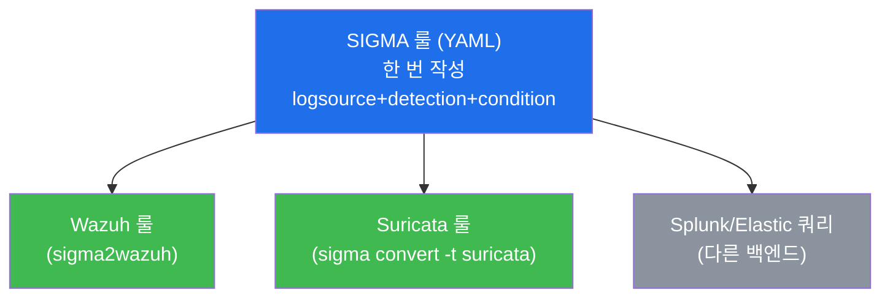
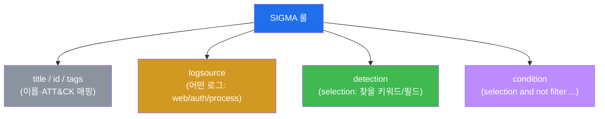
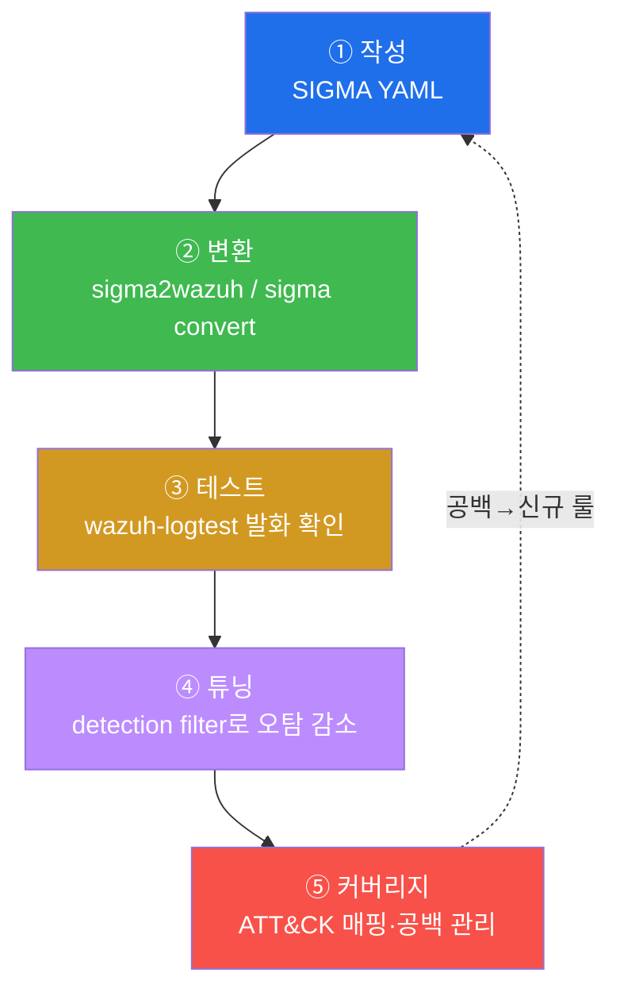

# SOC고급 W03 — SIGMA 탐지 엔지니어링: 한 번 쓰고 여러 백엔드로

> **본 주차의 한 줄 요약**
>
> 탐지룰을 SIEM마다 따로 짜면 같은 로직을 Wazuh 문법으로, Suricata 문법으로, Splunk 문법으로 N번 다시
> 쓴다. **SIGMA**는 이 낭비를 없앤 **벤더 독립적 탐지 룰 표준(YAML)** 이다 — 한 번 작성하면 변환기로 여러
> 백엔드로 바꾼다. 본 주차에 학생은 el34의 SIGMA 룰을 해석하고, `sigma2wazuh`로 Wazuh 룰로 변환하고,
> `wazuh-logtest`로 발화를 검증하며, 오탐을 튜닝하고, ATT&CK 커버리지로 관리하는 **탐지 엔지니어링의 전
> 수명주기**를 돈다.
>
> **탐지 엔지니어 한 줄 결론**: 좋은 탐지는 한 번의 영감이 아니라 **작성 → 변환 → 테스트 → 튜닝 → 커버리지
> 관리**의 반복 가능한 엔지니어링이다. SIGMA는 그 공통 언어다.

---

## 학습 목표

본 주차 종료 시 학생은 다음 5가지를 **본인 손으로** 할 수 있어야 한다.

1. **SIGMA 룰 구조** — `logsource`(어떤 로그) · `detection`(찾을 패턴) · `condition`(조합 논리) — 를 읽고 해석한다.
2. el34의 SIGMA 룰 카탈로그(ssh-bruteforce·web-sqli·linux-suspicious-cmd)가 각각 어떤 위협을 덮는지 파악한다.
3. `sigma2wazuh`로 한 SIGMA 룰을 **여러 백엔드(Wazuh·Suricata)** 로 변환한다.
4. 변환된 룰을 `wazuh-logtest`로 **발화 검증**하고, 오탐을 detection filter로 **튜닝**한다.
5. 룰을 **MITRE ATT&CK Technique**에 매핑해 커버리지를 관리하고 공백을 신규 룰 우선순위로 삼는다.

> **이 주차의 시선** — 채점은 "룰을 안다"가 아니라, **구조 해석 → 변환 → 테스트 → 튜닝 → 커버리지**의
> 엔지니어링 사이클을 한 바퀴 돌았는가를 본다.

---

## 0. 용어 해설

| 용어 | 영문 | 뜻 | 비유 |
|------|------|----|------|
| **SIGMA** | — | 벤더 독립적 탐지 룰을 적는 YAML 표준 | 어느 나라에서도 통하는 표준 레시피 |
| **logsource** | — | 룰이 적용될 로그 종류(웹·인증·프로세스) | 어느 재료를 쓰는지 |
| **detection** | — | 찾을 패턴(키워드·필드값)의 정의 | 레시피의 재료·계량 |
| **condition** | — | detection 항목들의 조합 논리(and/not 등) | 조리 순서·조합 |
| **백엔드** | backend | SIGMA를 실제 실행하는 SIEM/IDS(Wazuh·Suricata) | 레시피를 요리하는 주방 |
| **변환기** | converter | SIGMA → 백엔드 문법 변환 도구 | 레시피를 주방 언어로 번역 |
| **탐지 엔지니어링** | detection engineering | 탐지룰을 체계적으로 만들고 관리하는 분야 | 요리 R&D |
| **wazuh-logtest** | — | 로그를 넣어 룰 발화를 시험하는 도구 | 시식(검증) |
| **튜닝** | tuning | 오탐을 줄이고 진탐을 유지하는 룰 조정 | 간 맞추기 |
| **ATT&CK 커버리지** | — | 룰이 어떤 Technique를 덮는지의 지도 | 메뉴판이 덮는 요리 종류 |

> **헷갈리기 쉬운 한 쌍 — 룰 작성 vs 탐지 엔지니어링.** 룰 하나 쓰는 것은 시작일 뿐이다. **탐지
> 엔지니어링**은 그 룰을 여러 백엔드로 배포하고, 테스트로 발화를 보장하고, 운영 중 오탐을 튜닝하고, 전체
> 커버리지를 ATT&CK으로 관리하는 **수명주기 전체**다. "룰을 만들었다"와 "탐지를 운영한다"는 다르다.

---

## 1. 왜 SIGMA인가 — 벤더 독립 표준

### 1.1 한 줄 답: 한 번 쓰고 어디서나 돌린다

조직은 보통 여러 탐지 도구를 함께 쓴다 — Wazuh(호스트/로그), Suricata(네트워크), 클라우드 SIEM 등. "root로
의심 명령 실행"이라는 같은 탐지를 도구마다 각자 문법으로 다시 짜면, 한 군데만 고쳐도 나머지가 어긋난다.
SIGMA는 탐지 로직을 **한 YAML로 한 번** 쓰고, 변환기로 각 백엔드 문법으로 바꿔 **일관성**을 보장한다.

### 1.2 왜 중요한가 — 커뮤니티와 공유

SIGMA는 전 세계 탐지 커뮤니티의 공통어다. 새 위협이 나오면 누군가 SIGMA 룰을 공개하고, 각 조직은 그것을
자기 백엔드로 변환해 즉시 적용한다 — 위협 인텔(W05)과 탐지가 표준 포맷으로 흐른다.

### 1.3 한계

변환은 만능이 아니다 — 백엔드마다 지원하는 필드·기능이 달라 일부 룰은 완벽히 변환되지 않는다. 또 변환만으로
탐지가 보장되지 않으니 **반드시 테스트**해야 한다(§3).

---

## 2. SIGMA 룰 구조

el34의 `0003-linux-suspicious-cmd.yml`은 호스트 로그에서 권한상승·C2 관련 의심 명령(예: `chmod +s`, base64
디코드 실행 등)을 `detection`의 키워드로 잡고 `condition`으로 조합한다. `tags`에 `attack.txxxx`를 달아 ATT&CK에
매핑한다 — 이 tags가 §4 커버리지 관리의 단위다.

---

## 3. 변환 · 테스트 · 튜닝

**② 변환** — `sigma2wazuh.py rules/`가 SIGMA를 Wazuh `<rule>` XML로 바꾼다. 같은 룰을 `sigma convert -t
suricata`로 네트워크 백엔드로도 변환할 수 있다. **③ 테스트** — 변환만으로는 탐지가 보장되지 않는다.
`wazuh-logtest`에 실제 로그 한 줄을 넣어 룰이 발화하고 적절한 level이 매겨지는지 확인한다. **④ 튜닝** —
운영에서 오탐이 나오면 `detection`에 `filter`(정상 패턴 제외)를 추가하고 `condition`을 `selection and not
filter`로 조정한 뒤 재테스트한다. 진탐은 유지하고 오탐만 줄이는 것이 목표다.

---

## 4. ATT&CK 커버리지 관리

탐지 엔지니어링의 목적은 룰 개수가 아니라 **ATT&CK 커버리지**다. 각 SIGMA 룰의 `tags`(예: `attack.t1190`)로
"우리가 어떤 Tactic/Technique를 탐지하는가"의 지도를 그리고, 빈 칸(미탐 Technique)을 다음 룰의 우선순위로
삼는다. el34 카탈로그는 ssh-bruteforce(T1110 무차별 대입)·web-sqli(T1190 공개앱 익스플로잇)·suspicious-cmd
(T1059 명령·스크립트)를 덮는다 — 측면 이동·지속성 등은 공백이며 확장 대상이다.

---

## 5. 실습 안내 (8 미션)

1. **소스 확인** — SIGMA 룰·변환기. 2. **구조 해석** — logsource/detection/condition. 3. **룰 카탈로그** —
어떤 위협을 덮나. 4. **다중 백엔드 변환** — sigma2wazuh. 5. **룰 테스트** — logtest 발화. 6. **튜닝** — 오탐
감소. 7. **커버리지 관리** — ATT&CK 매핑. 8. **보고서**.

> 명령은 el34 호스트에서. **인가된 실습 환경(el34)에서만**, 공유 Wazuh는 읽기/테스트 위주(룰 변경은 검증 후
> 원복).

---

## 6. 다음 주차 (W04) 예고 — YARA 악성코드 탐지

W03은 로그 기반 탐지(SIGMA)였다. W04는 파일·메모리의 악성코드를 패턴으로 잡는 **YARA** 룰을 다룬다 —
웹셸·페이로드를 시그니처로 탐지한다.
