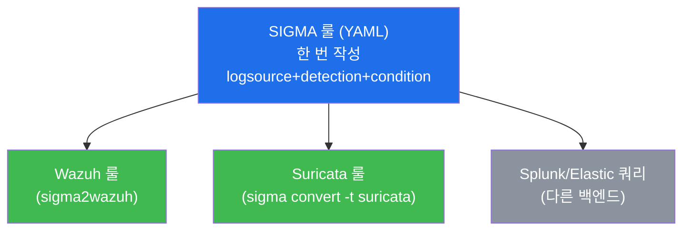
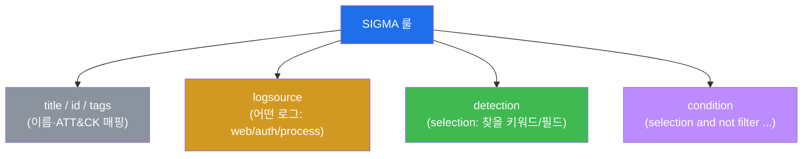
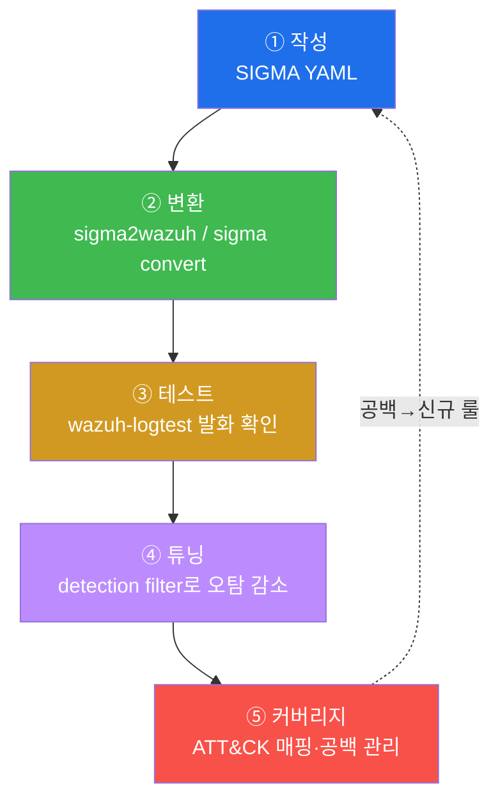

# SOC고급 W03 — SIGMA 탐지 엔지니어링: 한 번 쓰고 여러 백엔드로

> **본 주차의 한 줄 요약**
>
> 탐지룰을 SIEM마다 따로 짜면 같은 로직을 Wazuh 문법으로, Suricata 문법으로, Splunk 문법으로 N번 다시
> 쓴다. **SIGMA**는 이 낭비를 없앤 **벤더 독립적 탐지 룰 표준(YAML)** 이다 — 한 번 작성하면 변환기로 여러
> 백엔드로 바꾼다. 본 주차에 학생은 el34의 SIGMA 룰을 해석하고, `sigma2wazuh`로 Wazuh 룰로 변환하고,
> `wazuh-logtest`로 발화를 검증하며, 오탐을 튜닝하고, ATT&CK 커버리지로 관리하는 **탐지 엔지니어링의 전
> 수명주기**를 돈다.
>
> **탐지 엔지니어 한 줄 결론**: 좋은 탐지는 한 번의 영감이 아니라 **작성 → 변환 → 테스트 → 튜닝 → 커버리지
> 관리**의 반복 가능한 엔지니어링이다. SIGMA는 그 공통 언어다.

---

## 학습 목표

본 주차 종료 시 학생은 다음 5가지를 **본인 손으로** 할 수 있어야 한다.

1. **SIGMA 룰 구조** — `logsource`(어떤 로그) · `detection`(찾을 패턴) · `condition`(조합 논리) — 를 읽고 해석한다.
2. el34의 SIGMA 룰 카탈로그(ssh-bruteforce·web-sqli·linux-suspicious-cmd)가 각각 어떤 위협을 덮는지 파악한다.
3. `sigma2wazuh`로 한 SIGMA 룰을 **여러 백엔드(Wazuh·Suricata)** 로 변환한다.
4. 변환된 룰을 `wazuh-logtest`로 **발화 검증**하고, 오탐을 detection filter로 **튜닝**한다.
5. 룰을 **MITRE ATT&CK Technique**에 매핑해 커버리지를 관리하고 공백을 신규 룰 우선순위로 삼는다.

> **이 주차의 시선** — 채점은 "룰을 안다"가 아니라, **구조 해석 → 변환 → 테스트 → 튜닝 → 커버리지**의
> 엔지니어링 사이클을 한 바퀴 돌았는가를 본다.

---

## 0. 용어 해설

| 용어 | 영문 | 뜻 | 비유 |
|------|------|----|------|
| **SIGMA** | — | 벤더 독립적 탐지 룰을 적는 YAML 표준 | 어느 나라에서도 통하는 표준 레시피 |
| **logsource** | — | 룰이 적용될 로그 종류(웹·인증·프로세스) | 어느 재료를 쓰는지 |
| **detection** | — | 찾을 패턴(키워드·필드값)의 정의 | 레시피의 재료·계량 |
| **selection** | — | detection 안의 한 패턴 묶음(이름 붙임) | 재료 묶음 한 봉지 |
| **filter** | — | 정상 패턴을 빼기 위한 제외 묶음 | 빼야 할 재료 |
| **condition** | — | selection/filter의 조합 논리(and/not 등) | 조리 순서·조합 |
| **백엔드** | backend | SIGMA를 실제 실행하는 SIEM/IDS(Wazuh·Suricata) | 레시피를 요리하는 주방 |
| **변환기** | converter | SIGMA → 백엔드 문법 변환 도구(sigma2wazuh) | 레시피를 주방 언어로 번역 |
| **tags** | — | 룰에 붙는 ATT&CK 매핑(예 attack.t1059) | 메뉴의 분류 태그 |
| **탐지 엔지니어링** | detection engineering | 탐지룰을 체계적으로 만들고 관리하는 분야 | 요리 R&D |
| **wazuh-logtest** | — | 로그를 넣어 룰 발화를 시험하는 도구 | 시식(검증) |
| **튜닝** | tuning | 오탐을 줄이고 진탐을 유지하는 룰 조정 | 간 맞추기 |
| **ATT&CK 커버리지** | — | 룰이 어떤 Technique를 덮는지의 지도 | 메뉴판이 덮는 요리 종류 |

> **헷갈리기 쉬운 한 쌍 — 룰 작성 vs 탐지 엔지니어링.** 룰 하나 쓰는 것은 시작일 뿐이다. **탐지
> 엔지니어링**은 그 룰을 여러 백엔드로 배포하고, 테스트로 발화를 보장하고, 운영 중 오탐을 튜닝하고, 전체
> 커버리지를 ATT&CK으로 관리하는 **수명주기 전체**다. "룰을 만들었다"와 "탐지를 운영한다"는 다르다.

---

## 0.5 핵심 개념

### 0.5.1 SIGMA 룰 한 눈에 읽기 — 실제 el34 룰(0003)

이번 주차의 핵심 룰 `0003-linux-suspicious-cmd.yml` 을 줄별로 읽어 보자. SIGMA는 이 정도로 단순한 YAML이다.

```yaml
title: Suspicious Linux Reconnaissance/Download Command   # 룰 이름(사람용)
logsource:
    product: linux                # 어느 OS의
    category: process_creation    # 어떤 로그(프로세스 생성)를 볼지
detection:
    selection_dl:                 # 'selection_dl' 이라 이름 붙인 패턴 묶음
        keywords:
            - 'wget http'         # 이 중 하나라도 명령에 있으면
            - 'curl http'
            - 'chmod +x'
            - '/etc/shadow'
            - 'base64 -d'
    condition: selection_dl       # selection_dl 이 맞으면 발화
level: medium
tags:
    - attack.t1059                # ATT&CK 매핑(명령·스크립트 실행)
```

읽는 법: "리눅스 프로세스 생성 로그에서, 명령에 `wget http`·`chmod +x`·`/etc/shadow`·`base64 -d` 같은 키워드가
보이면(=`selection_dl`) 발화하고, 이건 ATT&CK T1059에 해당한다." 단순하지만 **벤더 독립**이라, 이 한 장을
Wazuh로도 Suricata로도 변환할 수 있다.

### 0.5.2 왜 백엔드마다 문법이 다른가

같은 "root로 의심 명령 실행" 탐지를 도구마다 다른 언어로 적어야 한다 — 이게 SIGMA가 필요한 이유다.

| 백엔드 | 문법 형태 |
|--------|-----------|
| Wazuh | XML `<rule><field>...</field></rule>` |
| Suricata | `alert ... (msg:...; content:...; sid:...)` |
| Splunk | SPL 쿼리 `search ... \| where ...` |
| Elastic | EQL / Lucene 쿼리 |

SIGMA YAML 한 장을 변환기에 넣으면 위 문법 중 무엇으로든 번역된다. **한 번 쓰고, 어디서나 돌린다.**

### 0.5.3 condition 논리 — `selection and not filter`

튜닝의 핵심 문법이다. 오탐이 나면 정상 패턴을 `filter` 묶음으로 정의하고 condition을 이렇게 바꾼다.

```yaml
detection:
    selection: { keywords: ['base64 -d'] }   # 잡고 싶은 것
    filter:    { SourceIp: '10.20.30.50' }   # 정상(내부 점검 IP)
    condition: selection and not filter      # 잡되, 정상은 빼고
```

"`selection` 은 맞지만 `filter`(정상)는 아닌 것만 발화" — 진탐은 유지하고 오탐만 도려내는 외과적 튜닝이다.

### 0.5.4 ATT&CK Technique 번호 읽기

`tags: attack.t1059` 의 T-번호는 MITRE ATT&CK의 기법 ID다. 외우는 게 아니라 "무슨 분류인지"를 안다.

| 번호 | 기법 | 이번 카탈로그의 어느 룰 |
|------|------|--------------------------|
| **T1110** | Brute Force(무차별 대입) | 0001 ssh-bruteforce |
| **T1190** | Exploit Public-Facing Application | 0002 web-sqli |
| **T1059** | Command and Scripting Interpreter | 0003 linux-suspicious-cmd |

ATT&CK 매트릭스에 우리 룰이 덮는 칸을 칠하면, **빈 칸(미탐 기법)** 이 곧 다음에 만들 룰의 우선순위가 된다.

### 0.5.5 임의로 보이는 이름·번호들

| 이름/번호 | 무엇 | 규칙 |
|-----------|------|------|
| **0001~0003 접두** | SIGMA 룰 파일명 | 단순 정렬용 번호(우리가 부여) |
| **Wazuh rule 5760** | 내장 룰 | "sshd 다중 인증 실패"(Wazuh 기본 룰셋, level 5) |
| **attack.t1xxx** | tags | MITRE ATT&CK Technique 매핑 |
| **마커(`sigma_ready` 등)** | 단계 완료 신호 | 채점이 통과를 확인하는 약속 문자열 |

---

## 1. 왜 SIGMA인가 — 벤더 독립 표준

### 1.1 한 줄 답: 한 번 쓰고 어디서나 돌린다

조직은 보통 여러 탐지 도구를 함께 쓴다 — Wazuh(호스트/로그), Suricata(네트워크), 클라우드 SIEM 등. "root로
의심 명령 실행"이라는 같은 탐지를 도구마다 각자 문법으로 다시 짜면, 한 군데만 고쳐도 나머지가 어긋난다.
SIGMA는 탐지 로직을 **한 YAML로 한 번** 쓰고, 변환기로 각 백엔드 문법으로 바꿔 **일관성**을 보장한다.



### 1.2 왜 중요한가 — 커뮤니티와 공유

SIGMA는 전 세계 탐지 커뮤니티의 공통어다. 새 위협이 나오면 누군가 SIGMA 룰을 공개하고, 각 조직은 그것을
자기 백엔드로 변환해 즉시 적용한다 — 위협 인텔(W05)과 탐지가 표준 포맷으로 흐른다.

### 1.3 한계

변환은 만능이 아니다 — 백엔드마다 지원하는 필드·기능이 달라 일부 룰은 완벽히 변환되지 않는다. 또 변환만으로
탐지가 보장되지 않으니 **반드시 테스트**해야 한다(§3).

---

## 2. SIGMA 룰 구조



§0.5.1에서 본 `0003-linux-suspicious-cmd.yml` 처럼, el34 카탈로그의 모든 룰은 `logsource`(어디서 볼 로그) +
`detection`(찾을 키워드/필드) + `condition`(조합 논리) + `tags`(ATT&CK) 의 네 조각으로 이뤄진다. 이 구조가
표준이라서 도구가 달라도 같은 로직을 변환할 수 있고, `tags` 가 §4 커버리지 관리의 단위가 된다.

---

## 3. 변환 · 테스트 · 튜닝의 수명주기



**② 변환 — 실측 예.** `sigma2wazuh.py` 가 SIGMA 룰들을 Wazuh `<rule>` XML로 바꾼다. 생성된 룰 수를 센다.

```bash
cd ~/el34/sigma && python3 sigma2wazuh.py rules/ | grep -cE 'rule id='
```

```
3
```

SIGMA 룰 3개가 Wazuh 룰 3개로 변환됐다 = 같은 detection 로직이 Wazuh 문법으로 자동 번역됨. 실무에선
`sigma convert -t suricata` 로 네트워크 백엔드로도 같은 식으로 변환한다.

**③ 테스트 — 실측 예.** 변환만으로는 탐지가 보장되지 않는다. 실제 로그 한 줄을 넣어 발화를 확인한다.

```bash
printf "Jan  1 00:00:00 host sshd[1]: Failed password for root from 10.20.30.202 port 22 ssh2\n" \
  | /var/ossec/bin/wazuh-logtest 2>&1 | grep -iE "Phase 3|id:|level:" | head -3
```

```
**Phase 3: Completed filtering (rules).
    id: '5760'
    level: '5'
```

Phase 3 도달 + rule id `5760`(SSH 다중 인증 실패) + level 5 = 이 로그가 룰을 깨웠다는 뜻. (`5760` 은 Wazuh
내장 룰이라 안정적으로 발화해 검증 샘플로 적합하다. `2>&1` 이 필수인 이유: wazuh-logtest는 결과를 **stderr**로
내보내, 빼면 grep이 아무것도 못 본다.)

**④ 튜닝.** 운영에서 오탐이 나오면 §0.5.3처럼 `detection` 에 `filter` 를 추가하고 `condition` 을 `selection
and not filter` 로 조정한 뒤 **재테스트**한다. 진탐은 유지하고 오탐만 줄이는 것이 목표다.

---

## 4. ATT&CK 커버리지 관리

탐지 엔지니어링의 목적은 룰 개수가 아니라 **ATT&CK 커버리지**다. 각 SIGMA 룰의 `tags`(예: `attack.t1190`)로
"우리가 어떤 Tactic/Technique를 탐지하는가"의 지도를 그리고, 빈 칸(미탐 Technique)을 다음 룰의 우선순위로
삼는다.

**실측 예.** 룰 수와 ATT&CK 태그 종류 수를 센다.

```bash
R=$(ls ~/el34/sigma/rules/*.yml | wc -l)
T=$(grep -rhoiE "t1[0-9]{3}" ~/el34/sigma/rules/ | sort -u | wc -l)
echo "SIGMA 룰 ${R}개, ATT&CK technique 태그 ${T}종 커버"
```

```
SIGMA 룰 3개, ATT&CK technique 태그 3종 커버
```

el34 카탈로그는 ssh-bruteforce(T1110)·web-sqli(T1190)·suspicious-cmd(T1059) 세 기법을 덮는다. 측면 이동
(TA0008)·지속성(TA0003) 등은 공백이며 확장 대상 — 이 빈 칸이 신규 룰의 우선순위다.

---

## 5. 실습 안내 (8 미션)

각 미션을 **① 왜 하는가 / ② 무엇을 알 수 있는가 / ③ 결과 해석 / ④ 실전 활용** 4축으로 설명한다. 명령은
el34 호스트(`ssh ccc@192.168.0.80`)에서. **인가된 실습 환경(el34)에서만**, 공유 Wazuh는 읽기/테스트 위주
(룰 변경은 검증 후 원복).

### STEP 1 — SIGMA 소스 확인
- **왜**: 탐지 엔지니어링의 출발점인 룰과 변환기가 환경에 있어야 시작한다.
- **무엇을**: `~/el34/sigma/rules/`(룰 3종) + `sigma2wazuh.py`(변환기) 존재.
- **해석**: 룰 3종 + 변환기가 보이면 준비 완료(`sigma_ready`).
- **실전**: 작업 전 자산(룰·도구) 인벤토리 확인.

### STEP 2 — 룰 구조 해석 (logsource/detection/condition)
- **왜**: 이 세 칸이 SIGMA의 전부. 구조를 알아야 쓰고 튜닝한다.
- **무엇을**: 0003 룰을 열어 세 조각 + tags(t1059) 확인.
- **해석**: `detection` 의 `selection_dl` 키워드, `condition` 조합, `tags` ATT&CK 매핑.
- **실전**: 공개 SIGMA 룰을 읽고 우리 환경에 맞출 수 있다.

### STEP 3 — 룰 카탈로그 (커버 TTP)
- **왜**: 어떤 공격(인증·웹·호스트)을 덮는지 = 커버리지의 단위.
- **무엇을**: 각 yml의 title 추출 → 카탈로그.
- **해석**: 3룰이 SSH 무차별·웹 SQLi·의심명령을 덮음(`catalog_done`). 빠진 영역이 다음 우선순위.
- **실전**: 보유 탐지 자산 목록화 — 감사·인수인계의 기본.

### STEP 4 — 다중 백엔드 변환 (sigma2wazuh)
- **왜**: 같은 로직을 도구마다 다시 짜는 낭비를 없앤다.
- **무엇을**: sigma2wazuh.py로 변환 → 생성된 `rule id=` 개수.
- **해석**: 3개 → 3개 변환(`converted`). 한 번 작성, 여러 백엔드.
- **실전**: 새 SIEM 도입 시 기존 SIGMA를 즉시 이식.

### STEP 5 — 룰 테스트 (logtest)
- **왜**: 작성·변환만으로는 탐지를 보장 못 한다 — 발화를 봐야 '동작하는 룰'.
- **무엇을**: 샘플 로그를 wazuh-logtest에 넣어 Phase 3 도달 확인.
- **해석**: Phase 3 + rule 5760 + level 5 = 발화(`tested`). `2>&1` 필수(결과가 stderr).
- **실전**: 배포 전 룰이 진짜 깨우는지 검증하는 습관.

### STEP 6 — 튜닝 기준선
- **왜**: 튜닝 없는 룰은 오탐 폭주로 무시당한다 — 먼저 '발화'라는 기준선이 필요.
- **무엇을**: 발화 재확인 후 filter로 정상만 뺄 기준선.
- **해석**: 발화 확인(`tuned`) → SIGMA에 filter 추가 + `selection and not filter` 로 오탐 도려냄.
- **실전**: 운영 중 오탐 리포트 → filter 추가 → 재테스트의 반복.

### STEP 7 — 커버리지 관리 (ATT&CK)
- **왜**: "어느 기법을 덮는가"를 숫자로 알아야 빈 칸을 우선순위로 삼는다.
- **무엇을**: 룰 수(R) + ATT&CK 태그 종류 수(T) 집계.
- **해석**: 3룰/3기법 커버(`coverage_managed`). 매트릭스의 빈 칸이 신규 룰 우선순위.
- **실전**: 경영/감사 보고용 "ATT&CK 커버리지 N%" 지표의 원천.

### STEP 8 — 탐지 엔지니어링 보고서
- **왜**: 탐지 엔지니어링은 추적·재현 가능해야 한다.
- **무엇을**: 룰 수를 인용한 보고서 골격.
- **해석**: 실측 인용(`sigma_report_done`). 제출용은 STEP 2~7 구체값을 본문으로.
- **실전**: "무엇을 몇 개 만들어 어디를 덮었나"를 증거로 남기는 산출물.

---

## 6. 흔한 오해·블루팀 노트

- **"변환했으니 탐지된다"** — 변환 ≠ 발화. 반드시 `wazuh-logtest` 로 실제 발화를 확인해야 한다.
- **"logtest가 아무것도 안 나온다"** — `2>&1` 을 빠뜨렸을 가능성. 결과가 stderr로 나온다.
- **"룰을 많이 만들면 좋다"** — 개수가 아니라 ATT&CK 커버리지(어느 기법을 덮나)가 지표다. 중복 룰은 소음.
- **"오탐은 룰을 끄면 된다"** — 끄면 진탐도 잃는다. filter로 정상만 도려내는 게 튜닝이다.

---

## 7. 다음 주차 (W04) 예고 — YARA 악성코드 탐지

W03은 로그 기반 탐지(SIGMA)였다. W04는 파일·메모리의 악성코드를 패턴으로 잡는 **YARA** 룰을 다룬다 —
웹셸·페이로드를 시그니처(문자열·바이트 패턴)로 탐지한다. SIGMA가 "로그의 패턴"이라면 YARA는 "파일의 패턴"이다.
