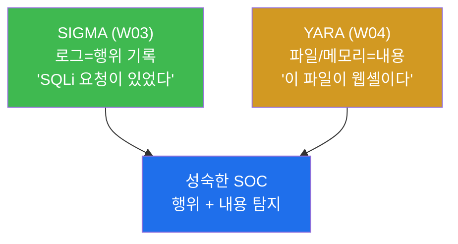
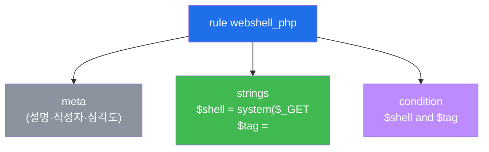
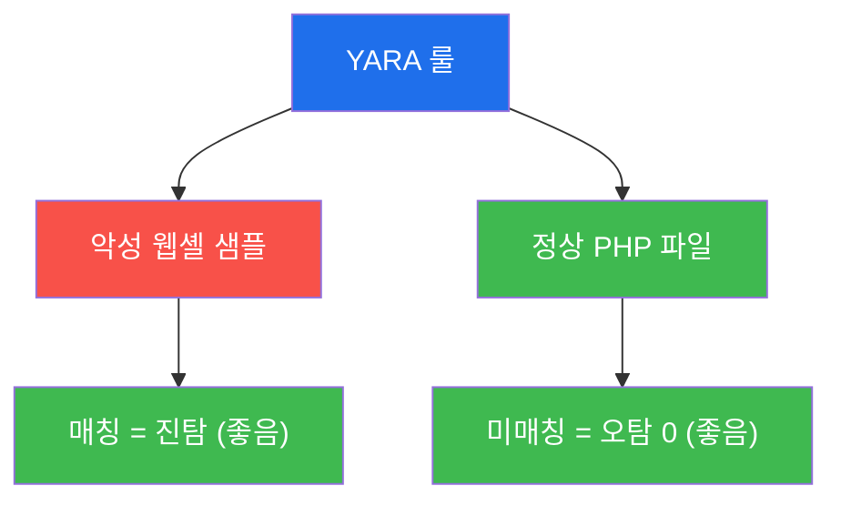

# SOC고급 W04 — YARA 악성코드 탐지: 웹셸·페이로드 시그니처

> **본 주차의 한 줄 요약**
>
> 로그 기반 탐지(SIGMA, W03)는 "무슨 행위가 있었나"를 본다. 하지만 디스크에 떨어진 **웹셸·페이로드·악성
> 바이너리** 자체를 잡으려면 파일·메모리의 내용을 패턴으로 봐야 한다. **YARA**는 그 표준 도구다 —
> "이런 문자열·바이트 패턴을 가진 파일은 악성"이라는 룰로 파일과 프로세스 메모리를 스캔한다. 본 주차에
> 학생은 웹셸 탐지 YARA 룰을 직접 작성해 **악성 샘플은 잡고(진탐) 정상 파일은 안 잡는(오탐 0)** 것을
> 검증하고, 디렉토리·메모리 스캔과 탐지 파이프라인 통합까지 익힌다.
>
> **분석가 한 줄 결론**: YARA는 "악성의 지문"을 정의하는 언어다. 좋은 룰은 **진탐(악성을 잡음)과 오탐 0
> (정상을 안 잡음)** 을 동시에 만족하며, FIM·SIEM·CI와 엮여 자동으로 돈다.

---

## 학습 목표

본 주차 종료 시 학생은 다음 5가지를 **본인 손으로** 할 수 있어야 한다.

1. **YARA 룰 구조**(`strings` + `condition`)를 이해하고 웹셸 특징을 잡는 룰을 작성한다.
2. 악성 웹셸 샘플을 스캔해 **진탐**(매칭)을 확인한다.
3. 정상 PHP 파일을 스캔해 **오탐 0**(미매칭)을 확인하고, 진탐/오탐 균형이 룰 품질임을 설명한다.
4. **디렉토리 재귀(-r)·프로세스 메모리(-p)** 스캔으로 디스크에 없는 파일리스 악성코드까지 탐지하는 법을 안다.
5. YARA를 **FIM·SIEM·CI 파이프라인**에 통합하고, 공격자 회피(난독화)에 맞춰 룰을 정교화한다.

> **이 주차의 시선** — 채점은 "yara를 돌렸다"가 아니라, **진탐+오탐0을 함께 달성**하고 탐지를 파이프라인에
> 엮었는가를 본다.

---

## 강의 시간 배분 (총 3시간 40분)

| 시간        | 내용                                                                | 유형      |
|-------------|---------------------------------------------------------------------|-----------|
| 0:00–0:25   | 이론 — 로그 탐지 vs 파일/메모리 탐지, YARA의 자리                    | 강의      |
| 0:25–0:55   | 이론 — YARA 룰 구조(strings/condition)와 웹셸 특징                   | 강의      |
| 0:55–1:05   | 휴식                                                                 | —         |
| 1:05–1:35   | 이론 — 진탐/오탐 균형·메모리 스캔·파이프라인 통합                    | 강의/토론 |
| 1:35–2:10   | 실습 — yara 확인 + 룰 작성 + 웹셸 진탐                               | 실습      |
| 2:10–2:40   | 실습 — 정상 파일 오탐0 + 디렉토리/메모리 스캔                        | 실습      |
| 2:40–2:50   | 휴식                                                                 | —         |
| 2:50–3:20   | 실습 — 파이프라인 통합 + 룰 정교화                                   | 실습      |
| 3:20–3:40   | 정리 + 보고서 + 다음 주차 예고                                       | 정리      |

---

## 0. 용어 해설

| 용어 | 영문 | 뜻 | 비유 |
|------|------|----|------|
| **YARA** | — | 파일·메모리를 패턴 룰로 스캔하는 악성코드 탐지 도구 | 지문 대조 감식기 |
| **시그니처** | signature | 악성코드를 식별하는 고유 패턴(문자열/바이트) | 범인의 지문 |
| **웹셸** | webshell | 웹 서버에서 명령을 실행하는 악성 스크립트 | 몰래 설치된 원격 조종기 |
| **strings** | — | YARA 룰에서 찾을 문자열/바이트/정규식 | 지문의 특징점 |
| **condition** | — | strings 조합 논리(and/or/N of them) | 특징점 몇 개 일치하면 동일인 |
| **진탐** | true positive | 악성을 실제로 잡음 | 진짜 범인 검거 |
| **오탐** | false positive | 정상을 악성으로 잘못 잡음 | 무고한 사람 오인 |
| **파일리스** | fileless | 디스크에 안 남고 메모리에서만 도는 악성코드 | 흔적 없는 침입 |
| **-r / -p** | — | 디렉토리 재귀 / 프로세스 메모리 스캔 옵션 | 전 구역 수색 / 현행범 몸수색 |

> **헷갈리기 쉬운 한 쌍 — SIGMA vs YARA.** 둘 다 탐지 룰이지만 보는 대상이 다르다. **SIGMA**(W03)는
> **로그**(행위의 기록)를 보고, **YARA**는 **파일·메모리의 내용**(악성코드 자체)을 본다. "SQLi 요청이
> 있었다"는 SIGMA가, "업로드된 파일이 웹셸이다"는 YARA가 잡는다. 성숙한 SOC는 둘을 함께 쓴다.

---

## 1. 왜 YARA인가 — 내용을 본다

### 1.1 한 줄 답: 행위 로그로 안 보이는 "악성 파일 자체"를 잡는다

업로드된 파일이 웹셸인지, 메모리에 떠 있는 코드가 알려진 악성코드인지는 **로그(행위)** 로는 알기 어렵다.
파일의 **내용**을 직접 봐야 한다. YARA는 "이런 문자열·바이트를 가진 것은 악성"이라는 룰로 파일·메모리를
스캔해 이 빈틈을 메운다.

### 1.2 왜 중요한가 — 웹셸·파일리스

웹셸(W10 base soc)은 침해 후 지속 발판의 단골이다. WAF가 업로드를 못 막았다면, 디스크에 떨어진 웹셸 파일을
YARA로 잡는 것이 마지막 방어선이다. 또 디스크에 안 남는 **파일리스** 악성코드는 프로세스 메모리(-p) 스캔으로만
잡힌다.

### 1.3 한계

YARA는 **알려진 패턴**을 잡는다 — 새 변종·강한 난독화는 룰을 우회한다(§5 정교화로 대응). 또 룰이 너무 넓으면
오탐이 폭주하므로 진탐/오탐 균형이 핵심이다.

---

## 2. YARA 룰 구조

룰은 `strings`에서 찾을 패턴을 선언하고(`$shell`, `$tag`), `condition`에서 그 조합을 정한다(`$shell and
$tag`). 단일 문자열은 정상 파일에도 흔해 오탐이 나므로, **여러 특징의 조합**으로 정밀도를 높인다. strings는
일반 문자열 외에 정규식(`/system\s*\(/`)·16진 바이트(`{ 4D 5A }`)도 쓸 수 있다.

---

## 3. 진탐 / 오탐 0 — 룰 품질의 두 축

좋은 룰은 **악성은 잡고(진탐) 정상은 안 잡는다(오탐 0).** 실습에서 같은 룰로 웹셸 샘플(매칭)과 정상 PHP
(미매칭)를 둘 다 스캔해 이 균형을 직접 확인한다. 룰을 넓히면 진탐은 늘지만 오탐도 는다 — 검증 샘플 세트로
두 지표를 함께 측정하며 조정한다.

---

## 4. 확장 스캔 · 파이프라인 통합

**확장 스캔.** `yara -r <룰> <디렉토리>`로 전 디렉토리를 재귀 스캔하고, `yara -p <PID> <룰>`로 실행 중
프로세스 메모리를 스캔한다 — 디스크에 안 남는 파일리스 악성코드는 메모리 스캔으로만 잡힌다.

**파이프라인 통합.** YARA는 단독으로 쓰지 않는다. ① 웹 업로드 디렉토리 정기 스캔 → 매칭 시 Wazuh 경보,
② FIM(W10 base)이 새 파일을 감지하면 YARA 스캔 트리거, ③ CI/배포 전 이미지·아티팩트 스캔으로 악성 의존성
차단. 룰 출처는 자체 작성 + 공개 룰셋(YARA-Rules) + 위협 인텔 IOC(W05)다.

---

## 5. 룰 정교화 — 회피 대응

공격자는 base64 인코딩·변수 치환·주석 삽입으로 문자열을 변형해 룰을 우회한다. 대응은 **다중 변형 문자열 +
정규식 + 바이트 패턴 + `condition`의 `N of them`** 으로 룰을 강화하는 것이다. 단, 너무 넓히면 오탐이
폭주하므로 검증 세트로 진탐/오탐을 측정하며 조정한다 — 탐지 엔지니어링(W03)의 튜닝 원리가 YARA에도 그대로
적용된다.

---

## 6. 실습 안내 (8 미션)

1. **yara 확인**. 2. **룰 작성**(strings/condition). 3. **웹셸 진탐**(매칭). 4. **정상 오탐0**(미매칭).
5. **메모리/디렉토리 스캔**(-r/-p). 6. **파이프라인 통합**(FIM·Wazuh·CI). 7. **룰 정교화**(회피 대응).
8. **보고서**.

> 명령은 el34 호스트에서 `docker exec el34-attacker`(yara 보유)로. 샘플은 `/tmp`에 만들고 **즉시
> 삭제(self-clean)**. **인가된 실습 환경(el34)에서만**.

---

## 7. 다음 주차 (W05) 예고 — 위협 인텔리전스(CTI)

W04는 알려진 악성의 시그니처(YARA)였다. W05는 그 시그니처·IOC가 어디서 오는지 — 외부 **위협
인텔리전스(CTI)** 를 수집·평가해 탐지로 잇는다(OpenCTI/MISP).
