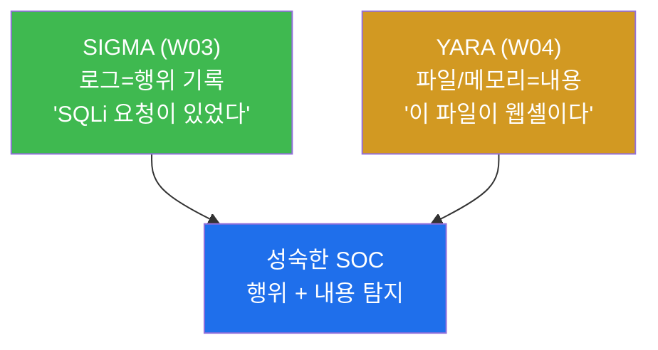
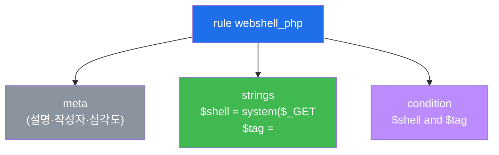
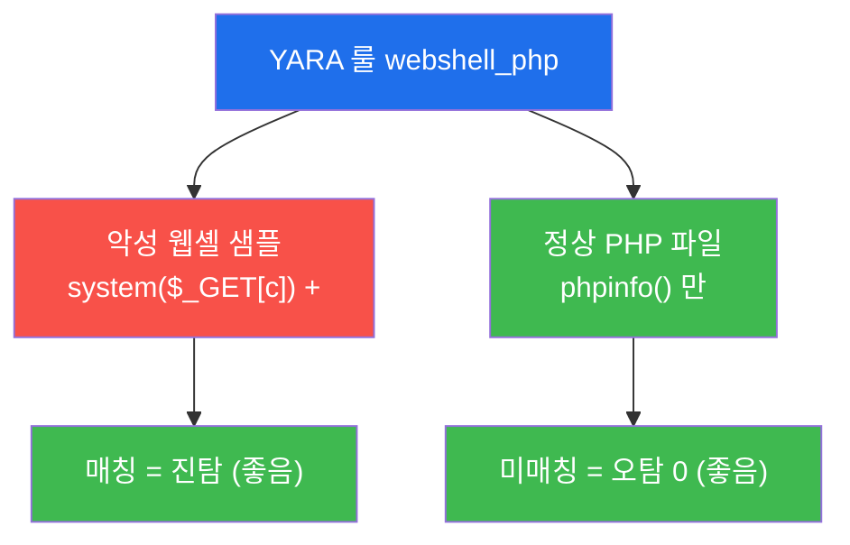
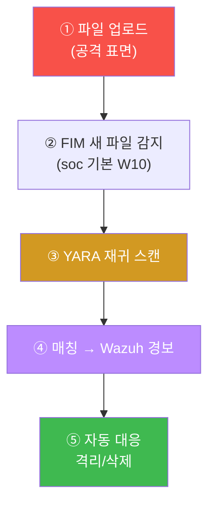

# SOC고급 W04 — YARA 악성코드 탐지: 웹셸·페이로드 시그니처

> **본 주차의 한 줄 요약**
>
> 로그 기반 탐지(SIGMA, W03)는 "무슨 행위가 있었나"를 본다. 하지만 디스크에 떨어진 **웹셸·페이로드·악성
> 바이너리** 자체를 잡으려면 파일·메모리의 내용을 패턴으로 봐야 한다. **YARA**는 그 표준 도구다 —
> "이런 문자열·바이트 패턴을 가진 파일은 악성"이라는 룰로 파일과 프로세스 메모리를 스캔한다. 본 주차에
> 학생은 웹셸 탐지 YARA 룰을 직접 작성해 **악성 샘플은 잡고(진탐) 정상 파일은 안 잡는(오탐 0)** 것을
> 검증하고, 디렉토리·메모리 스캔과 탐지 파이프라인 통합까지 익힌다.
>
> **분석가 한 줄 결론**: YARA는 "악성의 지문"을 정의하는 언어다. 좋은 룰은 **진탐(악성을 잡음)과 오탐 0
> (정상을 안 잡음)** 을 동시에 만족하며, FIM·SIEM·CI와 엮여 자동으로 돈다.

---

## 학습 목표

본 주차 종료 시 학생은 다음 5가지를 **본인 손으로** 할 수 있어야 한다.

1. **YARA 룰 구조**(`strings` + `condition`)를 이해하고 웹셸 특징을 잡는 룰을 작성한다.
2. 악성 웹셸 샘플을 스캔해 **진탐**(매칭)을 확인한다.
3. 정상 PHP 파일을 스캔해 **오탐 0**(미매칭)을 확인하고, 진탐/오탐 균형이 룰 품질임을 설명한다.
4. **디렉토리 재귀(-r)·프로세스 메모리(-p)** 스캔으로 디스크에 없는 파일리스 악성코드까지 탐지하는 법을 안다.
5. YARA를 **FIM·SIEM·CI 파이프라인**에 통합하고, 공격자 회피(난독화)에 맞춰 룰을 정교화한다.

> **이 주차의 시선** — 채점은 "yara를 돌렸다"가 아니라, **진탐+오탐0을 함께 달성**하고 탐지를 파이프라인에
> 엮었는가를 본다.

---

## 0. 용어 해설

| 용어 | 영문 | 뜻 | 비유 |
|------|------|----|------|
| **YARA** | — | 파일·메모리를 패턴 룰로 스캔하는 악성코드 탐지 도구 | 지문 대조 감식기 |
| **시그니처** | signature | 악성코드를 식별하는 고유 패턴(문자열/바이트) | 범인의 지문 |
| **웹셸** | webshell | 웹 서버에서 명령을 실행하는 악성 스크립트 | 몰래 설치된 원격 조종기 |
| **rule** | — | YARA의 탐지 단위(`rule 이름 { ... }`) | 지문 대조 항목 한 건 |
| **meta** | — | 룰의 설명·작성자·심각도 메타데이터 | 사건 파일의 표지 |
| **strings** | — | YARA 룰에서 찾을 문자열/바이트/정규식($로 시작) | 지문의 특징점 |
| **condition** | — | strings 조합 논리(and/or/N of them) | 특징점 몇 개 일치하면 동일인 |
| **진탐** | true positive | 악성을 실제로 잡음 | 진짜 범인 검거 |
| **오탐** | false positive | 정상을 악성으로 잘못 잡음 | 무고한 사람 오인 |
| **미탐** | false negative | 악성을 놓침 | 진범을 놓침 |
| **파일리스** | fileless | 디스크에 안 남고 메모리에서만 도는 악성코드 | 흔적 없는 침입 |
| **-r / -p** | — | 디렉토리 재귀 / 프로세스 메모리 스캔 옵션 | 전 구역 수색 / 현행범 몸수색 |
| **IOC** | Indicator of Compromise | 침해 지표(해시·문자열 등, W05) | 수배 전단의 인상착의 |

> **헷갈리기 쉬운 한 쌍 — SIGMA vs YARA.** 둘 다 탐지 룰이지만 보는 대상이 다르다. **SIGMA**(W03)는
> **로그**(행위의 기록)를 보고, **YARA**는 **파일·메모리의 내용**(악성코드 자체)을 본다. "SQLi 요청이
> 있었다"는 SIGMA가, "업로드된 파일이 웹셸이다"는 YARA가 잡는다. 성숙한 SOC는 둘을 함께 쓴다.

---

## 0.5 신입생 친화 핵심 개념

### 0.5.1 실제 YARA 룰 한 눈에 — `webshell_php`

이번 주차에 쓰는 웹셸 탐지 룰은 이렇게 생겼다. 단 7줄이다.

```yara
rule webshell_php {        // rule + 이름(우리가 지음)
  strings:
    $shell = "system($_GET"  // 특징점 ① 웹셸이 GET 파라미터를 명령으로 실행
    $tag   = "<?php"         // 특징점 ② PHP 파일
  condition:
    $shell and $tag          // 둘 다 있어야 매칭(AND)
}
```

읽는 법: "`$shell`(=`system($_GET`)과 `$tag`(=`<?php`)가 **둘 다** 있으면 웹셸로 판정." `$` 로 시작하는 게
strings 변수다. `and` 가 핵심 — 둘 중 하나만 있는 정상 파일(예: 평범한 `<?php phpinfo();`)은 안 걸린다.

### 0.5.2 진탐·오탐·미탐 — 탐지의 4분면

탐지 품질은 두 가지를 동시에 만족해야 한다: **악성을 잡고(진탐), 정상은 안 잡는다(오탐 0).**

| | 실제 악성 | 실제 정상 |
|---|-----------|-----------|
| **룰이 잡음** | 진탐 ✅(좋음) | 오탐 ❌(나쁨) |
| **룰이 안 잡음** | 미탐 ❌(나쁨) | 오탐0 ✅(좋음) |

룰을 넓히면 진탐이 늘지만 오탐도 는다. 좁히면 오탐은 주나 미탐이 는다. 그래서 **악성 샘플 + 정상 샘플** 두
세트로 동시에 측정하며 조정한다. 실습 STEP 3(진탐)과 STEP 4(오탐0)가 정확히 이 두 측정이다.

### 0.5.3 왜 실습은 룰·샘플을 base64로 만드나

실습 명령에 `echo cnVsZSB3...== | base64 -d > /tmp/sa04.yar` 가 자주 나온다. YARA 룰과 웹셸 샘플에는
`"system($_GET"`, `<?php` 같은 **따옴표·특수문자**가 가득해, 셸에서 그대로 heredoc/echo 하면 인용 오류가 난다.
그래서 **base64로 인코딩한 한 덩이**를 디코드해 파일로 떨군다 — 셸 인용 지옥을 피하는 안전한 전달법이다.
(동시에, 웹셸 샘플을 평문으로 두지 않아 우발적 실행/오탐도 줄인다.)

### 0.5.4 `-r`(재귀)·`-p`(메모리)와 "룰 자기매칭" 함정

| 옵션 | 의미 |
|------|------|
| `yara 룰 파일` | 파일 하나 스캔 |
| `yara -r 룰 디렉토리` | 디렉토리 아래 **모든 파일** 재귀 스캔 |
| `yara -p PID 룰` | 실행 중 **프로세스 메모리** 스캔(파일리스 탐지) |

실습 STEP 5에서 `-r` 로 `/tmp` 를 스캔하면 **룰 파일 자신(`sa04.yar`)이 매칭**된다 — 룰 텍스트가
`system($_GET`·`<?php` 문자열을 담고 있어 자기 자신을 잡는 것이다. 재미있는 함정이자 중요한 교훈: 운영에선
**룰 디렉토리를 스캔 대상에서 제외**해야 한다.

### 0.5.5 임의로 보이는 이름들

| 이름 | 무엇 | 규칙 |
|------|------|------|
| **webshell_php** | rule 이름 | 우리가 지은 식별자(영문·밑줄) |
| **$shell / $tag** | strings 변수 | `$` + 임의 이름, condition에서 참조 |
| **yara 4.1.3** | 엔진 버전 | el34-attacker에 설치된 버전 |
| **마커(`yara_ready` 등)** | 단계 완료 신호 | 채점이 통과를 확인하는 약속 문자열 |

---

## 1. 왜 YARA인가 — 내용을 본다

### 1.1 한 줄 답: 행위 로그로 안 보이는 "악성 파일 자체"를 잡는다

업로드된 파일이 웹셸인지, 메모리에 떠 있는 코드가 알려진 악성코드인지는 **로그(행위)** 로는 알기 어렵다.
파일의 **내용**을 직접 봐야 한다. YARA는 "이런 문자열·바이트를 가진 것은 악성"이라는 룰로 파일·메모리를
스캔해 이 빈틈을 메운다.



### 1.2 왜 중요한가 — 웹셸·파일리스

웹셸(soc 기본 W10)은 침해 후 지속 발판의 단골이다. WAF가 업로드를 못 막았다면, 디스크에 떨어진 웹셸 파일을
YARA로 잡는 것이 마지막 방어선이다. 또 디스크에 안 남는 **파일리스** 악성코드는 프로세스 메모리(-p) 스캔으로만
잡힌다.

### 1.3 한계

YARA는 **알려진 패턴**을 잡는다 — 새 변종·강한 난독화는 룰을 우회한다(§5 정교화로 대응). 또 룰이 너무 넓으면
오탐이 폭주하므로 진탐/오탐 균형이 핵심이다.

---

## 2. YARA 룰 구조



룰은 `strings`에서 찾을 패턴을 선언하고(`$shell`, `$tag`), `condition`에서 그 조합을 정한다(`$shell and
$tag`). 단일 문자열은 정상 파일에도 흔해 오탐이 나므로, **여러 특징의 조합**으로 정밀도를 높인다. strings는
일반 문자열 외에 정규식(`/system\s*\(/`)·16진 바이트(`{ 4D 5A }` = PE 실행파일 시그니처)도 쓸 수 있고,
`nocase`(대소문자 무시)·`wide`(유니코드) 수식어로 변형을 흡수한다.

---

## 3. 진탐 / 오탐 0 — 룰 품질의 두 축



**진탐 — 실측 예.** 웹셸 샘플(`<?php system($_GET[c]); ?>`)을 같은 룰로 스캔한다.

```bash
yara /tmp/sa04.yar /tmp/sa04_shell.php
```

```
webshell_php /tmp/sa04_shell.php
```

`webshell_php <파일경로>` 가 찍히면 그 파일이 룰에 매칭됐다는 뜻(진탐). 샘플은 `system($_GET` 과 `<?php` 를
둘 다 가져 AND condition을 만족한다.

**오탐 0 — 실측 예.** 정상 PHP(`phpinfo()` 만)를 같은 룰로 스캔한다.

```bash
yara /tmp/sa04.yar /tmp/sa04_ok.php; echo no_false_positive
```

```
no_false_positive
```

매칭 줄 없이 `no_false_positive` 만 찍히면 정상 파일에 안 걸린 것(오탐 0). 정상 PHP엔 `system($_GET` 이
없어 AND가 성립 안 한다. **진탐(악성을 잡음) + 오탐0(정상을 안 잡음)** 이 함께여야 쓸 수 있는 룰이다.

---

## 4. 확장 스캔 · 파이프라인 통합

**확장 스캔.** `yara -r <룰> <디렉토리>` 로 전 디렉토리를 재귀 스캔하고, `yara -p <PID> <룰>` 로 실행 중
프로세스 메모리를 스캔한다 — 디스크에 안 남는 파일리스 악성코드는 메모리 스캔으로만 잡힌다(§0.5.4의 자기매칭
함정 주의).

**파이프라인 통합.** YARA는 단독으로 쓰지 않는다.



실습 STEP 6은 업로드 폴더에 웹셸을 떨군 뒤 `yara -r` 로 재귀 스캔해 매칭→경보 사슬의 '탐지' 토막을 실제로
돌린다. 룰 출처는 자체 작성 + 공개 룰셋(YARA-Rules) + 위협 인텔 IOC(W05)다.

---

## 5. 룰 정교화 — 회피 대응

공격자는 base64 인코딩·변수 치환·주석 삽입으로 문자열을 변형해 룰을 우회한다. 대응은 **다중 변형 문자열 +
정규식 + 바이트 패턴 + `condition`의 `N of them`** 으로 룰을 강화하는 것이다(예: `condition: 2 of ($a,$b,$c)`
= 세 특징 중 둘만 맞아도 발화). 단, 너무 넓히면 오탐이 폭주하므로 검증 세트로 진탐/오탐을 측정하며 조정한다 —
탐지 엔지니어링(W03)의 튜닝 원리가 YARA에도 그대로 적용된다.

---

## 6. 실습 안내 (8 미션)

각 미션을 **① 왜 하는가 / ② 무엇을 알 수 있는가 / ③ 결과 해석 / ④ 실전 활용** 4축으로 설명한다. 명령은
el34 호스트에서 `docker exec el34-attacker`(yara 보유)로. 샘플은 `/tmp` 에 만들고 **즉시 삭제(self-clean)**.
**인가된 실습 환경(el34)에서만**.

### STEP 1 — YARA 엔진 확인
- **왜**: 파일·메모리 시그니처 스캔의 엔진이 YARA. 있어야 시작한다.
- **무엇을**: `yara --version`(4.1.3).
- **해석**: 버전이 찍히면 준비 완료(`yara_ready`).
- **실전**: IR 키트에 YARA가 포함됐는지 확인하는 0단계.

### STEP 2 — 룰 구조 (strings/condition)
- **왜**: 이 두 칸이 YARA의 핵심 — 어떤 문자열을 어떻게 조합해 악성 판정할지.
- **무엇을**: webshell_php 룰을 만들어 본문 확인.
- **해석**: `$shell`+`$tag` 를 `and` 로 조합(`condition`). AND라 정상은 덜 걸림.
- **실전**: 공개 YARA 룰을 읽고 우리 환경에 맞게 수정.

### STEP 3 — 진탐 (웹셸 매칭)
- **왜**: 룰을 썼다고 끝이 아니다 — 진짜 악성에 매칭돼야 쓸 수 있다.
- **무엇을**: 웹셸 샘플 스캔 → `webshell_php <파일>` 매칭.
- **해석**: 매칭 줄이 나오면 진탐 성공.
- **실전**: 알려진 악성 샘플로 룰의 탐지력 검증.

### STEP 4 — 오탐 0 (정상 미탐)
- **왜**: 오탐 많은 룰은 운영에서 무시당한다.
- **무엇을**: 정상 PHP(phpinfo) 스캔 → 매칭 없음.
- **해석**: 매칭 없이 `no_false_positive` 만 찍히면 오탐 0.
- **실전**: 정상 파일 세트로 오탐을 측정하는 회귀 테스트.

### STEP 5 — 확장 스캔 (-r/-p)
- **왜**: 악성은 한 파일에만 있지 않다 — 디렉토리 전체, 파일리스는 메모리.
- **무엇을**: `yara -r` 로 /tmp 재귀 스캔.
- **해석**: 전 파일 검사(`dir_scanned`). 룰 자기매칭 함정 → 운영선 룰 디렉토리 제외.
- **실전**: 침해 의심 호스트의 디렉토리/프로세스 일괄 헌팅.

### STEP 6 — 파이프라인 통합
- **왜**: YARA는 '업로드/FIM 트리거 → 스캔 → Wazuh 경보'로 엮여야 자동 탐지.
- **무엇을**: 업로드 폴더에 웹셸 → 재귀 스캔 → 매칭.
- **해석**: 매칭 시 경보 파이프라인(`pipeline_done`). 운영선 격리/삭제로 자동 대응.
- **실전**: FIM·CI와 결합한 상시 악성 파일 차단.

### STEP 7 — 룰 정교화 (회피 대응)
- **왜**: 공격자가 문자열을 변형해 단순 룰을 회피한다.
- **무엇을**: 다중 문자열 AND 룰로 재진탐.
- **해석**: 여전히 진탐(`rule_refined`). 실무는 nocase·정규식·바이트·`N of them` 추가하되 오탐 균형.
- **실전**: 변종 출현 시 룰을 넓히되 정상 세트로 오탐 재측정.

### STEP 8 — YARA 보고서
- **왜**: 진탐/오탐 균형과 통합 결과를 추적 가능하게 남겨야 개선 근거가 된다.
- **무엇을**: 매칭 건수를 인용한 보고서 골격.
- **해석**: 매칭 인용(`yara_report_done`). 제출용은 STEP 3~7 구체 결과를 본문으로.
- **실전**: "무엇을 몇 건 탐지, 오탐 0 확인" 증거 산출물.

---

## 7. 흔한 오해·블루팀 노트

- **"룰을 만들면 탐지된다"** — 진짜 악성 샘플로 진탐을, 정상 세트로 오탐0을 **둘 다** 검증해야 한다.
- **"매칭이 많을수록 좋다"** — 룰 자기매칭(§0.5.4)처럼 의미 없는 매칭도 있다. 스캔 대상에서 룰을 제외.
- **"문자열 하나면 충분"** — 단일 문자열은 정상에도 흔해 오탐 폭주. 여러 특징을 AND/`N of them`으로.
- **"디스크만 보면 된다"** — 파일리스는 디스크에 없다. `-p` 로 프로세스 메모리도 봐야 한다.

---

## 8. 다음 주차 (W05) 예고 — 위협 인텔리전스(CTI)

W04는 알려진 악성의 시그니처(YARA)였다. W05는 그 시그니처·IOC가 어디서 오는지 — 외부 **위협
인텔리전스(CTI)** 를 수집·평가해 탐지로 잇는다(OpenCTI/MISP). YARA 룰의 문자열이 곧 CTI가 배포하는 IOC의
한 형태임을 보게 된다.
