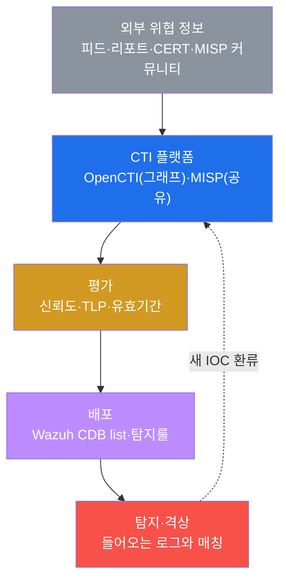
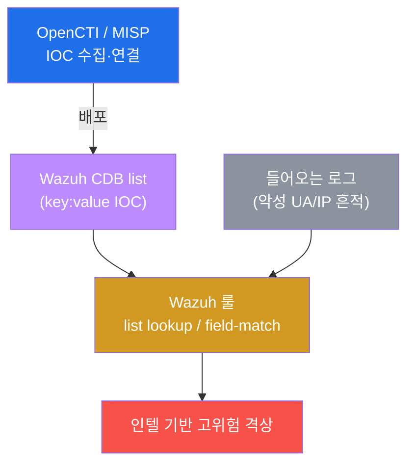

# SOC고급 W05 — 위협 인텔리전스(CTI): IOC 수집·평가·탐지 통합

> **본 주차의 한 줄 요약**
>
> 지금까지의 탐지(SIGMA·YARA)는 "우리 환경"의 데이터를 봤다. 하지만 공격은 우리 밖에서 온다 —
> 다른 조직이 이미 겪은 공격의 **지표(IOC)와 수법(TTP)** 을 미리 알면, 같은 공격을 더 빨리 막는다. 그것이
> **위협 인텔리전스(CTI)** 다. 본 주차에 학생은 el34에 실가동 중인 **OpenCTI/MISP**를 확인하고, 외부 IOC를
> **Wazuh CDB list**로 배포해 들어오는 로그와 매칭하며, **STIX/TAXII** 표준과 **신뢰도·TLP** 평가로 인텔을
> 선별하는 운영 루프를 익힌다.
>
> **인텔 분석가 한 줄 결론**: CTI는 "외부의 경험을 내 탐지로 빌려오는" 다리다. 핵심은 **많이가 아니라
> 신뢰도 높고 최신**인 인텔을 골라 자동 배포하고, 탐지에서 나온 새 지표를 다시 인텔로 환류하는 것이다.

---

## 학습 목표

본 주차 종료 시 학생은 다음 5가지를 **본인 손으로** 할 수 있어야 한다.

1. **CTI의 정의와 가치**(외부 위협 경험을 내 탐지로) 및 IOC vs TTP의 차이를 설명한다.
2. el34의 **OpenCTI/MISP** 가동과 **Wazuh CDB list**(IOC 저장소)를 확인한다.
3. 알려진 악성 지표(IOC)를 흘려, CDB list **매칭으로 인텔 기반 탐지·격상**이 되는 원리를 본다.
4. **STIX/TAXII** 표준(인텔 데이터·교환)을 이해한다.
5. **신뢰도(confidence)·유효기간·TLP**로 인텔을 평가하고, 수집→평가→배포→탐지→환류의 운영 루프를 설계한다.

---

## 강의 시간 배분 (총 3시간 40분)

| 시간        | 내용                                                                | 유형      |
|-------------|---------------------------------------------------------------------|-----------|
| 0:00–0:25   | 이론 — 왜 외부 인텔인가, IOC vs TTP(피라미드 오브 페인)              | 강의      |
| 0:25–0:55   | 이론 — OpenCTI/MISP·CDB list·인텔 기반 탐지                          | 강의      |
| 0:55–1:05   | 휴식                                                                 | —         |
| 1:05–1:35   | 이론 — STIX/TAXII·신뢰도/TLP·운영 루프                              | 강의/토론 |
| 1:35–2:10   | 실습 — CTI 플랫폼/CDB 확인 + IOC 살포 + 인텔 매칭                    | 실습      |
| 2:10–2:40   | 실습 — STIX/TAXII + 신뢰도/TLP 평가                                  | 실습      |
| 2:40–2:50   | 휴식                                                                 | —         |
| 2:50–3:20   | 실습 — 인텔 운영 루프 + 보고서                                       | 실습      |
| 3:20–3:40   | 정리 + 다음 주차 예고                                                | 정리      |

---

## 0. 용어 해설

| 용어 | 영문 | 뜻 | 비유 |
|------|------|----|------|
| **CTI** | Cyber Threat Intelligence | 외부 위협 정보를 수집·분석·활용하는 활동 | 범죄 정보 공유망 |
| **IOC** | Indicator of Compromise | 침해 지표(악성 IP·해시·도메인·UA) | 수배범 지문·차량번호 |
| **TTP** | Tactics·Techniques·Procedures | 공격자의 수법(어떻게 공격하나) | 범행 수법·패턴 |
| **OpenCTI** | — | STIX 그래프로 인텔을 연결·축적하는 플랫폼 | 범죄 정보 데이터베이스 |
| **MISP** | — | 커뮤니티 IOC 공유 플랫폼 | 경찰서 간 정보 공유망 |
| **CDB list** | — | Wazuh의 key:value IOC 조회 목록 | 검문소 수배 명단 |
| **STIX** | — | 위협 인텔 표준 데이터 모델 | 표준 범죄 보고서 양식 |
| **TAXII** | — | STIX를 주고받는 교환 프로토콜 | 보고서 공유 절차 |
| **신뢰도** | confidence | IOC가 실제 악성일 확신 정도 | 제보의 신빙성 |
| **TLP** | Traffic Light Protocol | 인텔 공유 범위(RED/AMBER/GREEN/CLEAR) | 기밀 등급 |

> **헷갈리기 쉬운 한 쌍 — IOC vs TTP (피라미드 오브 페인).** **IOC**(IP·해시)는 잡기 쉽지만 공격자가
> 쉽게 바꾼다(악성 IP 하나 차단해도 다른 IP로). **TTP**(수법)는 잡기 어렵지만 공격자가 바꾸기 가장
> 고통스럽다 — 수법 자체를 바꿔야 하기 때문이다. 그래서 성숙한 CTI는 IOC 차단을 넘어 **TTP 기반 탐지
> (SIGMA·행위 룰)** 로 올라간다. IOC는 빠른 방어, TTP는 지속 방어다.

---

## 1. 왜 외부 인텔인가

### 1.1 한 줄 답: 남이 겪은 공격을 미리 막는다

모든 공격을 우리가 처음 당할 필요는 없다. 다른 조직·보안 업체·CERT가 이미 분석한 공격의 IOC와 TTP를
미리 받아두면, 같은 공격이 우리에게 올 때 **이미 탐지룰이 준비**되어 있다. CTI는 이 "집단 지성"을 내
탐지로 가져오는 다리다.

### 1.2 왜 중요한가 — 속도

침해 대응에서 시간이 생명이다. 새 위협 캠페인의 IOC를 인텔로 미리 받아 CDB list에 넣어두면, 그 IOC가
처음 우리 로그에 나타나는 순간 **즉시 격상**된다 — 사후 분석이 아니라 사전 차단이다.

### 1.3 한계

저신뢰·만료된 IOC를 무차별 적용하면 오탐이 폭주한다(§3). 또 IOC만 의존하면 공격자가 지표를 바꿔 우회하므로,
TTP 기반 탐지(SIGMA·행위)와 병행해야 한다.

---

## 2. el34의 CTI — OpenCTI/MISP와 CDB list

**OpenCTI**는 IOC·Malware·Threat Actor와 그 관계를 STIX 그래프로 축적하는 플랫폼이고, **MISP**는 커뮤니티가
IOC를 공유하는 플랫폼이다(el34에 실가동). 수집된 IOC는 **Wazuh CDB list**(`/var/ossec/etc/lists/`)에
key:value로 배포되어, 룰의 **list lookup**으로 들어오는 로그와 고속 대조된다.

실습에서 알려진 악성 도구 UA를 흘려 로그에 IOC 흔적을 만들고, CDB list 매칭으로 격상되는 흐름을
`wazuh-logtest`로 확인한다(secuops W12에서 본 field-match 패턴).

---

## 3. STIX/TAXII · 신뢰도 · TLP

**STIX/TAXII.** STIX 2.1은 인텔의 표준 데이터 모델(Indicator·Malware·관계를 그래프로), TAXII 2.1은 그것을
주고받는 교환 프로토콜이다. 이 표준 덕분에 전 세계 인텔이 한 포맷으로 흐르고 OpenCTI/MISP가 자동 수집·연동한다.

**신뢰도·유효기간.** 모든 IOC가 같지 않다 — 출처·검증·최신성으로 **confidence**를 평가하고, 시들해진
IOC(회수된 악성 IP 등)는 **만료** 관리한다. 저신뢰 IOC를 무차별 차단하면 오탐이 폭주한다.

**TLP(Traffic Light Protocol).** 인텔의 공유 범위를 RED(비공개)·AMBER(제한)·GREEN(커뮤니티)·CLEAR(공개)로
표시해, 민감한 인텔이 함부로 퍼지지 않게 통제한다.

---

## 4. 인텔 운영 루프

CTI는 일회성 수집이 아니라 순환이다 — **수집(OpenCTI/MISP) → 평가(신뢰도·TLP) → 배포(CDB list·룰) →
탐지(매칭·격상) → 환류(탐지에서 나온 새 IOC를 인텔로)**. 이 루프가 돌수록 탐지 커버리지와 속도가 올라간다.

---

## 5. 실습 안내 (8 미션)

1. **CTI 플랫폼 확인**. 2. **CDB list**(IOC 저장소). 3. **IOC 살포**(악성 UA). 4. **인텔 매칭**(CDB→격상).
5. **STIX/TAXII**. 6. **신뢰도/TLP 평가**. 7. **운영 루프**. 8. **보고서**.

> 명령은 el34 호스트에서 `docker exec` 로. **인가된 실습 환경(el34)에서만**, 공유 Wazuh/CTI는 읽기·테스트 위주.

---

## 6. 다음 주차 (W06) 예고 — 위협 헌팅

W05는 알려진 위협(IOC/인텔)을 자동 매칭했다. W06은 **아직 룰이 없는 잠복 위협**을 가설을 세워 능동적으로
찾아내는 **위협 헌팅(threat hunting)** 을 다룬다.
