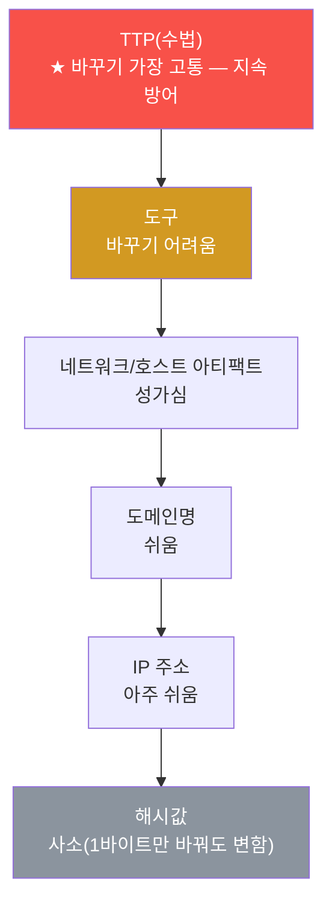
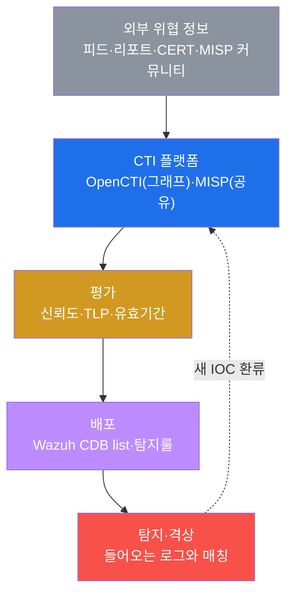
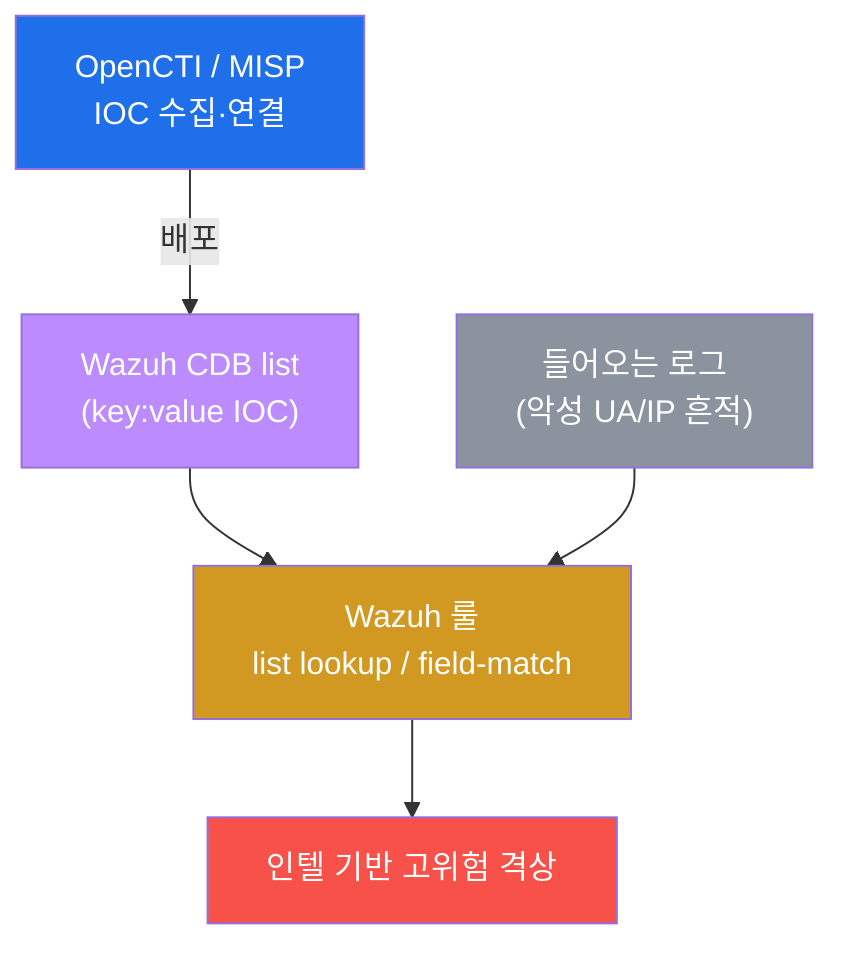
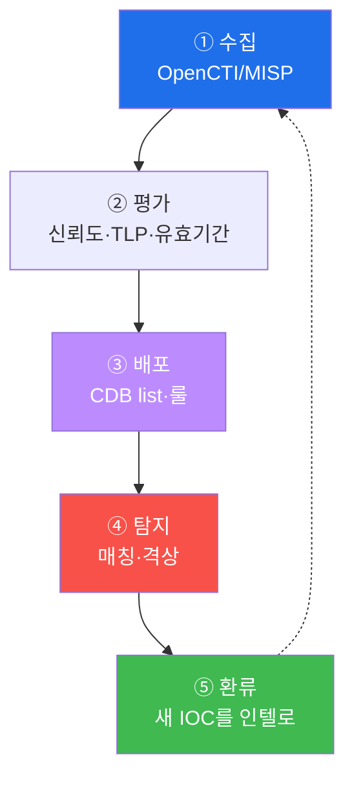

# SOC고급 W05 — 위협 인텔리전스(CTI): IOC 수집·평가·탐지 통합

> **본 주차의 한 줄 요약**
>
> 지금까지의 탐지(SIGMA·YARA)는 "우리 환경"의 데이터를 봤다. 하지만 공격은 우리 밖에서 온다 —
> 다른 조직이 이미 겪은 공격의 **지표(IOC)와 수법(TTP)** 을 미리 알면, 같은 공격을 더 빨리 막는다. 그것이
> **위협 인텔리전스(CTI)** 다. 본 주차에 학생은 el34에 실가동 중인 **OpenCTI/MISP**를 확인하고, 외부 IOC를
> **Wazuh CDB list**로 배포해 들어오는 로그와 매칭하며, **STIX/TAXII** 표준과 **신뢰도·TLP** 평가로 인텔을
> 선별하는 운영 루프를 익힌다.
>
> **인텔 분석가 한 줄 결론**: CTI는 "외부의 경험을 내 탐지로 빌려오는" 다리다. 핵심은 **많이가 아니라
> 신뢰도 높고 최신**인 인텔을 골라 자동 배포하고, 탐지에서 나온 새 지표를 다시 인텔로 환류하는 것이다.

---

## 학습 목표

본 주차 종료 시 학생은 다음 5가지를 **본인 손으로** 할 수 있어야 한다.

1. **CTI의 정의와 가치**(외부 위협 경험을 내 탐지로) 및 IOC vs TTP의 차이를 설명한다.
2. el34의 **OpenCTI/MISP** 가동과 **Wazuh CDB list**(IOC 저장소)를 확인한다.
3. 알려진 악성 지표(IOC)를 흘려, CDB list **매칭으로 인텔 기반 탐지·격상**이 되는 원리를 본다.
4. **STIX/TAXII** 표준(인텔 데이터·교환)을 이해한다.
5. **신뢰도(confidence)·유효기간·TLP**로 인텔을 평가하고, 수집→평가→배포→탐지→환류의 운영 루프를 설계한다.

---

## 0. 용어 해설

| 용어 | 영문 | 뜻 | 비유 |
|------|------|----|------|
| **CTI** | Cyber Threat Intelligence | 외부 위협 정보를 수집·분석·활용하는 활동 | 범죄 정보 공유망 |
| **IOC** | Indicator of Compromise | 침해 지표(악성 IP·해시·도메인·UA) | 수배범 지문·차량번호 |
| **TTP** | Tactics·Techniques·Procedures | 공격자의 수법(어떻게 공격하나) | 범행 수법·패턴 |
| **OpenCTI** | — | STIX 그래프로 인텔을 연결·축적하는 플랫폼 | 범죄 정보 데이터베이스 |
| **MISP** | — | 커뮤니티 IOC 공유 플랫폼 | 경찰서 간 정보 공유망 |
| **connector** | — | 외부 피드를 STIX로 당겨와 OpenCTI에 적재하는 모듈 | 정보 수집 요원 |
| **CDB list** | Constant Database | Wazuh의 key:value IOC 조회 목록 | 검문소 수배 명단 |
| **list lookup** | — | 룰이 CDB list에서 값을 대조하는 매칭 | 명단과 대조 |
| **STIX** | — | 위협 인텔 표준 데이터 모델 | 표준 범죄 보고서 양식 |
| **TAXII** | — | STIX를 주고받는 교환 프로토콜 | 보고서 공유 절차 |
| **신뢰도** | confidence | IOC가 실제 악성일 확신 정도 | 제보의 신빙성 |
| **TLP** | Traffic Light Protocol | 인텔 공유 범위(RED/AMBER/GREEN/CLEAR) | 기밀 등급 |

> **헷갈리기 쉬운 한 쌍 — IOC vs TTP (피라미드 오브 페인).** **IOC**(IP·해시)는 잡기 쉽지만 공격자가
> 쉽게 바꾼다(악성 IP 하나 차단해도 다른 IP로). **TTP**(수법)는 잡기 어렵지만 공격자가 바꾸기 가장
> 고통스럽다 — 수법 자체를 바꿔야 하기 때문이다. 그래서 성숙한 CTI는 IOC 차단을 넘어 **TTP 기반 탐지
> (SIGMA·행위 룰)** 로 올라간다. IOC는 빠른 방어, TTP는 지속 방어다.

---

## 0.5 신입생 친화 핵심 개념

### 0.5.1 피라미드 오브 페인 — 무엇을 막아야 공격자가 가장 아픈가

데이비드 비안코의 "Pyramid of Pain"은 탐지 지표를 공격자가 **바꾸기 어려운 순서**로 쌓은 그림이다. 아래로
갈수록 공격자가 쉽게 바꾸고(우리 방어 효과 짧음), 위로 갈수록 바꾸기 고통스럽다(방어 효과 김).



CTI 초보는 IOC(해시·IP) 차단에 머문다 — 공격자가 1분이면 바꾼다. 성숙한 CTI는 위로 올라가 **TTP**(SIGMA·
행위 룰, W03)를 탐지한다. 본 주차는 IOC 배포(빠른 방어)를 익히되, 그 한계와 TTP로의 상승까지 본다.

### 0.5.2 CDB list 한 눈에 — `IP:라벨`

외부 IOC를 Wazuh가 빠르게 대조하려면 **CDB list**(key:value 텍스트)에 담는다. 실습 STEP 7에서 만드는 한 줄이다.

```
10.20.30.202:malicious_scanner      # key(악성 IP) : value(라벨)
evil.example.com:c2_domain
44d88612fea8a8f36de82e1278abb02f:known_malware_md5
```

이 파일을 `/var/ossec/etc/lists/` 에 두고 `ossec.conf` 에 등록한 뒤, 룰에서 **list lookup**(`<list
field="srcip">etc/lists/ioc</list>`)으로 들어오는 로그의 IP와 대조한다. 매칭되면 고위험으로 격상한다.

### 0.5.3 TLP — 인텔 공유의 4색 신호등

같은 인텔도 "누구와 공유해도 되는가"가 다르다. TLP가 그 표식이다.

| TLP | 공유 범위 |
|-----|-----------|
| **RED** | 받은 사람만(외부 공유 금지) |
| **AMBER** | 조직 내부 + 알아야 할 사람만 |
| **GREEN** | 커뮤니티 내 공유 가능 |
| **CLEAR**(구 WHITE) | 제한 없이 공개 |

민감한 인텔(예: 진행 중 침해의 공격자 IP)을 함부로 퍼뜨리면 공격자가 눈치챈다 — TLP가 이를 막는다.

### 0.5.4 왜 실습 STEP 4는 "Phase 2까지·룰 미발화=갭"이라고 정직하게 말하나

STEP 4에서 IOC 로그를 `wazuh-logtest` 에 넣으면 Phase 2(디코딩)까지만 가고 룰이 발화하지 않는다. 이건
**버그가 아니라 정직한 교육**이다 — el34에는 아직 이 IOC를 매칭하는 **전용 CDB 룰이 없다**. 그래서 마커도
`detect` 가 아니라 `intel_pipeline_ok(전용 룰 미발화=탐지 갭)` 으로 표기한다. **바로 이 갭(아는 IOC인데 룰이
없어 못 잡음)을 CDB list + field-match 룰로 메우는 것이 CTI의 목적**이다. 마커를 무조건 "탐지 성공"으로
찍었다면 이 중요한 갭이 은폐됐을 것이다.

### 0.5.5 임의로 보이는 이름들

| 이름 | 무엇 | 규칙 |
|------|------|------|
| **known-bad-tool/1.0** | 실습용 악성 UA(IOC 예시) | 우리가 지은 가짜 도구명(실무 IOC는 IP/해시/도메인/JA3 등) |
| **el34-opencti-1 / misp-core-1** | CTI 컨테이너 이름 | docker compose 서비스명-인덱스 |
| **malicious_scanner** | CDB value(라벨) | IOC의 분류 태그(우리가 지음) |
| **마커(`cti_ready` 등)** | 단계 완료 신호 | 채점이 통과를 확인하는 약속 문자열 |

---

## 1. 왜 외부 인텔인가

### 1.1 한 줄 답: 남이 겪은 공격을 미리 막는다

모든 공격을 우리가 처음 당할 필요는 없다. 다른 조직·보안 업체·CERT가 이미 분석한 공격의 IOC와 TTP를
미리 받아두면, 같은 공격이 우리에게 올 때 **이미 탐지룰이 준비**되어 있다. CTI는 이 "집단 지성"을 내
탐지로 가져오는 다리다.



### 1.2 왜 중요한가 — 속도

침해 대응에서 시간이 생명이다. 새 위협 캠페인의 IOC를 인텔로 미리 받아 CDB list에 넣어두면, 그 IOC가
처음 우리 로그에 나타나는 순간 **즉시 격상**된다 — 사후 분석이 아니라 사전 차단이다.

### 1.3 한계

저신뢰·만료된 IOC를 무차별 적용하면 오탐이 폭주한다(§3). 또 IOC만 의존하면 공격자가 지표를 바꿔 우회하므로,
TTP 기반 탐지(SIGMA·행위)와 병행해야 한다(§0.5.1 피라미드).

---

## 2. el34의 CTI — OpenCTI/MISP와 CDB list

**OpenCTI**는 IOC·Malware·Threat Actor와 그 관계를 STIX 그래프로 축적하는 플랫폼이고, **MISP**는 커뮤니티가
IOC를 공유하는 플랫폼이다(el34에 실가동 — `el34-opencti-1`·`el34-connector-opencti-1`·`el34-misp-core-1`·
`el34-misp-modules-1`). 수집된 IOC는 **Wazuh CDB list**(`/var/ossec/etc/lists/`)에 key:value로 배포되어, 룰의
**list lookup**으로 들어오는 로그와 고속 대조된다.



**실측 예 — IOC 흔적 만들기.** 알려진 악성 도구처럼 보이는 UA로 요청을 보내 로그에 IOC를 심는다.

```bash
# el34-attacker: known-bad UA로 요청
curl -s -o /dev/null -A 'known-bad-tool/1.0' -H 'Host: dvwa.el34.lab' http://10.20.30.1/?id=ioc_test
# el34-web: 액세스 로그에서 그 UA 흔적
sudo tail -200 /var/log/apache2/dvwa_access.log | grep -c 'known-bad-tool'
```

```
1
```

이 UA가 CDB list에 IOC로 등록돼 있으면 list lookup으로 즉시 격상될 대상이 생긴 것이다. (단 STEP 4에서 보듯
**전용 룰이 없으면 파이프라인은 타되 발화는 안 한다** — 그 갭이 CTI가 메울 자리다, §0.5.4.)

---

## 3. STIX/TAXII · 신뢰도 · TLP

**STIX/TAXII.** STIX 2.1은 인텔의 표준 데이터 모델(Indicator·Malware·관계를 그래프로), TAXII 2.1은 그것을
주고받는 교환 프로토콜이다. 이 표준 덕분에 전 세계 인텔이 한 포맷으로 흐르고, el34의 connector가 외부
피드(MITRE 등)를 STIX로 당겨와 OpenCTI에 자동 적재한다.

**신뢰도·유효기간.** 모든 IOC가 같지 않다 — 출처·검증·최신성으로 **confidence**를 평가하고, 시들해진
IOC(회수된 악성 IP 등)는 **만료** 관리한다. 저신뢰 IOC를 무차별 차단하면 오탐이 폭주한다.

**TLP(Traffic Light Protocol).** §0.5.3의 4색으로 인텔의 공유 범위를 표시해, 민감한 인텔이 함부로 퍼지지
않게 통제한다. 평가(신뢰도·유효기간·TLP)를 통과한 IOC만 CDB로 배포하는 것이 운영 규율이다.

---

## 4. 인텔 운영 루프

CTI는 일회성 수집이 아니라 순환이다.



이 루프가 돌수록 탐지 커버리지와 속도가 올라간다. 특히 **환류**(우리 탐지에서 나온 새 IOC를 다시 인텔
플랫폼으로) 가 빠진 CTI는 '받기만 하는' 반쪽이다 — 성숙한 SOC는 자기가 잡은 지표도 커뮤니티에 돌려준다.

---

## 5. 실습 안내 (8 미션)

각 미션을 **① 왜 하는가 / ② 무엇을 알 수 있는가 / ③ 결과 해석 / ④ 실전 활용** 4축으로 설명한다. 명령은
el34 호스트에서 `docker exec` 로. **인가된 실습 환경(el34)에서만**, 공유 Wazuh/CTI는 읽기·테스트 위주.

### STEP 1 — CTI 플랫폼 확인
- **왜**: CTI 실습은 인텔 수집·공유 플랫폼이 있어야 시작.
- **무엇을**: `docker ps` 에서 OpenCTI/MISP 컨테이너.
- **해석**: OpenCTI(+connector)·MISP(core/modules) 가동(`cti_ready`).
- **실전**: 인텔 인프라 가용성 점검.

### STEP 2 — CDB list (IOC 저장소)
- **왜**: 외부 IOC를 담아 로그와 빠르게 대조할 자리가 필요.
- **무엇을**: `/var/ossec/etc/lists/` 의 CDB 파일들.
- **해석**: 기본 list들 확인(`cdb_listed`). `.cdb` 는 컴파일된 인덱스. 우리 IOC도 여기 꽂는다.
- **실전**: IOC를 어디에 두고 어떻게 룰이 읽는지 파악.

### STEP 3 — IOC 살포 (known-bad UA)
- **왜**: IOC 탐지가 동작하는지 보려면 'IOC가 든 로그'가 먼저 필요.
- **무엇을**: known-bad UA로 요청 → 액세스 로그 흔적.
- **해석**: 흔적 1건 이상이면 매칭 대상 생성(`ioc_planted`).
- **실전**: IOC는 UA뿐 아니라 IP/해시/도메인/JA3 등 다양.

### STEP 4 — CDB 매칭 (정직한 갭 확인)
- **왜**: 외부 인텔이 우리 탐지로 이어지는 고리를 본다.
- **무엇을**: IOC 로그를 wazuh-logtest에 넣어 파이프라인 진입 확인.
- **해석**: Phase 2까지 + `intel_pipeline_ok(전용 룰 미발화=탐지 갭)`. **이 갭이 CTI가 메울 자리**(§0.5.4).
- **실전**: 아는 IOC인데 룰이 없어 못 잡는 갭 → CDB+field-match 룰로 메움.

### STEP 5 — STIX/TAXII
- **왜**: 제각각 포맷이면 인텔을 합칠 수 없다 — 표준이 필요.
- **무엇을**: OpenCTI/MISP 플랫폼 수 집계.
- **해석**: 가동 확인(`stix_taxii`). connector가 외부 피드를 STIX로 당겨온다.
- **실전**: 표준 덕에 전 세계 인텔이 한 언어로 흐른다.

### STEP 6 — 신뢰도/TLP 평가
- **왜**: 저신뢰 IOC를 그대로 배포하면 오탐이 터진다.
- **무엇을**: 평가 통과 IOC가 모이는 CDB 저장소 확인.
- **해석**: CDB 저장소 = 평가 통과분 배포처(`intel_evaluated`). TLP는 공유 범위 표식.
- **실전**: 신뢰도·유효기간·TLP로 거른 고신뢰만 배포.

### STEP 7 — CTI 루프 배포
- **왜**: CTI는 순환 — 배포는 IOC를 탐지 엔진이 읽는 형식(CDB)으로 떨구는 단계.
- **무엇을**: `IP:라벨` CDB 한 줄 작성.
- **해석**: 형식 맞으면 배포 시연(`cti_loop_done`). 실배포는 lists/에 두고 ossec.conf 등록 후 list lookup.
- **실전**: 수집→평가→배포→탐지→환류 중 배포 자동화.

### STEP 8 — CTI 보고서
- **왜**: 인텔 운영도 가동 현황을 근거로 보고해야 신뢰받는다.
- **무엇을**: 플랫폼 수(P)·CDB 수(L)를 인용한 보고서 골격.
- **해석**: 실측 인용(`cti_report_done`). 제출용은 STEP 1~7 + 인텔 출처·신뢰도 표를 본문으로.
- **실전**: "플랫폼 N개·CDB M개·루프 가동" 운영 현황 산출물.

---

## 6. 흔한 오해·블루팀 노트

- **"IOC를 많이 넣을수록 좋다"** — 저신뢰·만료 IOC는 오탐만 키운다. 신뢰도·유효기간·TLP로 걸러 고신뢰만.
- **"IOC 차단이면 충분"** — 공격자가 IP/해시를 1분이면 바꾼다(피라미드 하단). TTP 탐지로 올라가야 지속 방어.
- **"룰이 안 깨지면 실패"** — STEP 4처럼 전용 룰이 없어 발화 안 하는 건 **갭의 정직한 노출**이다. 마커가
  "탐지 성공"으로 거짓말하지 않게 설계했다.
- **"받기만 하면 CTI"** — 환류(우리 IOC를 커뮤니티에 돌려줌)가 빠지면 반쪽 CTI다.

---

## 7. 다음 주차 (W06) 예고 — 위협 헌팅

W05는 알려진 위협(IOC/인텔)을 자동 매칭했다. W06은 **아직 룰이 없는 잠복 위협**을 가설을 세워 능동적으로
찾아내는 **위협 헌팅(threat hunting)** 을 다룬다. CTI가 "남이 아는 위협"이라면, 헌팅은 "아무도 아직 룰로
만들지 않은 위협"을 가설로 사냥하는 일이다.
