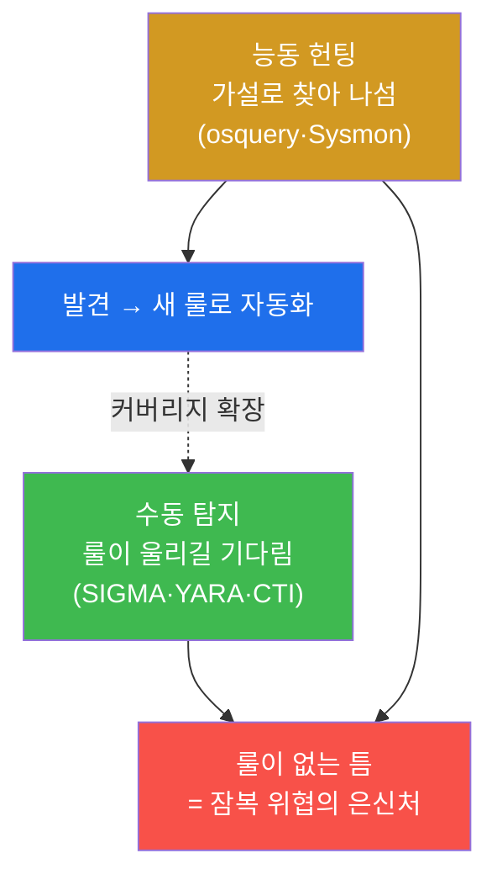
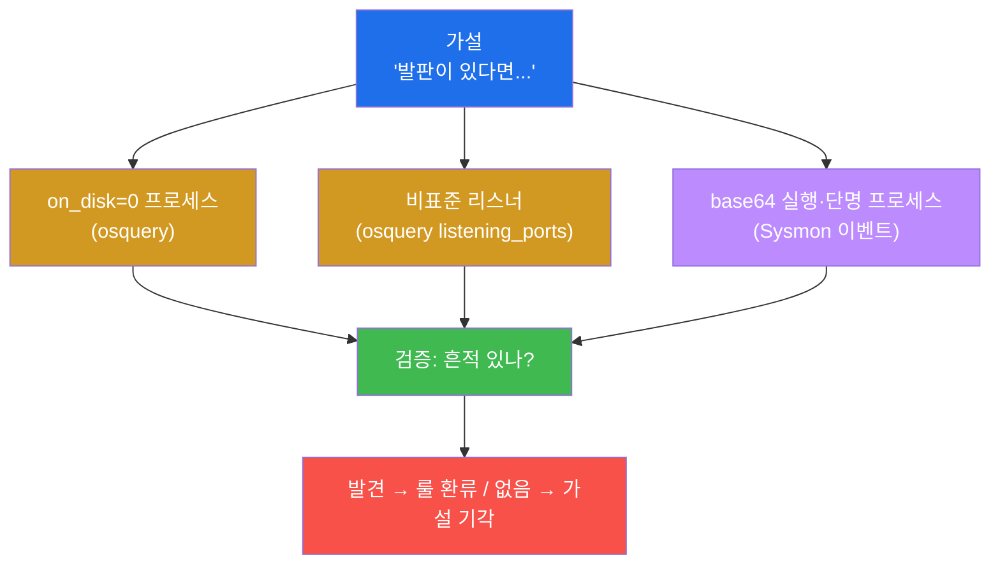
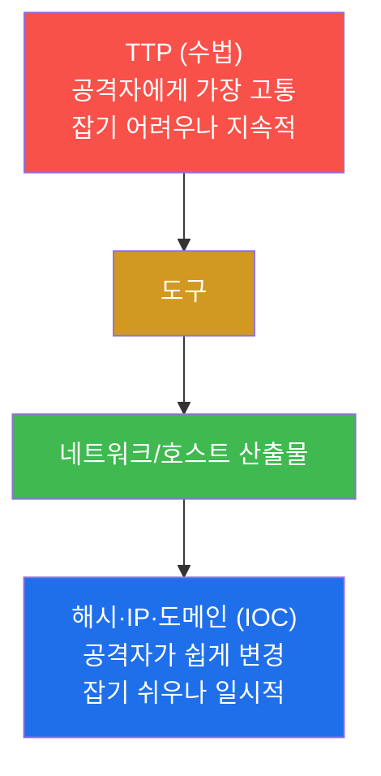
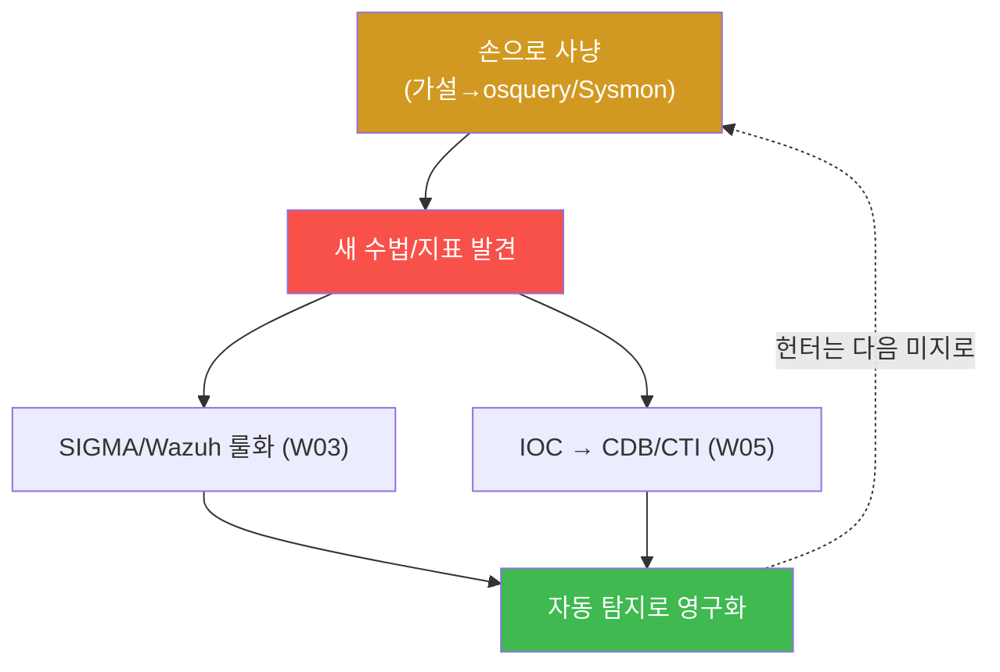

# SOC고급 W06 — 위협 헌팅: 가설을 세워 잠복 위협을 능동적으로 찾는다

> **본 주차의 한 줄 요약**
>
> 지금까지의 탐지(SIGMA·YARA·CTI)는 모두 **수동적**이다 — 룰이 울리기를 기다린다. 그러나 정교한 공격자는
> 룰이 없는 틈으로 들어와 조용히 잠복한다. **위협 헌팅(threat hunting)** 은 그 반대다 — "공격자가 X를 했다면
> Y 흔적이 있을 것"이라는 **가설**을 세우고, osquery(스냅샷)와 호스트 Sysmon(이벤트)으로 그 흔적을 **능동적으로
> 사냥**한다. 본 주차에 학생은 발판·백도어·지속성에 대한 가설을 세우고, 은닉 프로세스·비표준 리스너·단명
> 행위를 헌팅하며, 찾은 패턴을 탐지룰로 환류한다.
>
> **헌터 한 줄 결론**: 헌팅은 "경보를 기다리는" 것이 아니라 "가설로 사냥하는" 것이다. 한 번 손으로 찾은
> 위협은 반드시 룰로 만들어 자동화에 넘긴다 — 그래야 헌터는 다음 미지의 위협으로 나아간다.

---

## 학습 목표

본 주차 종료 시 학생은 다음 5가지를 **본인 손으로** 할 수 있어야 한다.

1. **가설 기반 헌팅(hypothesis-driven hunting)** 이 룰 기반 수동 탐지와 무엇이 다른지 설명한다.
2. 발판·백도어·지속성에 대한 **검증 가능한 가설**을 세운다.
3. **osquery**로 은닉 프로세스(on_disk=0)·비표준 리스너(listening_ports)를 사냥한다.
4. **호스트 Sysmon 이벤트**로 osquery 스냅샷이 놓치는 단명 행위를 사냥한다.
5. **IOC 헌팅 vs TTP 헌팅**을 구분하고, 헌팅 결과를 **탐지룰로 환류**한다.

---

## 0. 용어 해설

| 용어 | 영문 | 뜻 | 비유 |
|------|------|----|------|
| **위협 헌팅** | threat hunting | 가설을 세워 잠복 위협을 능동적으로 찾는 활동 | 잠복근무 형사 |
| **가설 기반** | hypothesis-driven | "X면 Y 흔적" 가설에서 출발 | 수사 가설 |
| **잠복 위협** | dormant threat | 룰을 피해 조용히 숨은 침해 | 위장 잠입한 간첩 |
| **체류 시간** | dwell time | 침해가 발각되기까지 잠복한 기간 | 간첩이 들키기까지의 시간 |
| **osquery** | — | OS를 SQL로 질의하는 스냅샷 도구 | 현재 입실 명단 |
| **on_disk=0** | — | 실행 파일이 디스크에 없는 프로세스 | 신분증 없이 활동하는 자 |
| **listening_ports** | — | LISTEN 중인 포트 목록 | 열린 문 목록 |
| **baseline** | — | 정상 상태의 기준선(정상 포트·프로세스) | 평상시 풍경 |
| **Sysmon** | — | 프로세스·연결·파일 이벤트 스트림 | CCTV 녹화 |
| **EventID** | — | Sysmon 이벤트 종류 번호(1/3/11 등) | 사건 분류 코드 |
| **단명 프로세스** | short-lived | 잠깐 떴다 사라지는 프로세스 | 스쳐간 방문객 |
| **IOC 헌팅** | — | 알려진 지표를 환경에서 검색 | 수배 명단 대조 |
| **TTP 헌팅** | — | 수법 패턴을 가설로 사냥 | 범행 수법 추적 |

> **헷갈리기 쉬운 한 쌍 — 스냅샷 vs 이벤트 스트림.** **osquery**는 "지금 이 순간"의 상태를 찍는 스냅샷이고,
> **Sysmon**은 "시간에 걸친 행위"를 기록하는 이벤트 스트림이다. 백도어 계정·열린 포트처럼 **지금 존재하는**
> 것은 osquery가, base64 디코드 실행·잠깐 뜬 리버스셸처럼 **잠깐 일어난** 것은 Sysmon이 잡는다. 헌터는 둘을
> 함께 써야 사각이 없다.

---

## 0.5 핵심 개념

### 0.5.1 osquery SQL 한 눈에 — 운영체제를 데이터베이스처럼

osquery는 OS의 상태를 **SQL 테이블**로 보여준다. 헌팅 쿼리는 평범한 SQL이다.

```sql
SELECT pid, name, on_disk FROM processes WHERE on_disk=0;   -- 디스크에 없는데 도는 프로세스
SELECT DISTINCT port, protocol FROM listening_ports;        -- LISTEN 중인 포트
SELECT username, uid FROM users WHERE uid >= 1000;          -- 일반 사용자 계정
```

`processes`·`listening_ports`·`users`·`crontab` 같은 테이블을 `WHERE` 로 거른다 — DB를 다뤄봤다면 이미
아는 문법이다. `--json` 옵션을 붙이면 결과를 JSON으로 받아 파싱하기 쉽다.

### 0.5.2 스냅샷(osquery) vs 이벤트(Sysmon) — Sysmon EventID

osquery가 못 보는 "잠깐 일어난" 행위는 Sysmon 이벤트가 잡는다. el34는 **호스트에 Sysmon for Linux**가 깔려
컨테이너 프로세스까지 `/var/log/syslog`(`Linux-Sysmon`)에 기록한다. 자주 보는 EventID는:

| EventID | 의미 | 헌팅에서 |
|---------|------|----------|
| **1** | ProcessCreate | `base64 -d \| bash` 같은 단명 명령 |
| **3** | NetworkConnect | C2 비콘·역방향 연결 |
| **11** | FileCreate | 웹셸·드롭된 페이로드 |

osquery로 "지금 켜진 포트"를 보고, Sysmon으로 "아까 잠깐 뜬 프로세스"를 본다 — 둘이 시간축의 다른 면을 덮는다.

### 0.5.3 baseline — 무엇이 "정상"인지 알아야 "이상"이 보인다

헌팅은 **정상 기준선(baseline)** 과의 차이에서 출발한다. el34-web의 정상 LISTEN 포트는 이렇다.

| 포트 | 서비스 |
|------|--------|
| 22 | SSH |
| 80 / 443 | 웹(HTTP/HTTPS) |
| 8001~ | 앱(vhost 백엔드) |

이 baseline에 없는 포트(예: 4444, 1337)가 LISTEN으로 잡히면 백도어 의심이다. `protocol` 값은 IANA 번호 —
**6=TCP**, 17=UDP, 0=ALL. baseline을 모르면 모든 포트가 똑같이 보여 이상을 못 짚는다.

### 0.5.4 "빈 결과도 결과다" — 가설의 검증/기각

헌팅 쿼리가 아무것도 안 나오면 실패가 아니다. 그것은 **"해당 가설의 위협은 없다"는 유효한 결론**이다. 예를
들어 `on_disk=0` 프로세스가 0건이면 "삭제 후 실행 중인 은닉 발판 없음(정상)"이 증명된 것이다. 헌팅의 목적은
위협을 찾는 것만이 아니라 **가설을 검증하거나 기각**하는 것이다 — 둘 다 환경에 대한 지식을 늘린다.

### 0.5.5 임의로 보이는 값들

| 값 | 무엇 | 규칙 |
|----|------|------|
| **on_disk=0** | processes 컬럼 | 1=디스크에 있음, 0=없음(삭제됨) |
| **protocol 6** | listening_ports | IANA 번호(6=TCP) |
| **EventID 1/3/11** | Sysmon | ProcessCreate/NetworkConnect/FileCreate |
| **Wazuh rule 5760** | 내장 룰 | SSH 다중 인증 실패(환류 검증 샘플) |
| **마커(`hunt_ready` 등)** | 단계 완료 신호 | 채점이 통과를 확인하는 약속 문자열 |

---

## 1. 수동 탐지 vs 능동 헌팅

### 1.1 한 줄 답: 기다리지 않고 찾아 나선다

룰 기반 탐지는 강력하지만, **룰이 없는 위협**은 못 잡는다 — 그리고 정교한 공격자는 바로 그 틈을 노린다.
위협 헌팅은 "우리 룰이 없는 곳에 위협이 숨어 있다"고 가정하고, 가설을 세워 능동적으로 찾아 나선다.



### 1.2 왜 중요한가 — 체류 시간(dwell time) 단축

침해는 평균 수십~수백 일 잠복한다(dwell time). 룰을 기다리면 그동안 안 보인다. 헌팅은 이 잠복을 능동적으로
끊어 체류 시간을 줄인다 — 늦게 발견할수록 피해(데이터 유출·확산)가 커지기 때문이다.

### 1.3 한계

헌팅은 **전문성과 시간**이 든다. 그래서 무한정 손으로 할 수 없다 — 찾은 패턴을 반드시 룰로 환류해(§4)
자동화에 넘기고, 헌터는 다음 미지의 위협으로 나아가야 지속 가능하다.

---

## 2. 가설 → 사냥 (osquery · Sysmon)



**osquery 헌팅 — 실측 예.** 은닉 프로세스 가설을 사냥한다.

```bash
osqueryi --json 'SELECT pid,name,on_disk FROM processes WHERE on_disk=0 LIMIT 5'
```

```
[

]
```

빈 배열 `[ ]` = on_disk=0 프로세스 없음 = 삭제 후 실행 중인 은닉 발판 없음(정상, 가설 기각). 만약 행이
잡히면 그 pid를 즉시 조사한다(부모 프로세스·열린 소켓·메모리 추적).

**비표준 리스너 — 실측 예.**

```bash
osqueryi --json 'SELECT DISTINCT port,protocol FROM listening_ports ORDER BY port LIMIT 8'
```

```
[
  {"port":"22","protocol":"6"},
  {"port":"80","protocol":"6"},
  {"port":"443","protocol":"6"},
  {"port":"8001","protocol":"6"}
]
```

baseline(§0.5.3)에 있는 포트만 보이면 정상. baseline에 없는 포트가 잡히면 그 포트를 연 프로세스를 추적한다.

**Sysmon 헌팅.** osquery가 못 보는 단명 행위는 호스트 Sysmon 이벤트(`/var/log/syslog` 의 `Linux-Sysmon`)에서
EventID로 사냥한다(예: ProcessCreate에서 `base64 -d | bash` 명령줄 검색). 이 단계의 명령은 호스트 로그를
보므로 **el34 호스트에서** 실행한다.

---

## 3. IOC 헌팅 vs TTP 헌팅 (피라미드 오브 페인)



**IOC 헌팅**(알려진 해시·IP·이름 검색)은 빠르지만 공격자가 지표를 바꾸면 놓친다 — 실습 STEP 6의
`name LIKE '%sh%'` 가 이 방식이다. **TTP 헌팅**(on_disk=0·비표준 리스너·base64 실행 같은 수법 패턴)은
전문성이 들지만, 공격자가 우회하려면 수법 자체를 바꿔야 해서 더 지속적이다(피라미드 상단). 성숙한 헌터는
둘을 병행한다.

---

## 4. 헌팅 결과의 탐지룰 환류

헌팅의 마지막 단계는 **자동화로 넘기기**다. 손으로 찾은 위협 패턴을 SIGMA/Wazuh 룰(W03)로 만들고, 발견한
IOC를 CTI/CDB(W05)로 환류한다.



원칙은 단순하다 — **한 번 손으로 사냥한 위협은 다시 손으로 찾지 않는다.** 실습 STEP 7은 헌팅 패턴 로그를
`wazuh-logtest` 에 넣어 룰 발화(Phase 3, rule 5760)를 확인하며 이 환류의 첫 단추를 끼운다. 헌팅(능동)과
탐지(자동)는 서로를 먹인다: 헌팅이 새 룰을 낳고, 룰이 헌터의 시간을 벌어준다.

---

## 5. 실습 안내 (8 미션)

각 미션을 **① 왜 하는가 / ② 무엇을 알 수 있는가 / ③ 결과 해석 / ④ 실전 활용** 4축으로 설명한다. 명령은
el34 호스트에서 `docker exec` 로(STEP 5 Sysmon은 호스트 `/var/log/syslog` 직접 조회). **인가된 실습 환경
(el34)에서만**, 점검은 읽기 전용.

### STEP 1 — 헌팅 엔진 확인 (osquery)
- **왜**: 헌팅은 osquery(스냅샷)·Sysmon(이벤트)로 호스트를 들여다본다.
- **무엇을**: `osqueryi --version`(5.23.0).
- **해석**: 버전이 찍히면 호스트를 SQL 테이블로 질의 가능(`hunt_ready`).
- **실전**: 헌팅 키트 가용성 점검.

### STEP 2 — 가설 수립
- **왜**: 헌팅은 막연한 둘러보기가 아니라 검증 가능한 가설에서 출발.
- **무엇을**: on_disk=0 수·LISTEN 포트 수를 osquery로 질의해 가설이 검증 가능한지.
- **해석**: 두 가설이 숫자로 답해지면 검증 가능(`hypothesis_set`).
- **실전**: "발판이 있다면 X 흔적" 식 가설 설계.

### STEP 3 — 은닉 프로세스 헌팅 (on_disk=0)
- **왜**: 삭제 후 실행 중인 프로세스는 강한 침해 신호.
- **무엇을**: `processes WHERE on_disk=0`.
- **해석**: 빈 배열 = 은닉 발판 없음(정상, `proc_hunted`). 행이 잡히면 즉시 조사. **빈 결과도 결과**(§0.5.4).
- **실전**: 침해 의심 호스트의 1순위 헌팅 쿼리.

### STEP 4 — 비표준 리스너 헌팅
- **왜**: 예상 밖 포트 LISTEN은 백도어 리스너 신호.
- **무엇을**: `listening_ports` 를 baseline과 대조.
- **해석**: 22/80/443/8001만 보이면 정상(`ports_hunted`). protocol 6=TCP. 비표준 포트=의심.
- **실전**: baseline 대비 이상 포트 탐지 → 프로세스 추적.

### STEP 5 — Sysmon 이벤트 헌팅 (단명 행위)
- **왜**: osquery 스냅샷은 '지금'만 본다 — 잠깐 일어난 행위는 이벤트 스트림으로.
- **무엇을**: 호스트 `/var/log/syslog` 의 `Linux-Sysmon` 이벤트 건수.
- **해석**: 이벤트가 쌓이면 단명 행위 사냥 소스 확보(`sysmon_hunt`). EventID 1/3/11로 명령·연결·파일 추적.
- **실전**: `base64 -d | bash` 같은 파일리스 명령을 ProcessCreate에서 검색.

### STEP 6 — IOC 헌팅 vs TTP 헌팅
- **왜**: 두 방식의 차이(빠르나 변형에 약함 vs 지속적이나 전문성)를 체감.
- **무엇을**: `name LIKE '%sh%'`(IOC) + `on_disk=0`(TTP) 각각 사냥.
- **해석**: IOC는 이름을 콕(이름 바꾸면 놓침), TTP는 수법을 봄(이름 무관)(`ioc_vs_ttp`).
- **실전**: 빠른 IOC 스윕 + 끈질긴 TTP 헌팅 병행.

### STEP 7 — 탐지룰 환류
- **왜**: 손으로 잡은 위협은 룰로 만들어 영구 자동 탐지해야 한다.
- **무엇을**: 헌팅 패턴 로그를 wazuh-logtest에 넣어 발화 확인.
- **해석**: Phase 3 + rule 5760 = 자동 탐지 가능(`hunt_to_rule`). SIGMA/Wazuh로 굳힘(W03).
- **실전**: "한 번 사냥 → 영구 자동 탐지" 환류 규율.

### STEP 8 — 헌팅 보고서
- **왜**: 가설→사냥→환류의 한 바퀴를 추적 가능하게 남겨야 다음 헌터가 이어간다.
- **무엇을**: 컨테이너 내 osquery 프로세스 수를 인용한 보고서 골격.
- **해석**: 실측 인용(`threat_hunt_report_done`). `sh -c` 는 작은따옴표(큰따옴표면 `$(osqueryi)` 가 호스트서 실행돼 빈값).
- **실전**: 헌팅 산출물을 다음 사이클의 입력으로 남김.

---

## 6. 흔한 오해·블루팀 노트

- **"빈 결과는 실패"** — 아니다. 가설 기각(위협 없음 증명)도 유효한 결론이다(§0.5.4).
- **"막연히 둘러보면 헌팅"** — 헌팅은 검증 가능한 **가설**에서 출발한다. 가설 없는 탐색은 시간 낭비.
- **"osquery면 충분"** — 스냅샷은 단명 행위를 놓친다. Sysmon 이벤트와 병행해야 사각이 없다.
- **"찾고 끝"** — 찾은 패턴을 룰로 환류하지 않으면 다음에 또 손으로 찾아야 한다. 헌팅의 성과는 룰로 굳혀야 남는다.

---

## 7. 다음 주차 (W07) 예고 — 네트워크 포렌식

W06은 호스트 계층 헌팅이었다. W07은 패킷·흐름 수준에서 공격 흔적을 복원하는 **네트워크 포렌식**(Suricata
eve.json·흐름 분석)을 다룬다. 호스트(osquery/Sysmon)에서 네트워크(eve.json)로 시야를 넓혀, 같은 공격을
다른 각도에서 본다.
