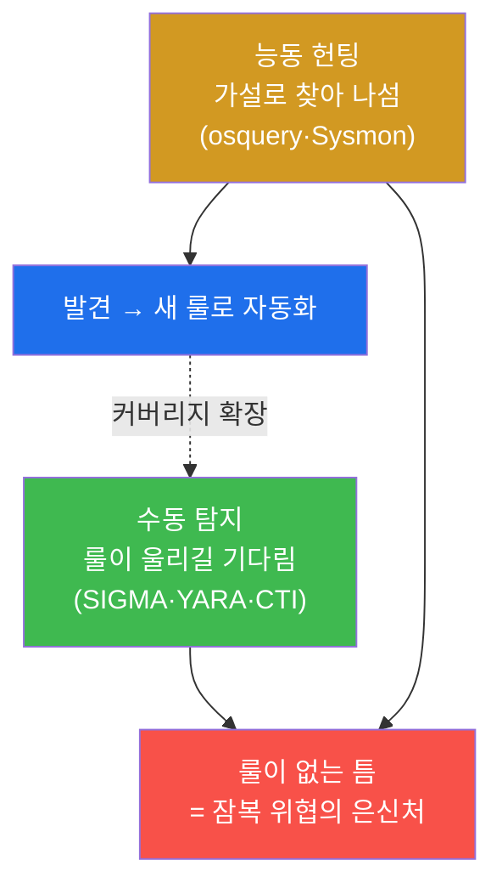
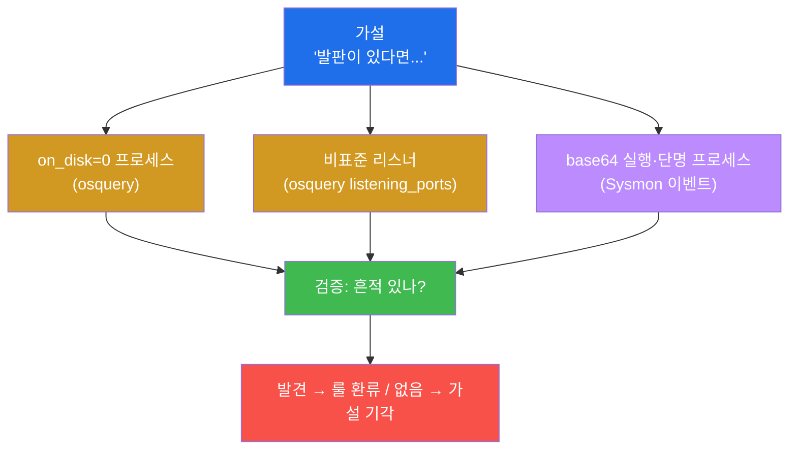
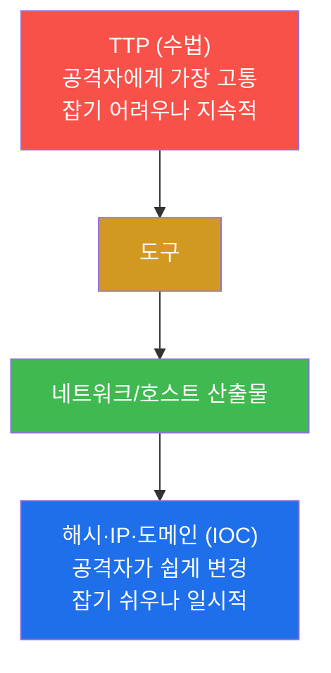

# SOC고급 W06 — 위협 헌팅: 가설을 세워 잠복 위협을 능동적으로 찾는다

> **본 주차의 한 줄 요약**
>
> 지금까지의 탐지(SIGMA·YARA·CTI)는 모두 **수동적**이다 — 룰이 울리기를 기다린다. 그러나 정교한 공격자는
> 룰이 없는 틈으로 들어와 조용히 잠복한다. **위협 헌팅(threat hunting)** 은 그 반대다 — "공격자가 X를 했다면
> Y 흔적이 있을 것"이라는 **가설**을 세우고, osquery(스냅샷)와 호스트 Sysmon(이벤트)으로 그 흔적을 **능동적으로
> 사냥**한다. 본 주차에 학생은 발판·백도어·지속성에 대한 가설을 세우고, 은닉 프로세스·비표준 리스너·단명
> 행위를 헌팅하며, 찾은 패턴을 탐지룰로 환류한다.
>
> **헌터 한 줄 결론**: 헌팅은 "경보를 기다리는" 것이 아니라 "가설로 사냥하는" 것이다. 한 번 손으로 찾은
> 위협은 반드시 룰로 만들어 자동화에 넘긴다 — 그래야 헌터는 다음 미지의 위협으로 나아간다.

---

## 학습 목표

본 주차 종료 시 학생은 다음 5가지를 **본인 손으로** 할 수 있어야 한다.

1. **가설 기반 헌팅(hypothesis-driven hunting)** 이 룰 기반 수동 탐지와 무엇이 다른지 설명한다.
2. 발판·백도어·지속성에 대한 **검증 가능한 가설**을 세운다.
3. **osquery**로 은닉 프로세스(on_disk=0)·비표준 리스너(listening_ports)를 사냥한다.
4. **호스트 Sysmon 이벤트**로 osquery 스냅샷이 놓치는 단명 행위를 사냥한다.
5. **IOC 헌팅 vs TTP 헌팅**을 구분하고, 헌팅 결과를 **탐지룰로 환류**한다.

---

## 0. 용어 해설

| 용어 | 영문 | 뜻 | 비유 |
|------|------|----|------|
| **위협 헌팅** | threat hunting | 가설을 세워 잠복 위협을 능동적으로 찾는 활동 | 잠복근무 형사 |
| **가설 기반** | hypothesis-driven | "X면 Y 흔적" 가설에서 출발 | 수사 가설 |
| **잠복 위협** | dormant threat | 룰을 피해 조용히 숨은 침해 | 위장 잠입한 간첩 |
| **osquery** | — | OS를 SQL로 질의하는 스냅샷 도구 | 현재 입실 명단 |
| **on_disk=0** | — | 실행 파일이 디스크에 없는 프로세스 | 신분증 없이 활동하는 자 |
| **listening_ports** | — | LISTEN 중인 포트 목록 | 열린 문 목록 |
| **Sysmon** | — | 프로세스·연결·파일 이벤트 스트림 | CCTV 녹화 |
| **단명 프로세스** | short-lived | 잠깐 떴다 사라지는 프로세스 | 스쳐간 방문객 |
| **IOC 헌팅** | — | 알려진 지표를 환경에서 검색 | 수배 명단 대조 |
| **TTP 헌팅** | — | 수법 패턴을 가설로 사냥 | 범행 수법 추적 |

> **헷갈리기 쉬운 한 쌍 — 스냅샷 vs 이벤트 스트림.** **osquery**는 "지금 이 순간"의 상태를 찍는 스냅샷이고,
> **Sysmon**은 "시간에 걸친 행위"를 기록하는 이벤트 스트림이다. 백도어 계정·열린 포트처럼 **지금 존재하는**
> 것은 osquery가, base64 디코드 실행·잠깐 뜬 리버스셸처럼 **잠깐 일어난** 것은 Sysmon이 잡는다. 헌터는 둘을
> 함께 써야 사각이 없다.

---

## 1. 수동 탐지 vs 능동 헌팅

### 1.1 한 줄 답: 기다리지 않고 찾아 나선다

룰 기반 탐지는 강력하지만, **룰이 없는 위협**은 못 잡는다 — 그리고 정교한 공격자는 바로 그 틈을 노린다.
위협 헌팅은 "우리 룰이 없는 곳에 위협이 숨어 있다"고 가정하고, 가설을 세워 능동적으로 찾아 나선다.

### 1.2 왜 중요한가 — 체류 시간(dwell time) 단축

침해는 평균 수십~수백 일 잠복한다(dwell time). 룰을 기다리면 그동안 안 보인다. 헌팅은 이 잠복을 능동적으로
끊어 체류 시간을 줄인다.

### 1.3 한계

헌팅은 **전문성과 시간**이 든다. 그래서 무한정 손으로 할 수 없다 — 찾은 패턴을 반드시 룰로 환류해(§4)
자동화에 넘기고, 헌터는 다음 미지의 위협으로 나아가야 지속 가능하다.

---

## 2. 가설 → 사냥 (osquery · Sysmon)

**osquery 헌팅.** `SELECT ... FROM processes WHERE on_disk=0`(디스크에서 지워진 채 도는 프로세스 = 은닉
발판), `FROM listening_ports`(비표준 포트 LISTEN = 백도어 리스너), `FROM users/crontab`(지속성). **Sysmon
헌팅.** osquery가 못 보는 단명 행위 — 호스트 Sysmon(eBPF)이 컨테이너 프로세스 생성(EventID 1)·네트워크
연결(3)·파일 생성(11)을 이벤트로 기록하므로, `grep b64decode` 등으로 잠깐 일어난 행위를 사냥한다.

**중요 — 빈 결과도 결과다.** 헌팅 쿼리가 아무것도 안 나오면 "해당 가설의 위협 없음"이라는 유효한 결론이다.
헌팅의 목적은 위협을 찾는 것만이 아니라 **가설을 검증/기각**하는 것이다.

---

## 3. IOC 헌팅 vs TTP 헌팅 (피라미드 오브 페인)

**IOC 헌팅**(알려진 해시·IP 검색)은 빠르지만 공격자가 지표를 바꾸면 놓친다. **TTP 헌팅**(on_disk=0·비표준
리스너·base64 실행 같은 수법 패턴)은 전문성이 들지만, 공격자가 우회하려면 수법 자체를 바꿔야 해서 더
지속적이다(피라미드 오브 페인 상단). 성숙한 헌터는 둘을 병행한다.

---

## 4. 헌팅 결과의 탐지룰 환류

헌팅의 마지막 단계는 **자동화로 넘기기**다. 손으로 찾은 위협 패턴을 SIGMA/Wazuh 룰(W03)로 만들고, 발견한
IOC를 CTI/CDB(W05)로 환류한다. 원칙은 단순하다 — **한 번 손으로 사냥한 위협은 다시 손으로 찾지 않는다.**
헌팅(능동·수동)과 탐지(자동)는 서로를 먹인다: 헌팅이 새 룰을 낳고, 룰이 헌터의 시간을 벌어준다.

---

## 5. 실습 안내 (8 미션)

1. **헌팅 대상 확인**(osquery). 2. **가설 수립**. 3. **은닉 프로세스 헌팅**(on_disk=0). 4. **비표준 리스너
헌팅**. 5. **Sysmon 이벤트 헌팅**(단명 행위). 6. **IOC vs TTP 헌팅**. 7. **탐지룰 환류**. 8. **보고서**.

> 명령은 el34 호스트에서 `docker exec` 로. **인가된 실습 환경(el34)에서만**, 점검은 읽기 전용.

---

## 6. 다음 주차 (W07) 예고 — 네트워크 포렌식

W06은 호스트 계층 헌팅이었다. W07은 패킷·흐름 수준에서 공격 흔적을 복원하는 **네트워크 포렌식**(Suricata
eve.json·흐름 분석)을 다룬다.
