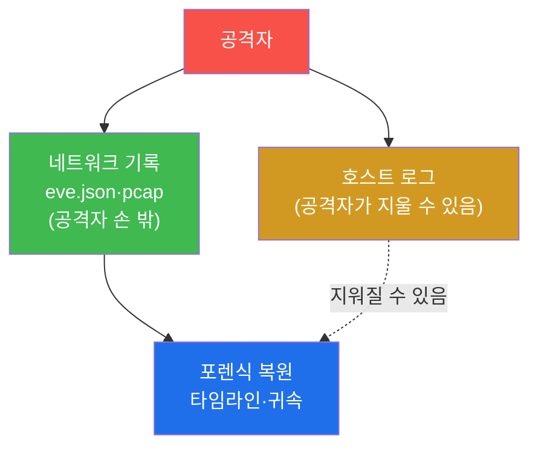
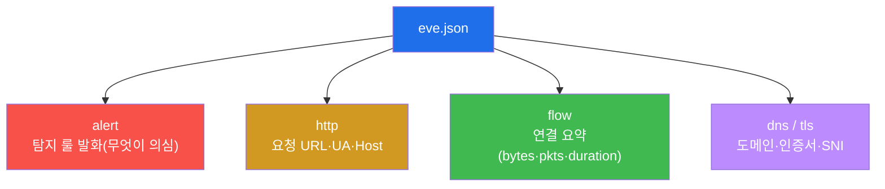
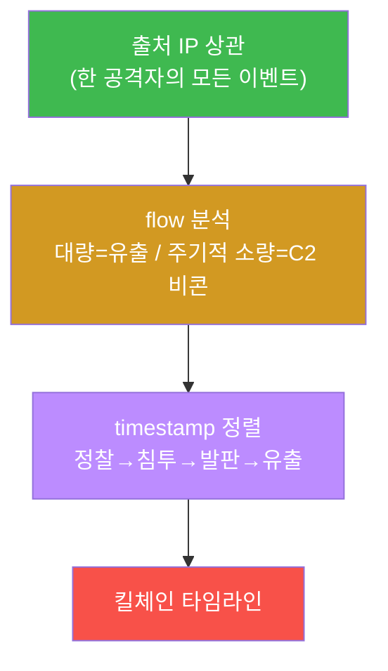

# SOC고급 W07 — 네트워크 포렌식: 흐름·패킷에서 공격을 복원한다

> **본 주차의 한 줄 요약**
>
> 호스트 헌팅(W06)이 "그 컴퓨터 안에서 무슨 일이 있었나"를 봤다면, **네트워크 포렌식**은 "선(線) 위로
> 무엇이 오갔나"를 본다. 공격자는 호스트의 로그는 지울 수 있어도 **이미 네트워크를 지나간 트래픽**은 되돌릴
> 수 없다. 본 주차에 학생은 공격을 흘려 Suricata **eve.json**에 흔적을 만들고, **event_type별 분석 → 출처
> 상관 → flow 분석 → 타임라인 복원**의 네트워크 포렌식 한 바퀴를 돈다.
>
> **분석가 한 줄 결론**: 네트워크는 거짓말하지 않는다. 출처 IP가 보존되면(el34는 SNAT 없음) 한 공격자의
> 스캔·침투·유출을 모두 한 IP로 묶어 **시간순 타임라인**으로 사건을 재구성할 수 있다.

---

## 학습 목표

본 주차 종료 시 학생은 다음 5가지를 **본인 손으로** 할 수 있어야 한다.

1. **네트워크 포렌식**이 호스트 포렌식과 무엇이 다른지(선 위의 트래픽 vs 호스트 내부)를 설명한다.
2. Suricata **eve.json**의 **event_type**(alert·http·flow·dns·tls)을 구분하고 각 포렌식 단서를 안다.
3. **출처 IP 상관**으로 한 공격자의 모든 이벤트를 묶는다.
4. **flow 이벤트**(연결 요약)로 데이터 유출(대량)·C2 비콘(주기적 소량)을 식별한다.
5. 이벤트를 **timestamp로 정렬해 공격 타임라인**을 복원하고, eve.json+pcap을 무결하게 보전한다.

---

## 강의 시간 배분 (총 3시간 40분)

| 시간        | 내용                                                                | 유형      |
|-------------|---------------------------------------------------------------------|-----------|
| 0:00–0:25   | 이론 — 호스트 vs 네트워크 포렌식, "네트워크는 거짓말하지 않는다"     | 강의      |
| 0:25–0:55   | 이론 — eve.json event_type·출처 상관·flow                           | 강의      |
| 0:55–1:05   | 휴식                                                                 | —         |
| 1:05–1:35   | 이론 — 타임라인 복원·PCAP·증거 보전                                  | 강의/토론 |
| 1:35–2:10   | 실습 — 흐름 생성 + event_type 분석 + 출처 상관                       | 실습      |
| 2:10–2:40   | 실습 — flow 분석 + 타임라인 복원                                     | 실습      |
| 2:40–2:50   | 휴식                                                                 | —         |
| 2:50–3:20   | 실습 — PCAP·증거 보전 + 보고서                                       | 실습      |
| 3:20–3:40   | 정리 + 다음 주차 예고                                                | 정리      |

---

## 0. 용어 해설

| 용어 | 영문 | 뜻 | 비유 |
|------|------|----|------|
| **네트워크 포렌식** | network forensics | 네트워크 트래픽에서 공격 흔적을 복원하는 분석 | 도로 CCTV로 도주 경로 추적 |
| **eve.json** | — | Suricata의 JSON 이벤트 로그 | 사건 기록부 |
| **event_type** | — | 이벤트 종류(alert/http/flow/dns/tls) | 기록의 분류 |
| **flow** | — | 연결 단위 요약(바이트·패킷·기간) | 통화 기록(시간·용량) |
| **출처 상관** | source correlation | 출처 IP로 이벤트를 한 행위자로 묶기 | 같은 차량번호로 행적 추적 |
| **타임라인** | timeline | 이벤트를 시간순 재구성한 사건 흐름 | 사건 일지 |
| **PCAP** | packet capture | 원본 패킷 캡처 파일(페이로드 포함) | 통화 녹음 원본 |
| **chain of custody** | — | 증거의 수집~보관 연속성 기록 | 압수물 인계 대장 |
| **C2 비콘** | beacon | 감염 호스트가 주기적으로 보내는 소량 신호 | 첩자의 정기 무전 |

> **헷갈리기 쉬운 한 쌍 — eve.json vs PCAP.** **eve.json**은 Suricata가 해석한 **메타데이터**(누가·언제·어떤
> 이벤트)이고, **PCAP**는 **원본 패킷**(페이로드 바이트까지)이다. eve.json은 빠르게 훑기 좋고, PCAP는 깊게
> 파기(정확히 무엇이 오갔나) 좋다. 포렌식은 eve로 좁히고 pcap으로 확정한다.

---

## 1. 왜 네트워크 포렌식인가

### 1.1 한 줄 답: 공격자도 지나간 트래픽은 못 지운다

침해 후 공격자는 호스트 로그를 지우고 흔적을 덮는다(안티포렌식). 그러나 **이미 네트워크를 지나간 트래픽**은
공격자의 손이 닿지 않는 곳(IPS·네트워크 센서)에 이미 기록됐다. 그래서 네트워크 포렌식은 안티포렌식에 강한
독립적 증거원이다.

### 1.2 왜 중요한가 — 귀속과 타임라인

침해 조사의 두 질문은 "누가(귀속)"와 "어떤 순서로(타임라인)"다. 네트워크 포렌식은 출처 IP 보존으로 귀속을,
timestamp 정렬로 타임라인을 제공한다.

### 1.3 한계

암호화 트래픽(TLS)의 **내용**은 복호화 없이는 못 본다(메타데이터·SNI·JA3는 봄). 또 흐름이 폭주하면 http
이벤트가 드물 수 있어, eve를 충분히(tail 크게) 봐야 한다.

---

## 2. eve.json event_type별 단서

각 타입이 다른 단서를 준다 — **alert**(무엇이 의심스러운가), **http**(어떤 요청), **flow**(얼마나
오갔나), **dns/tls**(어디로 연결). 포렌식은 이들을 출처·시간으로 엮어 그림을 완성한다.

---

## 3. 출처 상관 → flow 분석 → 타임라인

**출처 상관** — el34는 SNAT를 안 해 출처 IP가 보존되므로, 한 공격자의 스캔·웹공격·아웃바운드를 모두 같은
IP로 묶는다. **flow 분석** — 연결 요약(bytes/pkts/duration)으로 대량 전송(데이터 유출)과 주기적 소량(C2
비콘)을 구분한다. **타임라인** — 이벤트를 timestamp로 정렬해 "정찰 → 침투 → 발판 → 유출"의 킬체인을
시간순으로 재구성한다. 이것이 포렌식의 최종 산출물이며 사건 보고·법적 증거의 근거다.

---

## 4. PCAP · 증거 보전

eve.json(메타)으로 좁힌 뒤, 필요하면 **PCAP**(원본 패킷)로 정확히 무엇이 오갔는지 확정한다(Suricata는 alert
시 pcap을 저장하도록 설정 가능). 모든 증거(로그·pcap)는 **SHA-256 해시 + 수집 시각**으로 무결성을 확보하고
**chain of custody**를 문서화해야 법적 증거능력을 가진다(soc 트랙 W09 IR 증적과 동일 원칙). 분석 도구는
Wireshark/tshark(pcap)·zeek(흐름)·jq(eve.json)다.

---

## 5. 실습 안내 (8 미션)

1. **eve.json 접근**. 2. **공격 흐름 생성**. 3. **event_type 분석**. 4. **출처 상관**. 5. **flow 분석**.
6. **타임라인 복원**. 7. **PCAP·증거 보전**. 8. **보고서**.

> 명령은 el34 호스트에서 `docker exec el34-ips`(eve.json)로. **인가된 실습 환경(el34)에서만**, 읽기 전용.

---

## 6. 다음 주차 (W08) 예고 — 메모리 포렌식

W07은 네트워크(선 위)였다. W08은 호스트의 **휘발성 메모리**에서 은닉 위협을 복원하는 메모리 포렌식
(/proc·프로세스 메모리)을 다룬다.
