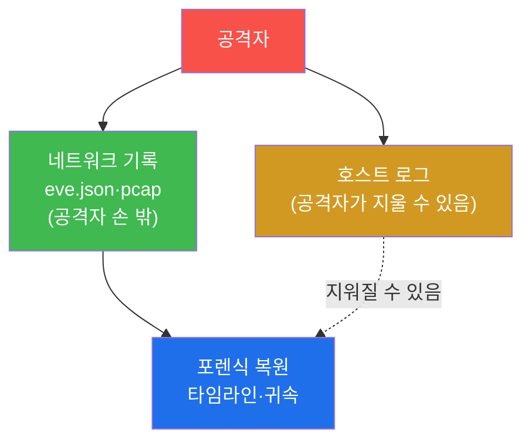
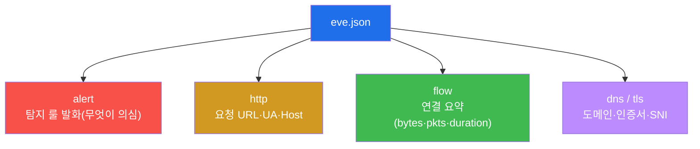
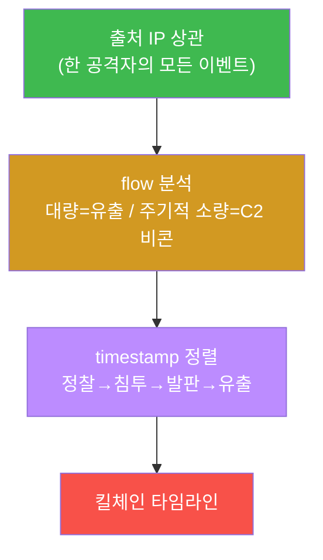

# SOC고급 W07 — 네트워크 포렌식: 흐름·패킷에서 공격을 복원한다

> **본 주차의 한 줄 요약**
>
> 호스트 헌팅(W06)이 "그 컴퓨터 안에서 무슨 일이 있었나"를 봤다면, **네트워크 포렌식**은 "선(線) 위로
> 무엇이 오갔나"를 본다. 공격자는 호스트의 로그는 지울 수 있어도 **이미 네트워크를 지나간 트래픽**은 되돌릴
> 수 없다. 본 주차에 학생은 공격을 흘려 Suricata **eve.json**에 흔적을 만들고, **event_type별 분석 → 출처
> 상관 → flow 분석 → 타임라인 복원**의 네트워크 포렌식 한 바퀴를 돈다.
>
> **분석가 한 줄 결론**: 네트워크는 거짓말하지 않는다. 출처 IP가 보존되면(el34는 SNAT 없음) 한 공격자의
> 스캔·침투·유출을 모두 한 IP로 묶어 **시간순 타임라인**으로 사건을 재구성할 수 있다.

---

## 학습 목표

본 주차 종료 시 학생은 다음 5가지를 **본인 손으로** 할 수 있어야 한다.

1. **네트워크 포렌식**이 호스트 포렌식과 무엇이 다른지(선 위의 트래픽 vs 호스트 내부)를 설명한다.
2. Suricata **eve.json**의 **event_type**(alert·http·flow·dns·tls)을 구분하고 각 포렌식 단서를 안다.
3. **출처 IP 상관**으로 한 공격자의 모든 이벤트를 묶는다.
4. **flow 이벤트**(연결 요약)로 데이터 유출(대량)·C2 비콘(주기적 소량)을 식별한다.
5. 이벤트를 **timestamp로 정렬해 공격 타임라인**을 복원하고, eve.json+pcap을 무결하게 보전한다.

---

## 0. 용어 해설

| 용어 | 영문 | 뜻 | 비유 |
|------|------|----|------|
| **네트워크 포렌식** | network forensics | 네트워크 트래픽에서 공격 흔적을 복원하는 분석 | 도로 CCTV로 도주 경로 추적 |
| **eve.json** | — | Suricata의 JSON 이벤트 로그(한 줄당 한 이벤트) | 사건 기록부 |
| **event_type** | — | 이벤트 종류(alert/http/flow/dns/tls/fileinfo) | 기록의 분류 |
| **flow** | — | 연결 단위 요약(바이트·패킷·기간) | 통화 기록(시간·용량) |
| **fileinfo** | — | 전송된 파일의 메타(이름·크기·해시) | 택배 송장 |
| **SNI** | Server Name Indication | TLS에서 접속하려는 도메인명(평문) | 봉투의 수신처 |
| **JA3** | — | TLS 핸드셰이크 지문(클라이언트 식별) | 발신자의 필적 |
| **출처 상관** | source correlation | 출처 IP로 이벤트를 한 행위자로 묶기 | 같은 차량번호로 행적 추적 |
| **타임라인** | timeline | 이벤트를 시간순 재구성한 사건 흐름 | 사건 일지 |
| **PCAP** | packet capture | 원본 패킷 캡처 파일(페이로드 포함) | 통화 녹음 원본 |
| **chain of custody** | — | 증거의 수집~보관 연속성 기록 | 압수물 인계 대장 |
| **C2 비콘** | beacon | 감염 호스트가 주기적으로 보내는 소량 신호 | 첩자의 정기 무전 |

> **헷갈리기 쉬운 한 쌍 — eve.json vs PCAP.** **eve.json**은 Suricata가 해석한 **메타데이터**(누가·언제·어떤
> 이벤트)이고, **PCAP**는 **원본 패킷**(페이로드 바이트까지)이다. eve.json은 빠르게 훑기 좋고, PCAP는 깊게
> 파기(정확히 무엇이 오갔나) 좋다. 포렌식은 eve로 좁히고 pcap으로 확정한다.

---

## 0.5 신입생 친화 핵심 개념

### 0.5.1 eve.json 한 눈에 — "한 줄 = 한 이벤트"

eve.json은 거대한 JSON 하나가 아니라, **한 줄에 JSON 객체 하나**씩 쌓이는 로그(JSON Lines)다. 그래서
`tail`·`grep`·`jq` 로 줄 단위 분석이 쉽다. 한 줄은 대략 이렇게 생겼다.

```json
{"timestamp":"2026-06-24T14:04:44+0000","src_ip":"10.20.30.202","event_type":"alert","alert":{"signature":"...SQLi..."}}
```

모든 줄에 `timestamp`·`src_ip`·`event_type` 이 있어, 이 세 필드로 **언제·누가·무엇**을 엮는다. (주의: 흐름이
폭주하면 `tail -1` 이 잘린 줄이라 `jq` 가 깨질 수 있어, `tail -n 3000` 처럼 넉넉히 보고 grep으로 좁힌다.)

### 0.5.2 event_type — 타입마다 다른 단서

같은 사건도 event_type마다 다른 조각을 보여준다. 포렌식은 이 조각들을 한 출처·시간으로 맞춘다.

| event_type | 단서 |
|------------|------|
| **alert** | 룰이 무엇을 의심했나(signature) |
| **http** | 요청 URL·User-Agent·Host |
| **flow** | 연결 요약(bytes·pkts·duration) |
| **dns** | 질의한 도메인 |
| **tls** | SNI(접속 도메인)·JA3(클라 지문)·인증서 |
| **fileinfo** | 전송 파일 이름·크기·해시 |

### 0.5.3 flow로 "유출"과 "비콘"을 모양으로 구분한다

flow 이벤트의 `bytes_toserver`·`bytes_toclient`·`duration` 으로 연결의 **모양**을 본다.

| 모양 | 의심 |
|------|------|
| 한 연결에 **대용량** 전송(bytes 큼) | 데이터 유출(exfiltration) |
| **소량**이 **일정 간격**으로 반복 | C2 비콘(주기적 신호) |
| 짧고 많은 연결, 여러 포트 | 포트 스캔 |

내용을 복호화하지 않고도 "얼마나·얼마 간격으로 오갔나"라는 **모양**만으로 위협 유형을 좁힐 수 있다 — 이게
flow 분석의 힘이다.

### 0.5.4 왜 같은 파일인데 해시가 매번 다른가

STEP 7에서 eve.json의 SHA-256을 구하는데, 다시 구하면 값이 달라진다. **버그가 아니다** — eve.json은 살아서
계속 append(추가 기록)되므로 파일 내용이 매 순간 바뀐다. 그래서 실제 증거 보전은 **수집 순간 파일을 복사·동결
한 뒤 그 사본의 해시**를 기록한다. 흐르는 로그의 해시는 "그 시점의 지문"일 뿐이다.

### 0.5.5 임의로 보이는 값들

| 값 | 무엇 | 규칙 |
|----|------|------|
| **10.20.30.202** | 공격자 출처 IP | el34 내부 발판(attacker), SNAT 없어 전 계층 보존 |
| **10.20.30.1** | 표적 | fw 게이트웨이(→ vhost로 DNAT) |
| **protocol/in_iface** | flow 필드 | Suricata가 기록한 연결 메타 |
| **마커(`eve_ready` 등)** | 단계 완료 신호 | 채점이 통과를 확인하는 약속 문자열 |

---

## 1. 왜 네트워크 포렌식인가

### 1.1 한 줄 답: 공격자도 지나간 트래픽은 못 지운다

침해 후 공격자는 호스트 로그를 지우고 흔적을 덮는다(안티포렌식). 그러나 **이미 네트워크를 지나간 트래픽**은
공격자의 손이 닿지 않는 곳(IPS·네트워크 센서)에 이미 기록됐다. 그래서 네트워크 포렌식은 안티포렌식에 강한
독립적 증거원이다.



### 1.2 왜 중요한가 — 귀속과 타임라인

침해 조사의 두 질문은 "누가(귀속)"와 "어떤 순서로(타임라인)"다. 네트워크 포렌식은 출처 IP 보존으로 귀속을,
timestamp 정렬로 타임라인을 제공한다. 이 둘이 사건 보고와 법적 증거의 뼈대다.

### 1.3 한계

암호화 트래픽(TLS)의 **내용**은 복호화 없이는 못 본다(메타데이터·SNI·JA3는 봄). 또 흐름이 폭주하면 http
이벤트가 드물 수 있어, eve를 충분히(tail 크게) 봐야 한다.

---

## 2. eve.json event_type별 단서



**실측 예 — 타입 분포.** 최근 eve.json에서 event_type별 건수를 센다.

```bash
tail -n 3000 /var/log/suricata/eve.json | grep -oE '"event_type":"[a-z]+"' | sort | uniq -c | head
```

```
     39 "event_type":"alert"
   1039 "event_type":"fileinfo"
    754 "event_type":"flow"
   1054 "event_type":"http"
    114 "event_type":"tls"
```

각 타입이 다른 단서를 준다(§0.5.2). 포렌식은 이들을 출처·시간으로 엮어 그림을 완성한다.

---

## 3. 출처 상관 → flow 분석 → 타임라인



**출처 상관 — 실측 예.** 출처 IP가 든 이벤트 수를 센다.

```bash
tail -n 3000 /var/log/suricata/eve.json | grep -c '10.20.30.202'
```

```
2955
```

el34는 SNAT를 안 해 출처 IP가 보존되므로, 이 한 IP(2955건)를 축으로 §2의 여러 event_type을 묶어 "한
공격자가 무엇을 했나"를 복원한다.

**flow 분석.** flow 이벤트의 `bytes_toserver`·`pkts`·`duration` 으로 연결 모양을 본다(§0.5.3) — 대량 전송
(유출)과 주기적 소량(비콘)을 구분한다. **타임라인.** 출처 이벤트의 timestamp를 시간순으로 뽑아 "14:04:06
스캔 → 14:04:44 SQLi → …"처럼 킬체인을 재구성한다 — 이것이 포렌식의 최종 산출물이다.

---

## 4. PCAP · 증거 보전

eve.json(메타)으로 좁힌 뒤, 필요하면 **PCAP**(원본 패킷)로 정확히 무엇이 오갔는지 확정한다(Suricata는 alert
시 pcap을 저장하도록 설정 가능).

**실측 예 — 증거 무결성 해시.**

```bash
H=$(sha256sum /var/log/suricata/eve.json | cut -c1-32); echo "증거 해시: $H"
```

모든 증거(로그·pcap)는 **SHA-256 해시 + 수집 시각**으로 무결성을 확보하고 **chain of custody**(누가 언제
수집·인계했는가)를 문서화해야 법적 증거능력을 가진다(soc 트랙 W09 IR 증적과 동일 원칙). 단 eve.json은 계속
append되므로(§0.5.4) 수집 순간 **동결한 사본**의 해시를 기록한다. 분석 도구는 Wireshark/tshark(pcap)·
zeek(흐름)·jq(eve.json)다.

---

## 5. 실습 안내 (8 미션)

각 미션을 **① 왜 하는가 / ② 무엇을 알 수 있는가 / ③ 결과 해석 / ④ 실전 활용** 4축으로 설명한다. 명령은
el34 호스트에서 `docker exec el34-ips`(eve.json)로. **인가된 실습 환경(el34)에서만**, 읽기 전용.

### STEP 1 — eve.json 접근
- **왜**: 네트워크 포렌식의 모든 분석이 eve.json에서 출발.
- **무엇을**: eve.json 파일 크기 조회.
- **해석**: 바이트 크기가 찍히면 살아서 쌓이는 중(`eve_ready`).
- **실전**: 분석 전 원천 로그 가용성 확인.

### STEP 2 — 공격 흐름 생성
- **왜**: 포렌식 연습엔 분석 대상이 필요.
- **무엇을**: 포트 스캔(flow/alert) + SQLi(http/alert)를 흘림.
- **해석**: 한 출처가 여러 event_type 흔적 생성(`traffic_generated`).
- **실전**: (실무에선 실제 침해 트래픽이 이 자리에 온다.)

### STEP 3 — event_type 분석
- **왜**: eve.json은 타입별로 다른 단서 — 무엇이 얼마나 쌓였나부터.
- **무엇을**: event_type별 건수 집계.
- **해석**: alert/http/flow/tls/fileinfo 분포(`types_analyzed`).
- **실전**: 타입별로 분석 도구·쿼리를 나눠 적용.

### STEP 4 — 출처 상관
- **왜**: 포렌식 핵심 질문 "누가" — 출처로 묶는다.
- **무엇을**: 출처 IP(10.20.30.202) 이벤트 건수.
- **해석**: 다수면 활발한 활동(`src_correlated`). 출처 보존이 귀속의 기반.
- **실전**: 한 IP를 축으로 전 event_type을 한 행위자로 묶기.

### STEP 5 — flow 분석
- **왜**: 연결 모양(bytes/duration)으로 유출·비콘을 식별.
- **무엇을**: flow 이벤트 한 건의 필드 형태.
- **해석**: timestamp·bytes·duration 확인(`flow_analyzed`). 대량=유출, 주기 소량=비콘.
- **실전**: jq로 bytes 큰 flow·일정 간격 flow를 골라냄.

### STEP 6 — 타임라인 복원
- **왜**: 포렌식 산출물은 "언제 무엇이"의 타임라인.
- **무엇을**: 출처 이벤트 timestamp 시간순 추출 + 총 건수.
- **해석**: 시간순 정렬이 타임라인 뼈대(`timeline_built`). 시각에 event_type을 붙여 킬체인.
- **실전**: 사건 재구성·법적 증거의 시간 축.

### STEP 7 — 증거 보전 (해시)
- **왜**: 포렌식 증거는 '변조 안 됨'을 증명해야 법적 효력.
- **무엇을**: eve.json SHA-256 해시.
- **해석**: 16진 해시 산출(`evidence_preserved`). append 로그라 수집 순간 사본을 동결해 해시(§0.5.4).
- **실전**: 해시+수집시각+인계 기록 = chain of custody.

### STEP 8 — 포렌식 보고서
- **왜**: 사건 보고는 집계 수치·증거 해시를 근거로.
- **무엇을**: 출처 건수·증거 해시를 인용한 보고서 골격.
- **해석**: 실측 인용(`netforensics_report_done`). 제출용은 STEP 3~7 + 사건 서사를 본문으로.
- **실전**: 법정·경영 보고용 증거 기반 사건 보고서.

---

## 6. 흔한 오해·관제자 노트

- **"호스트 로그만 보면 된다"** — 공격자가 호스트 로그를 지운다. 네트워크 기록은 손 밖이라 더 신뢰할 증거다.
- **"TLS면 아무것도 못 본다"** — 내용은 못 봐도 SNI·JA3·flow 모양은 본다. 메타만으로도 많은 걸 좁힌다.
- **"해시가 매번 달라 이상하다"** — eve.json은 append되는 살아있는 로그다. 사본을 동결해 해시해야 한다(§0.5.4).
- **"tail -1 | jq 가 깨진다"** — 마지막 줄이 잘렸을 수 있다. `tail -n 3000` 으로 넉넉히 보고 grep으로 좁힌다.

---

## 7. 다음 주차 (W08) 예고 — 메모리 포렌식

W07은 네트워크(선 위)였다. W08은 호스트의 **휘발성 메모리**에서 은닉 위협을 복원하는 메모리 포렌식
(/proc·프로세스 메모리)을 다룬다. 디스크·네트워크에 안 남는 파일리스 위협의 마지막 증거가 메모리에 있다.
