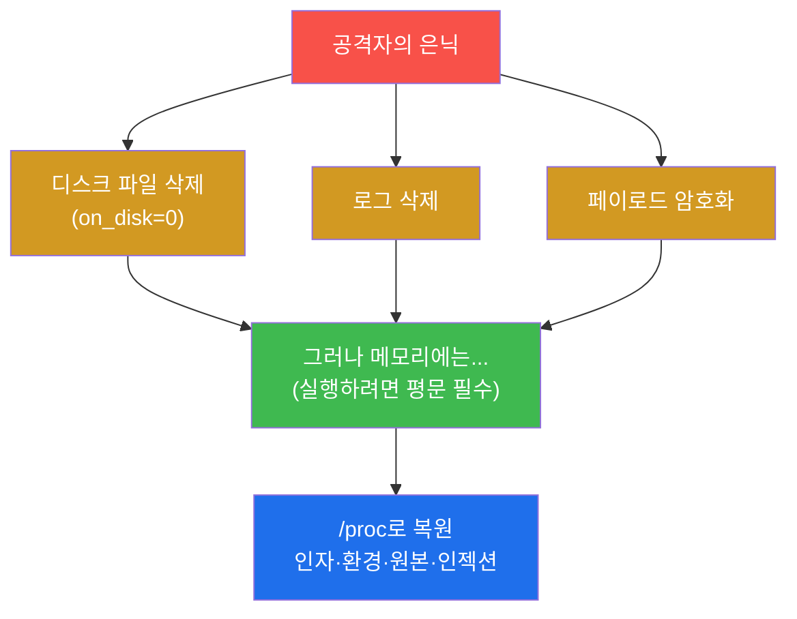
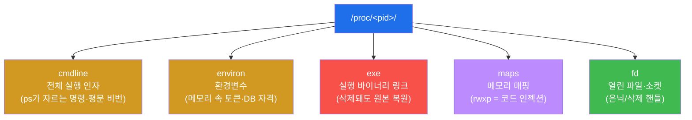
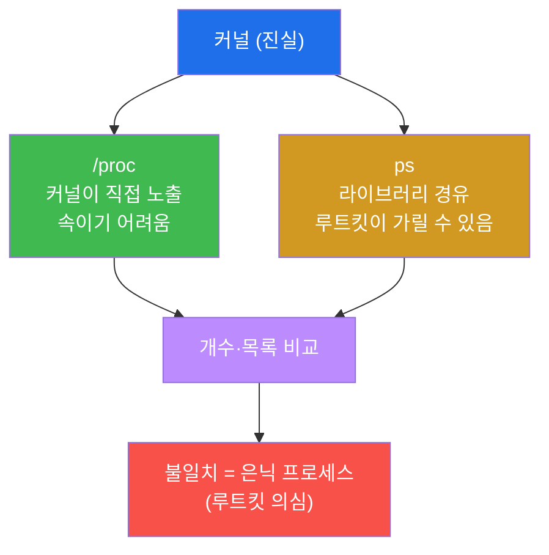
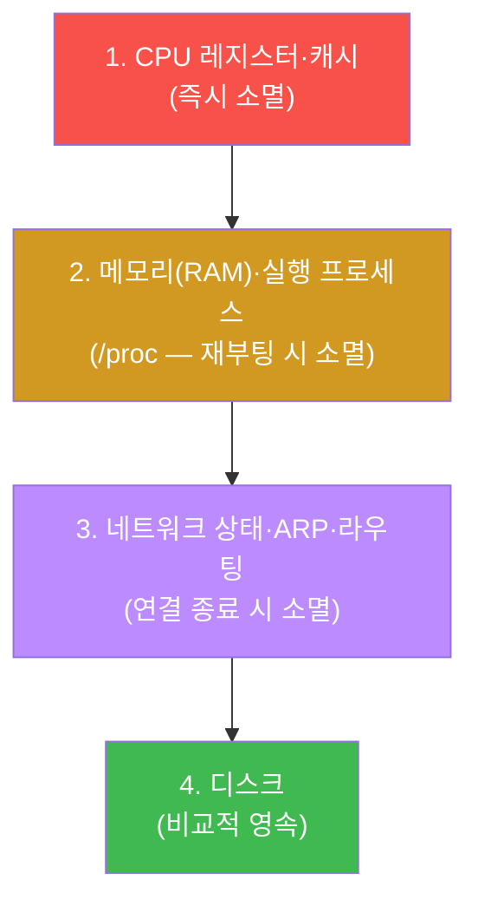

# SOC고급 W08 — 메모리 포렌식: 디스크에 없는 것을 메모리에서 복원한다

> **본 주차의 한 줄 요약**
>
> W06(헌팅)에서 우리는 `on_disk=0` — **디스크에서 지워졌는데도 돌고 있는** 프로세스를 만났다. 그때 "이건
> 의심스럽다"까지 갔다. 본 주차는 그 다음 질문에 답한다: **그래서 그게 정확히 뭔가?** 디스크에 파일이 없으니
> 평소처럼 파일을 분석할 수 없다. 답은 **메모리**에 있다. 리눅스 커널은 실행 중인 모든 프로세스를 **/proc**
> 가상 파일시스템으로 노출한다 — 인자(cmdline)·환경변수(environ)·메모리 매핑(maps)·열린 파일(fd), 그리고
> **삭제된 실행 파일의 원본(exe)** 까지. 본 주차에 학생은 /proc로 휘발성 메모리를 분석해 디스크에 없는
> 위협을 복원한다.
>
> **분석가 한 줄 결론**: 디스크는 공격자가 지울 수 있지만, **실행 중인 프로세스는 메모리에 자신을 드러낼
> 수밖에 없다.** 메모리 포렌식은 파일리스(fileless)·안티포렌식 위협에 맞서는 마지막 보루다.

---

## 학습 목표

본 주차 종료 시 학생은 다음 5가지를 **본인 손으로** 할 수 있어야 한다.

1. **메모리 포렌식**이 왜 필요한지(디스크에 없는 것이 메모리엔 있다)를 설명한다.
2. **/proc** 가상 파일시스템으로 프로세스 **cmdline·environ**(인자·환경 속 비밀)을 분석한다.
3. **/proc/<pid>/exe**로 **삭제된(on_disk=0) 실행 파일**을 메모리에서 복원한다.
4. **maps**(rwxp=코드 인젝션)·**fd**(은닉 핸들)·**/proc vs ps**(은닉 프로세스)를 분석한다.
5. **휘발성 순서(order of volatility, RFC 3227)** 에 따라 증거를 수집한다.

---

## 0. 용어 해설

| 용어 | 영문 | 뜻 | 비유 |
|------|------|----|------|
| **메모리 포렌식** | memory forensics | 휘발성 메모리(RAM)에서 증거를 복원하는 분석 | 현장의 즉석 사진 |
| **/proc** | — | 실행 중 프로세스를 파일로 노출하는 가상 FS | 살아있는 환자의 실시간 모니터 |
| **cmdline** | — | 프로세스 전체 실행 인자(/proc/pid/cmdline) | 입실 시 작성한 신청서 |
| **environ** | — | 프로세스 환경변수(/proc/pid/environ) | 주머니 속 소지품 |
| **exe** | — | 실행 중 바이너리 링크(/proc/pid/exe) | 본인 실물 |
| **maps** | — | 프로세스 메모리 매핑(/proc/pid/maps) | 방 배치도 |
| **fd** | file descriptor | 열린 파일·소켓 핸들(/proc/pid/fd) | 손에 든 물건 |
| **파일리스** | fileless | 디스크에 파일을 안 남기는 공격 | 흔적 없는 침입 |
| **휘발성 순서** | order of volatility | 사라지기 쉬운 증거부터 수집하는 원칙 | 녹기 전에 찍는 눈사람 |
| **루트킷** | rootkit | OS 도구의 눈을 가리는 은닉 기술 | 투명 망토 |

> **헷갈리기 쉬운 한 쌍 — 디스크 포렌식 vs 메모리 포렌식.** **디스크 포렌식**은 영속적이지만 공격자가
> 지우거나 변조할 수 있고, 암호화·파일리스 공격엔 무력하다. **메모리 포렌식**은 휘발성(재부팅하면 사라짐)
> 이지만, **실행 중인 것은 반드시 메모리에 펼쳐져 있다** — 복호화된 평문, 삭제된 바이너리, 인젝션된 코드까지.
> 둘은 상호 보완이며, 정교한 침해일수록 메모리가 결정적 증거를 쥔다.

---

## 1. 왜 메모리 포렌식인가

### 1.1 한 줄 답: 실행 중인 것은 숨을 수 없다

공격자는 디스크의 파일을 지우고(`on_disk=0`), 로그를 삭제하고, 페이로드를 암호화한다. 그러나 **코드가
실행되려면 반드시 메모리에 평문으로 펼쳐져야 한다.** CPU는 암호화된 코드를 실행하지 못한다. 그래서 디스크에서
사라진 멀웨어도, 암호화된 페이로드도, 메모리에는 분석 가능한 형태로 존재한다.

### 1.2 왜 중요한가 — 파일리스·안티포렌식 대응

현대 공격은 점점 파일리스(메모리에서만 실행)·안티포렌식(흔적 삭제)으로 간다. 디스크만 보면 "깨끗"하게
보인다. 메모리 포렌식만이 이 위협을 드러낸다.

### 1.3 한계

메모리는 **휘발성**이다 — 재부팅하면 사라진다(§4 휘발성 순서). 그래서 침해 의심 시스템은 **함부로
재부팅하면 안 되고**, 메모리를 먼저 떠야 한다. 또 메모리는 빠르게 변해 동일 스냅샷 재현이 어렵다.

---

## 2. /proc — 실행 중 프로세스의 창

리눅스 커널은 실행 중 프로세스를 `/proc/<pid>/` 아래에 파일처럼 노출한다. 별도 도구 없이 메모리 포렌식의
핵심 단서를 읽을 수 있다.

**cmdline·environ** — 디스크의 `.env`가 지워져도 프로세스 메모리엔 그 환경이 남는다. 평문 비밀번호·API
토큰·DB 자격이 여기서 복원된다. **exe** — W06에서 본 `on_disk=0` 프로세스의 `/proc/<pid>/exe`를 `cp`하면
삭제된 멀웨어 원본을 되살린다(`(deleted)` 표시). **maps** — `rwxp`(쓰기+실행 동시) 영역은 정상 프로세스엔
드물어 **코드 인젝션** 신호다. **fd** — 삭제된 파일도 핸들이 열려 있으면 `/proc/<pid>/fd`로 내용을 복원한다.

---

## 3. 은닉 프로세스 탐지 — /proc vs ps

루트킷은 `ps`·`ls` 같은 사용자공간 도구의 출력을 가로채 자신을 숨길 수 있다. 그러나 커널이 직접 노출하는
`/proc`은 더 속이기 어렵다. **`/proc`의 PID 목록과 `ps` 출력을 교차 비교**해 불일치가 나오면 은닉 프로세스를
의심한다. 이것이 "커널에 가까운 소스를 믿는다"는 포렌식의 원칙이다.

---

## 4. 휘발성 순서 (order of volatility, RFC 3227)

증거는 **사라지기 쉬운 순서대로** 수집해야 한다. 디스크를 먼저 만지작거리는 동안 메모리가 날아가면 안 된다.

원칙은 명확하다 — **휘발성이 높은 것부터.** 그래서 침해 의심 시스템은 **재부팅 전에 메모리를 먼저 확보**해야
하고(재부팅하면 /proc의 모든 증거가 소멸), 그 다음 네트워크 상태, 마지막에 디스크 이미지를 뜬다. 모든 증거는
W07·soc W09처럼 **SHA-256 해시 + 수집 시각**으로 chain of custody를 유지한다.

---

## 5. 실습 안내 (8 미션)

1. **/proc 접근**. 2. **cmdline**(인자). 3. **environ**(환경 속 비밀). 4. **exe 복원**(삭제 파일).
5. **maps/fd**(인젝션·은닉 핸들). 6. **/proc vs ps**(은닉 프로세스). 7. **휘발성 순서**. 8. **보고서**.

> 명령은 el34 호스트에서 `docker exec el34-web`(/proc)로. **인가된 실습 환경(el34)에서만**, 읽기 전용.

---

## 6. 다음 주차 (W09) 예고 — 악성코드 분석

W08은 메모리에서 위협을 복원했다. W09는 그렇게 복원한 검체를 **정적·동적으로 분석**하는 악성코드 분석
(YARA 심화·문자열·행위 관찰)을 다룬다.
