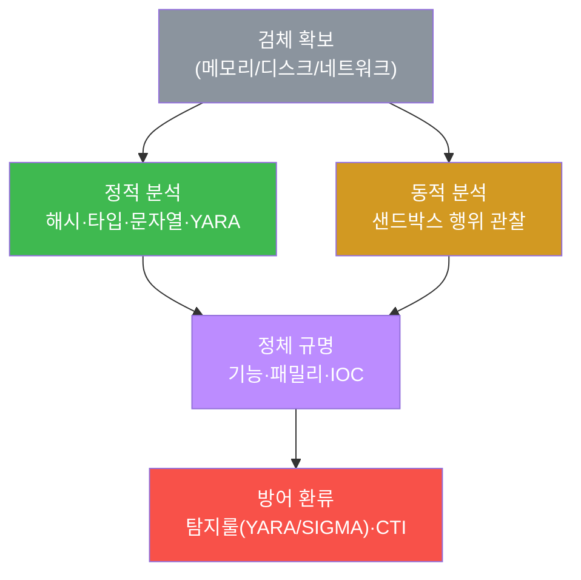
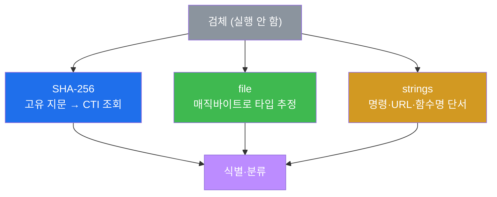
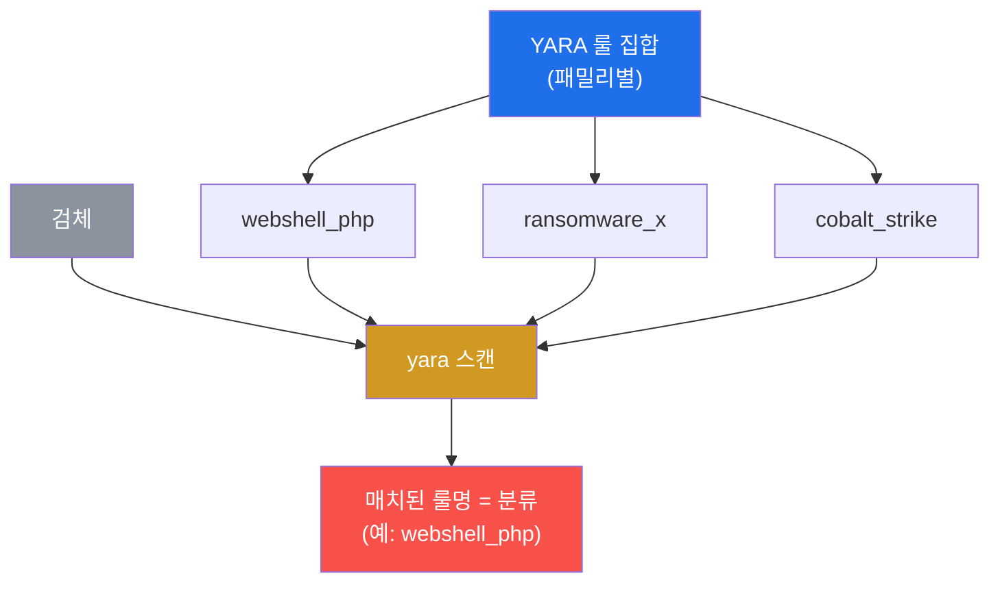

# SOC고급 W09 — 악성코드 분석: 검체의 정체를 규명한다

> **본 주차의 한 줄 요약**
>
> W08에서 우리는 디스크에 없는 멀웨어를 메모리에서 **복원**했다. 검체를 손에 쥐었다. 이제 질문은:
> **이게 정확히 뭘 하는 놈인가?** 본 주차는 검체를 안전하게 분석해 정체를 규명한다. **정적 분석**(실행하지
> 않고 — 해시·타입·문자열·YARA)으로 빠르게 윤곽을 잡고, **동적 분석**(격리 샌드박스에서 실행해 행위 관찰)으로
> 확증한다. 핵심 도구는 W04에서 배운 **YARA** — 이번엔 탐지를 넘어 **분류(어떤 패밀리인가)** 로 쓴다.
>
> **분석가 한 줄 결론**: 악성코드 분석의 목적은 호기심이 아니라 **방어**다. 분석에서 나온 IOC·룰을 탐지
> (YARA/SIGMA)와 인텔(CTI)로 환류해야, 같은 검체가 다시 오면 자동으로 막힌다. 분석은 환류로 완성된다.

---

## 학습 목표

본 주차 종료 시 학생은 다음 5가지를 **본인 손으로** 할 수 있어야 한다.

1. **정적 분석 vs 동적 분석**의 차이와 각각의 강·약점을 설명한다.
2. **해시(SHA-256)·파일 타입·문자열(strings)** 로 검체를 실행 없이 식별한다.
3. **YARA 다중 룰**로 검체를 **분류**(패밀리 식별)한다.
4. **동적 행위 지표**(파일·프로세스·네트워크 변화)를 안다.
5. **검체를 안전하게 취급**(격리·실행금지·암호화 보관)하고, 결과를 **IOC/룰로 환류**한다.

---

## 0. 용어 해설

| 용어 | 영문 | 뜻 | 비유 |
|------|------|----|------|
| **악성코드 분석** | malware analysis | 검체의 기능·의도를 규명하는 분석 | 압수 물증 감정 |
| **검체** | sample | 분석 대상 악성코드 파일 | 증거물 |
| **정적 분석** | static analysis | 실행하지 않고 분석 | X-ray로 내부 보기 |
| **동적 분석** | dynamic analysis | 격리 환경에서 실행해 행위 관찰 | 격리실에서 행동 관찰 |
| **SHA-256** | — | 검체의 고유 지문(해시) | 지문 |
| **strings** | — | 바이너리 속 읽을 수 있는 문자열 추출 | 문서 속 단어 발췌 |
| **YARA** | — | 패턴 룰로 검체를 탐지·분류 | 수배 전단 대조 |
| **패밀리** | family | 같은 계열의 악성코드 묶음 | 같은 조직의 범죄 |
| **샌드박스** | sandbox | 격리된 실행 관찰 환경 | 방탄 격리실 |
| **난독화** | obfuscation | 분석을 어렵게 만드는 변형 | 암호·위장 |

> **헷갈리기 쉬운 한 쌍 — 정적 vs 동적.** **정적**은 실행하지 않아 **안전·빠름**이지만, 난독화·암호화된
> 검체엔 약하다(겉만 보임). **동적**은 실제 실행해 **진짜 행위**를 보지만, 위험하고(반드시 격리망) 느리며
> 분석 회피(샌드박스 탐지)에 당할 수 있다. 그래서 **정적으로 좁히고 동적으로 확증**하는 병행이 정석이다.

---

## 1. 왜 악성코드를 분석하는가

### 1.1 한 줄 답: 막기 위해서다

악성코드 분석의 목적은 "신기해서"가 아니다. **이 검체가 무엇을 하는지 알아야 막을 수 있다.** 어떤 IOC를
차단할지(C2 IP·해시), 어떤 탐지룰을 쓸지(YARA·SIGMA), 어디까지 감염됐는지(행위 지표) — 모두 분석에서 나온다.

### 1.2 왜 중요한가 — 환류

분석은 일회성이 아니다. 도출한 해시·문자열·C2를 **CTI/CDB(W05)** 로, 행위 패턴을 **YARA/SIGMA(W03·W04)** 로
환류하면, 같은 패밀리가 다시 와도 자동으로 막힌다. 분석가 한 명의 작업이 조직 전체의 방어가 된다.

### 1.3 한계

정교한 멀웨어는 **난독화·암호화·샌드박스 탐지**로 분석을 방해한다. 그래서 정적·동적 병행과 메모리 분석
(W08 — 실행 시 평문이 메모리에 펼쳐짐)이 필요하다.

---

## 2. 정적 분석 — 실행하지 않고 안다

**SHA-256** — 검체의 고유 지문. 이 값으로 VirusTotal·OpenCTI를 조회하면 이미 알려진 검체인지 즉시 안다.
**file** — 매직바이트로 타입(ELF·PE·스크립트)을 추정한다. **strings** — 바이너리 속 사람이 읽을 수 있는
문자열을 뽑으면 `eval()`·`system()`·C2 URL·함수명 같은 행위 단서가 드러난다. 실습에서 모의 웹셸의 `eval(
$_POST`·`system($_GET`을 strings로 바로 잡아낸다.

---

## 3. YARA 분류 — 탐지를 넘어

W04에서 YARA를 **탐지**(악성/정상)로 썼다. 본 주차에선 **분류**로 확장한다 — 패밀리별 룰 집합으로 스캔하면,
**매치된 룰명이 곧 분류 결과**다.

한 검체가 여러 룰에 매치될 수도 있다(예: 패커 룰 + 패밀리 룰). 실습에서 webshell 룰 집합으로 검체를 스캔해
`webshell_php`로 분류한다. 분류가 되면 그 패밀리의 알려진 IOC·대응법을 바로 적용할 수 있다.

---

## 4. 동적 분석 · 안전한 검체 취급

**동적 분석.** 격리 샌드박스에서 검체를 **실행**해 실제 행위를 관찰한다 — 파일 생성/삭제(드롭퍼·지속성),
프로세스 생성/인젝션, **네트워크 연결**(C2·DNS·유출 — W07 흐름 분석과 직결). 난독화로 정적이 막힐 때 동적이
진짜 행위를 드러낸다.

**안전한 검체 취급(반드시).** 검체는 살아있는 위험물이다 — ① **격리망에서만** 다루고 ② **운영 시스템에서
절대 실행 금지** ③ 보관은 **암호화(zip+비밀번호)** ④ 공유는 **해시로** 한다. 본 실습은 모의 검체를 격리
디렉터리에서 분석만 하고 끝에 self-clean으로 삭제한다.

---

## 5. 실습 안내 (8 미션)

1. **도구 확인**(yara/strings). 2. **검체 준비**(격리). 3. **정적①**(해시·타입). 4. **정적②**(문자열).
5. **YARA 분류**. 6. **동적 행위 지표**. 7. **안전 취급·정리**. 8. **보고서**.

> 명령은 el34 호스트에서 `docker exec el34-attacker`로. **인가된 실습 환경(el34)에서만**, 검체는 모의·격리·
> self-clean. 운영 시스템에서 검체 실행 절대 금지.

---

## 6. 다음 주차 (W10) 예고 — SOAR(보안 오케스트레이션·자동 대응)

W09까지 탐지·분석을 손으로 했다. W10은 이 반복 대응을 **자동화**하는 SOAR(플레이북·오케스트레이션)로,
사람이 판단에 집중하도록 단순 대응을 기계에 넘기는 법을 다룬다.
