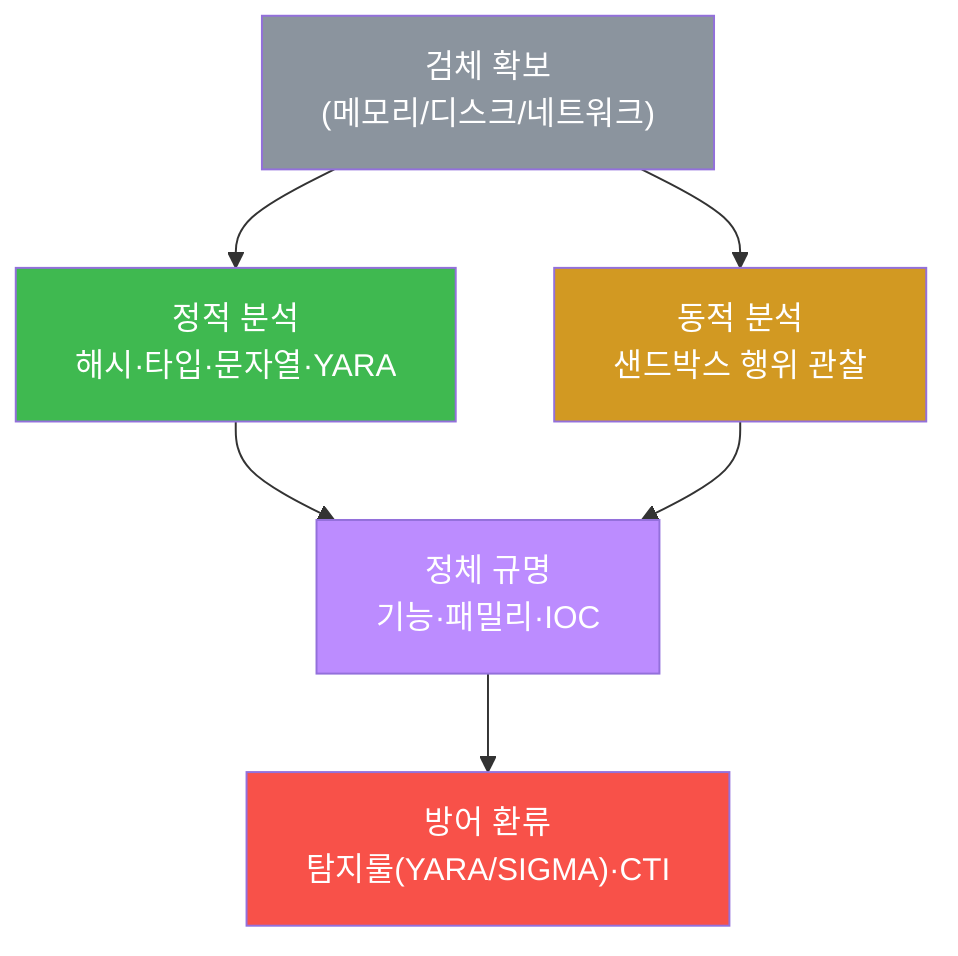
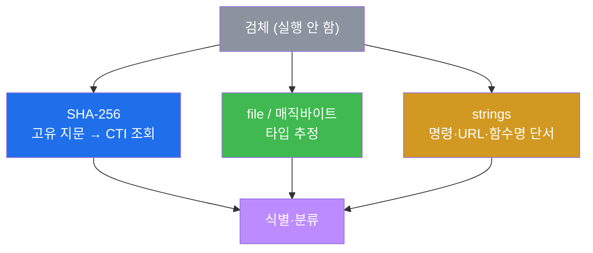
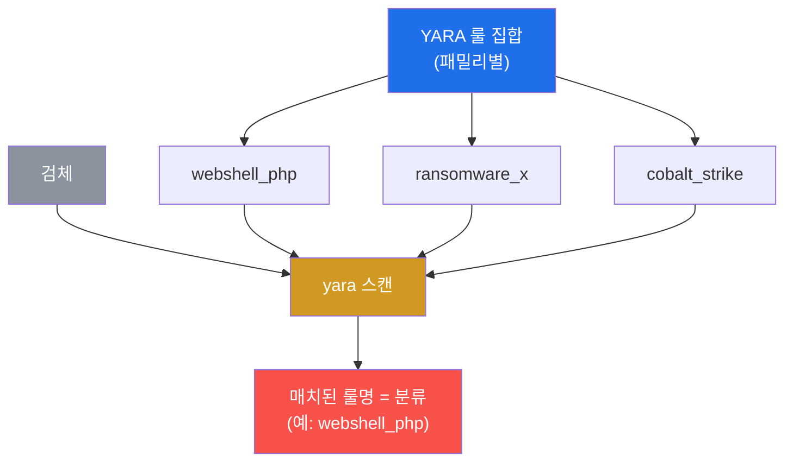

# SOC고급 W09 — 악성코드 분석: 검체의 정체를 규명한다

> **본 주차의 한 줄 요약**
>
> W08에서 우리는 디스크에 없는 멀웨어를 메모리에서 **복원**했다. 검체를 손에 쥐었다. 이제 질문은:
> **이게 정확히 뭘 하는 놈인가?** 본 주차는 검체를 안전하게 분석해 정체를 규명한다. **정적 분석**(실행하지
> 않고 — 해시·타입·문자열·YARA)으로 빠르게 윤곽을 잡고, **동적 분석**(격리 샌드박스에서 실행해 행위 관찰)으로
> 확증한다. 핵심 도구는 W04에서 배운 **YARA** — 이번엔 탐지를 넘어 **분류(어떤 패밀리인가)** 로 쓴다.
>
> **분석가 한 줄 결론**: 악성코드 분석의 목적은 호기심이 아니라 **방어**다. 분석에서 나온 IOC·룰을 탐지
> (YARA/SIGMA)와 인텔(CTI)로 환류해야, 같은 검체가 다시 오면 자동으로 막힌다. 분석은 환류로 완성된다.

---

## 학습 목표

본 주차 종료 시 학생은 다음 5가지를 **본인 손으로** 할 수 있어야 한다.

1. **정적 분석 vs 동적 분석**의 차이와 각각의 강·약점을 설명한다.
2. **해시(SHA-256)·파일 타입·문자열(strings)** 로 검체를 실행 없이 식별한다.
3. **YARA 다중 룰**로 검체를 **분류**(패밀리 식별)한다.
4. **동적 행위 지표**(파일·프로세스·네트워크 변화)를 안다.
5. **검체를 안전하게 취급**(격리·실행금지·암호화 보관)하고, 결과를 **IOC/룰로 환류**한다.

---

## 0. 용어 해설

| 용어 | 영문 | 뜻 | 비유 |
|------|------|----|------|
| **악성코드 분석** | malware analysis | 검체의 기능·의도를 규명하는 분석 | 압수 물증 감정 |
| **검체** | sample | 분석 대상 악성코드 파일 | 증거물 |
| **정적 분석** | static analysis | 실행하지 않고 분석 | X-ray로 내부 보기 |
| **동적 분석** | dynamic analysis | 격리 환경에서 실행해 행위 관찰 | 격리실에서 행동 관찰 |
| **SHA-256** | — | 검체의 고유 지문(해시) | 지문 |
| **매직바이트** | magic bytes | 파일 종류를 알려주는 앞부분 바이트 | 신분증 첫 글자 |
| **strings** | — | 바이너리 속 읽을 수 있는 문자열 추출 | 문서 속 단어 발췌 |
| **YARA** | — | 패턴 룰로 검체를 탐지·분류 | 수배 전단 대조 |
| **패밀리** | family | 같은 계열의 악성코드 묶음 | 같은 조직의 범죄 |
| **샌드박스** | sandbox | 격리된 실행 관찰 환경 | 방탄 격리실 |
| **C2** | command & control | 감염 호스트를 조종하는 외부 서버 | 범죄 조직 본부 |
| **난독화** | obfuscation | 분석을 어렵게 만드는 변형 | 암호·위장 |

> **헷갈리기 쉬운 한 쌍 — 정적 vs 동적.** **정적**은 실행하지 않아 **안전·빠름**이지만, 난독화·암호화된
> 검체엔 약하다(겉만 보임). **동적**은 실제 실행해 **진짜 행위**를 보지만, 위험하고(반드시 격리망) 느리며
> 분석 회피(샌드박스 탐지)에 당할 수 있다. 그래서 **정적으로 좁히고 동적으로 확증**하는 병행이 정석이다.

---

## 0.5 신입생 친화 핵심 개념

### 0.5.1 정적 vs 동적 — 언제 무엇을 쓰나

| | 정적 분석 | 동적 분석 |
|---|-----------|-----------|
| 검체를 | 실행 안 함 | 격리 샌드박스에서 실행 |
| 본다 | 해시·타입·문자열·구조 | 실제 파일/프로세스/네트워크 행위 |
| 안전 | 안전(실행 안 함) | 위험(반드시 격리망) |
| 속도 | 빠름 | 느림 |
| 약점 | 난독화·암호화엔 겉만 | 샌드박스 탐지 회피에 당함 |

정석은 **정적으로 좁히고 동적으로 확증**이다. 그리고 둘 다 막히면 메모리 분석(W08 — 실행 시 평문이 메모리에
펼쳐짐)으로 간다.

### 0.5.2 왜 SHA-256이 검체의 "지문"인가

해시는 파일 내용을 고정 길이 값으로 압축한 것이다. **같은 입력이면 항상 같은 해시, 1바이트만 달라도 완전히
다른 해시**가 나온다. 그래서 해시는 검체의 지문 역할을 한다 — 다른 조직에서 같은 해시가 나오면 **동일
검체**이고, 이 해시 한 줄을 VirusTotal·OpenCTI에 조회하면 이미 알려진 멀웨어인지 즉시 안다. 검체 원본을
주고받으면 위험하니, **공유는 해시로** 한다.

### 0.5.3 `file` 이 없으면 매직바이트로 — el34의 실제 함정

검체 타입은 보통 `file sample.bin` 으로 본다. 그런데 **el34-attacker에는 `file` 명령이 없다.** 그래서 실습
STEP 3은 `command -v file ... || { ... od -A n -t x1; }` 로, file이 없으면 **매직바이트**(파일 앞 8바이트)를
`od`(octal/hex dump)로 직접 떠서 타입을 추정한다. 예: `4D 5A`=PE(Windows), `7F 45 4C 46`=ELF(Linux),
`3C 3F 70 68 70`=`<?php`. **핵심 식별자는 어차피 해시**이므로 file이 없어도 분석은 진행된다.

### 0.5.4 안전한 검체 취급 4원칙 — 검체는 살아있는 위험물

검체를 만지는 순간 사고 위험이 따른다. 네 가지를 절대 지킨다.


실습은 모의 검체를 격리 디렉터리(`/tmp/mw09`)에서 분석만 하고 **절대 실행하지 않으며**, 끝에 self-clean으로
삭제한다.

### 0.5.5 임의로 보이는 이름들

| 이름 | 무엇 | 규칙 |
|------|------|------|
| **sample.bin / mw09** | 검체 파일·격리 폴더명 | 우리가 지은 분석용 이름 |
| **webshell_php** | YARA 룰명 = 분류 결과 | 매치된 룰명이 곧 패밀리 분류 |
| **`infected`** | 검체 zip 관례 비번 | 멀웨어 공유 업계 관행 |
| **마커(`analyst_ready` 등)** | 단계 완료 신호 | 채점이 통과를 확인하는 약속 문자열 |

---

## 1. 왜 악성코드를 분석하는가

### 1.1 한 줄 답: 막기 위해서다

악성코드 분석의 목적은 "신기해서"가 아니다. **이 검체가 무엇을 하는지 알아야 막을 수 있다.** 어떤 IOC를
차단할지(C2 IP·해시), 어떤 탐지룰을 쓸지(YARA·SIGMA), 어디까지 감염됐는지(행위 지표) — 모두 분석에서 나온다.



### 1.2 왜 중요한가 — 환류

분석은 일회성이 아니다. 도출한 해시·문자열·C2를 **CTI/CDB(W05)** 로, 행위 패턴을 **YARA/SIGMA(W03·W04)** 로
환류하면, 같은 패밀리가 다시 와도 자동으로 막힌다. 분석가 한 명의 작업이 조직 전체의 방어가 된다.

### 1.3 한계

정교한 멀웨어는 **난독화·암호화·샌드박스 탐지**로 분석을 방해한다. 그래서 정적·동적 병행과 메모리 분석
(W08 — 실행 시 평문이 메모리에 펼쳐짐)이 필요하다.

---

## 2. 정적 분석 — 실행하지 않고 안다



**실측 예 — 해시·문자열.** 검체를 실행하지 않고 지문과 행위 단서를 뽑는다.

```bash
sha256sum /tmp/mw09/sample.bin | cut -c1-16
strings /tmp/mw09/sample.bin | grep -iE "eval|system|php|cmd" | head
```

```
f8483772480bb2b8
<?php @eval($_POST['c']); system($_GET['cmd']); // malware
```

앞 16자 해시(`f8483772480bb2b8`)가 검체 지문 → CTI 조회용. strings에서 `@eval($_POST...)`·`system($_GET...)`
가 보이면 **외부 입력을 코드/명령으로 실행하는 PHP 웹셸**임이 드러난다. (file이 없으면 §0.5.3처럼 매직바이트로
타입 추정.)

---

## 3. YARA 분류 — 탐지를 넘어

W04에서 YARA를 **탐지**(악성/정상)로 썼다. 본 주차에선 **분류**로 확장한다 — 패밀리별 룰 집합으로 스캔하면,
**매치된 룰명이 곧 분류 결과**다.



**실측 예.** `eval($_POST` 또는 `system($_GET` 를 잡는 룰로 검체를 스캔한다.

```bash
yara /tmp/mw09/r.yar /tmp/mw09/sample.bin
```

```
webshell_php /tmp/mw09/sample.bin
```

`webshell_php <검체경로>` = 검체가 webshell_php 패밀리로 분류됐다는 뜻. 한 검체가 여러 룰에 매치될 수도 있다
(패커 룰 + 패밀리 룰). 룰을 여러 패밀리로 모으면, 매치되는 룰명이 곧 검체의 분류표다. 분류가 되면 그 패밀리의
알려진 IOC·대응법을 바로 적용한다.

---

## 4. 동적 분석 · 안전한 검체 취급

**동적 분석.** 격리 샌드박스에서 검체를 **실행**해 실제 행위를 관찰한다 — 파일 생성/삭제(드롭퍼·지속성),
프로세스 생성/인젝션, **네트워크 연결**(C2·DNS·유출 — W07 흐름 분석과 직결). 난독화로 정적이 막힐 때 동적이
진짜 행위를 드러낸다. 그 전에 정적으로 `system()`·`curl http://...` 같은 행위 지표를 미리 뽑아 "샌드박스에서
무엇을 관찰할지"를 정한다(실습 STEP 6).

**안전한 검체 취급(반드시).** §0.5.4의 4원칙 — ① 격리망에서만 ② 운영 시스템 실행 금지 ③ 암호화 보관 ④ 해시
공유. 본 실습은 모의 검체를 격리 디렉터리에서 분석만 하고 끝에 self-clean으로 삭제한다.

---

## 5. 실습 안내 (8 미션)

각 미션을 **① 왜 하는가 / ② 무엇을 알 수 있는가 / ③ 결과 해석 / ④ 실전 활용** 4축으로 설명한다. 명령은
el34 호스트에서 `docker exec el34-attacker` 로. **인가된 실습 환경(el34)에서만**, 검체는 모의·격리·self-clean.
**운영 시스템에서 검체 실행 절대 금지.**

### STEP 1 — 분석 도구 확인
- **왜**: 정적 분석은 실행 없이 분류·문자열·해시·타입으로 식별.
- **무엇을**: yara·strings·sha256sum 가용(file은 미설치 가능 → 필수 제외).
- **해석**: yara 버전 + `analyst_ready`. file 없으면 매직바이트로 대체(§0.5.3).
- **실전**: 분석 키트 점검 — 없는 도구는 대체법 준비.

### STEP 2 — 검체 준비 (격리)
- **왜**: 검체는 격리 공간에서만 다뤄야 실수로도 감염을 안 옮긴다.
- **무엇을**: 격리 디렉터리에 모의 웹셸을 base64로 생성(58바이트, 실행 금지).
- **해석**: 검체 생성(`sample_staged`). 절대 실행하지 않고 STEP 8에 self-clean.
- **실전**: 침해 호스트에서 건진 검체를 격리망으로 옮겨 분석.

### STEP 3 — 정적① 해시·타입
- **왜**: 해시는 지문(CTI 조회·공유), 타입은 '무엇인가'.
- **무엇을**: `sha256sum` + `file`(없으면 od 매직바이트).
- **해석**: 16자 해시가 검체 지문(`static_id_done`). 같은 입력=같은 해시.
- **실전**: 해시로 VirusTotal/OpenCTI 즉시 조회.

### STEP 4 — 정적② 문자열
- **왜**: 문자열은 가장 빠른 행위 단서.
- **무엇을**: `strings | grep eval|system|php|cmd`.
- **해석**: `@eval`·`system($_GET` = RCE 웹셸 의심(`strings_done`). 이게 YARA 시그니처.
- **실전**: 검체 속 C2 URL·함수명·명령을 빠르게 발췌.

### STEP 5 — YARA 분류
- **왜**: 매치된 룰명이 곧 '어느 패밀리인가'.
- **무엇을**: eval/system 잡는 룰로 스캔.
- **해석**: `webshell_php <검체>` = 분류 성공. 여러 패밀리 룰 모으면 분류표.
- **실전**: 분류되면 그 패밀리의 알려진 IOC·대응 즉시 적용.

### STEP 6 — 동적 행위 지표
- **왜**: 동적 관찰 전에 무엇을 볼지 정적으로 미리 뽑는다.
- **무엇을**: strings에서 `system|exec|curl|http` 지표.
- **해석**: 코드실행+네트워크 지표 발견(`behavior_analyzed`). 샌드박스에서 파일/프로세스/C2 관찰.
- **실전**: 행위 지표 → 샌드박스 관찰 항목 설계.

### STEP 7 — 안전 취급·정리
- **왜**: 검체는 분석 후 반드시 삭제 — 실수로도 감염 전파 금지.
- **무엇을**: 격리 디렉터리 self-clean.
- **해석**: 디렉터리 삭제(`handling_done`). 4원칙(격리/실행금지/암호화/해시공유).
- **실전**: 분석 종료 시 검체 안전 폐기 절차.

### STEP 8 — 분석 보고서
- **왜**: 검체 정체는 해시·시그니처·분류로 보고해야 신뢰·공유 가능.
- **무엇을**: 해시·의심 키워드 수를 인용한 보고서 골격.
- **해석**: 실측 인용(`malware_report_done`). 제출용은 STEP 3~6 + IOC를 본문으로, CTI(W05)로 환류.
- **실전**: 분석 결과를 조직 방어(룰·인텔)로 전환하는 산출물.

---

## 6. 흔한 오해·관제자 노트

- **"검체를 일단 실행해 보자"** — 운영 시스템에서 실행은 절대 금지. 격리 샌드박스에서만(§0.5.4).
- **"file이 없으니 분석 불가"** — 핵심 식별자는 해시다. 타입은 매직바이트(od)로 추정하면 된다(§0.5.3).
- **"정적이면 충분"** — 난독화·암호화는 정적을 막는다. 동적·메모리(W08)로 확증해야 한다.
- **"분석하고 끝"** — IOC·룰로 환류하지 않으면 같은 검체가 또 들어온다. 분석은 환류로 완성.

---

## 7. 다음 주차 (W10) 예고 — SOAR(보안 오케스트레이션·자동 대응)

W09까지 탐지·분석을 손으로 했다. W10은 이 반복 대응을 **자동화**하는 SOAR(플레이북·오케스트레이션)로,
사람이 판단에 집중하도록 단순 대응을 기계에 넘기는 법을 다룬다. 이번 주에 만든 분류·IOC가 SOAR 플레이북의
트리거가 된다.
