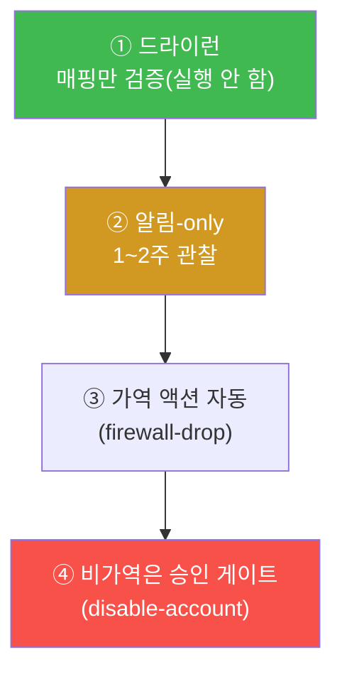
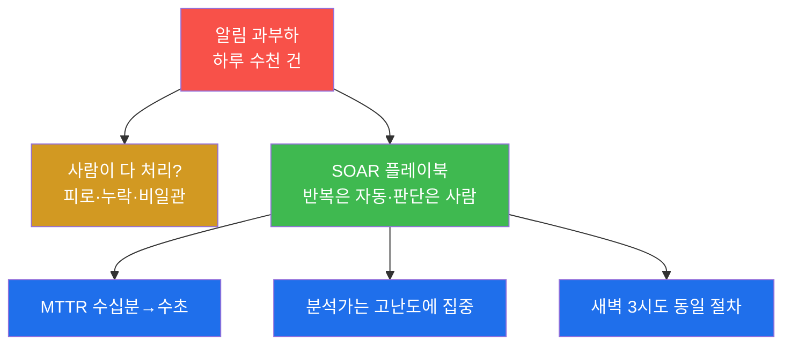
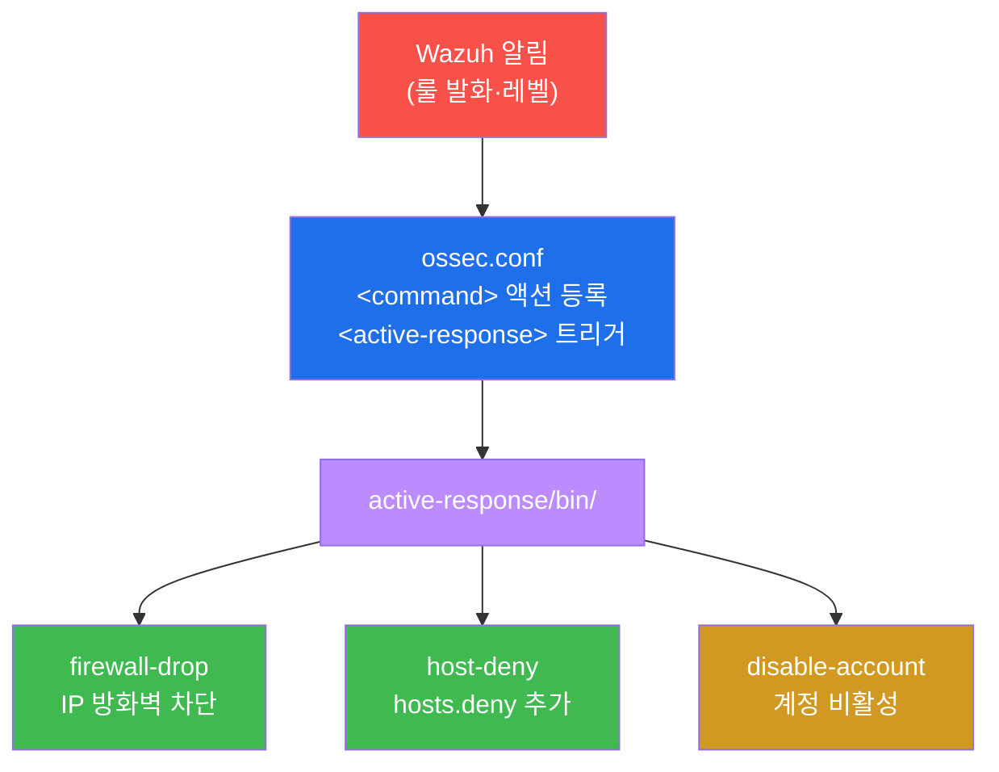
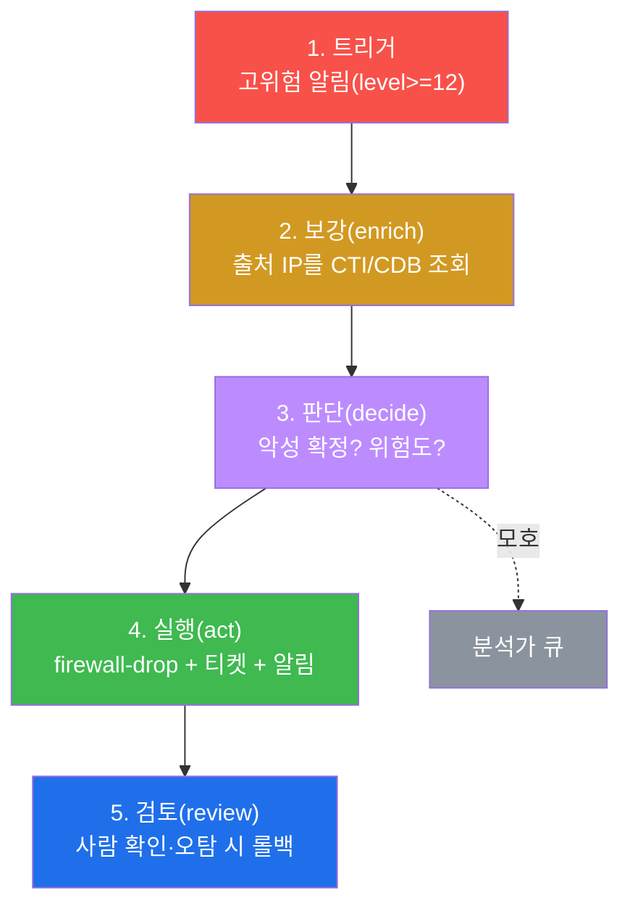
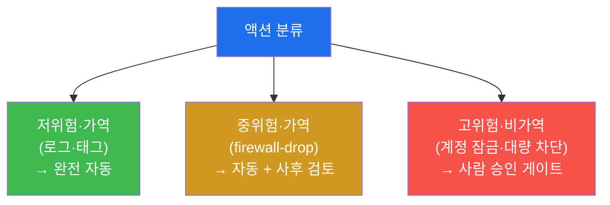

# SOC고급 W10 — SOAR: 반복 대응을 플레이북으로 자동화한다

> **본 주차의 한 줄 요약**
>
> W01~W09까지 우리는 탐지·헌팅·포렌식·분석을 **손으로** 했다. 그런데 SOC의 현실은 알림이 하루 수천 건이고
> 분석가는 몇 명뿐이다 — 똑같은 대응을 사람이 반복하면 피로가 쌓이고, 새벽 3시의 대응은 정오의 대응과
> 달라진다. **SOAR(Security Orchestration, Automation and Response)** 는 이 반복을 **플레이북**(표준 대응
> 절차를 코드화)으로 자동화한다. 본 주차에 학생은 el34에 실가동 중인 **Wazuh active-response**
> (firewall-drop·host-deny·disable-account)를 SOAR 실행 엔진으로 확인하고, **트리거→보강→판단→실행→검토**의
> 플레이북을 설계한다.
>
> **분석가 한 줄 결론**: SOAR의 목적은 사람을 **대체**하는 게 아니라 **증폭**하는 것이다 — 단순 반복은
> 기계에 넘기고, 사람은 판단에 집중한다. 그래서 고위험·비가역 액션엔 반드시 **사람 승인 게이트**를 둔다.

---

## 학습 목표

본 주차 종료 시 학생은 다음 5가지를 **본인 손으로** 할 수 있어야 한다.

1. **SOAR의 가치**(반복 대응 자동화·MTTR 단축·일관성)와 한계를 설명한다.
2. el34의 **Wazuh active-response**를 SOAR 실행 엔진으로 확인하고 액션 카탈로그를 안다.
3. ossec.conf의 **command/active-response**로 알림→자동 대응이 연결되는 원리를 안다.
4. **플레이북 5단계**(트리거→보강→판단→실행→검토)를 설계한다.
5. **사람 승인 게이트(human-in-the-loop)** 의 필요성과, MTTR 등 효과 지표를 설명한다.

---

## 0. 용어 해설

| 용어 | 영문 | 뜻 | 비유 |
|------|------|----|------|
| **SOAR** | Security Orchestration, Automation, Response | 보안 대응을 오케스트레이션·자동화 | 자동화 공장 라인 |
| **플레이북** | playbook | 한 사건 유형의 표준 대응을 코드화 | 화재 대피 매뉴얼 |
| **오케스트레이션** | orchestration | 여러 도구·액션을 엮어 흐름화 | 오케스트라 지휘 |
| **active-response** | AR | Wazuh의 알림 기반 자동 액션 | 경보 연동 자동 셔터 |
| **firewall-drop** | — | 공격 IP를 방화벽 차단하는 액션 | 정문 자동 잠금 |
| **host-deny** | — | hosts.deny에 IP를 추가하는 액션 | 출입 금지 명단 등록 |
| **disable-account** | — | 계정을 비활성화하는 액션 | 사원증 정지 |
| **보강** | enrichment | 알림에 CTI 등 맥락 추가 | 신원 조회 |
| **드라이런** | dry-run | 실제 영향 없이 매핑만 검증 | 소방 훈련 |
| **HITL** | human-in-the-loop | 사람 승인 게이트 | 최종 결재 |
| **MTTR** | Mean Time To Respond | 평균 대응 시간 | 출동 소요 시간 |
| **가역성** | reversibility | 액션을 되돌릴 수 있는 정도 | 연필 vs 잉크 |

> **헷갈리기 쉬운 한 쌍 — SIEM vs SOAR.** **SIEM**(W01~W08의 Wazuh)은 로그를 모아 **탐지·경보**한다 — "무슨
> 일이 일어났다"까지. **SOAR**는 그 경보를 받아 **대응을 실행**한다 — "그래서 이렇게 조치했다"까지. SIEM이
> 눈이라면 SOAR는 손이다. el34에선 Wazuh 하나가 SIEM(룰·알림)과 SOAR(active-response) 역할을 겸한다.

---

## 0.5 핵심 개념

### 0.5.1 Wazuh active-response 배선 — 알림이 어떻게 액션이 되나

el34의 SOAR는 Wazuh의 `ossec.conf` 안에서 두 조각으로 배선된다.

```xml
<command>                              <!-- ① 액션을 '등록' -->
  <name>firewall-drop</name>
  <executable>firewall-drop</executable>
</command>
<active-response>                      <!-- ② 언제 그 액션을 쓸지 '트리거' -->
  <command>firewall-drop</command>
  <level>12</level>                    <!-- level 12 이상 알림이면 -->
  <timeout>600</timeout>               <!-- 600초 차단 후 자동 해제 -->
</active-response>
```

읽는 법: "`<command>` 가 `firewall-drop` 액션을 등록하고, `<active-response>` 가 'level 12 이상 알림이 뜨면
이 액션을 600초간 실행'으로 묶는다." 알림(SIEM) → 트리거(level) → 액션(AR) 이 자동으로 이어진다.

### 0.5.2 가역 vs 비가역 액션 — 무엇을 자동화해도 되나

같은 자동 대응도 **되돌릴 수 있는가**에 따라 위험이 다르다.

| 액션 | 가역성 | 자동화 정책 |
|------|--------|-------------|
| 로그·태그 추가 | 완전 가역 | 완전 자동 |
| **firewall-drop** | 가역(timeout 후 자동 해제) | 자동 + 사후 검토 |
| host-deny | 가역(목록에서 제거) | 자동 + 사후 검토 |
| **disable-account** | 비가역적 영향(업무 중단) | **사람 승인 게이트(HITL)** |

핵심: 오탐이 났을 때 **firewall-drop은 10분 뒤 풀리지만, 계정 잠금은 사람이 풀 때까지 업무가 멈춘다.**
그래서 비가역·고영향일수록 사람 승인을 거친다.

### 0.5.3 왜 드라이런·"알림-only" 부터 시작하나

자동 차단을 처음부터 전면 켜면, 오탐 한 번에 **정상 사용자/서버를 막아 업무를 마비**시킨다. 그래서 운영
전환은 단계적으로 한다.



실습은 전 단계가 **드라이런/읽기 전용**이다 — active-response 설정을 보기만 하고 실제 차단은 발동하지 않는다
(공유 인프라 보존).

### 0.5.4 임의로 보이는 이름들

| 이름 | 무엇 | 규칙 |
|------|------|------|
| **firewall-drop/host-deny/disable-account** | AR 액션 스크립트명 | Wazuh 기본 active-response 액션 |
| **level 12** | 트리거 임계 | Wazuh 룰 레벨(고위험, W01 §0.5.6) |
| **timeout 600** | 차단 지속(초) | 600초=10분 후 자동 해제(가역성) |
| **마커(`soar_ready` 등)** | 단계 완료 신호 | 채점이 통과를 확인하는 약속 문자열 |

---

## 1. 왜 자동화인가

### 1.1 한 줄 답: 사람은 반복에 지치고, 기계는 지치지 않는다

SOC의 적은 공격자만이 아니다 — **알림 과부하**도 적이다. 하루 수천 건의 알림을 사람이 일일이 처리하면
중요한 신호를 놓치고(알림 피로), 같은 대응도 사람·시간대마다 달라진다(비일관성). SOAR는 **반복 가능한
대응**을 플레이북으로 자동화해 사람을 단순 노동에서 해방한다.



### 1.2 왜 중요한가 — 속도와 일관성

침해는 분 단위로 번진다. 사람이 알림을 보고 판단해 차단하는 수십 분 동안 공격은 측면 이동한다. SOAR는
악성이 확실한 경우 **수 초 내 자동 차단**해 피해를 끊는다. 그리고 플레이북은 언제 실행해도 동일하다.

### 1.3 한계 — 그래서 사람 게이트

자동화의 위험은 **오탐 시 정상을 차단**하는 것이다(정상 IP 차단 → 업무 마비). 그래서 고위험·비가역 액션엔
반드시 사람 승인 게이트를 둔다(§4). SOAR는 만능이 아니라 **잘 설계된 플레이북** 만큼만 똑똑하다.

---

## 2. el34의 SOAR 엔진 — Wazuh active-response

el34의 Wazuh는 SIEM(탐지)뿐 아니라 **active-response**로 SOAR 실행까지 한다. `/var/ossec/active-response/bin/`에
실제 액션 스크립트가 있다.



**실측 예 — 액션 카탈로그.** SOAR가 호출할 실제 액션을 본다.

```bash
ls /var/ossec/active-response/bin/ | grep -E "firewall-drop|host-deny|disable-account"
```

```
default-firewall-drop
disable-account
firewall-drop
host-deny
```

`<command>` 가 액션을 등록하고(§0.5.1), `<active-response>` 가 "어떤 룰/레벨에서 어떤 액션을, 얼마 동안"을
정의한다. 알림이 트리거 조건을 만족하면 해당 액션이 자동 실행된다 — 플레이북의 "실행" 단계다.

> **실습 안전.** 본 실습은 active-response 설정을 **읽기만** 한다. firewall-drop을 실제 발동하면 IP가
> 차단되므로, 학생은 매핑을 **드라이런**(실습 5)으로만 검증한다.

---

## 3. 플레이북 5단계

플레이북은 한 사건 유형의 표준 대응을 코드로 박제한 것이다.



예: "SSH 무차별 대입 알림(트리거) → CTI로 출처 평판 조회(보강) → 고위험 판단 → firewall-drop 실행 → 분석가
사후 검토". **보강**은 W05 CTI와 직결된다 — 출처 IP를 CDB list로 조회해 "알려진 악성인가"를 자동 판단한다.
**판단**은 악성+고위험이면 자동 실행으로, 모호하면 분석가 큐로 분기한다. **실행**은 차단뿐 아니라 티켓 생성·
알림까지 오케스트레이션한다. **검토**는 사람이 결과를 확인하고 오탐 시 롤백한다.

---

## 4. 사람 검토 · MTTR 측정

**사람 승인 게이트(HITL).** 모든 걸 자동화하면 오탐 한 번이 재앙이 된다. 액션의 **위험도·가역성**(§0.5.2)에
따라 게이트를 둔다.



**MTTR 측정.** SOAR의 가치는 숫자로 입증한다 — MTTR(평균 대응 시간) 단축(수십 분→수 초), 자동화율(자동
종결 비율) 상승, 일관성. 실습 STEP 7은 최근 알림량(예 1838건)을 집계해 "수동이면 MTTR×1838의 부하"를
정량화한다 — 이 지표로 플레이북을 개선하는 순환이 soc 트랙 W14 운영 지표와 이어진다.

---

## 5. 실습 안내 (8 미션)

각 미션을 **① 왜 하는가 / ② 무엇을 알 수 있는가 / ③ 결과 해석 / ④ 실전 활용** 4축으로 설명한다. 명령은
el34 호스트에서 `docker exec el34-siem` 로. **인가된 실습 환경(el34)에서만**, active-response는 읽기 전용
(실차단 미발동·드라이런).

### STEP 1 — SOAR 엔진 확인
- **왜**: el34의 SOAR 실행 엔진은 Wazuh active-response.
- **무엇을**: `active-response/bin/` 액션 스크립트 개수.
- **해석**: 액션이 여럿이면 엔진 준비(`soar_ready`). '알림이 울리면 실행할 손'.
- **실전**: 자동 대응 가용 액션 인벤토리.

### STEP 2 — 액션 카탈로그
- **왜**: 플레이북 '실행'이 이 액션들을 호출.
- **무엇을**: firewall-drop·host-deny·disable-account 존재.
- **해석**: IP 차단·hosts.deny·계정 잠금 액션 확인.
- **실전**: 사건 유형별로 어떤 액션을 쓸지 매핑.

### STEP 3 — command 등록 (연결고리)
- **왜**: `<command>` 등록 + `<active-response>` 트리거가 알림→액션 배선(§0.5.1).
- **무엇을**: ossec.conf의 `<name>` 액션들.
- **해석**: command 등록 확인(`triggers_defined`). level 트리거로 묶을 수 있음.
- **실전**: 자동화 배선 점검(읽기만, 실차단 미발동).

### STEP 4 — 플레이북 설계
- **왜**: 5단계 표준 대응의 '실행' 칸에 넣을 액션이 있어야 한다.
- **무엇을**: AR 액션 목록·개수 = 실행 재료.
- **해석**: 액션 카탈로그 확인(`playbook_designed`). 트리거→보강→판단→실행→검토.
- **실전**: 사건 유형별 플레이북을 코드화.

### STEP 5 — 드라이런
- **왜**: 자동 차단을 처음부터 켜면 오차단 사고(§0.5.3).
- **무엇을**: ossec.conf 트리거→액션 매핑만 확인(실행 안 함).
- **해석**: 매핑 존재 확인(`dryrun_done`). 알림-only→단계적 활성.
- **실전**: 운영 전환 시 1~2주 관찰 후 차단 활성.

### STEP 6 — HITL (사람 승인)
- **왜**: 비가역·고영향 액션은 오작동이 큰 사고.
- **무엇을**: 비가역 액션(disable-account) 식별.
- **해석**: firewall-drop=가역→자동+검토, disable-account=비가역→승인 게이트(`human_loop_done`).
- **실전**: 위험도·가역성별 자동화 정책 차등.

### STEP 7 — MTTR 측정
- **왜**: SOAR 가치는 MTTR 단축·일관성으로 입증.
- **무엇을**: 최근 알림량 집계로 수동 대응 부하 정량화.
- **해석**: 알림 N건 = MTTR×N 부하(`metrics_done`). 자동화로 수십분→수초.
- **실전**: 자동화 ROI를 숫자로 경영 보고.

### STEP 8 — SOAR 보고서
- **왜**: 도입 효과도 실측을 근거로 보고해야 설득력.
- **무엇을**: AR 액션 수·알림량을 인용한 보고서 골격.
- **해석**: 실측 인용(`soar_report_done`). 제출용은 STEP 2~7 + 단계적 활성 계획을 본문으로.
- **실전**: 플레이북·MTTR·HITL을 묶은 운영 보고.

---

## 6. 흔한 오해·블루팀 노트

- **"SOAR가 사람을 대체한다"** — 아니다. 반복을 기계에, 판단을 사람에게. 자동화는 **증폭**이다.
- **"다 자동 차단하면 빠르다"** — 오탐 한 번이 업무 마비를 부른다. 비가역 액션엔 사람 승인 게이트(§0.5.2).
- **"바로 운영에 켜자"** — 드라이런→알림-only→가역 자동→비가역 승인의 단계를 밟아야 안전하다(§0.5.3).
- **"SIEM이 SOAR다"** — SIEM은 탐지(눈), SOAR는 실행(손). el34는 Wazuh가 둘을 겸할 뿐 역할은 다르다.

---

## 7. 다음 주차 (W11) 예고 — 인시던트 대응(IR)

W10은 자동 대응(SOAR)이었다. W11은 그 위 계층 — 실제 침해 사건이 터졌을 때의 **인시던트 대응(IR)** 전체
수명주기(준비·식별·격리·근절·복구·교훈)를 다룬다. SOAR의 자동 차단이 IR의 '격리' 단계를 어떻게 가속하는지로
이어진다.
