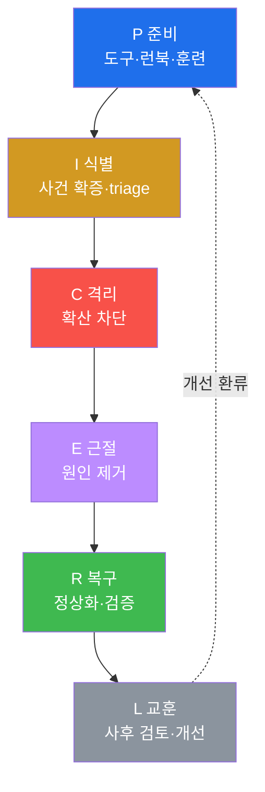
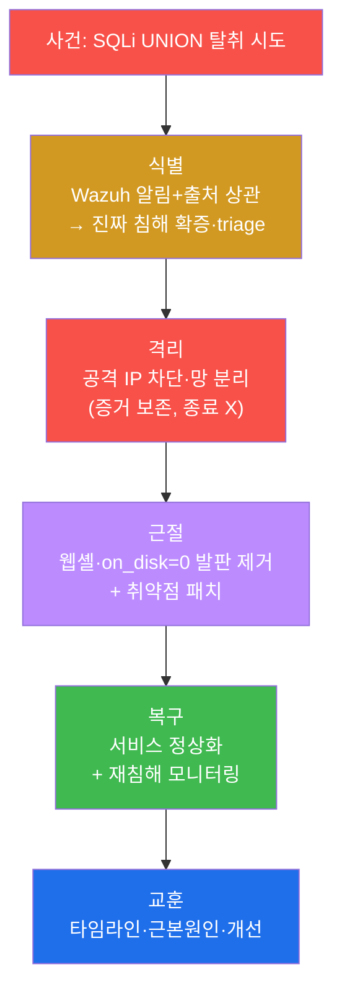
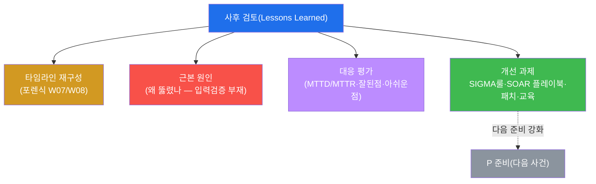

# SOC고급 W11 — 인시던트 대응(IR): 침해 사건의 전 수명주기를 지휘한다

> **본 주차의 한 줄 요약**
>
> W10의 SOAR가 "자동으로 즉시 막는" 손이었다면, **인시던트 대응(IR)** 은 그 위에서 사건 전체를 지휘하는
> 머리다. 실제 침해가 터지면 자동 차단 하나로 끝나지 않는다 — 사건이 진짜인지 확증하고, 확산을 멈추고,
> 뿌리를 뽑고, 안전하게 복구하고, 다시는 같은 일이 없도록 배운다. 본 주차는 **NIST 800-61 / PICERL**
> (Preparation·Identification·Containment·Eradication·Recovery·Lessons) 6단계를 el34의 실제 사건으로 한 바퀴
> 돈다 — 지금까지 배운 탐지(Wazuh)·포렌식(W07/W08)·분석(W09)·SOAR(W10)가 모두 여기서 하나로 엮인다.
>
> **대응 책임자 한 줄 결론**: IR은 기술이 아니라 **순환하는 절차**다. 사건 대응의 질은 사건이 터진 뒤가
> 아니라 **준비(P)** 에서 결정되고, 교훈(L)이 다음 사건의 준비를 강화한다 — IR은 끝나지 않고 돈다.

---

## 학습 목표

본 주차 종료 시 학생은 다음 5가지를 **본인 손으로** 할 수 있어야 한다.

1. **PICERL 6단계**의 각 목적과 순서를 설명한다.
2. **식별(triage)** — 알림을 증거로 확증하고 심각도·범위를 판단한다.
3. **격리**의 원칙(증거 보존 우선, 종료보다 격리)과 단기/장기 격리를 안다.
4. **근절**(증상 아닌 원인 제거)과 **복구**(검증된 정상화)를 수행한다.
5. **교훈(사후 검토)** 으로 타임라인·근본원인·개선 과제를 도출해 재발을 막는다.

---

## 강의 시간 배분 (총 3시간 40분)

| 시간        | 내용                                                                | 유형      |
|-------------|---------------------------------------------------------------------|-----------|
| 0:00–0:25   | 이론 — IR이란, 왜 절차인가, SOAR와의 관계                          | 강의      |
| 0:25–0:55   | 이론 — PICERL 6단계 상세                                            | 강의      |
| 0:55–1:05   | 휴식                                                                 | —         |
| 1:05–1:35   | 이론 — 증거 보존·타임라인·교훈                                       | 강의/토론 |
| 1:35–2:10   | 실습 — 준비·사건 발생·식별                                           | 실습      |
| 2:10–2:40   | 실습 — 격리·근절·복구                                                | 실습      |
| 2:40–2:50   | 휴식                                                                 | —         |
| 2:50–3:20   | 실습 — 교훈 + 보고서                                                 | 실습      |
| 3:20–3:40   | 정리 + 다음 주차 예고                                                | 정리      |

---

## 0. 용어 해설

| 용어 | 영문 | 뜻 | 비유 |
|------|------|----|------|
| **인시던트 대응** | Incident Response | 침해 사건의 전 수명주기 대응 | 응급 의료 프로토콜 |
| **PICERL** | — | 준비·식별·격리·근절·복구·교훈 6단계 | 재난 대응 단계 |
| **triage** | — | 사건 심각도·우선순위 분류 | 응급실 중증도 분류 |
| **격리** | containment | 확산을 멈추는 단계 | 지혈 |
| **근절** | eradication | 원인을 제거하는 단계 | 종양 제거 |
| **복구** | recovery | 정상화·재침해 검증 단계 | 재활·경과 관찰 |
| **교훈** | lessons learned | 사후 검토로 개선 도출 | 사고 보고서 |
| **MTTD/MTTR** | — | 평균 탐지/대응 시간 | 신고~출동 시간 |
| **chain of custody** | — | 증거 수집~보관 연속성 | 압수물 인계 대장 |
| **런북** | runbook | 사건 유형별 대응 절차서 | 비상 대응 매뉴얼 |

> **헷갈리기 쉬운 한 쌍 — 격리(C) vs 근절(E).** **격리**는 "지금 당장 피를 멈추는" 응급 조치다 — 공격
> IP를 차단하고 감염 호스트를 망에서 분리한다(아직 원인은 그대로). **근절**은 "병의 뿌리를 뽑는" 근본
> 치료다 — 웹셸을 지우고 백도어를 없애고 취약점을 패치한다. 순서가 중요하다: **먼저 격리로 확산을 멈춘 뒤**
> 근절한다. 격리 없이 근절부터 하면 그 사이 공격이 번진다.

---

## 1. IR이란 — 사건을 지휘하는 절차

### 1.1 한 줄 답: 혼란을 절차로 다스린다

침해가 터지면 SOC는 혼란에 빠지기 쉽다 — 무엇부터? 누가? 어디까지? IR은 이 혼란을 **정해진 순서(PICERL)**
로 다스린다. 각 단계는 명확한 목적이 있고, 앞 단계가 뒤 단계의 전제가 된다.

### 1.2 왜 중요한가 — 준비가 결과를 가른다

사건이 터진 뒤 도구를 깔고 절차를 정하면 이미 늦다. IR의 질은 **준비(P)** 에서 결정된다 — 탐지가 켜져
있는가, 증거가 수집되는가, 런북이 있는가, 팀이 훈련됐는가. 그래서 PICERL은 "사건 대응"이 아니라 "사건 전
준비"부터 시작한다.

### 1.3 SOAR와의 관계

SOAR(W10)는 IR의 일부를 자동화한다 — 식별의 보강, 격리의 실행 등. 그러나 사건 전체의 판단·지휘는 사람의
IR 절차가 한다. SOAR는 IR을 빠르게 하는 도구이지 IR을 대체하지 않는다.

---

## 2. PICERL 6단계 — el34 사건으로

본 실습은 SQLi 데이터 탈취 사건을 일으켜 6단계를 순서대로 밟는다.

**식별**은 알림(Wazuh)을 출처 IP 상관(W07)으로 확증하고 심각도를 판단한다 — **알림이 곧 사건은 아니다.**
**격리**는 증거 보존을 위해 시스템을 **종료하지 않고** 망에서 분리한다(종료하면 메모리 증거 소멸 — W08).
**근절**은 osquery로 `on_disk=0` 잔존 발판(W06)까지 확인해 뿌리를 뽑는다. **복구**는 서비스 정상화를 확인하고
강화된 감시 하에 복귀한다.

---

## 3. 증거 보존 · 타임라인

IR 내내 **증거 보존**이 깔려 있다 — W07(네트워크)·W08(메모리) 포렌식으로 모은 증거를 SHA-256 해시+수집
시각으로 chain of custody를 유지한다. 격리 시 시스템을 함부로 종료하지 않는 것도, 휘발성 증거(메모리)를
지키기 위해서다(휘발성 순서 — W08).

모든 단계의 시각을 기록하면 **타임라인**이 된다 — 침입(SQLi) → 탐지(Wazuh) → 격리 → 근절 → 복구가 몇 시
몇 분에 일어났는가. 이 타임라인이 교훈의 MTTD/MTTR 평가와 법적 보고의 근거다.

---

## 4. 교훈 — IR의 끝이자 시작

교훈은 IR에서 가장 많이 생략되지만 가장 중요한 단계다 — 사건에서 배우지 못하면 같은 사건이 반복된다. 도출한
개선 과제(새 탐지룰·플레이북 보강·패치·교육)는 **다음 사건의 준비(P)** 로 환류된다. 그래서 PICERL은 직선이
아니라 **순환**이다.

---

## 5. 실습 안내 (8 미션)

1. **준비**(도구 점검). 2. **사건 발생**(공격 트리거). 3. **식별**(확증·triage). 4. **격리**(확산 차단).
5. **근절**(원인 제거). 6. **복구**(정상화·검증). 7. **교훈**(사후 검토). 8. **보고서**.

> 명령은 el34 호스트에서 `docker exec`로. **인가된 실습 환경(el34)에서만**, 격리는 드라이런(실차단 미발동).

---

## 6. 다음 주차 (W12) 예고 — 로그 엔지니어링·탐지 파이프라인

W11은 사건 대응의 절차였다. W12는 그 모든 탐지·증거의 토대인 **로그 파이프라인**(수집·파싱·정규화·보존)을
엔지니어링 관점에서 다룬다 — 좋은 탐지는 좋은 로그에서 나온다.
