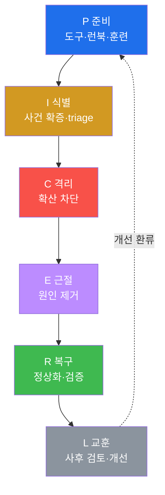
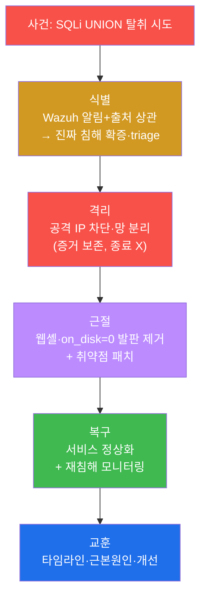
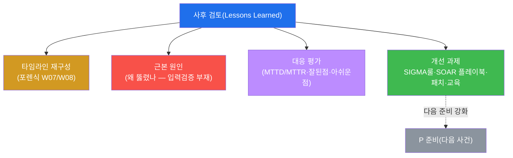

# SOC고급 W11 — 인시던트 대응(IR): 침해 사건의 전 수명주기를 지휘한다

> **본 주차의 한 줄 요약**
>
> W10의 SOAR가 "자동으로 즉시 막는" 손이었다면, **인시던트 대응(IR)** 은 그 위에서 사건 전체를 지휘하는
> 머리다. 실제 침해가 터지면 자동 차단 하나로 끝나지 않는다 — 사건이 진짜인지 확증하고, 확산을 멈추고,
> 뿌리를 뽑고, 안전하게 복구하고, 다시는 같은 일이 없도록 배운다. 본 주차는 **NIST 800-61 / PICERL**
> (Preparation·Identification·Containment·Eradication·Recovery·Lessons) 6단계를 el34의 실제 사건으로 한 바퀴
> 돈다 — 지금까지 배운 탐지(Wazuh)·포렌식(W07/W08)·분석(W09)·SOAR(W10)가 모두 여기서 하나로 엮인다.
>
> **대응 책임자 한 줄 결론**: IR은 기술이 아니라 **순환하는 절차**다. 사건 대응의 질은 사건이 터진 뒤가
> 아니라 **준비(P)** 에서 결정되고, 교훈(L)이 다음 사건의 준비를 강화한다 — IR은 끝나지 않고 돈다.

---

## 학습 목표

본 주차 종료 시 학생은 다음 5가지를 **본인 손으로** 할 수 있어야 한다.

1. **PICERL 6단계**의 각 목적과 순서를 설명한다.
2. **식별(triage)** — 알림을 증거로 확증하고 심각도·범위를 판단한다.
3. **격리**의 원칙(증거 보존 우선, 종료보다 격리)과 단기/장기 격리를 안다.
4. **근절**(증상 아닌 원인 제거)과 **복구**(검증된 정상화)를 수행한다.
5. **교훈(사후 검토)** 으로 타임라인·근본원인·개선 과제를 도출해 재발을 막는다.

---

## 0. 용어 해설

| 용어 | 영문 | 뜻 | 비유 |
|------|------|----|------|
| **인시던트 대응** | Incident Response | 침해 사건의 전 수명주기 대응 | 응급 의료 프로토콜 |
| **NIST 800-61** | — | IR을 정의한 표준 문서 | 응급 의료 표준 지침 |
| **PICERL** | — | 준비·식별·격리·근절·복구·교훈 6단계 | 재난 대응 단계 |
| **triage** | — | 사건 심각도·우선순위 분류 | 응급실 중증도 분류 |
| **격리** | containment | 확산을 멈추는 단계 | 지혈 |
| **근절** | eradication | 원인을 제거하는 단계 | 종양 제거 |
| **복구** | recovery | 정상화·재침해 검증 단계 | 재활·경과 관찰 |
| **교훈** | lessons learned | 사후 검토로 개선 도출 | 사고 보고서 |
| **MTTD/MTTR** | — | 평균 탐지/대응 시간 | 신고~출동 시간 |
| **chain of custody** | — | 증거 수집~보관 연속성 | 압수물 인계 대장 |
| **런북** | runbook | 사건 유형별 대응 절차서 | 비상 대응 매뉴얼 |

> **헷갈리기 쉬운 한 쌍 — 격리(C) vs 근절(E).** **격리**는 "지금 당장 피를 멈추는" 응급 조치다 — 공격
> IP를 차단하고 감염 호스트를 망에서 분리한다(아직 원인은 그대로). **근절**은 "병의 뿌리를 뽑는" 근본
> 치료다 — 웹셸을 지우고 백도어를 없애고 취약점을 패치한다. 순서가 중요하다: **먼저 격리로 확산을 멈춘 뒤**
> 근절한다. 격리 없이 근절부터 하면 그 사이 공격이 번진다.

---

## 0.5 핵심 개념

### 0.5.1 PICERL 한 눈에 — 6단계와 el34 매핑

| 단계 | 목적 | 이번 실습에서 |
|------|------|---------------|
| **P** 준비 | 사건 전 도구·런북·훈련 | Wazuh alerts + AR firewall-drop 점검 |
| **I** 식별 | 알림→사건 확증·triage | 출처 IP 알림 집계로 심각도·범위 |
| **C** 격리 | 확산 차단(원인은 그대로) | firewall-drop 격리 계획(드라이런) |
| **E** 근절 | 원인 제거(웹셸·발판·취약점) | osquery on_disk=0 잔존 발판 확인 |
| **R** 복구 | 정상화 + 재침해 감시 | 서비스 응답 검증 |
| **L** 교훈 | 사후 검토·개선 환류 | eve.json 타임라인 + 근본원인 |

이 6단계가 지금까지 배운 전부를 하나로 엮는다 — 탐지(Wazuh)·포렌식(W07/W08)·헌팅(W06)·SOAR(W10)가 각
단계의 도구로 들어온다.

### 0.5.2 왜 격리가 근절보다 먼저인가 — 지혈 → 치료

칼에 찔린 환자에게 의사는 종양을 먼저 떼지 않는다 — **먼저 지혈(격리)** 하고 나서 치료(근절)한다. IR도 같다:
격리 없이 근절(웹셸 삭제·패치)부터 하면, 그 작업 시간 동안 공격이 다른 호스트로 번진다. 그래서 순서는
**C(격리) → E(근절)** 다. 격리는 빠르고 임시적, 근절은 신중하고 근본적이다.

### 0.5.3 왜 감염 호스트를 "종료"하지 말고 "격리"하나

침해 호스트를 끄고 싶은 충동이 들지만, **전원을 내리면 메모리 증거(실행 중 멀웨어·복호화 키·네트워크
연결)가 영구 소멸**한다(W08 휘발성 순서). 그래서 격리는 **종료가 아니라 망 분리**(케이블 분리·VLAN 격리·
firewall-drop)로 한다 — 공격자와의 연결은 끊되 증거는 살린다. "끄지 말고 선을 뽑아라"가 원칙이다.

### 0.5.4 교훈(L) — 가장 자주 생략되고, 가장 중요한 단계

사건이 진정되면 모두 지쳐서 "끝났다"며 흩어진다. 그래서 **교훈은 IR에서 가장 자주 건너뛰는 단계**다. 하지만
교훈이 없으면 같은 사건이 반복된다. 교훈에서 나온 개선과제(새 SIGMA 룰·SOAR 플레이북·패치·교육)는 **다음
사건의 준비(P)** 로 환류된다 — 그래서 PICERL은 직선이 아니라 **순환(L→P)** 이다.

### 0.5.5 임의로 보이는 값들

| 값 | 무엇 | 규칙 |
|----|------|------|
| **403** | SQLi 응답코드 | WAF가 차단 — **막혀도 '시도'는 사건으로 기록** |
| **PICERL** | 6단계 두문자 | P·I·C·E·R·L 영문 첫 글자 |
| **on_disk=0** | osquery(근절 확인) | 삭제 후 실행 중 발판(W06/W08) |
| **마커(`prep_ready` 등)** | 단계 완료 신호 | 채점이 통과를 확인하는 약속 문자열 |

---

## 1. IR이란 — 사건을 지휘하는 절차

### 1.1 한 줄 답: 혼란을 절차로 다스린다

침해가 터지면 SOC는 혼란에 빠지기 쉽다 — 무엇부터? 누가? 어디까지? IR은 이 혼란을 **정해진 순서(PICERL)**
로 다스린다. 각 단계는 명확한 목적이 있고, 앞 단계가 뒤 단계의 전제가 된다.



### 1.2 왜 중요한가 — 준비가 결과를 가른다

사건이 터진 뒤 도구를 깔고 절차를 정하면 이미 늦다. IR의 질은 **준비(P)** 에서 결정된다 — 탐지가 켜져
있는가, 증거가 수집되는가, 런북이 있는가, 팀이 훈련됐는가. 그래서 PICERL은 "사건 대응"이 아니라 "사건 전
준비"부터 시작한다.

### 1.3 SOAR와의 관계

SOAR(W10)는 IR의 일부를 자동화한다 — 식별의 보강, 격리의 실행 등. 그러나 사건 전체의 판단·지휘는 사람의
IR 절차가 한다. SOAR는 IR을 빠르게 하는 도구이지 IR을 대체하지 않는다.

---

## 2. PICERL 6단계 — el34 사건으로

본 실습은 SQLi 데이터 탈취 사건을 일으켜 6단계를 순서대로 밟는다.



**식별 — 실측 예.** 알림(Wazuh)을 출처 IP 상관(W07)으로 확증한다 — **알림이 곧 사건은 아니다.**

```bash
N=$(tail -2000 /var/ossec/logs/alerts/alerts.json | grep -c "192.168.0.202"); echo "출처 알림 ${N}건 — triage"
```

```
출처 192.168.0.202 알림 1744건 — triage(심각도/범위)
```

한 출처의 알림이 다수면 활발한 사건이다 — 이 수치로 심각도·범위를 정해 우선순위를 매긴다. **격리**는 증거
보존을 위해 시스템을 **종료하지 않고** 망에서 분리한다(§0.5.3). **근절**은 osquery로 `on_disk=0` 잔존 발판
(W06)까지 0인지 확인해 뿌리를 뽑는다. **복구**는 서비스가 302(정상)로 응답하는지 검증하고 강화된 감시 하에
복귀한다.

---

## 3. 증거 보존 · 타임라인

IR 내내 **증거 보존**이 깔려 있다 — W07(네트워크)·W08(메모리) 포렌식으로 모은 증거를 SHA-256 해시+수집
시각으로 chain of custody를 유지한다. 격리 시 시스템을 함부로 종료하지 않는 것도, 휘발성 증거(메모리)를
지키기 위해서다(휘발성 순서 — W08).

모든 단계의 시각을 기록하면 **타임라인**이 된다 — 침입(SQLi) → 탐지(Wazuh) → 격리 → 근절 → 복구가 몇 시
몇 분에 일어났는가. 이 타임라인이 교훈의 MTTD/MTTR 평가와 법적 보고의 근거다.

---

## 4. 교훈 — IR의 끝이자 시작



교훈은 IR에서 가장 많이 생략되지만 가장 중요한 단계다(§0.5.4) — 사건에서 배우지 못하면 같은 사건이 반복된다.
도출한 개선 과제(새 탐지룰·플레이북 보강·패치·교육)는 **다음 사건의 준비(P)** 로 환류된다. 그래서 PICERL은
직선이 아니라 **순환**이다. 실습 STEP 7은 eve.json 흔적 수로 타임라인을 채워 '추측'이 아닌 '증거 기반' 사후
검토를 만든다.

---

## 5. 실습 안내 (8 미션)

각 미션을 **① 왜 하는가 / ② 무엇을 알 수 있는가 / ③ 결과 해석 / ④ 실전 활용** 4축으로 설명한다. 명령은
el34 호스트에서 `docker exec` 로. **인가된 실습 환경(el34)에서만**, 격리는 드라이런(실차단 미발동).

### STEP 1 — 준비 (P)
- **왜**: IR 성패는 사건이 터지기 '전'에 갈린다.
- **무엇을**: 탐지(alerts.json) + 대응(firewall-drop) 도구가 사전 가동 중인지.
- **해석**: siem_ok + ar_ok = 준비 완료(`prep_ready`). 없으면 보지도 막지도 못한다.
- **실전**: 정기적 IR 준비 점검(도구·런북·연락망·훈련).

### STEP 2 — 사건 발생
- **왜**: IR 한 바퀴를 돌려면 분석할 사건이 필요.
- **무엇을**: SQLi UNION 탈취 시도 1발.
- **해석**: 403(차단)이어도 '시도'는 사건으로 기록(`incident_occurred`). §0.5.5.
- **실전**: (실무에선 실제 침해가 이 자리에 온다.)

### STEP 3 — 식별 (I)
- **왜**: 알림이 곧 사건은 아니다 — 증거로 확증·triage.
- **무엇을**: alerts.json의 출처 IP 흔적 집계.
- **해석**: 다수면 활발한 사건(`identified`). 심각도·범위로 우선순위.
- **실전**: 오탐과 실제 사건을 가르는 triage.

### STEP 4 — 격리 (C)
- **왜**: 근절 전에 먼저 확산을 끊는다(지혈, §0.5.2).
- **무엇을**: firewall-drop 격리 계획 검증(실차단 미발동).
- **해석**: 액션 존재 = 즉시 차단 실행성 확인(`contained`). 종료 대신 망 분리(§0.5.3).
- **실전**: 단기(IP 차단)→장기(망 재설계) 격리.

### STEP 5 — 근절 (E)
- **왜**: 알림만 끄는 건 증상 대처 — 원인을 뿌리째.
- **무엇을**: osquery on_disk=0 잔존 발판 수.
- **해석**: 0=깨끗(`eradicated`). 0보다 크면 발판·파일·계정·cron·SSH키 함께 제거.
- **실전**: 웹셸·백도어·취약점 패치까지 근본 제거.

### STEP 6 — 복구 (R)
- **왜**: 근절 후 정상화하되 재침해를 감시.
- **무엇을**: 서비스 응답코드(302).
- **해석**: 302=서비스 정상(`recovered`). '깨끗함 검증 후' 복구. 복귀 후 감시 강화.
- **실전**: 근절 불완전 시 재감염 — 검증 없는 복구 금지.

### STEP 7 — 교훈 (L)
- **왜**: 교훈은 IR의 끝이자 다음 준비의 시작(순환).
- **무엇을**: eve.json 흔적으로 타임라인 재구성 + 근본원인.
- **해석**: 증거 기반 타임라인(`lessons_done`). 근본원인(입력검증 부재)→개선과제.
- **실전**: 개선과제(SIGMA/SOAR/패치/교육)를 다음 준비로 환류.

### STEP 8 — IR 보고서
- **왜**: 사건 대응은 증거로 보고해야 학습 자산이 된다.
- **무엇을**: 사건 흔적 수를 인용한 PICERL 종합 보고서.
- **해석**: 실측 인용(`ir_report_done`). 제출용은 6단계 표 + 요약 + 개선과제.
- **실전**: 경영진/기술진 두 층 IR 보고서.

---

## 6. 흔한 오해·블루팀 노트

- **"알림이 곧 사건"** — 아니다. 알림을 증거로 확증(식별)해야 사건이다. 오탐 대응은 자원 낭비.
- **"일단 근절부터"** — 격리 없이 근절하면 그 사이 확산. 지혈(C) → 치료(E) 순서(§0.5.2).
- **"감염됐으니 끄자"** — 종료하면 메모리 증거 소멸. 끄지 말고 망 분리(§0.5.3).
- **"사건 끝나면 끝"** — 교훈(L)을 건너뛰면 같은 사건 반복. L→P 순환이 IR의 핵심.

---

## 7. 다음 주차 (W12) 예고 — 로그 엔지니어링·탐지 파이프라인

W11은 사건 대응의 절차였다. W12는 그 모든 탐지·증거의 토대인 **로그 파이프라인**(수집·파싱·정규화·보존)을
엔지니어링 관점에서 다룬다 — 좋은 탐지는 좋은 로그에서 나온다. IR에서 증거가 부족했던 지점이 곧 로그
파이프라인의 개선 과제가 된다.
