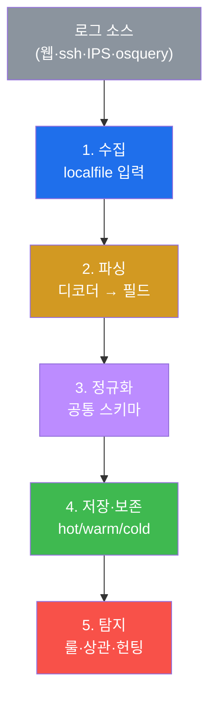
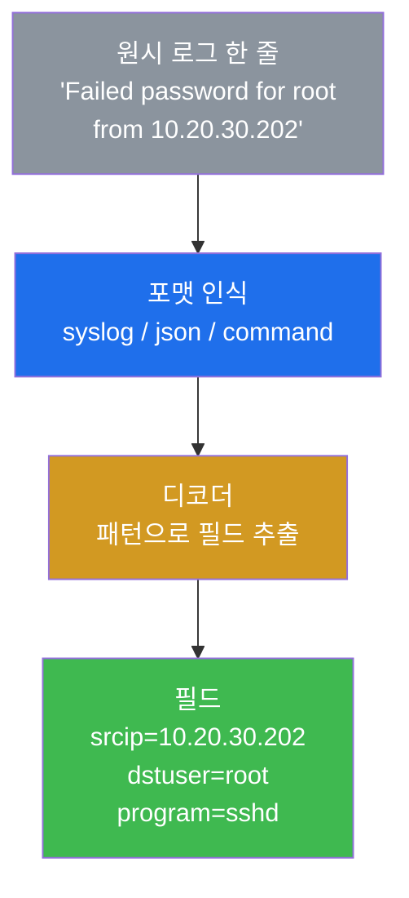
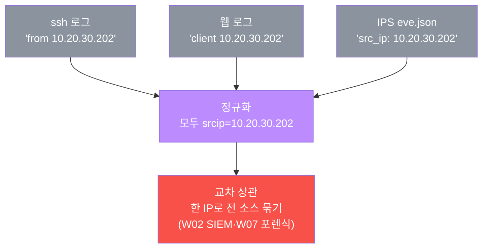

# SOC고급 W12 — 로그 엔지니어링: 좋은 탐지는 좋은 로그에서 나온다

> **본 주차의 한 줄 요약**
>
> W01~W11에서 우리는 로그를 **소비**했다 — Wazuh 알림을 보고, Suricata eve.json을 뒤지고, osquery를 던졌다.
> 그런데 그 모든 탐지·포렌식·IR은 **로그가 제대로 수집·파싱·정규화·보존되어 있을 때만** 작동한다. 본 주차는
> 시선을 뒤집어 **로그 파이프라인 자체**를 엔지니어링 관점에서 본다 — 입력(localfile) → 파싱(디코더) →
> 정규화(공통 스키마) → 저장(보존) → 탐지. el34 Wazuh로 원시 로그 한 줄이 `srcip`·`dstuser` 같은 필드로
> 분해되는 과정을 `wazuh-logtest`로 직접 확인하고, 파이프라인의 **사각(blind spot)** 을 점검한다.
>
> **로그 엔지니어 한 줄 결론**: SOC의 탐지 능력은 분석가의 실력 이전에 **파이프라인의 품질**에 달려 있다.
> 수집되지 않은 로그는 탐지될 수 없고, 파싱되지 않은 로그는 룰이 볼 수 없다 — **사각은 곧 공격자의 은신처**다.

---

## 학습 목표

본 주차 종료 시 학생은 다음 5가지를 **본인 손으로** 할 수 있어야 한다.

1. **로그 파이프라인 5단계**(수집→파싱→정규화→저장→탐지)를 설명한다.
2. **로그 포맷**(syslog·json·command)의 차이와 포맷별 파싱을 안다.
3. **디코더**가 원시 로그를 필드로 분해하는 원리를 `wazuh-logtest`로 확인한다.
4. **정규화(공통 스키마)** 가 교차 상관(W02·W07)의 전제임을 설명한다.
5. **보존 정책**(hot/warm/cold·규정)과 **파이프라인 사각**을 점검한다.

---

## 0. 용어 해설

| 용어 | 영문 | 뜻 | 비유 |
|------|------|----|------|
| **로그 파이프라인** | log pipeline | 로그를 수집~탐지까지 흐르게 하는 처리 경로 | 정수 처리장 |
| **수집** | collection | 로그를 모으는 입력 단계 | 취수구 |
| **localfile** | — | Wazuh의 로그 입력 정의 | 취수 파이프 |
| **디코더** | decoder | 원시 로그를 필드로 분해 | 원수 여과기 |
| **파싱** | parsing | 텍스트에서 의미 필드 추출 | 광물에서 금속 추출 |
| **정규화** | normalization | 다른 로그를 공통 필드로 통일 | 단위 통일 |
| **공통 스키마** | common schema | 표준 필드명 체계(srcip·user…) | 표준 양식 |
| **보존** | retention | 로그를 일정 기간 보관 | 기록 보관소 |
| **사각** | blind spot | 로그가 없어 탐지 못하는 구간 | CCTV 사각지대 |
| **NTP** | — | 시간 동기화 프로토콜 | 표준시계 |

> **헷갈리기 쉬운 한 쌍 — 파싱(디코더) vs 정규화.** **파싱**은 원시 로그 한 줄에서 필드를 **추출**하는 것
> (`Failed password ... from 10.20.30.202` → `srcip=10.20.30.202`). **정규화**는 서로 다른 로그의 필드를
> **같은 이름으로 통일**하는 것(ssh의 `from X`도, 웹의 `client X`도 모두 `srcip=X`). 파싱이 "뜻을 읽는"
> 거라면 정규화는 "용어를 맞추는" 것이다. 정규화가 돼야 출처 IP 하나로 모든 소스를 교차 상관할 수 있다.

---

## 1. 왜 로그 엔지니어링인가

### 1.1 한 줄 답: 탐지는 로그보다 좋을 수 없다

아무리 정교한 룰(SIGMA·Wazuh)도, 아무리 뛰어난 분석가도 **로그에 없는 것은 탐지할 수 없다.** 수집되지 않은
이벤트, 파싱되지 않아 필드가 없는 로그, 보존 기간이 지나 사라진 증거 — 이 모든 "로그의 빈틈"이 곧 탐지의
한계다. 로그 엔지니어링은 이 토대를 다지는 일이다.

### 1.2 왜 중요한가 — 모든 SOC 기능의 토대

W01~W11의 모든 것이 이 파이프라인 위에 선다 — SIEM 상관(W02)은 정규화에, 포렌식(W07/W08)은 보존에, IR(W11)
타임라인은 시간 동기화에 의존한다. 파이프라인이 부실하면 그 위의 모든 기능이 부실해진다.

### 1.3 한계 — 모든 걸 수집할 수는 없다

로그는 비용(저장·처리)이다. 모든 것을 무한정 수집·보존할 수 없다. 그래서 **무엇을 수집하고 얼마나 보존할지**의
설계(위험 기반)가 로그 엔지니어링의 핵심 판단이다.

---

## 2. 수집 · 포맷 · 파싱(디코더)

**수집** — `<localfile>`이 어떤 로그를 읽을지 정의한다. 여기 없는 소스는 파이프라인에 아예 들어오지 못한다.
**포맷** — syslog(전통 텍스트)·json(구조화)·command(명령 출력)는 파싱 방식이 다르다. 구조화(json)일수록
파싱이 쉽고 정확하다. **디코더** — el34 Wazuh엔 120개의 기본 디코더가 있어 원시 로그를 `srcip`·`dstuser`
같은 필드로 분해한다. 실습에서 `wazuh-logtest`에 ssh 실패 로그 한 줄을 넣어, 그것이 `srcip=10.20.30.202`로
분해되는 것을 눈으로 본다 — **룰은 이 분해된 필드를 보고 판단한다(secuops W12).**

---

## 3. 정규화 — 교차 상관의 전제

세 소스가 같은 공격자(10.20.30.202)를 각자 다른 표현으로 기록한다. **정규화**가 이를 모두 `srcip`으로
통일하면, 출처 IP 하나로 ssh·웹·IPS 로그를 한꺼번에 상관할 수 있다 — 이것이 W02 SIEM 상관과 W07 네트워크
포렌식이 작동하는 **숨은 전제**다. 정규화가 없으면 분석가는 소스마다 따로 검색해야 한다.

---

## 4. 보존 · 파이프라인 사각

**보존 정책.** 로그는 계층으로 보관한다 — hot(즉시 검색, 비쌈) → warm → cold(장기, 쌈/느림). 침해는 평균
수개월 잠복하므로(W06) 보존이 너무 짧으면 정작 조사 때 로그가 없다. PCI-DSS(1년) 등 규정 최소 보존도 지켜야
하며, 무결성(해시)·접근통제를 동반한다.

**파이프라인 사각(blind spot).** 파이프라인의 건강을 점검하는 것이 곧 탐지 커버리지 점검이다.

네 가지 사각 모두 "로그가 있어야 할 자리에 없는" 상황이고, 그 구간은 탐지가 불가능하다 — **사각은 곧
공격자의 은신처**다. 로그 엔지니어는 수집 목록·파싱 성공률·시간 동기화·큐 상태를 주기적으로 점검한다.

---

## 5. 실습 안내 (8 미션)

1. **수집**(localfile). 2. **로그 포맷**. 3. **파싱**(디코더). 4. **파싱 검증**(logtest). 5. **정규화**.
6. **보존 정책**. 7. **사각 점검**. 8. **보고서**.

> 명령은 el34 호스트에서 `docker exec el34-siem`로. **인가된 실습 환경(el34)에서만**, 디코더·logtest는 읽기 전용.

---

## 6. 다음 주차 (W13) 예고 — 퍼플팀

W12는 탐지의 토대(로그)였다. W13은 공격(레드)과 방어(블루)를 한 테이블에 앉혀 탐지 격차를 함께 메우는
**퍼플팀(purple team)** — 공격으로 탐지를 검증하고, 탐지로 공격을 막는 협업 훈련을 다룬다.
