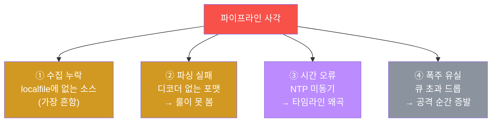
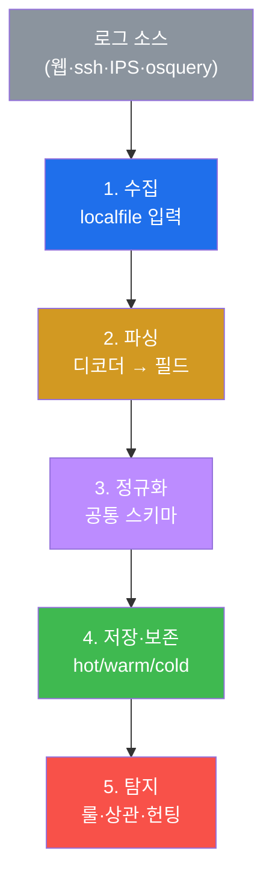
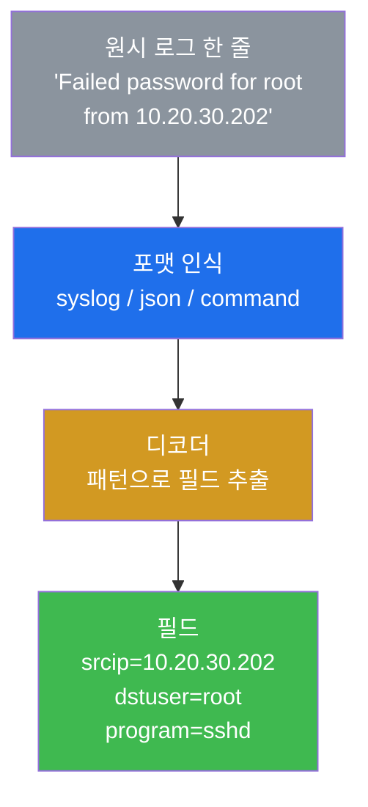
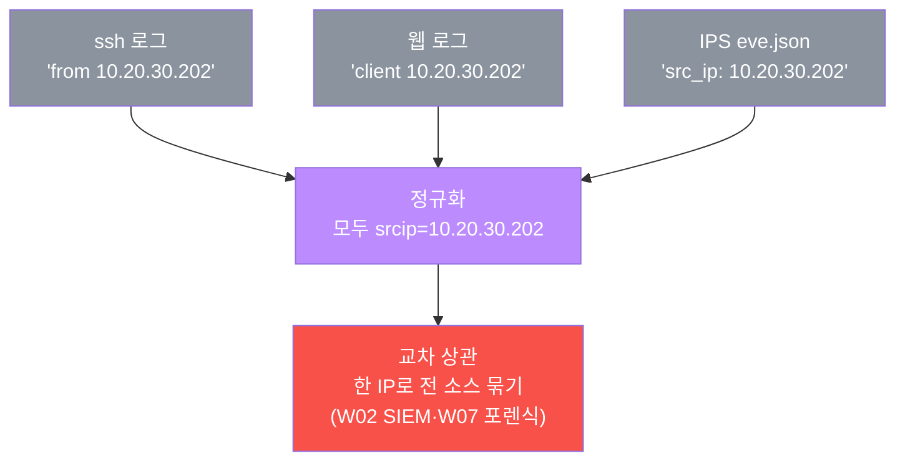

# SOC고급 W12 — 로그 엔지니어링: 좋은 탐지는 좋은 로그에서 나온다

> **본 주차의 한 줄 요약**
>
> W01~W11에서 우리는 로그를 **소비**했다 — Wazuh 알림을 보고, Suricata eve.json을 뒤지고, osquery를 던졌다.
> 그런데 그 모든 탐지·포렌식·IR은 **로그가 제대로 수집·파싱·정규화·보존되어 있을 때만** 작동한다. 본 주차는
> 시선을 뒤집어 **로그 파이프라인 자체**를 엔지니어링 관점에서 본다 — 입력(localfile) → 파싱(디코더) →
> 정규화(공통 스키마) → 저장(보존) → 탐지. el34 Wazuh로 원시 로그 한 줄이 `srcip`·`dstuser` 같은 필드로
> 분해되는 과정을 `wazuh-logtest`로 직접 확인하고, 파이프라인의 **사각(blind spot)** 을 점검한다.
>
> **로그 엔지니어 한 줄 결론**: SOC의 탐지 능력은 분석가의 실력 이전에 **파이프라인의 품질**에 달려 있다.
> 수집되지 않은 로그는 탐지될 수 없고, 파싱되지 않은 로그는 룰이 볼 수 없다 — **사각은 곧 공격자의 은신처**다.

---

## 학습 목표

본 주차 종료 시 학생은 다음 5가지를 **본인 손으로** 할 수 있어야 한다.

1. **로그 파이프라인 5단계**(수집→파싱→정규화→저장→탐지)를 설명한다.
2. **로그 포맷**(syslog·json·command)의 차이와 포맷별 파싱을 안다.
3. **디코더**가 원시 로그를 필드로 분해하는 원리를 `wazuh-logtest`로 확인한다.
4. **정규화(공통 스키마)** 가 교차 상관(W02·W07)의 전제임을 설명한다.
5. **보존 정책**(hot/warm/cold·규정)과 **파이프라인 사각**을 점검한다.

---

## 0. 용어 해설

| 용어 | 영문 | 뜻 | 비유 |
|------|------|----|------|
| **로그 파이프라인** | log pipeline | 로그를 수집~탐지까지 흐르게 하는 처리 경로 | 정수 처리장 |
| **수집** | collection | 로그를 모으는 입력 단계 | 취수구 |
| **localfile** | — | Wazuh의 로그 입력 정의(ossec.conf) | 취수 파이프 |
| **log_format** | — | 입력 로그의 형식(syslog/json/command) | 원수의 종류 |
| **디코더** | decoder | 원시 로그를 필드로 분해 | 원수 여과기 |
| **파싱** | parsing | 텍스트에서 의미 필드 추출 | 광물에서 금속 추출 |
| **정규화** | normalization | 다른 로그를 공통 필드로 통일 | 단위 통일 |
| **공통 스키마** | common schema | 표준 필드명 체계(srcip·dstuser…) | 표준 양식 |
| **보존** | retention | 로그를 일정 기간 보관 | 기록 보관소 |
| **사각** | blind spot | 로그가 없어 탐지 못하는 구간 | CCTV 사각지대 |
| **NTP** | Network Time Protocol | 시간 동기화 프로토콜 | 표준시계 |

> **헷갈리기 쉬운 한 쌍 — 파싱(디코더) vs 정규화.** **파싱**은 원시 로그 한 줄에서 필드를 **추출**하는 것
> (`Failed password ... from 10.20.30.202` → `srcip=10.20.30.202`). **정규화**는 서로 다른 로그의 필드를
> **같은 이름으로 통일**하는 것(ssh의 `from X`도, 웹의 `client X`도 모두 `srcip=X`). 파싱이 "뜻을 읽는"
> 거라면 정규화는 "용어를 맞추는" 것이다. 정규화가 돼야 출처 IP 하나로 모든 소스를 교차 상관할 수 있다.

---

## 0.5 신입생 친화 핵심 개념

### 0.5.1 로그 파이프라인 5단계 — 정수 처리장 비유

수돗물이 취수→여과→정수→저수→공급을 거치듯, 로그도 5단계를 거쳐야 탐지에 쓸 수 있다.

| 단계 | 하는 일 | el34에서 |
|------|---------|----------|
| ① 수집 | 로그를 받아들임 | ossec.conf `<localfile>` |
| ② 파싱 | 텍스트→필드 분해 | 디코더(120개) |
| ③ 정규화 | 필드명 통일(srcip…) | 공통 스키마 |
| ④ 저장·보존 | 일정 기간 보관 | alerts.json (hot/warm/cold) |
| ⑤ 탐지 | 룰·상관·헌팅 | Wazuh 룰(W02·W03) |

어느 한 단계가 막히면 그 뒤가 전부 무력해진다 — 수집 안 된 로그는 파싱·탐지될 수 없다.

### 0.5.2 파싱 vs 정규화 — 한 줄 예시로

원시 로그: `Failed password for root from 10.20.30.202 port 22 ssh2`

| 단계 | 결과 |
|------|------|
| **파싱**(디코더) | `dstuser=root`, `srcip=10.20.30.202`, `program=sshd` 로 **추출** |
| **정규화** | ssh의 `from`, 웹의 `client`, IPS의 `src_ip` 를 모두 `srcip` 로 **통일** |

정규화 덕분에 "ssh에서 무차별 대입하던 그 IP가 웹에서도 SQLi했다"를 `srcip` 한 필드로 묶는다(W02·W07).

### 0.5.3 보존 hot/warm/cold — 속도와 비용의 계층

로그를 전부 빠른 저장소에 두면 비싸다. 그래서 나이별로 계층화한다.

| 계층 | 특징 | 용도 |
|------|------|------|
| **hot** | 즉시 검색, 비쌈(SSD) | 최근(수일~수주) |
| **warm** | 보통 속도/비용 | 중간(수개월) |
| **cold** | 느림, 쌈(객체 스토리지) | 장기(규정 보존) |

침해는 평균 수개월 잠복하므로(W06) 보존이 너무 짧으면 정작 조사 때 로그가 없다. PCI-DSS는 **최소 1년**
보존을 요구한다(compliance 트랙과 연결).

### 0.5.4 파이프라인 사각 4유형 — "안 보이는 곳이 은신처"



네 가지 모두 "로그가 있어야 할 자리에 없는" 상황이고, 그 구간은 탐지가 불가능하다. 특히 ③ NTP 시간 오류는
교묘하다 — 로그는 있는데 시각이 어긋나 IR 타임라인(W11)이 뒤죽박죽 된다.

### 0.5.5 임의로 보이는 값들

| 값 | 무엇 | 규칙 |
|----|------|------|
| **srcip / dstuser** | 정규화 필드명 | Wazuh 공통 스키마(출처 IP·대상 계정) |
| **디코더 120개** | 기본 파서 수 | Wazuh 기본 룰셋(버전마다 다름) |
| **full_command / plain** | log_format 종류 | 명령 전체 출력 / 가공 없는 줄 |
| **마커(`inputs_found` 등)** | 단계 완료 신호 | 채점이 통과를 확인하는 약속 문자열 |

---

## 1. 왜 로그 엔지니어링인가

### 1.1 한 줄 답: 탐지는 로그보다 좋을 수 없다

아무리 정교한 룰(SIGMA·Wazuh)도, 아무리 뛰어난 분석가도 **로그에 없는 것은 탐지할 수 없다.** 수집되지 않은
이벤트, 파싱되지 않아 필드가 없는 로그, 보존 기간이 지나 사라진 증거 — 이 모든 "로그의 빈틈"이 곧 탐지의
한계다. 로그 엔지니어링은 이 토대를 다지는 일이다.



### 1.2 왜 중요한가 — 모든 SOC 기능의 토대

W01~W11의 모든 것이 이 파이프라인 위에 선다 — SIEM 상관(W02)은 정규화에, 포렌식(W07/W08)은 보존에, IR(W11)
타임라인은 시간 동기화에 의존한다. 파이프라인이 부실하면 그 위의 모든 기능이 부실해진다.

### 1.3 한계 — 모든 걸 수집할 수는 없다

로그는 비용(저장·처리)이다. 모든 것을 무한정 수집·보존할 수 없다. 그래서 **무엇을 수집하고 얼마나 보존할지**의
설계(위험 기반)가 로그 엔지니어링의 핵심 판단이다.

---

## 2. 수집 · 포맷 · 파싱(디코더)



**수집** — `<localfile>` 이 어떤 로그를 읽을지 정의한다. 여기 없는 소스는 파이프라인에 아예 들어오지 못한다.
**포맷** — syslog(전통 텍스트)·json(구조화)·command(명령 출력)는 파싱 방식이 다르다. 구조화(json)일수록
파싱이 쉽고 정확하다. **디코더** — el34 Wazuh엔 120개의 기본 디코더가 있어 원시 로그를 분해한다.

**실측 예 — 파싱 검증.** `wazuh-logtest` 에 ssh 실패 로그 한 줄을 넣어 필드 분해를 본다.

```bash
printf "Jan  1 00:00:00 host sshd[1]: Failed password for root from 10.20.30.202 port 22 ssh2\n" \
  | /var/ossec/bin/wazuh-logtest 2>&1 | grep -iE "srcip|dstuser" | head
```

```
    dstuser: 'root'
    srcip: '10.20.30.202'
```

원시 텍스트가 `dstuser=root`·`srcip=10.20.30.202` 로 분해됐다 = 디코더가 동작한다는 뜻. **룰은 이 분해된
필드를 보고 판단한다(secuops W12).** (`2>&1` 필수 — 결과가 stderr.)

---

## 3. 정규화 — 교차 상관의 전제



세 소스가 같은 공격자(10.20.30.202)를 각자 다른 표현으로 기록한다. **정규화**가 이를 모두 `srcip` 으로
통일하면, 출처 IP 하나로 ssh·웹·IPS 로그를 한꺼번에 상관할 수 있다 — 이것이 W02 SIEM 상관과 W07 네트워크
포렌식이 작동하는 **숨은 전제**다. 정규화가 없으면 분석가는 소스마다 따로 검색해야 한다.

---

## 4. 보존 · 파이프라인 사각

**보존 정책.** 로그는 계층으로 보관한다(§0.5.3) — hot → warm → cold. 침해는 평균 수개월 잠복하므로(W06)
보존이 너무 짧으면 정작 조사 때 로그가 없다.

**실측 예 — 보존 크기.**

```bash
SZ=$(wc -c < /var/ossec/logs/alerts/alerts.json); echo "alerts.json: ${SZ} bytes (hot 계층)"
```

PCI-DSS(1년) 등 규정 최소 보존도 지켜야 하며, 무결성(해시)·접근통제를 동반한다.

**파이프라인 사각(blind spot).** §0.5.4의 네 유형(수집 누락·파싱 실패·시간 오류·폭주 유실)을 주기적으로
점검하는 것이 곧 탐지 커버리지 점검이다 — **사각은 곧 공격자의 은신처**다. 로그 엔지니어는 수집 목록·파싱
성공률·시간 동기화·큐 상태를 정기적으로 본다.

---

## 5. 실습 안내 (8 미션)

각 미션을 **① 왜 하는가 / ② 무엇을 알 수 있는가 / ③ 결과 해석 / ④ 실전 활용** 4축으로 설명한다. 명령은
el34 호스트에서 `docker exec el34-siem` 로. **인가된 실습 환경(el34)에서만**, 디코더·logtest는 읽기 전용.

### STEP 1 — 수집 (localfile)
- **왜**: 파이프라인의 시작은 입력. 수집 안 된 로그는 탐지 불가.
- **무엇을**: ossec.conf `<localfile>` 입력 정의 개수.
- **해석**: N개 입력 수신 중(`inputs_found`). 여기 없는 소스가 STEP 7 사각.
- **실전**: 수집 목록이 곧 가시성 범위.

### STEP 2 — 로그 포맷
- **왜**: 포맷마다 파서가 달라 — 어떤 포맷을 받는지 알아야 파싱 전략.
- **무엇을**: `<log_format>` 포맷별 집계.
- **해석**: syslog/command/plain 분포(`formats_listed`). 구조화(json)일수록 파싱 쉬움.
- **실전**: 새 소스 도입 시 포맷에 맞는 디코더 준비.

### STEP 3 — 파싱 디코더
- **왜**: 디코더가 원시 로그를 필드로 분해 — 룰의 판단 재료.
- **무엇을**: 디코더 파일 개수.
- **해석**: 120개 기본 디코더(`decoders_counted`). 안 잡히면 커스텀 추가(secuops W12).
- **실전**: 파싱 자산 인벤토리.

### STEP 4 — 파싱 검증 (logtest)
- **왜**: 디코더가 실제 동작하는지는 넣어 봐야 안다.
- **무엇을**: logtest에 syslog 한 줄 → srcip/dstuser 분해.
- **해석**: 필드 분해 확인(`parsed_fields`). `2>&1` 필수.
- **실전**: 새 디코더 배포 전 분해 검증.

### STEP 5 — 정규화
- **왜**: 제각각 출처 표현을 srcip로 통일해야 교차 상관 가능.
- **무엇을**: ssh의 `from X` → 공통 `srcip`.
- **해석**: srcip 정규화 확인(`normalized`). 한 IP로 전 소스 묶기.
- **실전**: W02 교차상관·W07 포렌식의 숨은 전제.

### STEP 6 — 보존
- **왜**: 보존이 짧으면 사건 발견 시 이미 로그 소멸.
- **무엇을**: alerts.json 보존 크기(hot 계층).
- **해석**: 보존 확인(`retention_done`). hot/warm/cold 계층화, PCI 1년 최소.
- **실전**: 비용·규정 균형의 보존 정책 설계.

### STEP 7 — 사각 점검
- **왜**: 수집 안 되는 소스는 탐지 불가 = 공격자 은신처.
- **무엇을**: 수집 소스 집계 → 미수집이 사각.
- **해석**: 4유형(수집누락/파싱실패/NTP/폭주) 점검(`blindspot_done`).
- **실전**: '무엇을 안 보고 있나'를 아는 것이 핵심.

### STEP 8 — 파이프라인 보고서
- **왜**: 파이프라인 건강을 증거로 보고해야 탐지 토대가 관리된다.
- **무엇을**: localfile·디코더 수를 인용한 보고서 골격.
- **해석**: 실측 인용(`logeng_report_done`). 제출용은 5단계 표 + 사각 보완 계획.
- **실전**: 탐지 역량의 토대를 정량 보고.

---

## 6. 흔한 오해·블루팀 노트

- **"룰만 잘 만들면 탐지된다"** — 룰은 파싱된 필드를 본다. 파싱 안 되면 아무리 좋은 룰도 못 본다.
- **"다 수집하면 안전"** — 로그는 비용이다. 위험 기반으로 무엇을·얼마나 수집·보존할지 설계해야 한다.
- **"시간은 알아서 맞겠지"** — NTP 미동기면 타임라인이 어긋나 IR이 무너진다(§0.5.4 ③).
- **"안 보이면 없는 것"** — 사각(미수집·파싱 실패)은 '없는' 게 아니라 '못 보는' 것이다 = 공격자 은신처.

---

## 7. 다음 주차 (W13) 예고 — 퍼플팀

W12는 탐지의 토대(로그)였다. W13은 공격(레드)과 방어(블루)를 한 테이블에 앉혀 탐지 격차를 함께 메우는
**퍼플팀(purple team)** — 공격으로 탐지를 검증하고, 탐지로 공격을 막는 협업 훈련을 다룬다. 퍼플팀이 찾은
"안 잡히는 공격"이 곧 이번 주에 배운 파이프라인 사각일 때가 많다.
