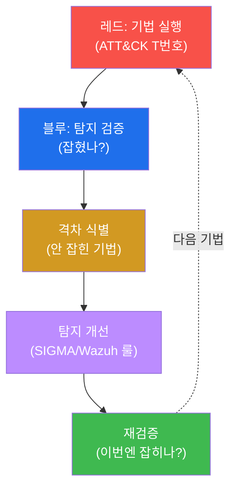
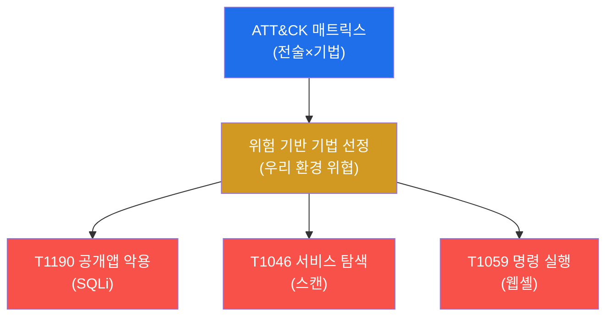
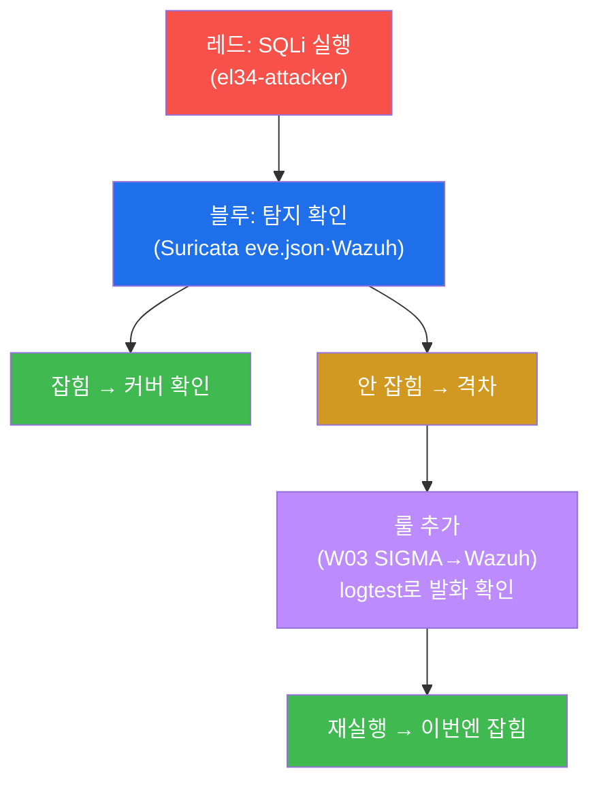
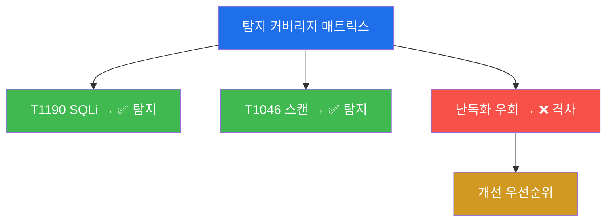

# SOC고급 W13 — 퍼플팀: 공격으로 탐지를 검증하고 격차를 메운다

> **본 주차의 한 줄 요약**
>
> 레드팀(공격)과 블루팀(방어)은 보통 적이다 — 레드는 뚫고, 블루는 막고, 끝나면 각자 보고서를 쓴다. 그런데
> 이 구도엔 큰 낭비가 있다: 레드가 찾은 약점이 블루의 탐지로 **체계적으로** 이어지지 않는다. **퍼플팀
> (purple team)** 은 둘을 한 테이블에 앉힌다 — 레드가 ATT&CK 기법을 **공개적으로** 실행하고, 블루가 그게
> 탐지되는지 **실시간으로** 확인하며, 안 잡히는 격차를 **즉시 룰로 메우고**, 재실행으로 검증한다. 본 주차에
> 학생은 el34에서 이 **실행→검증→격차→개선→재검증** 루프를 한 바퀴 돈다.
>
> **퍼플팀 한 줄 결론**: 퍼플팀의 산출물은 "뚫렸다/막았다"가 아니라 **새로운 탐지 룰과 측정된 커버리지**다.
> 적대(누가 이겼나)를 협업(탐지를 얼마나 키웠나)으로 바꾸는 것이 핵심이다.

---

## 학습 목표

본 주차 종료 시 학생은 다음 5가지를 **본인 손으로** 할 수 있어야 한다.

1. **퍼플팀**이 레드/블루 단독과 무엇이 다른지(협업·공개·측정) 설명한다.
2. **ATT&CK 매트릭스**로 테스트할 기법을 선정하고 커버리지를 추적한다.
3. **실행(레드) → 검증(블루)** 으로 탐지 여부를 확인한다.
4. **탐지 격차**(공격은 되는데 안 보이는 구간)를 식별한다.
5. 격차를 **룰로 메우고 재검증**해 측정 가능한 탐지 향상을 만든다.

---

## 강의 시간 배분 (총 3시간 40분)

| 시간        | 내용                                                                | 유형      |
|-------------|---------------------------------------------------------------------|-----------|
| 0:00–0:25   | 이론 — 레드 vs 블루 vs 퍼플, 왜 협업인가                            | 강의      |
| 0:25–0:55   | 이론 — ATT&CK 매핑·퍼플팀 루프                                      | 강의      |
| 0:55–1:05   | 휴식                                                                 | —         |
| 1:05–1:35   | 이론 — 탐지 격차·커버리지 측정                                       | 강의/토론 |
| 1:35–2:10   | 실습 — 환경·기법 선정·레드 실행                                      | 실습      |
| 2:10–2:40   | 실습 — 블루 검증·격차 분석·개선                                      | 실습      |
| 2:40–2:50   | 휴식                                                                 | —         |
| 2:50–3:20   | 실습 — 재검증 + 보고서                                               | 실습      |
| 3:20–3:40   | 정리 + 다음 주차 예고                                                | 정리      |

---

## 0. 용어 해설

| 용어 | 영문 | 뜻 | 비유 |
|------|------|----|------|
| **레드팀** | red team | 공격 역할 | 모의 침입자 |
| **블루팀** | blue team | 방어·탐지 역할 | 경비대 |
| **퍼플팀** | purple team | 레드·블루 협업(빨강+파랑=보라) | 합동 훈련 |
| **ATT&CK** | MITRE ATT&CK | 공격 기법 표준 매트릭스 | 범죄 수법 분류표 |
| **기법** | technique | ATT&CK의 개별 공격 방법(T번호) | 개별 수법 |
| **탐지 커버리지** | detection coverage | 탐지 가능한 기법 비율 | 감시 범위 |
| **탐지 격차** | detection gap | 탐지 못하는 기법 구간 | 경비 사각 |
| **검증** | validation | 공격으로 탐지를 시험 | 모의 화재 점검 |
| **Atomic Red Team** | — | 기법별 단위 테스트 도구군 | 표준 시험 키트 |
| **재검증** | revalidation | 개선 후 다시 시험 | 보수 후 재점검 |

> **헷갈리기 쉬운 한 쌍 — 레드/블루 vs 퍼플.** **레드/블루 단독**은 경쟁이다 — 레드는 안 들키려 하고, 블루는
> 사후에 막으려 한다. 정보가 끝나고 나서야 공유된다. **퍼플**은 협업이다 — 레드가 "지금 T1190을 쏩니다"라고
> 공개하고, 블루가 "안 잡히네요, 룰 추가합니다"라고 즉시 반응한다. 목표가 "이기기"에서 "탐지 키우기"로 바뀐다.

---

## 1. 왜 퍼플팀인가

### 1.1 한 줄 답: 약점 발견을 탐지 개선으로 직결시킨다

레드팀 훈련의 가치는 약점을 찾는 것이다. 그러나 찾은 약점이 블루의 탐지로 이어지지 않으면 반쪽이다. 퍼플팀은
**발견 즉시 탐지로 전환**하는 짧은 루프를 만든다 — 공격이 탐지를 검증하고, 탐지가 공격을 막는다.

### 1.2 왜 중요한가 — 측정 가능한 방어

"우리 SOC는 안전한가?"라는 질문에 막연히 답할 순 없다. 퍼플팀은 ATT&CK 기법별로 "탐지된다/안 된다"를
측정해 **커버리지를 숫자로** 만든다. 막연한 안심 대신 데이터 기반의 방어 평가가 가능해진다.

### 1.3 한계

퍼플팀은 실행한 기법만 검증한다 — 매트릭스 전체를 한 번에 다 못 한다. 그래서 위험 기반으로 우선순위를 정해
(우리 환경에 실제 위협이 되는 기법부터) 반복적으로 돌려야 한다.

---

## 2. ATT&CK 매핑 — 무엇을 검증하나

ATT&CK는 공격 기법의 공통 언어다(T번호). 퍼플팀은 매트릭스에서 **우리 환경에 실제 위협이 되는 기법**을
선정해 하나씩 검증한다. 기법을 T번호로 추적하면 "우리는 T1190은 탐지하지만 T1059 일부는 못 한다"처럼
커버리지를 체계적으로 기록할 수 있다.

---

## 3. 퍼플팀 루프 — el34에서

실습은 T1190(SQLi)을 el34에서 실행한다.

**레드**가 공격을 실행하면, **블루**는 출처 IP(10.20.30.202)가 Suricata eve.json·Wazuh 알림에 잡혔는지
확인한다. 흔적이 0이면 **탐지 격차**다. 격차는 W03에서 배운 SIGMA→Wazuh 룰로 메우고, `wazuh-logtest`로 룰이
발화하는지 확인한 뒤, **재실행**으로 이번엔 잡히는지 검증한다. 루프가 닫히면 격차 하나가 영구히 메워진다.

---

## 4. 탐지 격차 · 커버리지 측정

퍼플팀의 결과물은 **기법×탐지 여부 매트릭스**다. 이 매트릭스가 SOC의 탐지 커버리지를 시각화하고, 빨간 칸
(격차)이 개선 우선순위가 된다. 시간이 지나며 빨간 칸이 줄어드는 것이 곧 **측정 가능한 방어 성숙**이다 —
soc 트랙 W13(SOC 성숙도)·W14(운영 지표)와 직결된다.

---

## 5. 실습 안내 (8 미션)

1. **퍼플 환경**(레드+블루). 2. **ATT&CK 선정**. 3. **레드 실행**. 4. **블루 검증**. 5. **격차 분석**.
6. **탐지 개선**(룰). 7. **재검증**. 8. **보고서**.

> 명령은 el34 호스트에서 `docker exec`로. **인가된 실습 환경(el34)에서만**, 공격은 인가된 대상에만.

---

## 6. 다음 주차 (W14) 예고 — SOC + AI

W13은 사람 중심의 협업 루프였다. W14는 탐지·분류·분석에 **AI/ML**을 접목하는 법과 그 한계(오탐·설명가능성·
적대적 회피)를 다룬다 — AI는 분석가를 어떻게 증폭하고 어디서 멈추는가.
