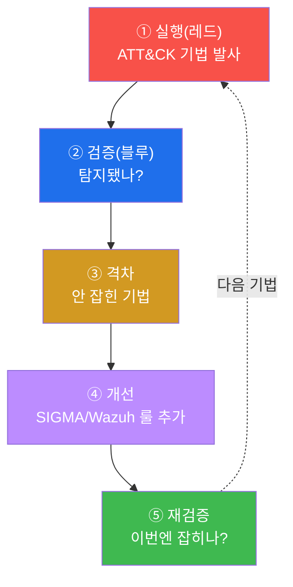
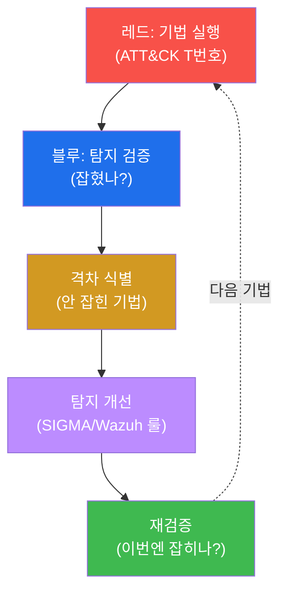
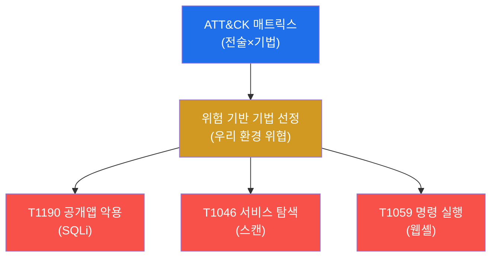
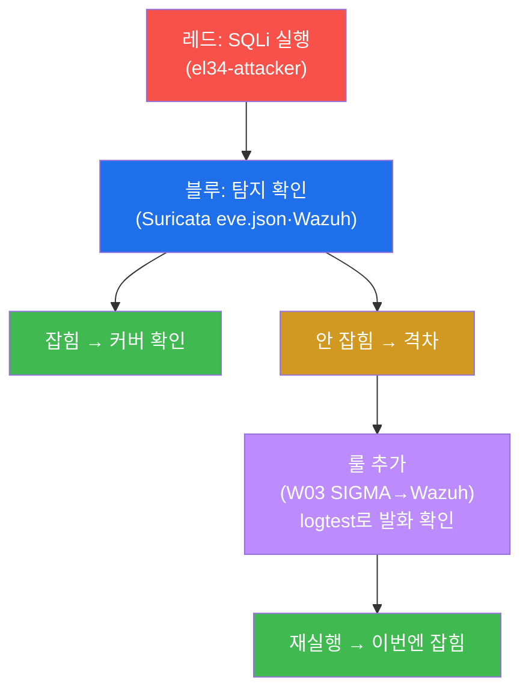
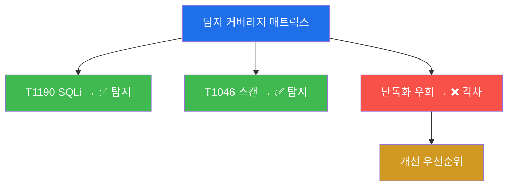

# SOC고급 W13 — 퍼플팀: 공격으로 탐지를 검증하고 격차를 메운다

> **본 주차의 한 줄 요약**
>
> 레드팀(공격)과 블루팀(방어)은 보통 적이다 — 레드는 뚫고, 블루는 막고, 끝나면 각자 보고서를 쓴다. 그런데
> 이 구도엔 큰 낭비가 있다: 레드가 찾은 약점이 블루의 탐지로 **체계적으로** 이어지지 않는다. **퍼플팀
> (purple team)** 은 둘을 한 테이블에 앉힌다 — 레드가 ATT&CK 기법을 **공개적으로** 실행하고, 블루가 그게
> 탐지되는지 **실시간으로** 확인하며, 안 잡히는 격차를 **즉시 룰로 메우고**, 재실행으로 검증한다. 본 주차에
> 학생은 el34에서 이 **실행→검증→격차→개선→재검증** 루프를 한 바퀴 돈다.
>
> **퍼플팀 한 줄 결론**: 퍼플팀의 산출물은 "뚫렸다/막았다"가 아니라 **새로운 탐지 룰과 측정된 커버리지**다.
> 적대(누가 이겼나)를 협업(탐지를 얼마나 키웠나)으로 바꾸는 것이 핵심이다.

---

## 학습 목표

본 주차 종료 시 학생은 다음 5가지를 **본인 손으로** 할 수 있어야 한다.

1. **퍼플팀**이 레드/블루 단독과 무엇이 다른지(협업·공개·측정) 설명한다.
2. **ATT&CK 매트릭스**로 테스트할 기법을 선정하고 커버리지를 추적한다.
3. **실행(레드) → 검증(블루)** 으로 탐지 여부를 확인한다.
4. **탐지 격차**(공격은 되는데 안 보이는 구간)를 식별한다.
5. 격차를 **룰로 메우고 재검증**해 측정 가능한 탐지 향상을 만든다.

---

## 0. 용어 해설

| 용어 | 영문 | 뜻 | 비유 |
|------|------|----|------|
| **레드팀** | red team | 공격 역할 | 모의 침입자 |
| **블루팀** | blue team | 방어·탐지 역할 | 경비대 |
| **퍼플팀** | purple team | 레드·블루 협업(빨강+파랑=보라) | 합동 훈련 |
| **ATT&CK** | MITRE ATT&CK | 공격 기법 표준 매트릭스 | 범죄 수법 분류표 |
| **기법** | technique | ATT&CK의 개별 공격 방법(T번호) | 개별 수법 |
| **mitre.id** | — | Wazuh 룰에 박힌 ATT&CK 매핑 | 룰의 ATT&CK 태그 |
| **탐지 커버리지** | detection coverage | 탐지 가능한 기법 비율 | 감시 범위 |
| **탐지 격차** | detection gap | 탐지 못하는 기법 구간 | 경비 사각 |
| **검증** | validation | 공격으로 탐지를 시험 | 모의 화재 점검 |
| **Atomic Red Team** | — | 기법별 단위 테스트 도구군 | 표준 시험 키트 |
| **재검증** | revalidation | 개선 후 다시 시험 | 보수 후 재점검 |

> **헷갈리기 쉬운 한 쌍 — 레드/블루 vs 퍼플.** **레드/블루 단독**은 경쟁이다 — 레드는 안 들키려 하고, 블루는
> 사후에 막으려 한다. 정보가 끝나고 나서야 공유된다. **퍼플**은 협업이다 — 레드가 "지금 T1190을 쏩니다"라고
> 공개하고, 블루가 "안 잡히네요, 룰 추가합니다"라고 즉시 반응한다. 목표가 "이기기"에서 "탐지 키우기"로 바뀐다.

---

## 0.5 신입생 친화 핵심 개념

### 0.5.1 퍼플 루프 5단계 — 한 바퀴가 격차 하나를 닫는다



이 5단계가 한 바퀴 돌면 **격차 하나가 영구히 메워진다**. 매주 돌리면 탐지가 측정 가능하게 자란다. 핵심은
④에서 끝내지 않고 ⑤ 재검증으로 "정말 닫혔나"를 입증하는 것 — 안 그러면 추측이다.

### 0.5.2 ATT&CK T번호와 Wazuh mitre.id — 룰에 ATT&CK가 박혀 있다

이번 주차에 쓰는 기법은 ATT&CK의 T번호로 관리한다.

| T번호 | 기법 | 이번 실습 |
|-------|------|-----------|
| **T1190** | Exploit Public-Facing Application | SQLi 실행(레드) |
| **T1046** | Network Service Discovery | 포트 스캔 |
| **T1110** | Brute Force | (검증 샘플 rule 5760) |

그리고 Wazuh 룰에는 `mitre.id` 가 박혀 있어, 탐지되는 순간 어떤 ATT&CK 기법인지 자동으로 분류된다 — 실습
STEP 6에서 `mitre.id: ['T1110.001', 'T1021.004']` 가 출력으로 보인다. 즉 **탐지 = 자동 ATT&CK 매핑**이라,
"우리가 매트릭스의 어느 칸을 덮는가"가 저절로 기록된다.

### 0.5.3 "차단됐어도 탐지는 별개" — 403이 나와도 검증 대상

레드가 SQLi를 쏘면 WAF가 403으로 막는다(차단 성공). 하지만 퍼플의 질문은 "막았나?"가 아니라 **"우리 눈에
잡혔나(탐지/기록)?"** 다. 차단됐어도 그 시도가 IPS eve.json·Wazuh에 남지 않으면 **탐지 격차**다 — 다음에
공격자가 차단을 우회하는 변형을 쓰면 깜깜이가 되기 때문이다. 그래서 STEP 4·5는 403 여부가 아니라 **탐지
흔적 건수**를 본다.

### 0.5.4 탐지 커버리지 매트릭스 — 빨간 칸이 곧 할 일

퍼플팀의 결과물은 **기법 × 탐지 여부** 표다.

| 기법 | 탐지 |
|------|------|
| T1190 SQLi | ✅ 커버 |
| T1046 스캔 | ✅ 커버 |
| 난독화 우회 | ❌ 격차 → 개선 우선순위 |

빨간 칸(격차)이 줄어드는 것이 **측정 가능한 방어 성숙**이다(soc W13 성숙도·W14 운영 지표와 직결).

### 0.5.5 임의로 보이는 값들

| 값 | 무엇 | 규칙 |
|----|------|------|
| **T1190 / T1110** | ATT&CK 기법 ID | MITRE 표준 번호 |
| **mitre.id** | Wazuh 룰 필드 | 룰에 매핑된 ATT&CK 기법 |
| **403** | SQLi 응답 | WAF 차단(단, 차단≠탐지, §0.5.3) |
| **rule 5760** | 내장 룰 | SSH 다중 실패(검증 샘플) |
| **마커(`purple_ready` 등)** | 단계 완료 신호 | 채점이 통과를 확인하는 약속 문자열 |

---

## 1. 왜 퍼플팀인가

### 1.1 한 줄 답: 약점 발견을 탐지 개선으로 직결시킨다

레드팀 훈련의 가치는 약점을 찾는 것이다. 그러나 찾은 약점이 블루의 탐지로 이어지지 않으면 반쪽이다. 퍼플팀은
**발견 즉시 탐지로 전환**하는 짧은 루프를 만든다 — 공격이 탐지를 검증하고, 탐지가 공격을 막는다.



### 1.2 왜 중요한가 — 측정 가능한 방어

"우리 SOC는 안전한가?"라는 질문에 막연히 답할 순 없다. 퍼플팀은 ATT&CK 기법별로 "탐지된다/안 된다"를
측정해 **커버리지를 숫자로** 만든다. 막연한 안심 대신 데이터 기반의 방어 평가가 가능해진다.

### 1.3 한계

퍼플팀은 실행한 기법만 검증한다 — 매트릭스 전체를 한 번에 다 못 한다. 그래서 위험 기반으로 우선순위를 정해
(우리 환경에 실제 위협이 되는 기법부터) 반복적으로 돌려야 한다.

---

## 2. ATT&CK 매핑 — 무엇을 검증하나



ATT&CK는 공격 기법의 공통 언어다(T번호). 퍼플팀은 매트릭스에서 **우리 환경에 실제 위협이 되는 기법**을
선정해 하나씩 검증한다. 기법을 T번호로 추적하면 "우리는 T1190은 탐지하지만 T1059 일부는 못 한다"처럼
커버리지를 체계적으로 기록할 수 있다(§0.5.2의 mitre.id로 자동 매핑).

---

## 3. 퍼플팀 루프 — el34에서

실습은 T1190(SQLi)을 el34에서 실행한다.



**실측 예 — 레드 실행 + 블루 검증.**

```bash
# 레드(el34-attacker): SQLi 발사
curl -s -o /dev/null -w "%{http_code}" -H "Host: dvwa.el34.lab" "http://10.20.30.1/?id=1%27%20OR%20%271%27=%271"
# 블루(el34-ips): 출처 탐지 흔적
tail -2000 /var/log/suricata/eve.json | grep -c "10.20.30.202"
```

```
403
1940
```

레드의 SQLi는 403(차단)이지만 핵심은 블루의 `1940` — IPS가 그 출처를 보고 있다 = 탐지 커버됨(§0.5.3). 흔적이
0이면 **탐지 격차**다. 격차는 W03의 SIGMA→Wazuh 룰로 메우고, `wazuh-logtest` 로 발화(Phase 3, rule 5760,
mitre.id)를 확인한 뒤, **재실행**으로 이번엔 잡히는지 검증한다. 루프가 닫히면 격차 하나가 영구히 메워진다.

---

## 4. 탐지 격차 · 커버리지 측정



퍼플팀의 결과물은 **기법×탐지 여부 매트릭스**다(§0.5.4). 이 매트릭스가 SOC의 탐지 커버리지를 시각화하고,
빨간 칸(격차)이 개선 우선순위가 된다. 시간이 지나며 빨간 칸이 줄어드는 것이 곧 **측정 가능한 방어 성숙**이다 —
soc 트랙 W13(SOC 성숙도)·W14(운영 지표)와 직결된다.

---

## 5. 실습 안내 (8 미션)

각 미션을 **① 왜 하는가 / ② 무엇을 알 수 있는가 / ③ 결과 해석 / ④ 실전 활용** 4축으로 설명한다. 명령은
el34 호스트에서 `docker exec` 로(STEP 1·5는 레드+블루 두 컨테이너를 함께 점검하므로 호스트에서 실행).
**인가된 실습 환경(el34)에서만**, 공격은 인가된 대상에만.

### STEP 1 — 퍼플 환경 (레드+블루)
- **왜**: 퍼플은 공격(레드)과 탐지(블루)가 한 테이블에 앉아야 성립.
- **무엇을**: el34-attacker(curl/nmap) + el34-siem(alerts.json) 둘 다 준비.
- **해석**: red_ok+blue_ok = 루프 준비(`purple_ready`).
- **실전**: 레드·블루 합동 세션의 환경 점검.

### STEP 2 — ATT&CK 선정
- **왜**: 매트릭스로 "어느 기법을 탐지하나"를 체계적으로 점검.
- **무엇을**: T1190(SQLi) 표적 도달 가능성.
- **해석**: 응답 ≠ 000이면 실행 가능(`technique_selected`). T번호로 추적.
- **실전**: 위험 기반으로 검증할 기법 선정.

### STEP 3 — 레드 실행
- **왜**: 이 공격이 블루 탐지를 시험하는 입력.
- **무엇을**: T1190 SQLi(`1' OR '1'='1`) 전송.
- **해석**: 403(차단)이어도 시도는 기록(`red_executed`). 퍼플은 공개적으로 함께 봄.
- **실전**: 언제·무엇을 쐈는지 블루와 공유.

### STEP 4 — 블루 검증
- **왜**: 퍼플의 핵심 질문 "방금 그게 잡혔나?".
- **무엇을**: IPS eve.json 출처 흔적 건수.
- **해석**: >0=탐지 커버, 0=격차(`blue_verified`). 차단≠탐지(§0.5.3).
- **실전**: 공격 직후 탐지 여부 즉시 확인.

### STEP 5 — 격차 분석
- **왜**: 격차는 '실행한 기법 × 탐지 여부' 매트릭스의 빈 칸.
- **무엇을**: 재실행 + 탐지 흔적 집계로 커버/격차 판정.
- **해석**: 흔적 있으면 커버(`gap_analyzed`). 0인 칸이 메울 격차.
- **실전**: 여러 기법을 같은 식으로 색칠해 매트릭스 완성.

### STEP 6 — 탐지 개선
- **왜**: 찾은 격차는 룰로 메워 다음부터 자동 탐지.
- **무엇을**: 룰 발화를 wazuh-logtest로 확인.
- **해석**: Phase 3 + rule 5760 + mitre.id(`detection_improved`). 탐지=자동 ATT&CK 매핑.
- **실전**: 격차를 SIGMA/Wazuh 룰로 굳혀 영구화.

### STEP 7 — 재검증
- **왜**: 격차→개선만으로 끝내면 추측 — 재실행으로 입증.
- **무엇을**: 같은 기법 재실행.
- **해석**: 재실행+재탐지로 루프 닫힘(`revalidated`). 측정 가능한 향상.
- **실전**: 매주 루프를 돌려 탐지를 성장시킴.

### STEP 8 — 퍼플팀 보고서
- **왜**: 협업으로 키운 방어를 증거로 보고.
- **무엇을**: 탐지 흔적 수를 인용한 보고서 골격.
- **해석**: 실측 인용(`purple_report_done`). 제출용은 커버리지 매트릭스 + 다음 기법 목록.
- **실전**: 적대→협업 전환의 성과를 데이터로 입증.

---

## 6. 흔한 오해·블루팀 노트

- **"차단됐으니 됐다"** — 차단(403)과 탐지(기록)는 별개다. 안 잡히면 우회 변형에 깜깜이(§0.5.3).
- **"레드가 이기면 실패"** — 퍼플은 승패가 아니다. 격차를 찾아 탐지를 키웠으면 성공.
- **"개선했으니 끝"** — 재검증(⑤) 없이는 추측. 재실행→재탐지로 루프를 닫아야 입증된다.
- **"한 번에 매트릭스 전부"** — 불가능. 위험 기반으로 우선순위 기법부터 반복적으로 돌린다.

---

## 7. 다음 주차 (W14) 예고 — SOC + AI

W13은 사람 중심의 협업 루프였다. W14는 탐지·분류·분석에 **AI/ML**을 접목하는 법과 그 한계(오탐·설명가능성·
적대적 회피)를 다룬다 — AI는 분석가를 어떻게 증폭하고 어디서 멈추는가. 퍼플팀이 측정한 커버리지가 AI 탐지의
학습·평가 기준이 된다.
