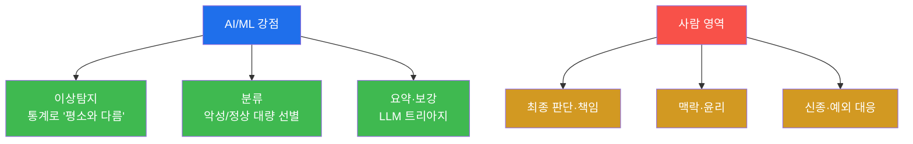
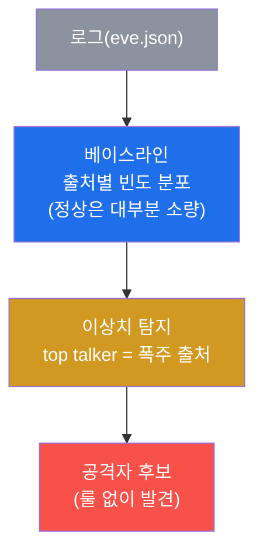
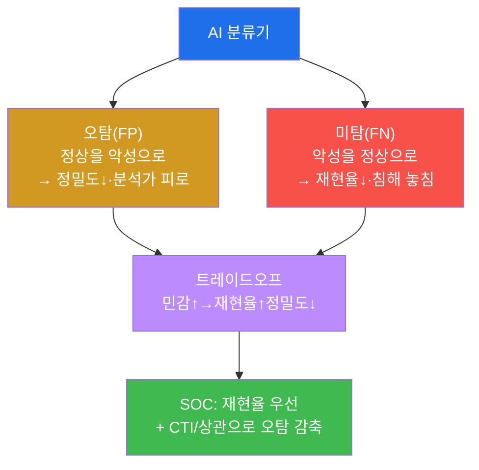
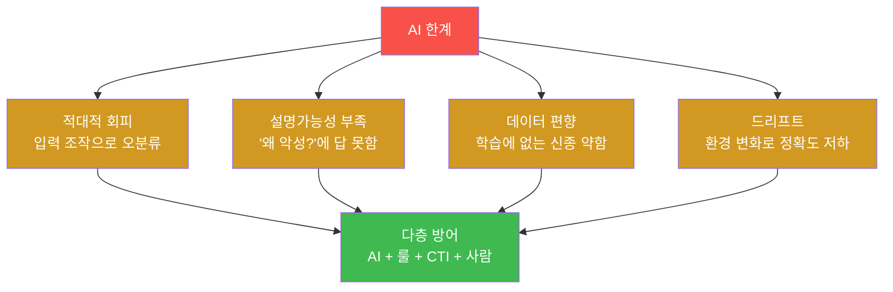

# SOC고급 W14 — SOC + AI: 분석가를 증폭하되, 책임은 사람이 진다

> **본 주차의 한 줄 요약**
>
> AI는 SOC의 만병통치약처럼 팔린다 — "AI가 알아서 다 탐지한다"는 말. 본 주차는 그 과장과 실체를 가른다.
> AI/ML은 분명 강력하다: **대량·반복·패턴** 영역(이상탐지·분류·요약)에서 사람을 압도한다. 그러나 AI는
> **판단하지 않고 책임지지 않는다** — 적대적 회피에 속고, "왜?"에 답하지 못하며, 학습하지 못한 신종엔
> 무력하다. 본 주차에 학생은 el34 로그로 **통계적 이상탐지**(베이스라인→이상치)를 직접 수행해 "룰 없이도
> 평소와 다름을 잡는" AI의 강점을 체험하고, 동시에 그 **한계와 사람 감독**의 필요를 배운다.
>
> **분석가 한 줄 결론**: AI는 분석가를 **대체**하는 게 아니라 **증폭**한다. 옳게 쓰면 한 명이 열 명 몫을
> 하고, 맹신하면 한 번의 오분류가 재앙이 된다 — AI·룰·CTI·사람을 **겹겹이** 쌓는 다층 방어가 정답이다.

---

## 학습 목표

본 주차 종료 시 학생은 다음 5가지를 **본인 손으로** 할 수 있어야 한다.

1. SOC에서 AI가 **적합한 지점**(이상탐지·분류·요약)과 **부적합한 지점**(판단·책임)을 구분한다.
2. **베이스라인(정상)** 을 세우고 **이상치(outlier)** 를 통계적으로 탐지한다.
3. **정밀도/재현율** 트레이드오프로 분류기를 평가한다.
4. **LLM 보조 분석**의 활용과 주의점(환각·민감정보)을 안다.
5. **AI의 한계**(적대적 회피·설명가능성·편향·드리프트)와 **사람 감독**의 필요를 설명한다.

---

## 0. 용어 해설

| 용어 | 영문 | 뜻 | 비유 |
|------|------|----|------|
| **이상탐지** | anomaly detection | 정상에서 벗어난 것을 찾기 | 평소와 다른 행동 감지 |
| **베이스라인** | baseline | 정상 상태의 기준 분포 | 평상시 체온 |
| **이상치** | outlier | 베이스라인에서 크게 벗어난 값 | 고열 |
| **top talker** | — | 빈도 최상위 출처(이상치 후보) | 가장 시끄러운 사람 |
| **분류** | classification | 악성/정상 등으로 나누기 | 양품/불량 선별 |
| **정밀도** | precision | 경보 중 진짜 비율(오탐↓) | 진단의 정확성 |
| **재현율** | recall | 진짜 중 잡은 비율(미탐↓) | 놓치지 않는 정도 |
| **F1** | — | 정밀도·재현율의 조화 평균 | 종합 점수 |
| **LLM** | Large Language Model | 대규모 언어 모델 | 박학한 조수 |
| **환각** | hallucination | LLM이 없는 사실을 생성 | 그럴듯한 거짓말 |
| **적대적 회피** | adversarial evasion | 입력 조작으로 AI 속이기 | 위장으로 검문 통과 |
| **드리프트** | drift | 환경 변화로 모델 정확도 저하 | 시간이 지나 안 맞는 옷 |

> **헷갈리기 쉬운 한 쌍 — 룰 기반 vs AI 이상탐지.** **룰 기반**(SIGMA·Wazuh)은 "이런 패턴이면 악성"이라고
> **명시적으로** 정의한다 — 정확하고 설명 가능하지만, 정의 안 한 건 못 잡는다. **AI 이상탐지**는 "평소와
> 다르면 의심"이라고 **통계적으로** 판단한다 — 미지의 공격도 잡을 수 있지만, 왜 이상한지 설명이 약하고
> 오탐이 많다. 둘은 상호 보완이다: 룰로 알려진 걸 잡고, 이상탐지로 미지를 발견한다.

---

## 0.5 신입생 친화 핵심 개념

### 0.5.1 AI 적합 vs 부적합 — 어디까지 맡기나

| AI에 맡길 것(강점) | 사람이 할 것 |
|---------------------|--------------|
| 이상탐지(통계로 평소와 다름) | 최종 판단·책임 |
| 분류(악성/정상 대량 선별) | 맥락·윤리 |
| 요약·보강(LLM 트리아지) | 신종·예외 대응 |

핵심: AI는 **후보를 모아 주는 보조**다. "이 사건을 어떻게 처리할까"의 결정과 그 책임은 AI가 못 진다.

### 0.5.2 베이스라인 → 이상치 — "평소를 알아야 이상이 보인다"

이상탐지의 출발은 **정상 분포(베이스라인)** 다. 출처별 이벤트 빈도를 세면 대부분은 소량, 소수가 폭주한다.

```
   1945 "src_ip":"10.20.30.202"   ← top talker(이상치 후보 = 공격자)
    991 "src_ip":"10.20.32.80"
     44 "src_ip":"10.20.31.1"
      3 "src_ip":"10.20.31.254"   ← 베이스라인(정상은 대부분 소량)
```

10.20.30.202가 압도적으로 폭주 = 베이스라인 이탈 = 이상치다. **룰을 하나도 안 쓰고** "평소와 다름"만으로
공격자 후보를 좁혔다 — 이게 이상탐지가 미지의 공격을 잡는 길이다. (단 top talker가 항상 악성은 아니다 —
정상 프록시·백업 서버도 폭주한다 → 사람 확인 필요.)

### 0.5.3 정밀도 vs 재현율 — 두 가지 실수, SOC의 선택

분류기는 두 종류의 실수를 한다. 둘을 동시에 0으로 못 만든다(트레이드오프).

| 실수 | 뜻 | 결과 |
|------|----|----|
| **오탐(FP)** | 정상을 악성으로 | 정밀도↓, 분석가 피로 |
| **미탐(FN)** | 악성을 정상으로 | 재현율↓, **침해 놓침** |

SOC는 보통 **재현율(놓치지 않기)을 우선**한다 — 침해를 놓치는 비용이 오탐을 보는 비용보다 크기 때문이다.
늘어난 오탐은 CTI 보강·상관(W02·W05)으로 줄인다.

### 0.5.4 "단순 통계도 AI다"

본 실습의 이상탐지는 빈도 세기(grep | sort | uniq -c)라는 단순 통계지만, **원리는 ML과 같다**: 정상 분포를
학습 → 이탈을 탐지. 실무의 ML은 다차원 특징(시간대·포트·바이트·시퀀스)으로 이를 정교화할 뿐, 본질은 같다.
거창한 모델이 없어도 "평소와 다름"을 재는 순간 이미 이상탐지를 하고 있다.

### 0.5.5 정직한 한계 — 난독화는 WAF도 우회한다(과신 경계)

실습 STEP 6은 평문 `UNION SELECT` 와 주석 난독화 `UN/**/ION SE/**/LECT` 를 단순 탐지기(grep)에 넣어, 난독화가
탐지를 회피하는 걸 보인다. 여기서 **중요한 정직성**: 흔히 "정규화하는 WAF는 난독화를 잡는다"고 배우지만,
el34의 실제 ModSec CRS에서는 **이 주석 난독화가 WAF조차 우회**하는 것이 attack 트랙에서 확인됐다. 즉 "정규화면
다 잡힌다"는 **과신**이다. 그래서 한 탐지(AI든 WAF든)에만 기대지 않고 다층 방어·사람 감독이 필요하다(STEP 7).

### 0.5.6 임의로 보이는 값들

| 값 | 무엇 | 규칙 |
|----|------|------|
| **top talker** | 빈도 1위 출처 | 이상치 후보(악성 보장 아님) |
| **10.20.30.202** | 폭주 출처 | el34 공격자 컨테이너 |
| **마커(`outlier_found` 등)** | 단계 완료 신호 | 채점이 통과를 확인하는 약속 문자열 |

---

## 1. AI 과장 vs 실체 — 어디에 쓰나

### 1.1 한 줄 답: 대량·반복·패턴엔 AI, 판단·책임엔 사람

AI는 사람이 지치는 곳에서 빛난다 — 하루 수백만 로그에서 패턴을 찾고, 비슷한 알림을 분류하고, 긴 로그를
요약한다. 그러나 "이 사건을 어떻게 처리할 것인가"의 **판단**과 그 **책임**은 AI가 질 수 없다.



### 1.2 왜 중요한가 — 증폭

성숙한 SOC는 AI로 단순 작업을 자동화해 **분석가가 고난도에 집중**하게 한다. AI는 분석가 수를 늘리지 않고
역량을 늘린다 — 한 명이 열 명 몫을 한다.

### 1.3 한계 — 그래서 다층

AI는 속고(적대적 회피), 설명 못 하고(블랙박스), 편향되고(학습 데이터), 시들해진다(드리프트). 단독 의존은
위험하다. 그래서 AI는 룰·CTI·사람과 **겹겹이** 쓴다(§4).

---

## 2. 이상탐지 — 정상을 알아야 이상을 안다



**실측 예 — 베이스라인 + 이상치.** 출처별 빈도를 내림차순으로 본다(§0.5.2의 분포가 실제 출력).

```bash
tail -3000 /var/log/suricata/eve.json | grep -oE '"src_ip":"[0-9.]+"' | sort | uniq -c | sort -rn | head
```

대부분의 IP는 수십 건 이하인데 `10.20.30.202` 가 1945건으로 압도적 = **top talker(이상치)**. 시그니처 룰이
그 공격을 몰라도 '빈도 이상'만으로 후보를 좁힌다. 이것이 AI 이상탐지의 힘이자, 미지의 공격(룰이 없는)을 잡는
길이다.

---

## 3. 분류 평가 · LLM 보조

**정밀도/재현율.** AI 분류기(악성/정상)는 완벽하지 않다 — 두 종류의 실수를 한다(§0.5.3).



실습 STEP 4는 eve.json에서 전체 이벤트 수와 alert(양성 분류) 수를 집계한다(예 3000건 중 alert 49건). 정밀도=
이 49건 중 진짜 비율, 재현율=실제 공격 중 49건에 포함된 비율. SOC는 보통 **놓치지 않기(재현율)** 를 우선하고,
늘어난 오탐은 CTI 보강·상관(W02·W05)으로 줄인다.

**LLM 보조.** LLM은 알림 더미를 요약하고, 낯선 로그·명령을 설명하고, 플레이북 초안을 쓰고, 자연어를 쿼리로
바꾼다(tw2 플랫폼도 채점·피드백에 LLM을 쓴다). 단 **환각**(없는 사실 생성)을 반드시 원본으로 검증하고,
민감 로그를 외부로 유출하지 않으며, 최종 결정은 사람이 한다.

---

## 4. AI 한계 · 사람 감독



실습 STEP 6은 난독화가 단순 탐지를 회피하는 걸 직접 보이고, **정직하게** "정규화 WAF조차 이 난독화를 우회당한다
(el34 실측)"까지 짚는다(§0.5.5) — 한 탐지에 대한 과신을 깨는 것이 목적이다. **사람 감독(human oversight)** 의
원칙은 W10 SOAR의 HITL과 같다 — **AI 출력은 제안(suggestion)이고, 사람이 결정(decision)한다.** 저위험은 AI
자동, 고위험은 AI 제안 + 사람 검토. 그리고 AI 한 층이 뚫려도 룰·CTI·사람이 받치는 **다층 방어**가 본질이다
(실습 STEP 7은 AI+룰 계층+사람 게이트의 다층 요소를 실제로 센다).

---

## 5. 실습 안내 (8 미션)

각 미션을 **① 왜 하는가 / ② 무엇을 알 수 있는가 / ③ 결과 해석 / ④ 실전 활용** 4축으로 설명한다. 명령은
el34 호스트에서 `docker exec` 로(STEP 7은 ips·siem 두 컨테이너를 함께 프로브하므로 호스트에서). **인가된
실습 환경(el34)에서만**, 로그 분석은 읽기 전용.

### STEP 1 — AI 적용 지점
- **왜**: AI는 만능이 아니다 — 적합한 지점에만.
- **무엇을**: AI 강점/사람 영역 정리 + eve.json 데이터 존재.
- **해석**: 데이터 있으면 이상탐지 가능(`ai_scope_done`). AI=증폭, 대체 아님.
- **실전**: AI 도입 전 적용 범위 선정.

### STEP 2 — 베이스라인
- **왜**: 이상탐지의 전제는 '정상을 안다'.
- **무엇을**: 출처별 빈도 분포(내림차순).
- **해석**: 대부분 소량, 소수 폭주가 정상 모양(`baseline_built`).
- **실전**: 환경별 정상 분포 학습.

### STEP 3 — 이상치 탐지
- **왜**: 베이스라인 이탈(top talker)이 공격자 후보.
- **무엇을**: 빈도 1위 출처.
- **해석**: top talker = 이상치(`outlier_found`). 룰 없이 미지 위협 후보. 단 악성 보장 아님.
- **실전**: 시그니처 없는 공격을 통계로 좁히기.

### STEP 4 — 분류 평가 (P/R)
- **왜**: 분류기는 정밀도·재현율 트레이드오프가 있다.
- **무엇을**: 전체 이벤트 vs alert 수.
- **해석**: alert 비율로 P/R 감(`classifier_evaluated`). SOC는 재현율 우선.
- **실전**: 분류기 튜닝 시 P/R 균형 판단.

### STEP 5 — LLM 보조
- **왜**: LLM은 요약·설명·초안에 유용 — 단 입력을 사람이 준다.
- **무엇을**: event_type 집계(LLM 요약 입력).
- **해석**: 집계 생성(`llm_assist_done`). 환각 검증·민감정보 보호 필수.
- **실전**: 알림 더미 자동 요약으로 트리아지 가속.

### STEP 6 — AI 한계 (적대적 회피)
- **왜**: 난독화로 탐지를 회피 — 단독 의존 위험.
- **무엇을**: 평문 vs 난독화 SQLi를 단순 탐지기에.
- **해석**: 난독화가 회피(`limits_done`). **WAF조차 우회**(과신 경계, §0.5.5).
- **실전**: 한 탐지에 기대지 말고 다층으로.

### STEP 7 — 사람 감독 (다층)
- **왜**: AI 출력은 제안, 결정·책임은 사람.
- **무엇을**: 룰 계층(Suricata) + 사람 게이트(disable-account) 존재.
- **해석**: 다층 요소 확인(`oversight_done`). AI 틀려도 다른 계층이 받침.
- **실전**: AI를 자동 차단 방아쇠가 아닌 분석 보조로.

### STEP 8 — SOC+AI 보고서
- **왜**: "AI는 증폭, 단독 의존 금물"을 실측 근거로.
- **무엇을**: top talker(이상치)를 인용한 보고서 골격.
- **해석**: 실측 인용(`soc_ai_report_done`). 결론: 판단·책임은 사람.
- **실전**: AI 도입 효과·한계를 균형 보고.

---

## 6. 흔한 오해·관제자 노트

- **"AI가 알아서 다 한다"** — AI는 후보를 모은다. 판단·책임은 사람(§0.5.1).
- **"top talker = 공격자"** — 정상 프록시·백업도 폭주한다. 이상치는 후보일 뿐, 사람 확인 필요.
- **"정규화 WAF면 난독화도 잡힌다"** — el34 실측은 반례다. 과신 금물, 다층 방어(§0.5.5).
- **"AI 도입하면 분석가 줄여도 된다"** — AI는 대체가 아니라 증폭. 사람 감독이 빠지면 오분류가 재앙이 된다.

---

## 7. 다음 주차 (W15) 예고 — 종합 APT 대응(캡스톤)

W14까지 SOC 고급의 각 역량(포렌식·분석·SOAR·IR·퍼플·AI)을 익혔다. W15는 이 모두를 하나의 **APT 침해
시나리오**에 쏟아붓는 종합 캡스톤 — 탐지부터 IR·교훈까지 SOC 고급 전 과정을 한 사건으로 통합한다.
