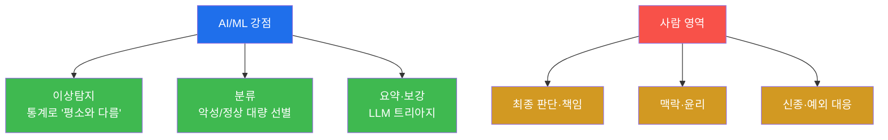
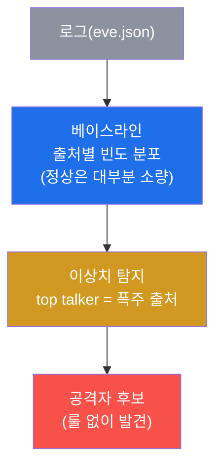
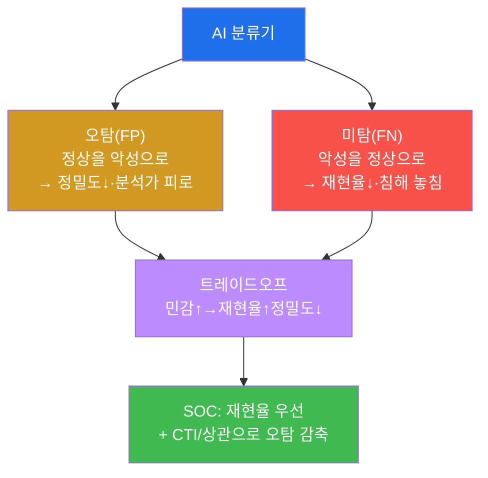
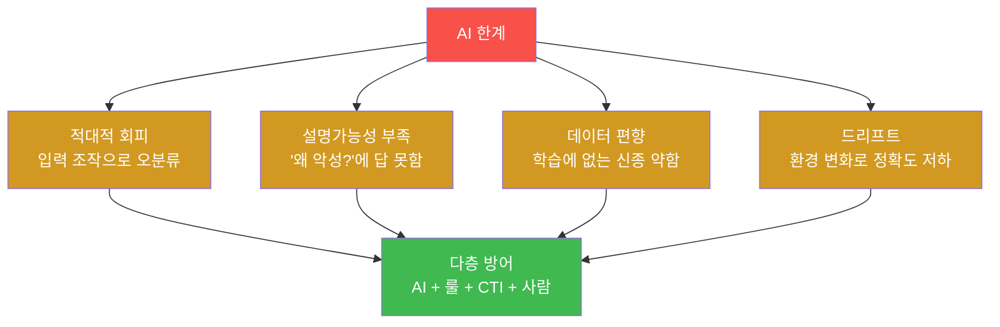

# SOC고급 W14 — SOC + AI: 분석가를 증폭하되, 책임은 사람이 진다

> **본 주차의 한 줄 요약**
>
> AI는 SOC의 만병통치약처럼 팔린다 — "AI가 알아서 다 탐지한다"는 말. 본 주차는 그 과장과 실체를 가른다.
> AI/ML은 분명 강력하다: **대량·반복·패턴** 영역(이상탐지·분류·요약)에서 사람을 압도한다. 그러나 AI는
> **판단하지 않고 책임지지 않는다** — 적대적 회피에 속고, "왜?"에 답하지 못하며, 학습하지 못한 신종엔
> 무력하다. 본 주차에 학생은 el34 로그로 **통계적 이상탐지**(베이스라인→이상치)를 직접 수행해 "룰 없이도
> 평소와 다름을 잡는" AI의 강점을 체험하고, 동시에 그 **한계와 사람 감독**의 필요를 배운다.
>
> **분석가 한 줄 결론**: AI는 분석가를 **대체**하는 게 아니라 **증폭**한다. 옳게 쓰면 한 명이 열 명 몫을
> 하고, 맹신하면 한 번의 오분류가 재앙이 된다 — AI·룰·CTI·사람을 **겹겹이** 쌓는 다층 방어가 정답이다.

---

## 학습 목표

본 주차 종료 시 학생은 다음 5가지를 **본인 손으로** 할 수 있어야 한다.

1. SOC에서 AI가 **적합한 지점**(이상탐지·분류·요약)과 **부적합한 지점**(판단·책임)을 구분한다.
2. **베이스라인(정상)** 을 세우고 **이상치(outlier)** 를 통계적으로 탐지한다.
3. **정밀도/재현율** 트레이드오프로 분류기를 평가한다.
4. **LLM 보조 분석**의 활용과 주의점(환각·민감정보)을 안다.
5. **AI의 한계**(적대적 회피·설명가능성·편향·드리프트)와 **사람 감독**의 필요를 설명한다.

---

## 0. 용어 해설

| 용어 | 영문 | 뜻 | 비유 |
|------|------|----|------|
| **이상탐지** | anomaly detection | 정상에서 벗어난 것을 찾기 | 평소와 다른 행동 감지 |
| **베이스라인** | baseline | 정상 상태의 기준 분포 | 평상시 체온 |
| **이상치** | outlier | 베이스라인에서 크게 벗어난 값 | 고열 |
| **분류** | classification | 악성/정상 등으로 나누기 | 양품/불량 선별 |
| **정밀도** | precision | 경보 중 진짜 비율 | 진단의 정확성 |
| **재현율** | recall | 진짜 중 잡은 비율 | 놓치지 않는 정도 |
| **F1** | — | 정밀도·재현율의 조화 평균 | 종합 점수 |
| **LLM** | Large Language Model | 대규모 언어 모델 | 박학한 조수 |
| **환각** | hallucination | LLM이 없는 사실을 생성 | 그럴듯한 거짓말 |
| **적대적 회피** | adversarial evasion | 입력 조작으로 AI 속이기 | 위장으로 검문 통과 |

> **헷갈리기 쉬운 한 쌍 — 룰 기반 vs AI 이상탐지.** **룰 기반**(SIGMA·Wazuh)은 "이런 패턴이면 악성"이라고
> **명시적으로** 정의한다 — 정확하고 설명 가능하지만, 정의 안 한 건 못 잡는다. **AI 이상탐지**는 "평소와
> 다르면 의심"이라고 **통계적으로** 판단한다 — 미지의 공격도 잡을 수 있지만, 왜 이상한지 설명이 약하고
> 오탐이 많다. 둘은 상호 보완이다: 룰로 알려진 걸 잡고, 이상탐지로 미지를 발견한다.

---

## 1. AI 과장 vs 실체 — 어디에 쓰나

### 1.1 한 줄 답: 대량·반복·패턴엔 AI, 판단·책임엔 사람

AI는 사람이 지치는 곳에서 빛난다 — 하루 수백만 로그에서 패턴을 찾고, 비슷한 알림을 분류하고, 긴 로그를
요약한다. 그러나 "이 사건을 어떻게 처리할 것인가"의 **판단**과 그 **책임**은 AI가 질 수 없다.

### 1.2 왜 중요한가 — 증폭

성숙한 SOC는 AI로 단순 작업을 자동화해 **분석가가 고난도에 집중**하게 한다. AI는 분석가 수를 늘리지 않고
역량을 늘린다 — 한 명이 열 명 몫을 한다.

### 1.3 한계 — 그래서 다층

AI는 속고(적대적 회피), 설명 못 하고(블랙박스), 편향되고(학습 데이터), 시들해진다(드리프트). 단독 의존은
위험하다. 그래서 AI는 룰·CTI·사람과 **겹겹이** 쓴다(§4).

---

## 2. 이상탐지 — 정상을 알아야 이상을 안다

이상탐지의 핵심은 **베이스라인**이다 — 정상이 무엇인지 알아야 이상을 안다. 실습에서 Suricata eve.json의
출처별 이벤트 빈도를 세면, 대부분의 IP는 소량이고 소수가 폭주한다. 이 **폭주 출처(top talker)** 가
베이스라인 대비 이상치이자 공격자 후보다 — **룰을 하나도 안 썼는데** "평소와 다름"만으로 의심 대상을 찾았다.
이것이 AI 이상탐지의 힘이자, 미지의 공격(룰이 없는)을 잡는 길이다.

> **단순 통계도 AI의 일부다.** 본 실습은 빈도 기반 단순 이상탐지지만, 원리는 같다 — 정상 분포 학습 →
> 이탈 탐지. 실무의 ML은 다차원 특징(시간대·포트·바이트·시퀀스)으로 이를 정교화한다.

---

## 3. 분류 평가 · LLM 보조

**정밀도/재현율.** AI 분류기(악성/정상)는 완벽하지 않다 — 두 종류의 실수를 한다.

SOC는 보통 **놓치지 않기(재현율)** 를 우선하고, 늘어난 오탐은 CTI 보강·상관(W02·W05)으로 줄인다 — 침해를
놓치는 비용이 오탐을 보는 비용보다 크기 때문이다.

**LLM 보조.** LLM은 알림 더미를 요약하고, 낯선 로그·명령을 설명하고, 플레이북 초안을 쓰고, 자연어를 쿼리로
바꾼다(tw2 플랫폼도 채점·피드백에 LLM을 쓴다). 단 **환각**(없는 사실 생성)을 반드시 원본으로 검증하고,
민감 로그를 외부로 유출하지 않으며, 최종 결정은 사람이 한다.

---

## 4. AI 한계 · 사람 감독

네 한계 모두 "AI를 단독으로 믿으면 안 되는" 이유다. **사람 감독(human oversight)** 의 원칙은 W10 SOAR의
HITL과 같다 — **AI 출력은 제안(suggestion)이고, 사람이 결정(decision)한다.** 저위험은 AI 자동, 고위험은 AI
제안 + 사람 검토. 그리고 AI 한 층이 뚫려도 룰·CTI·사람이 받치는 **다층 방어**가 본질이다.

---

## 5. 실습 안내 (8 미션)

1. **AI 적용 지점**. 2. **베이스라인**. 3. **이상치 탐지**. 4. **분류 평가**(P/R). 5. **LLM 보조**.
6. **AI 한계**. 7. **사람 감독**. 8. **보고서**.

> 명령은 el34 호스트에서 `docker exec`로. **인가된 실습 환경(el34)에서만**, 로그 분석은 읽기 전용.

---

## 6. 다음 주차 (W15) 예고 — 종합 APT 대응(캡스톤)

W14까지 SOC 고급의 각 역량(포렌식·분석·SOAR·IR·퍼플·AI)을 익혔다. W15는 이 모두를 하나의 **APT 침해
시나리오**에 쏟아붓는 종합 캡스톤 — 탐지부터 IR·교훈까지 SOC 고급 전 과정을 한 사건으로 통합한다.
