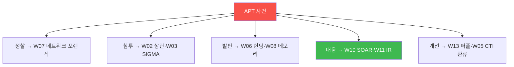
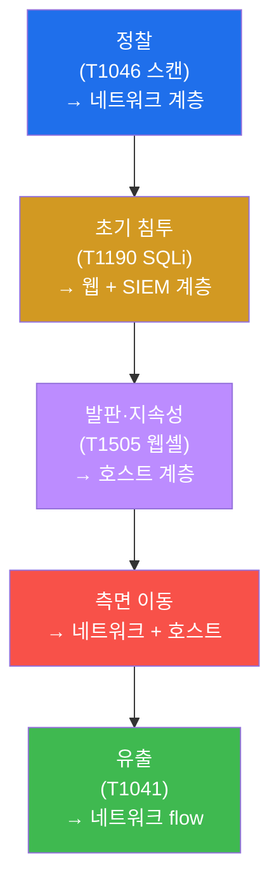
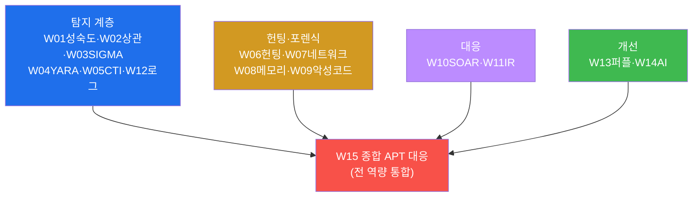
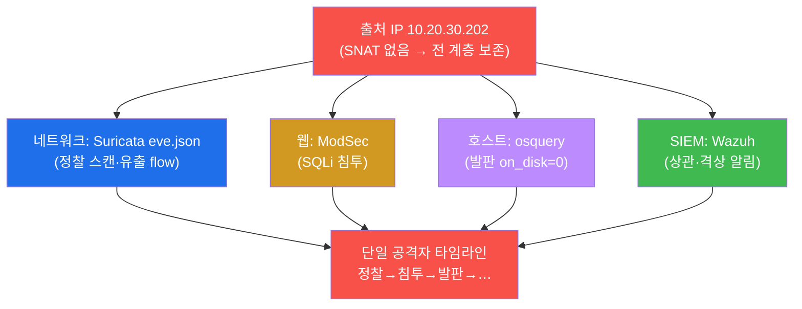
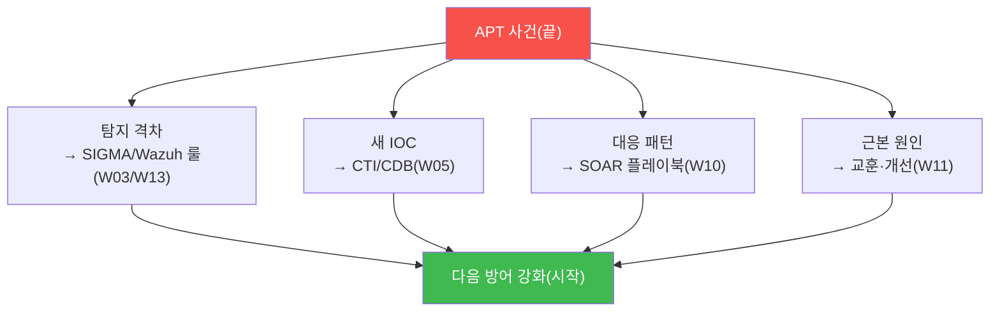

# SOC고급 W15 — 종합 APT 대응: 모든 역량을 하나의 사건에 쏟는다 (캡스톤)

> **본 주차의 한 줄 요약**
>
> 14주 동안 학생은 SOC 고급의 각 역량을 따로따로 익혔다 — 성숙도(W01)·상관(W02)·SIGMA(W03)·YARA(W04)·
> CTI(W05)·헌팅(W06)·포렌식(W07/W08)·악성코드 분석(W09)·SOAR(W10)·IR(W11)·로그(W12)·퍼플팀(W13)·AI(W14).
> 본 주차는 이 모두를 **하나의 APT 침해 사건**에 쏟아붓는 캡스톤이다. **APT(지능형 지속 위협)** 는 한 번의
> 공격이 아니라 정찰→침투→발판→측면이동→유출로 이어지는 **느리고 은밀한 캠페인**이다 — 그래서 한 계층의
> 탐지로는 절대 못 잡는다. 본 주차에 학생은 el34의 4개 계층(네트워크·웹·호스트·SIEM)을 모두 동원해 킬체인을
> 탐지하고, 출처 IP로 교차 상관하고, IR/SOAR로 대응하고, ATT&CK 매핑과 탐지 환류로 완결한다.
>
> **분석가 한 줄 결론**: APT 대응의 본질은 **통합**이다. 다계층 가시성으로 흩어진 신호를 모으고, 교차
> 상관으로 한 사건의 이야기로 엮고, 신속히 대응하고, 교훈을 환류한다 — 이 통합이 SOC 고급의 완성이다.

---

## 학습 목표

본 주차 종료 시 학생은 다음 5가지를 **본인 손으로** 할 수 있어야 한다.

1. **APT 킬체인**(정찰→침투→발판→…)을 이해하고 단계별 탐지 계층을 매핑한다.
2. **다계층 탐지**(네트워크 Suricata·웹 ModSec·호스트 osquery·SIEM Wazuh)를 동원한다.
3. **출처 IP 교차 상관**으로 다계층 신호를 한 공격자의 타임라인으로 통합한다.
4. **IR(PICERL) + SOAR** 로 통합 대응한다.
5. 사건을 **ATT&CK로 매핑**하고 **탐지·인텔·플레이북으로 환류**한다.

---

## 0. 용어 해설

| 용어 | 영문 | 뜻 | 비유 |
|------|------|----|------|
| **APT** | Advanced Persistent Threat | 지능형 지속 위협(은밀한 장기 캠페인) | 장기 잠입 간첩 |
| **킬체인** | kill chain | 공격의 단계적 흐름 | 범행 단계 |
| **정찰** | reconnaissance | 표적 정보 수집(스캔 등) | 사전 답사 |
| **초기 침투** | initial access | 첫 진입(취약점 악용) | 담 넘기 |
| **발판** | foothold | 지속 접근 거점(웹셸·백도어) | 잠입 후 은신처 |
| **측면 이동** | lateral movement | 내부로 확산 | 건물 내 이동 |
| **유출** | exfiltration | 데이터 빼내기 | 절도품 반출 |
| **다계층 탐지** | layered detection | 여러 계층에서 동시 탐지 | 다중 경비망 |
| **교차 상관** | cross-correlation | 여러 소스를 한 사건으로 묶기 | 단서 종합 |
| **캡스톤** | capstone | 전 과정 통합 종합 과제 | 졸업 작품 |

> **헷갈리기 쉬운 한 쌍 — 단발 공격 vs APT.** **단발 공격**은 한 번의 SQLi처럼 시작과 끝이 분명하다 — 한
> 계층(웹 WAF)이 잡으면 끝. **APT**는 정찰부터 유출까지 **여러 단계가 여러 날에 걸쳐** 일어난다 — 각 단계는
> 다른 계층에 흔적을 남기고, 따로 보면 "사소한 알림"이지만 **이어 보면 침해 캠페인**이다. APT를 잡는 열쇠는
> 개별 탐지가 아니라 **흩어진 신호를 잇는 상관**이다.

---

## 0.5 신입생 친화 핵심 개념

### 0.5.1 킬체인 단계 × 탐지 계층 — 어느 단계가 어디에 남나

APT의 각 단계는 **서로 다른 계층**에 흔적을 남긴다. 그래서 한 계층만 보면 반드시 놓친다.

| 킬체인 단계 | ATT&CK | 주로 잡는 계층 |
|-------------|--------|----------------|
| 정찰(스캔) | T1046 | **네트워크**(Suricata) — 웹 로그엔 안 남음 |
| 초기 침투(SQLi) | T1190 | **웹**(ModSec) + **SIEM**(Wazuh) |
| 발판(웹셸) | T1505 | **호스트**(osquery) — 네트워크·웹은 못 봄 |
| 측면 이동 | — | 네트워크 + 호스트 |
| 유출 | T1041 | **네트워크 flow**(대량 전송) |

이 표가 캡스톤의 지도다 — 각 단계를 그 계층의 도구로 잡고, 출처 IP로 묶는다.

### 0.5.2 왜 한 계층으로는 APT를 못 잡나

웹 WAF만 보는 SOC를 생각해 보자. 정찰(포트 스캔)은 HTTP가 아니라 raw TCP라 **WAF에 안 남는다**. 발판(웹셸
프로세스)도 디스크/메모리 행위라 **WAF가 못 본다**. WAF는 침투(SQLi) 한 단계만 본다 — 즉 APT의 5단계 중 1개만.
나머지 4단계가 깜깜이면 "사소한 SQLi 알림 하나"로 끝나고 캠페인 전체를 놓친다. **다계층 가시성이 APT 탐지의
전제**인 이유다.

### 0.5.3 출처 IP — 흩어진 단계를 하나로 묶는 열쇠

각 단계가 다른 계층에 남아도, 그것들이 **같은 공격자**임을 묶지 못하면 따로 노는 알림일 뿐이다. 묶는 열쇠가
**출처 IP**다. el34는 fw가 SNAT를 하지 않아 출처 `10.20.30.202` 가 네트워크·웹·호스트·SIEM 전 계층에 보존
되고(W12 정규화가 `srcip` 으로 통일), 이 한 IP로 정찰+침투+발판을 **단일 타임라인**으로 복원한다. SNAT로
출처가 뭉개지는 상용 환경에서 APT 추적이 어려운 가장 큰 이유가 바로 이 출처 소실이다.

### 0.5.4 캡스톤은 새 지식이 아니라 "동원"의 시험

W15는 새 기법을 배우지 않는다. 14주 역량을 **언제 어떤 상황에 꺼내 쓸지**를 시험한다.



각 상황에 맞는 도구를 골라 쓰는 것이 종합 역량이다 — 정찰엔 네트워크 탐지, 발판엔 호스트 헌팅처럼.

### 0.5.5 임의로 보이는 값들

| 값 | 무엇 | 규칙 |
|----|------|------|
| **T1046/T1190/T1505/T1041** | ATT&CK 기법 | 정찰/침투/발판/유출 |
| **10.20.30.202** | 출처 IP | el34 공격자(전 계층 보존, 통합 열쇠) |
| **on_disk=0** | osquery(발판) | 삭제 후 실행 중 웹셸/백도어 |
| **마커(`capstone_ready` 등)** | 단계 완료 신호 | 채점이 통과를 확인하는 약속 문자열 |

---

## 1. APT란 — 한 계층으로 못 잡는 위협

### 1.1 한 줄 답: 느리고, 은밀하고, 다단계다

APT는 빠르게 치고 빠지지 않는다. 정찰로 약점을 찾고, 조용히 침투하고, 발판을 심어 잠복하고, 천천히 내부로
번져, 마침내 데이터를 빼낸다. 각 단계는 **의도적으로 눈에 안 띄게** 설계된다 — 그래서 한 계층의 룰 하나로는
절대 전체를 못 본다(§0.5.2).



### 1.2 왜 중요한가 — 통합 방어

각 단계가 다른 계층에 흔적을 남기므로, **다계층 가시성**이 필수다. 그리고 흩어진 흔적을 **교차 상관**으로
이어야 "이건 사소한 스캔이 아니라 APT의 1단계"임이 드러난다. APT 대응은 통합 능력의 시험이다.

### 1.3 한계 — 완벽한 탐지는 없다

APT는 진화한다 — 새 우회, 새 기법. 그래서 탐지는 영원히 미완이고, **퍼플팀(W13)·환류**로 끊임없이
커버리지를 넓혀야 한다. 캡스톤의 마지막이 "환류"인 이유다.

---

## 2. 14주 역량 지도 — 캡스톤에서 하나로



캡스톤은 새 지식을 배우지 않는다 — 14주의 역량을 **언제 어떻게 동원할지**를 시험한다(§0.5.4). 정찰은 네트워크
탐지로, 침투는 웹+SIEM으로, 발판은 호스트 헌팅으로 — 각 상황에 맞는 도구를 골라 쓰는 것이 종합 역량이다.

---

## 3. 교차 상관 — 통합 포렌식의 심장



이것이 캡스톤의 핵심이다(§0.5.3). **실측 예 — 출처 IP 교차 상관.**

```bash
# el34-ips: 네트워크 흔적
tail -3000 /var/log/suricata/eve.json | grep -c 10.20.30.202     # → 2935
# el34-siem: SIEM 흔적
tail -2000 /var/ossec/logs/alerts/alerts.json | grep -c 10.20.30.202  # → 1772
```

같은 IP `10.20.30.202` 가 네트워크 2935건+SIEM 1772건으로 양 계층에 보인다 = '네트워크에서 스캔하던 그 IP가
SIEM에서도 웹 공격으로 잡힌다'를 한 사건으로 통합. 따로 보면 사소한 알림들이, 이어 보면 APT 캠페인이 된다 —
W02 SIEM 상관, W07 네트워크 포렌식, W12 로그 정규화가 여기서 하나로 작동한다.

---

## 4. 통합 대응 · ATT&CK 환류

**통합 대응.** 식별된 APT를 IR(W11) PICERL로 다룬다 — 격리(SOAR firewall-drop으로 출처 차단+망 분리),
근절(웹셸·발판 제거+패치), 복구(검증). 반복 단계는 SOAR(W10) 플레이북으로 자동화하되, 고위험·비가역
액션엔 사람 승인(HITL)을 둔다.

**ATT&CK 매핑 · 환류.** 사건을 ATT&CK T번호로 기록(T1046→T1190→T1505→…)하면 커버리지가 체계화된다.



탐지 격차는 SIGMA/Wazuh 룰로, 새 IOC는 CTI/CDB로, 대응 패턴은 플레이북으로 환류한다. **사건은 끝이 아니라
다음 방어의 시작**이다.

---

## 5. 실습 안내 (8 미션, 캡스톤)

각 미션을 **① 왜 하는가 / ② 무엇을 알 수 있는가 / ③ 결과 해석 / ④ 실전 활용** 4축으로 설명한다. 명령은
el34 호스트에서 `docker exec`(attacker/web/ips/siem)로(STEP 1·5·7·8은 여러 컨테이너를 함께 프로브하므로
호스트에서). **인가된 실습 환경(el34)에서만**, 대응은 드라이런(실차단 미발동). 이 캡스톤은 W01~W14 통합 시험이다.

### STEP 1 — 통합 환경 (4계층)
- **왜**: APT는 한 계층으로 못 잡는다 — 시작 전 다계층 가동 확인.
- **무엇을**: 네트워크(IPS)·SIEM(Wazuh)·호스트(osquery) 가동.
- **해석**: 셋 다 ok면 다계층 추적 준비(`capstone_ready`).
- **실전**: 사건 대응 전 가시성 점검.

### STEP 2 — 정찰 탐지 (T1046)
- **왜**: APT 1단계는 정찰 — 네트워크 계층만 본다.
- **무엇을**: 포트 스캔 → 열린 포트 수.
- **해석**: 스캔 수행(`recon_detected`). eve.json에 출처로 기록. T1046.
- **실전**: 웹 로그에 없는 정찰을 네트워크에서 포착.

### STEP 3 — 초기 침투 탐지 (T1190)
- **왜**: 정찰 후 취약 웹앱 공격 — 웹+SIEM 다계층 탐지.
- **무엇을**: SQLi 탈취 시도 → 응답코드.
- **해석**: 403(차단)이어도 기록(`intrusion_detected`). T1190. 킬체인 이어짐.
- **실전**: 같은 출처의 정찰→침투 연결 인지.

### STEP 4 — 발판 헌팅 (T1505)
- **왜**: 침투 성공 시 웹셸·백도어 — 호스트 계층만 본다.
- **무엇을**: osquery on_disk=0 은닉 발판.
- **해석**: 0=발판 없음(WAF가 침투 차단, `foothold_hunted`). 실침해면 웹셸 잡힘. T1505.
- **실전**: 침투 후 행위는 호스트 헌팅으로.

### STEP 5 — 교차 상관 (통합 포렌식)
- **왜**: 캡스톤의 핵심 — 출처 IP로 전 계층을 한 타임라인으로.
- **무엇을**: 네트워크·SIEM의 같은 출처 흔적 수.
- **해석**: 양 계층에 보이면 통합(`correlated`). SNAT 없어 출처 보존(§0.5.3).
- **실전**: 흩어진 단계를 한 공격자 사건으로 엮기.

### STEP 6 — IR/SOAR 대응
- **왜**: 탐지로 끝이 아니다 — 격리·근절·복구 + 자동화.
- **무엇을**: PICERL+SOAR 흐름 + firewall-drop 실재.
- **해석**: 격리 액션 확인(`response_done`, 드라이런). 비가역은 HITL.
- **실전**: 탐지를 실제 대응으로 연결.

### STEP 7 — ATT&CK 매핑·환류
- **왜**: 사건은 다음 방어의 시작 — 격차를 환류.
- **무엇을**: 다계층 탐지 건수 + ATT&CK 매핑·환류 경로.
- **해석**: T1046→T1190→T1505 매핑(`feedback_done`). 격차→룰/CTI/플레이북.
- **실전**: 커버리지를 체계화하고 빈 칸을 메움.

### STEP 8 — 종합 캡스톤 보고서
- **왜**: APT 대응의 완성을 실측 증거로 마무리.
- **무엇을**: 다계층 탐지 건수를 인용한 캡스톤 보고서.
- **해석**: 실측 인용(`apt_capstone_report_done`). 킬체인 타임라인+ATT&CK+IR 종합.
- **실전**: W01~W14 전 역량을 한 사건 보고서로 통합.

---

## 6. 흔한 오해·관제자 노트

- **"WAF만 있으면 APT도 막는다"** — WAF는 침투 한 단계만 본다. 정찰·발판·유출은 다른 계층(§0.5.2).
- **"알림이 따로따로니 사소하다"** — 출처 IP로 이으면 APT 캠페인이다. 상관이 핵심(§0.5.3).
- **"막았으면 끝"** — APT는 진화한다. 환류(룰/CTI/플레이북)로 다음 사이클을 강화해야 한다.
- **"캡스톤은 새 기법"** — 아니다. 14주 역량을 상황에 맞게 동원하는 통합 시험이다(§0.5.4).

---

## 7. SOC 고급 과정을 마치며

15주 동안 학생은 SIEM 운영자에서 **위협을 사냥하고, 침해를 복원하고, 대응을 자동화하고, 탐지를 진화시키는**
SOC 고급 분석가로 성장했다. APT처럼 정교한 위협은 단일 기술이 아니라 **통합된 역량**으로 막는다 — 다계층
가시성, 교차 상관, 신속 대응, 끊임없는 환류. 이 통합의 사고방식이 여러분이 가져갈 가장 큰 자산이다.

> **다음 여정.** SOC 고급을 마친 학생은 attack-adv(공격 고급)로 공격자의 시야를 익혀 방어를 더 깊이
> 이해하거나, compliance/cloud-container 트랙으로 거버넌스·클라우드 보안으로 확장할 수 있다. 공격을 알아야
> 방어가 깊어진다.
