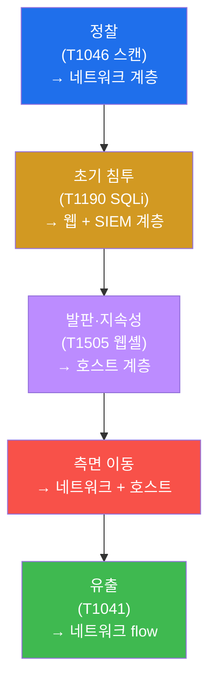
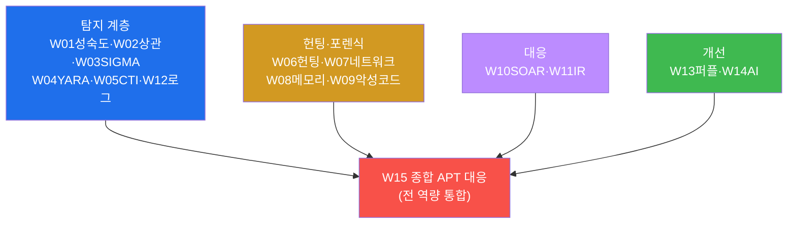
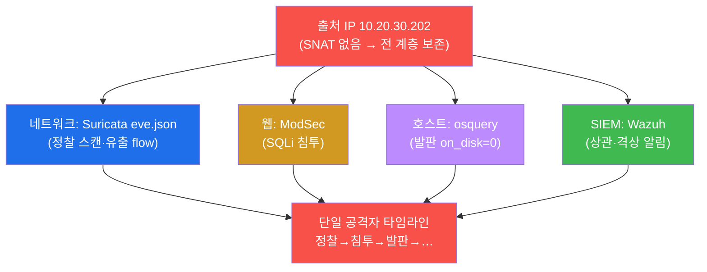

# SOC고급 W15 — 종합 APT 대응: 모든 역량을 하나의 사건에 쏟는다 (캡스톤)

> **본 주차의 한 줄 요약**
>
> 14주 동안 학생은 SOC 고급의 각 역량을 따로따로 익혔다 — 성숙도(W01)·상관(W02)·SIGMA(W03)·YARA(W04)·
> CTI(W05)·헌팅(W06)·포렌식(W07/W08)·악성코드 분석(W09)·SOAR(W10)·IR(W11)·로그(W12)·퍼플팀(W13)·AI(W14).
> 본 주차는 이 모두를 **하나의 APT 침해 사건**에 쏟아붓는 캡스톤이다. **APT(지능형 지속 위협)** 는 한 번의
> 공격이 아니라 정찰→침투→발판→측면이동→유출로 이어지는 **느리고 은밀한 캠페인**이다 — 그래서 한 계층의
> 탐지로는 절대 못 잡는다. 본 주차에 학생은 el34의 4개 계층(네트워크·웹·호스트·SIEM)을 모두 동원해 킬체인을
> 탐지하고, 출처 IP로 교차 상관하고, IR/SOAR로 대응하고, ATT&CK 매핑과 탐지 환류로 완결한다.
>
> **분석가 한 줄 결론**: APT 대응의 본질은 **통합**이다. 다계층 가시성으로 흩어진 신호를 모으고, 교차
> 상관으로 한 사건의 이야기로 엮고, 신속히 대응하고, 교훈을 환류한다 — 이 통합이 SOC 고급의 완성이다.

---

## 학습 목표

본 주차 종료 시 학생은 다음 5가지를 **본인 손으로** 할 수 있어야 한다.

1. **APT 킬체인**(정찰→침투→발판→…)을 이해하고 단계별 탐지 계층을 매핑한다.
2. **다계층 탐지**(네트워크 Suricata·웹 ModSec·호스트 osquery·SIEM Wazuh)를 동원한다.
3. **출처 IP 교차 상관**으로 다계층 신호를 한 공격자의 타임라인으로 통합한다.
4. **IR(PICERL) + SOAR** 로 통합 대응한다.
5. 사건을 **ATT&CK로 매핑**하고 **탐지·인텔·플레이북으로 환류**한다.

---

## 강의 시간 배분 (총 4시간, 캡스톤)

| 시간        | 내용                                                                | 유형      |
|-------------|---------------------------------------------------------------------|-----------|
| 0:00–0:30   | 이론 — APT란, 킬체인, 다계층 방어의 필요                            | 강의      |
| 0:30–1:00   | 이론 — 14주 역량 지도, 통합의 원리                                  | 강의      |
| 1:00–1:10   | 휴식                                                                 | —         |
| 1:10–1:40   | 이론 — 교차 상관·통합 대응·환류                                      | 강의/토론 |
| 1:40–2:20   | 실습 — 킬체인 다계층 탐지(정찰·침투·발판)                            | 실습      |
| 2:20–2:50   | 실습 — 교차 상관(통합 포렌식)                                        | 실습      |
| 2:50–3:00   | 휴식                                                                 | —         |
| 3:00–3:40   | 실습 — IR/SOAR 대응 + ATT&CK 환류 + 보고서                           | 실습      |
| 3:40–4:00   | 캡스톤 발표 + 과정 총정리                                            | 정리      |

---

## 0. 용어 해설

| 용어 | 영문 | 뜻 | 비유 |
|------|------|----|------|
| **APT** | Advanced Persistent Threat | 지능형 지속 위협(은밀한 장기 캠페인) | 장기 잠입 간첩 |
| **킬체인** | kill chain | 공격의 단계적 흐름 | 범행 단계 |
| **정찰** | reconnaissance | 표적 정보 수집(스캔 등) | 사전 답사 |
| **초기 침투** | initial access | 첫 진입(취약점 악용) | 담 넘기 |
| **발판** | foothold | 지속 접근 거점(웹셸·백도어) | 잠입 후 은신처 |
| **측면 이동** | lateral movement | 내부로 확산 | 건물 내 이동 |
| **유출** | exfiltration | 데이터 빼내기 | 절도품 반출 |
| **다계층 탐지** | layered detection | 여러 계층에서 동시 탐지 | 다중 경비망 |
| **교차 상관** | cross-correlation | 여러 소스를 한 사건으로 묶기 | 단서 종합 |
| **캡스톤** | capstone | 전 과정 통합 종합 과제 | 졸업 작품 |

> **헷갈리기 쉬운 한 쌍 — 단발 공격 vs APT.** **단발 공격**은 한 번의 SQLi처럼 시작과 끝이 분명하다 — 한
> 계층(웹 WAF)이 잡으면 끝. **APT**는 정찰부터 유출까지 **여러 단계가 여러 날에 걸쳐** 일어난다 — 각 단계는
> 다른 계층에 흔적을 남기고, 따로 보면 "사소한 알림"이지만 **이어 보면 침해 캠페인**이다. APT를 잡는 열쇠는
> 개별 탐지가 아니라 **흩어진 신호를 잇는 상관**이다.

---

## 1. APT란 — 한 계층으로 못 잡는 위협

### 1.1 한 줄 답: 느리고, 은밀하고, 다단계다

APT는 빠르게 치고 빠지지 않는다. 정찰로 약점을 찾고, 조용히 침투하고, 발판을 심어 잠복하고, 천천히 내부로
번져, 마침내 데이터를 빼낸다. 각 단계는 **의도적으로 눈에 안 띄게** 설계된다 — 그래서 한 계층의 룰 하나로는
절대 전체를 못 본다.

### 1.2 왜 중요한가 — 통합 방어

각 단계가 다른 계층에 흔적을 남기므로, **다계층 가시성**이 필수다. 그리고 흩어진 흔적을 **교차 상관**으로
이어야 "이건 사소한 스캔이 아니라 APT의 1단계"임이 드러난다. APT 대응은 통합 능력의 시험이다.

### 1.3 한계 — 완벽한 탐지는 없다

APT는 진화한다 — 새 우회, 새 기법. 그래서 탐지는 영원히 미완이고, **퍼플팀(W13)·환류**로 끊임없이
커버리지를 넓혀야 한다. 캡스톤의 마지막이 "환류"인 이유다.

---

## 2. 14주 역량 지도 — 캡스톤에서 하나로

캡스톤은 새 지식을 배우지 않는다 — 14주의 역량을 **언제 어떻게 동원할지**를 시험한다. 정찰은 네트워크 탐지로,
침투는 웹+SIEM으로, 발판은 호스트 헌팅으로 — 각 상황에 맞는 도구를 골라 쓰는 것이 종합 역량이다.

---

## 3. 교차 상관 — 통합 포렌식의 심장

이것이 캡스톤의 핵심이다. el34는 SNAT를 하지 않아 **출처 IP가 모든 계층에 보존**된다(W12 정규화가 이를
`srcip`으로 통일). 그래서 출처 IP 하나로 네트워크·웹·호스트·SIEM의 흩어진 흔적을 모아 **단일 공격자의
타임라인**을 복원한다 — W02 SIEM 상관, W07 네트워크 포렌식, W12 로그 정규화가 여기서 하나로 작동한다. 따로
보면 사소한 알림들이, 이어 보면 APT 캠페인이 된다.

---

## 4. 통합 대응 · ATT&CK 환류

**통합 대응.** 식별된 APT를 IR(W11) PICERL로 다룬다 — 격리(SOAR firewall-drop으로 출처 차단+망 분리),
근절(웹셸·발판 제거+패치), 복구(검증). 반복 단계는 SOAR(W10) 플레이북으로 자동화하되, 고위험·비가역
액션엔 사람 승인(HITL)을 둔다.

**ATT&CK 매핑 · 환류.** 사건을 ATT&CK T번호로 기록(T1046→T1190→T1505→…)하면 커버리지가 체계화된다. 탐지
격차는 SIGMA/Wazuh 룰(W03/W13)로, 새 IOC는 CTI/CDB(W05)로, 대응 패턴은 플레이북(W10)으로 환류한다. 그리고
교훈(W11)으로 근본 원인과 개선 과제를 도출한다 — **사건은 끝이 아니라 다음 방어의 시작**이다.

---

## 5. 실습 안내 (8 미션, 캡스톤)

1. **통합 환경**(4계층). 2. **정찰 탐지**(T1046). 3. **초기 침투 탐지**(T1190). 4. **발판 헌팅**(T1505).
5. **교차 상관**(통합 포렌식). 6. **IR/SOAR 대응**. 7. **ATT&CK 매핑·환류**. 8. **종합 보고서**.

> 명령은 el34 호스트에서 `docker exec`(attacker/web/ips/siem)로. **인가된 실습 환경(el34)에서만**, 대응은
> 드라이런(실차단 미발동). 이 캡스톤은 W01~W14 통합 시험이다.

---

## 6. SOC 고급 과정을 마치며

15주 동안 학생은 SIEM 운영자에서 **위협을 사냥하고, 침해를 복원하고, 대응을 자동화하고, 탐지를 진화시키는**
SOC 고급 분석가로 성장했다. APT처럼 정교한 위협은 단일 기술이 아니라 **통합된 역량**으로 막는다 — 다계층
가시성, 교차 상관, 신속 대응, 끊임없는 환류. 이 통합의 사고방식이 여러분이 가져갈 가장 큰 자산이다.

> **다음 여정.** SOC 고급을 마친 학생은 attack-adv(공격 고급)로 공격자의 시야를 익혀 방어를 더 깊이
> 이해하거나, compliance/cloud-container 트랙으로 거버넌스·클라우드 보안으로 확장할 수 있다. 공격을 알아야
> 방어가 깊어진다.
