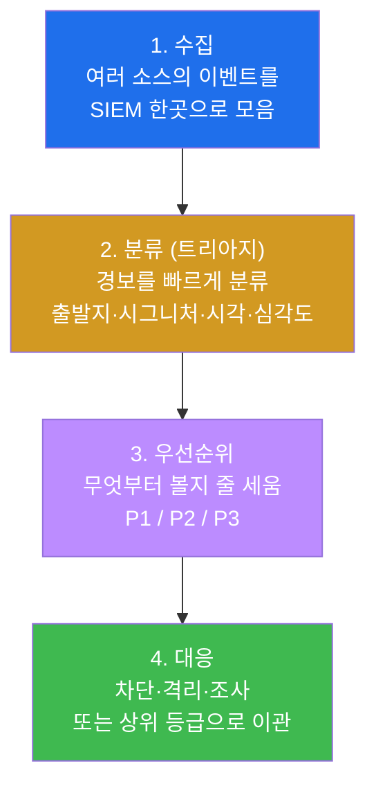
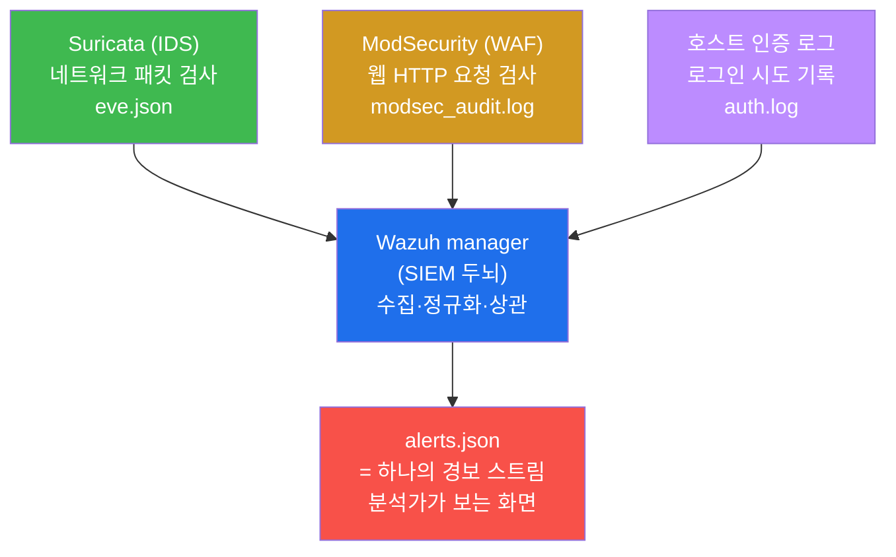
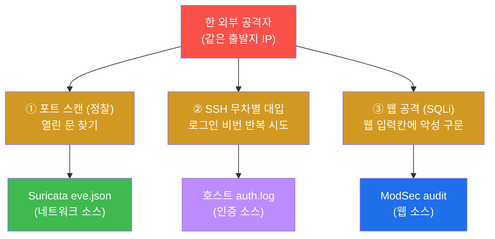
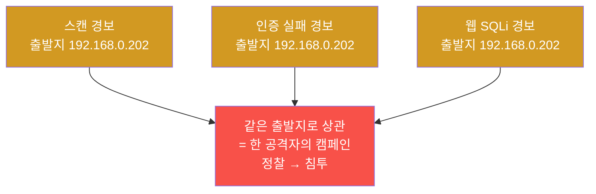
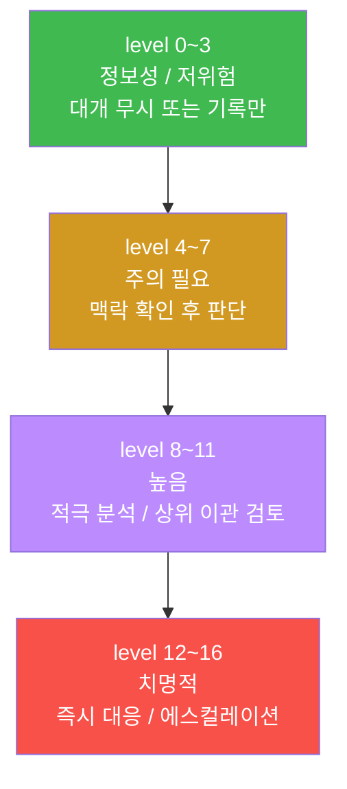
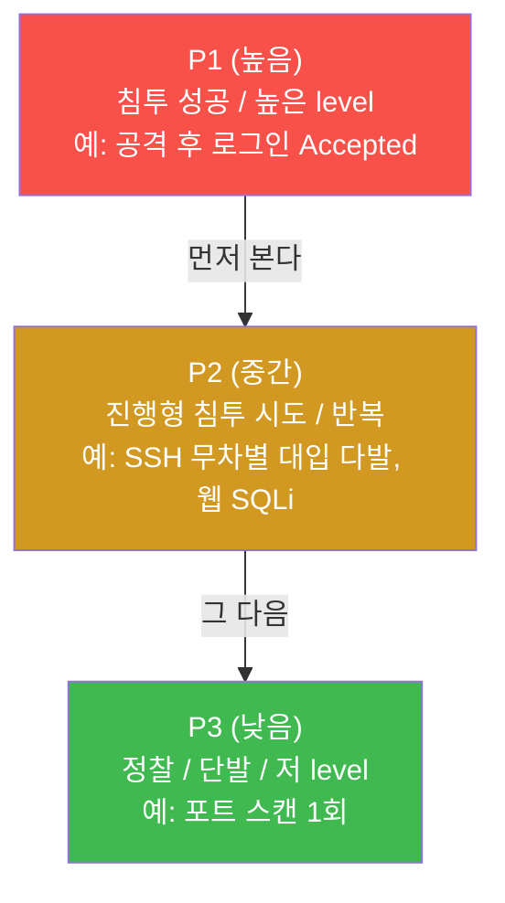

# SOC W01 — SOC 관제 개론 + 다중벡터 공격의 L1 트리아지

> **본 주차의 한 줄 요약**
>
> "보안 경보가 하루에 수천 건 쏟아질 때, 분석가는 무엇을 **먼저** 보고 무엇을 **버려야**
> 하는가?" 이 질문에 답하기 위해, 학생은 SOC(보안관제센터)의 출발점인 **SIEM(Wazuh)**
> 이 흩어진 소스의 이벤트를 어떻게 한 곳에 모으는지 보고, 외부 공격자가 한 번에 세 갈래
> (포트 스캔 + SSH 무차별 대입 + 웹 공격)로 들어올 때 그 경보들을 **L1 분석가의 4요소
> 트리아지**(출발지·시그니처·시각·심각도)로 분류·우선순위·상관하는 법을 직접 손으로 익힌다.

---

## 학습 목표

본 주차 종료 시 학생은 다음 6가지를 **본인 손으로** 할 수 있어야 한다.

1. SOC(보안관제센터)가 보안 이벤트를 다루는 4단계(수집 → 분류 → 우선순위 → 대응)와
   SOC 분석가 등급(L1 / L2 / L3)의 책임 차이를 비유 없이 1분 안에 설명한다.
2. SIEM(Wazuh)이 Suricata(네트워크) · ModSecurity(웹) · 호스트 인증 로그라는 서로 다른
   소스의 이벤트를 어떻게 한 스트림(`alerts.json`)으로 모으는지 그림으로 재현한다.
3. el34 호스트(`ssh ccc@192.168.0.80`)에서 Wazuh 가동 상태를 확인하고, 경보 한 건에서
   **4요소**(출발지 `srcip` / 시그니처 `rule.description` / 시각 `timestamp` / 심각도
   `rule.level`)를 30초 안에 읽어낸다.
4. 한 외부 공격자가 발생시킨 다중벡터 공격(포트 스캔 → SSH 무차별 대입 → 웹 SQLi)이
   왜 **세 개의 서로 다른 경보**로 흩어져 보이는지, 각 벡터가 어느 소스(Suricata eve /
   host auth.log / ModSec audit)에 흔적을 남기는지 설명한다.
5. 세 경보를 빈도·공격 단계 기준으로 P1/P2/P3 우선순위로 줄 세우고, "정찰(P3)보다
   진행형 침투 시도(P2)를 먼저 본다"는 L1의 판단 원칙을 적용한다.
6. 흩어진 세 경보를 **같은 출발지 IP**로 엮어 "한 공격자의 단계적 캠페인(정찰 → 침투)"
   이라는 하나의 서사로 상관(correlation)하고, 그 결과를 1페이지 L1 트리아지 보고서로
   정리한다.

---

## 0. 용어 해설 (SOC 관제 입문)

본 주차에 처음 등장하는 핵심 용어를 먼저 정리한다. 표의 "뜻"은 한 줄 정의이고, 헷갈리기
쉬운 용어는 §0.5 에서 일상 비유로 다시 풀어 설명한다. 본문을 읽다 막히면 이 표로 돌아오면
흐름이 끊기지 않는다.

| 용어 | 영문 | 뜻 | 비유 |
|------|------|----|------|
| **SOC** | Security Operations Center | 보안 이벤트를 24시간 수집·분석·대응하는 조직/공간 | 119 종합상황실 |
| **SIEM** | Security Information & Event Management | 흩어진 소스의 로그를 한곳에 통합·정규화·상관·알림 | 종합상황실의 통합 모니터 벽 |
| **경보** | Alert | 보안 도구가 "이건 의심스럽다"고 판정해 올린 한 건의 사건 | 신고 전화 한 통 |
| **트리아지** | Triage | 쏟아지는 경보를 빠르게 분류해 우선순위를 매기는 1차 판단 | 응급실의 환자 분류 |
| **L1 / L2 / L3** | Tier 1/2/3 analyst | 분석가 등급 — 1차 분류(L1) / 심층 분석(L2) / 헌팅·IR(L3) | 1차 진료 / 전문의 / 외과수술 |
| **다중벡터** | Multi-vector attack | 한 공격자가 여러 갈래(스캔·인증·웹)로 동시에 시도 | 건물 정문·후문·창문 동시 공략 |
| **상관(분석)** | Correlation | 흩어진 경보를 공통 키(출발지 IP 등)로 엮어 한 사건으로 종합 | 여러 신고를 한 사건으로 묶기 |
| **출발지** | Source IP (`srcip`) | 공격이 시작된 IP 주소 | 신고된 차량 번호 |
| **시그니처** | Signature | 어떤 공격 패턴에 매치됐는지 식별하는 룰 이름/ID | 수배 전단의 범행 수법 |
| **심각도** | Severity / Level | 경보가 얼마나 위험한지 나타내는 점수 | 화재 등급(1~3급) |
| **오탐** | False Positive | 정상 행위를 공격으로 잘못 판정한 경보 | 오작동한 화재경보기 |
| **IOC** | Indicator of Compromise | 침해 지표(악성 IP, 해시, 도메인 등) | 수배범의 지문·차량번호 |
| **Suricata** | — | 네트워크 패킷을 검사하는 IDS(침입 탐지 시스템) | 도로의 과속 감시 카메라 |
| **ModSecurity** | ModSec | 웹(HTTP) 요청을 검사하는 WAF(웹 방화벽) | 건물 입구 금속탐지기 |
| **Wazuh** | — | el34 가 쓰는 오픈소스 SIEM 제품 | 통합 관제 시스템 브랜드 |
| **eve.json** | Extensible EVent JSON | Suricata 가 분석 결과를 한 줄당 1 JSON 으로 남기는 로그 | CCTV 영상의 시간별 인덱스 |
| **auth.log** | — | 리눅스 호스트의 인증(로그인) 시도 기록 파일 | 건물 출입 시도 기록부 |
| **MITRE ATT&CK** | — | 공격 기법을 표준 코드(T번호)로 분류한 지식 체계 | 범죄 수법 분류 코드집 |

---

## 0.5 핵심 개념

위 표는 한 줄 정의라 신입생에게는 부족하다. 본 절에서는 SOC 분석가가 가장 먼저 체득해야
하는 핵심 5개 개념을 일상 비유로 풀어 설명한다. 운영 용어를 처음 만나는 학생의 어려움을
줄이는 것이 목적이다.

### 0.5.1 SOC — 119 종합상황실 비유

학생이 사는 도시에 119 종합상황실이 있다고 하자. 이 상황실은 도시 곳곳에서 들어오는 신고를
24시간 받는다.

- 화재 신고, 교통사고 신고, 구조 요청이 동시에 쏟아진다.
- 상황 요원은 각 신고를 듣고 "이건 큰불, 이건 가벼운 접촉사고"라고 즉시 분류한다.
- 분류 결과에 따라 소방차·구급차·구조대를 우선순위대로 보낸다.

이 종합상황실을 보안의 세계로 옮긴 것이 **SOC(Security Operations Center, 보안관제센터)** 다.

**SOC** 는 조직의 모든 보안 이벤트를 24시간 수집·분석·대응하는 곳이다. 신고 대신 보안 경보가
들어오고, 소방차 대신 차단·격리·조사 같은 대응이 나간다. SOC 가 하는 일은 거의 항상 다음 네
단계의 흐름이다.



본 주차는 이 흐름의 앞쪽 세 단계 — "이벤트가 **어디서 와서 어떻게 모이는가**(수집)"와
"**무엇부터 볼 것인가**(분류·우선순위)"에 집중한다. 대응(차단·룰 개선)은 W02 이후에서 깊게
다룬다.

### 0.5.2 트리아지 — 응급실 환자 분류 비유

학생이 응급실에 가본 적이 있다고 하자. 환자가 몰리는 밤에는 도착 순서대로 진료하지 않는다.
간호사가 입구에서 모든 환자를 빠르게 훑어보고 등급을 매긴다.

- 심정지·대량 출혈 환자는 1분도 지체 없이 처치실로 보낸다(가장 위급).
- 골절·발열 환자는 잠시 대기시킨다(중간).
- 가벼운 찰과상은 가장 나중에 본다(낮음).

이 빠른 분류가 의료에서는 **트리아지(triage)** 이고, SOC 에서도 똑같은 이름으로 부른다.

**트리아지** 는 쏟아지는 경보를 하나하나 깊게 파지 않고, 몇 가지 핵심 단서만으로 빠르게
분류해 우선순위를 매기는 1차 판단이다. 핵심은 "**깊게 보지 않는다**"는 점이다. 분석가가 경보
하나를 30분씩 파면 나머지 수백 건이 방치된다. 그래서 L1 은 경보당 수십 초 안에 "버릴 것(오탐·
저위험) / 올릴 것(진짜 위협)"을 가른다. 이 빠른 판단의 무기가 다음 절의 **4요소** 다.

### 0.5.3 SIEM — 종합 모니터 벽 비유

119 상황실 벽에는 거대한 통합 모니터가 있다. 도시 곳곳의 CCTV, 신고 전화, 위치 정보가 그
한 화면에 모인다. 요원은 여러 시스템을 따로 열어보지 않고 이 한 벽만 봐도 도시 전체를 파악한다.

이 통합 모니터 벽이 보안에서는 **SIEM(Security Information and Event Management)** 이다.

**SIEM** 은 흩어진 보안 소스의 로그를 한곳으로 모아(수집), 제각각인 형식을 통일하고(정규화),
서로 연관된 사건을 엮고(상관), 위험한 것을 알려주는(알림) 통합 시스템이다. el34 에서 이 역할을
하는 제품이 **Wazuh** 다. Wazuh 가 없다면 분석가는 Suricata 로그 파일, 웹 서버 로그 파일, 호스트
인증 로그를 각각 따로 열어 비교해야 한다 — 사실상 불가능에 가까운 일이다. SIEM 은 이 세 소스를
**하나의 경보 스트림**으로 합쳐준다.



> **참고 — el34 의 Wazuh 구성.** el34 의 SIEM 은 `el34-siem` 컨테이너(호스트
> 192.168.0.80 위) 의 Wazuh manager 와, 각 컨테이너에 설치된 Wazuh agent 로 구성된다.
> 현재 활성 agent 는 **ips**(Suricata 호스트) 와 **web**(ModSec 호스트) 둘이다. 통합 경보는
> manager 의 `/var/ossec/logs/alerts/alerts.json` 에 한 줄당 1 JSON 으로 쌓인다.

### 0.5.4 다중벡터 공격 — 건물 동시 공략 비유

학생이 지키는 건물에 도둑이 든다고 하자. 능숙한 도둑은 정문 자물쇠 하나만 만지지 않는다.
정문 자물쇠를 따보다가, 동시에 후문도 흔들어 보고, 창문도 깨보려 한다. 한 곳이 막히면 다른
곳으로 시도하기 위해서다.

이렇게 한 공격자가 여러 갈래로 동시에 시도하는 것이 **다중벡터(multi-vector) 공격** 이다.
"벡터(vector)"는 공격이 들어오는 **경로/갈래**를 뜻한다.

본 주차의 외부 공격자는 다음 세 벡터를 쓴다. 그리고 각 벡터는 **서로 다른 보안 도구**에
흔적을 남긴다 — 이것이 본 주차에서 가장 중요한 직관이다.



SOC 화면에서는 이 셋이 **세 개의 별개 경보**로 뜬다. 초보 분석가는 이걸 무관한 세 사건으로
처리하지만, L1 의 진짜 실력은 셋을 **한 공격자의 단계적 행위**로 엮는 것이다(§4, §0.5.5).

### 0.5.5 상관(Correlation) — 흩어진 신고를 한 사건으로 묶기 비유

다시 119 상황실로 돌아가자. 밤사이 "골목에서 유리 깨지는 소리" 신고, "주차된 차 알람" 신고,
"수상한 사람이 차 문을 당김" 신고가 따로따로 들어왔다고 하자. 각각 보면 사소하다. 그런데 세
신고의 **위치가 같은 골목**이고 **시각이 5분 안**이라면, 요원은 즉시 "한 절도범의 연쇄 시도"
로 묶는다. 이렇게 묶는 순간 사건의 의미와 위급도가 완전히 달라진다.

이 묶는 작업이 SOC 에서는 **상관(correlation)** 이다.

**상관** 은 흩어진 경보를 공통 키로 엮어 하나의 사건으로 종합하는 분석이다. 가장 강력한 공통
키가 **출발지 IP** 다. 포트 스캔 경보, SSH 무차별 대입 경보, 웹 공격 경보의 출발지 IP 가 모두
같다면, 그것은 우연이 아니라 **한 공격자가 정찰 → 침투로 단계를 밟는 캠페인**이다.



> **el34 가 상관을 가능하게 하는 전제.** 상관의 핵심은 "출발지 IP 가 보존돼야 한다"는 것이다.
> 만약 방화벽이 출발지를 자기 IP 로 바꿔버리면(SNAT) 모든 경보의 출발지가 똑같아져 상관이
> 불가능해진다. el34 의 fw 는 SNAT 를 하지 않아 공격자의 실제 출발지 IP 가 Suricata · ModSec ·
> Wazuh 전 계층에 그대로 보존된다. 이것이 본 주차 상관 실습의 전제다.

---

이 5개 개념(SOC · 트리아지 · SIEM · 다중벡터 · 상관)이 W01 의 기반이다. 본문에서 다시
등장할 때 막히면 본 절로 돌아와 확인하면 된다.

---

## 1. SOC 란 무엇인가 — 경보의 강을 다루는 곳

### 1.1 한 줄 정의

**SOC(Security Operations Center)** 는 조직의 보안 이벤트를 24시간 수집·분석·대응하는 조직이자
공간이다. 핵심 활동은 §0.5.1 의 4단계 — 수집 → 분류(트리아지) → 우선순위 → 대응 — 이다.

### 1.2 왜 중요한가

현대 인프라는 방화벽·IDS·WAF·호스트 에이전트 등 여러 보안 도구를 동시에 운영한다(secuops
트랙에서 배우는 Defense in Depth). 문제는 이 도구들이 **각자 경보를 쏟아낸다**는 점이다. 도구
하나가 하루 수천 건을 올리고, 그중 절대다수가 오탐이거나 저위험이다. 도구를 아무리 잘 깔아도,
이 경보의 강을 **사람이 판단 가능한 흐름으로 정리하지 못하면** 진짜 위협은 잡음에 묻혀 놓친다.
SOC 는 바로 이 "잡음 속에서 신호를 건지는" 일을 전담하는 곳이다.

이 문제를 현장에서는 **경보 피로(alert fatigue)** 라고 부른다. 분석가가 오탐에 지쳐 경보를
무시하기 시작하면, 그 틈으로 진짜 침해가 통과한다. 실제 대형 침해 사고 상당수가 "경보는 떴는데
아무도 보지 않았다"로 귀결된다. SOC 운영의 본질은 도구를 늘리는 게 아니라, 경보를 **빠르고
정확하게 분류**하는 역량이다.

### 1.3 el34 에서 어떻게 보이나

el34 에서 SOC 분석가가 보는 "경보의 강"은 Wazuh manager 의 `alerts.json` 한 파일이다. Suricata
(네트워크) · ModSecurity(웹) · 호스트 인증 로그가 모두 이 한 스트림으로 흘러든다. 분석가는 여러
파일을 헤매지 않고 이 한 곳에서 경보를 읽는다(§0.5.3 그림). 본 주차 실습 1 이 바로 이 스트림이
살아 있는지(= Wazuh 가 수집 중인지) 확인하는 것으로 시작한다.

### 1.4 한계 / 주의

SIEM 이 경보를 한곳에 모아준다고 해서 분석까지 대신해 주지는 않는다. SIEM 은 "여기 의심스러운
게 있다"까지만 알려주고, "이게 진짜 위협인지, 무엇부터 볼지"를 판단하는 것은 사람(분석가)의
몫이다. 또한 Wazuh 가 모든 로그를 의미 있는 경보로 격상하지도 않는다 — 룰/디코더가 정의돼야
높은 등급으로 뜨고, 그렇지 않으면 원본 로그만 적재된다(이 미탐지 gap 을 메우는 것이 W09 이후
L3 의 일이다). 본 주차는 "이미 떠 있는 경보를 어떻게 빠르게 분류하느냐"에 집중한다.

---

## 2. SOC 분석가 등급 — L1 / L2 / L3

### 2.1 한 줄 정의

SOC 분석가는 보통 세 등급으로 나뉜다. **L1** 은 경보를 1차로 수집·분류하고, **L2** 는 L1 이
올린 것을 심층 분석·상관하며, **L3** 는 사고 대응(IR)·위협 헌팅·탐지 룰 개발을 한다.

### 2.2 왜 중요한가 — 분업이 곧 효율

응급실에서 분류 간호사, 일반의, 외과의가 역할을 나누듯, SOC 도 등급을 나눠야 굴러간다. 모든
분석가가 모든 경보를 깊게 파면 처리량이 무너진다. L1 이 대량의 경보를 빠르게 걸러 소수의 진짜
위협만 L2/L3 로 올려야, 비싼 고급 인력이 정말 중요한 일에 집중할 수 있다. 본 주차에서 학생이
연습하는 역할이 바로 이 **L1** 이다.

| 등급 | 영문 | 핵심 책임 | 본 주차 |
|------|------|----------|---------|
| **L1** | Tier 1 (triage) | 경보 수집·분류·1차 우선순위. 대부분 여기서 종료(오탐/저위험) | ★ 이번 주의 주역 |
| L2 | Tier 2 (analysis) | L1 이 올린 경보의 심층 분석·상관·범위 파악 | W03 이후 비중 ↑ |
| L3 | Tier 3 (IR/hunt) | 사고 대응, 위협 헌팅, 탐지 룰·디코더 개발 | W09 이후 |

> **용어 풀이 — IR(Incident Response, 사고 대응).** 침해가 확인된 뒤 피해 범위를 파악하고
> 봉쇄·복구하는 활동. **위협 헌팅(Threat Hunting)** 은 경보가 뜨기를 기다리지 않고 능동적으로
> "숨어 있는 공격자"를 찾아 나서는 활동이다. 둘 다 본 트랙 후반(W09+)에서 다룬다.

### 2.3 el34 에서의 L1 활동

본 주차에서 학생은 el34 의 `alerts.json` 과 각 원본 로그(eve.json / auth.log / modsec_audit)를
열어 경보를 분류한다. "이 스캔은 단발 정찰이니 P3", "이 인증 실패는 다발이니 무차별 대입 P2"
처럼 빠르게 줄 세우는 것이 L1 의 전형적 하루다. 깊은 포렌식(공격자가 로그인 후 무엇을 했는가)
은 하지 않는다 — 그건 L2/L3 의 몫이고 W09 이후에서 배운다.

### 2.4 한계 / 주의

L1 의 강점(빠른 판단)이 곧 약점이기도 하다. 빠르게 보다 보면 교묘하게 위장한 공격을 오탐으로
착각해 버릴 수 있다. 그래서 L1 은 "확실히 버려도 되는 것"만 종료하고, 조금이라도 애매하면
L2 로 올리는 보수적 태도가 원칙이다. 또 L1 은 단발 경보에 매몰되기 쉬운데, 진짜 위험은 §4 의
다중벡터처럼 **여러 경보의 조합**에서 드러나는 경우가 많다 — 그래서 §5 의 상관이 중요하다.

---

## 3. L1 트리아지의 4요소 — 경보에서 무엇을 보나

### 3.1 한 줄 정의

경보 하나를 받았을 때 L1 분석가가 즉시 읽는 네 가지 핵심 단서가 **4요소** 다 — 출발지(누가),
시그니처(무엇을), 시각(언제), 심각도(얼마나 위험).

### 3.2 왜 중요한가

경보 하나에는 수십 개의 필드가 들어 있다. 그걸 다 읽으면 시간이 무너진다. 4요소는 "경보를
30초 안에 분류하려면 **무엇만** 보면 되는가"에 대한 현장의 답이다. 이 네 가지만 빠르게 읽으면
"버릴 것 / 올릴 것"의 1차 판단이 대부분 끝난다.

### 3.3 el34 에서 어떻게 — Wazuh 필드 매핑

el34 의 Wazuh 경보(`alerts.json`)에서 4요소는 다음 필드에 들어 있다. `jq`(JSON 을 다루는
명령줄 도구) 로 한 줄에서 네 필드를 뽑아 보는 것이 L1 의 기본 동작이다.

| 4요소 | 의미 | Wazuh 경보 필드 | 무엇을 판단하나 |
|-------|------|----------------|----------------|
| **출발지(누가)** | 공격 시작 IP | `.data.srcip` / `.data.src_ip` | 외부인가 내부인가, 평판은 |
| **시그니처(무엇)** | 매치된 공격 패턴 | `.rule.description` / `.rule.id` | 어떤 종류의 공격인가 |
| **시각(언제)** | 발생 시각 | `.timestamp` | 업무시간인가 야간인가, 빈도는 |
| **심각도(얼마나)** | 위험 점수 | `.rule.level` | 즉시 대응인가 기록만인가 |

> **용어 풀이 — `jq`.** JSON 형식 데이터에서 원하는 필드만 골라 뽑아내는 명령줄 도구다.
> 예를 들어 `jq '.rule.level'` 은 경보에서 심각도 점수만 출력한다. Wazuh/Suricata 로그가 모두
> JSON 이라 SOC 분석가의 필수 도구다.

```bash
ssh ccc@10.20.32.100 'tail -1 /var/ossec/logs/alerts/alerts.json | jq "{src:.data.srcip, sig:.rule.description, when:.timestamp, level:.rule.level, groups:.rule.groups}"'
```

이 한 줄은 가장 최근 경보 1건에서 4요소를 한눈에 보여준다. 출력의 각 키가 위 표의 4요소에
대응한다 — 분석가는 이 출력만으로 "누가·무엇을·언제·얼마나 위험한지"를 즉시 읽는다.

### 3.4 심각도 척도 읽기 — Wazuh level 0~16

심각도(`rule.level`)는 Wazuh 가 0~16 점으로 매긴다. 숫자가 클수록 위험하다. L1 은 이 점수로
1차 분류의 출발점을 잡는다.



다만 level 만으로 끝내면 안 된다. level 이 낮아도(예: 단발 스캔 level 3) 같은 출발지에서
반복되거나 다른 벡터와 엮이면 위험도가 급등한다 — 그래서 4요소를 **함께** 보고, §5 의 상관까지
가야 한다. level 은 출발점이지 종착점이 아니다.

### 3.5 한계 / 주의

4요소는 "빠른 1차 분류"를 위한 도구이지 "정확한 결론"이 아니다. 시그니처가 오탐일 수 있고
(정상 트래픽을 공격으로 오인), 심각도 점수가 환경에 안 맞게 설정돼 있을 수 있다. 4요소로
줄 세운 뒤, 애매한 것은 원본 로그(full_log)를 펴 보거나 L2 로 올리는 것이 안전하다.

---

## 4. 다중벡터 공격 — 한 공격자, 여러 갈래

### 4.1 한 줄 정의

**다중벡터 공격** 은 한 공격자가 포트 스캔·인증 공격·웹 공격 같은 여러 경로(벡터)를 동시 또는
연속으로 시도하는 것이다. 본 주차의 외부 공격자(insider 발판 `192.168.0.202`)가 그 예다.

### 4.2 왜 중요한가 — 경보는 흩어지고, 진실은 합쳐진다

다중벡터가 SOC 분석가에게 어려운 이유는, 한 공격자의 행위가 **소스별로 흩어진 별개 경보**로
보이기 때문이다. 스캔은 Suricata 에, 인증 시도는 호스트 인증 로그에, 웹 공격은 ModSec 에 따로
뜬다. 화면만 보면 세 명의 다른 공격자 같다. 하지만 실제로는 한 공격자가 "①정찰로 열린 문을 찾고
→ ②SSH 비번을 두드리고 → ③웹 취약점을 찔러보는" 단계적 캠페인을 벌이는 것이다. 이 흩어진
조각을 하나로 보는 능력이 L1 과 숙련 분석가를 가른다.

### 4.3 el34 에서 어떻게 — 세 벡터, 세 소스

본 주차 실습에서 외부 공격자는 다음 세 벡터를 발생시키고, 각각 다른 소스에 흔적을 남긴다.

| 벡터 | 무슨 행위 | 어느 소스에 흔적 | MITRE ATT&CK |
|------|----------|-----------------|--------------|
| ① 포트 스캔 | 열린 포트를 빠르게 탐색(`nmap -sS`) | Suricata `eve.json` (네트워크) | T1046 (정찰) |
| ② SSH 무차별 대입 | 여러 계정/비번을 반복 시도 | 호스트 `/var/log/auth.log` (인증) | T1110 (자격증명 접근) |
| ③ 웹 공격(SQLi) | 웹 입력칸에 SQL 구문 주입 | web `modsec_audit.log` (웹) | T1190 (응용프로그램 악용) |

> **용어 풀이 — MITRE ATT&CK.** 전 세계 공격 사례에서 관찰된 공격 기법을 표준 코드(T번호)로
> 분류한 지식 체계다. 예컨대 포트 스캔은 `T1046`, 무차별 대입은 `T1110` 으로 부른다. 분석가가
> 공격을 같은 언어로 기술하고 공유하기 위한 "공통 분류 코드집"이라 보면 된다.
>
> **용어 풀이 — `nmap -sS`.** `nmap` 은 네트워크의 열린 포트를 탐색하는 표준 도구이고, `-sS` 는
> SYN 스캔 방식(완전한 연결을 맺지 않고 SYN 패킷만 보내는 비교적 조용한 스캔)이다. 공격의
> "정찰" 단계에서 가장 흔히 쓰인다.

> **참고 — 실습의 인증 벡터 생성 방식.** ②SSH 무차별 대입은 내 공격 VM(`192.168.0.202`)에서 el34
> 호스트(`192.168.0.80`)의 SSH 에 없는 계정으로 접속을 실패시켜, 호스트 `auth.log` 에
> `Invalid user ... from 192.168.0.202` 인증 실패 다발을 만든다. **스캔(①)·웹(③)과 같은 출발지
> `192.168.0.202`** 로 기록되므로, 세 벡터를 한 공격자로 상관(correlation)할 수 있다.

### 4.4 한계 / 주의

"세 경보 = 한 공격자"라는 결론을 **출발지만 보고 성급히 내리면 안 된다**. 같은 시각 다른 정상
사용자가 우연히 비슷한 행위를 했을 수도 있다. 그래서 §5 의 상관은 출발지 IP 뿐 아니라 시각의
근접성, 행위의 논리적 순서(정찰 → 침투)까지 함께 본다. 또 외부에서 들어오는 공격(outsider,
`192.168.0.202`)의 경우 공격자 컨테이너의 명령 로그를 SOC 가 직접 수집하지 못하므로, 반드시
**타깃 측에 남은 흔적**(Suricata/ModSec/인증 로그)으로 판단해야 한다.

---

## 5. 우선순위와 상관 — 무엇부터, 그리고 어떻게 엮나

### 5.1 우선순위 — 모든 경보가 같지 않다

#### 한 줄 정의
**우선순위(prioritization)** 는 분류된 경보를 "무엇부터 볼지" 줄 세우는 작업이다. 흔히
P1(높음) / P2(중간) / P3(낮음) 으로 표기한다.

#### 왜 중요한가
L1 의 시간은 유한하다. 모든 경보를 같은 무게로 다루면 정작 위험한 것을 늦게 본다. 우선순위는
"한정된 시간을 어디에 쓸 것인가"의 의사결정이다.

#### el34 에서 어떻게 — 두 가지 강한 신호: 공격 단계와 빈도
우선순위를 매기는 핵심 신호는 두 가지다. 첫째는 **공격 단계** — 정찰(아직 들어오지 않음)보다
침투 시도(이미 자산을 공격 중)가 위험하다. 둘째는 **빈도** — 짧은 시간에 다발로 일어나는 것은
"자동화된 진행형 공격"이라는 강한 신호다.



본 주차의 세 경보를 줄 세우면 — 웹 SQLi(침투 시도)와 SSH 무차별 대입(진행형 다발)은 **P2**,
단발 포트 스캔(정찰)은 **P3** 다. 즉 "침투/진행형을 먼저, 정찰은 맥락으로 기록"이 L1 의 판단이다.

> 빈도가 왜 강한 신호인가? 스캔 **1회**(P3)와 SSH 무차별 대입 **100회**(P2)는 위험도가 다르다.
> 무차별 대입의 다발성은 "공격자가 자동화 도구로 곧 침투를 시도한다"는 진행형 신호라, 단발
> 정찰보다 우선이다.

#### 한계 / 주의
P 등급은 절대 점수가 아니라 **상대적 줄 세우기**다. 같은 P3 라도 중요 자산(예: 결제 서버)을
향한 것이면 끌어올린다. 자산의 중요도(asset criticality)를 함께 고려해야 우선순위가 현실에 맞는다.

### 5.2 상관 — 흩어진 경보를 한 캠페인으로

#### 한 줄 정의
**상관(correlation)** 은 흩어진 경보를 공통 키(주로 출발지 IP)로 엮어 "한 공격자의 단계적 행위"
라는 하나의 사건으로 종합하는 분석이다(§0.5.5).

#### 왜 중요한가 — L1 의 진짜 실력
경보 하나하나를 정확히 분류하는 것은 기본기다. 그 위에 "이 세 경보가 사실 한 사건"임을 알아보는
것이 분석가의 실력이다. 상관을 못 하면 "스캔(P3, 무시), 인증 실패(P2), 웹 시도(P2)"를 각각
처리하고 끝낸다. 상관을 하면 "한 공격자가 정찰 후 다단계 침투 중 — 즉시 출발지 차단 검토"라는
훨씬 위급한 결론에 도달한다. 같은 데이터에서 전혀 다른 대응이 나온다.

#### el34 에서 어떻게 — 출발지 IP 로 엮기
서로 다른 소스(Suricata eve, ModSec audit)에서 경보의 출발지를 뽑아 같은 IP 인지 확인한다.

```bash
# Suricata(스캔/웹 네트워크 경보)의 출발지별 집계
ssh ccc@10.20.31.2 'sudo tail -3000 /var/log/suricata/eve.json | jq -rc "select(.event_type==\"alert\")|.src_ip" | sort | uniq -c | sort -rn | head -3'
# ModSec(웹 경보)의 출발지 확인
ssh ccc@10.20.32.80 'sudo tail -80 /var/log/apache2/modsec_audit.log | grep -oE "10\.20\.30\.202" | head -1'
```

두 소스 모두에서 `192.168.0.202` 가 출발지로 나오면, 스캔과 웹 공격이 **한 공격자**임이 확인된다.
여기에 같은 출발지에서 인증 실패까지 다발이면, "정찰 → 무차별 대입 → 웹 침투"의 한 캠페인으로
종합된다.

#### 한계 / 주의
상관의 전제는 **출발지 IP 보존**이다(§0.5.5). 만약 인프라가 SNAT 로 출발지를 바꾸면 모든 경보의
출발지가 같아져 상관이 무력화된다. el34 는 SNAT 를 하지 않아 이 문제가 없다. 또 정교한 공격자는
여러 IP(프록시·봇넷)를 번갈아 써서 상관을 피하려 한다 — 그럴 땐 IP 외에 행위 패턴·시각·도구
지문(예: `sqlmap` User-Agent)으로 엮어야 한다.

---

## 6. 실습 안내 (총 8 미션)

본 주차 실습은 SOC L1 분석가의 하루를 압축한 것이다. 외부 공격자가 다중벡터 공격을 흘리면
(실습 2), 학생은 각 벡터의 경보를 소스별로 찾아 4요소로 분류하고(실습 3~5), 우선순위를 매기고
(실습 6), 같은 출발지로 상관해(실습 7) 한 장의 트리아지 보고서로 종합한다(실습 8). 관측·분석
중심이라 **인프라 변경은 없다**.

각 실습은 다음 **4축**으로 이해하면 막힘이 없다.

- **이 실습을 왜 하는가?** — 학습 동기
- **무엇을 알 수 있는가?** — 기대 산출물
- **결과 해석(정상 vs 비정상)** — 출력을 어떻게 읽나
- **실전 활용** — 현장에서 언제 쓰나

> 모든 명령은 el34 호스트(`ssh ccc@192.168.0.80`, 비밀번호 `1`) 경유로 각 장비 `ssh ccc@<장비IP>`(web 32.80/ips 31.2/siem 32.100)
> 로 실행한다. 공격 발생은 `외부 공격자 VM 192.168.0.202`, 분석은 `el34-siem` 의 alerts.json, `el34-ips` 의
> eve.json, `el34-web` 의 modsec_audit.log, 그리고 호스트의 `/var/log/auth.log` 다(ccc 계정은
> `adm` 그룹이라 sudo 없이 인증 로그를 읽는다).

### 실습 1 — SOC 대시보드 점검 (Wazuh 경보 수집 확인)

> **이 실습을 왜 하는가?** 관제의 출발점은 "SIEM 이 실제로 경보를 수집하고 있는가"의 확인이다.
> Wazuh manager 의 핵심 데몬(`analysisd`)이 죽었거나 `alerts.json` 이 멈춰 있으면, 그 뒤의 모든
> 분석이 무의미하다. 분석가가 매일 아침 첫 번째로 하는 일이 이 헬스체크다.
>
> **무엇을 알 수 있는가?** Wazuh 가 가동 중인지, 경보 스트림(`alerts.json`)에 최근 경보가
> 쌓이는지, 그리고 경보 한 건에서 4요소(출발지·시그니처·시각·심각도)를 어떻게 읽는지.
>
> **결과 해석.** 정상: `analysisd is running` 출력 + `alerts.json` 의 최근 경보가 jq 로 파싱됨.
> 비정상: `analysisd` 가 안 보이면 manager 점검, 경보가 안 나오면 agent 연결/소스 점검.
>
> **실전 활용.** SIEM 운영자의 일일 1순위 점검. "왜 경보가 안 보이지?"의 첫 답을 여기서 찾는다.

### 실습 2 — 다중벡터 공격 재현 (스캔 + SSH 무차별 대입 + 웹)

> **이 실습을 왜 하는가?** SOC 화면을 채울 경보를 학생이 직접 만들어, "공격 → 경보"의 인과를
> 체득한다. 분석만 배우면 경보가 어디서 오는지 감이 없다. Red(공격)를 한 번 돌려봐야 Blue(분석)
> 의 대상이 무엇인지 분명해진다.
>
> **무엇을 알 수 있는가?** 한 공격자의 세 벡터(스캔/인증/웹)가 각각 어느 소스(Suricata eve /
> host auth.log / ModSec audit)에 흔적을 남기는지의 매핑.
>
> **결과 해석.** 정상: 세 벡터가 모두 실행되고 `3-vector done` 이 출력됨. 각 벡터 직후 해당
> 소스에 새 이벤트가 쌓인다(실습 3~5 에서 확인).
>
> **실전 활용.** Purple Team 의 탐지 검증 — "이 공격이 정말 우리 도구에 잡히는가"를 안전한
> 환경에서 미리 돌려보는 절차의 축소판이다. (실습 환경 안에서만 공격을 발생시킨다 — 윤리 원칙.)

### 실습 3 — 트리아지: 스캔 경보 (정찰 분류, P3)

> **이 실습을 왜 하는가?** 가장 흔하고 가장 덜 위험한 경보인 "포트 스캔"을 분류하며 트리아지의
> 기본기를 익힌다. 정찰 경보를 P3 로 옳게 내리는 것이 L1 의 첫 판단이다.
>
> **무엇을 알 수 있는가?** Suricata `eve.json` 에서 스캔 시그니처를 찾아 출발지(`src_ip`)·
> 시그니처(`alert.signature`)·심각도(`alert.severity`)를 식별하는 법.
>
> **결과 해석.** 정상: `scan` 류 시그니처가 출발지·심각도와 함께 출력됨 → "정찰(T1046), 단발이라
> P3" 로 분류. 스캔이 안 보이면 실습 2 의 nmap 재실행 후 다시 확인.
>
> **실전 활용.** 분석가가 매일 가장 많이 처리하는 경보가 스캔이다. 빠르게 P3 로 내리고 다음으로
> 넘어가되, 같은 출발지가 반복되면 맥락으로 기록해 두는 습관(실습 7 상관의 씨앗)을 들인다.

### 실습 4 — 트리아지: 인증 실패 경보 (무차별 대입 판정, P2)

> **이 실습을 왜 하는가?** "정상 오타 한두 번"과 "무차별 대입 다발"을 구분하는 것이 인증 분석의
> 핵심이다. 이 구분을 빈도와 계정 다양성으로 판정하는 법을 익힌다.
>
> **무엇을 알 수 있는가?** 호스트 `/var/log/auth.log` 에서 `Invalid user` / `Failed password` 의
> 빈도와 표적 계정을 읽어 무차별 대입(T1110)을 판정하는 법.
>
> **결과 해석.** 정상: `Invalid user` 가 다발(8건+)로, 여러 계정(`socw1bad*`)에 걸쳐 나타남 →
> "무차별 대입, 진행형이라 P2". 단발 1~2건이면 정상 오타일 수 있어 P3 이하.
>
> **실전 활용.** 인증 로그는 침입의 1차 증거다. L1 이 "다발 + 여러 계정 = 사전 기반 무차별 대입"
> 을 즉시 판정하면, 곧 이어질 침투 시도를 선제적으로 경계할 수 있다. W02 에서 이 인증 로그를
> 한층 깊게 판다.

### 실습 5 — 트리아지: 웹 공격 경보 (시그니처/대상 식별)

> **이 실습을 왜 하는가?** 웹은 가장 흔한 침투 경로다. ModSec 이 차단한 웹 공격의 시그니처와
> 출발지를 읽어 "웹 익스플로잇 시도"로 분류하는 법을 익힌다.
>
> **무엇을 알 수 있는가?** web `modsec_audit.log` 에서 SQLi 룰(942)·스캐너 지문(`sqlmap`)을 찾고,
> 차단 결과(status 403)와 실제 출발지(`remote_address`)를 식별하는 법.
>
> **결과 해석.** 정상: `942`(SQLi) 또는 `sqlmap` 이 매치되고 `remote_address` 가 실제 출발지
> `192.168.0.202` 로 보존됨(el34 의 출처 보존). `403` 은 ModSec 이 차단했다는 뜻.
>
> **실전 활용.** 웹 공격은 침투 시도라 정찰보다 우선(P2)이다. 시그니처(942 SQLi / 913 스캐너)로
> 공격 종류를, `remote_address` 로 출발지를 즉시 파악해 상관(실습 7)의 재료로 쓴다.

### 실습 6 — 우선순위 정렬 (무엇부터 보나)

> **이 실습을 왜 하는가?** 분류한 세 경보를 P1/P2/P3 로 줄 세우는 L1 의 핵심 의사결정을 연습한다.
>
> **무엇을 알 수 있는가?** 공격 단계(정찰 vs 침투)와 빈도(단발 vs 다발)를 기준으로 우선순위를
> 매기는 판단 원칙(§5.1).
>
> **결과 해석.** 정상: 웹 SQLi·SSH 무차별 대입을 P2(중간), 단발 스캔을 P3(낮음)로 줄 세움 →
> "진행형/침투를 먼저, 정찰은 맥락으로 기록".
>
> **실전 활용.** 경보가 폭주하는 날, 이 줄 세우기가 한정된 분석 시간을 어디에 쓸지 결정한다.
> 우선순위 없이 도착 순으로 처리하면 위험한 경보를 늦게 본다.

### 실습 7 — 상관 (Purple): 같은 출발지로 한 캠페인

> **이 실습을 왜 하는가?** L1 의 진짜 실력 — 흩어진 경보를 한 사건으로 엮는 상관을 직접 해본다.
>
> **무엇을 알 수 있는가?** 서로 다른 소스(Suricata eve, ModSec audit)의 출발지를 뽑아 같은 IP
> (`192.168.0.202`)로 수렴함을 확인하고, "한 공격자의 단계적 캠페인"으로 종합하는 법.
>
> **결과 해석.** 정상: 두 소스 모두에서 `192.168.0.202` 가 출발지로 집계됨 → 스캔 + 웹(+ 인증)이
> 한 공격자임이 확인. 출발지가 제각각이면 상관 불가(또는 다중 IP 공격자 — 행위 패턴으로 재시도).
>
> **실전 활용.** 침해 분석의 핵심 절차다. 상관으로 "정찰 → 침투 진행 중"이라는 서사가 잡히면,
> 단발 처리와 전혀 다른 위급한 대응(출발지 차단 검토)으로 이어진다.

### 실습 8 — L1 트리아지 보고서

> **이 실습을 왜 하는가?** 분석은 보고로 완성된다. 실습 1~7 을 표준 양식으로 정리해, L2 가 받아
> 즉시 이어갈 수 있는 산출물을 만드는 법을 익힌다.
>
> **무엇을 알 수 있는가?** 4요소 표 + 분류 + 우선순위 + 상관을 한 장으로 종합하는 L1 보고서의 형식.
>
> **결과 해석.** 정상: 보고서에 (1) 경보 4요소 표 (2) 분류(정찰/인증/웹) (3) 우선순위(P1/P2/P3)
> (4) 상관(같은 출발지 → 한 캠페인) 이 모두 포함됨.
>
> **실전 활용.** SOC 의 모든 경보 처리는 기록으로 남아야 한다(추적성·인수인계·사후분석). L1 의
> 보고서가 부실하면 L2/L3 가 처음부터 다시 분석해야 해 SOC 전체 효율이 무너진다.

---

## 7. 본 주차 핵심 정리

1. **SOC** 는 보안 이벤트를 수집 → 분류 → 우선순위 → 대응의 4단계로 다루는 곳이다. 본 주차는
   앞 세 단계(특히 분류·우선순위)에 집중한다.
2. **SIEM(Wazuh)** 은 Suricata(네트워크) · ModSec(웹) · 호스트 인증 로그를 한 스트림
   (`alerts.json`)으로 모은다. 분석가는 여러 파일이 아닌 이 한 곳에서 경보를 읽는다.
3. **L1 분석가** 는 경보를 깊게 파지 않고 빠르게 분류·우선순위를 매겨, 진짜 위협만 L2/L3 로
   올린다. 본 주차의 학생 역할이다.
4. **4요소** — 출발지·시그니처·시각·심각도 — 만 빠르게 읽으면 경보 1차 분류가 대부분 끝난다.
5. **다중벡터** 공격은 소스별로 흩어진 경보로 보이지만, **같은 출발지로 상관**하면 한 공격자의
   단계적 캠페인(정찰 → 침투)으로 종합된다. el34 의 출처 IP 보존이 그 전제다.
6. **우선순위** 는 공격 단계(정찰 < 침투)와 빈도(단발 < 다발)로 줄 세운다 — 진행형/침투를 먼저.

---

## 8. 다음 주차 (W02) 예고 — SSH 무차별 대입 심층 (시스템 인증 로그 분석)

이번 주는 인증 실패 경보를 "다발이다"로 빠르게 **분류**했다. W02 는 그 인증 로그(sshd `auth.log`)
자체를 L1 보다 한 단계 깊게 **분석**한다 — 어떤 계정이 표적이었는지(`Invalid user` 분포), 무차별
대입과 정상 오타를 빈도로 어떻게 가르는지, 그리고 가장 중요한 "공격이 **성공**으로 이어졌는가"
(`Accepted` 흔적)를 추적해 사건의 심각도를 가른다. 본 주차가 "경보를 분류하는 L1"이었다면,
W02 는 "한 벡터를 끝까지 파고드는" 분석의 첫걸음이다.
