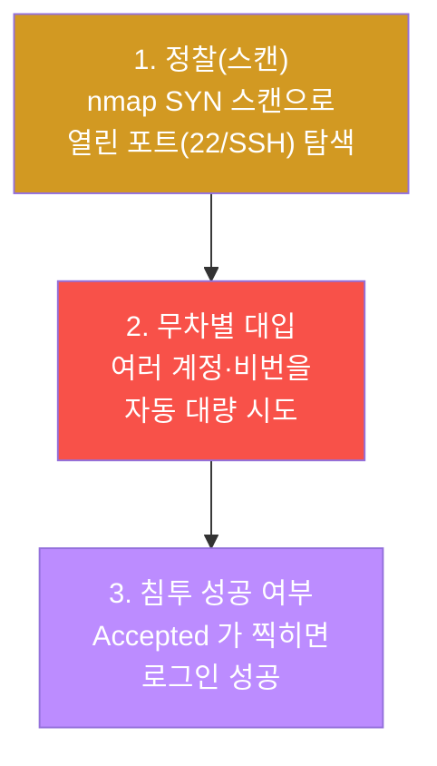
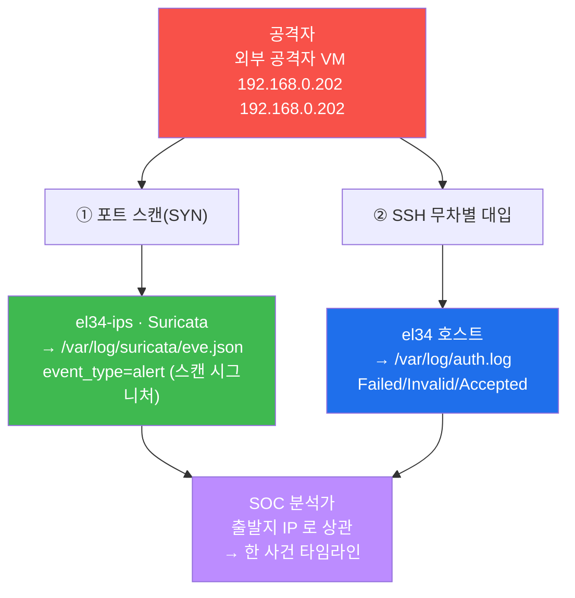
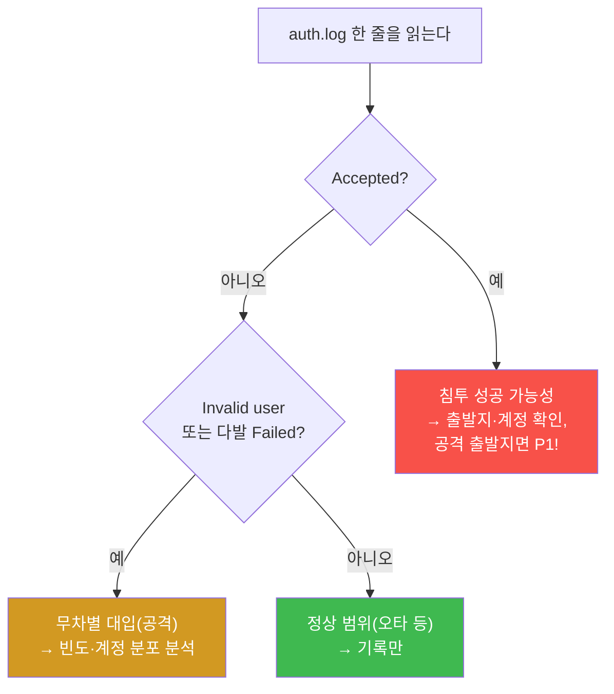
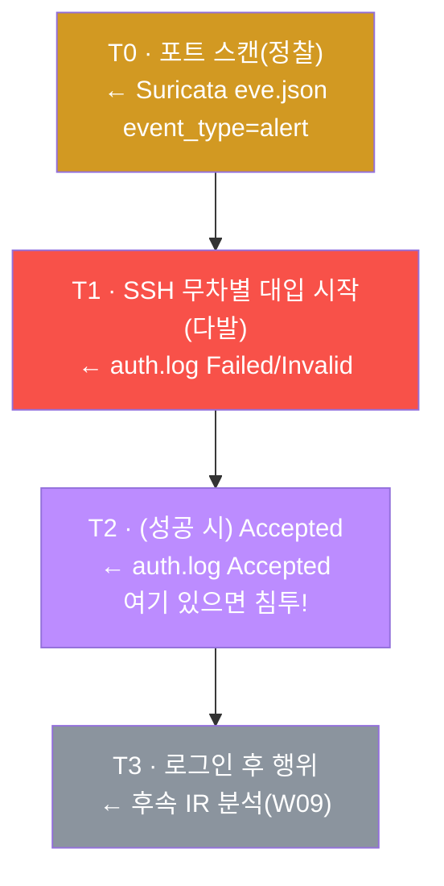

# SOC W02 — 스캔 탐지(Suricata eve.json) + SSH 무차별 대입 인증 로그 분석·추적

> **본 주차의 한 줄 요약**
>
> 공격은 거의 언제나 "정찰(스캔) → 침투 시도(무차별 대입)"의 순서로 진행된다. 이번 주
> 학생은 그 두 단계를 두 종류의 로그로 직접 읽어낸다 — 네트워크 단계는 **Suricata 의
> eve.json**(IDS 이벤트 로그)에서 포트 스캔을, 인증 단계는 호스트의 **`/var/log/auth.log`**
> 에서 SSH 무차별 대입을 분석한다. 마지막엔 두 단계를 **출발지 IP** 로 엮어 "한 공격자의
> 한 사건"으로 재구성하고, 침투 성공(`Accepted`) 여부로 심각도를 판정한다.

---

## 학습 목표

본 주차 종료 시 학생은 다음 6가지를 **본인 손으로** 할 수 있어야 한다.

1. 포트 스캔의 대표 두 유형(**SYN 스캔 / connect 스캔**)이 무엇이 다른지, 각각 네트워크에
   어떤 흔적을 남기는지 설명한다.
2. el34-ips 의 **Suricata eve.json** 에서 `jq` 로 `event_type==alert` 의 스캔 시그니처를
   걸러내고, 출발지(`src_ip`)·시그니처(`alert.signature`)·심각도(`alert.severity`)를 읽는다.
3. 호스트 `/var/log/auth.log` 의 sshd 메시지(`Failed password` / `Invalid user` /
   `Accepted` / `[preauth]`)를 구분하고, 각각이 무엇을 뜻하는지 1분 안에 설명한다.
4. 인증 실패의 **빈도(임계 기반)** 와 **표적 계정 분포** 로 자동화된 사전(wordlist) 무차별
   대입과 정상 사용자 오타를 가른다.
5. `Accepted`(로그인 성공)를 찾아 침투 성공 여부를 판정하고, 공격 출발지에서의 성공이면
   즉시 P1(최우선)로 격상한다.
6. 스캔(Suricata) 출발지와 인증 공격(auth.log) 출발지를 상관해 "정찰 → 대입 → (성공?)"
   사건 타임라인을 재구성하고, 1페이지 분석 보고서로 종합한다.

---

## 0. 용어 해설 (스캔 탐지 · 인증 로그 분석 입문)

이번 주 처음 등장하는 용어를 먼저 정리한다. 본문에서 다시 나올 때 막히면 이 표로 돌아오면
흐름이 끊기지 않는다.

| 용어 | 영문 | 뜻 | 비유 |
|------|------|----|------|
| **포트 스캔** | Port scan | 어떤 포트가 열려 있는지 하나씩 두드려 보는 정찰 | 건물의 모든 문 손잡이를 돌려보기 |
| **SYN 스캔** | SYN / half-open scan | TCP 연결을 끝까지 맺지 않고 SYN→SYN-ACK 까지만 확인 | 문을 살짝 밀어 잠겼는지만 보고 닫기 |
| **connect 스캔** | TCP connect scan | OS 의 정식 connect() 로 3-way 핸드셰이크를 끝까지 완료 | 문을 활짝 열고 들어갔다 나오기 |
| **무차별 대입** | Brute force | 계정·비밀번호를 자동으로 대량 시도 | 자물쇠에 번호를 0000부터 다 넣어보기 |
| **사전 공격** | Dictionary / wordlist attack | 흔한 계정·비번 목록으로 시도 | 잘 쓰이는 비밀번호 목록을 차례로 시도 |
| **Suricata** | — | 오픈소스 IDS/IPS 엔진 (el34-ips 에서 동작) | 통로에 설치된 보안 카메라 |
| **eve.json** | Extensible EVent JSON | Suricata 가 분석 결과를 한 줄 한 JSON 으로 적는 로그 | 카메라 영상의 시간별 인덱스 |
| **event_type** | — | eve.json 한 줄이 어떤 종류인지 표시 (`alert`/`http`/`flow`…) | 영상 클립의 분류 태그 |
| **시그니처** | Signature / rule | 알려진 공격 패턴을 규칙으로 만든 것 (탐지 근거) | 수배 전단의 인상착의 |
| **임계 기반 탐지** | Threshold-based detection | "N초에 M회 이상" 같은 횟수 기준으로 비정상 판정 | "1분에 문 50번 두드림 = 이상" |
| **jq** | — | JSON 을 질의·추출하는 커맨드라인 도구 | JSON 전용 필터·돋보기 |
| **auth.log** | — | 리눅스의 인증(sshd/sudo 등) 시스템 로그 파일 | 출입 인증 기록부 |
| **sshd** | SSH daemon | SSH 접속을 처리하는 서버 데몬 (로그를 남김) | 정문 출입 통제 직원 |
| **preauth** | pre-authentication | 인증이 끝나기 **전에** 연결이 끊긴 상태 | 신원 확인 전에 돌아간 방문객 |
| **출발지 상관** | Source correlation | 여러 로그를 같은 출발지 IP 로 한 사건으로 묶기 | 같은 차량번호로 여러 CCTV 연결 |
| **타임라인** | Timeline | 사건을 시간순으로 재구성한 것 | 사건 일지 |

---

## 0.5 헷갈리기 쉬운 핵심 개념 4가지 (일상 비유)

용어 표의 한 줄 정의만으로는 부족한 네 개념을, 일상 비유로 한 번 더 풀어 설명한다.

### 0.5.1 포트 스캔 — "건물의 모든 문 손잡이를 돌려보기"

공격자가 침입할 건물을 처음 본다고 하자. 가장 먼저 하는 일은 "어느 문이 열려 있나"를
확인하는 것이다. 건물의 모든 문(=포트)을 하나씩 돌려보며 잠겼는지(닫힘) 열렸는지(서비스
동작)를 기록한다. 이것이 **포트 스캔**, 즉 공격의 첫 단계인 **정찰(reconnaissance)** 이다.

스캔에서 "22번 포트가 열려 있다"를 확인하면, 공격자는 그 22번(SSH)을 향해 다음 단계인
무차별 대입을 시작한다. 그래서 SOC 분석가에게 **스캔 경보는 "곧 공격이 온다"는 예고편** 이다.
스캔 자체는 피해를 주지 않으므로 단독으로는 낮은 우선순위(P3)이지만, 같은 출발지에서 곧
대입이 따라오면 한 공격자의 단계적 행위로 격상된다.

### 0.5.2 SYN 스캔 vs connect 스캔 — "문을 미는 방식의 차이"

문이 잠겼는지 확인하는 방법은 두 가지다.

- **connect 스캔(TCP connect)** — 문을 **활짝 열고 들어갔다 나온다.** 운영체제의 정식
  `connect()` 함수를 써서 TCP 3-way 핸드셰이크(SYN → SYN-ACK → ACK)를 **끝까지 완료** 한다.
  연결이 완전히 맺히므로 서버의 애플리케이션 로그(예: sshd 접속 시도)에도 흔적이 남고,
  방화벽·IDS 가 탐지하기도 쉽다. 권한이 없어도 누구나 할 수 있다.
- **SYN 스캔(half-open)** — 문을 **살짝 밀어 잠겼는지만 보고 곧장 닫는다.** 첫 패킷(SYN)을
  보내 서버가 SYN-ACK(열림) 또는 RST(닫힘)로 답하는지만 확인하고, 연결을 끝맺는 ACK 는
  보내지 않는다(그래서 "half-open"=절반만 연 상태). 연결이 완성되지 않아 빠르고 상대적으로
  은밀하지만, 짧은 시간에 수많은 SYN 을 뿌리므로 **IDS(Suricata)는 이 SYN 의 폭주를 보고
  스캔을 탐지** 한다. nmap 의 `-sS` 옵션이 SYN 스캔이며, raw 소켓을 쓰므로 보통 root 권한이
  필요하다.

el34 의 attacker 는 `nmap -sS`(SYN 스캔)로 스캔을 일으키고, 통로에 놓인 Suricata 가 이를
"포트 스캔" 시그니처로 탐지해 eve.json 에 alert 로 남긴다.

### 0.5.3 무차별 대입 vs 정상 오타 — "두드린 횟수가 갈림길"

자물쇠 비밀번호를 모르는 사람의 행동을 떠올려보자.

- **집주인(정상 사용자)** 은 가끔 비밀번호를 헷갈려 한두 번 틀린다. 하루 2~3건, 산발적이다.
- **자물쇠를 뚫으려는 사람(공격자)** 은 0000, 0001, 0002… 를 **자동으로 초당 수십 번** 넣는다.

차이는 명백히 **빈도** 다. 그래서 인증 로그 분석의 1차 신호는 "짧은 시간에 실패가 몇 번
쌓였나"다. 이 "N초에 M회 이상이면 비정상"이라는 기준이 바로 **임계 기반 탐지(threshold)** 다.
거기에 더해, 공격자는 잘 쓰이는 계정 목록(root, admin, oracle, test…)을 차례로 시도하므로
**표적 계정의 다양성** 도 강한 신호가 된다 — 한 사람이 여러 계정으로 동시에 실패한다면
사람의 오타가 아니라 자동화된 사전(wordlist) 공격이다.

### 0.5.4 출발지 상관 — "같은 차량번호로 여러 CCTV 잇기"

스캔 경보(Suricata)와 인증 실패(auth.log)는 서로 다른 시스템이 남긴 **별개의 기록** 이다.
분석가의 진짜 실력은 이 흩어진 기록을 한 사건으로 엮는 것 — 마치 여러 대의 CCTV 영상을
같은 차량번호로 연결해 한 용의자의 동선을 그리듯, **같은 출발지 IP** 가 스캔과 대입 양쪽에
나타나면 "정찰 → 대입"을 수행한 한 공격자로 판정한다. 이 상관이 성립하려면 인프라가 공격의
**출처 IP 를 그대로 보존** 해야 하는데, el34 는 외부 공격자(192.168.0.202)의 출처 IP 를
Suricata·ModSec·Wazuh 에 그대로 보존하므로 상관이 가능하다.

---

## 1. 이번 주의 통찰 — 공격은 "정찰 → 대입"의 두 단계로 온다

W01 에서는 쏟아지는 경보를 빠르게 분류(L1 트리아지)하는 법을 배웠다. 인증 실패 경보를
"다발이다"라고 분류까지는 했다. 이번 주는 그 **앞 단계(스캔)와 뒤 단계(인증 로그)를 직접
파고들어**, 두 단계를 하나의 사건으로 잇는다.

거의 모든 SSH 침해는 다음 흐름을 따른다.



이 흐름의 두 단계는 **서로 다른 로그에 남는다.** 1단계(네트워크 정찰)는 통로의 IDS 인
Suricata 가 보고, 2단계(인증 시도)는 접속받는 호스트의 sshd 가 본다. 분석가는 이 두 로그를
모두 읽고, 같은 출발지로 엮어야 사건의 전모를 본다.



---

## 2. 1단계 — 포트 스캔 탐지 (Suricata eve.json)

### 2.1 스캔이란 무엇이며 왜 먼저 보는가

**한 줄 정의**: 포트 스캔은 대상의 어떤 포트가 열려 있는지를 하나씩 확인하는 정찰 행위다.

**왜 중요한가**: 공격자는 무엇을 공격할지 정하기 전에 먼저 "무엇이 열려 있나"를 알아야
한다. 따라서 스캔은 거의 모든 공격의 **첫 발자국** 이며, 스캔을 일찍 잡으면 뒤따를 공격을
예측·대비할 수 있다. 다만 스캔 자체는 피해를 주지 않으므로, 단독으로는 낮은 우선순위(P3)다.

**유형 두 가지**(§0.5.2 참고): nmap 의 `-sS`(SYN 스캔)는 연결을 절반만 맺어 빠르고 은밀하며,
`-sT`(connect 스캔)는 연결을 끝까지 맺어 흔적이 더 많다. el34 실습은 `nmap -sS` 를 쓴다.

### 2.2 Suricata 와 eve.json — IDS 가 스캔을 보는 방식

**Suricata** 는 el34-ips 컨테이너(`pipe` 의 .2 ↔ `dmz` 의 .1)에서 동작하는 오픈소스
IDS(침입 탐지 시스템)다. 통로를 지나는 패킷을 시그니처(알려진 공격 패턴 규칙)와 대조해
일치하면 경보(alert)를 발생시킨다. el34 의 Suricata 는 ETOpen(Emerging Threats Open)
룰셋을 사용하며, 포트 스캔에 대한 시그니처가 포함되어 있다.

Suricata 의 분석 결과는 모두 **eve.json** 에 기록된다(경로: `/var/log/suricata/eve.json`).
eve.json 은 "Extensible EVent JSON"의 약자로, **한 줄에 하나의 JSON 객체** 로 이벤트를 적는
형식이다. 각 줄의 `event_type` 필드가 그 줄이 어떤 종류인지 알려준다.

| `event_type` | 의미 |
|--------------|------|
| `alert` | 시그니처에 일치한 **경보** (← 스캔 탐지가 여기 들어옴) |
| `http` | HTTP 요청/응답 메타데이터 |
| `dns` | DNS 질의/응답 |
| `flow` | 하나의 연결(흐름) 단위 통계 |
| `tls` | TLS 핸드셰이크 정보 |

스캔 탐지는 `event_type == "alert"` 이면서 시그니처에 "scan" 이 들어간 줄로 나타난다.
스캔 경보 한 줄을 단순화하면 다음과 같다.

```json
{
  "timestamp": "2026-06-21T11:06:44.421882+0000",
  "event_type": "alert",
  "src_ip": "192.168.0.202",
  "dest_ip": "10.20.32.80",
  "proto": "TCP",
  "alert": {
    "signature": "ET SCAN Nmap Scripting Engine User-Agent Detected",
    "severity": 2,
    "category": "Attempted Information Leak"
  }
}
```

분석가가 이 한 줄에서 읽는 것은 세 가지다 — **누가**(`src_ip` = 192.168.0.202, 공격자),
**무엇을**(`alert.signature` = 포트 스캔), **얼마나 위험**(`alert.severity`). Suricata 의
severity 는 숫자가 **작을수록 위험** 하다(1=가장 위험, 3=낮음).

### 2.3 jq 로 eve.json 을 다루는 법

eve.json 은 한 줄이 곧 한 JSON 이므로, 텍스트 검색(grep)보다 **JSON 전용 도구인 `jq`** 로
다루는 것이 정확하다. `jq` 는 JSON 을 받아 원하는 필드를 골라내거나 조건으로 거르는
커맨드라인 도구다. 이번 주 실습에서 반복해 쓰는 패턴은 다음과 같다.

```bash
# el34 호스트에서 — ips 컨테이너의 eve.json 최근 3000줄에서
#   event_type 이 alert 이고 시그니처에 "scan"(대소문자 무시)이 든 줄만 골라
#   그 출발지(src_ip)를 세어 본다
ssh ccc@10.20.31.2 'sudo tail -3000 /var/log/suricata/eve.json \
  | jq -rc "select(.event_type==\"alert\" and (.alert.signature|test(\"scan\";\"i\")))|.src_ip" \
  | sort | uniq -c'
```

각 조각의 뜻을 해석하면 다음과 같다.

- `tail -3000 … eve.json` — 최근 3000줄만 본다(파일 전체는 매우 크다).
- `jq -rc` — `-r` 은 따옴표 없는 raw 출력, `-c` 는 한 줄(compact) 출력.
- `select(.event_type=="alert" and (.alert.signature|test("scan";"i")))` — `event_type`
  이 `alert` 이고 `alert.signature` 에 정규식 `scan` 이 매칭(`"i"`=대소문자 무시)되는 줄만
  통과시킨다.
- `|.src_ip` — 통과한 줄에서 출발지 IP 필드만 뽑는다.
- `sort | uniq -c` — 같은 IP 끼리 모아 횟수를 센다(빈도 = 임계 기반 판단의 근거).

**해석**: 출력에 `192.168.0.202` 가 여러 번 찍히면, 그 IP 가 스캔의 출발지다. 이 출발지를
기억해 두었다가 뒤에서 인증 공격의 출발지와 비교(상관)한다.

**한계**: 시그니처가 없는 새로운 정찰 기법은 잡히지 않으며, 매우 느린(stealth) 스캔은 임계에
도달하지 못해 탐지를 피할 수 있다. 그래서 네트워크 탐지(Suricata)만으로는 부족하고, 다음
단계인 호스트 인증 로그를 함께 봐야 한다.

---

## 3. 2단계 — SSH 무차별 대입과 인증 로그(auth.log)

### 3.1 인증 로그는 침입의 1차 증거

스캔으로 22번(SSH)이 열린 것을 안 공격자는 이제 로그인을 시도한다. 이 시도는 통로의
Suricata 가 아니라, **접속을 받는 호스트의 sshd** 가 기록한다. 그 기록이 남는 곳이
호스트의 `/var/log/auth.log` 다.

el34 에서 인증 분석의 원천은 **호스트(`ssh ccc@192.168.0.80`)의 `/var/log/auth.log`** 다.
계정 `ccc` 는 `adm` 그룹에 속하므로 **sudo 없이** 이 파일을 읽을 수 있다. (컨테이너 안에는
auth.log 가 없으므로, 인증 분석은 컨테이너가 아니라 호스트에서 한다.)

인증 로그는 "누가(출발지 IP) / 어떤 계정으로 / 몇 번 / 성공했나"를 한 자리에 담은 **침입의
1차 증거** 다.

### 3.2 sshd 로그 메시지 — 무엇을 보나

| 메시지 | 의미 | 신호 |
|--------|------|------|
| `Failed password for <user> from <ip>` | **존재하는** 계정의 비번 실패 | 공격 또는 오타 |
| `Invalid user <user> from <ip>` | **없는** 계정으로 시도 | 강한 공격 신호(아무 계정이나 찔러봄) |
| `Connection closed by … [preauth]` | 인증이 끝나기 전 연결 끊김 | 스크립트성 자동 시도 |
| `Accepted password/publickey for <user>` | **로그인 성공** | 정상 또는 침투 성공 |

핵심 판별: **`Invalid user` 다발 + 여러 계정** 이면 사전(wordlist) 기반 무차별 대입이다.
없는 계정 이름을 잔뜩 시도한다는 것은 정상 사용자가 할 일이 아니다. 반대로 한두 번의
`Failed` 는 보통 사용자의 오타로, 정상 범위다.



### 3.3 무차별 대입 vs 정상 — 구분하는 세 가지 기준

분석가는 세 축으로 공격과 정상을 가른다.

```bash
# (1) 실패 빈도 — 짧은 시간 다발이면 자동화 공격
grep -aE "Failed password|Invalid user" /var/log/auth.log | tail -20
echo "총 실패:"; grep -acE "Failed password|Invalid user" /var/log/auth.log

# (2) 노린 계정 분포 — 여러 계정이면 사전(wordlist) 공격
grep -aoE "Invalid user [a-z0-9]+" /var/log/auth.log | sort | uniq -c | sort -rn

# (3) 성공 여부 — 공격 출발지에서 Accepted 가 나오면 침투 성공(최우선!)
grep -a "Accepted" /var/log/auth.log | tail -5
```

세 명령의 의미를 해석하면 다음과 같다.

- **빈도(임계 기반)** — 1분에 수십 건이면 자동화 공격이다. 정상 사용자의 오타는 하루
  2~3건 수준으로 산발적이다. 위 `grep -ac…` 는 실패 줄 수를 세어 빈도를 가늠한다(`-a` 는
  바이너리로 인식될 수 있는 로그도 텍스트로 처리, `-c` 는 일치한 줄 수 카운트, `-E` 는
  확장 정규식, `-o` 는 일치한 부분만 출력).
- **계정 다양성** — root, admin, test, oracle… 여러 계정이 보이면 wordlist 공격이다. 위
  (2) 명령은 시도된 계정 이름을 뽑아 많이 나온 순으로 정렬한다.
- **성공 추적** — 가장 중요하다. 공격 출발지에서 `Accepted` 가 나오면 **침투 성공** 이므로
  즉시 P1(최우선)로 격상한다. 정상 계정(예: ccc)의 `Accepted` 는 합법이다.

### 3.4 왜 빈도가 핵심 신호인가 — 임계 기반 탐지

위 세 기준 중 가장 빠르고 강력한 1차 필터가 **빈도** 다. 이를 일반화한 것이 **임계 기반
탐지(threshold-based detection)** — "정해진 시간 창 안에서 특정 사건이 M회 이상이면
비정상으로 본다"는 규칙이다. 예컨대 "60초 안에 인증 실패 10회 이상 = 무차별 대입 의심"이
대표적이다. 이 사고방식은 스캔 탐지(짧은 시간에 SYN 폭주)와 무차별 대입 탐지(짧은 시간에
실패 폭주)에 똑같이 적용된다 — **둘 다 "정상보다 너무 잦다"가 탐지의 근거** 다.

> **주의 — 임계만으로는 부족하다.** 공격자가 일부러 시도 간격을 늘려(low-and-slow) 임계
> 아래로 깔면 빈도만으로는 놓친다. 그래서 빈도(임계)에 더해 **계정 분포** 와 **성공 여부**,
> 그리고 다음 절의 **출발지 상관** 을 함께 보아야 한다.

---

## 4. 두 단계를 잇기 — 출발지 상관과 사건 타임라인

### 4.1 스캔 출발지 ↔ 인증 출발지 상관

스캔(Suricata eve.json)과 인증 공격(auth.log)은 별개의 로그지만, **같은 출발지 IP** 가 양쪽에
나타나면 한 공격자의 연속된 행위다(§0.5.4). 분석가는 §2.3 의 jq 로 얻은 스캔 출발지와,
§3.3 의 grep 으로 얻은 인증 공격 출발지를 비교해 일치하는지 본다.

> **출발지 통일에 대한 설명.** 본 실습에서 스캔은 외부 공격자 VM `192.168.0.202`가 공인 진입
> `192.168.0.161`로, 무차별 대입은 같은 VM(`192.168.0.202`)이 el34 호스트(`192.168.0.80`)의 SSH로
> 일으킨다. **두 벡터 모두 출발지가 `192.168.0.202`로 기록되므로 같은 공격자로 묶인다** — el34 가
> 외부 출처 IP 를 전 계층에 보존하기 때문이다. 이 "같은 IP 로 묶기"가 상관(correlation)의 핵심이다.

### 4.2 사건 타임라인 — 추적의 마무리

마지막으로 분석가는 두 로그의 사건을 **시간순으로 재구성** 한다. 시간축에 올려놓으면 사건의
시작·전개·결과가 한눈에 들어온다.



T2(성공)의 유무가 사건의 심각도를 가른다. 성공 흔적이 없으면 "시도(차단됨)", 공격 구간에
`Accepted` 가 있으면 "침해(침투 성공)"다. 참고로 `[preauth]`(인증 전 끊김) 줄이 많다면
사람이 아니라 스크립트가 자동으로 두드린 정황이다.

---

## 5. 실습 안내 (총 8 미션)

각 실습은 **4 축** — (왜 하는가 / 무엇을 알 수 있는가 / 결과 해석 / 실전 활용) — 으로 본다.
명령은 모두 el34 호스트(`ssh ccc@192.168.0.80`)에서 실행한다. 인증 분석은 호스트
`/var/log/auth.log`, 스캔 분석은 ips 컨테이너의 Suricata eve.json 이다. 본 주차는
관측·분석 중심이므로 인프라를 변경하지 않는다.

### 실습 1 — 점검: 호스트 인증 로그 접근

- **왜 하는가**: 분석을 시작하기 전에 원천 데이터(auth.log)에 접근 가능한지, sshd 이벤트가
  실제로 쌓여 있는지를 먼저 확인한다.
- **무엇을 알 수 있는가**: 호스트 auth.log 의 위치·권한과, sshd 인증 이벤트의 존재.
- **결과 해석**: 파일이 읽히고 `sshd` 가 보이면 정상. 읽기 권한 오류가 나면 계정의 `adm`
  그룹 소속을 확인한다(ccc 는 sudo 없이 읽혀야 한다).
- **실전 활용**: 어떤 분석이든 첫걸음은 "원천 로그가 살아 있는가"의 확인이다.

### 실습 2 — 스캔 + 무차별 대입 재현

- **왜 하는가**: 분석할 데이터를 직접 만든다. 여러 계정으로 SSH 실패를 다발로 일으키고,
  attacker 에서 포트 스캔(nmap)을 일으켜 "정찰 → 대입"의 두 단계를 모두 생성한다.
- **무엇을 알 수 있는가**: wordlist 공격이 auth.log 에 `Invalid user`/`Failed` 다발로,
  스캔이 Suricata eve.json 에 스캔 시그니처로 남는다는 사실.
- **결과 해석**: `done`/`scanned` 가 출력되면 재현 성공. 직후 실습 3~6 에서 그 흔적을 읽는다.
- **실전 활용**: 탐지 규칙을 검증할 때, 통제된 공격을 의도적으로 발생시켜 로그에 제대로
  잡히는지 확인하는 것은 표준 절차다.

### 실습 3 — 실패 패턴 분석(빈도)

- **왜 하는가**: 임계 기반 사고의 핵심 — "실패가 얼마나 잦은가"로 자동화 공격을 1차 판별한다.
- **무엇을 알 수 있는가**: 최근 실패 줄과 총 실패 건수. 짧은 시간 다발 = 자동화 무차별 대입.
- **결과 해석**: `Invalid user`/`Failed` 가 다발로 보이면 공격 의심. 하루 2~3건 산발이면 정상.
- **실전 활용**: SOC 에서 무차별 대입 경보의 1차 근거가 바로 이 빈도다.

### 실습 4 — 표적 계정 분석(분포)

- **왜 하는가**: "어떤 계정을 노렸나"의 분포로 공격의 성격(사전 공격 여부)을 가린다.
- **무엇을 알 수 있는가**: 시도된 계정 이름과 그 횟수. root/admin/oracle/test… 다수면 wordlist.
- **결과 해석**: 여러 계정 = 사전(wordlist) 공격. 한 계정만 반복 = 특정 계정 표적(성격이 다름).
- **실전 활용**: 계정 분포는 공격 도구·wordlist 를 추정하고, 노출된 계정을 점검하는 단서다.

### 실습 5 — Accepted vs 공격(침투 성공 여부)

- **왜 하는가**: 사건 심각도의 분기점 — 공격이 **성공했는가**를 가린다.
- **무엇을 알 수 있는가**: `Accepted`(로그인 성공) 줄과 공격 실패 건수의 대비.
- **결과 해석**: 정상 계정(ccc 등)의 Accepted 는 합법. **공격 출발지** 에서 Accepted 가
  나오면 침투 성공 → 즉시 P1. 출발지+계정으로 그 성공이 정상인지 공격인지 판별한다.
- **실전 활용**: IR 의 가장 중요한 질문 "들어왔나?"에 답하는 단계다.

### 실습 6 — 정찰 상관(스캔 ↔ 인증 출발지)

- **왜 하는가**: 흩어진 두 단계를 같은 출발지로 엮어 한 공격자의 행위로 판정한다.
- **무엇을 알 수 있는가**: Suricata eve.json 의 스캔 출발지(jq 로 추출)와 그 빈도.
- **결과 해석**: 스캔 출발지 = 인증 공격 출발지면 "정찰 → 대입"의 한 공격자. (데모는 출발지가
  다르게 보이지만 기법은 동일 — §4.1.)
- **실전 활용**: 단편적 경보를 캠페인으로 묶는 상관 분석은 L2/Purple 의 핵심 역량이다.

### 실습 7 — 사건 타임라인(시간순 재구성)

- **왜 하는가**: 사건의 시작·전개·결과를 시간축에 올려 전모를 본다.
- **무엇을 알 수 있는가**: `Invalid user`/`Failed`/`Accepted`/`preauth` 가 시간순으로 어떻게
  전개됐는지.
- **결과 해석**: preauth 다수 = 스크립트성 시도. 공격 구간에 Accepted 가 있으면 그 시점이
  침투 성공 시점이다.
- **실전 활용**: 보고서·법적 증거의 기본 형식이 타임라인이다.

### 실습 8 — 분석 보고서(무차별 대입 판정 + 침투 여부)

- **왜 하는가**: 실습 1~7 을 하나의 결론으로 종합한다.
- **무엇을 알 수 있는가**: 빈도(자동화) + 계정 분포(wordlist) + Accepted(침투 여부) +
  타임라인을 묶은 판정.
- **결과 해석**: 성공 흔적이 없으면 "시도(차단)", 있으면 "침해"로 격상. MITRE ATT&CK 기준
  무차별 대입은 T1110 에 해당한다(공격 기법을 표준 코드로 분류하는 지식 베이스).
- **실전 활용**: 분석의 가치는 보고로 완성된다 — 판정과 근거, 후속 조치를 1페이지로 전달한다.

---

## 6. 다음 주차 (W03) 예고 — 웹 공격 vs 네트워크/웹 로그 교차 분석

이번 주는 "스캔(Suricata) → SSH 무차별 대입(auth.log)"이라는 네트워크·인증 두 로그를 엮었다.
W03 은 무대를 **웹** 으로 옮긴다 — 같은 웹 공격이 **Apache access 로그 / ModSec audit 로그 /
Suricata eve.json** 세 곳에 어떻게 다르게 남는지, 각 로그의 강점(전체 요청상 / WAF 판단 /
네트워크 시그니처)이 무엇인지, 그리고 무엇을 교차로 봐야 하는지를 분석한다. 이번 주의 핵심
도구였던 eve.json·jq·출발지 상관은 W03 에서도 그대로 쓰인다.
