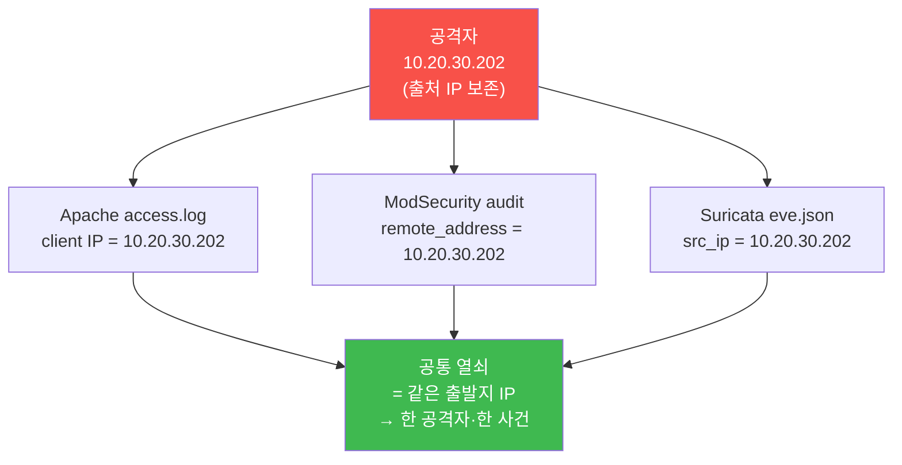
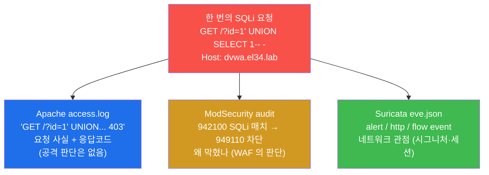
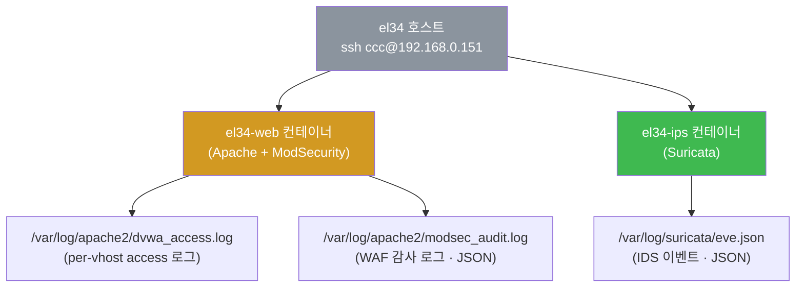
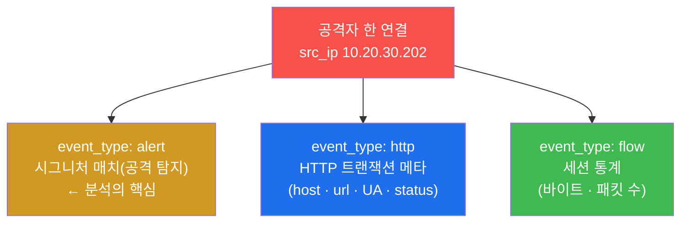
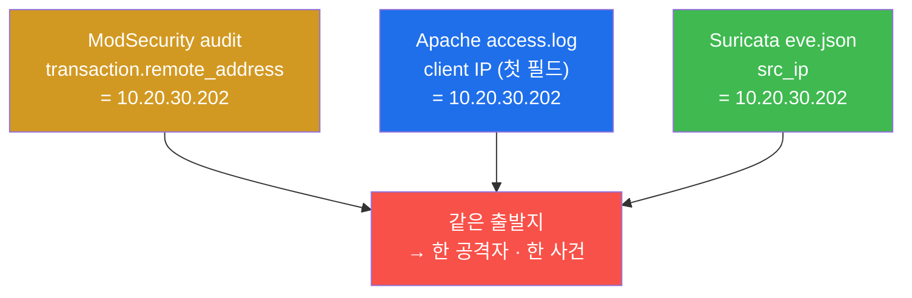
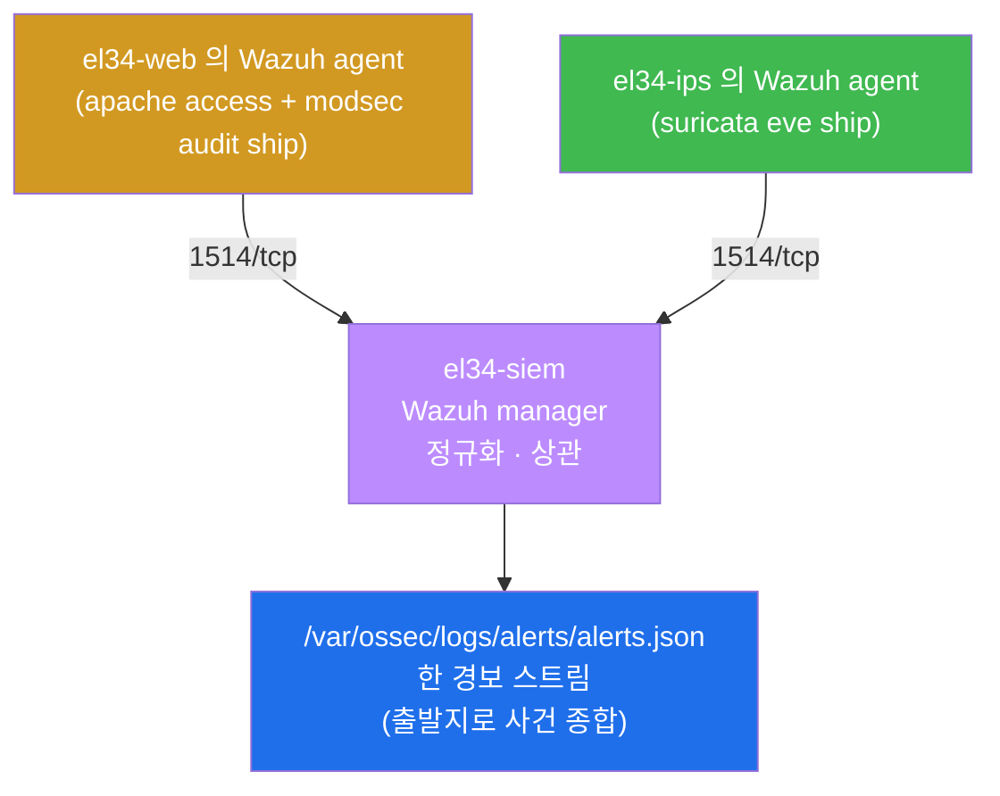

# SOC W03 — 웹 공격 분석: 한 공격이 세 로그에 남기는 서로 다른 흔적

> **본 주차의 한 줄 요약**
>
> 한 번의 웹 공격(SQLi · XSS · 스캐너)은 **세 곳의 로그**에 서로 다른 모습으로 남는다 —
> Apache access.log 는 "무엇이 들어왔나"(요청 전체상), ModSecurity audit 은 "왜 막혔나"(WAF
> 의 판단), Suricata eve.json 은 "네트워크에서 무엇이 보였나"(시그니처·세션). SOC 분석가는
> 각 로그의 강점과 한계를 알고 **같은 출발지로 교차(cross-correlation)** 해야 비로소 한
> 사건의 전체 그림을 본다. 본 주차는 그 세 로그를 직접 열어 읽고, 한 출발지로 묶고,
> Wazuh SIEM 으로 수렴하는 과정을 손으로 완주한다.

---

## 학습 목표

본 주차 종료 시 학생은 다음 6가지를 **본인 손으로** 할 수 있어야 한다.

1. 웹 공격 분석의 세 로그(Apache access.log / ModSecurity audit / Suricata eve.json)가 각각
   무엇을·왜·어떻게 기록하는지, 그리고 각자의 강점과 한계가 무엇인지 비유 없이 설명한다.
2. el34 의 web 컨테이너에서 **per-vhost access.log**(예: `dvwa_access.log`)와 `modsec_audit.log`
   의 위치를 찾고, 두 로그가 같은 요청을 서로 다른 관점으로 기록함을 직접 확인한다.
3. ModSecurity audit 에서 어떤 CRS 룰군(913 스캐너 / 941 XSS / 942 SQLi / 949 anomaly 차단)이
   어떤 payload 에 걸려 어떤 응답코드(403 차단 / 200 통과)로 끝났는지 식별한다.
4. Suricata eve.json 에서 한 출발지(`10.20.30.202`)의 `event_type` 분포(alert / http / flow)와
   alert 시그니처를 읽어, WAF 가 못 보는 네트워크 관점의 정보를 추출한다.
5. 세 로그의 출발지가 같음을 교차로 확인하여(ModSec `remote_address` = Apache client IP =
   Suricata `src_ip`) 흩어진 흔적을 **한 공격자의 한 사건**으로 상관한다.
6. 세 로그가 Wazuh SIEM 의 `alerts.json` 한 스트림으로 수렴함을 확인하고, 본인이 분석한
   내용을 1페이지 교차 분석 보고서로 종합한다.

---

## 0. 용어 해설 (웹 공격 분석 입문)

본 주차에 처음 등장하거나 자주 쓰이는 용어를 먼저 정리한다. 본문에서 이 용어가 다시
나올 때 막히면 이 표로 돌아오면 흐름이 끊기지 않는다.

| 용어 | 영문 | 뜻 | 비유 |
|------|------|----|------|
| **WAF** | Web Application Firewall | HTTP/HTTPS 요청 본문·헤더·파라미터를 검사하는 L7 전용 방화벽 | 건물 입구의 금속탐지기 |
| **ModSecurity** | ModSecurity (v2) | Apache 에 탑재되는 오픈소스 WAF 엔진 | 금속탐지기를 돌리는 안전요원 |
| **CRS** | OWASP Core Rule Set | ModSecurity 의 표준 룰셋(검문 매뉴얼). 룰마다 6자리 ID | 안전요원의 검문 매뉴얼 |
| **access.log** | Apache access log | 모든 HTTP 요청·응답을 한 줄씩 기록(판단 없음) | 건물 모든 출입의 시간 기록부 |
| **per-vhost log** | per virtual host log | vhost 별로 분리된 access/error 로그(`dvwa_access.log` 등) | 매장별로 따로 적는 출입 장부 |
| **modsec_audit.log** | ModSecurity audit log | WAF 가 검사한 요청의 상세 감사 기록(JSON) | 안전요원의 검문 일지 |
| **eve.json** | Suricata Extensible EVent | Suricata IDS 가 분석한 모든 이벤트의 JSON 로그 | 보안 카메라 영상 인덱스 |
| **event_type** | — | eve.json 의 이벤트 종류 필드(alert/http/flow 등) | 영상의 종류(정상/비정상) |
| **alert** | — | 시그니처에 매치된 이벤트(공격 탐지) | "수상한 행동 발견" 표시 |
| **flow** | — | 한 세션(연결)의 통계 이벤트(바이트/패킷 수) | 한 방문의 체류 기록 |
| **SQLi** | SQL Injection | 입력값에 SQL 조각을 끼워 DB 질의를 조작하는 공격 | 가짜 명령서를 끼워 넣기 |
| **XSS** | Cross-Site Scripting | 입력값에 스크립트를 끼워 다른 사용자 브라우저에서 실행시키는 공격 | 게시판에 몰래 붙인 함정 코드 |
| **payload** | — | 공격의 실제 내용물(`<script>...`, `UNION SELECT` 등) | 가방 속 위험물 |
| **anomaly score** | anomaly scoring | CRS 가 룰 매치마다 누적하는 위험 점수. 임계치 넘으면 차단 | 누적 의심 점수 |
| **DetectionOnly** | — | WAF 가 탐지·기록만 하고 차단은 안 하는 모드 | 일지에 적되 출입은 허용 |
| **remote_address** | — | ModSec 가 본 요청 출발지 IP | 방문객의 실제 신원 |
| **src_ip** | source IP | Suricata 가 본 출발지 IP | 침입자 IP |
| **교차 상관** | cross-correlation | 여러 로그를 공통 키(출발지 등)로 묶어 한 사건으로 보는 분석 | 여러 CCTV를 같은 인물로 연결 |
| **SIEM** | Security Information & Event Management | 흩어진 로그를 한 곳으로 모아 상관·알림 하는 관제 플랫폼 | CCTV 관제실 |
| **Wazuh** | — | el34 가 쓰는 오픈소스 SIEM (manager + agent) | 관제실 시스템 |

---

## 0.5 핵심 용어 개념 설명 (일상 비유)

위 표는 한 줄 정의라 처음 보는 학생에게는 부족하다. 본 절에서는 본 주차에서 가장 중요한
네 개념을 일상 비유로 풀어 설명한다. 세 로그를 왜 따로 봐야 하고 왜 합쳐야 하는지를
먼저 몸으로 이해하는 것이 목적이다.

### 0.5.1 왜 한 로그로는 부족한가 — 세 명의 목격자 비유

학생 동네에서 한 사건이 일어났다고 하자. 같은 사건을 세 사람이 목격했는데, 각자 본 것이
다르다.

- **출입 경비원** 은 "몇 시에 누가 들어와서 어느 층 버튼을 눌렀다"는 것까지만 안다. 그 사람이
  나쁜 사람인지 아닌지는 판단하지 않는다. 모든 출입을 빠짐없이 본 것이 강점이고, 선악을
  가리지 못하는 것이 한계다.
- **건물 안전요원(금속탐지기 담당)** 은 "이 방문객의 가방에서 흉기가 나와서 입장을 막았다"는
  것을 안다. 왜 막았는지 이유를 정확히 댄다. 다만 금속탐지기를 통과하지 않은 사람(예: 옆문)
  은 보지 못한다.
- **CCTV 관제원** 은 영상으로 "이 사람이 1층부터 10층까지 모든 문을 두드렸다"는 행동 패턴과
  체류 시간을 본다. 네트워크 전체 움직임을 보는 것이 강점이고, 가방 속 내용물(HTTP 본문의
  세부 의미)은 영상만으로는 정확히 모른다.

세 사람의 증언을 따로 들으면 각자 일부만 안다. **세 증언을 합쳐 "같은 사람"임을 확인할 때**
비로소 사건의 전모가 드러난다. 이 세 목격자가 곧 본 주차의 세 로그다.

| 목격자 | 본 주차의 로그 | 무엇을 보나 |
|--------|----------------|-------------|
| 출입 경비원(시간 기록부) | Apache access.log | 모든 요청·응답코드(전체상) |
| 안전요원(검문 일지) | ModSecurity audit | WAF 가 막은 이유(룰·payload) |
| CCTV 관제원 | Suricata eve.json | 네트워크 시그니처·세션 |

SOC 분석가의 핵심 기술은 한 목격자에 매달리지 않고 **세 증언을 출발지로 묶어 한 사건으로
재구성**하는 것이다. 본 주차 전체가 이 한 문장을 손으로 익히는 과정이다.

### 0.5.2 ModSecurity 와 CRS — 금속탐지기와 검문 매뉴얼 비유

학생이 백화점에 들어갈 때 입구에 금속탐지기가 있다고 하자. 금속탐지기 자체는 "엔진"일
뿐이고, 무엇을 위험으로 볼지는 **검문 매뉴얼**이 정한다.

- **ModSecurity** 는 금속탐지기 엔진이다. el34 에서는 web 컨테이너의 Apache 안에 모듈로
  탑재되어, 들어오는 모든 HTTP 요청을 검사한다. ModSecurity 는 검사하는 능력만 제공하고,
  "무엇이 위험한가"는 룰셋이 정한다.
- **CRS(OWASP Core Rule Set)** 가 그 검문 매뉴얼이다. CRS 는 SQLi · XSS · 스캐너 등 알려진
  웹 공격 패턴을 6자리 룰 ID 로 정리해둔 표준 룰셋이다. 룰 ID 의 앞 세 자리가 공격 종류를
  나타낸다.

el34 에서 자주 보게 될 CRS 룰군은 다음과 같다. 이 표는 본 주차 내내 참조하게 된다.

| 룰군(앞 3자리) | 공격 종류 | 예시 룰 ID | 의미 |
|----------------|-----------|------------|------|
| **913** | 스캐너 탐지 | 913100 | nmap·sqlmap·nikto 같은 스캐너의 User-Agent 매치 |
| **941** | XSS | 941100 / 941110 / 941160 | `<script>` · 스크립트 태그 · 이벤트 핸들러 매치 |
| **942** | SQLi | 942100 / 942270 | libinjection SQLi 탐지 · `UNION SELECT` 매치 |
| **949** | anomaly 차단 | 949110 | 누적 위험 점수가 임계치(기본 5)를 넘어 최종 차단 |
| **980** | 상관 보고 | 980130 | 한 요청에 걸린 룰을 종합한 요약 |

여기서 중요한 동작 방식이 **anomaly scoring(누적 점수 방식)** 이다. CRS 는 룰 하나에 걸렸다고
바로 막지 않는다. 룰마다 위험 점수를 매겨 **누적**하고, 합계가 임계치(기본 5)를 넘으면 그때
949110 이 발동해 차단한다. 예를 들어 XSS payload `<script>alert(1)</script>` 는 941100 +
941110 + 941160 의 세 룰에 걸려 점수가 15까지 올라가고, 5를 넘으므로 949110 이 403 으로
차단한다. 따라서 audit 로그를 읽을 때는 "어떤 단일 룰"이 아니라 "어떤 룰들이 모여 점수를
넘겼나"를 보는 것이 정확한 해석이다.

### 0.5.3 dvwa(차단) vs juice(DetectionOnly) — 같은 매뉴얼, 다른 권한

같은 검문 매뉴얼(CRS)을 들고 있어도, 안전요원에게 주어진 권한은 입구마다 다를 수 있다.

- 어떤 입구의 안전요원은 위험물을 발견하면 **입장을 막는다**(차단). → el34 의 `dvwa.el34.lab`
  vhost 가 이 모드다. ModSecurity 가 `On` 으로 동작해 공격을 **403 으로 차단**한다.
- 다른 입구의 안전요원은 위험물을 발견해도 **일지에 적기만 하고 통과시킨다**(탐지만). → el34 의
  `juice.el34.lab` vhost 가 이 모드다. ModSecurity 가 `DetectionOnly` 로 동작해 공격을 기록은
  하되 **200 으로 통과**시킨다.

이 차이를 모르면 분석에서 큰 오해가 생긴다. juice 에 공격을 보냈는데 응답이 200 이라고 해서
"WAF 가 못 막았다 / 안전하다"고 결론짓는 것은 틀렸다. juice 는 **일부러** 탐지만 하는 모드라
200 이 정상이며, audit 로그에는 같은 룰 매치가 남아 있다. 운영에서도 신규 WAF 는 보통
`DetectionOnly` 로 시작해 오탐을 걸러낸 뒤 `On` 으로 전환한다(운영 표준 마이그레이션).

> **본 주차 실습의 기본 대상은 차단형 `dvwa.el34.lab`** 다. 응답코드 403 과 차단 룰을 또렷이
> 관찰하기 위해서다. juice 는 같은 공격이 200 으로 통과하면서도 탐지는 남는 대조군으로
> 이해하면 된다.

### 0.5.4 출처 IP 보존 — 세 로그를 묶는 공통 열쇠

교차 상관이 가능하려면 세 로그가 **같은 출발지 IP** 를 봐야 한다. 만약 중간 장비가 출발지를
자기 IP 로 바꿔치기(SNAT)한다면, 각 로그가 서로 다른 IP 를 기록해 "같은 사람"임을 묶을 수
없게 된다.

el34 는 fw(nftables)가 내부로 전달할 때 **출발지 IP 를 바꾸지 않는다(SNAT 없음)**. 따라서 내부
공격자(`10.20.30.202`)든 외부 공격자 VM(`192.168.0.202`)이든, 그 실제 IP 가 Suricata · ModSecurity ·
Wazuh 의 전 계층에 그대로 보존된다. 이것이 본 주차의 교차 상관을 가능하게 하는 전제다.



> **참고 — 구 인프라(6v6)와의 차이.** 과거 6v6 환경은 게이트웨이가 출발지를 hop IP 로 바꿔
> client 가 내부 IP 로만 보이는 "gateway-src" 문제가 있었다. el34 는 출처를 보존하므로 세 로그
> 모두 진짜 공격자 IP 를 본다 — 교차 상관의 신뢰도가 크게 높아졌다.

---

## 1. 한 공격이 세 로그에 남기는 서로 다른 흔적

### 1.1 핵심 통찰 — 같은 SQLi 요청, 세 개의 다른 기록

분석가가 가장 먼저 내면화해야 할 사실은 이것이다 — **한 번의 웹 공격은 세 로그에 서로 다른
정보로 남는다.** 예를 들어 공격자가 `?id=1' UNION SELECT 1-- -` 같은 SQLi 한 줄을 보내면, 그
하나의 요청이 세 곳에 각기 다른 모습으로 기록된다.



세 로그를 따로 보면 각자 절반의 진실만 안다. access.log 만 보면 "403 이 떴다"는 사실은 알지만
**왜** 막혔는지 모른다. audit 만 보면 왜 막혔는지는 알지만 WAF 를 거치지 않은 다른 요청은
보지 못한다. eve.json 만 보면 네트워크 시그니처는 보지만 HTTP 의 의미가 약하다. 셋을 합쳐야
"누가 · 무엇을 · 어떻게 · 막혔는지/뚫렸는지"의 완결된 그림이 나온다.

### 1.2 세 로그 강점·한계 비교표

각 로그의 강점과 한계를 한눈에 정리하면 다음과 같다. 이 표가 본 주차 분석의 나침반이다.

| 로그 | 한 줄 정의 | 강점 | 한계 |
|------|-----------|------|------|
| **Apache access.log** | 모든 HTTP 요청·응답을 기록하는 출입 기록부 | 빠짐없는 전체상(client IP·요청 라인·응답코드). WAF 가 못 본 정상 요청도 포함 | 공격 여부 판단이 전혀 없음 |
| **ModSecurity audit** | WAF 가 검사한 요청의 감사 기록 | "왜 막혔나"를 룰 ID·payload·응답코드로 정확히 설명 | WAF 를 거친 HTTP 요청만 본다(비-HTTP·우회 경로 못 봄) |
| **Suricata eve.json** | IDS 가 본 모든 네트워크 이벤트 | 시그니처·세션·비-HTTP 공격(포트 스캔 등)까지 포착 | HTTP 의 응용 계층 의미가 상대적으로 약함 |

핵심은 세 로그가 **경쟁이 아니라 보완** 관계라는 점이다. 한 로그의 한계를 다른 로그가 메운다.
예컨대 ModSec 에 403(차단)으로 보여도 Suricata flow 에 대용량 전송이 함께 보이면 "다른 경로로
성공했을 수 있다"는 의심으로 이어진다 — 한 로그만 봤다면 놓쳤을 단서다.

### 1.3 el34 에서 세 로그가 사는 곳

본 주차의 세 로그는 두 컨테이너에 나뉘어 있다. 접근은 항상 el34 호스트(`ssh ccc@192.168.0.151`,
비밀번호 1)에 들어간 뒤 `docker exec` 로 한다.



el34 의 Apache 는 단일 `access.log` 가 아니라 **vhost 별 별도 로그**를 둔다. 즉 dvwa 트래픽은
`dvwa_access.log`, juice 트래픽은 `juice_access.log` 식으로 분리된다. 이렇게 분리하면 특정
사이트에 대한 공격만 좁혀 보기 쉬워 분석이 정밀해진다. 본 주차의 분석 대상은 차단형 vhost 인
`dvwa.el34.lab` 이므로 `dvwa_access.log` 를 본다.

---

## 2. ModSecurity audit — "왜 막혔나"를 답하는 로그

### 2.1 한 줄 정의와 왜 중요한가

**ModSecurity audit log** 는 WAF 가 검사한 요청에 대해 "어떤 룰이 어떤 payload 에 걸려 무슨
코드로 응답했나"를 담는 감사 기록이다. 세 로그 중 유일하게 **공격 판단의 근거**를 직접
제공하므로, "이 요청이 왜 403 이 됐는가?"라는 질문에 답할 수 있는 단 하나의 로그다.

el34 의 ModSec audit 은 `SecAuditLogFormat JSON` 으로 기록되며 파일 경로는
`/var/log/apache2/modsec_audit.log` 다. 다만 실제 el34 에선 audit log 가 **멀티라인(pretty) JSON**
으로 떨어져 `tail -1 | jq` 가 깨진다(한 줄이 JSON 조각). 따라서 **룰 ID·익명점수 요약은 per-vhost
`error.log`**(예: `/var/log/apache2/dvwa_error.log`)의 ModSec 경고 라인에서 읽는 것이 신뢰 소스다 —
한 줄에 `[id "942100"] [msg "..."] [client <출처IP>] [unique_id ...]` 가 임베드된다. 본 주차 실습도
error.log 를 **요청 라인수로 격리**해 공격별 룰을 뽑는다. 아래 audit JSON 구조는 ModSec 의 일반 개념
(SecAuditLogParts)으로 이해하면 되고, Wazuh 의 수집·정규화 대상이기도 하다.

### 2.2 el34 에서 어떻게 — audit JSON 의 구조

audit JSON 한 줄의 골격은 다음과 같다. 분석가가 자주 보는 필드만 추려 해석을 달았다.

```json
{
  "transaction": {
    "remote_address": "10.20.30.202",
    "request":  { "request_line": "GET /?id=socw3' UNION SELECT 1-- - HTTP/1.1" },
    "response": { "http_code": 403 }
  },
  "audit_data": {
    "messages": [
      "Warning. detected SQLi ... [id \"942100\"] [msg \"SQL Injection ...\"] [severity \"CRITICAL\"]",
      "Access denied with code 403 ... [id \"949110\"] [msg \"Inbound Anomaly Score Exceeded (Total Score: 15)\"]"
    ]
  }
}
```

각 필드의 의미는 다음과 같다.

- `transaction.remote_address` — WAF 가 본 **실제 출발지 IP**. el34 는 출처를 보존하므로 진짜
  공격자 IP 가 그대로 들어 있다. 교차 상관의 공통 열쇠가 바로 이 값이다.
- `transaction.request.request_line` — 공격이 담긴 요청 라인(메서드 + URI). payload 가 여기에
  그대로 보인다.
- `transaction.response.http_code` — WAF 의 판정 결과. `403` 이면 차단(dvwa 차단 모드), `200`
  이면 통과/탐지만(juice DetectionOnly).
- `audit_data.messages[]` — **매치된 CRS 룰들이 한 줄씩** 담긴 배열. 각 줄에 `[id "942100"]`
  형식으로 룰 ID 가 들어 있다. 분석가는 이 배열에서 룰 ID 를 뽑아 공격 종류를 판별한다.

> **흔한 함정 — 룰 ID 는 어디에 있나.** 룰 ID 는 `transaction.messages` 가 아니라
> **`audit_data.messages[]`** 안에 `[id "..."]` 문자열로 들어 있다. 그래서 본 주차 실습은
> audit 로그를 `grep -oE "9[0-9]{5}"` 로 6자리 룰 ID 를 통째로 긁어 분포를 세는 방식을
> 쓴다 — JSON 경로를 외우지 않아도 룰군을 한눈에 셀 수 있어 실용적이다.

### 2.3 룰 ID 를 읽는 법 — 공격 종류 판별

audit 에서 긁어낸 6자리 룰 ID 의 앞 세 자리로 공격 종류를 즉시 분류한다. SQLi/XSS/스캐너가
섞여 들어오면 보통 다음과 같은 분포가 나온다.

| 보이는 룰 ID | 분류 | 해석 |
|--------------|------|------|
| `942xxx` | SQLi | `UNION SELECT` 등 SQL 조작 시도 |
| `941xxx` | XSS | `<script>` 등 스크립트 삽입 시도 |
| `913xxx` | 스캐너 | sqlmap·nikto 등 자동화 도구의 UA |
| `949110` | anomaly 차단 | 누적 점수가 임계치를 넘어 최종 403 차단 |

`949110` 이 보인다는 것은 곧 "위 공격 룰들의 점수가 합산되어 차단까지 갔다"는 결정적 신호다.
반대로 941/942 매치는 있는데 949110 이 없고 응답이 200 이면, DetectionOnly(juice) 이거나 점수가
임계치 미만이라 탐지만 된 경우다.

### 2.4 한계

ModSec audit 은 **WAF 를 거친 HTTP 요청만** 본다. WAF 가 적용되지 않은 경로, 비-HTTP 트래픽
(포트 스캔 등), 또는 비즈니스 로직 결함(정상 문법이지만 권한을 우회하는 IDOR/BOLA 등)은 이
로그만으로 잡기 어렵다. 이 빈틈을 Suricata(네트워크)와 SIEM(행위 상관)이 메운다.

---

## 3. Apache access.log — 요청의 전체상

### 3.1 한 줄 정의와 왜 중요한가

**Apache access.log** 는 들어온 모든 HTTP 요청을 공격 여부와 무관하게 한 줄씩 기록하는 출입
기록부다. WAF 의 판단은 없지만, 그 대신 **무엇이 들어왔는지의 전체상**을 빠짐없이 제공한다.
ModSec 이 "거른 것"만 본다면, access.log 는 "거른 것 + 통과한 것 + 정상 요청"까지 전부 본다.

이 전체상이 중요한 이유는, 공격 분석이 차단된 요청 하나로 끝나지 않기 때문이다. 같은 출발지가
차단 전후로 어떤 정상 요청을 섞어 보냈는지, 차단된 뒤에도 계속 시도했는지 같은 **맥락**은
access.log 의 전체 흐름에서만 보인다.

### 3.2 el34 에서 어떻게 — 로그 한 줄 해석

el34 의 per-vhost access 로그(`dvwa_access.log`) 한 줄은 다음과 같이 생겼다.

```
10.20.30.202 - - [20/Jun/2026:12:53:10 +0000] "GET /?q=<script>alert(1)</script>&id=1+UNION+SELECT HTTP/1.1" 403 438 "-" "sqlmap/1.5"
```

각 필드의 의미는 다음과 같다.

- `10.20.30.202` — **client IP**. el34 출처 보존 덕분에 실제 공격자 IP 가 그대로 보인다.
- `[20/Jun/2026:12:53:10 +0000]` — 요청 시각. 교차 상관 시 시간 키로 쓰인다.
- `"GET /?q=<script>... HTTP/1.1"` — 요청 라인. payload 가 URL 에 그대로 노출되어 있다.
- `403` — 응답코드. dvwa 차단 모드라 WAF 가 막아 403 이 떨어졌다.
- `"sqlmap/1.5"` — User-Agent. 자동화 스캐너가 자기 이름을 노출한 흔적이다.

응답코드 분포(403 차단 / 200 통과 / 404 없음)를 세어 보면 "공격이 얼마나 들어와 얼마나
막혔나"의 큰 그림이 잡힌다. 본 주차 실습에서 응답코드 분포를 세는 이유가 이것이다.

### 3.3 한계

access.log 는 **공격 판단을 하지 않는다**. `403` 이라는 결과는 보이지만 "어떤 룰에 걸려서"인지는
알 수 없다. 그 이유는 ModSec audit 에만 있다. 즉 access.log 는 "무엇이·언제·어떤 코드로"까지만
답하고, "왜"는 audit 의 몫이다 — 그래서 두 로그를 반드시 함께 봐야 한다.

---

## 4. Suricata eve.json — 네트워크 관점

### 4.1 한 줄 정의와 왜 중요한가

**Suricata eve.json** 은 IDS(침입탐지시스템) Suricata 가 통과하는 모든 패킷을 분석해 남기는
JSON 이벤트 로그다. web 앞단(ips 컨테이너)에서 네트워크를 보므로, **HTTP 응용 계층이 아니라
네트워크·세션 관점**의 정보를 준다. WAF 가 보지 못하는 비-HTTP 공격(포트 스캔, 비정상 프로토콜
등)까지 포착하는 것이 가장 큰 강점이다.

### 4.2 el34 에서 어떻게 — event_type 으로 한 흐름을 여러 각도로

eve.json 의 핵심은 `event_type` 필드다. Suricata 는 같은 한 흐름(연결)을 여러 종류의
이벤트로 쪼개어 기록한다. 한 출발지의 event_type 분포를 세면 그 출발지가 어떤 성격의
트래픽을 만들었는지 보인다.



- **alert** — 시그니처(룰)에 매치된 이벤트. SQLi·스캔 등 공격 탐지의 핵심이다. alert 의
  `alert.signature` 필드가 "무엇으로 탐지됐는지"를 사람이 읽을 문장으로 알려준다.
- **http** — HTTP 트랜잭션의 메타데이터(hostname · url · method · status). WAF 로그와 비슷해
  보이지만, 이건 네트워크에서 본 것이라 WAF 를 거치지 않은 트래픽도 잡힐 수 있다.
- **flow** — 한 세션의 통계(주고받은 바이트·패킷 수). 차단됐는데도 flow 에 큰 전송량이 보이면
  "다른 경로로 데이터가 오갔나?"라는 의심의 단서가 된다.

> **실무 팁 — http/alert 는 드물다.** flow 이벤트가 압도적으로 많고 alert·http 는 상대적으로
> 드물다. 그래서 본 주차 실습은 `tail -3000` 처럼 깊게 긁어야 공격 흔적을 잡는다. 너무 적게
> 보면 flow 만 보이고 정작 alert 를 놓친다.

### 4.3 한계

Suricata 는 네트워크 시그니처에 강하지만 **HTTP 응용 계층의 정밀한 의미 해석은 약하다**.
"어떤 CRS 룰에 왜 걸렸나" 같은 WAF 차원의 판단은 ModSec audit 이 정확하다. 또 시그니처가 없는
신종 공격(0-day)은 Suricata 도 놓칠 수 있다. 그래서 네트워크(Suricata)와 응용(ModSec)을 함께
봐야 사각지대가 줄어든다.

---

## 5. 교차 상관 — 흩어진 흔적을 한 사건으로

### 5.1 한 줄 정의와 왜 중요한가

**교차 상관(cross-correlation)** 은 여러 로그를 공통 키로 묶어 "같은 공격자의 같은 사건"으로
재구성하는 분석이다. 본 주차에서 가장 강력한 공통 키는 **출발지 IP** 다. 세 로그의 출발지가
같다면, 흩어져 보이던 세 흔적이 사실은 한 공격자의 한 행위라는 결론으로 모인다.

### 5.2 el34 에서 어떻게 — 세 출발지 필드를 맞춘다

세 로그는 출발지를 각기 다른 필드 이름으로 부른다. 이 셋이 같은 값(`10.20.30.202`)이면 한
사건이다.



이 상관이 신뢰할 만한 이유는 §0.5.4 에서 설명한 **출처 IP 보존** 때문이다. el34 는 fw 가
SNAT 하지 않으므로 세 로그 모두 진짜 공격자 IP 를 본다. 만약 중간에서 IP 가 바뀌었다면 세
필드의 값이 달라져 상관 자체가 불가능했을 것이다.

### 5.3 교차의 진짜 가치 — 한 로그만 보면 놓치는 것

교차 상관의 가치는 단순히 "같은 IP 확인"이 아니라, **한 로그만 보면 내릴 수 없는 결론**을
내릴 수 있다는 데 있다. 두 가지 예를 보자.

- ModSec audit 에 403(차단)으로 보이는데 Suricata flow 에 대용량 전송이 함께 보인다면 →
  "WAF 가 막은 줄 알았는데 다른 경로로 데이터가 빠져나갔을 수 있다"는 의심. 차단 로그만
  봤다면 안심하고 종결했을 사건이다.
- Apache access.log 에 같은 출발지의 정상 200 요청이 차단 403 사이사이에 섞여 있다면 →
  "공격자가 정상 요청으로 위장하며 탐색 중"이라는 행동 패턴. audit(차단된 것만) 으로는
  보이지 않는 맥락이다.

이처럼 분석가는 세 로그를 **출발지로 묶은 뒤 시간순으로 나열**해, 차단의 이면과 공격의 맥락을
읽는다. 이것이 단일 로그 분석과 교차 분석의 결정적 차이다.

---

## 6. SIEM 통합 — 세 로그가 한 경보 스트림으로

### 6.1 한 줄 정의와 왜 중요한가

세 로그를 매번 세 컨테이너에서 따로 여는 것은 사건 한 건에는 가능해도, 하루 수천 건의
경보를 다루는 SOC 현장에서는 불가능하다. **SIEM** 은 흩어진 로그를 한 곳으로 모아(수렴)
출발지·시각·룰로 묶어 보여주는 관제 플랫폼이며, el34 는 오픈소스 SIEM 인 **Wazuh** 를 쓴다.

### 6.2 el34 에서 어떻게 — agent 가 ship, manager 가 수렴

el34 에서는 web 컨테이너와 ips 컨테이너에 각각 Wazuh **agent** 가 설치되어, 자기 로그를
Wazuh **manager**(`el34-siem` 컨테이너)로 전송(ship)한다. manager 는 받은 이벤트를 정규화해
`/var/ossec/logs/alerts/alerts.json` 한 스트림으로 수렴시킨다.



이렇게 수렴되면 분석가는 세 로그를 일일이 열지 않고도 **출발지 하나로 alerts.json 을 필터링**해
그 공격자의 웹·네트워크 경보를 한 번에 본다. 본 주차 실습 7 이 바로 이 수렴을 확인하는 단계다.

### 6.3 한계 — 본 주차의 의도된 발견

여기서 학생이 직접 발견하게 될 한계가 하나 있다. **본 주차의 기본 Wazuh decoder/rule 은
ModSec 의 941/942 같은 specific 룰 ID 를 그대로 격상시키지 않는다.** 그래서 alerts.json 에서는
specific 한 SQLi/XSS 룰 대신 일반 Apache 4xx 룰이나 agent 점검 이벤트가 더 자주 보인다.

이것은 고장이 아니라 **의도된 출발점**이다. "ModSec 의 942100 매치를 SIEM 에서 critical 경보로
자동 격상하려면 무엇이 필요한가?"라는 질문이 자연스럽게 떠오르는데, 그 답(사용자 정의
decoder + custom rule 작성)이 바로 **다음 주차(W04)** 의 주제다. 본 주차는 "수렴은 되지만
정밀 격상은 아직 안 된다"는 gap 을 눈으로 확인하는 것까지가 목표다.

---

## 7. 실습 안내 (총 8 미션)

본 주차 실습은 lab_week03.yaml 의 8 step 과 1:1 대응한다. 각 실습은 **4축 설명**(왜 하는가 /
무엇을 알 수 있나 / 결과 해석 / 실전 활용)으로 안내한다. 모든 명령은 el34 호스트
(`ssh ccc@192.168.0.151`, 비밀번호 1)에서 `docker exec` 로 실행한다. 공격은 `el34-attacker`
에서, 분석은 `el34-web` / `el34-ips` / `el34-siem` 에서 한다. 본 주차는 관측·분석 중심이라
인프라를 변경하지 않는다.

### 실습 1 — 세 로그의 위치 점검

> **이 실습을 왜 하는가?** 분석을 시작하려면 먼저 데이터가 어디에 있는지 알아야 한다. 본
> 주차의 세 소스(Apache per-vhost access / ModSec audit / Suricata eve)가 어느 컨테이너의
> 어느 경로에 있는지 확인하는 첫 단계다.
>
> **무엇을 알 수 있나?** el34 의 Apache 가 단일 access.log 가 아니라 vhost 별 분리 로그
> (`dvwa_access.log`)를 쓴다는 점, audit 과 eve 가 서로 다른 컨테이너(web / ips)에 있다는 점.
>
> **결과 해석** 세 로그 파일이 모두 존재하고 크기가 0 이 아니면 정상. 파일이 없거나 권한
> 오류가 나면 해당 컨테이너의 로그 설정을 점검한다.
>
> **실전 활용** 새 환경을 인수했을 때 "로그가 어디 쌓이는가"를 1분 안에 파악하는 습관. 분석의
> 출발점이다.

### 실습 2 — 웹 공격 재현 (SQLi + XSS + 스캐너)

> **이 실습을 왜 하는가?** 분석할 흔적을 직접 만든다. attacker 컨테이너에서 차단형 vhost
> (`dvwa.el34.lab`)에 SQLi · XSS · 스캐너 UA 를 흘려 세 로그를 동시에 채운다.
>
> **무엇을 알 수 있나?** 한 공격자가 보낸 세 종류의 공격이 세 로그에 각기 다르게 남는다는
> 사실. 같은 한 줄의 curl 이 access(요청)·audit(룰 매치)·eve(네트워크)에 모두 흔적을 남긴다.
>
> **결과 해석** 명령이 끝나며 "web attacks done" 이 출력되면 재현 성공. 응답코드 자체는 여기서
> 확인하지 않고(다음 실습에서 로그로 확인), 흔적 생성이 목적이다.
>
> **실전 활용** Red 가 재현 가능한 공격을 발생시키고 Blue 가 추적하는 R/B/P 의 첫 단계.
> 탐지가 실제로 동작하는지 검증할 때 쓰는 표준 절차다.

### 실습 3 — ModSec audit 분석 (왜 막혔나)

> **이 실습을 왜 하는가?** 세 로그 중 유일하게 "왜 막혔나"를 답하는 audit 을 읽어, 어떤 CRS
> 룰이 어떤 응답코드로 이어졌는지 식별한다.
>
> **무엇을 알 수 있나?** audit 에서 6자리 룰 ID 분포(942 SQLi / 941 XSS / 913 스캐너 / 949110
> 차단)와 응답코드(403), 그리고 출발지(remote_address)를 읽는 법.
>
> **결과 해석** `942` 등 공격 룰과 함께 `949110` 이 보이고 응답코드가 403 이면 "누적 점수가
> 임계치를 넘어 차단됨"으로 정확히 해석한다. 941/942 는 있는데 949110 이 없고 200 이면
> 탐지만 된 경우(DetectionOnly 또는 점수 미달)다.
>
> **실전 활용** WAF 운영의 1순위 분석. "이 요청이 왜 막혔/안 막혔는가?"라는 질문에 답하는
> 능력은 SOC 분석가의 기본기다.

### 실습 4 — Apache access 분석 (요청 전체상)

> **이 실습을 왜 하는가?** WAF 판단이 빠진, 모든 요청의 사실(전체상)을 본다. ModSec 이 "거른
> 것"만 본다면 access 는 "들어온 전부"를 본다.
>
> **무엇을 알 수 있나?** 요청 라인·client IP·응답코드, 그리고 응답코드 분포(403 차단 / 200
> 통과). 차단된 요청과 정상 요청이 섞인 전체 맥락.
>
> **결과 해석** 공격 요청 라인과 403 응답이 보이면 정상. 응답코드 분포로 "얼마나 들어와
> 얼마나 막혔나"의 비율을 읽는다.
>
> **실전 활용** 차단 한 건만 보고 종결하지 않고, 같은 출발지의 전후 요청까지 보는 맥락 분석.
> 공격자의 탐색·위장 패턴이 여기서 드러난다.

### 실습 5 — Suricata eve 분석 (네트워크 관점)

> **이 실습을 왜 하는가?** WAF 가 못 보는 네트워크 관점을 본다. 한 출발지의 event_type 분포와
> alert 시그니처를 읽는다.
>
> **무엇을 알 수 있나?** alert(시그니처) / http(트랜잭션) / flow(세션)의 분포, 그리고 어떤
> 시그니처로 탐지됐는지. WAF 가 못 보는 비-HTTP 공격까지 포착하는 강점.
>
> **결과 해석** 출발지의 event_type 에 `alert` 가 포함되고 시그니처가 보이면 네트워크 탐지가
> 동작한 것. flow 만 보이고 alert 가 없으면 더 깊게(`tail` 더 크게) 긁어야 한다.
>
> **실전 활용** "WAF 는 통과했는데 네트워크에 이상은 없었나?" 같은 교차 검증의 한 축. 포트
> 스캔처럼 HTTP 가 아닌 공격은 이 로그로만 잡힌다.

### 실습 6 — 교차 상관 (세 로그 같은 출발지)

> **이 실습을 왜 하는가?** 흩어진 세 흔적을 한 사건으로 묶는다. 세 로그의 출발지가 같은
> 공격자(`10.20.30.202`)인지 직접 맞춰 본다.
>
> **무엇을 알 수 있나?** ModSec remote_address = Apache client IP = Suricata src_ip 가 같은
> 값임을, 즉 세 흔적이 한 공격자의 것임을 확인하는 절차.
>
> **결과 해석** 세 로그 모두 `10.20.30.202` 가 나오면 "한 공격자 · 한 사건"으로 상관 성공.
> 한 곳이라도 다른 IP 가 나오면 출처 보존이 깨졌거나 다른 트래픽이 섞인 것.
>
> **실전 활용** 침해 분석의 핵심 동작. 흩어진 경보를 출발지로 묶어 한 캠페인으로 재구성하는
> 능력이 L1 을 넘어서는 분석가의 기준이다.

### 실습 7 — SIEM 통합 (Wazuh 수렴 확인)

> **이 실습을 왜 하는가?** 세 로그를 일일이 열지 않고도 SIEM 한 곳에서 한 출발지의 사건을
> 보는 워크플로를 확인한다.
>
> **무엇을 알 수 있나?** web/ips agent 가 ship 한 로그가 manager 의 alerts.json 한 스트림으로
> 수렴함, 그리고 출발지로 필터링해 그 공격자의 경보를 묶어 보는 법.
>
> **결과 해석** alerts.json 에 출발지의 경보가 보이면 수렴 정상. 단, specific 한 SQLi/XSS 룰
> 대신 일반 Apache 4xx 룰이 더 자주 보이는데(§6.3), 이는 의도된 gap 이며 고장이 아니다.
>
> **실전 활용** 매일 수천 경보를 다루는 SOC 의 실제 워크플로. 출발지 한 건으로 사건을 추적하는
> 것이 SIEM 활용의 기본이다.

### 실습 8 — 교차 분석 보고서

> **이 실습을 왜 하는가?** 실습 1~7 을 한 장의 교차 분석 보고서로 종합한다. 각 로그의 강점을
> 합쳐 한 사건의 결론을 도출하는 마무리다.
>
> **무엇을 알 수 있나?** 세 로그의 강점(access 전체상 / audit WAF 판단 / eve 네트워크)을 합쳐
> 한 공격자의 사건으로 정리하는 보고 양식과 논리 전개.
>
> **결과 해석** 보고서에 세 로그의 교차 분석(같은 출발지 + 각 강점 + 통합 결론)이 포함되면
> 합격. "차단됐어도 다른 경로 성공 여부를 교차로 봐야 한다" 같은 통합 통찰이 핵심이다.
>
> **실전 활용** SOC 분석가가 사건을 종결할 때 작성하는 실제 산출물. 분석은 결국 "남이 읽고
> 판단할 수 있는 보고서"로 끝난다.

---

## 8. 핵심 정리 (1줄씩)

1. **한 공격, 세 흔적** — 같은 웹 공격이 access.log(전체상) · ModSec audit(왜 막혔나) ·
   Suricata eve(네트워크)에 서로 다르게 남는다.
2. **세 로그는 보완 관계** — access 는 판단이 없고, audit 은 WAF 거친 것만 보고, eve 는 HTTP
   의미가 약하다. 한 로그의 한계를 다른 로그가 메운다.
3. **ModSec = 왜 막혔나** — `audit_data.messages[]` 의 6자리 룰 ID(942 SQLi / 941 XSS / 913
   스캐너)와 949110 누적 차단, response 403/200 으로 판정한다.
4. **dvwa(차단) vs juice(DetectionOnly)** — 같은 CRS 라도 dvwa 는 403 차단, juice 는 200 통과
   (탐지만). 200 을 "안전"으로 오해하면 안 된다.
5. **출처 IP 보존** — el34 는 SNAT 하지 않아 세 로그 모두 진짜 공격자 IP 를 본다. 이것이 교차
   상관의 전제다.
6. **교차 상관** — 세 로그를 같은 출발지로 묶어 한 사건으로 재구성한다. 차단의 이면(다른 경로
   성공 여부)은 교차로만 보인다.
7. **SIEM 수렴** — web/ips agent → Wazuh manager → alerts.json 한 스트림. 단, specific 룰 격상은
   아직 안 됨(W04 의 출발점).

---

## 9. 다음 주차 (W04) 예고 — Wazuh 관제·커스텀 룰

W03 은 세 로그를 **교차로 읽는** 단계였다. W04 는 그 로그를 **평결로 만드는** Wazuh manager
내부로 들어간다. 본 주차 실습 7 에서 발견한 gap — "ModSec 의 941/942 매치가 SIEM 에서 specific
경보로 격상되지 않는다" — 을 직접 해결한다. decoder 와 rule 의 동작을 점검하고, 특정 위협을
잡아내는 **커스텀 룰을 본인 손으로 작성·검증**한다. 분석가가 단순히 로그를 읽는 사람에서,
탐지를 **만드는** 사람으로 한 단계 올라서는 주차다.
