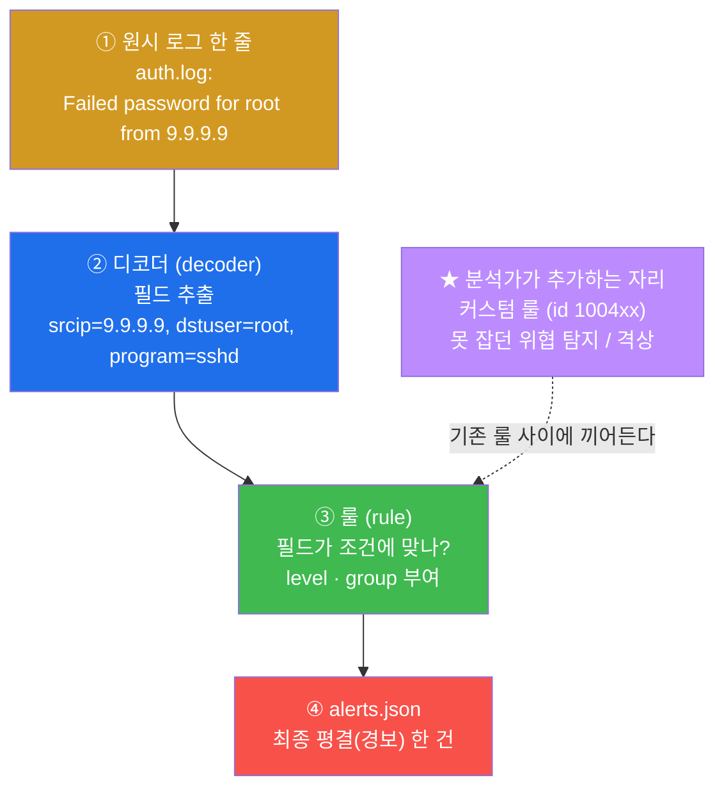
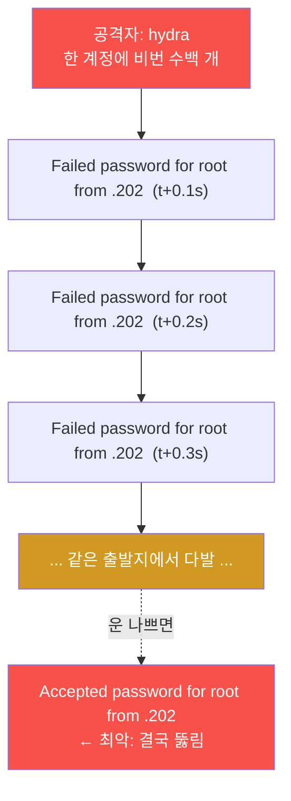
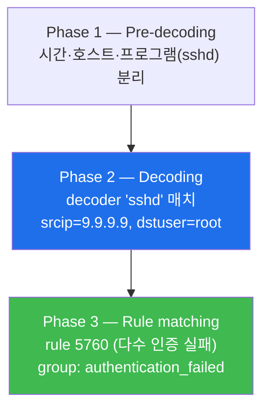
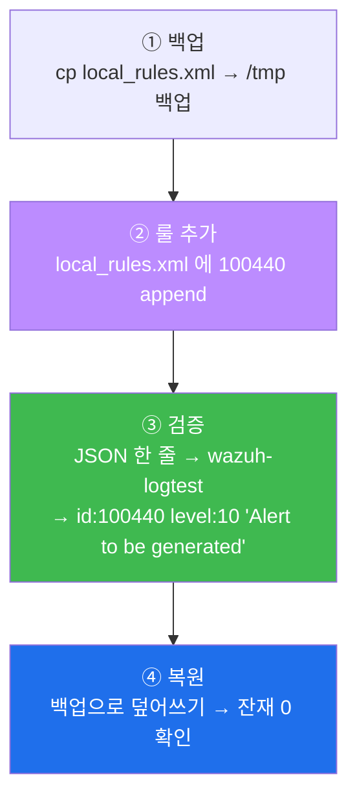
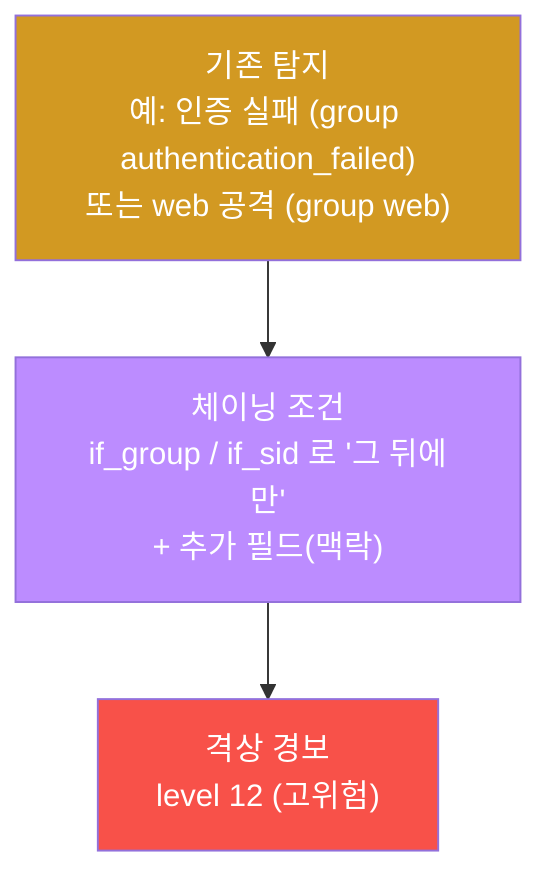
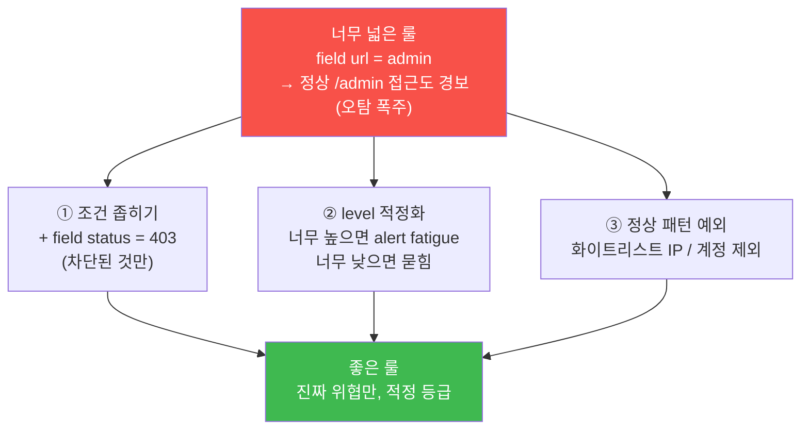

# SOC W04 — 인증 공격 탐지를 직접 만든다: Wazuh 커스텀 룰 작성·검증

> **본 주차의 한 줄 요약**
>
> W01~W03 에서 학생은 "이미 떠 있는 경보" 를 읽고 분류했다. 이번 주는 한 단계 위로
> 올라간다 — **분석가가 직접 탐지(룰)를 만든다.** 무차별 대입(brute-force) 같은
> 인증 공격을 예시로, 원시 로그(`auth.log` 의 `Failed password`)가 Wazuh 안에서 어떻게
> 디코더 → 룰 → 경보로 바뀌는지 추적하고, 기본 룰이 못 잡거나 너무 낮게 평가하는 위협을
> **나만의 커스텀 룰**(rule id `1004xx`)로 잡아 SOC 의 시야를 넓힌다. 공유 SIEM 을 망가뜨리지
> 않고 `wazuh-logtest` 로 안전하게 검증하는 법까지 익힌다.

---

## 학습 목표

본 주차 종료 시 학생은 다음 6가지를 **본인 손으로** 할 수 있어야 한다.

1. Wazuh 의 탐지 파이프라인(원시 로그 → 디코더 → 룰 → `alerts.json`)을 한 그림으로 그리고,
   각 단계가 무엇을 하는지 1분 안에 설명한다.
2. `wazuh-logtest` 에 SSH 무차별 대입 로그 한 줄을 넣어, 디코더가 뽑아내는 필드(`srcip`,
   `dstuser` 등)와 매치되는 기본 룰(예: rule **5760** — 다수 인증 실패)을 식별한다.
3. 무차별 대입(brute-force)·자격증명 스터핑(credential stuffing)이 `auth.log` 의
   `Failed password` / `Accepted password` / `Invalid user` 줄에 어떻게 남는지 읽고,
   "단발 실수" 와 "공격" 을 빈도(임계)로 구분한다.
4. 기본 룰이 놓치는 위협을 잡는 **커스텀 탐지 룰**(`local_rules.xml`, id `1004xx`,
   필드 매치)을 작성하고 `wazuh-logtest` 로 발화를 검증한다.
5. 기존 탐지에 맥락을 더해 심각도를 올리는 **체이닝(격상) 룰**(`<if_group>` / `<if_sid>`,
   빈도 `frequency`·`timeframe`)의 원리를 설명하고 작성한다.
6. 새 룰이 만들어내는 **오탐(false positive)** 을 줄이는 튜닝 원칙을 적용하고, 공유 SIEM
   을 원상 복구(베이스 보존)하는 안전 운영 절차를 수행한다.

---

## 0. 용어 해설 (커스텀 탐지 입문)

이번 주 처음 등장하거나 다시 정의가 필요한 용어를 먼저 정리한다. 본문에서 막히면 이 표로
돌아오면 흐름이 끊기지 않는다.

| 용어 | 영문 | 뜻 | 비유 |
|------|------|----|------|
| **무차별 대입** | Brute-force | 한 계정에 수많은 비밀번호를 자동으로 빠르게 시도 | 금고 다이얼을 0000부터 9999까지 돌려보기 |
| **자격증명 스터핑** | Credential stuffing | 어딘가 유출된 (아이디·비번) 목록을 그대로 다른 사이트에 시도 | 훔친 마스터키 꾸러미를 이 집 저 집 문에 꽂아보기 |
| **인증 로그** | auth log | 로그인 시도·성공·실패가 기록되는 로그(`/var/log/auth.log`) | 건물 출입 시도 기록부 |
| **`Failed password`** | — | sshd 가 남기는 "존재하는 계정인데 비번 틀림" 줄 | "직원인데 비밀번호 틀림" 기록 |
| **`Accepted password`** | — | sshd 가 남기는 "로그인 성공" 줄 | "정상 입장 완료" 기록 |
| **`Invalid user`** | — | sshd 가 남기는 "없는 계정으로 시도" 줄 | "명단에 없는 사람이 들어오려 함" |
| **임계 기반 탐지** | Threshold-based detection | "정해진 시간 안에 N회 이상" 같은 빈도 조건으로 공격 판정 | "1분에 문을 10번 두드리면 수상" |
| **디코더** | Decoder | 원시 로그 한 줄에서 의미 있는 필드를 뽑아내는 파서 | 영수증에서 날짜·금액만 형광펜 긋기 |
| **룰** | Rule | 뽑힌 필드가 조건에 맞으면 경보(level/group)를 매기는 판정기 | "이 조건이면 위험" 판정 매뉴얼 |
| **rule id** | Rule ID | 룰의 고유 번호. 기본 룰은 낮은 번호, 사용자 룰은 100000+ | 매뉴얼 조항 번호 |
| **level** | severity | 경보 심각도 0~16. 높을수록 위험 | 위험 등급(1~16) |
| **group** | rule group | 룰을 분류하는 꼬리표(예: `authentication_failed`) | 사건 분류 태그 |
| **체이닝** | rule chaining | 다른 룰이 먼저 매치된 뒤에만 발화해 맥락을 더하는 룰 | "1차 경보 + 추가 정황 → 격상" |
| **`if_sid` / `if_group`** | — | "특정 룰(sid) / 특정 그룹 뒤에만 발화" 체이닝 조건 | "앞 사건과 이어질 때만" |
| **`frequency` / `timeframe`** | — | "timeframe 초 안에 frequency 회 이상" 빈도 임계 | "60초 안에 5번이면" |
| **`same_source_ip`** | — | 빈도를 "같은 출발지 IP" 로만 세는 조건 | "같은 사람" 이 반복했을 때만 |
| **`wazuh-logtest`** | — | analysisd 재시작 없이 로그 한 줄을 룰에 통과시켜 보는 검증 도구 | 실전 투입 없이 매뉴얼만 모의 적용 |
| **오탐** | False positive | 정상인데 경보로 잘못 떠버린 것 | 직원을 침입자로 오인 |
| **MITRE ATT&CK T1110** | — | 공격 기법 분류 체계에서 "Brute Force" 항목 | 범죄 수법 표준 코드 |

---

## 0.5 핵심 개념 — 일상 비유로 먼저

용어 표만으로는 부족하다. 이번 주의 골격이 되는 5개 개념을 비유로 먼저 풀어둔다.

### 0.5.1 "탐지를 만든다" 는 게 무슨 뜻인가 — 경비 매뉴얼 작성

지금까지(W01~W03) 학생은 **이미 울린 경보를 보는 경비원**이었다. CCTV 화면에 빨간불이
뜨면 "이건 진짜 침입, 저건 오작동" 하고 분류했다.

이번 주 학생은 **경비 매뉴얼을 직접 쓰는 사람**이 된다.

- 기존 매뉴얼(Wazuh 기본 룰 수천 개)이 어떤 사건을 놓친다는 걸 발견하고,
- "이런 패턴이 보이면 빨간불을 켜라" 는 **새 조항(커스텀 룰)** 을 추가한다.

즉 분석가는 더 이상 경보의 소비자가 아니라 **경보의 생산자**다. 못 잡던 위협을 잡고, 너무
조용히 지나가던 위협의 등급을 올린다. 이것이 SOC 가 능동 방어로 넘어가는 첫걸음이다.

### 0.5.2 무차별 대입 vs 자격증명 스터핑 — 금고 다이얼 vs 훔친 열쇠 꾸러미

이번 주의 주된 예시 공격은 **인증 공격**이다. 두 가지를 구분하자.

- **무차별 대입(brute-force)** 은 한 계정(`root`)에 대해 `0000, 0001, 0002 …` 처럼
  **수많은 비밀번호를 기계적으로 빠르게** 던지는 것이다. 금고 앞에서 다이얼을 끝까지
  돌려보는 도둑과 같다. 특징은 **짧은 시간에 같은 출발지에서 실패가 폭발적으로 쌓이는 것**이다.
- **자격증명 스터핑(credential stuffing)** 은 다른 데서 **유출된 (아이디·비밀번호) 목록을
  그대로** 가져와 던지는 것이다. 옆 건물에서 훔친 열쇠 꾸러미를 이 집 문에 하나씩 꽂아보는
  도둑이다. 비밀번호를 "추측" 하지 않고 "이미 아는 조합" 을 쓰기 때문에 시도 횟수는 적어도
  성공률이 높다.

둘 다 인증 로그에 흔적을 남기지만, 무차별 대입은 **빈도(짧은 시간 다발)** 가, 스터핑은
**여러 계정에 걸친 시도** 가 더 두드러진다. SOC 분석가가 이 둘을 구분하는 근거가 바로 다음에
설명할 인증 로그의 줄들이다.

### 0.5.3 `Failed` / `Accepted` / `Invalid user` — 출입 시도 기록부 읽기

건물 출입 기록부를 떠올리면 sshd 인증 로그가 쉽게 읽힌다.

- **`Failed password for root from 9.9.9.9`** → "직원(존재하는 계정 root)인데 비밀번호를
  틀렸다." 오타일 수도, 공격일 수도 있다. 한 번이면 실수, **다발이면 공격**.
- **`Invalid user admin from 9.9.9.9`** → "명단에 아예 없는 사람(없는 계정)이 들어오려 했다."
  정상 사용자는 자기 계정 이름을 안다. 없는 계정 시도는 **공격 신호가 더 강하다**.
- **`Accepted password for ccc from 9.9.9.9`** → "정상 입장 완료." 평소엔 정상이지만,
  **무차별 대입이 쏟아진 직후의 `Accepted`** 는 "도둑이 드디어 맞는 비번을 찾았다" 일 수
  있어 가장 위험한 줄이다.

분석가가 사고를 판정하는 핵심 질문은 항상 같다 — **"같은 출발지에서 / 어떤 계정으로 / 몇 번
실패하고 / 결국 성공했는가(`Accepted` 유무)?"** 이번 주 커스텀 룰도 결국 이 질문을 자동화한다.

### 0.5.4 임계(threshold) — "한 번은 실수, 열 번은 공격"

`Failed password` 한 줄만으로는 공격이라 단정할 수 없다. 누구나 비번을 틀린다. 그래서 탐지는
**빈도(임계)** 를 쓴다.

> "**같은 출발지 IP** 에서 **60초 안에** `Failed password` 가 **5회 이상**" → 이건 사람이
> 손으로 치는 속도가 아니다 → 무차별 대입으로 판정.

이 "60초 안에 5회 이상" 이 **임계(threshold)** 다. Wazuh 에서는 이것을 `frequency="5"`
(5회) 와 `timeframe="60"` (60초), 그리고 `<same_source_ip/>` (같은 출발지) 로 표현한다.
임계 기반 탐지는 SOC 룰의 가장 기본적이고 강력한 무기다. 임계를 너무 낮게 잡으면 오탐이
쏟아지고, 너무 높게 잡으면 공격을 놓친다 — 이 균형 잡기가 §6 의 튜닝이다.

### 0.5.5 `wazuh-logtest` — 실전 투입 없이 매뉴얼만 모의 적용

새 경비 매뉴얼을 쓰면 보통은 시스템에 반영(`wazuh-control restart`)해야 동작한다. 그런데
이 SIEM 은 **여러 학생이 함께 쓰는 공유 자산**이다. 함부로 재시작하면 모두의 탐지가 잠깐
멈춘다.

`wazuh-logtest` 는 이 문제를 우아하게 푼다 — **실제 탐지 엔진(analysisd)을 건드리지 않고**,
로그 한 줄을 디코더·룰에 통과시켜 "이 줄이 어떤 룰에 걸리고 어떤 level 로 경보가 날지" 를
즉석에서 보여준다. 매뉴얼을 실제 근무에 투입하지 않고 책상에서 모의로만 돌려보는 것과 같다.

그래서 이번 주의 철칙은 다음과 같다 — **룰을 쓰고 → `wazuh-logtest` 로 검증하고 → 끝나면
지운다(베이스 보존).** 라이브는 절대 재시작하지 않는다.

---

## 1. Wazuh 탐지 파이프라인 — 로그가 경보가 되기까지

### 1.1 한 줄 답: 디코더가 필드를 뽑고, 룰이 판정한다

분석가가 룰을 쓰려면 먼저 **로그 한 줄이 경보가 되는 경로**를 알아야 한다. Wazuh 의
탐지 엔진 `analysisd` 안에서 일어나는 일은 항상 다음 순서다.



- **① 원시 로그** — agent 가 보낸 가공 전 텍스트 한 줄. 예: sshd 가 남긴 `Failed password …`.
- **② 디코더** — 그 텍스트에서 의미 있는 조각(필드)을 뽑는다. "9.9.9.9 → `srcip`",
  "root → `dstuser`" 처럼. **룰은 디코더가 뽑은 필드만 쓸 수 있다** — 그래서 룰을 쓰기 전에
  반드시 디코더가 무엇을 뽑는지부터 확인한다(§3).
- **③ 룰** — 뽑힌 필드가 조건에 맞으면 경보를 만들고 `level`(심각도)과 `group`(분류)을 붙인다.
- **④ `alerts.json`** — 최종 경보 한 건이 이 파일에 한 줄로 쌓인다(W01 에서 본 평결 스트림).
- **★ 커스텀 룰** — 분석가는 ② 와 ③ 사이가 아니라 **③ 안(룰 단계)** 에 새 룰을 끼워 넣는다.
  기본 룰이 못 잡는 패턴을 잡거나, 이미 잡힌 경보의 level 을 올린다.

### 1.2 왜 분석가가 룰을 만들어야 하나

Wazuh 는 수천 개의 잘 만든 기본 룰을 제공한다. 그런데도 커스텀 룰이 필요한 이유는 셋이다.

1. **기본 룰이 모르는 위협** — 우리 조직만의 자산·마커·내부 위협은 외부 기본 룰이 알 리 없다.
   (이번 주 예: `alert_signature` 에 우리 내부 마커가 담긴 위협.)
2. **너무 낮게 평가된 위협** — 기본 룰은 어떤 사건을 level 3 정도로 조용히 흘려보내는데,
   우리 환경에선 그게 치명적일 수 있다. 그럴 때 **체이닝 룰로 level 을 격상**한다(§5).
3. **맥락 결합** — "웹 공격 + 같은 IP 가 외부 위협 인텔에 등재" 처럼 여러 신호를 묶어야
   비로소 위험한 경우. 단일 기본 룰로는 표현되지 않는다.

요컨대 기본 룰은 "모두에게 통하는 표준 탐지", 커스텀 룰은 "우리 환경에 맞춘 정밀 탐지"다.

### 1.3 el34 의 Wazuh 관제 구조 (복습)

el34 에서 이 파이프라인은 두 종류의 컨테이너가 나눠 맡는다.

```mermaid
graph TD
    subgraph AGENTS [Agent — 로그 수집·전송]
        WEB["web agent (004)<br/>Apache·ModSec 로그"]
        IPS["ips agent (003)<br/>Suricata eve.json"]
    end
    HOST["el34 호스트 .151<br/>/var/log/auth.log<br/>(SSH 인증 로그)"]
    MGR["el34-siem (Manager)<br/>analysisd: decoder→rule 엔진<br/>remoted: agent 통신"]
    OUT["/var/ossec/logs/alerts/alerts.json<br/>최종 경보 스트림"]
    WEB -->|1514/tcp| MGR
    IPS -->|1514/tcp| MGR
    HOST -.->|호스트 직접 분석<br/>(auth.log)| MGR
    MGR --> OUT
    style MGR fill:#3fb950,color:#fff
    style OUT fill:#f85149,color:#fff
    style HOST fill:#d29922,color:#fff
```

| 구성 | 컨테이너/위치 | 역할 |
|------|--------------|------|
| **Manager** | `el34-siem` | `analysisd`(decoder→rule 판정 엔진) + `remoted`(agent 통신) + 최종 `alerts.json` 생성 |
| **Agent** | web(004) / ips(003) | `<localfile>` 로 로그를 읽어 manager 로 전송 |
| **인증 로그 원천** | 호스트 `/var/log/auth.log` | SSH 무차별 대입의 1차 증거(`ccc` 는 `adm` 그룹이라 `sudo` 없이 읽음) |

> **주의 — el34 사실.** 본 트랙의 인증 로그 1차 분석은 호스트 `/var/log/auth.log` 를 직접 본다
> (W01~W02 와 동일). Wazuh manager 의 `analysisd` 와 agent 상태 점검·룰 작성·`wazuh-logtest`
> 검증은 모두 `el34-siem` 컨테이너 안에서 한다. 명령은 호스트(`ssh ccc@192.168.0.80`,
> 비밀번호 `1`)에 들어가 `docker exec el34-siem …` 으로 실행한다.

```bash
# manager 데몬 상태 (탐지 엔진이 살아있나)
docker exec el34-siem /var/ossec/bin/wazuh-control status | grep -E "analysisd|remoted"
# 등록된 agent 목록 (로그가 들어오고 있나)
docker exec el34-siem /var/ossec/bin/agent_control -l
```

`analysisd` 가 멈춰 있으면 디코더·룰이 한 줄도 돌지 않는다 — 그래서 룰 작업의 **첫 점검**은
항상 이 데몬의 가용성 확인이다.

---

## 2. 인증 공격이 로그에 남기는 흔적

이번 주 커스텀 룰의 주된 표적은 인증 공격이다. 룰을 만들기 전에, 그 공격이 **어떤 원시 로그를
남기는지** 정확히 알아야 한다. 디코더·룰은 결국 이 텍스트를 재료로 삼기 때문이다.

### 2.1 sshd 인증 로그 메시지 4종

`/var/log/auth.log` 에서 SSH 관련 줄은 대부분 다음 네 형태다.

| 메시지 형태 | 의미 | SOC 신호 |
|------------|------|---------|
| `Failed password for <user> from <ip>` | 존재하는 계정인데 비번 실패 | 단발=오타, **다발=무차별 대입** |
| `Invalid user <user> from <ip>` | 없는 계정으로 시도 | **강한 공격 신호**(공격자는 계정명을 모름) |
| `Connection closed by ... [preauth]` | 인증 끝나기 전에 끊김 | 스크립트·스캐너성 시도 |
| `Accepted password/publickey for <user>` | **로그인 성공** | 정상 or **침투 성공**(다발 직후면 위험) |

### 2.2 한 번의 무차별 대입이 만드는 로그 패턴

공격자가 attacker 에서 `hydra`(학습용 무차별 대입 도구)로 한 계정을 두드리면, `auth.log`
에는 **같은 출발지 IP** 에서 **`Failed password` 가 짧은 시간에 쏟아지는** 모양이 남는다.



분석가가 손으로 판정한다면 이렇게 읽는다.

```bash
# (개념) 호스트 auth.log 에서 실패 다발과 노린 계정 보기
grep -aE "Invalid user|Failed password" /var/log/auth.log | tail -10
# 같은 출발지/계정의 실패 횟수 = 무차별 대입 판정 근거
grep -acE "Failed password" /var/log/auth.log
# 성공 흔적(침투 성공 여부) 확인
grep -a "Accepted" /var/log/auth.log | tail
```

핵심은 **빈도**다. 같은 IP·같은 계정에서 실패가 수십 회 쌓였다면 사람의 오타가 아니라
자동화된 무차별 대입이다. 이 "손으로 세던 빈도" 를 자동화한 것이 다음 절의 Wazuh 룰이다.

### 2.3 MITRE ATT&CK 로 위치 잡기 — T1110 Brute Force

**MITRE ATT&CK** 는 공격 기법을 표준 코드로 정리한 분류 체계다(범죄 수법 표준 코드라고
생각하면 된다). 무차별 대입은 **T1110 (Brute Force)** 에 해당하고, 그 하위에 비밀번호
추측(T1110.001), 비밀번호 스프레이(T1110.003), **자격증명 스터핑(T1110.004)** 이 있다.
SOC 가 탐지를 만들 때 "이 룰은 T1110 을 잡는다" 처럼 ATT&CK 코드로 표기하면, 우리가 어떤
공격 단계를 커버하고 어디가 비었는지 한눈에 관리할 수 있다.

---

## 3. 디코더 디버그 — `wazuh-logtest` 로 "룰이 쓸 재료" 보기

### 3.1 왜 디코더부터 보나

룰의 조건은 **디코더가 뽑은 필드** 위에서만 동작한다. 디코더가 `srcip` 를 안 뽑으면, 룰에
`<field name="srcip">` 을 써봐야 영원히 매치되지 않는다. 그래서 룰을 쓰기 전에 항상
"이 로그에서 어떤 필드가 나오는가" 를 먼저 확인한다.

이때 쓰는 도구가 **`wazuh-logtest`** — 로그 한 줄을 실제 엔진 재시작 없이 디코더·룰에
통과시켜 단계별 결과(Phase)를 보여준다.

### 3.2 SSH 무차별 대입 한 줄을 넣어보기

```bash
printf 'Jan  1 00:00:00 web sshd[1]: Failed password for root from 9.9.9.9 port 22 ssh2\n' \
  | docker exec -i el34-siem /var/ossec/bin/wazuh-logtest
```

`wazuh-logtest` 의 출력은 세 단계로 나뉜다.



- **Phase 1 (Pre-decoding)** — 한 줄을 시간/호스트/프로그램으로 1차 분해. `sshd` 프로그램명이 잡힌다.
- **Phase 2 (Decoding)** — `sshd` 디코더가 매치되어 `srcip=9.9.9.9`, `dstuser=root` 같은
  필드를 뽑는다. **이 필드들이 곧 우리가 룰에 쓸 재료다.**
- **Phase 3 (Rule matching)** — 뽑힌 필드가 기본 룰에 걸린다. 이 줄은 sshd 인증 실패 계열
  룰에 매치되며, 본 실습에서 확인할 대표 룰은 **rule 5760**(다수 인증 실패)이다.

> **참고 — sshd 인증 룰 가족.** Wazuh 기본 룰셋에는 인증 실패를 다루는 룰이 묶음으로 있다 —
> 예: **5710**(인증 실패 시도, 보통 level 5), **5712**("같은 출발지에서 단시간 다발" 빈도
> 체인, level 10), 그리고 다수 실패를 나타내는 **5760** 등. 모두 `group` 에
> `authentication_failed` / `authentication_failures` 가 붙는다. 분석가는 이 그룹 이름을
> 알아둬야 §5 의 체이닝(`<if_group>authentication_failed`)을 쓸 수 있다.

### 3.3 어떤 필드가 나왔는지 직접 읽기

실습에서는 출력 중 디코더 필드와 룰 번호만 추려 본다.

```bash
docker exec el34-siem sh -c 'sudo /var/ossec/bin/wazuh-logtest < /tmp/socw4ssh.log 2>&1 \
  | grep -aE "decoder|id:|srcip|Failed"'
```

여기서 `srcip` 이 보이면 "출발지 IP 로 빈도를 세는 룰을 쓸 수 있다"는 뜻이고, `id: 5760` 이
보이면 "기본 룰이 이미 이 패턴을 잡고 있다 — 나는 그 위에 격상/보강만 하면 된다" 는 판단이
선다. 이렇게 **디코더 확인 → 룰 설계** 가 커스텀 룰 작업의 정석 순서다.

---

## 4. 커스텀 룰 작성 — `local_rules.xml`

### 4.1 룰을 쓰는 곳과 번호 규칙

사용자 정의 룰은 manager 의 **`/var/ossec/etc/rules/local_rules.xml`** 에 쓴다. 이 파일은
기본 룰셋과 분리되어 있어, 여기에 추가한 룰만 우리 것이다.

- **rule id** — 사용자 룰은 **100000 이상**을 쓴다(기본 룰과 충돌 방지). 본 트랙(soc)은
  관례적으로 **`1004xx`** 대역을 쓴다(예: 이번 실습의 `100440`, `100441`).
- **level** — 0~16. 못 잡던 위협을 환경에 맞는 적정 등급으로 매긴다.
- **group** — 룰을 `<group name="…,">` 로 감싸 분류한다(꼬리표 끝의 쉼표는 Wazuh 표기 관례).

### 4.2 가장 단순한 룰 — 필드 매치

"특정 필드가 특정 값이면 경보" 가 룰의 기본형이다. 아래는 JSON 로그에서 `alert_signature`
필드가 우리 내부 마커(`SOC_CUSTOM`)와 같으면 level 10 경보를 내는 룰이다.

```xml
<group name="soc_w4,">
  <rule id="100440" level="10">
    <decoded_as>json</decoded_as>                         <!-- ① 이 디코더가 잡은 로그만 -->
    <field name="alert_signature">SOC_CUSTOM</field>       <!-- ② 조건: 이 필드가 이 값일 때 -->
    <description>SOC W04 - custom detection</description>  <!-- ③ 경보 설명 -->
  </rule>
</group>
```

각 줄의 의미는 다음과 같다.

- **`<decoded_as>json</decoded_as>`** — 이 룰은 "JSON 으로 디코딩된 로그" 에만 적용한다.
  대상 로그를 좁혀 엉뚱한 매치를 막는다(§3 에서 디코더를 먼저 본 이유와 같은 맥락).
- **`<field name="alert_signature">SOC_CUSTOM</field>`** — 핵심 조건. 디코더가 뽑은
  `alert_signature` 필드 값이 `SOC_CUSTOM` 이면 매치된다. 기본 룰이 모르는 우리만의 마커를
  이렇게 직접 지정해 잡는다.
- **`<description>`** — 경보에 붙는 사람이 읽는 설명. 사고 대응 시 "이게 왜 떴나" 를 알려준다.

### 4.3 작성 → 검증 → 복원 (공유 SIEM 철칙)

룰을 쓰면 곧바로 `wazuh-logtest` 로 발화를 확인하고, 끝나면 **반드시 원상 복구**한다.



```bash
# ③ 검증: 마커가 담긴 JSON 한 줄을 룰에 통과
echo '{"alert_signature":"SOC_CUSTOM","src_ip":"9.9.9.9"}' | sudo /var/ossec/bin/wazuh-logtest
#   → Phase 3 에 id 100440, level 10, "Alert to be generated." 가 보이면 성공
```

> **왜 복원하나.** 이 SIEM 은 여러 학생이 공유한다. 라이브 적용(`wazuh-control restart`)은
> 모두의 탐지를 잠깐 멈추므로, 학습에서는 **`wazuh-logtest` 검증까지만** 하고 룰을 지워
> 베이스 `local_rules.xml` 을 원상 보존한다. 검증은 엔진을 건드리지 않으므로 안전하다.

---

## 5. 체이닝(격상) 룰 — 맥락과 빈도로 심각도를 올린다

### 5.1 체이닝이란 — "앞 사건과 이어질 때만 격상"

기본 룰이 어떤 사건을 너무 조용히(낮은 level) 흘려보낼 때, 분석가는 **그 룰 뒤에만 발화하는
새 룰**을 얹어 맥락을 더하고 level 을 올린다. 이것이 **체이닝**이다.



체이닝의 조건은 세 가지를 조합한다.

- **`<if_sid>5760</if_sid>`** — 특정 룰(여기선 다수 인증 실패 5760)이 먼저 매치된 뒤에만 발화.
- **`<if_group>authentication_failed</if_group>`** — 특정 그룹의 탐지 뒤에 발화(예: 인증 실패
  계열 뒤에 우리 맥락을 덧붙임).
- **빈도** — 아래 §5.3.

### 5.2 예시 — 맥락 필드로 격상

아래 룰은 JSON 로그에 `threat` 필드가 `apt`(지능형 지속 위협) 로 표시되면 level 12 로 올린다.

```xml
<group name="soc_w4c,">
  <rule id="100441" level="12">
    <decoded_as>json</decoded_as>
    <field name="threat">apt</field>
    <description>SOC W04 - APT context escalation</description>
  </rule>
</group>
```

운영에서는 보통 `threat` 같은 맥락을 사람이 직접 넣지 않고, 외부 위협 인텔(예: 평판 IOC
목록)과 대조해 자동으로 붙인 다음, 그 맥락을 본 룰처럼 격상 조건으로 쓴다. 즉 "**평범한
인증 실패** 였는데, 출발지가 **알려진 악성 IP** 더라" → level 격상, 같은 흐름이다.

### 5.3 빈도(임계) 격상 — "60초에 5회 이상"

체이닝의 가장 강력한 형태는 빈도 기반이다. §0.5.4 의 "한 번은 실수, 열 번은 공격" 을 룰로
표현한 것이다.

```xml
<rule id="100442" level="12" frequency="5" timeframe="60">
  <if_matched_sid>5760</if_matched_sid>   <!-- 5760(다수 인증 실패)이 -->
  <same_source_ip/>                        <!-- 같은 출발지에서 -->
  <description>같은 IP에서 60초 안에 SSH 인증 실패 5회 이상 → 무차별 대입</description>
</rule>
```

- **`frequency="5" timeframe="60"`** — "60초 안에 5회 이상" 이라는 임계. 이 횟수를 넘겨야
  발화한다.
- **`<if_matched_sid>5760</if_matched_sid>`** — 그 5회가 모두 룰 5760(인증 실패)이어야 한다.
- **`<same_source_ip/>`** — 그 5회가 모두 **같은 출발지 IP** 여야 한다("같은 사람" 의 반복만 격상).

> **el34 사실 — 왜 `same_source_ip` 가 정확히 동작하나.** el34 의 `fw` 는 들어오는 트래픽의
> 출발지 주소를 바꾸지 않는다(SNAT 안 함). 그래서 외부 공격자(192.168.0.202)나 외부 공격자 VM
> (192.168.0.202)의 출발지 IP 가 로그·경보에 **그대로 보존**되고, "같은 출발지의 반복" 을
> 세는 빈도 룰이 신뢰성 있게 동작한다. 만약 방화벽이 출발지를 한 IP 로 뭉갰다면 모든 공격이
> 같은 IP 로 보여 이 룰이 무의미해진다.

> **검증 시 주의.** 빈도 룰은 "누적이 일어난 뒤" 발화하므로, `wazuh-logtest` 로 검증할 때
> **로그 한 줄이 아니라 임계를 넘기는 여러 줄**(예: 5줄)을 넣어야 격상 룰이 뜬다. 한 줄만
> 넣으면 기본 룰(5760)만 발화한다. (본 주차 lab 의 격상 실습은 단일 필드 매치(100441)로
> 원리를 먼저 익히고, 빈도 룰은 본 절의 개념으로 이해한다 — 빈도 룰 실작성은 후속 주차에서
> 다중 라인으로 깊이 다룬다.)

---

## 6. 튜닝 — 오탐(false positive)을 줄인다

### 6.1 탐지를 만들면 오탐이 따라온다

새 룰은 위협을 잡는 만큼 **정상을 위협으로 오인(오탐)** 하기도 한다. 오탐이 쏟아지면
분석가는 가짜 경보에 파묻혀 진짜를 놓친다(W05 의 alert fatigue). 그래서 좋은 룰의 기준은
하나다 — **"놓치지 않으면서(낮은 오탐) 묻히지 않게(적정 level)."**

### 6.2 튜닝 3원칙



- **① 조건 좁히기.** 너무 넓은 조건은 정상까지 잡는다. 예를 들어 `<field name="url">admin</field>`
  만 쓰면 운영자의 정상 `/admin` 접근도 경보가 된다. 여기에
  `<field name="status">403</field>`(차단된 것만)이나 특정 User-Agent·HTTP method 조건을
  더해 **공격성 요청만** 남긴다.
- **② level 적정화.** 모든 룰을 level 12 로 올리면 결국 아무것도 안 본 것과 같다(전부 빨간불).
  실제 위험도에 맞춰 등급을 매긴다.
- **③ 정상 패턴 예외(화이트리스트).** 운영자 점검 IP, 헬스체크 계정처럼 "항상 정상" 인
  출발지는 룰에서 제외한다. 인증 룰이라면 백업 서버가 자동 로그인하며 만드는 `Failed →
  Accepted` 패턴 같은 알려진 정상을 빼준다.

### 6.3 인증 룰에 적용해보기

이번 주 예시인 무차별 대입 탐지에 그대로 대입하면 — 임계를 "60초 5회" 로 좁히고(① 조건),
단발 실수는 level 을 낮게(② 적정화), 운영팀 점검 IP 는 화이트리스트(③ 예외)로 빼면, "정상
오타" 는 조용히 두고 "자동화된 다발" 만 고위험으로 뜬다. 이것이 SOC 효율의 핵심이다.

---

## 7. 실습 안내 (총 8 미션)

각 실습은 **4축 설명**(왜 하는가 / 무엇을 알 수 있는가 / 결과 해석 / 실전 활용)을 담는다.
모든 명령은 호스트(`ssh ccc@192.168.0.80`)에 들어가 `docker exec el34-siem …` 으로 실행하고,
룰은 **`wazuh-logtest` 로만 검증한 뒤 반드시 삭제**한다(공유 SIEM 베이스 보존).

### 미션 1 — 점검: Manager / Agent

> **왜 하는가?** `analysisd`(룰 엔진)가 멈춰 있으면 디코더·룰이 한 줄도 돌지 않는다. 룰 작업의
> 1순위는 탐지 엔진의 가용성 확인이다.
> **무엇을 알 수 있는가?** manager 데몬(analysisd·remoted) 상태와 등록 agent(web/ips) 활성 여부.
> **결과 해석.** `analysisd`·`remoted` 가 running 이고 web/ips agent 가 active 면 정상. 하나라도
> 빠지면 그 위의 모든 탐지가 의심스럽다.
> **실전 활용.** 운영 인수 첫 30초 점검 — "탐지 엔진이 살아있고 로그가 들어오는가".

### 미션 2 — 디코더 디버그: `wazuh-logtest`

> **왜 하는가?** 룰은 디코더가 뽑은 필드만 쓸 수 있다. 룰을 쓰기 전 "재료" 를 먼저 확인한다.
> **무엇을 알 수 있는가?** SSH 무차별 대입 한 줄(`Failed password … from 9.9.9.9`)에서 디코더가
> 뽑는 필드(`srcip` 등)와 매치되는 기본 룰(**5760**).
> **결과 해석.** Phase 2 에 디코더 필드, Phase 3 에 rule 5760 이 보이면 정상. 5760 이 보인다는 건
> "기본 룰이 이미 이 패턴을 잡으니, 나는 그 위에 격상만 얹으면 된다" 는 신호다.
> **실전 활용.** 새 로그 소스를 받을 때 가장 먼저 하는 일 — 무엇이 파싱되는지 확인.

### 미션 3 — 커스텀 탐지 룰 작성 (id 100440)

> **왜 하는가?** 기본 룰이 모르는 우리 내부 마커(`alert_signature=SOC_CUSTOM`)를 직접 잡는다.
> **무엇을 알 수 있는가?** 필드 매치 룰의 기본형과 `<decoded_as>`·`<field>`·`<description>` 의 역할.
> **결과 해석.** `wazuh-logtest` 에 rule 100440, level 10, "Alert to be generated." 가 뜨면 성공.
> 검증 후 백업 복원으로 잔재가 0 이어야 한다.
> **실전 활용.** 조직 고유 자산·마커·내부 위협을 잡는 첫 커스텀 룰 패턴.

### 미션 4 — 체이닝 격상 룰 (id 100441)

> **왜 하는가?** 평범하게 평가된 경보에 맥락(`threat=apt`)을 더해 level 12 로 격상하는 원리를 익힌다.
> **무엇을 알 수 있는가?** 맥락 결합 격상의 개념. 운영에서는 `<if_group>`/`<if_sid>` 로 기존 탐지
> 뒤에 체이닝해 "기본 탐지 + 추가 정황 → 격상" 을 구현한다(§5).
> **결과 해석.** `wazuh-logtest` 에 rule 100441, level 12 격상이 뜨면 성공. 복원 후 잔재 0.
> **실전 활용.** "웹 공격 + 악성 평판 IP", "인증 실패 + 외부 위협 등재" 같은 다신호 격상 룰의 토대.

### 미션 5 — 실제 이벤트 검증

> **왜 하는가?** 룰이 잡을 **실제 공격**을 재현해, 그 흔적이 `alerts.json` 에 실제로 들어오는지 본다.
> **무엇을 알 수 있는가?** 공격(스캐너 UA) → eve → `alerts.json` 의 실제 경보 흐름과 보존된 출발지 IP.
> **결과 해석.** `alerts.json` 의 ids 경보에 출발지 **192.168.0.202** 가 보이면 정상(출발지 보존
> 확인). 운영 룰이라면(restart 적용 시) 이 경보를 커스텀 level 로 격상하게 된다.
> **실전 활용.** 룰을 만들기 전, "내 룰이 잡으려는 실제 이벤트가 정말 들어오는가" 를 확인하는 절차.

### 미션 6 — 튜닝: 오탐 줄이기

> **왜 하는가?** 탐지의 절반은 튜닝이다. 너무 넓으면 오탐 폭주, 너무 좁으면 놓침.
> **무엇을 알 수 있는가?** 조건 좁히기(status/UA/method) · level 적정화 · 화이트리스트의 3원칙(§6).
> **결과 해석.** "넓은 룰(오탐) → 조건 추가(차단된 것만) → 정상 예외" 의 흐름을 본인 말로 정리하면 통과.
> **실전 활용.** 매주 반복되는 룰 유지보수의 핵심 — alert fatigue 를 막는 일상 운영 기술.

### 미션 7 — 정리 확인 (공유 SIEM 보존)

> **왜 하는가?** 공유 자산은 작업 후 반드시 원상 복구한다. 커스텀 룰(100440/100441) 잔재가 남으면
> 안 된다.
> **무엇을 알 수 있는가?** 베이스 `local_rules.xml` 이 원상태인지(잔재 0), 임시 백업이 지워졌는지.
> **결과 해석.** 100440·100441 잔재가 모두 0 이고 `check done` 이 보이면 정상.
> **실전 활용.** "라이브 무재시작 + 작업 후 원복" 은 공유 SIEM 운영의 기본 매너이자 안전 규칙이다.

### 미션 8 — 룰 문서화 보고서

> **왜 하는가?** 만든 룰은 문서로 남겨야 다른 분석가가 이해·유지보수할 수 있다.
> **무엇을 알 수 있는가?** 탐지 갭 → 룰(id/level/조건/decoder) → 검증(logtest) → 튜닝의 한 사이클 정리.
> **결과 해석.** 보고서에 탐지 갭·룰·검증·튜닝 네 항목이 모두 담기면 통과.
> **실전 활용.** 룰 변경 이력·근거를 남기는 실무 산출물(룰 리뷰·감사 대비).

---

## 8. 다음 주차 (W05) 예고 — 경보 폭주를 다스린다

W04 에서 학생은 **탐지를 만들었다**(못 잡던 위협을 잡고, 조용하던 위협을 격상). 그런데 탐지를
늘리면 필연적으로 경보 수가 불어난다. W05 는 정반대 문제를 다룬다 — **경보가 너무 많을 때**
(alert fatigue), `level`·`group`·빈도로 분류하고, 오탐을 판정하고, 억제(suppression)해서
진짜 위협만 남기는 **경보 관리** 기술이다. "탐지를 만드는 능력(W04)" 과 "경보를 다스리는
능력(W05)" 이 합쳐져야 비로소 운영 가능한 SOC 가 된다.
