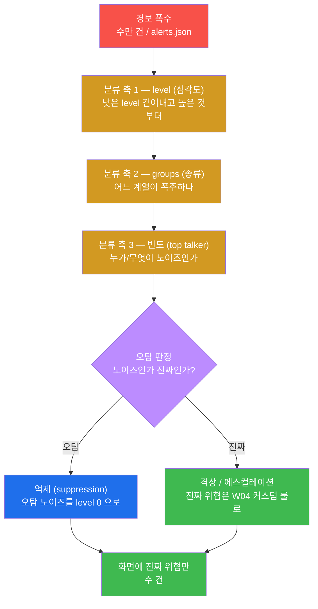
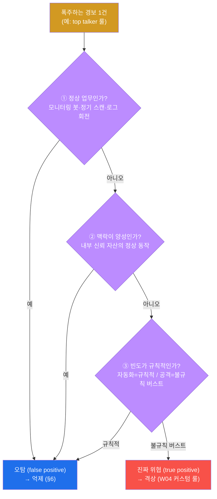
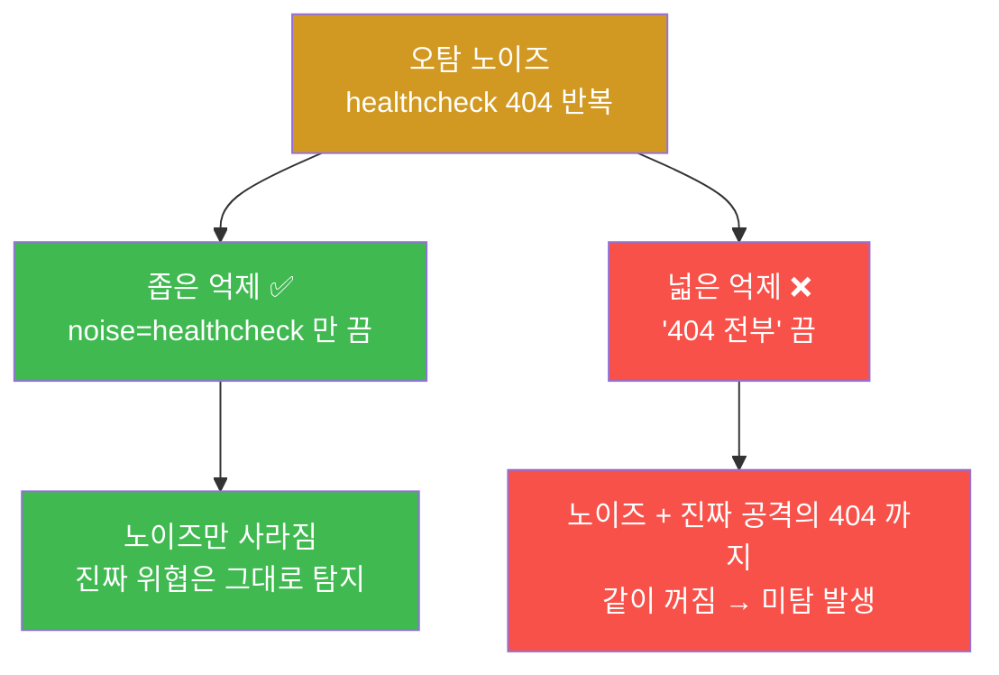

# SOC W05 — 경보 폭주(alert fatigue) 다스리기: 분류·우선순위·오탐 판정·억제

> **본 주차의 한 줄 요약**
>
> SOC 분석가의 진짜 적은 공격이 아니라 **경보 폭주(alert fatigue)** 다. 하루에 수만 건이
> 쏟아지지만 그중 진짜 위협은 손에 꼽는다. 분석가가 전부 들여다보면 정작 중요한 한 건을
> 놓친다. 이번 주는 폭주한 경보를 **세 축(심각도·종류·빈도)으로 분류**하고, 어떤 것이
> **오탐(false positive)** 인지 **판정**하고, 오탐으로 확정된 노이즈를 **억제(suppression)** 해
> 화면에 진짜 위협만 남기는 기술을 학생 본인 손으로 익힌다.

---

## 학습 목표

본 주차 종료 시 학생은 다음 6가지를 **본인 손으로** 할 수 있어야 한다.

1. 경보 폭주(alert fatigue)가 왜 SOC의 핵심 문제인지, 그리고 그것이 방치될 때 어떤 사고로
   이어지는지를 비유 없이 1분 안에 설명한다.
2. `el34-siem` 의 `alerts.json` 을 **level(심각도) 분포** 로 집계해, 폭주의 대부분을 차지하는
   저(低)심각도 경보를 걷어내고 고(高)심각도부터 보는 트리아지 순서를 잡는다.
3. 같은 경보 더미를 **groups(종류) 분포** 와 **빈도(top talker)** 로 집계해, "무엇이/누가
   폭주의 원인인가" 를 30초 안에 식별한다.
4. 폭주하는 한 경보를 놓고 **오탐 판정 3기준**(정상 업무인가 / 맥락이 양성인가 / 빈도가
   규칙적인가)을 적용해 노이즈와 진짜 위협을 가른다.
5. 오탐으로 판정한 노이즈를 **level 0 억제 룰**(suppression rule)로 Wazuh `local_rules.xml`
   에 작성하고, `wazuh-logtest` 로 라이브 무중단 검증한 뒤, 공유 SIEM 을 원상 복원한다.
6. 본 주차의 분류·판정·억제 과정을 1페이지 경보 관리 보고서로 정리하고, 자신이 억제한
   조건이 진짜 위협까지 같이 끄지는 않는지(과도 억제)를 스스로 점검한다.

---

## 0. 용어 해설 (경보 관리 입문)

이번 주 처음 등장하거나 다시 정확히 짚어야 할 용어를 먼저 표로 정리한다. 헷갈리기 쉬운
용어는 바로 뒤 §0.5 에서 일상 비유로 다시 풀어 설명한다.

| 용어 | 영문 | 뜻 | 비유 |
|------|------|----|------|
| **트리아지** | triage | 쏟아지는 경보를 빠르게 분류해 볼 것/버릴 것을 가르는 1차 선별 | 응급실 환자 분류 |
| **경보 폭주** | alert fatigue | 경보가 너무 많아 분석가가 둔감해지고 진짜를 놓치는 상태 | 매일 울리는 화재경보에 무감각해짐 |
| **오탐** | false positive (FP) | 위협이 아닌데 경보가 뜬 것 (양성을 위협으로 오인) | 고양이가 지나가도 울리는 도난경보 |
| **정탐 / 진짜 위협** | true positive (TP) | 실제 위협을 정확히 잡은 경보 | 진짜 침입자에 울린 경보 |
| **미탐** | false negative (FN) | 진짜 위협인데 경보가 안 뜬 것 (놓침) | 침입자가 들어왔는데 경보 무음 |
| **억제** | suppression | 오탐 경보를 화면(기록)에서 끄는 조치 (Wazuh 는 level 0) | 고장난 경보기 음소거 |
| **Wazuh level** | rule level | 경보의 심각도. Wazuh 는 0~16 정수로 매김 | 환자 중증도 점수 |
| **groups** | rule groups | 경보(룰)가 속한 분류 태그 (예: `ids`, `syscheck`) | 신고 유형(화재/도난/의료) |
| **top talker** | — | 경보를 가장 많이 쏟아내는 출발지 또는 룰 | 가장 시끄러운 단골 신고자 |
| **FIM** | File Integrity Monitoring | 중요 파일 변경 감시. Wazuh 의 `syscheck` 그룹 | 금고 CCTV |
| **SCA** | Security Configuration Assessment | CIS 등 보안 설정 점검. Wazuh 의 `sca` 그룹 | 정기 안전 점검 |
| **wazuh-logtest** | — | 룰/디코더가 어떤 로그에 어떻게 발화하는지 시험하는 도구 | 경보기 점검 버튼 |
| **anomaly score** | — | ModSecurity 가 룰 매치마다 점수를 누적해 임계치 넘으면 차단 | 벌점 누적 |

> **선행 복습.** triage·L1·SIEM·Wazuh·level 은 W01 에서, false positive·decoder·룰 작성
> (`local_rules.xml`)·`wazuh-logtest` 는 W04 에서 이미 다뤘다. 이번 주는 그 둘을 합쳐 —
> **"경보가 너무 많을 때 어떻게 줄이는가"** 를 본다. W04 가 "탐지를 **만드는**" 주차였다면,
> W05 는 그 반대로 "경보를 **줄이는**" 주차다.

---

## 0.5 핵심 용어 개념 설명 (헷갈리기 쉬운 것만)

위 표는 한 줄 정의라 처음 보는 학생에게는 부족하다. 본 절에서는 이번 주의 뼈대가 되는
다섯 용어를 일상 비유로 풀어 설명한다. 본문에서 막히면 이 절로 돌아오면 흐름이 끊기지 않는다.

### 0.5.1 경보 폭주(alert fatigue) — 양치기 소년의 마을

마을에 양치기 소년이 있다고 하자. 소년이 "늑대다!" 하고 외칠 때마다 마을 사람들이 달려온다.
그런데 소년이 장난으로 매일 수십 번씩 외치자, 사람들은 점점 무감각해진다. 어느 날 진짜
늑대가 나타나 소년이 외쳤지만, 이번엔 아무도 오지 않는다.

이 우화가 SOC 에서 일어나는 일이 **경보 폭주(alert fatigue)** 다.

- 소년의 거짓 외침 = 오탐(false positive) 경보.
- 무감각해진 마을 사람들 = 둔감해진 분석가.
- 아무도 안 온 진짜 늑대 = 폭주에 묻혀 놓친 진짜 위협(미탐, false negative).

핵심은 — **경보가 너무 많으면, 많다는 사실 자체가 위협이 된다.** 진짜 한 건이 거짓 수만 건에
파묻히기 때문이다. 그래서 SOC 운영의 지속 가능성은 "탐지를 얼마나 많이 만드느냐" 가 아니라
"폭주를 얼마나 잘 다스리느냐" 에 달려 있다. 이번 주가 바로 그 기술이다.

### 0.5.2 트리아지(triage) — 응급실 환자 분류

대형 사고로 응급실에 환자 50명이 한꺼번에 밀려왔다고 하자. 의사가 도착 순서대로 한 명씩
정성껏 보면, 뒤에서 기다리던 중증 환자가 손쓰기 전에 사망할 수 있다. 그래서 응급실은
입구에서 먼저 **분류(triage)** 한다. 빨강(즉시 처치)·노랑(곧)·초록(나중)·검정(사망)으로
중증도를 나누고, 빨강부터 본다.

SOC 의 트리아지도 똑같다. 경보 수만 건을 도착 순서대로 보는 게 아니라, **심각도(level)·종류
(groups)·빈도** 라는 분류 기준으로 빠르게 줄을 세워 "먼저 볼 것 / 나중 볼 것 / 버릴 것" 을
가른다. 이번 주의 §2~§4 가 바로 이 세 분류 축이다.

### 0.5.3 오탐 vs 정탐 vs 미탐 — 도난경보기의 세 가지 상태

집에 도난경보기를 달았다고 하자. 경보기는 다음 네 상황 중 하나에 놓인다.

| 실제 상황 | 경보 울림 | 경보 무음 |
|-----------|-----------|-----------|
| **침입자 있음** | 정탐 (TP) ✅ 제대로 잡음 | 미탐 (FN) ❌ 놓침 — 최악 |
| **침입자 없음** | 오탐 (FP) ⚠️ 헛울림 — 노이즈 | 정상 (TN) ✅ 조용함 |

- **정탐(True Positive)** — 진짜 침입자에 경보가 울렸다. 우리가 원하는 것.
- **오탐(False Positive)** — 고양이가 지나갔는데 경보가 울렸다. 이게 쌓이면 폭주가 된다.
- **미탐(False Negative)** — 진짜 침입자가 들어왔는데 경보가 안 울렸다. 가장 위험하다.

이번 주의 억제(suppression)는 **오탐을 줄이는** 작업이다. 그런데 함부로 억제하면 — 경보기
감도를 너무 낮추면 — **미탐이 늘어난다.** 즉 오탐을 줄이려다 진짜를 놓치게 된다. 그래서
억제는 항상 "노이즈만 좁게 끄고, 위협은 남긴다" 는 원칙으로 한다(§6).

### 0.5.4 Wazuh level — 환자 중증도 점수

Wazuh 는 모든 경보(룰)에 0부터 16까지의 정수 **level** 을 매긴다. 응급실의 중증도 점수와 같다.
숫자가 클수록 위험하다.

| level 대역 | 의미 | 트리아지 행동 |
|-----------|------|--------------|
| **0** | 기록 안 함(억제용) | 화면에 안 뜸 — 이번 주 §6 에서 활용 |
| **1–4** | 정보성 / 시스템 정상 동작 | 대부분 무시 가능 |
| **5–7** | 주목 — 의심스러운 단발 | 맥락 확인 |
| **8–11** | 경고 — 진행형 공격 가능성 | 우선 분석 |
| **12–16** | 고위험 / 침해 가능성 | **즉시** 대응·에스컬레이션 |

폭주한 경보를 보면 압도적 다수가 낮은 level 이다. 그래서 트리아지의 첫 칼질은 항상 **높은
level 부터 보는 것** 이다. level 12 짜리 5건이 level 3 짜리 5,000건보다 훨씬 급하다.

### 0.5.5 groups — 경보가 달고 있는 분류 태그

Wazuh 의 각 룰에는 `groups` 라는 분류 태그가 붙는다. 119 신고에 "화재 / 도난 / 의료" 유형이
붙는 것과 같다. 한 경보를 보면 "이게 어느 계열의 경보인가" 를 이 태그로 안다.

el34 에서 자주 보이는 groups 와 그 의미는 다음과 같다.

| groups 태그 | 어디서 오나 | 의미 |
|------------|------------|------|
| `ids` | Suricata(ips agent 003) | 네트워크 침입탐지 — 스캔·시그니처 |
| `web`, `attacks` | Apache/ModSec(web agent 004) | 웹 공격 — SQLi·XSS 등 |
| `authentication_failed` | sshd 인증 로그 | 로그인 실패 — 무차별 대입 |
| `syscheck` | Wazuh FIM | 파일 변경 감시 (FIM) |
| `sca` | Wazuh SCA | 보안 설정 점검 결과 |

groups 분포를 집계하면 "무엇이 폭주의 원인 종류인가" 가 보인다. 예를 들어 `syscheck`(FIM)
경보가 압도적이면, 어딘가에서 파일이 끊임없이 바뀌고 있다(예: 로그 회전, 임시파일)는
신호이고, 그 소스에 노이즈가 있다는 뜻이다.

---

이 다섯 용어가 본 주차 전체의 기반이다. 이제 폭주를 다스리는 4단계 — **분류 → 판정 → 억제 →
보고** — 를 차례로 본다.

---

## 1. 이번 주의 큰 그림 — 폭주를 진짜만 남기는 깔때기

이번 주의 전 과정을 하나의 깔때기(funnel)로 그리면 다음과 같다. 수만 건의 폭주가 위에서
들어와, 세 분류 축과 오탐 판정·억제를 거치며 화면에는 진짜 위협 몇 건만 남는다.



**왜 이 순서인가.** 분석 비용이 싼 것부터 한다. level 로 한 번 거르면(거의 비용 0) 봐야 할
양이 크게 준다. 그다음 groups·빈도로 "원인 소스" 를 좁히고, 그제야 한 경보를 놓고 오탐인지
판정한다. 판정 결과가 오탐이면 억제하고, 진짜면 (W04 에서 배운) 커스텀 룰로 격상한다. 이
순서를 지키지 않고 처음부터 경보 하나하나를 깊게 파면, 폭주 앞에서 시간이 바닥난다.

> **el34 환경 주의.** 본 주차의 모든 명령은 el34 호스트(`ssh ccc@192.168.0.80`, 비밀번호 1)
> 에서 각 장비 `ssh ccc@<장비IP>`(web 32.80/ips 31.2/siem 32.100)로 실행한다. 분석 대상은 `el34-siem` 컨테이너의
> `/var/ossec/logs/alerts/alerts.json` 이다. el34 는 **공유** SIEM 이므로, 억제 룰은 라이브로
> 적용(`wazuh-control restart`)하지 않고 **`wazuh-logtest` 로 발화만 검증한 뒤 원복** 한다(§6).

---

## 2. 분류 축 1 — level (심각도) 로 거르기

**한 줄 정의.** 폭주를 줄이는 첫 칼질은 경보를 심각도(Wazuh level 0~16)별로 집계해, 낮은
것을 걷어내고 높은 것부터 보는 것이다.

**왜 중요한가.** §0.5.4 에서 봤듯 폭주의 압도적 다수는 낮은 level(정보성)이다. level 분포만
한 번 봐도 "오늘 고위험(12+) 경보가 몇 건인가" 라는, 가장 중요한 숫자를 즉시 얻는다. 분석가가
하루를 시작할 때 첫 번째로 보는 화면이 바로 이것이다.

**el34 에서 어떻게.** `alerts.json` 의 각 줄에서 `.rule.level` 만 뽑아 빈도순으로 집계한다.
`el34-siem` 컨테이너에는 `jq`(JSON 명령행 파서)가 있어 바로 쓸 수 있다.

```bash
ssh ccc@10.20.32.100 'tail -2000 /var/ossec/logs/alerts/alerts.json \
  | jq -rc "\"level=\"+(.rule.level|tostring)" | sort | uniq -c | sort -rn'
```

명령의 각 부분 해석:

- `tail -2000 …alerts.json` — 최근 2,000줄(=최근 경보)만 본다. 파일 전체는 거대하므로 최근만.
- `jq -rc "\"level=\"+(.rule.level|tostring)"` — 각 JSON 줄에서 `.rule.level` 값을 꺼내
  `level=3` 같은 문자열로 만든다(`-r` 은 따옴표 없이, `-c` 는 한 줄로 출력).
- `sort | uniq -c | sort -rn` — 같은 값끼리 모아 개수를 세고(`uniq -c`), 개수 많은 순으로
  정렬(`sort -rn`)한다. 이 3종 조합은 "무엇이 몇 번 나왔나" 를 세는 SOC 의 단골 관용구다.

**결과 해석.** 출력 예시(왼쪽 숫자가 건수):

```
   1840 level=3
    120 level=5
     14 level=7
      3 level=12
```

이 분포가 말해주는 것 — 전체 2,000건 중 1,840건(92%)이 level 3 정보성이라 무시 후보이고,
**진짜 봐야 할 것은 level 12 짜리 3건** 이다. 분석가는 이 3건부터 파고든다. 만약 level 12+
가 평소보다 갑자기 많아졌다면, 그 자체가 침해 진행 신호다.

**한계.** level 은 룰 작성 시점에 정해진 고정값이라 "맥락" 을 모른다. 예를 들어 level 5
경보라도 같은 출발지에서 100번 반복되면 단발 1건보다 훨씬 위험하다. 그래서 level 한 축만으로는
부족하고, 다음의 groups·빈도 축을 함께 본다.

---

## 3. 분류 축 2 — groups (종류) 로 원인 계열 찾기

**한 줄 정의.** 경보가 달고 있는 분류 태그(`.rule.groups`)별로 집계해, **어느 계열의 경보가
폭주하는가** 를 식별한다.

**왜 중요한가.** level 이 "얼마나 위험한가" 라면 groups 는 "무슨 종류인가" 다. 한 그룹이
압도적으로 많으면, 그 소스(네트워크 IDS / FIM / 웹 / 인증 …)에 노이즈 또는 진행형 공격이
있다는 강한 신호다. 폭주의 **원인 위치** 를 좁히는 단계다.

**el34 에서 어떻게.**

```bash
ssh ccc@10.20.32.100 'tail -2000 /var/ossec/logs/alerts/alerts.json \
  | jq -rc .rule.groups | sort | uniq -c | sort -rn | head'
```

`.rule.groups` 는 배열(예: `["ids","attack"]`)이라 `-c` 로 한 줄로 출력한 뒤 같은 조합끼리
센다.

**결과 해석.** 출력 예시:

```
   1200 ["syscheck","ossec"]
    640 ["ids","suricata"]
    150 ["web","attack","attacks"]
     10 ["authentication_failed",...]
```

읽는 법(§0.5.5 의 표 참고):

- `syscheck`(FIM) 이 1,200건으로 압도적 → 어딘가에서 파일이 끊임없이 바뀌는 중. 정상적인
  로그 회전·임시파일일 수도, 공격자의 변조일 수도 있다. **오탐 판정(§5)의 1순위 후보.**
- `ids`(Suricata) 640건 → 네트워크 스캔/시그니처. 이번 주 lab 에서 공격을 재현하면 이 그룹이
  치솟는다.
- `web`/`attacks` 150건 → ModSec 이 잡은 웹 공격(SQLi/XSS). el34 의 web agent(004)가 보낸다.

**한계.** 그룹이 압도적이라는 사실만으로는 오탐인지 정탐인지 알 수 없다. "syscheck 가 많다"
가 "정상 로그 회전" 인지 "공격자 파일 변조" 인지는, 다음 빈도 축과 오탐 판정으로 가린다.

---

## 4. 분류 축 3 — 빈도 (top talker) 로 정체 찾기

**한 줄 정의.** **어떤 룰** 이 / **어떤 출발지** 가 경보를 가장 많이 쏟아내는지(top talker)
집계해, 폭주의 구체적 정체를 짚는다.

**왜 중요한가.** level·groups 가 "위험도" 와 "계열" 을 줬다면, 빈도는 "범인" 을 지목한다.
한 룰 ID 가 폭주의 대부분을 차지하면 그 룰이 오탐 후보이거나 진행형 공격의 증거이고, 한
출발지 IP 가 폭주를 일으키면 집중 공격자이거나 노이즈 소스(모니터링 봇 등)다.

**el34 에서 어떻게.** 두 가지를 본다 — top 룰 ID 와 top 출발지.

```bash
# (1) top 룰 ID — 무엇이 폭주의 대부분인가
ssh ccc@10.20.32.100 'tail -2000 /var/ossec/logs/alerts/alerts.json \
  | jq -rc "\"id=\"+(.rule.id|tostring)" | sort | uniq -c | sort -rn | head'

# (2) top 출발지 — 누가 폭주를 일으키나
ssh ccc@10.20.32.100 'tail -2000 /var/ossec/logs/alerts/alerts.json \
  | jq -rc ".data.src_ip // empty" | sort | uniq -c | sort -rn | head -5'
```

> `.data.src_ip // empty` 의 `// empty` 는 "출발지 필드가 없는 경보(예: 호스트 내부 SCA/FIM)는
> 건너뛰라" 는 jq 문법이다. 출발지가 있는 네트워크/웹 경보만 센다.

**결과 해석.** 예시 — top 룰에서 `31100`(Apache 4xx 응답) 같은 일반 룰이 700건으로 1위이고,
top 출발지에서 `192.168.0.202`(el34 의 내부 공격자 컨테이너) 가 압도적이라면:

- 한 룰이 폭주의 대부분 → 그 룰을 의심한다. **헬스체크 봇의 반복 404** 라면 오탐, **공격자의
  스캔** 이라면 진짜.
- 한 출발지가 폭주 → `192.168.0.202` 한 곳에서 집중적으로 들어온다. el34 는 fw 가 SNAT 하지
  않아 출처 IP 가 보존되므로(W01·W03 참고), 이 IP 로 모든 단계 경보를 한 공격자의 캠페인으로
  묶을 수 있다(상관은 W06 의 주제).

**한계.** 빈도가 높다는 것만으로 위협을 단정할 수 없다. 빈도는 "어디를 자세히 볼지" 를 알려줄
뿐이고, 그것이 오탐인지 정탐인지는 다음 절의 판정 기준으로 결론 낸다.

---

## 5. 오탐(false positive) 판정 — 노이즈인가 진짜인가

세 분류 축으로 "무엇을 자세히 볼지" 를 좁혔다면, 이제 그 경보 하나를 놓고 **오탐인지 진짜인지
판정** 한다. 판정에는 세 가지 기준을 차례로 묻는다.



세 기준을 풀어 설명한다.

1. **정상 업무인가?** — 경보의 원인이 우리가 의도한 정상 작업인지 본다. 헬스체크 봇이 1초마다
   `/healthcheck` 를 때려 404 가 쌓이거나, 정기 취약점 스캐너가 매주 도는 것이라면, 위협이
   아니라 정상 업무다. → 오탐.

2. **맥락이 양성인가?** — 출발지와 대상의 맥락을 본다. 내부 모니터링 자산(신뢰된 IP)이 자기
   역할대로 동작해 뜬 경보라면 양성이다. 반대로 외부/미신뢰 IP 가 만든 경보는 양성으로 보기
   어렵다. → 양성 맥락이면 오탐.

3. **빈도가 규칙적인가?** — 시간 패턴을 본다. 자동화된 정상 작업은 **규칙적**(예: 정확히
   5분마다)이다. 공격은 보통 **불규칙한 버스트**(짧은 시간에 몰아치고 멈춤)다. 일정한 간격의
   반복이면 오탐 쪽, 갑작스러운 버스트면 진짜 쪽이다.

**판정의 출구는 둘.** 세 기준을 통과해 오탐으로 확정되면 **억제(§6)** 한다. 하나라도 진짜
신호가 있으면(불규칙 버스트, 미신뢰 출발지, 비정상 맥락) **진짜 위협** 으로 보고, W04 에서
배운 커스텀 룰로 level 을 격상하거나 L2/IR 로 에스컬레이션한다.

> **주의 — 오탐 판정은 보수적으로.** 애매하면 억제하지 말고 진짜로 둔다. §0.5.3 에서 봤듯
> 억제(오탐 끄기)를 과하게 하면 미탐(진짜 놓침)이 늘어난다. SOC 에서 "헛수고 한 번" 보다
> "놓친 침해 한 번" 이 훨씬 비싸다.

---

## 6. 억제(suppression) — 노이즈를 끈다, 단 좁게

**한 줄 정의.** 오탐으로 판정한 노이즈 경보를 **level 0** 으로 만들어, 화면(기록)에서 치우는
조치다. Wazuh 에서 level 0 = alert 를 만들지 않음 = 억제.

**왜 중요한가.** §5 에서 오탐으로 확정한 노이즈를 그대로 두면 폭주가 계속되고, 양치기 소년
효과(§0.5.1)로 진짜를 놓친다. 억제는 깔때기의 마지막 단계로, 분류·판정의 결론을 실제 화면에
반영하는 행동이다.

**el34 에서 어떻게.** W04 에서 커스텀 룰을 쓴 그 파일 `/var/ossec/etc/rules/local_rules.xml`
에, level 을 **0** 으로 둔 룰을 추가한다. 핵심은 **정상 패턴만 좁게** 매치시키는 것이다.

```xml
<group name="soc_w5,">
  <rule id="100450" level="0">
    <decoded_as>json</decoded_as>
    <field name="noise">healthcheck</field>
    <description>SOC W05 - suppress benign healthcheck noise</description>
  </rule>
</group>
```

각 요소의 의미:

- `id="100450"` — 사용자 룰 번호. SOC 트랙은 주차별 네임스페이스를 쓴다(W04=`1004xx`,
  **W05=`100450`**). 기본 룰(10만 미만)과 충돌하지 않는다.
- `level="0"` — **이 룰이 매치되면 alert 를 만들지 않는다.** 이것이 억제의 핵심이다.
- `<decoded_as>json</decoded_as>` / `<field name="noise">healthcheck</field>` — **억제 조건.**
  JSON 으로 디코딩된 로그 중 `noise` 필드가 정확히 `healthcheck` 인 것만 끈다. 즉 "정상
  패턴만 좁게" 매치한다.

**과도 억제의 위험 — 좁게 vs 넓게.** 억제는 양날의 칼이다. 조건을 넓게 잡으면 노이즈와 함께
진짜 위협까지 꺼져 미탐(false negative)이 된다.



그래서 억제 조건은 항상 **노이즈에만 해당하는 고유한 정상 패턴**(특정 URL, 특정 봇 UA, 특정
필드값)으로 좁게 건다. "그 종류 전부" 를 끄는 넓은 억제는 금물이다.

**el34 에서의 검증 — 라이브 무중단.** el34 의 SIEM 은 여러 학생이 공유하므로, 억제 룰을 실제로
적용(`wazuh-control restart`)하면 다른 학생의 분석을 망친다. 그래서 본 주차는 **`wazuh-logtest`
로 룰이 level 0 으로 발화하는지 검증만** 하고, 검증이 끝나면 추가한 룰을 **삭제(원복)** 한다.
W04 에서 배운 그 무중단 검증 절차와 똑같다.

```bash
# 가짜 로그를 logtest 에 넣어, 룰 100450 이 level 0 으로 매치되는지 확인
echo '{"noise":"healthcheck","src_ip":"10.0.0.5"}' | sudo /var/ossec/bin/wazuh-logtest
#  → Phase 3 에서 id: 100450, level: 0 이 보이면 억제 룰 정상 동작 (alert 미생성)
```

`wazuh-logtest` 는 라이브 `analysisd` 를 멈추지 않고, 입력한 한 줄이 어느 decoder → 어느 rule
로 흘러가는지 단계(Phase 1 decoder → Phase 3 rule)별로 보여주는 점검 도구다. 여기서 `level: 0`
이 확인되면, 실제 운영(restart 적용)에서도 이 노이즈는 화면에 뜨지 않을 것이라고 보장된다.

> ⚠️ **공유 el34 보존 수칙.** ① 작업 전 `local_rules.xml` 을 백업(`cp`)한다. ② 룰을 추가하고
> `wazuh-logtest` 로 발화만 검증한다. ③ 끝나면 백업으로 **원복** 한다(`cp` 복원 + 잔재 0 확인).
> 라이브 `restart` 는 하지 않는다. lab 의 step 7 이 이 절차를 그대로 따른다.

---

## 7. 실습 안내 (lab 8 미션)

본 주차 lab(`lab_week05.yaml`)은 폭주 → 분류 → 판정 → 억제 → 보고의 전 과정을 8 미션으로
밟는다. 각 미션이 강의의 어느 절을 손으로 확인하는지, 그리고 4축(왜/무엇/해석/실전)으로
정리한다.

### 미션 1 — 점검: 경보량 (강의 §1)

- **왜 하는가?** 분석을 시작하기 전, manager 의 채점 엔진(`analysisd`)이 살아 있고 경보가
  실제로 쌓이고 있는지 확인한다. 엔진이 죽었으면 폭주도 분석도 없다.
- **무엇을 알 수 있나?** `analysisd` 가동 여부 + 최근 2,000줄 중 경보 건수(=폭주의 척도).
- **결과 해석.** `analysisd is running` + 경보 다수면 정상. 경보가 0 이면 소스(agent) 연결을
  의심한다.
- **실전 활용.** SIEM 운영자가 하루를 여는 첫 명령. "오늘 경보 엔진은 살아 있고, 얼마나
  쌓였나" 를 30초에 답한다.

### 미션 2 — 경보 폭주 재현 (강의 §1, §5 의 입력 데이터 생성)

- **왜 하는가?** 분석할 폭주를 직접 만든다. 외부 공격자 VM 192.168.0.202에서 포트 스캔 + 웹
  SQLi 를 반복해, Suricata(`ids`)·ModSec(`web`) 경보를 다발로 일으킨다.
- **무엇을 알 수 있나?** 한 공격자의 반복 행위가 어떻게 여러 경보의 더미가 되는지. 실제 SOC
  가 마주하는 폭주 상황의 축소판이다.
- **결과 해석.** `flood done` 출력 후, 잠시 뒤 미션 3~5 의 집계에서 경보 수가 늘어 있으면
  재현 성공.
- **실전 활용.** Purple Team 이 탐지 파이프라인을 시험할 때 쓰는 "통제된 공격 주입" 기법이다.

### 미션 3 — level 분포 분석 (강의 §2)

- **왜 하는가?** 폭주의 첫 칼질. 심각도별로 집계해 고위험부터 보는 순서를 잡는다.
- **무엇을 알 수 있나?** 폭주의 대부분이 낮은 level 이라는 사실과, 오늘 봐야 할 고위험(12+)
  경보의 정확한 건수.
- **결과 해석.** `level=3` 같은 저심각도가 다수, `level=12` 가 소수면 전형적인 분포. 12+ 가
  평소보다 급증했다면 침해 진행 신호.
- **실전 활용.** 분석가의 매일 첫 화면. level 분포 한 장으로 그날의 위험도를 가늠한다.

### 미션 4 — groups 분포 분석 (강의 §3)

- **왜 하는가?** 폭주의 **원인 계열** 을 찾는다. 어느 그룹(ids/syscheck/web…)이 압도적인지 본다.
- **무엇을 알 수 있나?** 노이즈의 출처 위치. 예컨대 `syscheck`(FIM) 압도 → 파일이 끊임없이
  바뀌는 소스가 있다.
- **결과 해석.** 한 그룹이 압도적이면 그 소스에 노이즈 또는 진행형 공격이 있다는 신호.
  `ids` 가 치솟았다면 미션 2 의 스캔이 반영된 것.
- **실전 활용.** "오늘 폭주는 어느 계열이 주범인가" 를 한눈에 파악해 분석 범위를 좁힌다.

### 미션 5 — 빈도 분석 (강의 §4)

- **왜 하는가?** 폭주의 **구체적 범인**(top 룰 / top 출발지)을 지목한다.
- **무엇을 알 수 있나?** 가장 시끄러운 룰 ID 와 가장 시끄러운 출발지 IP.
- **결과 해석.** 한 룰/출발지가 폭주의 대부분이면 → 오탐 후보이거나 집중 공격. el34 는 출처
  보존이라 `192.168.0.202` 같은 공격자 IP 가 그대로 top 에 뜬다.
- **실전 활용.** "어느 한 곳을 자세히 볼지" 를 정하는 단계. 다음 미션의 오탐 판정 대상이 된다.

### 미션 6 — 오탐 판정 (강의 §5)

- **왜 하는가?** 빈도로 지목한 경보가 노이즈인지 진짜인지 결론 낸다.
- **무엇을 알 수 있나?** 오탐 판정 3기준(정상 업무 / 양성 맥락 / 규칙적 빈도)의 적용 결과.
- **결과 해석.** 세 기준을 통과하면 오탐(→억제), 진짜 신호가 있으면 정탐(→격상).
- **실전 활용.** L1 트리아지의 핵심 의사결정. 매 경보마다 분석가가 내리는 판단이다.

### 미션 7 — 억제 룰 작성 + 검증 + 보존 (강의 §6)

- **왜 하는가?** 오탐으로 판정한 노이즈를 level 0 억제 룰로 실제로 끈다(좁은 조건).
- **무엇을 알 수 있나?** `local_rules.xml` 에 억제 룰(`100450`, level 0)을 작성하고
  `wazuh-logtest` 로 발화를 검증하는 전체 절차.
- **결과 해석.** logtest 에서 `id: 100450`, `level: 0` 으로 매치되면 억제 정상(= alert 미생성).
  마지막에 `cp` 복원 후 잔재 0 이면 공유 SIEM 보존 성공.
- **실전 활용.** SOC 의 일상적 룰 튜닝. 단, 공유 환경에서는 항상 백업 → 검증 → 원복.

### 미션 8 — 경보 관리 보고서 (강의 §1~§6 종합)

- **왜 하는가?** 분류·판정·억제의 과정을 한 장으로 정리해, 운영 인수인계가 가능한 산출물로
  만든다.
- **무엇을 알 수 있나?** 폭주 현황(분류 3축) + 원인(top 룰/출발지) + 오탐 판정 + 억제 조치를
  한 흐름으로 서술하는 능력.
- **결과 해석.** 보고서에 분류 3축·오탐 판정·억제가 모두 포함되면 합격.
- **실전 활용.** SOC 의 교대 인수인계(shift handover) 보고서가 정확히 이 형식이다.

> **공통 수칙.** 명령은 모두 el34 호스트(`ssh ccc@192.168.0.80`)에서. 억제 룰은 `wazuh-logtest`
> 로만 검증하고 끝나면 삭제(공유 SIEM 보존). 미션 1~6 은 관측·분석이라 인프라를 바꾸지 않고,
> 미션 7 만 룰을 추가하지만 즉시 원복한다.

---

## 8. 핵심 정리 (한 줄씩)

1. **경보 폭주(alert fatigue)** — SOC 의 진짜 적. 거짓 수만 건에 진짜 한 건이 묻힌다
   (양치기 소년 효과).
2. **분류 3축** — level(심각도)로 거르고, groups(종류)로 원인 계열을 찾고, 빈도(top talker)로
   범인을 지목한다. 싼 것부터.
3. **오탐 판정 3기준** — 정상 업무인가 / 맥락이 양성인가 / 빈도가 규칙적인가. 셋을 통과하면
   오탐, 진짜 신호가 있으면 정탐.
4. **억제(suppression)** — 오탐 노이즈를 level 0 으로. 단 **좁게** — 넓게 끄면 진짜까지 꺼져
   미탐이 된다.
5. **공유 SIEM 수칙** — `wazuh-logtest` 로 무중단 검증 + 룰 원복. 라이브 `restart` 금지.
6. **억제 vs 격상** — 오탐은 끄고(W05), 진짜는 W04 의 커스텀 룰로 격상한다. 둘은 한 쌍이다.

---

## 9. 다음 주차 (W06) 예고 — ATT&CK 으로 캠페인 엮기

W05 는 폭주를 줄여 화면에 진짜 위협만 남겼다. W06 은 그 남은 경보들을 **MITRE ATT&CK** 매트릭스
(공격의 전술·기술 표준 분류)로 읽는다. 흩어진 경보를 정찰 → 초기침투 → 자격증명 → … 의
단계로 매핑하고, 같은 출발지·시간순으로 묶어 "지금 한 공격자가 **어느 단계까지** 왔는가" 를
하나의 캠페인으로 본다. W05 의 빈도·출처 분석이 그 상관(correlation)의 출발점이 된다.
