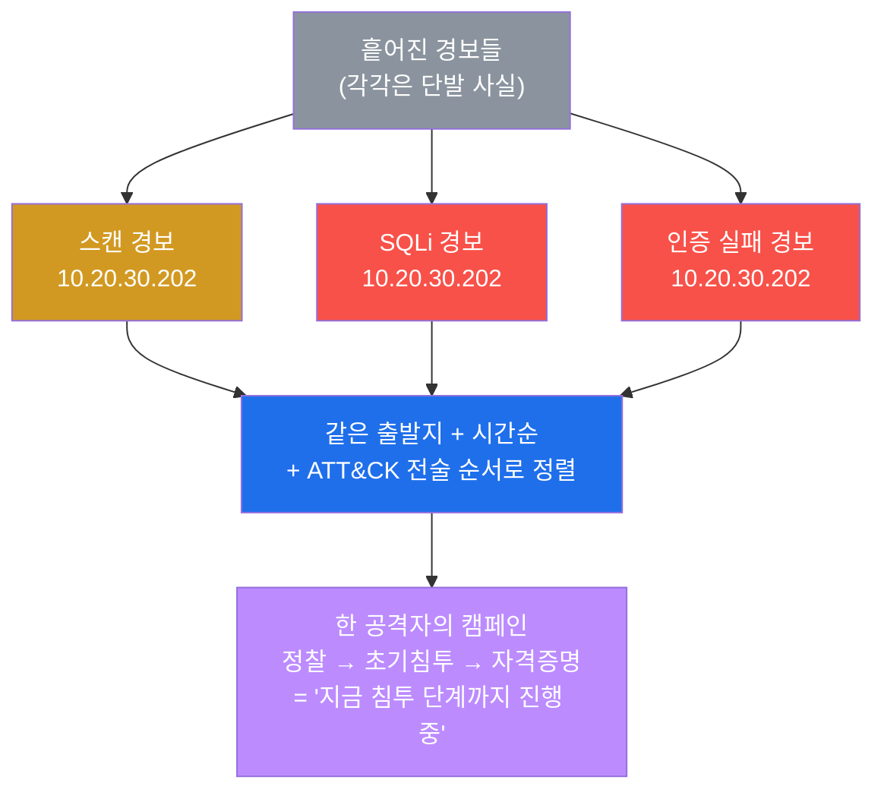
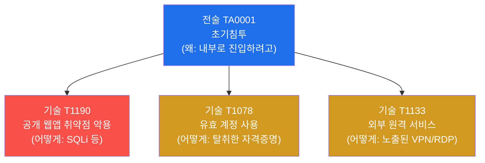
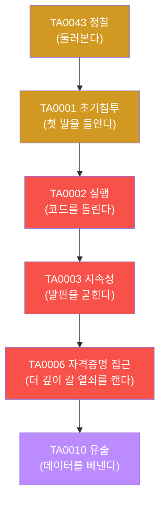
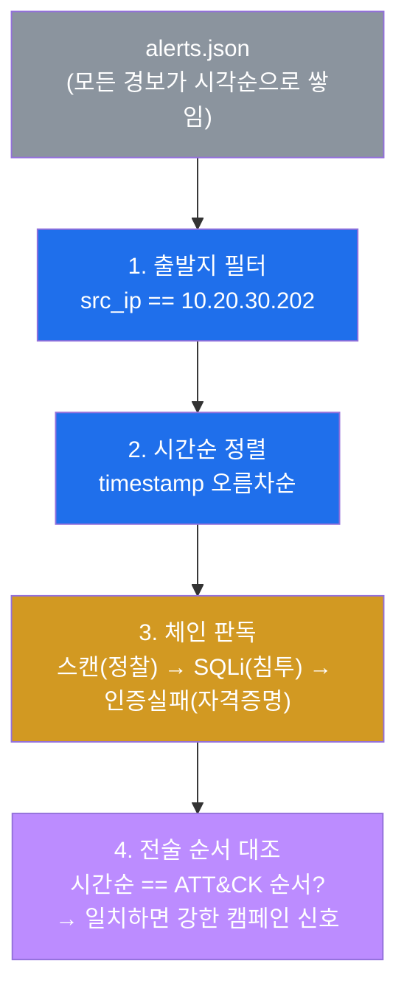
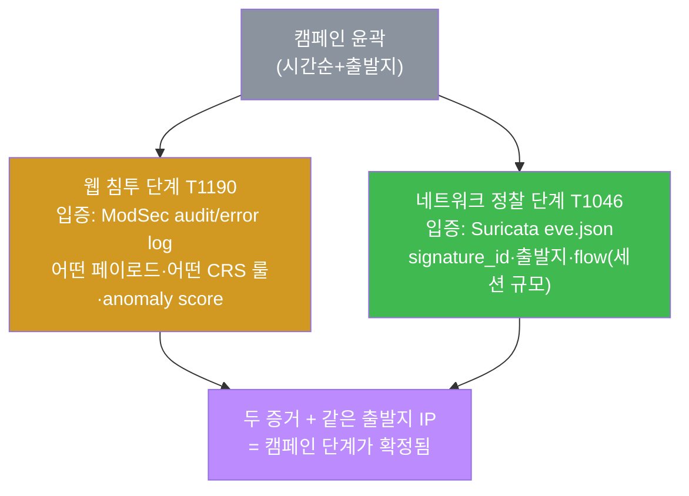
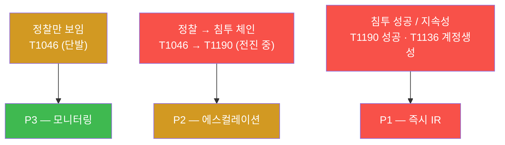

# SOC W06 — 분석가의 눈: 흩어진 경보를 ATT&CK으로 읽고 한 캠페인으로 엮기

> **본 주차의 한 줄 요약**
>
> W05까지 우리는 경보의 양을 다스렸다(분류·오탐 판정·억제). 이제 남은 진짜 경보를
> **하나하나 떼어 보는 것**이 아니라, **공격자의 머릿속 순서대로** 다시 엮어 읽는다. 그
> 순서를 표준화한 지도가 **MITRE ATT&CK** 이다. 학생은 el34의 흩어진 경보(스캔·SQLi·인증
> 실패)를 ATT&CK 전술/기술로 매핑하고, 같은 **출발지 IP + 시간순**으로 묶어 한 공격자의
> **캠페인**으로 재구성한 뒤, ModSec·Suricata 로그로 각 단계를 입증하고, 최종적으로
> **P1~P4 우선순위**를 매겨 에스컬레이션 여부를 판정한다.

---

## 학습 목표

본 주차 종료 시 학생은 다음 6가지를 **본인 손으로** 할 수 있어야 한다.

1. MITRE ATT&CK의 **전술(Tactic)** 과 **기술(Technique)** 의 차이를 비유 없이 설명하고,
   임의의 경보를 전술 번호(TA0043 등)와 기술 번호(T1190 등)에 1분 안에 매핑한다.
2. "공격이 지금 **어느 단계**까지 왔는가"를 ATT&CK 전술 순서(정찰→초기침투→…→유출)로
   판단하고, 단계 깊이가 사건의 심각도와 어떻게 직결되는지 설명한다.
3. el34의 `alerts.json`에서 **같은 출발지 IP(10.20.30.202)** 의 경보를 **시간순**으로
   추출해, 흩어진 단발 경보를 한 공격자의 **캠페인 타임라인**으로 재구성한다.
4. 캠페인의 웹 침투 단계(T1190)를 **ModSec** 의 CRS 룰 ID(942·949110)로 입증하고,
   정찰 단계(T1046)를 **Suricata** 의 `signature_id`로 입증한다(다소스 상관).
5. ATT&CK 단계 깊이 + 체인 진전 여부로 사건을 **P1~P4** 로 분류하고, 에스컬레이션
   (L2/IR로 올림) 여부를 근거와 함께 결정한다.
6. 위 분석을 ATT&CK 매핑 → 캠페인 재구성 → 다소스 증거 → 에스컬레이션 순서의
   1페이지 **캠페인 분석 보고서**로 정리한다.

---

## 0. 용어 해설 (캠페인 분석 입문)

본 주차에서 처음 등장하는 핵심 용어다. 각 용어는 한 줄 정의와 일상 비유로 먼저 잡고,
본문에서 다시 깊게 설명한다.

| 용어 | 영문 | 뜻 | 비유 |
|------|------|----|------|
| **MITRE ATT&CK** | Adversarial Tactics, Techniques & Common Knowledge | 실제 공격자 행위를 전술·기술로 정리한 공개 지식베이스 | 범죄 수법 백과사전 |
| **전술** | Tactic (TA번호) | 공격자가 **왜**(목적/단계) — 정찰·초기침투·지속성 등 | 강도의 "목적"(잠입·금고털이) |
| **기술** | Technique (T번호) | 그 목적을 **어떻게** 달성하나 (구체적 수법) | 강도의 "수법"(유리 절단·열쇠 복제) |
| **TTP** | Tactics, Techniques & Procedures | 전술+기술+절차. 공격자의 "행동 양식" 묶음 | 특정 범죄 조직의 상습 수법 |
| **kill chain** | Cyber Kill Chain | 공격을 시간순 단계로 나눈 모델(정찰→무기화→…→목적달성) | 강도가 거치는 단계(답사→침입→탈출) |
| **캠페인 재구성** | Campaign reconstruction | 흩어진 경보를 한 공격자의 단계적 작전으로 다시 엮기 | 흩어진 CCTV 장면을 한 사건으로 편집 |
| **다소스 상관** | Multi-source correlation | 여러 보안 도구의 로그를 교차해 한 사건을 입증 | 목격자·CCTV·통화기록을 맞춰보기 |
| **IOC** | Indicator of Compromise | 침해 지표(악성 IP·해시·도메인 등) | 수배범의 지문·차량번호 |
| **에스컬레이션** | Escalation | 분석가가 상급(L2/IR)으로 사건을 올리는 절차 | 일선 경찰이 강력계로 사건 이관 |
| **트리아지** | Triage | 다수 사건을 심각도순으로 분류·우선처리 | 응급실의 환자 분류 |
| **anomaly score** | — | ModSec이 한 요청에 누적한 위험 점수(임계 초과 시 차단) | 검문 감점 누적(일정 점수 넘으면 체포) |
| **flow** | — | Suricata가 추적하는 한 통신 세션(연결) 단위 | 통화 한 건(시작~종료) |

---

## 0.5 신입생 친화 핵심 개념 — "경보 한 줄"과 "공격 한 편"의 차이

위 표는 한 줄 정의라 신입생에게는 부족하다. 본 절에서는 W06을 관통하는 가장 중요한
사고 전환 하나를 일상 비유로 풀어 둔다.

### 0.5.1 흩어진 경보 = 흩어진 CCTV 장면

학생이 한 상가 건물의 보안 관제실에 앉아 있다고 하자. 모니터에는 경보가 줄줄이 뜬다.

- 14:01 — 3층 비상구 센서 작동
- 14:03 — 2층 창문 진동 감지
- 14:05 — 1층 금고실 도어 5회 오류

신입 관제원은 이 셋을 **따로따로** 본다. "센서 오작동 하나, 바람 때문에 창문 흔들림 하나,
직원이 비밀번호 잘못 누른 것 하나." 각각은 사소해 보여서 전부 무시한다.

숙련된 관제원은 다르게 본다. **시간순**으로 줄을 세우고, **위치가 위→아래로 이어지는** 것을
보고는 "한 사람이 3층으로 들어와 2층을 거쳐 1층 금고로 내려갔다"는 **하나의 침입 작전**으로
읽는다. 똑같은 경보 세 줄이 한 명에게는 노이즈, 다른 한 명에게는 진행 중인 강도 사건이다.

이 차이가 바로 W06의 전부다. 보안 경보도 똑같다.

- 스캔 경보 하나, SQLi 경보 하나, 인증 실패 경보 하나 — 따로 보면 흔한 노이즈.
- 같은 **출발지 IP**에서, **시간순**으로, **공격자가 보통 밟는 순서**(먼저 정찰, 다음 침투)로
  이어지면 — 그것은 **한 공격자의 캠페인**이다.

### 0.5.2 그 "공격자가 보통 밟는 순서"를 표준으로 적은 것이 ATT&CK

문제는 "공격자가 보통 밟는 순서"를 사람마다 다르게 안다는 것이다. 그래서 전 세계 분석가가
같은 언어로 말하도록, **MITRE**(미국의 비영리 연구기관)가 실제 공격 사례 수천 건을 분석해
**공격자의 목적(전술)과 수법(기술)을 번호로 정리**한 것이 **ATT&CK** 이다.

비유하자면 ATT&CK은 **범죄 수법 백과사전**이다. 형사들이 "이건 T1190 수법이야"라고 하면,
설명 없이도 서로 "공개된 웹 서비스의 취약점을 찔러 들어온 초기 침투구나"를 안다. ATT&CK이
없으면 분석가 A는 "SQL 주입 공격", 분석가 B는 "DB 해킹 시도", 분석가 C는 "웹 침투"라고 제각각
부르고, 보고서·자동화·정보 공유가 전부 어긋난다.

### 0.5.3 한 사건을 여러 증거로 확인 = 다소스 상관

강도 사건을 입증할 때 형사는 한 가지 증거만 믿지 않는다. **목격자 진술 + CCTV 영상 +
통화 기록**을 맞춰본다. 셋이 같은 시각·같은 인물을 가리키면 증거가 강해진다.

보안도 같다. el34에는 세 개의 "CCTV"가 있다.

- **Suricata**(ips) — 네트워크에서 본 장면(스캔·서명 매치).
- **ModSecurity**(web) — 웹 요청에서 본 장면(어떤 페이로드가 어떤 룰에 걸렸나).
- **Wazuh**(siem) — 위 둘을 포함한 모든 경보가 모이는 관제실.

같은 출발지 IP·같은 시각의 흔적이 세 곳에서 맞아떨어지면, "이 단계는 확실히 일어났다"가
입증된다. 이것이 **다소스 상관(multi-source correlation)** 이다. el34는 fw가 출처 IP를
바꾸지 않으므로(SNAT 안 함) 세 도구 모두에 **같은 공격자 IP**가 찍힌다 — 상관의 전제 조건이
공짜로 충족된다.

이 세 가지(경보를 단계로 읽기 / ATT&CK 표준 / 다소스 상관)가 W06 본문의 기반이다.

---

## 1. 이번 주의 통찰 — 경보를 "단계"로 읽는다

### 1.1 한 줄 답: 단발 경보는 위협의 절반만 보여준다

SOC 분석가가 마주하는 경보는 대부분 **한 줄짜리 사실**이다. "10.20.30.202가 포트 스캔을
했다." 그 자체로는 위험도를 알 수 없다. 단순 호기심일 수도, 본격 침투의 **1단계**일 수도
있다. 경보 한 줄만 봐서는 둘을 구분하지 못한다.

차이를 만드는 것은 **그 경보의 앞뒤**다. 같은 출발지에서 스캔 직후에 SQLi가, 그 뒤에 인증
무차별 대입이 이어진다면 — 이것은 호기심이 아니라 **단계적으로 진행 중인 공격**이다.
그래서 분석가는 경보를 떼어 보지 않고, **공격자의 단계(전술) 순서**로 다시 엮어 읽는다.



**왜 중요한가.** 트리아지(응급실식 분류)의 우선순위가 여기서 갈린다. "정찰만 보이는 단발"은
모니터링으로 충분하지만, "정찰→침투로 전진 중인 체인"은 즉시 상급으로 올려야 한다. 같은
경보라도 **캠페인 속 위치**가 심각도를 결정한다.

### 1.2 이번 주의 위치 — W05에서 W07로 가는 다리

| 주차 | 분석가가 하는 일 | 핵심 질문 |
|------|----------------|----------|
| W04 | 못 잡던 위협을 커스텀 룰로 잡는다 | "탐지를 어떻게 만드나?" |
| W05 | 경보 폭주를 분류·억제해 진짜만 남긴다 | "노이즈를 어떻게 줄이나?" |
| **W06** | **남은 진짜 경보를 ATT&CK으로 읽어 캠페인으로 엮는다** | **"지금 어느 단계까지 왔나?"** |
| W07 | 탐지를 SIGMA 표준으로 한 번 쓰고 어디서나 이식 | "탐지를 어떻게 표준화하나?" |

W05가 **양**(noise reduction)의 문제였다면, W06은 **의미**(what does it mean)의 문제다.
남은 경보 한 줄 한 줄에 "이건 공격의 어느 단계인가?"라는 질문을 붙이는 것이 이번 주의 일이다.

---

## 2. MITRE ATT&CK 매트릭스 — 전술과 기술

### 2.1 ATT&CK이란 무엇인가

**한 줄 정의.** **MITRE ATT&CK**(*Adversarial Tactics, Techniques & Common Knowledge*)은
실제로 관측된 공격자 행위를 **전술(왜)** 과 **기술(어떻게)** 로 분류해 번호를 붙인 공개
지식베이스다. MITRE는 미국의 비영리 연구기관이며, ATT&CK은 전 세계 SOC·CTI·레드팀이 같은
언어로 위협을 기술하는 사실상의 표준이다.

**왜 중요한가.** ATT&CK 이전에는 같은 공격을 분석가마다 다른 말로 불러, 보고서·탐지 룰·
위협 정보 공유가 서로 어긋났다. ATT&CK은 "T1190"처럼 번호 하나로 정확히 같은 의미를
공유하게 해준다. 그래서 Wazuh·Suricata·OpenCTI 같은 도구도 경보를 ATT&CK 번호로 태깅한다.

**el34에서 어떻게.** 본 주차는 el34에서 발생하는 세 종류의 대표 경보(스캔·SQLi·인증 실패)를
ATT&CK 번호에 직접 매핑하고, 그 번호의 **순서**로 캠페인을 읽는다.

**한계/주의.** ATT&CK은 "알려진 행위의 분류"다. 분류가 곧 탐지를 보장하지는 않으며(매핑은
사람이 한다), 한 경보가 둘 이상의 기술에 걸칠 수도 있다. 또한 ATT&CK 번호를 외우는 것이
목적이 아니라, **단계 순서로 위협을 읽는 사고방식**을 익히는 것이 목적이다.

### 2.2 전술(Tactic) vs 기술(Technique) — 가장 중요한 구분

이 둘을 헷갈리면 ATT&CK 전체가 흔들린다. 정확히 잡고 가자.

- **전술(Tactic, TA번호)** = 공격자가 **왜** 그 행동을 하는가. 즉 **목적/단계**다. 예:
  "정찰(Reconnaissance)", "초기침투(Initial Access)", "지속성(Persistence)". 전술은
  공격의 **큰 흐름**이며, 시간순으로 대략 정찰 → 초기침투 → 실행 → 지속성 → … → 유출의
  순서를 따른다.
- **기술(Technique, T번호)** = 그 목적을 **어떻게** 이루는가. 즉 **구체적 수법**이다. 예:
  초기침투(전술)를 이루는 기술로 "T1190 공개 웹앱 취약점 악용", "T1078 유효 계정 사용" 등이
  있다. 한 전술 아래 여러 기술이 존재한다.



**비유.** 전술은 강도의 **목적**("금고를 털겠다")이고, 기술은 그 목적을 이루는 **수법**
("유리를 자른다 / 열쇠를 복제한다 / 직원을 매수한다")이다. 형사 보고서에 "목적: 금고털이,
수법: 유리 절단"이라고 적듯, 분석가는 "전술: 초기침투(TA0001), 기술: SQLi(T1190)"라고 적는다.

### 2.3 el34 경보 → ATT&CK 매핑 표

본 주차의 lab에서 재현·관측하는 경보를 ATT&CK에 매핑하면 다음과 같다. 이 표가 실습
3의 핵심 산출물이다.

| el34 경보 | 전술 (왜) | 기술 (어떻게) | 어디서 보이나 |
|-----------|----------|--------------|--------------|
| 포트 스캔 | TA0043 정찰(Reconnaissance) | T1046 Network Service Scanning | Suricata eve.json |
| SQLi 페이로드 | TA0001 초기침투(Initial Access) | T1190 Exploit Public-Facing Application | ModSec / eve.json |
| SSH 무차별 대입 | TA0006 자격증명 접근(Credential Access) | T1110 Brute Force | Wazuh alerts.json |
| 백도어 계정 생성 | TA0003 지속성(Persistence) | T1136 Create Account | Wazuh alerts.json |
| 인코딩된 셸 명령 | TA0002 실행(Execution) | T1059 Command and Scripting Interpreter | Wazuh alerts.json |

매핑을 끝내고 **전술 번호의 순서**를 보면 사건의 성격이 드러난다. TA0043(정찰)만
있으면 "이제 막 둘러보는 초기 단계"이고, TA0003(지속성)·TA0002(실행)까지 보이면
"이미 깊숙이 들어와 발판을 굳히는 심각 단계"다. **단계가 깊을수록 위험하다** — 이것이
2.4와 5장(에스컬레이션)의 핵심 원리다.

### 2.4 ATT&CK 전술 순서 = kill chain = 위협의 깊이

**한 줄 정의.** **kill chain(사이버 킬 체인)** 은 공격을 시간순 단계로 나눈 모델이다.
원래 Lockheed Martin이 7단계(정찰→무기화→전달→악용→설치→C2→목적달성)로 제시했고, ATT&CK의
전술 순서가 이를 더 세분화한 현대판이다. 핵심은 **공격에는 순서가 있다**는 것이다.



**왜 중요한가.** 단계가 위로 갈수록(정찰→유출) **피해가 커지고 되돌리기 어렵다**. 정찰
단계의 공격은 아직 아무 피해도 없지만(주황), 유출 단계라면 이미 데이터가 빠져나간 뒤다(보라).
그래서 분석가는 캠페인이 **지금 어느 단계인지**를 보고, 그에 비례해 대응 강도를 정한다.

**el34에서 어떻게.** 실습 4에서 같은 출발지 경보를 시간순으로 늘어놓으면, 그 순서가
ATT&CK 전술 순서(정찰→초기침투)와 일치하는 것을 직접 확인한다. 시간순과 전술 순서가
맞아떨어지는 것이 **"이것은 우연한 노이즈가 아니라 의도된 캠페인"** 이라는 강한 신호다.

**한계/주의.** 실제 공격이 항상 교과서 순서를 따르지는 않는다(단계 건너뛰기·반복). 또한
"정찰만 보인다"가 곧 "안전"은 아니다 — 탐지 못 한 후속 단계가 진행 중일 수 있다. 단계
순서는 우선순위 판단의 **강력한 보조 신호**이지, 절대 규칙이 아니다.

---

## 3. 캠페인 재구성 — 시간순 + 출발지 상관

### 3.1 캠페인이란 무엇인가

**한 줄 정의.** **캠페인(campaign)** 은 한 공격자(또는 한 그룹)가 하나의 목표를 향해
단계적으로 수행하는 일련의 공격 활동이다. **캠페인 재구성**은 SIEM에 흩어진 단발 경보들을
다시 한 공격자의 작전으로 엮어내는 분석 작업이다.

**왜 중요한가.** SIEM은 경보를 **발생 순서대로 한 줄씩** 쌓을 뿐, "이 경보와 저 경보가 같은
공격자의 같은 작전"이라고 묶어주지 않는다. 그 연결은 분석가의 몫이다. 묶지 못하면 분석가는
스캔 1건·SQLi 1건·인증실패 1건을 각각 사소한 사건으로 닫아버리고, 그 합이 **진행 중인 침투**
라는 사실을 놓친다.

### 3.2 두 개의 상관 키 — 출발지와 시간

흩어진 경보를 한 캠페인으로 엮는 데는 두 가지 키가 쓰인다.

- **출발지 상관(같은 src_ip)** — 같은 공격자 IP에서 나온 경보끼리 묶는다. el34는 fw가
  SNAT를 하지 않아 출처 IP가 Suricata·ModSec·Wazuh 전 계층에 **그대로 보존**되므로,
  `10.20.30.202`(내부 발판 공격자) 또는 `192.168.0.202`(외부 공격자 VM)로 정확히 묶을 수
  있다. (구 6v6 인프라는 client가 hop IP로 보이는 문제가 있어 이 상관이 어려웠다.)
- **시간순 정렬(timestamp)** — 묶은 경보를 발생 시각순으로 늘어놓는다. 그 순서가 곧 공격자의
  진행 순서다.



**el34에서 어떻게.** 실습 4에서 다음 한 줄로 출발지 필터 + 시간순 추출을 수행한다. siem
컨테이너에는 `jq`가 깔려 있어 alerts.json을 직접 파싱할 수 있다(이 명령은 변경 금지 검증값).

```bash
docker exec el34-siem sh -c 'tail -2000 /var/ossec/logs/alerts/alerts.json | jq -rc "select(.data.src_ip==\"10.20.30.202\")|[.timestamp,.rule.description]|@tsv" | tail -10'
```

- `tail -2000` — 최근 경보 2000줄만 본다(전체를 다 읽으면 느리다).
- `jq -rc "select(...)"` — JSON에서 `data.src_ip`가 공격자 IP인 줄만 고른다.
- `[.timestamp,.rule.description]|@tsv` — 시각과 경보 설명만 탭으로 뽑는다.
- `| tail -10` — 가장 최근 10건을 시간순으로 본다.

출력의 각 줄을 위에서 아래로 읽으면 "스캔 → SQLi → …"의 진행이 시각과 함께 드러난다.

**한계/주의.** 출발지 IP는 위조·프록시될 수 있으므로(공격자가 IP를 바꿔가며 공격) IP만으로
캠페인을 단정하지 않는다. 시간 창이 너무 넓으면 무관한 경보가 섞이고, 너무 좁으면 느린
공격(low-and-slow)을 놓친다. 그래서 IP·시간에 더해 **다소스 증거**(4장)로 보강한다.

---

## 4. 심층 분석 — ModSec + Suricata로 단계를 입증하기(다소스 상관)

### 4.1 왜 다소스인가

3장에서 시간순+출발지로 캠페인의 **윤곽**을 잡았다. 하지만 alerts.json의 경보 설명 한 줄만
으로는 "정말 SQLi가 통했나, 스캔이 어느 포트까지 훑었나" 같은 **구체적 증거**가 부족하다.
그래서 각 단계를 **원본 로그**로 파고들어 입증한다. 이것이 **다소스 상관**이다 — 한 사건을
서로 다른 도구의 로그로 교차 확인해 확신을 높이는 작업.



### 4.2 ModSec 심층 — 웹 침투 단계(T1190) 입증

**무엇을 보나.** el34의 web 컨테이너(Apache + ModSecurity + OWASP CRS)는 차단한 요청을
두 곳에 남긴다. **audit log**(`/var/log/apache2/modsec_audit.log`, JSON 1줄=1 트랜잭션)에는
클라이언트·상태·UA가, **vhost별 error.log**(`*_error.log`)에는 **매치된 CRS 룰 ID**가
`id "942100"` 형태로 기록된다.

**CRS 룰 ID 읽는 법.** OWASP Core Rule Set(CRS)은 공격 유형별로 룰 번호 대역을 나눈다.
W06에서 자주 보는 번호는 다음과 같다.

| 룰 ID 대역 | 카테고리 | 의미 |
|-----------|---------|------|
| 941xxx | XSS | 크로스 사이트 스크립팅 페이로드(`<script>` 등) |
| 942xxx | SQLi | SQL 주입 페이로드(UNION SELECT, libinjection 매치 등) |
| 949110 | Anomaly Threshold | 한 요청의 **anomaly score 누적**이 임계치 도달 → **차단** |

여기서 **anomaly score**가 핵심 개념이다. CRS는 룰 하나에 걸렸다고 바로 차단하지 않는다.
요청이 룰에 걸릴 때마다 **위험 점수를 누적**하고(예: SQLi 룰 +5), 그 합이 임계치(기본 5)를
넘으면 비로소 949110 룰이 발동해 차단한다. 검문소에서 의심 정황마다 감점을 매기고 일정
점수를 넘으면 체포하는 것과 같다. 그래서 942(SQLi)가 보이고 뒤이어 949110이 보이면 — "SQLi
페이로드가 점수를 쌓아 차단까지 갔다"는 **T1190의 명확한 증거**다.

**el34에서 어떻게.** 실습 5에서 다음 명령으로 최근 audit log의 6자리 룰 ID 분포를 본다
(변경 금지 검증값).

```bash
docker exec el34-web sh -c 'sudo tail -80 /var/log/apache2/modsec_audit.log | grep -oE "9[0-9]{5}" | sort | uniq -c'
```

`942` 계열 + `949110`이 함께 집계되면 웹 침투 단계가 입증된다.

**한계/주의.** dvwa vhost는 차단형(`SecRuleEngine On` → 403)이라 룰이 잘 찍히지만, juice는
per-vhost DetectionOnly(200 통과)라 차단되지 않고 로그만 남는다. 또 ModSec은 L7 페이로드만
본다 — 네트워크 계층의 정찰(스캔)은 못 보므로 Suricata가 필요하다.

### 4.3 Suricata 심층 — 네트워크 정찰 단계(T1046) 입증

**무엇을 보나.** ips 컨테이너의 Suricata는 분석한 모든 패킷을 `/var/log/suricata/eve.json`에
JSON 1줄씩 기록한다. `event_type:"alert"` 인 줄에는 **signature_id**(룰 번호)와 signature
(룰 설명), 출발지/목적지, 그리고 **flow**(한 통신 세션의 규모) 정보가 담긴다.

**flow 개념.** flow는 Suricata가 추적하는 **한 연결(세션) 단위**다. 통화 한 건(시작~종료)에
비유할 수 있다. 한 출발지에서 짧은 시간에 **수많은 flow**가 여러 포트로 향하면 — 그것이
포트 스캔(T1046)의 전형적 모습이다. signature_id로 "무엇을 탐지했나"를, flow로 "얼마나
광범위했나"를 읽는다.

**el34에서 어떻게.** 실습 6에서 다음 명령으로 공격자 출발지의 alert signature를 집계한다
(변경 금지 검증값).

```bash
docker exec el34-ips sh -c 'tail -3000 /var/log/suricata/eve.json | jq -rc "select(.event_type==\"alert\" and .src_ip==\"10.20.30.202\")|[.alert.signature_id,.alert.signature]|@tsv" | sort | uniq -c | tail -5'
```

- 출발지가 공격자 `10.20.30.202`로 **보존**되어 정확히 묶인다.
- signature에 스캔 관련 서명(또는 sqlmap UA 탐지 등)이 보이면 네트워크 단계가 입증된다.

**한계/주의.** Suricata는 시그니처 기반이라 알려진 패턴만 잡는다(신종·암호화 트래픽은
한계). 또한 ips가 두 NIC(eth0/eth1)에서 sniff 하므로 같은 트랜잭션이 2줄로 보일 수 있는데,
이때도 src_ip는 동일하다.

### 4.4 두 증거가 만나는 지점 — 같은 IP, 같은 시각

ModSec(웹)과 Suricata(네트워크)의 흔적이 **같은 출발지 IP**에서, **인접한 시각**에 나타나면,
그 단계는 단순 오탐이 아니라 **실재한 공격 행위**로 확정된다. el34의 출처 IP 보존이 이
교차 확인을 가능하게 하는 토대다. 분석가는 alerts.json(윤곽) → ModSec(웹 증거) →
Suricata(네트워크 증거)를 오가며 캠페인의 각 단계를 하나씩 못 박는다.

---

## 5. 에스컬레이션 — P1~P4 우선순위 판정

### 5.1 에스컬레이션이란 무엇인가

**한 줄 정의.** **에스컬레이션(escalation)** 은 일선 분석가(L1)가 처리 범위를 넘는 사건을
상급(L2 분석가 또는 IR — Incident Response 침해대응팀)으로 **올리는 절차**다. 모든 사건을
다 올리면 상급이 마비되고, 아무것도 안 올리면 진짜 침해를 놓친다. 그래서 **우선순위 판정**이
선행되어야 한다.

**왜 중요한가.** SOC는 인력이 한정되어 있다. 일선이 처리할 것과 즉시 상급/IR로 올릴 것을
빠르고 일관되게 가르는 것이 SOC 운영의 핵심 역량이다. 그 기준이 P1~P4 우선순위다.

### 5.2 P1~P4 — 우선순위 등급

| 우선순위 | 기준 | 대응 |
|----------|------|------|
| **P1** | 침투 성공 / 지속성 확보 / 고가치 자산 영향 | **즉시 IR**(침해대응 발동) |
| **P2** | 진행형 침투 시도(체인이 전진 중) | **에스컬레이션**(L2/IR로 올림) |
| **P3** | 단발 공격 / 정찰만 | 모니터링(추적 관찰) |
| **P4** | 정보성 / 오탐 | 기록만(또는 억제) |

### 5.3 ATT&CK 단계 깊이 → 우선순위 매핑

판정의 핵심 원리는 단순하다 — **ATT&CK 전술 단계가 깊을수록, 그리고 체인이 전진 중일수록
우선순위가 높다.**



**el34 본 캠페인의 판정.** 실습에서 재현하는 캠페인은 정찰(T1046)에서 초기침투(T1190)로
**전진 중인 체인**이다. 따라서 P2 — 에스컬레이션 대상이다. 만약 후속으로 백도어 계정
생성(T1136)·지속성(TA0003) 증거가 잡히면 즉시 P1로 격상해 IR을 발동한다.

**왜 단계 깊이로 판단하나.** 정찰은 아직 피해가 없지만(되돌릴 게 없음), 침투 성공·지속성은
이미 자산이 영향을 받았고 시간이 지날수록 피해가 커진다(되돌리기 어려움). 우선순위는
**잠재 피해와 시급성**에 비례해야 하므로, ATT&CK 단계 깊이가 좋은 척도가 된다.

**한계/주의.** P1~P4는 절대 공식이 아니라 **트리아지 가이드**다. 정찰만 보여도 대상이
고가치 자산(예: 결제·인증 서버)이거나 알려진 위협 행위자의 IOC와 일치하면 우선순위를
올린다. 반대로 침투처럼 보여도 명백한 오탐·정상 점검이면 내린다. 단계 깊이는 출발점이지,
사람의 판단(맥락·자산 가치·위협 인텔)을 대체하지 않는다.

---

## 6. 실습 안내 (총 8 미션)

각 실습은 **4축 설명**(왜 하는가 / 무엇을 알 수 있나 / 결과 해석 / 실전 활용)으로 진행한다.
모든 명령은 el34 호스트(`ssh ccc@192.168.0.151`, 비밀번호 1)에서 `docker exec`로 실행하며,
**관측·분석 중심**이다(공유 SIEM이므로 룰 변경 없이 읽기 위주).

### 실습 1 — 텔레메트리 소스 점검 (15분)

> **이 실습을 왜 하는가?**
> ATT&CK 분석은 경보 스트림이 살아 있어야 가능하다. 분석에 들어가기 전, 경보를 만들어내는
> 엔진(Wazuh analysisd)이 가동 중이고 alerts.json에 경보가 실제로 적재되는지 확인한다.
>
> **이걸 하면 무엇을 알 수 있는가?**
> - Wazuh manager의 분석 엔진(`analysisd`) 가동 여부
> - alerts.json의 최신 경보 한 건(출발지·룰 설명)이 정상 적재되는지
>
> **결과 해석**
> 정상: `analysisd is running` + 최신 경보 1건이 JSON으로 출력. 비정상: analysisd가
> stopped이면 신규 경보가 생성되지 않으므로, 이후 모든 분석이 무의미 — 먼저 복구해야 한다.
>
> **실전 활용**
> SOC 분석가가 근무 시작 시 1순위로 하는 점검. "경보가 안 보이는데 조용한 건가, 엔진이
> 죽은 건가?"를 가장 먼저 가른다.

핵심 명령(요지): `wazuh-control status | grep analysisd`로 엔진 상태를, alerts.json의
마지막 줄을 `jq`로 떠서 적재를 확인한다.

### 실습 2 — 공격 체인 재현 (정찰 → 초기침투) (10분)

> **이 실습을 왜 하는가?**
> 분석할 캠페인이 있어야 분석을 한다. attacker 컨테이너에서 **정찰(포트 스캔) → 초기침투
> (SQLi)** 를 ATT&CK 전술 순서대로 흘려보내, 이후 실습에서 매핑·재구성할 원본 경보를 만든다.
>
> **이걸 하면 무엇을 알 수 있는가?**
> - 공격이 단계 순서(정찰 먼저, 침투 다음)로 진행되는 모습을 직접 발생시킨다.
> - 같은 출발지(10.20.30.202)에서 두 단계가 연속으로 나가, 캠페인 재구성의 재료가 된다.
>
> **결과 해석**
> 정상: nmap 스캔 완료(`scanned`) + SQLi curl 후 `chain done` 출력. 이 시점에 Suricata·
> ModSec·Wazuh에 각각 흔적이 쌓이기 시작한다(전파에 수 초 소요).
>
> **실전 활용**
> Purple Team의 표준 절차 — Red가 통제된 공격을 재현해야 Blue가 탐지·분석을 검증할 수 있다.

핵심 명령(요지): attacker에서 `nmap -sS`(SYN 스캔)로 fw를 정찰하고, `curl`로 dvwa vhost에
UNION SELECT SQLi를 보낸다. `sleep 6`으로 경보 전파를 기다린 뒤 완료 표시를 낸다.

> **처음 나오는 도구.** `nmap -sS` = SYN 스캔(연결을 끝까지 맺지 않는 은밀한 포트 스캔).
> `-A sqlmap/1.7` = User-Agent를 sqlmap으로 위장(탐지 유발용). dvwa는 차단형 vhost라
> SQLi가 ModSec에 잡힌다.

### 실습 3 — ATT&CK 매핑 (경보 → 전술/기술) (15분)

> **이 실습을 왜 하는가?**
> 재현한 경보들을 ATT&CK 번호에 매핑하는 것이 분석가의 첫 해석 작업이다. 매핑해야
> "지금 어느 단계인가"를 말할 수 있다.
>
> **이걸 하면 무엇을 알 수 있는가?**
> - 스캔 → T1046, SQLi → T1190, 인증 실패 → T1110의 매핑 규칙
> - 전술 순서로 보면 "정찰만(초기)" vs "침투까지(심각)"가 한눈에 갈린다.
>
> **결과 해석**
> 출력에 T1190(초기침투) 등 기술 번호가 포함되면 합격. 매핑이 곧 단계 판독의 토대다.
>
> **실전 활용**
> 모든 SOC 티켓·보고서가 ATT&CK 번호로 태깅된다. 매핑은 분석가의 기본기다(§2.3 표 참조).

### 실습 4 — 캠페인 재구성 (시간순 + 출발지) (15분)

> **이 실습을 왜 하는가?**
> 흩어진 경보를 같은 출발지로 묶고 시간순으로 늘어놓아, 한 공격자의 캠페인 타임라인으로
> 재구성한다. 이것이 W06의 심장이다(§3).
>
> **이걸 하면 무엇을 알 수 있는가?**
> - `alerts.json`에서 src_ip 10.20.30.202의 경보를 시간순으로 추출하는 법
> - 추출된 순서가 ATT&CK 전술 순서(정찰→침투)와 맞아떨어지는지 = 캠페인 신호
>
> **결과 해석**
> 출력에 출발지 10.20.30.202의 경보들이 시간순으로 나열되면 합격. 위→아래로 읽어 단계
> 진행을 확인한다. el34의 출처 IP 보존이 이 묶음을 가능하게 한다.
>
> **실전 활용**
> 침해 분석(IR)의 첫걸음 — "이 IP가 언제 무엇을 했나"의 타임라인 작성.

### 실습 5 — ModSec 심층 (웹 침투 단계 입증) (15분)

> **이 실습을 왜 하는가?**
> 캠페인 윤곽만으로는 부족하다. 웹 침투 단계(T1190)를 ModSec의 CRS 룰로 못 박아 입증한다(§4.2).
>
> **이걸 하면 무엇을 알 수 있는가?**
> - audit log의 6자리 CRS 룰 ID 분포(942 SQLi, 949110 anomaly 차단)
> - anomaly score가 누적되어 차단까지 간 과정 = T1190의 직접 증거
>
> **결과 해석**
> 출력에 942 계열이 보이면 합격. 942(SQLi 매치) + 949110(임계 도달 차단)이 함께 보이면
> "SQLi가 점수를 쌓아 차단됐다"가 입증된다.
>
> **실전 활용**
> WAF 분석의 핵심 — "무엇이 어떤 룰에, 왜 차단/통과됐나"를 룰 ID로 설명할 수 있어야 한다.

### 실습 6 — Suricata 심층 (네트워크 정찰 단계 입증) (15분)

> **이 실습을 왜 하는가?**
> 정찰 단계(T1046)를 네트워크 관점에서 Suricata signature로 입증해, ModSec(웹) 증거와
> 함께 다소스 상관을 완성한다(§4.3).
>
> **이걸 하면 무엇을 알 수 있는가?**
> - eve.json에서 출발지 10.20.30.202의 alert signature_id/signature 집계
> - signature로 탐지 내용을, flow로 세션 규모(스캔의 광범위함)를 읽는 법
>
> **결과 해석**
> 출력에 sqlmap(또는 스캔) 관련 signature가 보이면 합격. 같은 출발지가 ModSec·Suricata
> 양쪽에 찍힌 것을 확인 = 캠페인 단계 확정.
>
> **실전 활용**
> 네트워크 포렌식의 기본 — "어떤 서명이, 어느 출발지에서, 얼마나" 발생했는지 집계.

### 실습 7 — 에스컬레이션 판정 (P1~P4) (15분)

> **이 실습을 왜 하는가?**
> 지금까지의 분석을 종합해 사건의 우선순위를 매기고 에스컬레이션 여부를 결정한다(§5).
> 분석의 결론이 행동(올릴까/말까)으로 이어지는 단계다.
>
> **이걸 하면 무엇을 알 수 있는가?**
> - ATT&CK 단계 깊이 + 체인 진전 → P1~P4 매핑 규칙
> - 본 캠페인(정찰→침투 전진 중)이 왜 P2(에스컬레이션)인지의 근거
>
> **결과 해석**
> 출력에 P2(에스컬레이션) 판정과 그 근거가 포함되면 합격. 단계가 더 깊어지면(지속성) P1로
> 격상하는 논리까지 설명할 수 있어야 한다.
>
> **실전 활용**
> SOC 운영의 핵심 의사결정 — 일선이 닫을 것과 IR로 올릴 것을 일관되게 가른다.

### 실습 8 — 캠페인 분석 보고서 (15분)

> **이 실습을 왜 하는가?**
> 분석은 보고로 완성된다. ATT&CK 매핑 → 캠페인 재구성 → 다소스 증거 → 에스컬레이션을 한
> 페이지로 정리해, 다른 분석가·IR이 즉시 이해하고 행동할 수 있게 한다.
>
> **이걸 하면 무엇을 알 수 있는가?**
> - 분석 보고서의 표준 구조(매핑/재구성/증거/우선순위)
> - 흩어진 경보가 "어느 단계까지 온 캠페인"으로 읽히는 결론을 글로 정리하는 법
>
> **결과 해석**
> 보고서에 ATT&CK 매핑 + 캠페인 + 에스컬레이션이 모두 포함되면 합격.
>
> **실전 활용**
> 모든 SOC 사건은 보고서로 마감된다. 재현 가능한 증거와 명확한 우선순위를 담은 보고가
> 분석가의 최종 산출물이다.

---

## 7. 다음 주차 (W07) 예고 — SIGMA로 한 번 쓰고 어디서나

W06에서 우리는 경보를 ATT&CK으로 **읽었다**(분석). W07에서는 탐지를 **쓴다**(작성) — 단,
벤더마다 다른 룰 문법(Wazuh XML, Suricata 룰)에 매번 새로 쓰는 대신, **SIGMA**라는 표준
탐지 언어로 **한 번 쓰고** Wazuh·Suricata 두 곳에 이식한다. W06이 "공격을 표준(ATT&CK)으로
읽는 법"이었다면, W07은 "탐지를 표준(SIGMA)으로 쓰는 법"이다 — 벤더 종속에서 벗어난
탐지 규칙의 공용어다.
