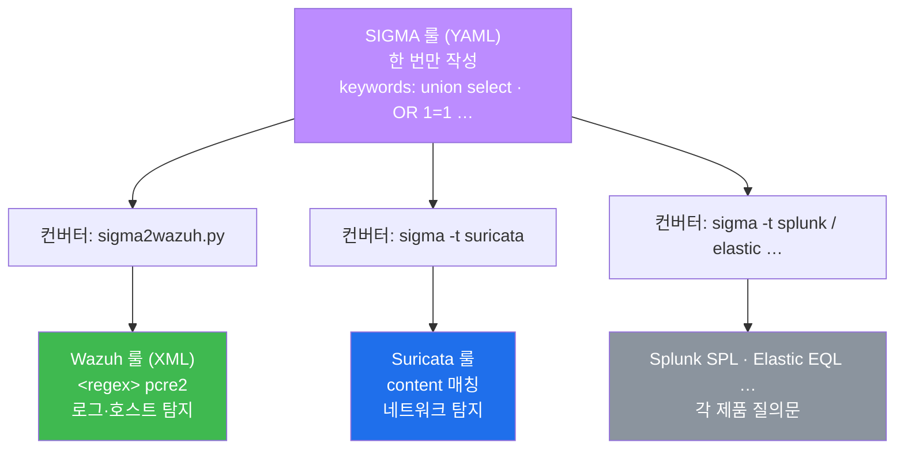
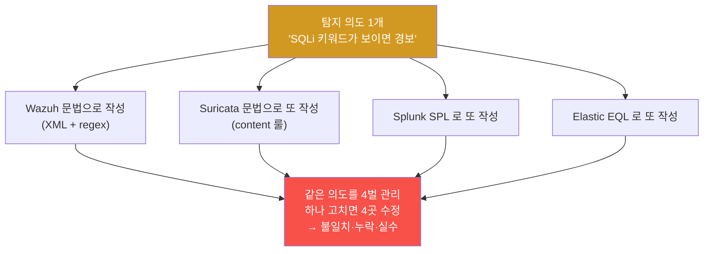
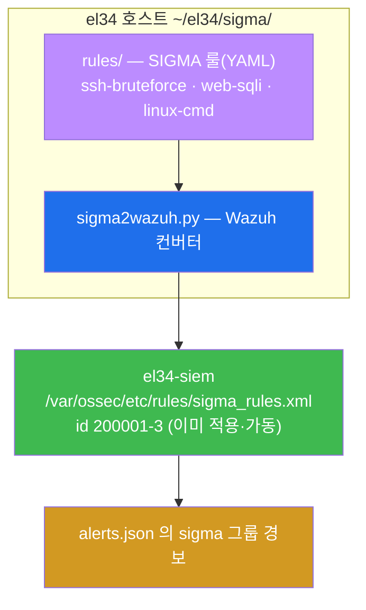
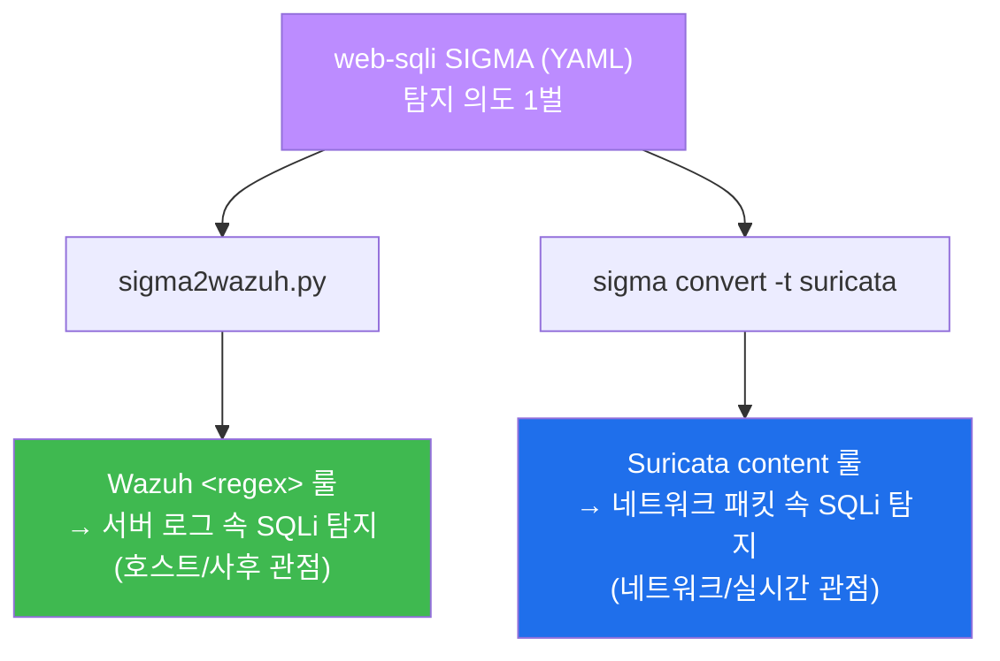
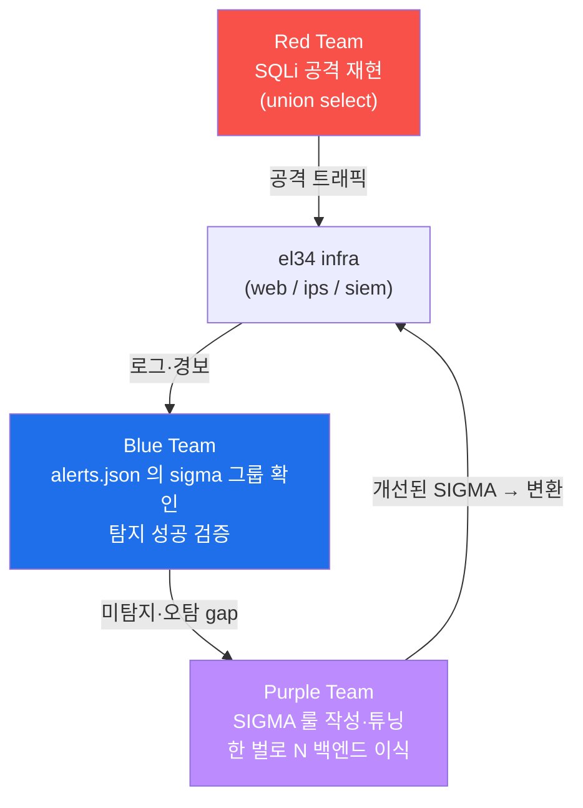

# SOC W07 — 한 번 쓰면 어디서나: SIGMA로 쓰고 Wazuh·Suricata 두 곳에 이식한다

> **본 주차의 한 줄 요약**
>
> W04 에서 학생은 Wazuh 룰을 직접 썼다. 그런데 같은 "SQL 인젝션을 잡아라" 라는 탐지
> 의도를, Suricata 에는 Suricata 문법으로, Splunk 에는 SPL 로… **제품(벤더)마다 처음부터
> 다시** 써야 했다. 이번 주의 질문은 하나다. "탐지를 **한 번만** 쓰고 여러 보안 제품에
> **그대로 옮겨 쓸** 수는 없을까?" 답이 **SIGMA** 다. SIGMA 는 탐지 규칙을 적는 **벤더
> 중립 표준 언어(YAML)** 이고, **백엔드 변환기(converter)** 가 그 한 벌을 Wazuh 룰·Suricata
> 룰 등 각 제품의 문법으로 **자동 번역** 해 준다. 학생은 el34 의 SIGMA 룰을 읽고,
> `sigma2wazuh.py` 로 Wazuh 룰로 변환하고, `wazuh-logtest` 로 발화를 검증하고, 같은 SIGMA 가
> Suricata 로도 이식됨을 확인한 뒤, 실제 SQLi 공격이 그 변환된 룰에 잡히는 전 과정을 본인
> 손으로 돌려 본다.
>
> **운영자 한 줄 결론**: 탐지 규칙도 자산이다. 자산을 제품 문법에 가둬 두면 제품을 바꿀
> 때마다 자산을 다시 만들어야 한다. SIGMA 는 그 자산을 **제품과 분리해 한 벌로 보관**하고,
> 필요할 때 어느 제품 문법으로든 꺼내 쓰는 방식이다. 이것이 성숙한 SOC 의 탐지 관리다.

---

## 학습 목표

본 주차 종료 시 학생은 다음 6가지를 **본인 손으로** 할 수 있어야 한다.

1. "같은 탐지를 제품마다 다시 쓰는" 문제와, SIGMA 가 그것을 **한 번 작성 → N 백엔드
   변환** 으로 어떻게 푸는지를 도식 없이 1분 안에 설명한다.
2. SIGMA 룰 YAML 의 세 기둥 — **`logsource`**(어떤 로그에) / **`detection`**(무엇을, 그리고
   `condition` 으로 어떻게 조합) / **`tags`**(MITRE ATT&CK 매핑) — 을 한 줄씩 읽고 뜻을
   설명한다.
3. el34 의 **`sigma2wazuh.py`** 컨버터로 SIGMA YAML 을 Wazuh 룰(XML)로 변환하고, SIGMA 의
   `keywords` 가 Wazuh `<regex>` 로, `level`/`tags` 가 Wazuh `level`/`group` 으로 어떻게
   대응되는지 출력에서 짚는다.
4. 변환된 룰(id **200002**)이 실제로 발화하는지 **`wazuh-logtest`** 로 라이브 무중단 검증한다.
5. 같은 web-sqli SIGMA 가 **Suricata 백엔드**(`sigma convert -t suricata`)로도 변환됨을
   설명하고, "네트워크(Suricata) + 로그(Wazuh) 양쪽에서 같은 탐지" 의 의미를 말한다.
6. 외부에서 SQLi 공격을 재현해 그 흔적이 el34-siem 의 `alerts.json` 에 **`sigma` 그룹**
   경보로 적재됨을 데이터로 확인하고, 본 주차의 전 과정을 1페이지 보고서로 정리한다.

---

## 0. 용어 해설 (탐지 표준화 입문)

이번 주에 처음 등장하거나 의미를 정확히 해 두어야 하는 용어를 먼저 모은다. 본문에서 다시
나올 때 막히면 이 표로 돌아오면 된다.

| 용어 | 영문 | 뜻 | 비유 |
|------|------|----|------|
| **SIGMA** | Sigma | 탐지 규칙을 적는 **벤더 중립 표준 언어**(YAML 포맷) | 만국 공통 레시피 카드 |
| **탐지 규칙** | detection rule | "이런 로그가 보이면 경보" 라는 한 조각의 탐지 로직 | 한 가지 요리 레시피 |
| **백엔드** | backend | SIGMA 를 변환해 넣을 **대상 보안 제품**(Wazuh·Suricata·Splunk…) | 레시피로 요리할 주방(가스/전기/인덕션) |
| **변환(이식)** | conversion / translation | SIGMA YAML 한 벌을 특정 제품의 문법으로 자동 번역하는 것 | 레시피를 그 주방 방식으로 옮겨 적기 |
| **컨버터** | converter | 변환을 수행하는 도구(el34 의 `sigma2wazuh.py`, 공식 `sigma-cli`) | 레시피 번역기 |
| **logsource** | log source | SIGMA 룰이 **어떤 로그에** 적용되는지 정의(product/category) | 어떤 재료에 쓰는 레시피인지 |
| **detection** | detection | SIGMA 룰의 **탐지 로직** 본체(selection + condition) | 조리 순서 |
| **selection** | selection | detection 안에서 "이 값들을 찾아라" 로 묶은 조건 묶음 | 재료 목록 |
| **condition** | condition | selection 들을 **어떻게 조합**할지(and/or/not) 정하는 식 | "A 와 B 를 둘 다" 같은 결합 지시 |
| **keywords** | keywords | selection 의 한 형태 — 로그 어디든 이 문자열이 있으면 매치 | 특정 단어가 들어간 메모 찾기 |
| **tags** | tags | 룰에 붙는 분류 태그 — 특히 **MITRE ATT&CK** 기법 번호 | 요리 분류(매운맛/한식) 라벨 |
| **MITRE ATT&CK** | — | 공격 전술·기법을 번호로 표준화한 체계(예: **T1190**=공개 앱 취약점 악용) | 범죄 유형 표준 코드 |
| **Wazuh 룰** | Wazuh rule | el34 SIEM(Wazuh)의 탐지 규칙. **XML** 로 기술 | Wazuh 주방용 레시피 |
| **regex / pcre2** | regular expression / PCRE2 | 문자열 패턴 매칭 문법. `pcre2` 는 그 한 구현 | "이런 글자 패턴이면 매치" 라는 검색식 |
| **level** | — | 탐지의 심각도(0=무시 ~ 16=치명). Wazuh·SIGMA 공통 개념 | 요리의 위험도(맵기 단계) |
| **group** | — | Wazuh 룰의 분류 태그(`sigma`/`apache`/`webserver` 등) | 레시피 카테고리 |
| **wazuh-logtest** | — | 로그 한 줄을 넣어 어떤 룰이 매치되는지 **라이브 무중단**으로 검증하는 도구 | 시식(맛보기) |
| **alerts.json** | — | Wazuh manager 의 최종 경보 출력 파일(JSON 라인) | 완성 요리 기록부 |
| **Suricata** | — | el34 의 IDS/IPS — **네트워크** 트래픽을 패턴으로 탐지 | 출입구 검문 |
| **벤더 종속** | vendor lock-in | 탐지 자산이 특정 제품 문법에 묶여 제품 교체가 어려워지는 상태 | 한 주방에서만 통하는 레시피 |

---

## 0.5 핵심 개념 — "탐지는 레시피, 제품은 주방이다"

위 용어 표는 한 줄 정의라서 신입생이 그림을 그리기엔 부족하다. 본 절에서는 W07 의 가장
중요한 직관 세 가지를 일상 비유로 풀어 둔다. 이 세 비유가 W07 전체를 관통한다.

### 0.5.1 SIGMA = 만국 공통 레시피 카드

학생이 요리사라고 하자. "토마토 파스타" 라는 요리(=탐지)를 만들 줄 안다. 그런데 일하는
주방(=보안 제품)이 바뀔 때마다 문제가 생긴다.

- A 식당은 **가스레인지** 주방 → 가스 방식으로 조리 순서를 다시 적어야 한다.
- B 식당은 **인덕션** 주방 → 인덕션 방식으로 또 다시 적어야 한다.
- C 식당은 **장작 화덕** 주방 → 또 처음부터…

같은 토마토 파스타인데 주방이 바뀔 때마다 레시피를 처음부터 다시 쓰는 셈이다. 비효율적일
뿐 아니라, 한 곳에서 레시피를 고치면 나머지 주방용 레시피도 따로따로 고쳐야 해서 실수가
난다.

여기서 누군가 **"주방과 무관하게 요리 자체를 적는 표준 레시피 카드"** 를 만든다. "토마토를
이만큼, 면을 이만큼, 이 순서로" 라고 **재료와 순서만** 적고, 가스냐 인덕션이냐는 적지
않는다. 그리고 각 주방에는 **번역기** 를 둔다. 표준 카드를 넣으면 그 주방 방식(가스용/
인덕션용)으로 자동 변환해 준다.

이 **표준 레시피 카드가 SIGMA** 이고, **주방이 보안 제품(Wazuh·Suricata 등)** 이며,
**번역기가 컨버터**(`sigma2wazuh.py`, `sigma-cli`)다.

| 요리 비유 | SIGMA 세계 |
|-----------|------------|
| 표준 레시피 카드 | **SIGMA 룰**(YAML) |
| 어떤 재료에 쓰는지 | **logsource**(apache/webserver 등) |
| 조리 순서 | **detection / condition** |
| 요리 분류 라벨(한식/매운맛) | **tags**(MITRE ATT&CK) |
| 주방(가스/인덕션/화덕) | **백엔드**(Wazuh / Suricata / Splunk …) |
| 레시피 번역기 | **컨버터**(`sigma2wazuh.py` 등) |

핵심 통찰: **요리(탐지 의도)는 한 번만 적고, 주방(제품)마다 번역기가 알아서 옮긴다.** 이것이
"한 번 쓰고 어디서나" 의 정확한 의미다.

### 0.5.2 백엔드 변환 = 같은 의도를 제품 문법으로 옮기는 일

"SQL 인젝션 키워드(`union select`, `OR 1=1` …)가 보이면 경보" 라는 **하나의 의도** 가 있다.
이 의도는 제품마다 표현 방식이 다르다.

- **Wazuh** 는 로그 텍스트를 **정규식(regex)** 으로 검사한다 → `<regex>(union select|OR 1=1|…)</regex>`
- **Suricata** 는 네트워크 패킷 내용을 **`content` 매칭** 으로 검사한다 → `content:"union select"; ...`

같은 의도인데 문법(껍데기)이 다르다. 컨버터가 하는 일은 정확히 이 **껍데기 갈아끼우기** 다.
SIGMA 의 `keywords` 목록을 받아서, Wazuh 백엔드를 고르면 정규식으로, Suricata 백엔드를
고르면 content 룰로 **자동 번역** 한다. 운영자는 의도(SIGMA)만 관리하고, 각 제품 문법은
컨버터에 맡긴다.



세로로 읽으면 명확하다. 맨 위 SIGMA 한 벌이 여러 컨버터를 거쳐, 맨 아래 서로 다른 제품의
룰로 갈라진다. **위는 하나, 아래는 여럿.** 이 모양이 SIGMA 의 전부다.

### 0.5.3 wazuh-logtest = 라이브를 건드리지 않는 시식

운영자가 새 레시피(변환된 룰)가 제대로 작동하는지 확인하고 싶다. 그렇다고 **손님이 먹는
진짜 요리에 곧장 내보내는 것은 위험** 하다. 잘못된 레시피가 영업 전체(라이브 SIEM)에 영향을
줄 수 있기 때문이다.

그래서 먼저 **시식(맛보기)** 을 한다. 작은 한 접시만 만들어 맛을 보고, 의도대로 나왔는지
확인한 뒤에야 정식 메뉴에 올린다. 이 시식 도구가 **`wazuh-logtest`** 다. 로그 한 줄을
넣으면, **현재 룰셋을 새로 읽어 별도의 테스트 인스턴스에서** 그 줄이 어떤 룰에 잡히는지
보여 준다. 라이브 manager 의 판결 엔진은 전혀 건드리지 않는다. 그래서 여러 학생이 함께 쓰는
el34-siem 에서도 안전하다.

> **el34 사실(중요).** 본 주차에서 SIGMA→Wazuh 변환 룰(`sigma_rules.xml`)은 **el34 에 이미
> 적용돼 가동 중** 이다. 그래서 학생은 룰을 새로 설치할 필요 없이, `wazuh-logtest` 로 바로
> 발화를 검증할 수 있다. 그리고 `sigma2wazuh.py` 는 변환 결과를 화면(stdout)으로만 출력하므로,
> 학생이 변환을 돌려 봐도 라이브 `sigma_rules.xml` 은 바뀌지 않는다 — 공유 인프라가 안전하게
> 보존된다.

---

## 1. 왜 탐지를 벤더마다 다시 쓰면 안 되는가

### 1.1 한 줄 답: 같은 의도를 N번 다시 쓰면 N배 비용 + N배 실수

W04 에서 학생은 Wazuh 룰을 직접 작성했다. 그때는 "Wazuh 한 제품" 만 생각하면 됐다. 그런데
실제 SOC 는 보통 여러 탐지 제품을 동시에 운영한다 — 네트워크는 Suricata, 호스트/로그는
Wazuh, 대시보드·검색은 Splunk 나 Elastic … 이런 식이다.

이때 "SQL 인젝션을 잡아라" 라는 **하나의 탐지 의도** 를 제품마다 처음부터 다시 써야 한다면
어떻게 될까.



문제는 두 가지다. 첫째, **작성 비용이 제품 수만큼 곱해진다.** 둘째, 더 위험한 것 — 나중에
탐지를 한 군데 고치면 **나머지 제품의 룰도 빠짐없이 똑같이 고쳐야** 하는데, 사람이 하다
보면 한두 곳을 빠뜨린다. 그 빠진 한 곳이 바로 침해가 통과하는 구멍이 된다.

### 1.2 왜 중요한가 — 탐지 규칙은 "한 번 쓰고 버리는 것" 이 아니다

탐지 규칙은 SOC 의 핵심 **자산** 이다. 신종 공격이 나오면 룰을 추가하고, 오탐이 나오면
룰을 다듬는다. 즉 룰은 계속 **유지·개선** 되는 살아 있는 자산이다. 이 자산을 제품 문법에
가둬 두면, 제품을 바꾸거나 추가할 때마다 자산을 통째로 다시 만들어야 한다(=벤더 종속).
탐지를 제품과 분리해 한 벌로 관리해야, 제품이 바뀌어도 자산이 살아남는다.

### 1.3 el34 에서 어떻게 — SIGMA 한 벌 + 컨버터

el34 는 이 문제의 해법을 **`~/el34/sigma/`** 한 곳에 담아 두었다. 여기에는 (1) SIGMA 룰들
(`rules/` 디렉터리의 YAML 파일들 — ssh-bruteforce / web-sqli / linux-cmd) 과 (2) Wazuh
백엔드 컨버터(`sigma2wazuh.py`) 가 함께 있다. 그리고 web-sqli SIGMA 를 변환해 만든 Wazuh
룰은 이미 `/var/ossec/etc/rules/sigma_rules.xml`(룰 id 200001-3)에 적용돼 가동 중이다.



학생이 이번 주에 하는 일은 이 흐름을 **위에서 아래로 직접 따라가 보는 것** 이다 — SIGMA 를
읽고(§2), 컨버터로 변환하고(§3), 변환 룰을 검증하고(§4), Suricata 이식을 이해하고(§5), 실제
공격이 sigma 경보로 잡힘을 확인한다(실습 6).

### 1.4 한계 — SIGMA 가 "완벽한 자동 번역" 은 아니다

오해를 막기 위해 분명히 해 둔다. SIGMA 는 만능 번역기가 아니다. 백엔드 제품의 능력에 따라
**번역되지 않는 표현** 이 있을 수 있고(어떤 제품은 특정 조건을 지원하지 않음), 변환 후
제품별로 **미세 튜닝** 이 필요할 때도 있다. SIGMA 의 가치는 "100% 자동" 이 아니라, **공통
의도를 한 곳에서 관리하고 90% 의 반복 작업을 없애 주는 것** 이다. 나머지 제품별 보정은
운영자의 몫이다.

---

## 2. SIGMA 룰 구조 — YAML 세 기둥

### 2.1 한 줄 정의 — SIGMA 룰은 logsource·detection·tags 로 이루어진 YAML 한 장

SIGMA 룰은 사람이 읽기 쉬운 **YAML** 텍스트 한 장이다(YAML = 들여쓰기로 구조를 표현하는
설정 포맷). 핵심 구조는 세 기둥이다 — **어떤 로그에**(logsource) / **무엇을, 어떻게**
(detection + condition) / **무슨 공격인가**(tags). 아래는 web-sqli 계열 SIGMA 룰의 형태다.

```yaml
title: Web SQLi keywords            # 사람이 읽는 룰 이름
logsource:                          # ① 어떤 로그에 적용?
    product: apache                 #    제품: apache(웹서버)
    category: webserver             #    분류: webserver
detection:                          # ② 무엇을 탐지?
    selection:                      #    selection = 찾을 값 묶음
        keywords:                   #    keywords = 로그 어디든 이 문자열이 있으면 매치
            - 'union select'
            - 'OR 1=1'
            - 'information_schema'
    condition: selection            #    condition = selection 들을 어떻게 조합(여기선 그대로)
level: high                         # 심각도(low/medium/high/critical)
tags:                               # ③ 무슨 공격인가 (MITRE ATT&CK)
    - attack.initial_access         #    전술: 초기 침투
    - attack.t1190                  #    기법: T1190(공개 앱 취약점 악용)
```

### 2.2 ① logsource — "이 룰을 어떤 로그에 적용할까"

**logsource** 는 룰이 **어떤 종류의 로그** 에 적용되는지를 선언한다. 위 예의
`product: apache` + `category: webserver` 는 "아파치 웹서버 로그에 적용하라" 는 뜻이다.
이 선언이 중요한 이유는, 같은 키워드라도 적용 대상이 다르면 의미가 달라지기 때문이다 —
`union select` 는 웹 접근 로그에서는 SQLi 신호지만, DB 관리자가 보는 쿼리 감사 로그에서는
정상일 수 있다. logsource 가 룰의 **적용 범위** 를 못 박아 오탐을 줄인다.

### 2.3 ② detection / condition — "무엇을, 어떤 조합으로 잡을까"

**detection** 은 탐지 로직의 본체다. 두 부분으로 나뉜다.

- **selection** — "이 값들을 찾아라" 로 묶은 조건 묶음이다. 위 예는 `keywords` 형태로
  `union select`, `OR 1=1`, `information_schema` 세 문자열을 나열했다. **`keywords`** 는
  "로그 줄 어디에든 이 문자열 중 하나라도 있으면 매치" 를 뜻한다(특정 필드만이 아니라 전체
  텍스트 대상).
- **condition** — selection 들을 **어떻게 조합** 할지 정하는 식이다. `condition: selection`
  은 "selection 이 매치되면 곧 룰 매치" 라는 가장 단순한 형태다. 더 복잡한 룰에서는
  `selection and not filter`(이 조건은 맞고 저 예외는 아닐 때) 처럼 여러 묶음을 논리
  연산자로 결합한다. condition 덕분에 "A 와 B 가 동시에" 나 "A 지만 C 는 제외" 같은 정교한
  탐지가 가능하다.

이 selection + condition 의 분리가 SIGMA 의 핵심 설계다. 찾을 값(selection)과 조합 방식
(condition)을 따로 적기 때문에, 사람이 읽기 쉽고 컨버터가 기계적으로 번역하기도 쉽다.

### 2.4 ③ tags — "이게 무슨 공격인지" 를 MITRE ATT&CK 으로 표준 분류

**tags** 는 룰에 붙이는 분류 라벨이다. 특히 중요한 것이 **MITRE ATT&CK** 매핑이다. ATT&CK
은 공격 전술·기법을 번호로 표준화한 세계 공통 체계로, 위 예의 **`attack.t1190`** 은
**T1190 = Exploit Public-Facing Application(공개된 애플리케이션의 취약점 악용)** 을
가리킨다. SQLi 는 공개된 웹앱의 취약점을 찌르는 공격이므로 T1190 에 해당한다.

tags 가 표준에 내장돼 있다는 점이 SIGMA 의 큰 장점이다. 변환 시 이 tags 가 각 제품의
분류(Wazuh 의 `group` 등)로 함께 옮겨가므로, 어떤 제품에서 보든 "이 경보는 T1190" 이라는
공통 언어로 사고를 이야기할 수 있다. SOC 운영자·위협 헌터·경영진이 같은 코드로 소통하는
기반이 된다.

### 2.5 el34 에서 어떻게 — ~/el34/sigma/rules/ 의 실제 룰

el34 호스트의 `~/el34/sigma/rules/` 디렉터리에 실제 SIGMA 룰들이 있다. 본 주차 실습에서는
그중 web-sqli 룰(`0002-web-sqli.yml`)을 읽는다. `cat` 으로 열어 위 세 기둥(logsource /
detection / tags)이 실제로 어떻게 적혀 있는지 눈으로 확인하는 것이 실습 2 다.

### 2.6 한계 — 키워드 기반은 단순한 만큼 오탐·우회 여지가 있다

`keywords` 기반 탐지는 만들기 쉽지만, 두 약점이 있다. 첫째, **오탐** — 정상 트래픽에 우연히
`union select` 같은 문자열이 들어가면 잘못 경보할 수 있다(예: 게시판에 SQL 강의 글). 둘째,
**우회** — 공격자가 `UNION/**/SELECT` 처럼 주석으로 끊거나 인코딩하면 단순 문자열 매칭을
피해 갈 수 있다. 그래서 실무에서는 logsource 로 범위를 좁히고, condition 으로 예외를 빼고,
정규식 변형을 더해 정밀도를 높인다. 단순 키워드 룰은 "출발점" 이지 "완성" 이 아니다.

---

## 3. 변환 — sigma2wazuh.py 가 SIGMA 를 Wazuh 룰로 옮긴다

### 3.1 한 줄 정의 — 컨버터는 SIGMA YAML 을 제품 문법으로 자동 번역하는 도구

**컨버터(converter)** 는 SIGMA 룰(YAML)을 받아 특정 백엔드 제품의 룰 문법으로 출력하는
프로그램이다. el34 에는 Wazuh 백엔드용으로 **`~/el34/sigma/sigma2wazuh.py`** 가 있다. 이
스크립트에 SIGMA 룰 디렉터리를 넘기면, 각 SIGMA 룰을 Wazuh 가 이해하는 **XML 룰** 로
번역해 화면(stdout)에 출력한다.

```bash
cd ~/el34/sigma && python3 sigma2wazuh.py rules/      # 변환 결과를 화면(stdout)으로 출력
```

### 3.2 무엇이 무엇으로 바뀌는가 — 대응 규칙

컨버터가 하는 일은 §0.5.2 의 "껍데기 갈아끼우기" 다. SIGMA 의 각 요소가 Wazuh 의 어느
요소로 옮겨가는지 대응을 알면, 변환 출력을 읽을 수 있다.

| SIGMA(입력) | Wazuh 룰(출력) | 무슨 변환인가 |
|-------------|----------------|----------------|
| `detection`의 `keywords` 목록 | **`<regex type="pcre2">`** | 문자열 목록 → "이 중 하나라도 매치" 정규식 |
| `level`(low/medium/high…) | Wazuh **`level`**(숫자 0~16) | 심각도 표현을 Wazuh 척도로 |
| `logsource` + `tags` | Wazuh **`<group>`** | 적용 대상·분류를 group 태그로 |
| `title` / 설명 | Wazuh **`<description>`** | 사람이 읽는 설명 |

web-sqli SIGMA 를 변환하면 다음과 같은 Wazuh 룰이 나온다.

```xml
<rule id="200002" level="10">
  <regex type="pcre2">(union select|OR 1=1|' OR '|information_schema|sleep\()</regex>
  <description>[Sigma] ... SQLi ...</description>
  <group>sigma,apache,webserver,</group>
</rule>
```

읽는 법: SIGMA 의 keywords 세 개가 정규식 `(union select|OR 1=1|…)` 한 줄로 합쳐졌고(괄호 +
`|` 는 "이 중 아무거나"), SIGMA 의 `level: high` 가 Wazuh `level="10"` 으로, logsource/tags
가 `<group>sigma,apache,webserver,</group>` 로 옮겨갔다. **group 에 `sigma` 가 붙는 것** 이
핵심 표식 — 이 경보가 SIGMA 에서 유래했음을 한눈에 알려 주고, 나중에 alerts.json 에서
`sigma` 그룹으로 필터링하는 근거가 된다(실습 6).

### 3.3 el34 에서 어떻게 — stdout 출력이라 라이브가 안전하다

`sigma2wazuh.py` 는 변환 결과를 **화면(stdout)으로만** 출력한다. 즉 학생이 변환을 몇 번을
돌려도 라이브 `sigma_rules.xml` 파일은 바뀌지 않는다. 실제 운영에서 이 변환을 적용하려면
출력을 파일로 리다이렉트하고 manager 를 재시작한다.

```bash
# (개념 — 운영 적용 방법. el34 에는 이미 적용돼 있으니 실습에서 직접 하지 않는다)
sigma2wazuh.py rules/ > /var/ossec/etc/rules/sigma_rules.xml   # 변환 결과를 룰 파일로
ssh ccc@10.20.32.100 sudo /var/ossec/bin/wazuh-control restart      # manager 재시작으로 반영
```

> **공유 인프라 수칙.** el34-siem 은 모든 학생이 함께 쓰는 단일 manager 다. 그래서 실습에서는
> **변환 결과를 stdout 으로 보기만** 하고 위의 `>` 리다이렉트·`restart` 는 하지 않는다. 라이브
> `sigma_rules.xml`(id 200001-3)은 이미 적용돼 있어 그대로 검증(§4)·탐지(실습 6)에 쓸 수 있다.

### 3.4 한계 — 컨버터의 번역 품질은 백엔드 능력에 종속된다

컨버터는 SIGMA 의 표현을 대상 제품이 **지원하는 범위 안에서만** 번역한다. Wazuh 가 표현할
수 없는 SIGMA 조건은 변환 시 단순화되거나 생략될 수 있다. 그래서 변환만 믿지 말고 다음
단계(§4)에서 **실제로 발화하는지** 를 반드시 확인해야 한다. "변환됐다 ≠ 의도대로 잡힌다."

---

## 4. 검증 — wazuh-logtest 로 변환 룰이 실제로 발화하는지 본다

### 4.1 한 줄 정의 — logtest 는 로그 한 줄을 넣어 매치 룰을 보는 무중단 시식 도구

**`wazuh-logtest`** 는 로그 한 줄을 표준입력으로 넣으면, 현재 룰셋을 새로 읽어 **별도의
테스트 인스턴스** 에서 그 줄이 어떤 decoder/rule 에 매치되는지 보여 주는 도구다(§0.5.3 의
"시식"). 라이브 manager 의 판결 엔진은 건드리지 않으므로, 공유 el34-siem 에서도 안전하게
쓸 수 있다.

### 4.2 왜 중요한가 — "변환됐다" 와 "잡힌다" 는 다른 문제

§3.4 에서 짚었듯, SIGMA 가 Wazuh XML 로 변환됐다고 해서 그 룰이 의도한 로그를 실제로
잡는다는 보장은 없다. 정규식이 미묘하게 어긋났거나, level 이 너무 낮아 경보로 안 뜰 수도
있다. logtest 는 이 둘 사이의 간극을 **실측** 으로 메운다 — "이 로그 한 줄을 넣었더니 정말
이 룰이 이 level 로 발화했다" 를 눈으로 확인한다.

### 4.3 el34 에서 어떻게 — union select 한 줄 → 200002 발화

web-sqli 의 정규식에 걸릴 만한 웹 접근 로그 한 줄을 만들어 logtest 에 넣는다. el34 의
`sigma_rules.xml`(id 200001-3)은 이미 적용돼 있으므로, 변환 룰 200002 가 그대로 매치된다.

```bash
echo '1.2.3.4 - - [x] "GET /?id=1 union select 1,2 HTTP/1.1" 403' \
  | docker exec -i el34-siem /var/ossec/bin/wazuh-logtest
```

**무엇을 보는가**: 출력에서 `id: 200002`, `level: 10`, 그리고 `groups` 에 `sigma`(와
`apache`/`webserver`)가 보이고, 마지막에 **`Alert to be generated.`** 가 뜨면 성공이다. 이
한 줄로 "SIGMA → 변환 → 실제 Wazuh 경보" 의 사슬이 끊김 없이 이어짐을 증명한 것이다.

| 보이는 항목 | 뜻 |
|-------------|----|
| `id: 200002` | web-sqli SIGMA 에서 변환된 그 룰이 매치됨 |
| `level: 10` | 고위험에 해당하는 심각도로 판결됨 |
| `groups: [sigma, apache, webserver]` | SIGMA 유래(`sigma`) + 적용 대상 |
| `Alert to be generated.` | 이 로그가 실제 alerts.json 경보로 기록될 것 |

### 4.4 한계 — logtest 는 한 줄 단위, 빈도 기반 룰은 별도 검증

`wazuh-logtest` 는 한 줄을 넣어 그 줄이 어떻게 판결되는지 본다. 따라서 "60초에 5회 이상이면
격상" 같은 **빈도/누적 기반 룰** 은 한 줄로는 완전히 재현되지 않는다. 그런 룰은 실제
ingest(실습 6 처럼 공격을 재현해 alerts.json 을 확인)로 검증한다.

---

## 5. Suricata 이식 — 같은 탐지, 다른 백엔드

### 5.1 한 줄 정의 — 같은 SIGMA 를 Suricata 룰로도 변환할 수 있다

지금까지는 SIGMA → **Wazuh**(로그·호스트 탐지) 한 방향만 봤다. SIGMA 의 진짜 가치는 **같은
한 벌** 이 다른 제품으로도 변환된다는 점이다. el34 의 IDS/IPS 인 **Suricata** 도 SIGMA 의
변환 대상(백엔드)이다. 공식 도구 `sigma-cli` 의 `sigma convert -t suricata` 명령이 같은
web-sqli SIGMA 를 Suricata 룰로 번역한다.

### 5.2 왜 중요한가 — 네트워크와 로그를 같은 의도로 동시에 본다

Wazuh 와 Suricata 는 **보는 위치가 다르다.**

- **Wazuh** 는 서버에 도착해 **로그로 남은** SQLi 를 본다(사후·호스트 관점).
- **Suricata** 는 네트워크를 **흐르는 패킷** 속 SQLi 를 본다(실시간·네트워크 관점).

같은 web-sqli SIGMA 한 벌을 두 백엔드로 변환하면, **하나의 탐지 의도** 가 네트워크와 로그
**양쪽에서 동시에** 작동한다. 한쪽이 놓쳐도 다른 쪽이 잡을 가능성이 생기고, 두 곳의 경보를
대조하면 오탐을 걸러 내기도 쉽다. 의도는 하나인데 가시성은 두 배가 되는 셈이다.



### 5.3 el34 에서 어떻게 — 본 주차는 개념으로 다룬다

본 주차의 라이브 실습은 Wazuh 백엔드(§3·§4·실습 6)에 집중한다. Suricata 이식은 **개념으로**
이해한다 — 같은 SIGMA 가 `sigma convert -t suricata` 로 Suricata content 룰이 되어, ips
(Suricata)에서 네트워크 탐지로 작동할 수 있다는 점을 설명할 수 있으면 된다. 핵심은 문법
세부가 아니라 **"한 SIGMA → 여러 백엔드"** 라는 구조적 가치다.

### 5.4 한계 — 모든 SIGMA 가 모든 백엔드로 깔끔히 가지는 않는다

§1.4·§3.4 의 한계가 여기서도 적용된다. 어떤 SIGMA 표현은 Suricata 가 표현하기 어렵거나
(네트워크 페이로드로 볼 수 없는 호스트 전용 필드 등), 변환 후 성능 튜닝이 필요할 수 있다.
"이론상 N 백엔드" 와 "실무에서 그대로 쓸 수 있는 N 백엔드" 사이에는 검증·보정의 거리가
있음을 기억해야 한다.

---

## 6. Red / Blue / Purple Team 관점에서의 SIGMA

본 주차의 활동을 3 팀 관점으로 정리하면 SIGMA 가 SOC 운영의 어디에 놓이는지 분명해진다.



| 팀 | 책임 | 본 주차 활동 |
|----|------|-------------|
| **Red** | 공격 시뮬레이션 | attacker 에서 SQLi(`union select`) 재현 |
| **Blue** | 탐지·검증 | logtest 발화 확인 + alerts.json 의 `sigma` 그룹 경보 확인 |
| **Purple** | 탐지 자산 개선 | SIGMA 룰을 한 벌로 작성해 Wazuh·Suricata 등 N 백엔드로 이식 |

SIGMA 는 본질적으로 **Purple Team 의 도구** 다. 미탐지를 발견하면 그 탐지를 SIGMA 로 한 번
적고, 운영 중인 모든 제품에 변환해 일관되게 배포한다 — 제품마다 따로 쓰며 빠뜨리는 일 없이.

---

## 7. 실습 안내 (총 8 미션)

각 실습은 **4축 설명** 을 포함한다. 모든 명령은 el34 호스트(`ssh ccc@192.168.0.80`)에서
실행하며, 장비 작업은 `ssh ccc@<장비IP>`(web 32.80/ips 31.2/siem 32.100)로 한다. 변환 컨버터는 결과를 stdout 으로만
출력하므로 라이브 `sigma_rules.xml` 은 바뀌지 않는다.

### 실습 1 — SIGMA 설정 점검 (survey)

> **이 실습을 왜 하는가?**
> 모든 SIGMA 작업의 전제는 세 부품 — 룰(`rules/`) + 컨버터(`sigma2wazuh.py`) + 적용된 Wazuh
> 룰(`sigma_rules.xml`) — 이 갖춰져 있는 것이다. 작업 전 30초 인벤토리 점검이다.
>
> **이걸 하면 무엇을 알 수 있는가?**
> - `~/el34/sigma/rules/` 에 SIGMA 룰들이 있고 `sigma2wazuh.py` 컨버터가 존재함
> - el34-siem 의 `sigma_rules.xml` 에 변환된 sigma 룰(id 200001-3)이 적용돼 있음
>
> **결과 해석**
> 정상: `rules/` 와 `sigma2wazuh.py` 가 보이고, `sigma_rules.xml` 의 `<rule` 개수가 3(또는
> 그 이상)으로 나온다. 비정상: 파일이 없으면 SIGMA 환경 자체가 준비 안 된 것.
>
> **실전 활용**
> 탐지 자산 점검의 첫 단계 — "우리 SIGMA 파이프라인이 갖춰져 있나" 를 1분에 확인.

### 실습 2 — web-sqli.yml 구조 읽기 (analysis)

> **이 실습을 왜 하는가?**
> SIGMA 의 세 기둥(logsource / detection / tags)을 실제 룰 파일에서 눈으로 확인한다. 이 구조를
> 읽을 줄 알아야 §3 의 변환 출력과 대응시킬 수 있다(§2).
>
> **이걸 하면 무엇을 알 수 있는가?**
> - logsource(apache/webserver) = 어떤 로그에 적용하는지
> - detection 의 keywords(union select 등) + condition = 무엇을 어떻게 잡는지
> - tags(attack.t1190) = 이게 어떤 ATT&CK 기법인지
>
> **결과 해석**
> 정상: `cat` 출력에 logsource·detection·tags 세 블록이 모두 보인다. 이 세 가지가 SIGMA 룰의
> 골격이다.
>
> **실전 활용**
> 커뮤니티에 공개된 수천 개 SIGMA 룰을 읽고 평가하는 능력의 출발점.

### 실습 3 — sigma2wazuh.py 변환 (manipulation)

> **이 실습을 왜 하는가?**
> SIGMA YAML 이 Wazuh 룰(XML)로 **자동 번역** 되는 핵심 단계를 직접 돌려 본다(§3). "한 번 쓰고
> 어디서나" 의 "어디서나" 가 실제로 일어나는 순간이다.
>
> **이걸 하면 무엇을 알 수 있는가?**
> - SIGMA keywords → Wazuh `<regex type="pcre2">` 변환
> - level/tags → Wazuh level/group 변환(특히 group 에 `sigma` 표식)
> - 변환 결과가 id 200002 룰로 나옴
>
> **결과 해석**
> 정상: 출력에 `id="200002"` 와 그 아래 `<regex>` 가 보인다. stdout 출력이므로 라이브
> `sigma_rules.xml` 은 변하지 않는다.
>
> **실전 활용**
> 새 SIGMA 룰을 받았을 때 "우리 Wazuh 에 어떻게 들어갈지" 를 즉시 변환해 확인하는 법.

### 실습 4 — wazuh-logtest 발화 검증 (analysis)

> **이 실습을 왜 하는가?**
> "변환됐다 ≠ 잡힌다"(§3.4). 변환 룰 200002 가 실제 로그 한 줄에 발화하는지 라이브 무중단으로
> 검증한다(§4).
>
> **이걸 하면 무엇을 알 수 있는가?**
> - union select 가 든 웹 접근 로그 한 줄이 룰 200002 에 매치됨
> - logtest 출력의 id/level/groups(sigma)/`Alert to be generated` 읽는 법
>
> **결과 해석**
> 정상: Phase 3 에 `id: 200002`, `level: 10`, `sigma` 그룹, `Alert to be generated.`. 안 뜨면
> 정규식·룰 적용 상태를 점검.
>
> **실전 활용**
> 새 탐지 룰을 라이브에 올리기 전 표준 검증 절차 — 공유 인프라를 안 건드리는 안전한 시식.

### 실습 5 — Suricata 이식 (analysis, 개념)

> **이 실습을 왜 하는가?**
> SIGMA 의 핵심 가치는 단일 백엔드가 아니라 **다중 백엔드 이식** 이다(§5). 같은 web-sqli SIGMA
> 가 Suricata 룰로도 변환됨을 이해한다.
>
> **이걸 하면 무엇을 알 수 있는가?**
> - 같은 SIGMA → sigma2wazuh.py(Wazuh, 로그 탐지) + sigma -t suricata(Suricata, 네트워크 탐지)
> - "네트워크와 로그를 한 의도로 동시에" 의 의미
>
> **결과 해석**
> 정상: 한 SIGMA 가 두 백엔드로 갈라지는 구조를 설명할 수 있다. 본 단계는 개념 이해가 목표다.
>
> **실전 활용**
> 제품을 추가·교체할 때 탐지 자산을 다시 안 쓰고 이식하는 SOC 운영 전략.

### 실습 6 — 실제 SQLi 공격 → sigma 그룹 경보 (detect)

> **이 실습을 왜 하는가?**
> 파이프라인이 책상 위 이론이 아니라 실제로 도는지, 진짜 공격으로 증명한다. SIGMA 표준 한 줄이
> 라이브 탐지가 되는 전 과정의 마무리다.
>
> **이걸 하면 무엇을 알 수 있는가?**
> - 외부 SQLi(union select) → web/ips 로그 → manager → alerts.json 의 `sigma` 그룹 경보
> - 변환된 SIGMA 룰이 합성 로그뿐 아니라 실제 공격도 잡음
>
> **결과 해석**
> 정상: alerts.json 의 sigma 그룹에 최근 경보가 적재된다(또는 sigma 룰 적용이 확인된다).
> 조건 폴링(로그 흔적 대기) 후에도 안 보이면 수집·analysisd 파이프라인을 점검.
>
> **실전 활용**
> "탐지 룰이 실전에서 작동하나" 를 합성 공격으로 확인하는 detection validation 의 기본형.

### 실습 7 — 다중 플랫폼 가치 정리 (analysis)

> **이 실습을 왜 하는가?**
> 본 주차의 핵심 메시지 — 탐지 1개를 SIGMA 로 써서 N 플랫폼에 이식 — 를 본인 언어로 정리한다.
>
> **이걸 하면 무엇을 알 수 있는가?**
> - SIGMA 1벌 → Wazuh + Suricata + (Splunk/Elastic…) = 탐지 자산 한 벌로 N 플랫폼
> - 벤더 종속 탈피 + 커뮤니티 SIGMA 룰(수천 개) 즉시 재사용
>
> **결과 해석**
> 정상: "한 번 쓰고 어디서나" 의 가치를 비용·일관성·재사용 관점에서 설명할 수 있다.
>
> **실전 활용**
> 탐지 표준화를 조직에 제안할 때의 논거 — 왜 SIGMA 로 관리해야 하는가.

### 실습 8 — SIGMA 종합 보고서 (report)

> **이 실습을 왜 하는가?**
> 실습 1~7 을 "SIGMA 자산 관리" 관점으로 묶어 운영 보고서로 정리한다. 구조→변환→검증→이식의
> 흐름을 한 장으로 종합하는 훈련이다.
>
> **이걸 하면 무엇을 알 수 있는가?**
> - SIGMA 구조 / 변환(200002) / 검증(logtest + 실제 탐지) / 다중 백엔드를 한 보고서로 엮는 법
>
> **결과 해석**
> 정상: 보고서에 SIGMA 구조·변환·검증·이식이 모두 담긴다.
>
> **실전 활용**
> 탐지 자산 운영 보고·인수인계의 기본 양식.

---

## 8. 핵심 정리 (1줄씩)

1. **탐지를 벤더마다 다시 쓰지 마라** — 같은 의도를 N벌 관리하면 N배 비용 + 누락 위험.
   SIGMA 는 한 번 쓰고 N 백엔드로 변환한다.
2. **SIGMA 룰 = YAML 세 기둥** — logsource(어떤 로그에) / detection·condition(무엇을 어떻게)
   / tags(ATT&CK 기법).
3. **컨버터가 껍데기를 갈아끼운다** — sigma2wazuh.py 는 keywords→`<regex>`, level/tags→
   level/group 으로 번역(group 에 `sigma` 표식). stdout 출력이라 라이브 무변경.
4. **변환됐다 ≠ 잡힌다** — wazuh-logtest 로 변환 룰(200002)이 실제 발화하는지 라이브 무중단
   검증.
5. **한 SIGMA, 두 백엔드** — 같은 web-sqli 가 Wazuh(로그)와 Suricata(네트워크)로 이식돼 한
   의도로 양쪽을 본다.
6. **실전 증명** — 실제 SQLi 공격이 alerts.json 의 `sigma` 그룹 경보로 잡힘을 데이터로 확인.

---

## 9. 다음 주차 (W08) 예고 — 중간고사: 교차 분석 종합

W07 까지 학생은 단일 탐지 자산(SIGMA → 룰)을 만들고 검증·이식하는 법을 배웠다. W08 은 중간
평가로, 한 걸음 위에서 본다 — 흩어진 로그(인증 / 웹 / 네트워크 / SIEM)를 **교차 분석** 해
하나의 공격 서사(누가, 어디로 들어와, 무엇을 했나)로 **종합** 하는 SOC 분석가의 통합 역량을
점검한다. 즉 W01~W07 의 개별 도구·기법을 한 사건의 타임라인으로 엮는 능력이 시험대에 오른다.

- **주제**: 다소스 로그 교차 분석 → 단일 공격 서사 종합(중간고사)
- **실습 환경**: el34 전 계층(web / ips / siem)의 로그
- **핵심 역량**: 출처 IP 상관, 타임라인 구성, 탐지 자산(W04 Wazuh · W07 SIGMA) 활용
- **선수 학습**: 본 주차 §2(SIGMA 구조)·§4(logtest 검증)·실습 6(실제 탐지) 복습
