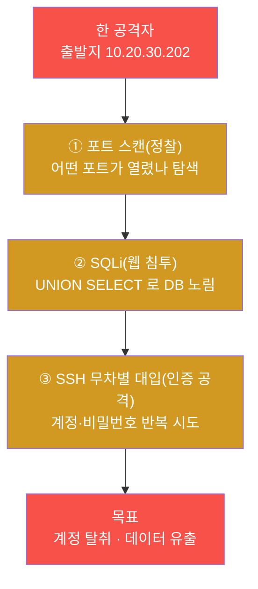
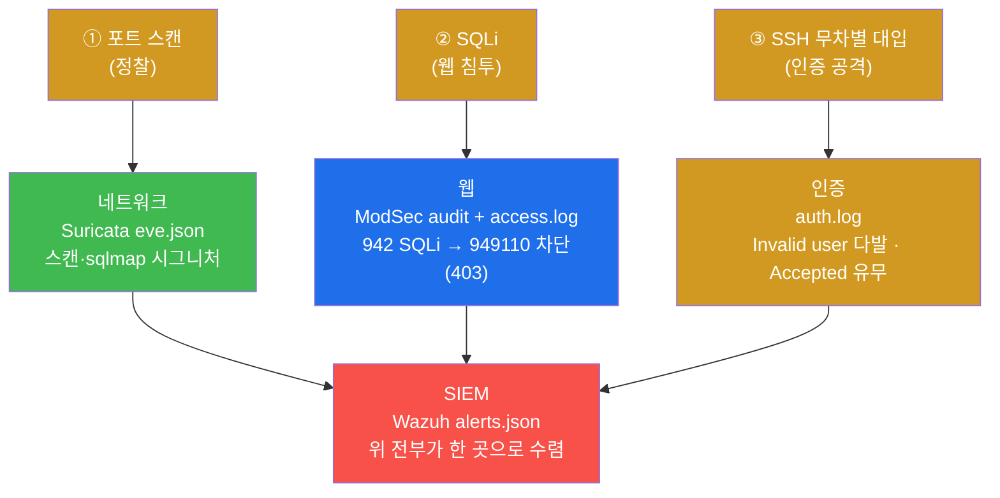
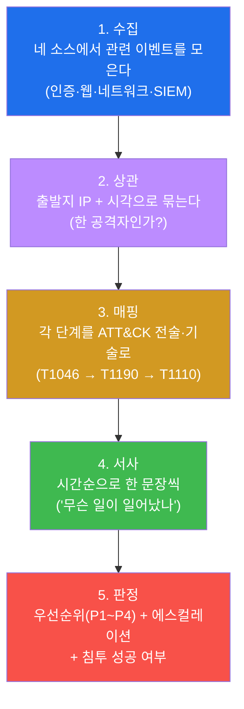
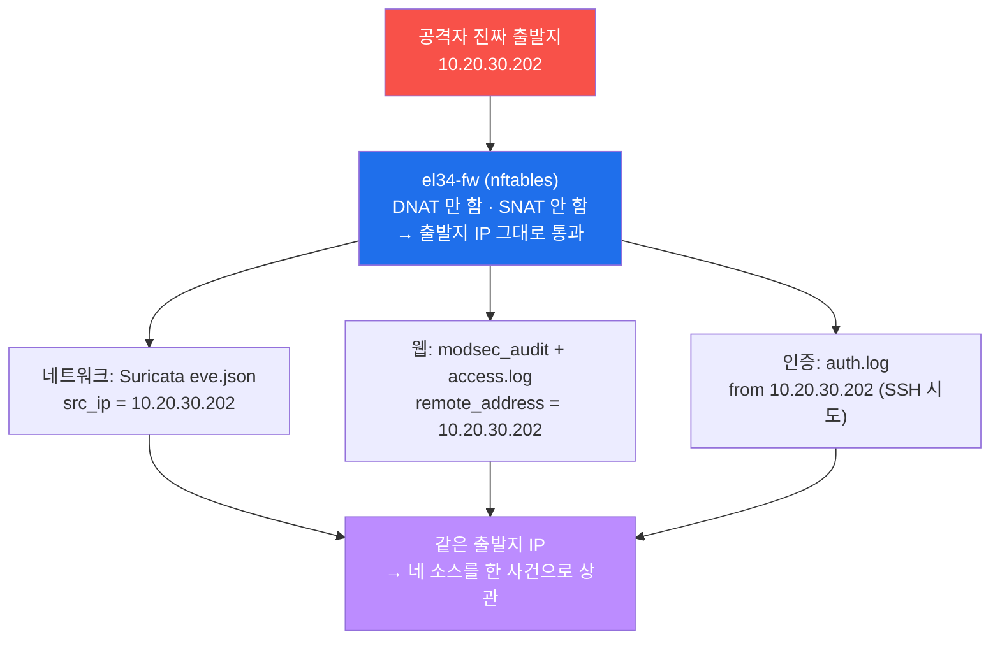
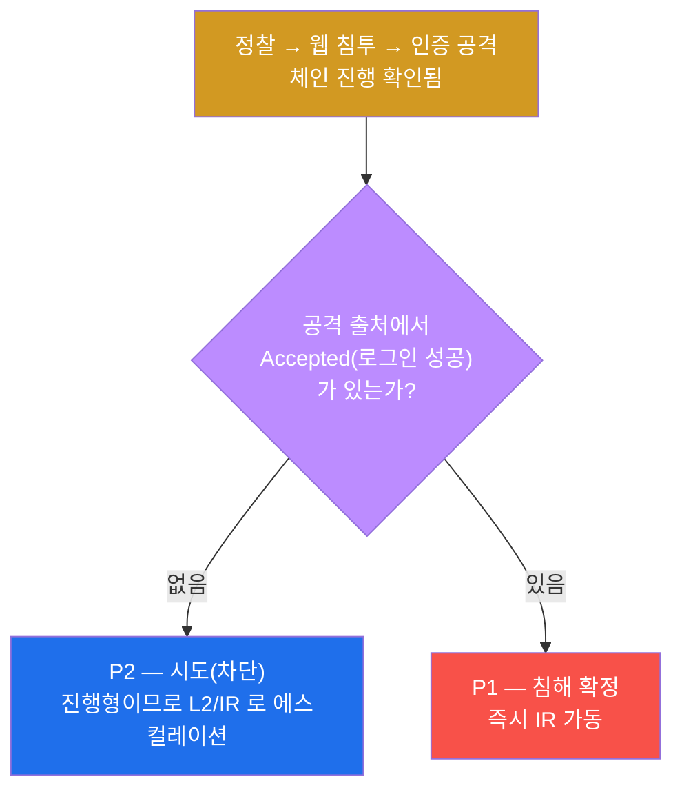
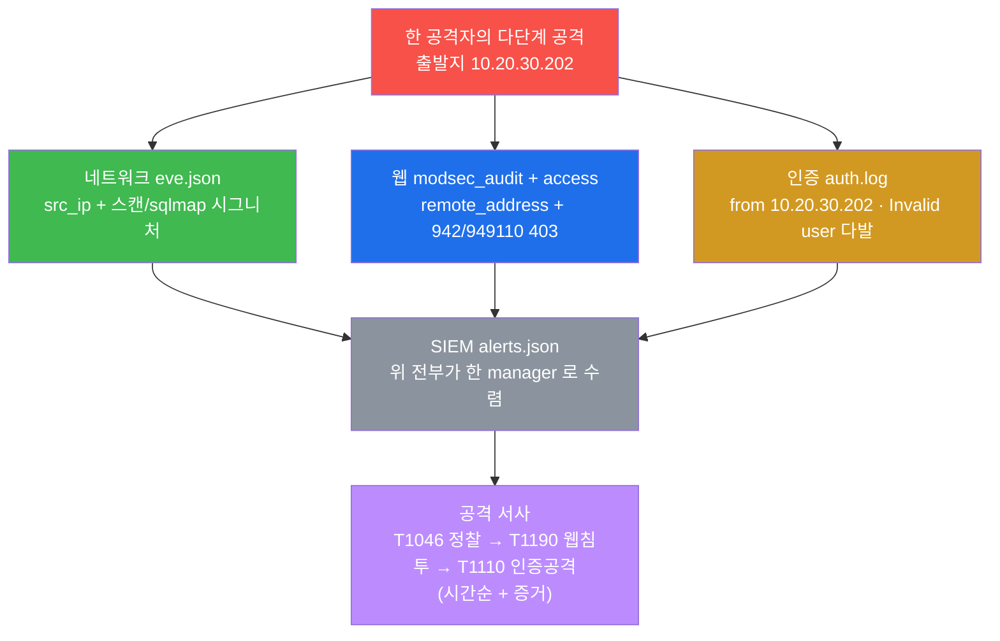
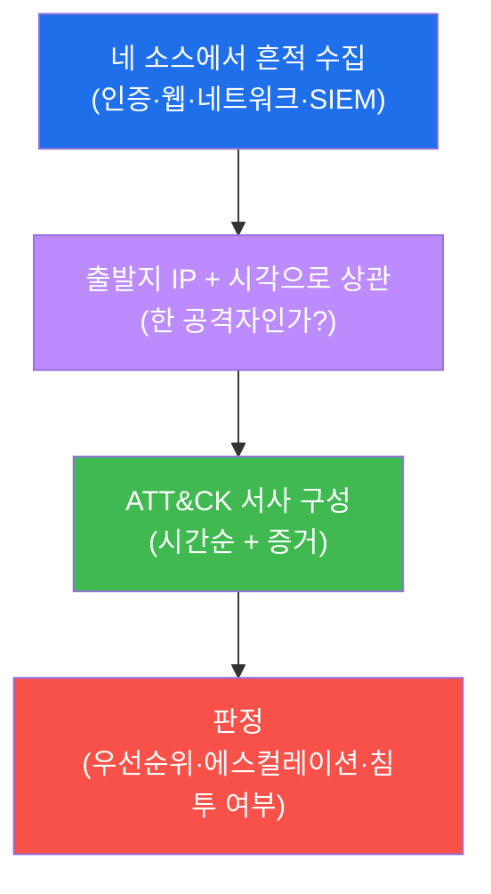
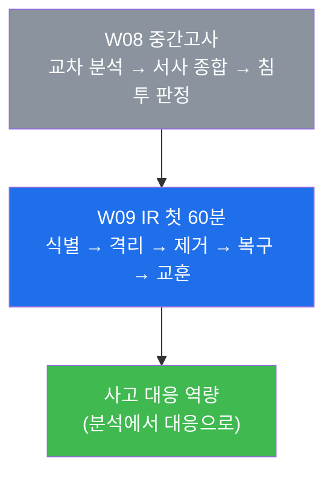

# SOC W08 — 중간고사: 흩어진 로그를 교차 분석해 하나의 공격 서사로 종합

> **본 주차의 한 줄 요약**
>
> 지난 7주 동안 학생은 SOC 분석가의 도구를 **하나씩** 익혔다 — 경보 트리아지(W01),
> 인증 로그 분석(W02), 웹 로그 교차(W03), Wazuh 커스텀 룰(W04), 경보 관리·오탐
> 판정(W05), ATT&CK 캠페인 읽기(W06), SIGMA 다중 플랫폼 이식(W07). 중간고사는 이
> 역량들을 **따로따로**가 아니라, **한 명의 공격자가 남긴 흩어진 로그들** 위에 올려놓고
> 본다. 학생은 네 소스(인증 / 웹 / 네트워크 / SIEM)에 흩어진 단편을 모아, 같은
> **출발지 IP 와 시각**으로 묶고, 각 단계를 **MITRE ATT&CK** 으로 매핑해, "한 공격자가
> 정찰 → 웹 침투 → 인증 공격을 했다"는 **하나의 공격 서사(narrative)** 로 종합한 뒤,
> 우선순위(P1~P4)와 에스컬레이션, 그리고 침투 성공 여부까지 판정한다.
>
> **분석가 한 줄 결론**: 로그 하나만 보면 영영 단편이다. **교차로 봐야** 비로소 "한
> 공격자가 단계적으로 움직였다"는 서사가 보인다. SOC 분석가의 종합 능력은 곧 흩어진
> 단편을 한 서사로 엮는 능력이다.

---

## 학습 목표

본 주차(중간 평가) 종료 시 학생은 다음 6가지를 **본인 손으로** 할 수 있어야 한다.

1. SOC 분석의 **네 소스**(인증 `auth.log` / 웹 `ModSec·access` / 네트워크 `Suricata eve` /
   통합 `Wazuh alerts.json`)가 각각 **공격의 어느 단계를 보여주는지**를 한 표로 정리하고,
   왜 한 소스만으로는 전체 그림이 안 보이는지 설명한다.
2. 한 공격자의 **다단계 공격**(포트 스캔 → SQLi → SSH 무차별 대입)을 재현하고, 각 단계가
   어느 소스에 어떤 흔적으로 남는지를 증거와 함께 식별한다.
3. el34 가 **출처 IP 를 보존**한다는 사실(fw 가 SNAT 를 하지 않음)을 이용해, 네 소스에
   흩어진 흔적을 **같은 출발지 IP(`10.20.30.202`) + 시각**으로 묶어 한 공격자의 행위로
   상관(correlation)한다.
4. 묶인 흔적을 **시간순**으로 늘어놓고 각 단계를 **MITRE ATT&CK 전술·기술**(T1046 정찰 →
   T1190 웹 침투 → T1110 자격증명)로 매핑해 하나의 **공격 서사**를 구성한다.
5. `auth.log` 의 `Accepted` 유무로 **침투 성공 여부**를 판정하고, 공격의 진행 단계와 침투
   여부를 근거로 **우선순위(P1~P4)와 에스컬레이션**(L2/IR 로 올릴지)을 결정한다.
6. 위 전 과정(네 소스 분석 → 상관 → ATT&CK 서사 → 판정)을 **증거(로그/eve/audit/alerts)와
   함께** 한 장의 중간고사 종합 보고서로 작성한다.

> **중간고사의 시선** — 본 주차는 새 도구를 배우는 주가 아니라, 지금까지 배운 분석법을 **한
> 사건 위에서 통합**하는 주다. 채점은 "공격이 있었다"는 결과 선언이 아니라, **각 소스에서
> 무엇을 읽었는가**, 그것을 **출처와 시각으로 한 서사에 엮었는가**, 그리고 그 서사에 **증거가
> 단계마다 붙었는가**를 본다.

---

## 0. 용어 해설 (중간고사에서 다시 쓰는 핵심어)

본 주차는 W01–W07 의 용어를 종합한다. 이미 앞 주차에서 정의한 용어라도, 중간고사에서 **이
의미로 쓴다**는 것을 분명히 하기 위해 다시 적는다. 처음 보는 용어가 있으면 본 표를 기준으로
이해하고, 본문에서 다시 만나면 여기로 돌아오면 흐름이 끊기지 않는다.

| 용어 | 영문 | 뜻 | 비유 |
|------|------|----|------|
| **교차 분석** | cross-source analysis | 여러 소스의 로그를 함께 보아 한 소스로는 안 보이는 그림을 그림 | 여러 목격자의 증언을 맞춰 사건을 재구성 |
| **상관 분석** | correlation | 흩어진 흔적을 공통 키(출처 IP·시각)로 묶어 한 사건으로 봄 | 여러 CCTV 영상을 시각·인물로 한 줄로 이음 |
| **공격 서사** | attack narrative | 한 공격자가 단계적으로 한 일을 시간순으로 엮은 이야기 | 도둑의 침입 순서를 시간표로 재현 |
| **다단계 공격** | multi-stage attack | 정찰·침투·자격증명처럼 여러 단계로 진행되는 한 공격 | 담 넘기 → 문 따기 → 금고 열기 |
| **트리아지** | triage | 경보를 빠르게 분류해 우선순위를 매기는 1차 판단 | 응급실 환자 중증도 분류 |
| **SNAT** | Source NAT | 통과하는 패킷의 **출발지 IP** 를 다른 IP 로 바꾸는 변환 | 편지 봉투의 보내는 사람 주소를 바꿔치기 |
| **출처 IP 보존** | source IP preservation | SNAT 를 하지 않아 공격자의 진짜 출발지 IP 가 모든 소스에 그대로 남음 | 봉투의 발신인이 끝까지 진짜 주소 |
| **MITRE ATT&CK** | — | 실제 공격에서 관찰된 전술·기술을 표준 번호로 정리한 지식 베이스 | 공격 수법의 공용 번호표 |
| **전술 / 기술** | Tactic / Technique | 공격의 "목적"(전술 TA…) 과 그 목적을 이루는 "수법"(기술 T…) | 목적(돈 훔치기) vs 수법(자물쇠 따기) |
| **우선순위** | priority (P1~P4) | 경보·사건의 시급성 등급 — P1 이 가장 급함 | 화재 경보 vs 분실물 신고 |
| **에스컬레이션** | escalation | L1 이 처리 못 할 사건을 L2/IR 로 올리는 절차 | 1차 진료 → 전문의 의뢰 |
| **침투 성공 여부** | compromise confirmation | 공격이 시도에 그쳤나, 실제로 뚫렸나의 판정 | 문을 두드림 vs 문이 열림 |

> **헷갈리기 쉬운 한 쌍 — 교차 분석 vs 상관 분석.** 둘은 짝이지만 층위가 다르다. **교차
> 분석**은 "여러 소스를 **함께 본다**"는 행위 자체다 — 인증·웹·네트워크·SIEM 을 한자리에
> 펼치는 것. **상관 분석**은 그렇게 펼친 단편들을 **공통 키로 묶는** 한 단계 더 나아간 작업이다
> — 같은 출발지 IP, 같은 시각대를 가진 흔적들을 "한 공격자의 한 사건"으로 연결하는 것. 교차로
> 펼치기만 하고 묶지 못하면 여전히 단편이다. 본 중간고사에서 묶는 키는 **출발지 IP
> `10.20.30.202` + 시각**이다.

> **헷갈리기 쉬운 또 한 쌍 — SNAT 와 출처 보존.** **SNAT** 는 통과하는 패킷의 출발지 주소를
> 방화벽 자신의 IP 로 바꿔치기하는 변환이다. 만약 el34 가 SNAT 를 했다면, 안쪽의 IDS·WAF·SIEM
> 은 공격자의 진짜 IP 대신 fw 의 IP 만 보게 되어 "이 흔적과 저 흔적이 같은 사람"이라는 상관이
> 불가능했을 것이다. **el34 는 SNAT 를 하지 않는다(출처 IP 보존).** 그래서 네 소스가 모두
> 공격자의 진짜 출발지 `10.20.30.202` 를 본다 — 이것이 본 중간고사에서 흩어진 흔적을 **한
> 서사로 엮는 키**다.

---

## 1. 왜 한 로그만으로는 공격 서사가 안 보이는가

### 1.1 한 줄 답: 소스마다 공격의 "한 단면"만 보인다

W01 에서 우리는 SOC 를 "경보의 강을 다루는 곳"이라 했고, 그 강에는 여러 소스(Suricata·
ModSec·osquery·sshd)에서 온 경보가 섞여 흐른다고 배웠다. 중간고사는 그 강에서 **한 공격자가
남긴 흔적만** 골라 건져 올려, 흩어진 단면들을 한 그림으로 맞추는 종합 능력을 평가한다.

핵심은 **각 소스가 공격의 서로 다른 단면만 보여준다**는 것이다. 네트워크 로그(Suricata
`eve.json`)는 "어떤 패킷이 흘렀나"를 보여주지만 그 패킷이 웹앱에 의해 차단됐는지는 모른다.
웹 로그(ModSec)는 "어떤 HTTP 요청이 막혔나"를 보여주지만 같은 공격자가 SSH 도 두드렸는지는
모른다. 인증 로그(`auth.log`)는 "누가 로그인을 시도했나"를 보여주지만 그가 먼저 포트 스캔을
했는지는 모른다. **한 소스가 못 보는 단면을 다른 소스가 본다** — 그래서 네 소스를 교차로 봐야
전체 사슬이 드러난다.



위 사슬은 **한 공격자**의 단계적 행위지만, SOC 화면에는 세 단계가 **서로 다른 경보**로,
서로 다른 소스에서 따로따로 뜬다. L1 분석가가 이것을 "각각 다른 사건"으로 처리하면 진짜
서사를 놓친다. 종합 분석의 출발점은 "이 흩어진 경보들이 사실은 한 공격자의 단계적 행위가
아닐까?"라는 의심이다.

### 1.2 어느 소스가 어느 단계를 보여주는가 — 사슬 위에 소스를 겹쳐 그리기

같은 사슬에 "어느 소스가 그 단계를 보여주는가"를 겹쳐 보면 다음과 같다.



이 그림이 중간고사 전체의 지도다. 정찰은 네트워크 로그가, 웹 침투는 웹 로그가, 인증 공격은
인증 로그가 1차로 보여주고, **모든 흔적은 마지막에 SIEM(Wazuh)으로 수렴**한다. 학생이 시험에서
할 일은 이 지도를 실제 명령과 증거로 채우고, 네 단면을 출처 IP 로 묶어 한 서사로 잇는 것이다.

### 1.3 "왜 중요한가" — 단편만 보면 오판한다

한 소스만 보는 분석가는 두 가지 오판을 한다. 첫째, **과소평가**다 — 포트 스캔만 보면
"정찰 1회, 저위험(P3)"으로 닫아버리지만, 같은 출처가 곧이어 SQLi 와 SSH 대입을 시도했다면
이것은 진행 중인 침투 시도다. 둘째, **연결 실패**다 — 웹 차단(403)을 보고 "막았으니 끝"이라
판단하지만, 같은 공격자가 다른 벡터(SSH)로 계속 두드리고 있을 수 있다. 교차 분석은 이 두
오판을 막는다. 흩어진 단편을 한 서사로 엮으면 "이것은 단발 정찰이 아니라 한 공격자의 단계적
캠페인"이라는 진짜 그림이 보이고, 그제야 올바른 우선순위와 에스컬레이션이 나온다.

### 1.4 한계 — 이 시험이 다루지 않는 것

본 중간고사는 W01–W07 의 범위 안에서 **분석가의 종합**을 평가한다. 따라서 W09 이후에 배울
내용(IR 절차의 격리·제거·복구 실행, 위협 헌팅 자동화, 위협 인텔리전스 통합)은 시험 대상이
아니다. 또한 본 시험은 **관측·분석 종합**이다 — 인프라를 바꾸지 않는다. 룰을 새로 쓰거나
계정을 만드는 등의 변경 행위는 없고(그것은 secuops 트랙의 영역이다), SOC 분석가의 일관된
관점에서 **이미 남은 로그를 읽고 엮어 판정**하는 데 집중한다.

---

## 2. 종합 분석의 5단계 — 흩어진 단편에서 한 서사로

SOC 분석가가 다단계 공격을 종합할 때 따르는 순서는 다음 5단계다. 중간고사의 lab 미션들도 이
순서를 그대로 따른다.



### 2.1 수집 — 네 소스에서 관련 이벤트를 모은다

**한 줄 정의.** 수집은 분석 대상 공격자의 흔적을 네 소스 각각에서 골라내는 첫 단계다.

**무엇을 하나.** 네트워크는 Suricata `eve.json` 에서 출발지 `10.20.30.202` 의 alert 를, 웹은
ModSec audit 과 vhost 별 access 로그를, 인증은 호스트 `auth.log` 의 로그인 시도를, SIEM 은
Wazuh `alerts.json` 에서 같은 출처의 경보를 모은다. 이때 **출발지 IP** 가 첫 필터다 — 한
공격자만 골라내기 위해서다.

> **용어 — 네 소스.** SOC 분석의 네 기둥이다. **인증**(`/var/log/auth.log`, sshd 로그인
> 시도) · **웹**(`modsec_audit.log` 와 `*_access.log`, HTTP 공격·응답) · **네트워크**
> (`eve.json`, Suricata 의 패킷·시그니처) · **SIEM**(`alerts.json`, Wazuh 가 위 소스를 모아
> 만든 통합 평결). 앞 일곱 주가 이 네 소스를 하나씩 깊게 다뤘고, 중간고사는 넷을 함께 본다.

### 2.2 상관 — 출발지 IP + 시각으로 묶는다

**한 줄 정의.** 상관은 흩어진 흔적을 공통 키로 묶어 "한 공격자의 한 사건"으로 확정하는
단계다.

**무엇을 하나.** 네 소스에서 모은 흔적을 **출발지 IP**(같은가?)와 **시각**(같은 시간대에
연이어 일어났나?)으로 묶는다. el34 가 출처를 보존하므로 네트워크의 `src_ip` 와 웹의
`remote_address` 가 같은 `10.20.30.202` 임을 확인하면, 두 흔적이 같은 공격자의 것임이
증명된다.

**el34 에서 왜 가능한가.** §0 에서 본 대로 el34 는 SNAT 를 하지 않아 출처 IP 가 모든 소스에
보존된다(§3 에서 상세히 본다). 이 보존이 상관의 전제다.

### 2.3 매핑 — 각 단계를 ATT&CK 전술·기술로

**한 줄 정의.** 매핑은 각 공격 단계를 MITRE ATT&CK 의 표준 번호로 이름표를 붙이는 단계다.

**무엇을 하나.** 포트 스캔은 **TA0043 정찰 / T1046(Network Service Discovery)**, SQLi 는
**TA0001 초기 침투 / T1190(Exploit Public-Facing Application)**, SSH 무차별 대입은
**TA0006 자격증명 접근 / T1110(Brute Force)** 로 매핑한다. 이 번호들이 서사의 골격이 된다.

> **용어 — MITRE ATT&CK 과 전술/기술.** ATT&CK 은 실제 공격에서 관찰된 행위를 표준화한
> 지식 베이스다(W06 에서 학습). **전술(Tactic, TA…)** 은 공격자의 "목적"(예: 자격증명을
> 얻겠다 = TA0006)이고, **기술(Technique, T…)** 은 그 목적을 이루는 "수법"(예: 무차별 대입 =
> T1110)이다. 같은 행위를 운영자들이 같은 번호로 부르므로, 서사와 보고가 일관되고 소통이
> 빨라진다.

### 2.4 서사 — 시간순으로 한 문장씩

**한 줄 정의.** 서사는 묶이고 매핑된 단계들을 시간순으로 늘어놓아 "무슨 일이 일어났나"를
이야기로 쓰는 단계다.

**무엇을 하나.** "T0 — 포트 스캔(정찰), T1 — 같은 출처에서 SQLi(웹 침투), T2 — 같은 출처에서
SSH 무차별 대입(자격증명)"처럼 시각(T0/T1/T2)과 단계를 한 문장씩 적는다. 좋은 서사의 조건은
넷이다 — **출처로 묶이고**, **시간순이며**, **ATT&CK 단계가 일관되고**, **단계마다 증거(로그
줄)가 붙는다**.

### 2.5 판정 — 우선순위 + 에스컬레이션 + 침투 여부

**한 줄 정의.** 판정은 서사를 근거로 이 사건이 얼마나 급한지, 누구에게 올릴지, 실제로
뚫렸는지를 결정하는 마지막 단계다.

**무엇을 하나.** 공격이 정찰에서 침투 시도로 **진행 중**이면 우선순위를 올린다. 그리고 가장
중요한 한 가지 — `auth.log` 에서 **공격 출처의 `Accepted`(로그인 성공)** 가 있는지 확인해
**침투 성공 여부**를 가른다. 성공 흔적이 없으면 "시도(차단)"로 P2 에스컬레이션, 성공 흔적이
있으면 "침해"로 P1 즉시 IR 이다(§5 에서 상세).

---

## 3. 출처 IP 보존 — 상관을 가능하게 하는 el34 의 핵심 성질

중간고사의 모든 상관은 "네 소스가 같은 출발지 IP 를 본다"는 사실에 의존한다. 이 성질이
어디서 오는지 정확히 이해해야 "왜 묶을 수 있는가"를 설명할 수 있다.

### 3.1 패킷이 흐르는 경로와 출처 보존

el34 의 내부 발판 공격자(`el34-attacker`, 출발지 `10.20.30.202`)가 fw 의 게이트웨이
(`10.20.30.1`)를 거쳐 web 으로 들어가는 경로는 다음과 같다.



fw 는 들어온 요청의 **목적지**만 내부 web 으로 바꾸고(DNAT), **출발지**는 건드리지 않는다.
그래서 안쪽의 모든 소스가 공격자의 진짜 출발지 `10.20.30.202` 를 본다. Suricata 의 `src_ip`,
ModSec 의 `remote_address`, `auth.log` 의 `from <IP>` 가 모두 같은 IP 를 가리킨다.

### 3.2 출처 보존이 곧 상관의 키

이 한 IP 가, 정찰·웹 침투·인증 공격이라는 **흩어진 흔적을 한 공격자의 한 사슬로 엮는
키**다. 만약 el34 가 SNAT 를 했다면 안쪽 소스는 fw 의 IP(`10.20.30.1`)만 보게 되어, "이
스캔과 저 SQLi 가 같은 사람인가?"라는 질문에 영영 답할 수 없었을 것이다. 출처 보존 덕에
중간고사의 핵심 미션(미션 7 의 교차 상관)이 성립한다.

> **참고 — 외부 공격자도 마찬가지.** 본 시험의 주 시나리오는 내부 발판 공격자
> `10.20.30.202` 이지만, 별도 외부 공격자 VM(`192.168.0.202`)이 공인 IP `.161` 을 공격하는
> 경우에도 출처는 `192.168.0.202` 로 보존된다. 그래서 미션 9 의 침투 판정은 두 출처
> (`10.20.30.202`, `192.168.0.202`)의 `Accepted` 를 함께 확인한다. el34 의 4-tier
> 세그먼트는 `ext 10.20.30` / `pipe 10.20.31` / `dmz 10.20.32` / `int 10.20.40` 이며, 공격은
> ext 의 공격자(.202)에서 시작한다.

---

## 4. 소스별 빠른 복습 — "무엇을 어디서 어떻게 읽나"

시험에서 각 소스를 읽는 핵심 명령과 "무엇을 보는가"를 한 번에 정리한다. 모든 명령은 el34
호스트(`ssh ccc@192.168.0.151`, 비밀번호 1)에서 실행한다. 네트워크·웹·SIEM 은
`docker exec el34-<comp>` 로 컨테이너 안에서 보고, 인증 로그는 호스트의 `/var/log/auth.log`
를 직접 본다.

### 4.1 네트워크 — Suricata eve.json (W03 복습)

Suricata 는 네트워크 패킷을 시그니처로 검사하는 IDS 이고, 그 결과는 `eve.json` 에 한 줄당
하나의 JSON 이벤트로 남는다(W03 에서 학습). 정찰(스캔)과 sqlmap UA 의 흔적이 여기에 보인다.

```bash
docker exec el34-ips sh -c 'tail -3000 /var/log/suricata/eve.json | jq -rc "select(.event_type==\"alert\" and .src_ip==\"10.20.30.202\")|.alert.signature" | sort | uniq -c | tail -5'
```

무엇을 보나 — 출발지 `10.20.30.202` 의 alert 시그니처 분포. 스캔 탐지나 스캐너 UA 시그니처가
다수면 네트워크 관점의 정찰·침투 증거다. `event_type=="alert"` 로 거른 뒤 `src_ip` 로 한
공격자만 골라낸다.

> **용어 — eve.json 과 event_type.** `eve.json` 은 Suricata 의 Extensible EVent JSON
> 로그다. 한 줄에 한 이벤트가 들어가며 `event_type` 필드로 종류를 구분한다 — `alert`(룰
> 매치), `http`(HTTP 요청), `flow`(연결) 등. 분석가는 보통 `alert` 만 골라 "무엇이 탐지됐나"를
> 본다.

### 4.2 웹 — ModSec audit + access.log (W03 복습)

ModSecurity(+OWASP CRS)는 HTTP L7 페이로드를 검사하는 WAF 이고, audit 로그(`modsec_audit.log`)와
vhost 별 access 로그(`dvwa_access.log` 등)에 흔적이 남는다(W03 에서 학습).

```bash
docker exec el34-web sh -c 'sudo tail -80 /var/log/apache2/modsec_audit.log | grep -oE "9[0-9]{5}" | sort | uniq -c'
```

무엇을 보나 — 매치된 CRS 룰 ID 분포. **942**(SQLi 탐지)가 점수를 올리고 **949110**(Inbound
Anomaly Score Exceeded)이 누적 임계 초과로 차단(403)하는 2단계 구조가 보인다. 즉 차단은 단일
룰이 아니라 **anomaly score 누적**의 결과다. access 로그로는 같은 요청의 응답 코드(403)와
전체 모습을 본다.

> **용어 — anomaly score.** OWASP CRS 는 룰 위반마다 점수를 누적하고, 그 합이 임계값(기본 5)을
> 넘으면 949110 룰이 발동해 차단한다(W03 복습). "942 가 직접 막았다"가 아니라 "942 가 점수를
> 올리고 949110 이 누적으로 막았다"라고 읽는 것이 정확하다.

### 4.3 인증 — auth.log (W02 복습)

`auth.log` 는 호스트의 SSH 로그인 시도가 한 줄씩 기록되는 인증 로그다(W02 에서 학습). 무차별
대입과 침투 성공 여부의 핵심 증거다.

```bash
grep -aoE "Invalid user [a-z]+" /var/log/auth.log | sort | uniq -c | sort -rn | head
grep -ac Accepted /var/log/auth.log
```

무엇을 보나 — `Invalid user <계정>` 이 여러 계정에 걸쳐 다수면 **무차별 대입(T1110)**, 단발이면
정상 오타다. 그리고 **`Accepted`** 줄의 유무로 로그인 성공 = 침투 여부를 가른다. 시험의 침투
판정은 "공격 출처에서 `Accepted` 가 있는가"를 묻는다(미션 9).

> **용어 — Invalid user vs Accepted.** sshd 는 없는 계정 시도에는 `Invalid user`/`Failed
> password` 를, 성공한 로그인에는 `Accepted` 를 남긴다. `Invalid user` 다발은 "여러 계정을
> 찍어보는 무차별 대입"의 신호이고, `Accepted` 는 "실제로 뚫렸다"의 신호다.

### 4.4 SIEM — Wazuh alerts.json (W04 복습)

Wazuh manager 는 흩어진 소스를 한 곳으로 모으는 SIEM 의 두뇌다(W04 에서 학습). 위 세 소스의
흔적이 `alerts.json` 으로 수렴했는지를 여기서 본다.

```bash
docker exec el34-siem sh -c 'tail -2000 /var/ossec/logs/alerts/alerts.json | jq -rc "select(.data.src_ip==\"10.20.30.202\")|[.timestamp,.rule.description]|@tsv" | tail -8'
```

무엇을 보나 — 같은 출발지 `10.20.30.202` 의 경보가 **시간순으로** 한 manager 에 모여 있는지.
이 한 명령의 출력이 사실상 공격 서사의 뼈대다 — 시각 + 무슨 경보가 시간순으로 늘어선다.

> **용어 — alerts.json 과 수렴.** `alerts.json` 은 Wazuh manager 가 각 소스(agent)에서 받은
> 로그를 디코더·룰로 평가해 만든 통합 경보 스트림이다. 여러 소스가 한 파일로 모이는 것을
> "수렴(convergence)"이라 하며, el34 의 활성 agent 는 **ips(003)** 와 **web(004)** 둘이다.

---

## 5. 판정 프레임워크 — 우선순위·에스컬레이션·침투 여부

종합 분석의 마지막은 판정이다. 분석가는 서사를 근거로 세 가지를 결정한다 — **얼마나 급한가
(우선순위)**, **누구에게 올리나(에스컬레이션)**, **실제로 뚫렸나(침투 여부)**.

### 5.1 우선순위 — 무엇부터 보나

W01 의 트리아지 4요소(출발지·시그니처·시각·심각도)에 더해, 중간고사에서는 **공격의 진행
단계**가 우선순위를 끌어올린다. 단발 정찰과 진행 중인 침투 시도는 같은 P 가 아니다.

| 우선순위 | 신호 | 본 시험의 예 |
|----------|------|--------------|
| **P1 (높음)** | 침투 성공 확인 / 중요 자산 침해 | 공격 출처에서 `Accepted` 발견 = 침해 |
| **P2 (중간)** | 진행형 다단계 공격 / 침투 시도 | 정찰 → 웹 침투 체인 진행(성공 흔적 없음) |
| **P3 (낮음)** | 단발 정찰 / 저심각도 | 포트 스캔 1회 |
| **P4 (정보)** | 오탐 / 무해한 단발 | 정상 사용자의 일시적 실패 |

### 5.2 침투 여부 판정 — Accepted 가 가른다

판정의 핵심은 "**시도**였나 **침해**였나"다. 이것을 가르는 단 하나의 증거가 `auth.log` 의
`Accepted` 다 — 그것도 **공격 출처에서** 나온 것이어야 한다.



체인이 진행 중인데 침투 성공 흔적이 **없으면** — 공격은 시도에 그쳤고(웹은 403 으로 막혔고,
SSH 는 `Invalid user` 만 쌓였다) — **P2** 로 분류해 진행형 사건으로 L2/IR 에 **에스컬레이션**한다.
공격 출처에서 `Accepted` 가 **있으면** — 실제로 뚫렸으므로 — **P1** 침해로 즉시 IR 을 가동한다.

> **시험의 채점 포인트.** 판정은 "위험해 보인다"는 인상이 아니라 **증거 기반**이어야 한다.
> "정찰→침투 체인이 시간순으로 확인됐고(미션 7·8), 공격 출처의 `Accepted` 가 0 건이므로
> 시도(P2)로 판정, 진행형이라 에스컬레이션"처럼 근거를 대야 점수다.

---

## 6. 상관과 서사 — 네 단면, 하나의 사건

한 다단계 공격이 남기는 네 소스의 흔적을 **출발지 IP(10.20.30.202) + 시각**으로 엮으면 하나의
타임라인이 된다. 같은 사건이 소스마다 다른 단서로 보인다는 것을 이해하는 것이 종합 분석의
정점이다.



| 소스 | 로그/질의 | 같은 사건의 다른 단서 | ATT&CK |
|------|----------|----------------------|--------|
| 네트워크 | eve.json `src_ip` | 스캔 탐지 / sqlmap UA 시그니처 | T1046 정찰 |
| 웹 | modsec_audit `remote_address` + access | 942100 SQLi + 949110 anomaly 403 | T1190 웹 침투 |
| 인증 | auth.log `from <IP>` | Invalid user 다발 / Accepted 유무 | T1110 자격증명 |
| SIEM | alerts.json `data.src_ip` | 위 전부가 시간순으로 한 곳에 수렴 | (전 단계 통합) |

이 표를 손으로 채울 수 있으면 중간고사의 종합 사고를 갖춘 것이다. 핵심은 **네트워크의 `src_ip`
와 웹의 `remote_address` 와 인증의 `from <IP>` 가 모두 같은 `10.20.30.202`** 라는 것 — 이것이
출처 보존(SNAT 없음) 덕에 가능하며, 흩어진 단편을 한 서사로 묶는 증거다(미션 7·8). 좋은 서사는
이 표의 각 행을 시각순으로 늘어놓고 한 문장씩 이야기로 잇는다.

---

## 7. 실습 안내 — 중간고사 lab 10 미션 (4 축 설명)

중간고사 실습은 10 미션으로 구성된다. 각 미션을 **4 축**으로 설명한다 — 왜 하는가 / 무엇을 알
수 있는가 / 결과 해석(정상 vs 비정상) / 실전 활용. 미션은 종합 분석 5단계를 따라 점검 → 공격
재현 → 네 소스 분석(네트워크·웹·인증·SIEM) → 교차 상관 → ATT&CK 서사 → 판정 → 종합 보고 순서로
흐른다.

> **시험 진행 원칙.** 모든 명령은 el34 호스트(`ssh ccc@192.168.0.151`)에서 실행한다. 공격
> 재현은 `docker exec el34-attacker`, 네 소스 분석은 각 컨테이너(`el34-ips`/`el34-web`/
> `el34-siem`)와 호스트 `auth.log` 다. 본 시험은 **관측·분석 종합**이라 인프라를 변경하지
> 않는다 — 룰을 새로 쓰거나 계정을 만들지 않는다. 합격 임계값은 0.7 이다.

### 미션 1 — 점검: 네 분석 소스가 모두 준비됐나 (8점)

> **왜 하는가?** 종합 분석의 전제는 읽을 네 소스가 모두 준비돼 있어야 한다는 것이다.
> 분석가는 사건을 파기 전에 항상 데이터 소스의 가용성부터 확인한다.
>
> **무엇을 알 수 있는가?** SIEM(Wazuh `analysisd`) · 인증(`auth.log`) · 네트워크(Suricata
> `eve.json`) 가 모두 존재·동작하는지. 이 셋(웹 ModSec 포함 넷)이 교차 분석의 기둥으로 살아
> 있는지.
>
> **결과 해석.** 정상: `analysisd` 가 running 이고 `auth.log` 와 `eve.json` 이 존재. 비정상:
> 어느 하나라도 없으면 그 소스는 시험에서 분석 불가 — 먼저 원인을 파악해야 한다.
>
> **실전 활용.** 사건 대응 착수 전 첫 점검. 어떤 소스가 비어 있으면 그 단면은 못 보므로,
> 분석 범위를 시작부터 정확히 잡을 수 있다.

### 미션 2 — 다단계 공격 재현: 스캔 → 웹 → 인증 (10점)

> **왜 하는가?** 종합 분석의 대상이 될 다단계 공격을 직접 재현해, 네 소스에 흩어진 흔적이
> 어떻게 남는지 출발점을 만든다.
>
> **무엇을 알 수 있는가?** 한 공격자(`10.20.30.202`)의 세 단계 — 포트 스캔(정찰) → SQLi(웹
> 침투) → SSH 무차별 대입(인증) — 가 각각 네트워크·웹·인증 소스에 흔적을 남긴다는 것. 한 번의
> 재현이 이후 모든 분석 미션의 원천 데이터다.
>
> **결과 해석.** 정상: 세 단계가 순서대로 실행되고 `multi-stage done` 이 출력됨. 비정상:
> 단계가 빠지면 이후 해당 소스 분석에서 흔적이 안 보인다 — 재현부터 다시 한다.
>
> **실전 활용.** 탐지·분석 역량을 검증할 때, 통제된 환경에서 알려진 다단계 공격을 재현해
> "우리 소스들이 이 사슬을 다 보는가"를 점검하는 표준 절차.

### 미션 3 — 네트워크 분석: Suricata eve (10점)

> **왜 하는가?** 사슬의 첫 단면인 네트워크 관점을 읽어, 정찰·웹 침투가 패킷 층위에서 어떻게
> 탐지됐는지 본다.
>
> **무엇을 알 수 있는가?** `eve.json` 에서 출발지 `10.20.30.202` 의 alert 시그니처 분포 —
> 스캔 탐지와 sqlmap UA 시그니처가 다수임을 식별하는 법. `event_type=="alert"` + `src_ip` 로
> 한 공격자만 골라내는 필터링.
>
> **결과 해석.** 정상: 출발지 `10.20.30.202` 의 alert 가 다수 잡히고 스캔/SQLi 시그니처가
> 보임. 비정상: 출처가 안 보이면 미션 2 의 공격 재현이나 Suricata 가동을 점검.
>
> **실전 활용.** 침해 조사에서 "이 공격자가 네트워크 층위에서 무엇을 했나"를 IDS 로그로
> 빠르게 훑는 1차 관점.

### 미션 4 — 웹 분석: ModSec + access (10점)

> **왜 하는가?** 두 번째 단면인 웹 관점을 읽어, SQLi 가 WAF 에 어떻게 차단됐는지를 증거로
> 본다.
>
> **무엇을 알 수 있는가?** ModSec audit 에서 매치된 CRS 룰 분포 — **942(SQLi)가 점수를 올리고
> 949110(anomaly 누적)이 403 으로 차단**하는 2단계 메커니즘. access 로그로는 같은 요청의 응답
> 코드(403)와 전체 모습.
>
> **결과 해석.** 정상: `942` 와 `949110` 이 함께 보이고 access 응답이 403. 비정상: 942 만 있고
> 949110 이 없으면 anomaly 임계 설정을, 흔적이 없으면 dvwa vhost 가 차단 모드인지 확인.
>
> **실전 활용.** 웹 공격 분석에서 "막혔나, 왜 막혔나"를 audit 로그의 룰 ID 로 증명하는 표준
> 작업.

### 미션 5 — 인증 분석: auth.log (10점)

> **왜 하는가?** 세 번째 단면인 인증 관점을 읽어, SSH 무차별 대입의 패턴과 침투 성공 여부의
> 단서를 본다.
>
> **무엇을 알 수 있는가?** `Invalid user <계정>` 이 여러 계정에 다수면 **무차별 대입(T1110)**
> 이라는 것, 그리고 `Accepted` 줄의 유무로 침투 성공 여부를 가늠하는 법.
>
> **결과 해석.** 정상: `Invalid user` 가 여러 계정에 다수로 보임. `Accepted` 가 0 이면 인증
> 침투는 실패(시도). 비정상: `Invalid user` 가 없으면 미션 2 의 SSH 대입 재현을 점검.
>
> **실전 활용.** 자격증명 공격 분석의 핵심 — "여러 계정을 찍었나(무차별 대입)"와 "뚫렸나
> (Accepted)"를 인증 로그 한 곳에서 동시에 판단.

### 미션 6 — SIEM 종합: alerts.json 수렴 (10점)

> **왜 하는가?** 개별 소스가 아니라 흩어진 흔적이 **SIEM 한 곳으로 수렴**하는지 확인한다 —
> 통합 관제의 전제다.
>
> **무엇을 알 수 있는가?** 출발지 `10.20.30.202` 의 경보가 Wazuh `alerts.json` 에 다소스
> (네트워크/웹 등) 그룹으로 모여 있는지. 네 소스가 한 manager 로 수렴했다는 증거.
>
> **결과 해석.** 정상: 출처 `10.20.30.202` 의 경보 그룹 분포에 `ids` 등 다소스가 보임. 비정상:
> 출처 경보가 비어 있으면 agent(ips/web) 연결이나 공격 재현을 점검.
>
> **실전 활용.** 통합 관제의 건강도 확인 — 모든 소스가 SIEM 으로 모여야 한 화면에서 교차
> 분석이 가능하다.

### 미션 7 — 교차 상관: 출처/시간으로 묶기 (12점)

> **왜 하는가?** 종합 분석의 정점 — 흩어진 흔적을 출발지 IP 하나와 시각으로 묶어 "한
> 공격자의 단계적 체인"임을 입증한다.
>
> **무엇을 알 수 있는가?** 같은 출발지 `10.20.30.202` 의 경보를 `alerts.json` 에서 **시간순
> 체인**으로 늘어놓는 법. 출처가 보존되므로 네트워크·웹의 흔적이 같은 IP 로 묶인다는 것 —
> 이것이 "한 공격자"임을 증명하는 키.
>
> **결과 해석.** 정상: 출처 `10.20.30.202` 의 경보가 시각순으로 나열되어 정찰→침투의 진행이
> 보임. 비정상: 출처로 묶었는데 흔적이 단발뿐이면 상관 전제(공격 재현·수렴)를 재점검.
>
> **실전 활용.** 실제 사고 조사에서 출발지 IP + 시각으로 다중 소스 로그를 한 타임라인으로
> 재구성하는 핵심 기법.

### 미션 8 — ATT&CK 서사: 단계별 매핑 (10점)

> **왜 하는가?** 묶인 체인에 ATT&CK 표준 번호로 이름표를 붙여, 분석 결과를 누구나 같은
> 언어로 읽는 공격 서사로 만든다.
>
> **무엇을 알 수 있는가?** 포트 스캔 → **T1046 정찰**, SQLi → **T1190 웹 침투**, SSH 대입 →
> **T1110 자격증명** 으로 시간순 매핑하는 법. 좋은 서사의 네 조건(출처 일관·시간순·ATT&CK
> 일관·증거 첨부).
>
> **결과 해석.** 정상: T1046 → T1190 → T1110 이 시간순으로 일관되게 연결됨. 비정상: 단계가
> 빠지거나 출처가 섞이면 상관(미션 7)으로 돌아가 다시 묶는다.
>
> **실전 활용.** 사고 보고·위협 공유에서 ATT&CK 으로 서사를 표준화하면, 다른 분석가·조직과의
> 소통과 탐지 개선이 빨라진다.

### 미션 9 — 우선순위/에스컬레이션: 침투 여부 (10점)

> **왜 하는가?** 서사를 근거로 이 사건이 얼마나 급한지, 누구에게 올리는지, 실제로 뚫렸는지를
> 판정한다 — 분석의 결론.
>
> **무엇을 알 수 있는가?** 공격 출처(`10.20.30.202` / `192.168.0.202`)의 `Accepted` 유무로
> **침투 성공 여부**를 가르는 법. 체인이 진행형이고 성공 흔적이 없으면 **P2 에스컬레이션**,
> 공격 출처에 `Accepted` 가 있으면 **P1 침해**.
>
> **결과 해석.** 정상: 공격 출처 `Accepted` 수가 0 이면 시도(P2), 1 이상이면 침해(P1). 비정상:
> 판정 근거(체인+Accepted)를 제시 못 하면 미션 5·7 의 증거로 보강.
>
> **실전 활용.** 사고 대응의 분기점 — "시도(차단)"와 "침해"의 판정이 곧 대응 강도(에스컬레이션
> vs 즉시 IR)를 결정한다.

### 미션 10 — 중간고사 종합 보고서 (10점)

> **왜 하는가?** 미션 1–9 를 한 공격 서사로 묶어, 종합 분석 능력을 문서로 입증한다 —
> 중간고사의 최종 산출물.
>
> **무엇을 알 수 있는가?** 네 소스 분석 → 교차 상관 → ATT&CK 서사 → 우선순위/침투 판정을 한
> 보고서로 종합하는 법. "한 로그는 단편, 교차로 봐야 한 서사"라는 결론을 증거와 함께 쓰는 것.
>
> **결과 해석.** 정상: 보고서에 네 소스 분석 + 출처/시간 상관 + ATT&CK 서사(T1046→T1190→
> T1110) + 판정이 모두 포함됨. 비정상: 한 축이라도 빠지면 해당 미션으로 돌아가 보강.
>
> **실전 활용.** 사고 대응 후 경영진·감사에 제출하는 보고서의 표준 구조(소스 분석 → 상관
> 타임라인 → ATT&CK 서사 → 판정·권고).

---

## 8. 시험 수칙 — 증거 우선, 관측·분석에 집중

본 중간고사는 SOC 분석가의 종합 능력을 본다. 따라서 다음 수칙을 지킨다.

- **관측·분석 종합이다.** 인프라를 바꾸지 않는다 — 룰을 새로 쓰거나 계정을 만드는 변경 행위는
  없다. 이미 남은 네 소스의 로그를 **읽고 엮어 판정**하는 데 집중한다.
- **출처 IP 로 묶는다.** 흩어진 흔적은 같은 출발지 IP(`10.20.30.202`, 외부의 경우 `192.168.0.202`)
  로 묶어야 한 공격자의 한 사슬이 된다. 출처가 다르면 다른 사건일 수 있다.
- **증거 우선.** "공격이 있었다"가 아니라 **로그/eve/audit/alerts 의 실제 줄**을 제시해야
  점수다. 결과 선언만으로는 채점되지 않는다.
- **서사는 시간순 + ATT&CK 일관.** 단계가 시각순으로 이어지고 ATT&CK 매핑이 일관되며 단계마다
  증거가 붙어야 좋은 서사다.



---

## 9. 다음 주차 (W09) 예고 — 사고 발생 첫 60분(IR 절차)

중간고사까지는 **분석**이었다 — 흩어진 로그를 교차로 읽어 "무슨 일이 일어났나"를 서사로
종합하고 침투 여부를 판정했다. 하지만 판정 이후 **실제로 무엇을 해야 하는가**는 아직 열어보지
않았다.

W09 부터는 그 다음 단계인 **대응(Incident Response)** 으로 들어간다. 사고가 터졌을 때의 첫
60분 — **식별(Identify) → 격리(Contain) → 제거(Eradicate) → 복구(Recover) → 교훈(Lessons
learned)** 의 IR 절차를 다룬다. 중간고사가 "한 공격자가 무엇을 했는지 판정"까지였다면, W09 는
"그래서 지금 당장 무엇을 할 것인가"를 연다 — 분석에서 대응으로 넘어가는 전환점이다.


