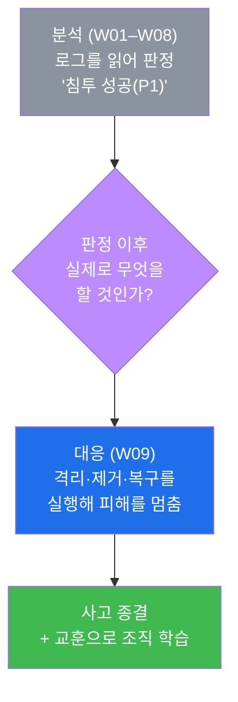
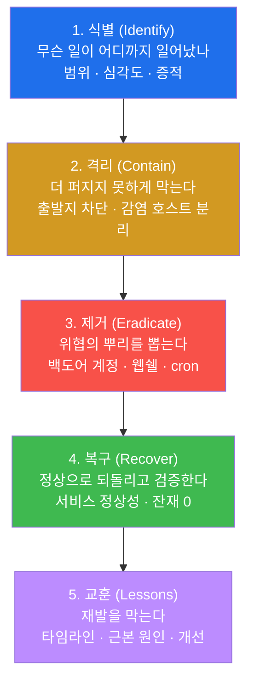
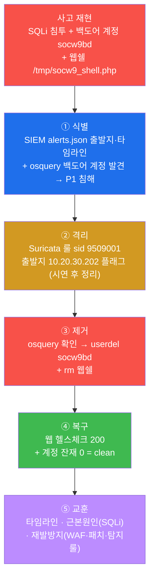
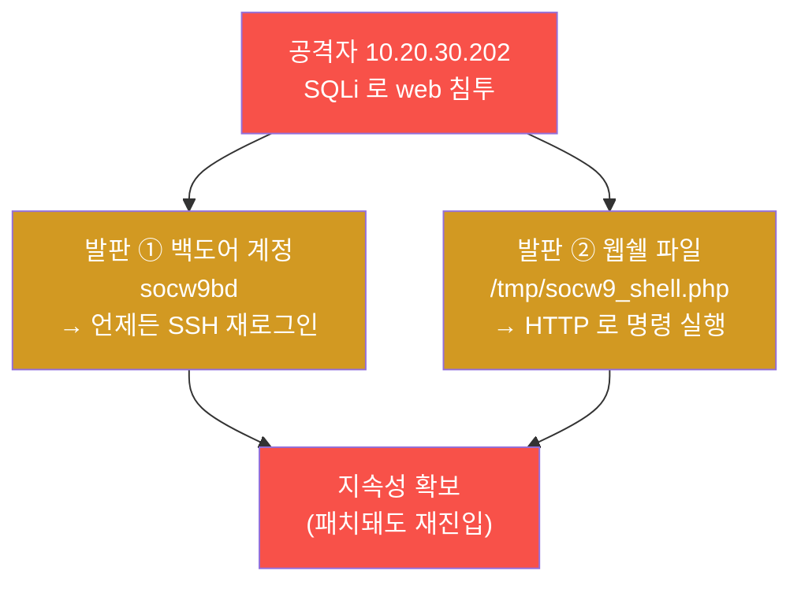
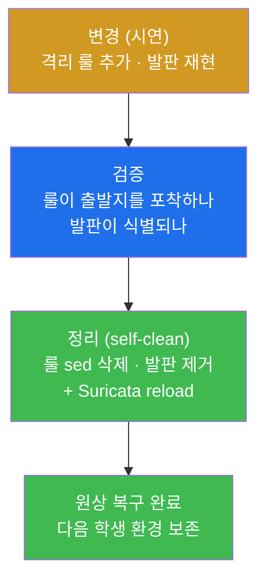
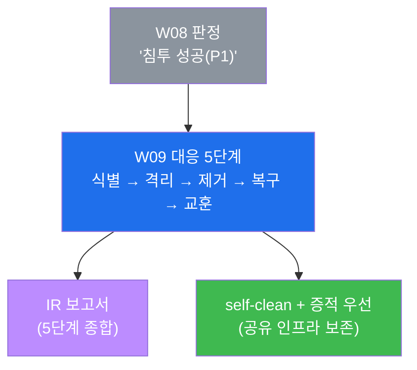
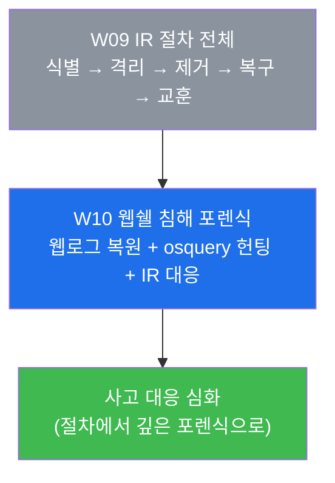

# SOC W09 — 사고 발생 첫 60분: 식별·격리·제거·복구·교훈의 IR 절차

> **본 주차의 한 줄 요약**
>
> W08 중간고사까지 학생은 흩어진 로그를 교차로 읽어 "무슨 일이 일어났나"를 **판정**하는
> 분석가의 눈을 길렀다. 하지만 판정이 끝나면 진짜 일이 시작된다 — **그래서 지금 당장
> 무엇을 할 것인가.** 본 주차는 그 답인 **사고 대응(IR, Incident Response)** 의 표준
> 절차를 배운다. 사고는 즉흥으로 막는 게 아니라 **정해진 5단계 — 식별(Identify) → 격리
> (Contain) → 제거(Eradicate) → 복구(Recover) → 교훈(Lessons learned)** 로 막는다.
> 학생은 el34 위에서 한 침해(SQLi 침투 + 백도어 계정 + 웹쉘 발판)를 직접 재현한 뒤, 이
> 5단계를 본인 손으로 한 바퀴 돌려 사고를 가라앉히고 보고서로 종합한다.
>
> **대응자 한 줄 결론**: 분석이 "누가 무엇을 했나"라면 대응은 "그래서 지금 무엇을 멈추고,
> 무엇을 뽑고, 무엇을 되살리나"다. 첫 60분의 행동이 피해 규모를 가른다 — 그래서 절차가
> 있고, 절차를 **순서대로 빠르되 정밀하게** 밟는 훈련을 한다.

---

## 학습 목표

본 주차 종료 시 학생은 다음 6가지를 **본인 손으로** 할 수 있어야 한다.

1. NIST 기반 **IR 생명주기 5단계**(식별 → 격리 → 제거 → 복구 → 교훈)의 각 단계가 무엇을
   하는 단계인지, 그리고 왜 이 **순서**여야 하는지를 비유 없이 1분 안에 설명한다.
2. el34 위에 통제된 한 침해(SQLi 침투 + 백도어 계정 `socw9bd` + 웹쉘 파일)를 재현해, 이후
   모든 대응 단계가 다룰 **사고 대상**을 만든다.
3. **식별(Identify)** 단계에서 SIEM(`alerts.json`)으로 사고의 출발지·타임라인을, osquery 로
   호스트에 남은 발판을 찾아 사고의 **범위와 심각도**를 증거와 함께 판정한다.
4. **격리(Contain)** 단계에서 IDS(Suricata) 룰로 공격 출발지(`10.20.30.202`)를 플래그해
   확산을 막고, 공유 실습 인프라를 보존하기 위해 그 룰을 **시연 후 안전하게 정리**한다.
5. **제거(Eradicate)** 와 **복구(Recover)** 단계에서 osquery 로 발판을 빠짐없이 헌팅해
   `userdel`·`rm` 으로 제거하고, 서비스 정상성과 **발판 잔재 0** 을 검증한다.
6. **교훈(Lessons learned)** 으로 타임라인·근본 원인·재발 방지를 정리하고, 위 전 과정을
   **IR 5단계 보고서** 한 장으로 종합한다.

> **본 주차의 시선** — W09 는 "탐지"가 아니라 "대응"이 주제다. 채점은 "사고가 있었다"는
> 선언이 아니라, **각 IR 단계를 절차대로 밟았는가**, 단계마다 **증거(로그·osquery·eve)** 가
> 붙었는가, 그리고 공유 인프라를 **원상 복구(self-clean)** 했는가를 본다.

---

## 강의 시간 배분 (총 3시간 40분)

| 시간        | 내용                                                                   | 유형      |
|-------------|------------------------------------------------------------------------|-----------|
| 0:00–0:20   | 이론 — 분석에서 대응으로: 왜 절차(IR 생명주기)가 필요한가               | 강의      |
| 0:20–0:55   | 이론 — IR 5단계 상세(식별·격리·제거·복구·교훈) + 각 단계의 도구          | 강의      |
| 0:55–1:05   | 휴식                                                                    | —         |
| 1:05–1:35   | 이론 — el34 에서 IR 을 어떻게 시연하나(공유 인프라·self-clean·증적 보전) | 강의/토론 |
| 1:35–2:00   | 실습 — 점검 + 사고 재현 + 식별 (lab 1–3)                                | 실습      |
| 2:00–2:30   | 실습 — 격리(IDS 룰) + 제거(osquery) (lab 4–5)                           | 실습      |
| 2:30–2:40   | 휴식                                                                    | —         |
| 2:40–3:10   | 실습 — 복구 검증 + 교훈 정리 (lab 6–7)                                  | 실습      |
| 3:10–3:30   | 실습 — IR 보고서 종합 (lab 8)                                           | 실습      |
| 3:30–3:40   | 정리 + 채점 기준 안내 + 다음 주차(W10 — 웹쉘 침해 포렌식) 예고          | 정리      |

---

## 0. 용어 해설 (사고 대응 입문)

본 주차에서 처음 등장하거나 IR 맥락에서 새 의미를 갖는 핵심어를 먼저 정리한다. 처음 보는
용어가 본문에 나오면 본 표로 돌아오면 흐름이 끊기지 않는다.

| 용어 | 영문 | 뜻 | 비유 |
|------|------|----|------|
| **사고 대응** | Incident Response (IR) | 침해가 확인된 뒤 피해를 줄이고 정상화하는 절차적 활동 | 화재 발생 후 진압·구조·복구 |
| **IR 생명주기** | IR lifecycle | 식별→격리→제거→복구→교훈으로 이어지는 표준 대응 순서 | 응급처치 매뉴얼의 단계 |
| **식별** | Identify | 무슨 일이 어디까지 일어났는지(범위·심각도)를 확정 | 화재가 몇 층·어디까지 번졌나 확인 |
| **격리** | Contain | 위협이 더 퍼지지 못하게 확산을 차단 | 방화문을 닫아 불길을 가둠 |
| **제거** | Eradicate | 공격자가 남긴 발판·흔적을 뿌리째 제거 | 불씨까지 완전히 끔 |
| **복구** | Recover | 서비스를 정상으로 되돌리고 정상성을 검증 | 정전 복구 후 시설 재가동 |
| **교훈** | Lessons learned | 타임라인·근본 원인·재발 방지를 정리해 조직이 학습 | 사고 보고서로 매뉴얼 개선 |
| **사고 / 침해** | Incident / Compromise | 보안 정책을 위반한 사건, 그중 실제로 뚫린 것이 침해 | 침입 시도 vs 침입 성공 |
| **발판** | Foothold | 공격자가 재진입·지속을 위해 심어둔 거점(계정·파일) | 도둑이 숨겨둔 합쪽 열쇠 |
| **지속성** | Persistence | 재부팅·패치 후에도 공격자가 다시 들어올 수 있게 만든 장치 | 몰래 복제해둔 현관 열쇠 |
| **백도어 계정** | Backdoor account | 공격자가 몰래 만든 로그인 계정(지속성의 한 형태) | 명단에 없는 가짜 출입증 |
| **웹쉘** | Web shell | 웹 서버에 심어 HTTP 로 명령을 실행하는 작은 스크립트 파일 | 건물 안에 숨긴 무선 조종기 |
| **증적 / 증거 보전** | Evidence preservation | 사고의 로그·타임라인을 변형 없이 보존(법무·포렌식 대비) | 사건 현장을 손대기 전 사진 촬영 |
| **침해 타임라인** | Incident timeline | 사고 단계를 시각순으로 늘어놓은 사건 연표 | 사건 발생 순서 시간표 |
| **근본 원인** | Root cause | 사고가 가능했던 본질적 원인(취약점·약한 설정 등) | 불이 난 진짜 발화 지점 |
| **osquery** | osquery | OS 의 프로세스·파일·계정을 SQL 로 질의하는 호스트 가시화 도구 | 건물 안 모든 방을 SQL 로 조회 |
| **self-clean** | self-clean | 공유 실습 환경을 보존하려 시연 후 변경을 원복하는 마무리 | 훈련 후 현장 원상 복구 |

> **헷갈리기 쉬운 한 쌍 — 격리(Contain) vs 제거(Eradicate).** 둘은 순서가 다른 별개의
> 단계다. **격리**는 위협이 더 **퍼지지 못하게 막는** 응급 조치다 — 아직 발판은 그대로
> 있지만, 공격자가 그 발판을 더 활용하거나 다른 자산으로 번지지 못하게 길을 끊는다(불길을
> 방화문으로 가두는 것). **제거**는 그렇게 가둔 뒤 발판 자체를 **뿌리째 뽑는** 작업이다 —
> 백도어 계정을 지우고 웹쉘 파일을 삭제한다(불씨까지 끄는 것). 순서가 중요하다: 격리 없이
> 제거부터 하면 그 사이에 공격자가 더 번질 수 있고, 격리만 하고 제거를 빼먹으면 발판이
> 남아 **재침투**한다.

> **헷갈리기 쉬운 또 한 쌍 — 분석(W01–W08) vs 대응(W09).** **분석**은 이미 남은 로그를
> 읽어 "누가·무엇을·언제 했나"를 **판정**하는 일이다(인프라를 바꾸지 않는다). **대응**은 그
> 판정을 근거로 인프라에 **실제로 손을 대는** 일이다 — 출발지를 막고(격리), 발판을 지우고
> (제거), 서비스를 되살린다(복구). W09 에서 처음으로 학생은 "읽기"를 넘어 "고치기"를 한다.
> 그래서 공유 인프라를 망가뜨리지 않도록 **self-clean** 규율이 함께 따라온다(§7).

---

## 1. 왜 분석만으로는 부족한가 — 대응이라는 다음 단계

### 1.1 한 줄 답: 판정은 시작일 뿐, 피해는 행동으로만 멈춘다

W08 중간고사에서 학생은 네 소스(인증·웹·네트워크·SIEM)를 교차로 읽어 "한 공격자가 정찰 →
웹 침투 → 인증 공격을 했고, 침투에 성공했다(P1)"는 **판정**까지 도달했다. 그런데 판정문을
손에 쥔 순간에도 공격자의 백도어 계정은 여전히 살아 있고, 웹쉘은 여전히 명령을 받을 수
있으며, 출발지는 여전히 다음 공격을 보낼 수 있다. **분석은 사진을 찍는 일이고, 대응은
불을 끄는 일이다.** 사진만으로는 불이 꺼지지 않는다.



대응이 빠진 SOC 는 "불이 났다고 정확히 보고만 하고 끄지는 않는 소방서"와 같다. W09 는 그
공백을 메운다 — 판정을 행동으로 잇는다.

### 1.2 왜 "절차"인가 — 즉흥 대응이 피해를 키운다

사고가 터지면 현장은 혼란스럽다. 여러 사람이 동시에 손을 대면 서로의 작업을 덮어쓰고,
증거를 지우고, 멀쩡한 서비스를 끊는다. 실제 침해 사고의 사후 분석에서 반복적으로 나오는
교훈은 "대응이 느려서가 아니라 **순서 없이 손을 대서**" 피해가 커졌다는 것이다. 그래서
IR 은 개인의 순발력이 아니라 **합의된 절차**를 따른다. 절차의 가치는 세 가지다 — (1)
빠뜨림 방지(제거 단계를 잊지 않게), (2) 순서 보장(격리를 제거보다 먼저), (3) 증거 보전
(서두르다 로그를 날리지 않게).

> **용어 — 증적(증거 보전).** IR 중에 만지는 모든 것은 나중에 법무·감사·포렌식의 증거가
> 될 수 있다. 그래서 발판을 지우기 **전에** 먼저 그 존재를 기록(타임라인·로그 캡처)한다.
> 본 주차 실습에서 "제거 전 발판 확인"(lab 5) 을 제거보다 먼저 두는 이유가 바로 증적
> 보전이다 — 무엇을 지웠는지 증거로 남긴 뒤 지운다.

### 1.3 한계 — 본 주차가 다루지 않는 것

W09 는 IR **절차의 한 바퀴**를 통제된 단일 침해 위에서 익히는 데 집중한다. 따라서 다음은
범위 밖이다 — 특정 사고 유형의 깊은 포렌식(웹쉘 침해 전담 분석은 W10), 위협 인텔리전스
연동(W12–W14), 그리고 실제 운영의 방화벽 `drop`·호스트 격리 같은 **파괴적 차단**이다. 공유
실습 인프라에서는 다른 학생의 환경을 끊지 않도록 격리를 `drop` 대신 **alert(탐지 플래그)**
로 시연하고 시연 후 정리한다(§7 에서 상세). 즉 본 주차는 "절차를 손에 익히는" 훈련이지
"운영 차단 정책을 그대로 적용하는" 시간이 아니다.

---

## 2. IR 생명주기 5단계 — 사고를 가라앉히는 순서

사고 대응의 표준 골격은 미국 NIST 의 사고 대응 가이드(SP 800-61)에 정리된 절차를 따른다.
세부 명칭은 기관마다 조금씩 다르지만(NIST 는 준비/탐지·분석/봉쇄·근절·복구/사후활동의 4
국면으로 묶는다), 현장에서 한 사고를 굴릴 때 실제로 밟는 행동 순서는 다음 5단계로 압축된다.
본 주차의 lab 미션도 이 순서를 그대로 따른다.

> **용어 — NIST IR 생명주기.** NIST(미국 국립표준기술연구소)는 사고 대응을 표준 절차로
> 정리한 기관이고, SP 800-61 이 그 대표 문서다. 핵심 메시지는 "사고 대응은 즉흥이 아니라
> **반복 가능한 절차**여야 한다"는 것이다. 본 강의는 이 절차를 현장에서 쓰는 다섯 동사 —
> **식별·격리·제거·복구·교훈** — 로 학생에게 제시한다.



이 다섯 단계는 **왼쪽에서 오른쪽으로** 흐른다. 순서에는 이유가 있다 — 무슨 일인지 알아야
(식별) 어디를 막을지 알고(격리), 막아둬야 안전하게 뽑고(제거), 뽑은 뒤라야 되살릴 수 있고
(복구), 다 끝낸 뒤에야 차분히 배운다(교훈). 아래에서 각 단계를 **한 줄 정의 → 왜 중요한가
→ el34 에서 어떻게 → 한계** 순으로 본다.

### 2.1 ① 식별(Identify) — 무슨 일이 일어났나

**한 줄 정의.** 식별은 사고의 **범위(어느 자산이 어디까지)** 와 **심각도(시도인가 침해인가)**
를 증거로 확정하는 첫 단계다.

**왜 중요한가.** 범위를 모르면 격리를 너무 좁게(놓침) 또는 너무 넓게(과잉 차단) 한다.
심각도를 모르면 대응의 강도를 정할 수 없다. 식별은 이후 네 단계의 방향을 정하는 나침반이다.
이때 W01–W08 에서 기른 분석 역량이 그대로 쓰인다 — 식별은 곧 "사고 시작 시점의 빠른 분석"
이다.

**el34 에서 어떻게.** SIEM 에 수렴한 경보로 사고의 출발지와 타임라인을 잡고, 호스트
가시화(osquery)로 남은 발판을 확인한다. 두 명령이 식별의 양 축이다.

```bash
# (식별-1) SIEM 에서 공격 출발지·타임라인 — 무슨 일이 언제
docker exec el34-siem sh -c 'tail -1000 /var/ossec/logs/alerts/alerts.json | jq -rc "select(.data.src_ip==\"10.20.30.202\")|[.timestamp,.rule.description]|@tsv" | tail -5'

# (식별-2) osquery 로 호스트에 남은 발판 — 어디까지 뚫렸나
docker exec el34-web osqueryi --json 'SELECT username,uid FROM users WHERE username="socw9bd";'
```

위 첫 명령은 출발지 `10.20.30.202` 의 경보를 시각순으로 보여줘 "정찰 → 침투"의 진행을
드러낸다. 둘째 명령이 백도어 계정 `socw9bd` 를 반환하면 — 공격자가 호스트에 계정을 만들
정도로 **뚫렸다는 결정적 증거** 이므로, 심각도는 "시도"가 아니라 **침해(P1)** 로 확정된다.

> **용어 — alerts.json 과 osquery.** `alerts.json` 은 Wazuh manager 가 각 agent(el34 에서는
> ips·web)에서 받은 로그를 룰로 평가해 만든 통합 경보 파일이다(W04 학습). **osquery** 는
> OS 의 상태(프로세스·파일·계정)를 SQL 테이블처럼 질의하는 호스트 가시화 도구다 — `SELECT
> username FROM users` 처럼 계정 목록을 즉석에서 조회할 수 있다. el34 에서는 web 컨테이너에
> osquery 가 설치돼 있어 호스트 발판을 SQL 로 찾아낸다.

**한계.** 식별은 "보이는 만큼만" 정확하다. 어떤 발판은 osquery 한 번에 안 잡힐 수 있어
(예: cron, 다른 경로의 파일) 제거 단계에서 다시 헌팅이 필요하다. 식별은 끝이 아니라
대응 내내 갱신되는 그림이다.

### 2.2 ② 격리(Contain) — 확산을 막아라

**한 줄 정의.** 격리는 위협이 더 퍼지기 전에 **공격 경로를 끊어** 확산을 차단하는 응급
단계다. 원칙은 "**차단 우선, 분석 나중**" 이다.

**왜 중요한가.** 제거에는 시간이 걸린다. 그 사이에 공격자가 다른 자산으로 번지거나 발판을
더 심으면 사고가 커진다. 격리는 그 시간을 버는 방화문이다. 단, 격리는 **빠르되 정밀** 해야
한다 — 너무 넓게 막으면 정상 서비스까지 끊겨 사고 대응이 또 다른 장애를 부른다.

**el34 에서 어떻게.** 공격 출발지(`10.20.30.202`)의 모든 트래픽을 잡아내는 Suricata 룰을
추가해 출발지를 **플래그** 한다. 운영 환경이라면 이 룰을 방화벽 `drop` 으로 걸어 실제로
차단하겠지만, **공유 실습 인프라에서는 다른 학생의 트래픽까지 끊기지 않도록 `alert`(탐지
플래그)로 시연한 뒤, 시연이 끝나면 룰을 안전하게 삭제(self-clean)** 한다.

```bash
# (격리) 출발지 플래그 룰을 Suricata local.rules 에 추가 → 리로드
docker exec el34-ips sh -c 'sudo bash -c "cat >> /etc/suricata/rules/local.rules <<EOF
alert ip 10.20.30.202 any -> any any (msg:\"SOC W09 IR contain - flag attacker source\"; sid:9509001; rev:1;)
EOF"'
docker exec el34-ips sh -c 'sudo suricatasc -c reload-rules'

# (검증) 출발지가 트래픽을 보내면 룰이 eve.json 에 찍히는지 확인
docker exec el34-attacker sh -c 'curl -s -o /dev/null -H "Host: dvwa.el34.lab" http://10.20.30.1/'
docker exec el34-ips sh -c 'sudo grep -c 9509001 /var/log/suricata/eve.json'

# (정리·self-clean) 시연이 끝나면 룰 삭제 → 리로드 (공유 인프라 보존)
docker exec el34-ips sh -c 'sudo sed -i "/sid:9509001/d" /etc/suricata/rules/local.rules; sudo suricatasc -c reload-rules >/dev/null'
```

이 룰은 출발지 `10.20.30.202` 가 보내는 **모든** 트래픽(`ip ... any -> any any`)을 잡는다 —
즉 공격자 한 명을 통째로 플래그한다. 검증 단계에서 `grep -c 9509001` 의 출력이 1 이상이면
"격리 룰이 출발지 트래픽을 실제로 포착했다"는 증거다. 마지막 정리 명령이 룰을 지워 다음
학생의 환경을 그대로 돌려놓는다.

> **용어 — Suricata 룰과 sid, local.rules.** Suricata 룰은 `<액션> <프로토콜> <출발지> ->
> <목적지> (옵션)` 형식이다. 여기서 액션 `alert` 는 "탐지해 eve.json 에 기록"(차단은 안 함),
> `drop` 은 "차단"이다. `sid`(signature id)는 룰의 고유 번호이며 9509001 처럼 사용자 정의
> 룰은 보통 큰 번호 대역을 쓴다. 사용자가 추가하는 룰은 `/etc/suricata/rules/local.rules`
> 에 넣고, `suricatasc -c reload-rules` 로 재기동 없이 즉시 반영한다.

**한계.** alert 룰은 **탐지만** 하고 실제로 트래픽을 막지는 않는다 — 본 실습은 격리의
"절차와 효과 확인"을 익히는 시연이다. 실제 격리는 방화벽 `drop`, 호스트 네트워크 분리,
계정 잠금 등 **파괴적 차단** 을 동반하며, 그만큼 정밀한 범위 설정이 필요하다.

### 2.3 ③ 제거(Eradicate) — 뿌리를 뽑아라

**한 줄 정의.** 제거는 격리로 가둔 위협의 **발판·흔적을 완전히 삭제** 하는 단계다.

**왜 중요한가.** 발판이 하나라도 남으면 공격자는 패치·격리를 우회해 **재침투** 한다. 그래서
제거의 기준은 "대충 지움"이 아니라 "**빠짐없이** 지움"이다. 백도어 계정, 비인가 cron,
SSH 키, 웹쉘 파일 — 공격자가 심을 수 있는 모든 지속성 수단을 헌팅해 제거한다.

**el34 에서 어떻게.** 먼저 osquery 로 발판의 **존재를 확인(증적)** 한 뒤, 계정은 `userdel`,
파일은 `rm` 으로 제거한다. "확인 → 제거" 순서가 핵심이다 — 무엇을 지웠는지 증거를 남기고
지운다.

```bash
# (제거-확인) osquery 로 백도어 계정 + 웹쉘 파일의 존재를 먼저 기록
docker exec el34-web osqueryi --json 'SELECT username FROM users WHERE username="socw9bd";'
docker exec el34-web sh -c 'ls -la /tmp/socw9_shell.php'

# (제거-실행) 계정 삭제(userdel) + 웹쉘 파일 삭제(rm)
docker exec el34-web sh -c 'userdel -r socw9bd 2>/dev/null; rm -f /tmp/socw9_shell.php; echo eradicated'
```

`userdel -r` 의 `-r` 은 계정의 홈 디렉터리까지 함께 지운다는 뜻으로, 계정이 남긴 부산물까지
없앤다. `echo eradicated` 는 제거 절차가 끝까지 실행됐다는 신호다. 이 단계가 본 사고에서
공격자의 두 발판(계정·웹쉘)을 뿌리째 뽑는다.

> **용어 — 지속성(persistence)과 발판.** 공격자는 한 번 들어오면 다시 들어올 길을 남긴다 —
> 이것이 **지속성** 이다. 백도어 계정(명단에 없는 출입증), 비인가 cron(정해진 시각에 자동
> 실행), 웹쉘(HTTP 로 부르는 원격 조종기)이 대표적 발판이다. 제거 단계의 본질은 이 지속성
> 수단을 빠짐없이 찾아 끊는 것이다.

**한계.** osquery 는 질의한 범위만 본다 — 다른 경로의 웹쉘이나 잊은 cron 이 남으면 못
잡는다. 그래서 실제 IR 은 한 번의 제거로 끝내지 않고, 제거 후 다시 헌팅해 잔재가 0 임을
확인한다(다음 복구 단계가 그 검증을 맡는다).

### 2.4 ④ 복구(Recover) — 정상으로 되돌려라

**한 줄 정의.** 복구는 서비스를 **정상 동작 상태로 되돌리고**, 발판 잔재가 0 임을 **검증**
하는 단계다.

**왜 중요한가.** 제거를 했다고 끝이 아니다 — 제거 과정에서 서비스가 멈췄거나 설정이
틀어졌을 수 있고, 미처 못 지운 발판이 남아 있을 수도 있다. 복구는 "정말 정상인가, 정말
깨끗한가"를 두 눈으로 확인하는 검증 관문이다.

**el34 에서 어떻게.** 웹 서비스에 헬스체크 요청을 보내 응답 코드로 정상성을 확인하고,
제거했던 계정이 정말 사라졌는지 다시 조회해 **잔재 0** 을 검증한다.

```bash
# (복구-정상성) 웹 서비스가 정상 응답하는지 헬스체크
docker exec el34-web sh -c 'curl -s -o /dev/null -w "web=%{http_code}\n" -H "Host: dvwa.el34.lab" http://localhost/'

# (복구-잔재0) 백도어 계정이 정말 사라졌는지 재확인
docker exec el34-web sh -c 'id socw9bd 2>/dev/null && echo "계정 잔재!" || echo "clean"'
```

첫 명령의 `web=200`(또는 정상 리다이렉트 코드)은 서비스가 살아 있다는 뜻이다. 둘째 명령은
`id socw9bd` 가 실패해 `clean` 을 출력해야 정상이다 — 계정이 남아 있으면 `계정 잔재!` 가
찍힌다. **서비스 정상 + 발판 잔재 0** 이 동시에 충족돼야 복구 완료다.

> **용어 — HTTP 상태 코드와 헬스체크.** 웹 서버는 응답마다 상태 코드를 돌려준다 — `200`
> 정상, `302` 리다이렉트, `403` 차단, `5xx` 서버 오류. `curl -w "%{http_code}"` 는 본문
> 대신 그 코드만 뽑아 서비스가 살아 있는지 빠르게 확인하는 **헬스체크** 기법이다.

**한계.** 헬스체크 한 번이 "완전 정상"을 보장하지는 않는다 — 깊은 기능 손상은 추가 검증이
필요하다. 또한 복구 후에도 같은 공격이 재발할 수 있으므로 모니터링을 강화해 감시한다.

### 2.5 ⑤ 교훈(Lessons learned) — 재발을 막아라

**한 줄 정의.** 교훈은 사고 전체를 **타임라인 · 근본 원인 · 재발 방지** 로 정리해 조직이
같은 사고를 두 번 겪지 않게 하는 마지막 단계다.

**왜 중요한가.** 사고를 끄기만 하고 배우지 않으면 같은 취약점으로 다시 뚫린다. 교훈 단계는
"왜 이번에 들어올 수 있었나(근본 원인)"를 직시하고, 그 원인을 막을 구체적 조치(탐지 룰
추가, 패치, 설정 강화)를 정해 다음을 대비한다.

**el34 에서 어떻게.** 본 사고의 타임라인을 시간순으로 적고, 근본 원인(웹앱 SQLi 취약점)과
재발 방지책(WAF 강화, 앱 패치, 탐지 룰 추가, 계정 모니터링)을 정리한다.

```bash
echo "타임라인: 스캔 → SQLi 침투 → 백도어 계정/웹쉘 발판 → (IR로 격리·제거·복구)"
echo "근본원인: 웹앱 SQLi 취약점 악용"
echo "재발방지: ① WAF 룰 강화 ② 앱 패치/입력검증 ③ 탐지룰(W04) 추가 ④ 계정 모니터링(W12)"
```

여기서 재발 방지책이 앞 주차들과 연결된다 — 탐지 룰 추가는 W04(Wazuh 커스텀 룰), 계정
모니터링은 W12 와 이어진다. 즉 교훈은 한 사고의 끝이자, 다음 방어를 설계하는 출발점이다.

> **용어 — 근본 원인과 침해 타임라인.** **근본 원인**은 "백도어 계정이 있었다" 같은 *결과*
> 가 아니라, 그 계정을 만들 수 있게 한 *본질적 약점*(여기서는 SQLi 취약점)이다. 결과만 지우고
> 근본 원인을 두면 재발한다. **침해 타임라인**은 정찰부터 대응까지를 시각순으로 늘어놓은
> 연표로, 보고서의 뼈대이자 재발 방지 논의의 공통 기준이 된다.

**한계.** 교훈은 문서로 남기는 데 그치면 무력하다 — 정리한 재발 방지책이 실제 룰·패치·절차로
**이행** 되어야 의미가 있다. 본 주차는 그 정리까지를 다루고, 이행은 이후 주차의 실습으로
이어진다.

---

## 3. 한 사고가 IR 5단계를 어떻게 통과하나 — el34 시나리오

본 주차 실습이 다루는 사고는 통제된 **한 침해** 다. 이 사고가 5단계를 어떻게 통과하는지를
한 장으로 그리면 다음과 같다. 이 그림이 본 주차 lab 전체의 지도다.



### 3.1 사고의 두 발판 — 무엇을 제거 대상으로 삼나

이 사고는 침투(SQLi)에 더해 **두 개의 발판**을 남긴다. 대응이 끝나려면 이 둘이 모두
사라져야 한다.



백도어 계정 `socw9bd` 는 "명단에 없는 출입증"이고, 웹쉘 `socw9_shell.php` 는 "건물 안에
숨긴 무선 조종기"다. 둘 중 하나만 지우면 다른 하나로 공격자가 다시 들어온다 — 그래서 제거
단계(lab 5)는 계정과 파일을 **함께** 제거하고, 복구 단계(lab 6)는 잔재가 0 임을 검증한다.

### 3.2 el34 에서 어디서 무엇을 보나 — 컨테이너별 역할

각 IR 단계가 el34 의 어느 컨테이너에서 실행되는지를 정리하면 다음과 같다. 모든 명령은 el34
호스트(`ssh ccc@192.168.0.151`, 비밀번호 1)에서 `docker exec` 로 해당 컨테이너에 들어가
수행한다.

| IR 단계 | 무엇을 하나 | el34 컨테이너 | 핵심 도구·경로 |
|---------|-------------|---------------|----------------|
| 사고 재현 | SQLi + 발판 심기 | `el34-attacker` / `el34-web` | curl(공격) / useradd·웹쉘 파일 |
| ① 식별 | 출발지·타임라인 + 발판 확인 | `el34-siem` / `el34-web` | `alerts.json` / osquery |
| ② 격리 | 출발지 플래그 룰 | `el34-ips` | Suricata `local.rules`·`eve.json` |
| ③ 제거 | 발판 삭제 | `el34-web` | osquery · `userdel` · `rm` |
| ④ 복구 | 서비스·잔재 검증 | `el34-web` | curl 헬스체크 · `id` |
| ⑤ 교훈 | 타임라인·근본원인 정리 | (호스트) | 보고서 |

> **참고 — 출발지 IP 가 보존되는 이유.** 식별·격리가 출발지 `10.20.30.202` 를 키로 삼을 수
> 있는 것은 el34 의 fw 가 SNAT 를 하지 않아 **출처 IP 가 모든 소스에 그대로 보존** 되기
> 때문이다(W08 §3 에서 상세히 다뤘다). 그래서 SIEM 의 경보, Suricata 의 룰, 모두 같은 진짜
> 출발지를 가리킨다. 외부 공격자 시나리오라면 출발지가 외부 VM `192.168.0.202` 로 보존된다.

---

## 4. el34 에서 IR 을 안전하게 시연하기 — 공유 인프라 규율

W09 는 학생이 처음으로 인프라를 **고치는** 주차다. 공유 실습 환경에서 이를 안전하게 하려면
두 가지 규율을 지켜야 한다 — **self-clean(시연 후 원복)** 과 **증적 우선(지우기 전에 기록)**.

### 4.1 self-clean — 시연하되 원래대로 되돌린다

격리 룰(sid 9509001)과 재현된 발판(계정·웹쉘)은 모두 **시연이 끝나면 정리** 한다. 격리 룰은
`sed` 로 삭제하고 Suricata 를 리로드하며, 발판은 제거 단계에서 어차피 지워진다. 이렇게 해야
다음 학생이 깨끗한 환경에서 시작한다.



운영 환경과의 차이를 분명히 하자 — **운영의 격리는 방화벽 `drop` 으로 실제 차단** 하고
대개 사후 분석까지 유지한다. **공유 실습의 격리는 `alert` 로 시연하고 즉시 정리** 한다.
같은 절차(식별 → 격리 → 제거 → 복구 → 교훈)를 배우되, 차단의 파괴력만 시연용으로 낮춘 것이다.

### 4.2 증적 우선 — 지우기 전에 기록한다

제거 단계에서 발판을 바로 지우지 않고, osquery·`ls` 로 **존재를 먼저 확인(기록)** 한 뒤
지운다(§2.3). 실제 사고였다면 이 기록이 법무·포렌식·보고의 증거가 된다. "확인 → 제거"라는
한 칸의 순서가 곧 증적 보전의 실천이다.

---

## 5. 실습 안내 — IR lab 8 미션 (4 축 설명)

본 주차 실습은 8 미션으로, IR 5단계를 점검 → 사고 재현 → 식별 → 격리 → 제거 → 복구 → 교훈
→ 보고서 순서로 한 바퀴 돈다. 각 미션을 **4 축** — 왜 하는가 / 무엇을 알 수 있는가 / 결과
해석(정상 vs 비정상) / 실전 활용 — 으로 설명한다.

> **실습 진행 원칙.** 모든 명령은 el34 호스트(`ssh ccc@192.168.0.151`, 비밀번호 1)에서
> 실행한다. 격리 룰과 재현 발판은 **self-clean** 한다(공유 인프라 보존). 합격 임계값은
> 0.7 이다.

### 미션 1 — 점검: IR 도구가 준비됐나 (8점)

> **왜 하는가?** 사고가 터진 뒤 도구를 찾으면 늦다. 대응자는 착수 전에 식별(SIEM)·격리
> (IDS)·제거(osquery) 도구가 살아 있는지부터 확인한다.
>
> **무엇을 알 수 있는가?** SIEM 의 `analysisd`(Wazuh 분석 데몬)가 running 인지, web 의
> osquery 가 동작하는지. 이 둘이 IR 의 식별·제거 축이 살아 있다는 뜻이다.
>
> **결과 해석.** 정상: `analysisd` 가 running 이고 osquery 버전이 출력됨. 비정상: 둘 중
> 하나라도 없으면 그 단계를 수행할 수 없으므로 먼저 원인을 파악한다.
>
> **실전 활용.** 사고 대응 착수 직전의 첫 점검 — 어떤 도구가 죽어 있으면 그 단계가 막히므로
> 대응 계획을 시작부터 정확히 세울 수 있다.

### 미션 2 — 사고 재현: 침투 + 발판 (10점)

> **왜 하는가?** 이후 모든 대응 단계가 다룰 **사고 대상**을 통제된 형태로 만든다. SQLi
> 침투에 더해 백도어 계정과 웹쉘이라는 두 발판을 심어, 격리·제거가 실제로 끊어낼 표적을
> 준비한다.
>
> **무엇을 알 수 있는가?** 한 침해가 어떻게 "침투(SQLi) + 지속성(계정·웹쉘)"의 형태로
> 남는지. 한 번의 재현이 미션 3–8 의 원천 데이터다.
>
> **결과 해석.** 정상: 세 행위(SQLi·계정 생성·웹쉘 작성)가 실행되고 `incident done` 이
> 출력됨. 비정상: 발판이 안 심기면 이후 식별·제거에서 표적이 안 보이므로 재현부터 다시 한다.
>
> **실전 활용.** 통제된 환경에서 알려진 침해를 재현해 "우리 대응 절차가 이 발판들을 다
> 끊는가"를 점검하는 표준 훈련(레드팀 발판 시뮬레이션).

### 미션 3 — ① 식별: 범위/심각도 (12점)

> **왜 하는가?** 대응의 방향을 정하려면 먼저 "무슨 일이 어디까지"를 증거로 확정해야 한다.
> 식별이 격리·제거의 범위를 결정한다.
>
> **무엇을 알 수 있는가?** SIEM `alerts.json` 으로 출발지(`10.20.30.202`)와 타임라인을,
> osquery 로 백도어 계정 `socw9bd` 의 존재를 확인하는 법. 계정 발견 = 침투 성공 → **P1**
> 심각도 판정.
>
> **결과 해석.** 정상: 출발지 경보가 시간순으로 보이고 osquery 가 `socw9bd` 를 반환 →
> 침해(P1). 비정상: 발판이 안 보이면 미션 2 재현을, 경보가 비면 SIEM 수렴(agent 연결)을 점검.
>
> **실전 활용.** 사고 착수 직후의 빠른 범위·심각도 산정 — "시도인가 침해인가"를 증거로
> 가르는 것이 이후 대응 강도를 결정한다.

### 미션 4 — ② 격리: 출발지 플래그 (sid 9509001) (14점)

> **왜 하는가?** 제거에 걸리는 시간 동안 확산을 막는 방화문을 세운다. 공격 출발지를 통째로
> 플래그해 "이 출처가 또 움직이면 즉시 보인다"는 상태를 만든다.
>
> **무엇을 알 수 있는가?** Suricata `local.rules` 에 출발지 룰(sid 9509001)을 추가 →
> 리로드 → 출발지가 트래픽을 보내면 `eve.json` 에 잡히는 격리의 전 과정. 그리고 공유 인프라
> 보존을 위한 **self-clean(룰 삭제)**.
>
> **결과 해석.** 정상: `grep -c 9509001` 가 1 이상(출발지 트래픽 포착)이고 끝에 `rule_removed`
> 가 출력(정리 완료). 비정상: 트리거 수가 0 이면 리로드/출발지 트래픽을, 정리가 안 되면
> `sed` 삭제를 점검.
>
> **실전 활용.** 사고 초기의 출발지 기반 격리 — 운영에서는 같은 논리를 방화벽 `drop` 으로
> 걸어 실제 차단한다. "빠르되 정밀하게(너무 넓으면 정상 서비스 차단)"가 핵심.

### 미션 5 — ③ 제거: persistence 제거 (14점)

> **왜 하는가?** 발판이 하나라도 남으면 재침투한다. 격리로 가둔 위협의 뿌리(계정·웹쉘)를
> 빠짐없이 뽑는다.
>
> **무엇을 알 수 있는가?** osquery·`ls` 로 발판의 **존재를 먼저 확인(증적)** 한 뒤
> `userdel`·`rm` 으로 제거하는 "확인 → 제거" 순서. 왜 지우기 전에 기록해야 하는지(법무·포렌식
> 증거).
>
> **결과 해석.** 정상: 계정·웹쉘이 확인된 뒤 `eradicated` 출력. 비정상: 제거 후에도 발판이
> 남으면(다음 복구 단계에서 드러남) 다른 경로·cron 을 추가 헌팅.
>
> **실전 활용.** 침해 대응의 핵심 — 모든 지속성 수단(계정·cron·키·웹쉘)을 헌팅해 끊는 것이
> 재침투를 막는 유일한 길이다.

### 미션 6 — ④ 복구: 서비스 정상성 검증 (12점)

> **왜 하는가?** 제거가 끝났다고 정상은 아니다. 서비스가 살아 있고 발판 잔재가 0 임을 두
> 눈으로 검증해야 사고가 닫힌다.
>
> **무엇을 알 수 있는가?** 웹 헬스체크(`curl -w "%{http_code}"`)로 서비스 정상성을, `id`
> 재조회로 계정 잔재 0 을 검증하는 법. **정상 + 잔재 0** 이 동시에 충족돼야 복구 완료.
>
> **결과 해석.** 정상: 웹이 응답하고 `id socw9bd` 가 실패해 `clean` 출력. 비정상: 잔재가
> 남으면(`계정 잔재!`) 미션 5 의 제거로 돌아가고, 서비스가 죽었으면 제거 부작용을 점검.
>
> **실전 활용.** 사고 종결 전 검증 관문 — "정말 정상인가, 정말 깨끗한가"를 확인하지 않으면
> 닫힌 줄 알았던 사고가 되살아난다.

### 미션 7 — ⑤ 교훈: 근본 원인 + 재발 방지 (10점)

> **왜 하는가?** 사고를 끄기만 하고 배우지 않으면 같은 취약점으로 다시 뚫린다. 타임라인과
> 근본 원인을 정리해 재발을 막는다.
>
> **무엇을 알 수 있는가?** 사고 타임라인(정찰 → 침투 → 발판 → 대응), 근본 원인(웹앱 SQLi
> 취약점), 재발 방지(WAF 강화·패치·탐지 룰·계정 모니터링)를 한 묶음으로 정리하는 법.
>
> **결과 해석.** 정상: 타임라인·근본 원인·재발 방지가 모두 포함됨. 비정상: "백도어가 있었다"
> 같은 *결과*만 적고 근본 원인(왜 가능했나)을 빼면 재발 방지로 이어지지 않는다.
>
> **실전 활용.** 사후 회고(post-incident review)의 표준 — 근본 원인을 짚고 구체적 개선책을
> 다음 주차(W04 탐지 룰, W12 계정 모니터링)와 연결한다.

### 미션 8 — IR 보고서 (10점)

> **왜 하는가?** 미션 1–7 을 5단계 보고서 한 장으로 종합해, 대응 능력을 문서로 입증한다 —
> 본 주차의 최종 산출물.
>
> **무엇을 알 수 있는가?** 식별 → 격리 → 제거 → 복구 → 교훈을 한 보고서로 종합하는 법.
> "IR 은 절차이고, 첫 60분의 행동이 피해를 가른다"는 결론을 증거와 함께 쓰는 것.
>
> **결과 해석.** 정상: 보고서에 5단계(Identify~Lessons)가 모두 포함됨. 비정상: 한 단계라도
> 빠지면 해당 미션으로 돌아가 보강한다.
>
> **실전 활용.** 사고 종결 후 경영진·감사에 제출하는 보고서의 표준 구조(식별 → 격리 → 제거
> → 복구 → 교훈).

---

## 6. 본 주차 핵심 정리

본 주차에서 학생이 손에 익혀야 할 것을 한 흐름으로 다시 묶는다.



기억할 세 가지 — (1) IR 은 **순서가 있는 절차** 다(식별 없이 격리 없고, 격리 없이 제거
없다), (2) 제거는 **빠짐없이** 해야 한다(발판 하나가 재침투를 부른다), (3) 공유 인프라에서는
**self-clean** 과 **증적 우선** 으로 안전하게 시연한다.

---

## 7. 다음 주차 (W10) 예고 — 웹쉘 침해 포렌식

W09 는 IR 절차의 **전체 한 바퀴** 를 통제된 한 사고 위에서 돌렸다. 식별부터 교훈까지 다섯
단계를 모두 밟아봤지만, 각 단계를 깊게 파지는 않았다. W10 부터는 **특정 사고 유형 하나를
끝까지 깊게** 다룬다 — 본 주차에 발판으로 잠깐 등장했던 **웹쉘** 이 주인공이다.

W10 은 **SQLi → 웹쉘 → 콜백** 으로 이어지는 웹쉘 침해를 다룬다. Apache·ModSec 웹 로그로
침투 경로를 **포렌식** 으로 복원하고, osquery 로 웹쉘 파일과 콜백 리스너를 **헌팅** 하고,
W09 에서 배운 IR 절차(격리·제거·복구)로 끊어낸다. W09 가 "IR 절차의 전체 모양"이었다면,
W10 은 "한 사고를 로그 한 줄까지 파고드는 깊이"다.


