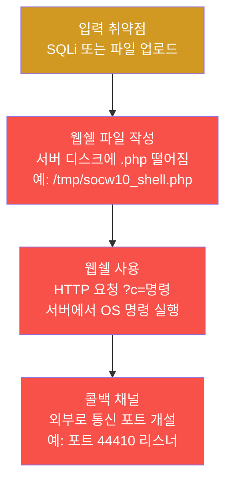
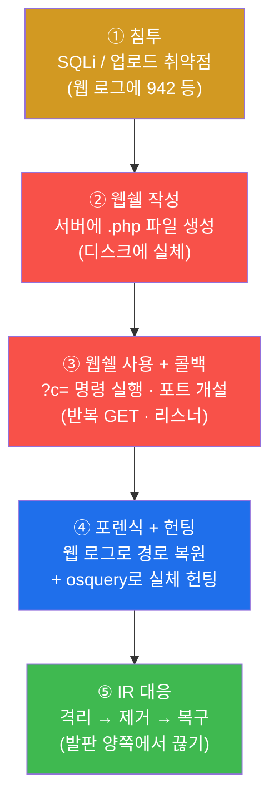
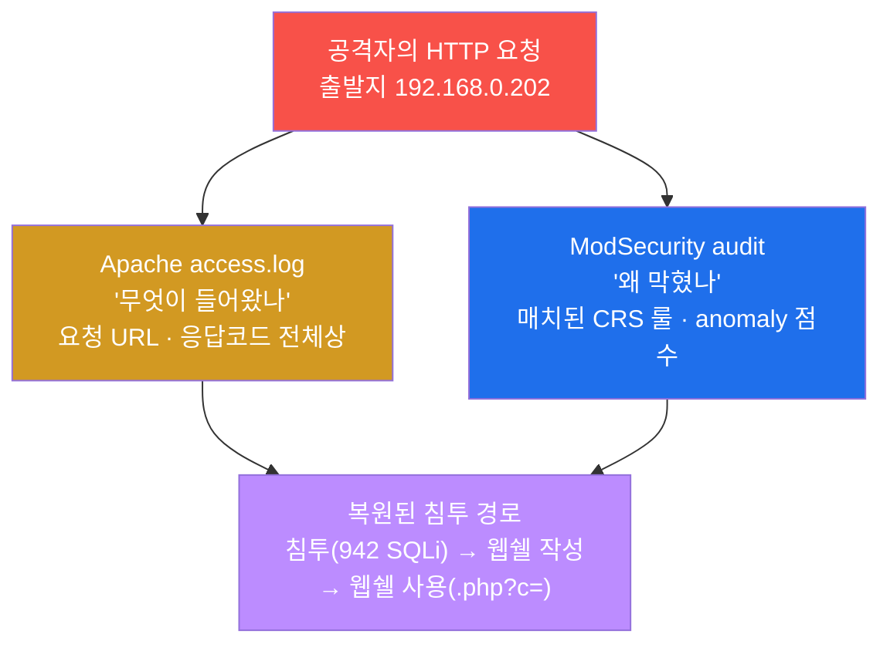
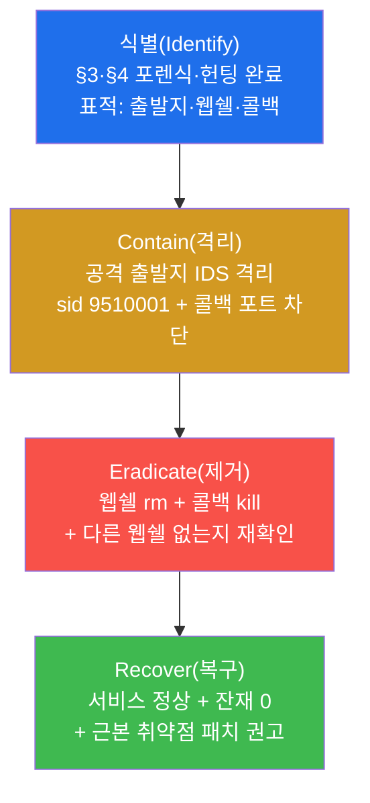
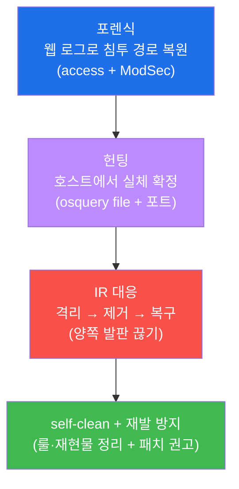
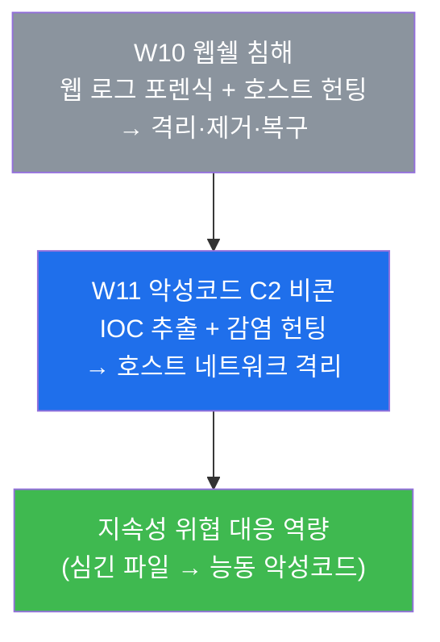

# SOC W10 — 웹쉘 침해: SQLi→웹쉘→콜백을 포렌식·헌팅해 끊어내기

> **본 주차의 한 줄 요약**
>
> 웹 침투의 가장 흔한 결말은 **웹쉘(web shell)** 이다 — 공격자가 취약점으로 웹 서버 안에
> 작은 스크립트 파일 하나를 심어두면, 그 파일을 통해 **언제든 원격으로 명령을 실행**할 수
> 있는 영구 발판이 된다. 무서운 점은, 처음 뚫은 취약점(SQLi 등)을 나중에 패치해도 **이미
> 심어진 웹쉘은 그대로 남는다**는 것이다. 본 주차의 SOC 분석가는 이 웹쉘 침해를 두 방향에서
> 끊는다. 첫째, **웹 로그**(Apache access.log + ModSecurity audit)로 "어떻게 들어와서 무엇을
> 했나"라는 침투 경로를 **포렌식(forensics)** 으로 복원한다. 둘째, 그 로그가 가리키는 실제
> 웹쉘 파일과 콜백 채널을 **호스트에서 osquery 로 헌팅(hunting)** 해 잡아낸다. 마지막으로 W09
> 에서 배운 IR 절차(격리 → 제거 → 복구)를 웹쉘이라는 구체적 위협에 적용해, 공격자의 발판을
> 양쪽에서 동시에 끊어낸다.
>
> **분석가 한 줄 결론**: 웹쉘은 **흔적(웹 로그)** 과 **실체(호스트의 파일·프로세스)** 두 얼굴을
> 가진다. 로그만 봐서는 파일을 못 지우고, 파일만 지워서는 어떻게 들어왔는지 모른다. 두
> 방향을 함께 봐야 비로소 발판을 뿌리째 끊는다.

---

## 학습 목표

본 주차 종료 시 학생은 다음 6가지를 **본인 손으로** 할 수 있어야 한다.

1. 웹쉘이 무엇이고 왜 위험한지 — 일회성 공격과 달리 **지속성(persistence)** 을 갖는 발판이라는
   점 — 을, 그리고 SQLi·파일 업로드가 어떻게 웹쉘 설치로 이어지는지를 비유 없이 설명한다.
2. Apache access.log 와 ModSecurity audit 로그를 교차로 읽어, **침투(SQLi 942) → 웹쉘 작성 →
   웹쉘 사용(`.php?c=` 명령 파라미터)** 이라는 침투 경로를 시간순으로 복원한다.
3. 웹 로그가 가리키는 웹쉘 파일을 **osquery 의 `file` 테이블**로, 콜백 채널을 **`listening_ports`
   테이블**로 호스트에서 헌팅하고, 최근 `mtime`·비표준 포트라는 단서로 정상 파일과 구분한다.
4. W09 의 IR 절차(식별 → 격리 → 제거 → 복구)를 웹쉘이라는 구체적 위협에 적용해, **Contain**
   (공격 출발지 IDS 격리 sid 9510001) → **Eradicate**(웹쉘 `rm` + 콜백 프로세스 `kill`) →
   **Recover**(서비스 정상 + 잔재 0)를 순서대로 수행한다.
5. 공유 실습 인프라에서 격리 룰과 웹쉘 재현물을 **self-clean**(시연 후 스스로 정리)하는 이유와
   방법을 설명하고, 운영 환경의 영구 차단(firewall drop)과의 차이를 구분한다.
6. 위 전 과정(포렌식 → 헌팅 → IR 대응)을 증거(로그 줄·osquery 결과)와 함께 한 장의 웹 침해 IR
   보고서로 종합하고, 재발 방지(취약점 패치·탐지 룰)까지 권고한다.

> **본 주차의 시선** — W08(중간고사)까지가 "흩어진 로그를 읽어 무슨 일이 일어났는지 **판정**"
> 하는 분석이었고, W09 가 그 판정 이후 "그래서 당장 무엇을 할 것인가"라는 **IR 절차의 일반론**
> 이었다면, W10 은 그 IR 을 **웹쉘이라는 가장 흔한 한 위협**에 끝까지 적용해보는 실전이다.
> 채점은 "웹쉘이 있었다"는 결과 선언이 아니라, **웹 로그에서 침투 경로를 복원했는가**, **호스트
> 에서 실체를 헌팅했는가**, 그리고 **발판을 양쪽에서 끊었는가**를 본다.

---

## 0. 용어 해설 (웹쉘 침해 대응 입문)

본 주차에 처음 등장하거나 핵심으로 쓰이는 용어를 먼저 정리한다. 본문에서 이 용어가 다시
나올 때 막히면 이 표로 돌아오면 흐름이 끊기지 않는다. 일부 용어는 W03(웹 로그)·W09(IR)에서
이미 만났지만, 본 주차에서 **이 의미로 쓴다**는 것을 분명히 하기 위해 다시 적는다.

| 용어 | 영문 | 뜻 | 비유 |
|------|------|----|------|
| **웹쉘** | Web shell | 웹 서버에 심긴 작은 스크립트(PHP/JSP 등)로, HTTP 요청만으로 서버 명령을 실행하게 해주는 원격 발판 | 빈집에 몰래 복제해 둔 현관 열쇠 |
| **지속성** | Persistence | 최초 침투 경로가 막혀도 공격자가 계속 접근할 수 있게 남겨두는 발판 | 담을 고쳐도 안 빠지는 숨긴 열쇠 |
| **업로드 우회** | Upload bypass | 파일 업로드 검증(확장자·타입)을 속여 실행 가능한 스크립트를 올리는 기법 | 사진인 척 위장한 도구 반입 |
| **포렌식** | Forensics | 이미 남은 증거(로그)를 거꾸로 읽어 "무슨 일이 일어났나"를 복원하는 사후 분석 | CCTV를 되감아 침입 순서 재현 |
| **헌팅** | Threat hunting | 로그가 가리키는 위협의 실체(파일·프로세스·연결)를 호스트에서 직접 찾아내는 능동 탐색 | 단서를 들고 집 안을 수색 |
| **콜백** | Callback / C2 channel | 웹쉘·악성코드가 외부(공격자)와 주고받는 통신 채널 | 침입자가 밖과 연락하는 무전기 |
| **osquery** | osquery | 운영체제의 상태(파일·프로세스·포트 등)를 **SQL 질의**로 조회하는 호스트 가시화 도구 | 집 안을 SQL로 검색하는 수색 도구 |
| **mtime** | modification time | 파일이 마지막으로 수정된 시각. 최근일수록 방금 심긴 의심 파일 | 물건에 묻은 지문의 최신 시각 |
| **리스너 / listening port** | listening port | 외부 연결을 받으려고 열려서 대기 중인 네트워크 포트 | 누가 두드리길 기다리는 뒷문 |
| **IR** | Incident Response | 사고 대응 — 식별·격리·제거·복구·교훈의 정해진 절차(W09) | 화재 발생 시의 표준 대응 매뉴얼 |
| **Contain / Eradicate / Recover** | — | 격리(확산 차단) → 제거(위협 뿌리 뽑기) → 복구(정상화·검증) | 불길 차단 → 불씨 제거 → 안전 확인 |
| **self-clean** | self-clean | 공유 실습 환경을 보존하려 시연 후 만든 룰·파일을 스스로 되돌리는 원칙 | 실습실을 쓴 그대로 원상복구 |
| **ModSec audit** | ModSecurity audit log | WAF 가 **왜 막았는가**(매치된 룰·anomaly 점수)를 기록하는 로그 | 검문에서 무엇이 걸렸는지 적은 조서 |
| **anomaly score** | OWASP CRS anomaly score | CRS 가 룰 위반마다 누적하는 점수. 임계(기본 5) 초과 시 949110 룰이 차단(403) | 위반 벌점 누적, 한도 넘으면 퇴장 |

> **헷갈리기 쉬운 한 쌍 — 포렌식 vs 헌팅.** 둘 다 위협을 추적하지만 방향이 반대다. **포렌식**은
> **로그(흔적)에서 출발**해 "어떻게 들어왔나"를 거꾸로 복원하는 **사후·수동** 작업이다 — 이미
> 남은 access.log·audit 를 되감아 침투 순서를 재현한다. **헌팅**은 **호스트(실체)에서 출발**해
> "지금 무엇이 심겨 있나"를 직접 찾는 **능동** 작업이다 — osquery 로 파일·포트를 뒤져 실제
> 웹쉘을 잡는다. 본 주차에서 포렌식(미션 3)은 **웹 로그**가 무대이고, 헌팅(미션 4)은 **호스트
> osquery** 가 무대다. 둘은 짝이다 — 포렌식이 "어디를 보라"를 알려주면, 헌팅이 "거기서 실체를
> 잡는다".

> **헷갈리기 쉬운 또 한 쌍 — 웹쉘 vs 백도어 계정.** 둘 다 지속성을 위한 발판이지만 형태가
> 다르다. **웹쉘**은 웹 서버 안의 **파일**이라, **HTTP 요청**(브라우저·curl)만으로 명령을
> 실행한다 — SSH 자격증명이 필요 없다. **백도어 계정**(W09 의 `socw9bd` 같은)은 **OS 계정**이라
> SSH 로그인으로 들어온다. 그래서 웹쉘의 흔적은 **웹 로그**에, 백도어 계정의 흔적은 **auth.log**
> 에 남는다. 본 주차는 웹쉘 — 즉 **웹 로그 + 호스트 파일** 조합 — 에 집중한다.

---

## 1. 웹쉘이란 무엇이고 왜 끈질긴 발판인가

### 1.1 한 줄 답: 파일 하나로 서버에서 언제든 명령을 실행하는 원격 발판

**웹쉘(web shell)** 은 웹 서버에 심긴 **작은 스크립트 파일**이다. 정상적인 웹 서버는 PHP·JSP
같은 스크립트를 실행해 페이지를 만들어 보여준다. 공격자는 이 "스크립트를 실행해준다"는 정상
기능을 악용한다 — 서버가 실행하는 디렉터리에 **"요청 파라미터로 받은 문자열을 OS 명령으로
실행하라"** 는 한 줄짜리 스크립트를 올려두는 것이다. 본 실습에서 다루는 웹쉘은 PHP 한 줄이다.

```php
<?php system($_GET[c]); ?>
```

이 파일이 서버의 `/tmp/socw10_shell.php` 에 올라가 있으면, 공격자는 브라우저나 `curl` 로 다음과
같이 요청하기만 하면 된다.

```
http://피해서버/socw10_shell.php?c=id
```

그러면 서버는 `$_GET[c]` 로 들어온 `id` 라는 문자열을 `system()` 함수로 OS 에 그대로 넘겨
실행하고, 그 결과(예: `uid=33(www-data) ...`)를 HTTP 응답으로 돌려준다. 즉 **공격자는 SSH
계정도, 별도 접속 프로그램도 없이, 평범한 웹 요청 한 번으로 서버에서 임의 명령을 실행**한다.
`?c=id` 는 사용자 확인, `?c=cat /etc/passwd` 는 계정 목록 탈취, `?c=...` 로 무엇이든 가능하다.

### 1.2 왜 위험한가 — 한 번 심으면 취약점을 고쳐도 남는다(지속성)

일반적인 웹 공격(예: 일회성 SQLi 로 데이터 한 번 빼가기)은 그 취약점을 패치하면 끝난다. 그러나
웹쉘은 다르다. 공격자가 SQLi 나 업로드 취약점으로 **딱 한 번** 웹쉘 파일을 심어두기만 하면, 그
**이후로는 최초 취약점이 무엇이었는지와 무관하게** 웹쉘 파일을 통해 계속 들어온다. 운영팀이
나중에 SQLi 를 패치해도, **이미 디스크에 떨어진 웹쉘 파일은 그 자리에 그대로 남아** 계속
열린다. 이것이 **지속성(persistence)** — 최초 침투 경로가 막혀도 유지되는 발판 — 이며, 웹쉘이
SOC 가 반드시 끝까지 추적해 제거해야 하는 위협인 이유다.

> **용어 — 지속성(persistence).** 공격자가 한 번의 침투 후에도 시스템에 계속 접근하기 위해
> 남겨두는 모든 수단을 말한다(MITRE ATT&CK 의 TA0003 전술). 웹쉘 파일, 백도어 계정, 악성 cron
> 작업, SSH 인증키 추가 등이 대표적이다. SOC 의 제거(Eradicate) 단계가 노리는 1차 표적이 바로
> 이 지속성 발판들이다 — 하나라도 남으면 재침투한다.

### 1.3 웹쉘은 어떻게 심기는가 — SQLi·업로드 우회

공격자가 웹쉘 파일을 서버에 올리는 길은 크게 둘이다.

첫째는 **SQL Injection 을 통한 파일 작성**이다. 데이터베이스에는 질의 결과를 서버의 파일로
내보내는 기능(예: MySQL 의 `INTO OUTFILE`)이 있다. SQLi 취약점이 있는 입력란에 `UNION SELECT
"<?php ... ?>" INTO OUTFILE '/var/www/.../shell.php'` 같은 구문을 주입하면, DB 가 그 PHP
문자열을 웹 디렉터리에 파일로 떨군다. 본 실습의 재현(미션 2)이 이 패턴을 모사한다 — sqlmap
도구의 흔적(User-Agent)을 단 SQLi 요청으로 침투를 만들고, 그 직후 웹쉘 파일을 배치한다.

둘째는 **파일 업로드 우회(upload bypass)** 다. 게시판 첨부·프로필 사진 같은 업로드 기능이
확장자나 파일 타입 검증을 허술하게 하면, 공격자는 `shell.php` 를 `shell.jpg` 로 위장하거나
이중 확장자(`shell.php.jpg`)·MIME 위조로 검증을 속여 실행 가능한 스크립트를 올린다.



핵심은 — 어느 경로로 들어왔든 결과는 같다는 것이다. **서버 디스크에 실행 가능한 스크립트
파일이 하나 생긴다.** SOC 의 헌팅이 노리는 표적이 바로 이 파일이다.

### 1.4 한계 — 본 주차가 다루지 않는 것

본 주차는 웹쉘 **탐지·분석·대응**에 집중한다. 따라서 다음은 범위 밖이다. 첫째, 웹쉘을 심는
**공격 기법 자체의 심화**(다양한 SQLi 우회 구문, 난독화된 웹쉘 작성)는 attack/web-vuln 트랙의
영역이다 — 본 주차는 SOC 분석가 관점에서 **이미 심긴 웹쉘을 어떻게 잡아 끊느냐**를 본다. 둘째,
주기적 외부 통신으로 명령을 받는 **악성코드 C2 비콘**은 W11 의 주제다 — 본 주차의 "콜백"은
웹쉘이 여는 단순 리스너 수준이고, 정교한 비콘 IOC 추출은 다음 주에 다룬다.

---

## 2. 웹쉘 생애주기 5단계 — 침투에서 대응까지

웹쉘 침해를 다루는 SOC 분석가는 다음 5단계의 흐름을 머릿속에 그린다. 본 주차의 lab 미션들도 이
순서를 그대로 따른다 — 앞 세 단계(①~③)는 공격자가 만든 흔적이고, 뒤 두 단계(④~⑤)는 분석가가
그것을 끊는 작업이다.



### 2.1 ① 침투 — 취약점으로 들어온다

**한 줄 정의.** 침투는 SQLi·업로드 같은 웹 취약점으로 공격자가 서버에 발을 들이는 첫 단계다.

이 단계의 흔적은 **웹 로그**에 남는다. SQLi 라면 ModSecurity 가 CRS 룰 **942**(SQL Injection
탐지)로 점수를 올리고, 누적이 임계를 넘으면 **949110**(anomaly 차단)이 403 으로 막는다(W03
복습). 본 실습은 sqlmap 도구의 User-Agent(`sqlmap/1.7`)를 단 요청으로 이 침투를 재현한다 —
sqlmap UA 자체도 스캐너 시그니처로 탐지되는 단서다.

### 2.2 ② 웹쉘 작성 — 디스크에 파일이 생긴다

**한 줄 정의.** 웹쉘 작성은 침투에 성공한 공격자가 서버 디스크에 실행 가능한 스크립트 파일을
떨어뜨리는 단계다.

이 단계가 남기는 것은 로그가 아니라 **파일 그 자체** — 본 실습에서는 `/tmp/socw10_shell.php`
다. 그래서 이 단계는 로그 포렌식만으로는 완결되지 않고, 반드시 **호스트에서 파일을 헌팅**해야
실체를 잡는다. 파일의 **mtime(최종 수정 시각)** 이 방금 전이라면 막 심긴 의심 파일이다.

### 2.3 ③ 웹쉘 사용 + 콜백 — 명령을 실행하고 외부와 통신한다

**한 줄 정의.** 사용 단계는 공격자가 심어둔 웹쉘에 명령 파라미터를 붙여 반복 호출하고, 필요하면
외부 통신용 포트를 여는 단계다.

웹쉘 사용의 흔적은 **access.log 의 특징적 패턴** — **스크립트 파일(`.php`)에 대한 반복 GET +
명령 파라미터(`?c=`, `?cmd=`, `?exec=`)** 다. 정상 사용자는 `.php` 페이지를 그렇게 명령
파라미터를 바꿔가며 두드리지 않는다. 콜백(callback)은 웹쉘이 외부와 데이터를 주고받으려 여는
채널로, 본 실습에서는 **비표준 포트 44410 의 리스너**로 재현한다 — `listening_ports` 헌팅의
표적이다.

### 2.4 ④ 포렌식 + 헌팅 — 흔적과 실체를 함께 잡는다

**한 줄 정의.** 이 단계는 분석가가 웹 로그로 침투 경로를 복원(포렌식)하고, 그 로그가 가리키는
웹쉘 파일과 콜백을 호스트에서 찾아내는(헌팅) 분석의 핵심이다.

포렌식과 헌팅은 짝이다(§0 의 헷갈리기 쉬운 한 쌍 참고). 포렌식이 "공격자가 `/tmp` 에 `.php`
를 만든 것 같다"를 알려주면, 헌팅이 osquery 로 `/tmp/socw10_shell.php` 의 존재·mtime·포트를
확정한다. 한쪽만으로는 — 로그만 보면 파일을 못 지우고, 파일만 봐서는 어떻게 들어왔는지 모른다.

### 2.5 ⑤ IR 대응 — 발판을 양쪽에서 끊는다

**한 줄 정의.** 대응은 W09 의 IR 절차를 웹쉘에 적용해, 공격 출발지를 격리하고(Contain) 웹쉘과
콜백을 제거하고(Eradicate) 서비스 정상·잔재 0 을 검증하는(Recover) 마지막 단계다.

이때 **웹쉘 파일을 지우는 것만으로는 부족**하다. 공격자가 다시 SQLi 로 새 웹쉘을 심으면 그만이기
때문이다. 그래서 대응은 ② 공격 출발지 격리(재침투 차단)와 ③ 웹쉘·콜백 제거(현 발판 제거)를
함께 하고, 마지막으로 **근본 취약점(SQLi) 패치 권고**까지 가야 비로소 발판이 뿌리째 끊긴다.

---

## 3. 웹 로그 포렌식 — 침투 경로를 복원하기

포렌식의 무대는 web 컨테이너의 두 로그다. 두 로그는 같은 요청을 **서로 다른 관점**으로
기록하므로, 함께 봐야 침투 경로가 복원된다(W03 에서 깊게 다룬 내용을 웹쉘에 적용한다).



### 3.1 ModSecurity audit — "왜 막혔나"(WAF 의 판단)

ModSecurity audit 로그(`/var/log/apache2/modsec_audit.log`)는 WAF 가 각 요청을 **왜** 막거나
통과시켰는지를 기록한다 — 매치된 CRS 룰 ID 와 anomaly 점수다. 웹쉘 침투의 첫 단서인 SQLi 는
여기서 **942**(SQL Injection 탐지)로 잡힌다.

```bash
ssh ccc@10.20.32.80 'sudo tail -80 /var/log/apache2/modsec_audit.log | grep -oE "9[0-9]{5}" | sort | uniq -c'
```

무엇을 보나 — 매치된 6자리 CRS 룰 ID 의 분포다. **942**(SQLi) 가 점수를 올리고 **949110**
(Inbound Anomaly Score Exceeded) 이 누적 임계 초과로 403 차단을 결정하는 2단계 구조가 보인다.
즉 "942 가 직접 막았다"가 아니라 "942 가 점수를 올리고 949110 이 누적으로 막았다"가 정확한
독법이다(W03 복습).

> **용어 — anomaly score(누적 점수 차단).** OWASP CRS 는 룰 위반마다 점수를 더하고, 그 합이
> 임계값(기본 5)을 넘으면 949110 룰이 발동해 차단(403)한다. 그래서 ModSec audit 을 읽을 때는
> 개별 룰(942)과 차단 룰(949110)을 함께 봐야 "탐지 → 누적 → 차단"의 전 과정이 보인다.

### 3.2 Apache access.log — "무엇이 들어왔나"(요청 전체상)

access.log(`/var/log/apache2/dvwa_access.log` — dvwa vhost 전용)는 판단 없이 **모든 요청·응답을
한 줄씩** 기록한다. 포렌식에서 이 로그의 역할은 둘이다. 첫째, ModSec 이 잡은 SQLi 요청이 실제로
어떤 URL 로 어떤 응답코드(403 차단)를 받았는지 **전체 모습**을 확인한다.

```bash
ssh ccc@10.20.32.80 'sudo tail -20 /var/log/apache2/dvwa_access.log'
```

둘째 — 그리고 이것이 웹쉘 포렌식의 **핵심 단서** — **웹쉘 사용 패턴**을 찾는다. 웹쉘은 스크립트
파일에 명령 파라미터를 붙여 반복 호출되므로, `.php?c=`·`.php?cmd=` 같은 패턴이 access.log 에
남는다.

```bash
ssh ccc@10.20.32.80 'sudo grep -aE "\.php\?(c|cmd|exec)=" /var/log/apache2/dvwa_access.log | tail'
```

무엇을 보나 — 스크립트 파일에 명령 파라미터가 붙은 요청들이다. 정상 사용자는 `.php` 페이지를
`?c=id`, `?c=whoami` 처럼 명령을 바꿔가며 두드리지 않는다. **"스크립트 파일 + 명령 파라미터"**
조합이 바로 웹쉘이 사용되고 있다는 결정적 신호다.

### 3.3 두 로그를 합치면 침투 경로가 복원된다

ModSec audit 의 "942 → 949110 차단"(어떻게 들어오려 했나)과 access.log 의 "`.php?c=` 반복
GET"(들어온 뒤 무엇을 했나)을 시간순으로 겹치면, **침투(SQLi) → 웹쉘 작성 → 웹쉘 사용**이라는
침투 경로 전체가 복원된다. 이 복원이 다음 단계 — 호스트에서 실제 파일을 헌팅 — 의 출발점이다.

---

## 4. osquery 헌팅 — 호스트에서 실체를 잡기

포렌식이 "공격자가 `/tmp` 에 `.php` 를 심은 것 같다"를 알려줬다면, 이제 **호스트에서 그 실체를
확정**한다. 무대는 web 컨테이너에 설치된 **osquery** 다.

### 4.1 osquery란 — OS 를 SQL 로 조회하는 호스트 가시화 도구

**osquery** 는 운영체제의 상태 — 실행 중인 프로세스, 디스크의 파일, 열린 네트워크 포트, 사용자
계정 등 — 를 마치 **데이터베이스 테이블처럼** 추상화해, `SELECT ... FROM ...` 이라는 익숙한 SQL
질의로 조회하게 해주는 호스트 가시화 도구다(W06/W07 에서 개념을 다뤘다). 네트워크 로그로는 안
보이는 "호스트 안에서 무슨 파일·프로세스가 있나"를 정밀하게 들여다보는 마지막 안전망이다. 본
실습은 대화형 쉘 `osqueryi` 에 JSON 출력(`--json`)을 붙여 한 줄로 질의한다.

> **용어 — osquery 테이블.** osquery 는 OS 의 각 영역을 테이블로 노출한다. 본 주차가 쓰는
> 두 테이블은 **`file`**(파일의 path·size·mtime 등)과 **`listening_ports`**(열려서 대기 중인
> 포트의 pid·port)다. 앞 것으로 웹쉘 **파일**을, 뒤 것으로 콜백 **채널**을 잡는다.

### 4.2 `file` 테이블 — 웹쉘 파일 헌팅

웹 로그가 가리킨 웹쉘 파일이 실제로 디스크에 있는지, 언제 심겼는지를 `file` 테이블로 확인한다.

```bash
ssh ccc@10.20.32.80 sudo osqueryi --json 'SELECT path,size,mtime FROM file WHERE path="/tmp/socw10_shell.php";'
```

무엇을 보나 — 해당 경로에 파일이 존재하면 그 `path`·`size`·`mtime` 이 한 행으로 나온다.
**`mtime`(최종 수정 시각)이 방금 전**이면 막 심긴 의심 파일이다. 실전에서는 경로를 모르므로
`WHERE path LIKE "/tmp/%shell%"` 처럼 패턴으로 넓게 훑어 후보를 모은 뒤, mtime·위치로 정상 웹
파일과 구분한다. 정상 웹 콘텐츠는 배포 시각에 mtime 이 몰려 있고 웹 루트에 있는 반면, 웹쉘은
방금 전 mtime 에 `/tmp` 같은 비정상 위치에 떨어진다.

### 4.3 `listening_ports` 테이블 — 콜백 채널 헌팅

웹쉘이 외부와 통신하려 연 콜백 포트를 `listening_ports` 테이블로 잡는다.

```bash
ssh ccc@10.20.32.80 sudo osqueryi --json 'SELECT pid,port FROM listening_ports WHERE port=44410;'
```

무엇을 보나 — 해당 포트가 열려 대기 중이면 그 포트를 연 프로세스의 `pid` 와 `port` 가 나온다.
**비표준 고포트(여기서는 44410)에 정체불명의 리스너**가 떠 있다는 것은 콜백 채널이 열려 있다는
신호다. 실전에서는 `WHERE port>40000` 처럼 고포트 대역을 넓게 훑어 정상 서비스(80/443 등)가
아닌 의심 리스너를 골라낸다. 이 `pid` 가 나중에 제거(Eradicate) 단계에서 종료할 콜백 프로세스다.

### 4.4 포렌식과 헌팅이 만나는 지점

이제 두 방향이 만난다 — 포렌식이 알려준 "`.php?c=` 가 쓰였다"가, 헌팅이 잡은 "`/tmp/socw10_shell.php`
가 실재하고 44410 리스너가 떠 있다"로 **실체가 확정**된다. 흔적과 실체가 한 사건으로 묶이면,
이제 끊어낼 표적이 분명해진다 — 그 파일과 그 포트와 그 출발지다.

---

## 5. IR 적용 — Contain → Eradicate → Recover

표적이 확정됐으니, W09 에서 배운 IR 절차를 웹쉘에 적용해 발판을 끊는다. W09 가 IR 의 일반론
(식별 → 격리 → 제거 → 복구 → 교훈)이었다면, 여기서는 그것을 웹쉘이라는 구체적 위협에 끝까지
적용한다. 본 주차의 식별(Identify)은 이미 §3·§4 의 포렌식·헌팅으로 끝냈으므로, 격리부터 시작한다.



### 5.1 Contain — 공격 출발지를 격리한다

**한 줄 정의.** Contain 은 위협이 더 퍼지기 전에 공격 출발지를 차단해 확산을 막는 단계다 —
"차단 우선, 분석 나중"(W09).

웹쉘 침해의 격리는 두 갈래다. 첫째, **공격 출발지(`192.168.0.202`)를 IDS 로 플래그**해 그 출처의
추가 행위를 즉시 알아챈다. 본 실습은 Suricata 의 사용자 룰 파일(`local.rules`)에 출발지 격리
룰(sid **9510001**)을 추가하고 reload 한 뒤, 그 출처의 요청이 룰을 트리거하는지 확인한다.

```
alert ip 192.168.0.202 any -> any any (msg:"SOC W10 contain webshell attacker"; sid:9510001; rev:1;)
```

둘째, **웹쉘 콜백 포트를 차단**해 외부 통신을 끊는다. 운영 환경이라면 이 두 격리를 방화벽
**drop** 룰로 영구 적용하지만, 본 실습의 공유 인프라에서는 다른 학생의 트래픽까지 끊지 않도록
**alert(탐지 플래그) 룰로 격리를 시연**하고 직후 **self-clean** 으로 룰을 되돌린다.

> **왜 drop 이 아니라 alert + self-clean 인가.** el34 는 여러 학생이 공유하는 단일 인프라다.
> 만약 `drop` 룰을 영구로 걸면 그 출발지(공유 외부 공격자 VM 192.168.0.202)를 쓰는 **다른 학생의 실습까지
> 차단**된다. 그래서 본 주차는 격리의 **메커니즘과 효과를 alert 로 시연**하고(룰이 트리거되는지
> 확인), 시연이 끝나면 추가한 룰을 **스스로 삭제**(self-clean)해 인프라를 원상복구한다. 운영
> 환경의 영구 firewall drop 과 달리, 공유 학습 환경에 맞춘 안전한 절차다.

### 5.2 Eradicate — 웹쉘과 콜백을 제거한다

**한 줄 정의.** Eradicate 는 격리 후 위협의 실체(지속성 발판)를 완전히 제거하는 단계다.

웹쉘의 제거는 두 가지를 함께 한다 — **웹쉘 파일 삭제(`rm`)** 와 **콜백 프로세스 종료(`kill`/
`pkill`)**. 파일만 지우고 프로세스를 두면 콜백이 계속 살아 있고, 프로세스만 죽이고 파일을 두면
다음에 다시 실행된다.

```bash
ssh ccc@10.20.32.80 'rm -f /tmp/socw10_shell.php; pkill -f "http.server 44410"; echo eradicated'
```

그리고 가장 중요한 마무리 — **다른 웹쉘이 더 없는지 osquery 로 재확인**한다. 공격자는 보통
웹쉘을 한 개만 심지 않는다. 하나라도 놓치면 그 발판으로 재침투하므로, 제거 후 같은 `file`
질의로 빈 결과(파일 없음)를 확인해야 비로소 제거가 완결된다.

```bash
ssh ccc@10.20.32.80 sudo osqueryi --json 'SELECT path FROM file WHERE path="/tmp/socw10_shell.php";'
```

빈 결과(행 0개)가 나오면 그 웹쉘은 사라진 것이다. 실전에서는 `LIKE` 패턴으로 다시 한 번 넓게
훑어 잔존 웹쉘이 없음을 확인한다.

### 5.3 Recover — 정상성과 잔재 0 을 검증한다

**한 줄 정의.** Recover 는 위협 제거 후 서비스가 정상으로 돌아왔고 위협의 잔재가 0 임을
객관적으로 검증하는 단계다.

```bash
ssh ccc@10.20.32.80 "echo \"web=$(echo -en 'GET / HTTP/1.0\r\nHost: dvwa.el34.lab\r\nConnection: close\r\n\r\n' | nc -w3 localhost 80 | head -1 | grep -oE '[0-9]{3}')\""
ssh ccc@10.20.32.80 'ls /tmp/socw10_shell.php >/dev/null 2>&1 && echo "잔재!" || echo clean; pgrep -f "http.server 44410" && echo "리스너 잔재!" || echo "listener clean"'
```

무엇을 보나 — 두 가지다. 첫째, 웹 서비스가 정상 응답코드(`web=200` 등)를 돌려주는지(제거
과정에서 서비스를 망가뜨리지 않았는지). 둘째, 웹쉘 파일과 콜백 리스너가 **둘 다 사라졌는지**
(`clean` + `listener clean`). 서비스 정상 + 잔재 0 의 두 조건이 모두 충족돼야 복구가 완료된다.

그러나 복구가 곧 끝은 아니다. **근본 취약점(SQLi)을 패치하지 않으면 공격자는 같은 길로 다시
웹쉘을 심는다.** 그래서 Recover 의 마지막은 항상 **재발 방지 권고** — SQLi 패치, 업로드 검증
강화, 웹 디렉터리의 실행 권한 제거, 웹쉘 탐지 룰 추가 — 다. 끊어낸 발판이 다시 생기지 않게
하는 것까지가 SOC 의 책임이다.

---

## 6. 실습 안내 — lab 8 미션 (4 축 설명)

본 주차 실습은 8 미션으로 구성된다. 각 미션을 **4 축**으로 설명한다 — 왜 하는가 / 무엇을 알 수
있는가 / 결과 해석(정상 vs 비정상) / 실전 활용. 미션은 웹쉘 생애주기를 따라 점검 → 침해 재현 →
포렌식 → 헌팅 → 격리 → 제거 → 복구 → 보고 순서로 흐른다.

> **실습 진행 원칙.** 모든 명령은 el34 호스트(`ssh ccc@192.168.0.80`, 비밀번호 1)에서 실행하고,
> 각 장비 작업은 `ssh ccc@<장비IP>`(web 32.80/ips 31.2/siem 32.100)로 한다. 포렌식·헌팅·제거는 `el34-web`, 격리는
> `el34-ips`, 공격 재현은 `외부 공격자 VM 192.168.0.202` 가 무대다. 본 주차는 공유 인프라를 쓰므로, 격리 룰과
> 웹쉘 재현물은 반드시 **self-clean** 한다. 합격 임계값은 0.7 이다.

### 미션 1 — 점검: 웹 로그 + osquery 가 준비됐나 (8점)

> **왜 하는가?** 웹쉘 대응의 두 무기는 웹 로그(포렌식)와 osquery(헌팅)다. 분석에 들어가기 전,
> 이 둘이 모두 가용한지부터 확인한다 — 도구가 없으면 그 단면은 못 본다.
>
> **무엇을 알 수 있는가?** web 컨테이너에 dvwa access.log·ModSec audit 로그가 존재하고,
> osquery(5.x)가 설치돼 동작하는지. 포렌식과 헌팅의 무대가 둘 다 살아 있는지.
>
> **결과 해석.** 정상: 두 로그 파일이 보이고 `osqueryi --version` 이 버전(예: 5.23)을 출력.
> 비정상: 로그가 없으면 포렌식 불가, osquery 가 없으면 헌팅 불가 — 먼저 원인을 파악한다.
>
> **실전 활용.** 침해 조사 착수 전 첫 점검. 어떤 도구가 비어 있으면 그 분석 축을 시작부터
> 정확히 잡을 수 있다.

### 미션 2 — 웹쉘 침해 재현: SQLi + 웹쉘 + 콜백 (10점)

> **왜 하는가?** 분석 대상이 될 웹쉘 침해를 직접 재현해, 이후 포렌식·헌팅이 읽어낼 흔적과
> 실체(로그·파일·리스너)를 만든다. 통제된 환경에서 침해를 재현하는 것은 탐지·대응 역량을
> 검증하는 표준 절차다.
>
> **무엇을 알 수 있는가?** 웹쉘 침해의 세 구성요소 — SQLi 침투(sqlmap UA 요청) + 웹쉘 파일
> (`/tmp/socw10_shell.php`) + 콜백 리스너(포트 44410) — 가 각각 웹 로그·디스크·네트워크에
> 흔적을 남긴다는 것. 한 번의 재현이 이후 모든 분석 미션의 원천 데이터다.
>
> **결과 해석.** 정상: 세 요소가 만들어지고 `webshell incident done` 이 출력됨. 비정상: 한
> 요소라도 빠지면 이후 해당 분석에서 흔적이 안 보인다 — 재현부터 다시 한다.
>
> **실전 활용.** 신규 탐지 룰·대응 절차를 검증할 때, 알려진 웹쉘 침해를 안전하게 재현해 "우리
> 가 이 침해를 끝까지 끊을 수 있는가"를 점검하는 표준 절차.

### 미션 3 — 웹 로그 포렌식: 침투 경로 복원 (12점)

> **왜 하는가?** 호스트를 뒤지기 전에, 웹 로그로 "어떻게 들어와서 무엇을 했나"를 먼저 복원해
> 헌팅의 표적(어떤 파일·어떤 동작)을 좁힌다.
>
> **무엇을 알 수 있는가?** ModSec audit 에서 **942(SQLi)가 점수를 올리고 949110 이 누적으로
> 403 차단**하는 2단계 메커니즘과, access.log 에서 같은 요청의 전체 모습 및 웹쉘 사용 패턴
> (`.php?c=`)을 식별하는 법.
>
> **결과 해석.** 정상: ModSec 분포에 `942` 가 보이고 access 로그에 SQLi 요청과 웹쉘 접근 패턴이
> 보임. 비정상: 942 가 없으면 미션 2 의 SQLi 재현을, 흔적이 전혀 없으면 dvwa vhost 가 차단
> 모드인지 점검.
>
> **실전 활용.** 웹 침해 조사의 1차 작업 — "어떻게 들어왔고(audit) 뭘 했나(access)"를 웹 로그
> 두 종으로 복원하는 표준 포렌식.

### 미션 4 — 웹쉘 헌팅: osquery file + 콜백 리스너 (14점)

> **왜 하는가?** 포렌식이 가리킨 웹쉘의 **실체**를 호스트에서 확정한다 — 로그만으로는 파일을
> 지울 수 없기 때문이다.
>
> **무엇을 알 수 있는가?** osquery `file` 테이블로 웹쉘 파일의 존재·`mtime`(최근 수정=의심)을,
> `listening_ports` 테이블로 콜백 채널(비표준 포트 44410)을 헌팅하는 법.
>
> **결과 해석.** 정상: `file` 질의에 `socw10_shell.php` 가 한 행으로 나오고 44410 리스너가
> 잡힘. 비정상: 파일이 안 보이면 미션 2 의 웹쉘 배치를, 리스너가 없으면 콜백 재현을 점검.
>
> **실전 활용.** 침해 헌팅의 핵심 — 로그가 지목한 발판을 osquery 로 정밀 확정해 제거 표적을
> 확정하는 작업.

### 미션 5 — Contain: 공격 출발지 격리 (sid 9510001) (12점)

> **왜 하는가?** 제거에 앞서 공격 출발지를 격리해, 분석·제거 도중 추가 침투가 확산되는 것을
> 막는다 — "차단 우선, 분석 나중"(W09).
>
> **무엇을 알 수 있는가?** Suricata `local.rules` 에 출발지 격리 룰(sid **9510001**)을 추가 →
> reload → 그 출처의 요청으로 트리거 확인 → **self-clean(룰 삭제)** 하는 격리의 전 과정. 공유
> 인프라에서 왜 drop 이 아니라 alert + 정리인지.
>
> **결과 해석.** 정상: 9510001 룰이 출발지 요청에 트리거되고, 직후 `rule_removed` 로 정리됨.
> 비정상: 룰이 트리거 안 되면 reload·출발지 IP 를, 정리가 안 되면 self-clean 명령을 점검.
>
> **실전 활용.** 사고 대응의 첫 행동 — 공격 출발지를 즉시 플래그·차단해 확산을 막는 격리. 공유
> 환경에서는 alert + self-clean, 운영에서는 firewall drop.

### 미션 6 — Eradicate: 웹쉘 제거 + 콜백 종료 (12점)

> **왜 하는가?** 격리로 확산을 막은 뒤, 지속성 발판(웹쉘 파일·콜백 프로세스)을 완전히 제거해
> 재침투의 뿌리를 뽑는다.
>
> **무엇을 알 수 있는가?** 웹쉘 파일 삭제(`rm`)와 콜백 프로세스 종료(`pkill`)를 함께 해야 하는
> 이유, 그리고 제거 후 osquery 로 **다른 웹쉘이 없는지 재확인**하는 절차.
>
> **결과 해석.** 정상: `eradicated` 출력 후, 재확인 `file` 질의가 빈 결과(파일 없음). 비정상:
> 파일이 여전히 보이면 `rm` 경로를, 리스너가 남으면 `pkill` 패턴을 점검.
>
> **실전 활용.** 지속성 제거의 표준 — 파일·프로세스를 함께 제거하고, 빠진 발판이 없는지 헌팅으로
> 재확인. 하나라도 남으면 재침투한다.

### 미션 7 — Recover: 정상성 + 잔재 0 (12점)

> **왜 하는가?** 제거가 끝났다고 선언하기 전에, 서비스가 정상으로 돌아왔고 위협의 잔재가 0
> 임을 객관적 증거로 검증한다.
>
> **무엇을 알 수 있는가?** 웹 서비스 헬스체크(응답코드)와 웹쉘 파일·콜백 리스너의 잔재 0 을
> 동시에 확인하는 법. 그리고 복구의 마지막은 근본 취약점(SQLi) 패치 권고라는 것.
>
> **결과 해석.** 정상: 웹 응답코드 정상 + `clean` + `listener clean`. 비정상: 응답코드가
> 비정상이면 제거가 서비스를 건드렸는지, `잔재!` 가 나오면 미션 6 의 제거를 재점검.
>
> **실전 활용.** 복구 완료의 객관적 판정 — "서비스 정상 + 잔재 0" 두 조건을 증거로 확인해야
> 사고를 종결할 수 있다.

### 미션 8 — 웹 침해 IR 보고서 (10점)

> **왜 하는가?** 미션 1–7 을 한 사건의 대응 기록으로 묶어, 웹쉘 침해를 끝까지 끊어낸 과정을
> 문서로 입증한다 — 본 주차의 최종 산출물.
>
> **무엇을 알 수 있는가?** 포렌식(침투 경로) → 헌팅(웹쉘·콜백 실체) → 대응(격리·제거·복구) →
> 재발 방지(패치·탐지)를 한 보고서로 종합하는 법. "웹쉘은 웹 로그(포렌식)와 호스트(헌팅) 양쪽
> 으로 끊는다"는 결론을 증거와 함께 쓰는 것.
>
> **결과 해석.** 정상: 보고서에 포렌식 + 헌팅 + 대응 + 재발 방지가 모두 포함됨. 비정상: 한 축
> 이라도 빠지면 해당 미션으로 돌아가 보강.
>
> **실전 활용.** 사고 종결 후 제출하는 IR 보고서의 표준 구조(침투 경로 → 발판 헌팅 → 대응
> 타임라인 → 재발 방지 권고).

---

## 7. 본 주차 핵심 수칙 — 양쪽에서 끊고, 깨끗이 되돌린다

본 주차는 웹쉘이라는 구체적 위협을 끝까지 끊는 실전이다. 다음 수칙을 지킨다.

- **양쪽에서 끊는다.** 웹쉘은 흔적(웹 로그)과 실체(호스트의 파일·프로세스) 두 얼굴을 가진다.
  포렌식만으로는 파일을 못 지우고, 헌팅만으로는 어떻게 들어왔는지 모른다 — 반드시 둘을 함께
  본다.
- **증거 우선.** "웹쉘이 있었다"가 아니라 **로그 줄(942/`.php?c=`)과 osquery 결과(파일 mtime·
  리스너 pid)** 라는 실제 증거를 제시해야 점수다.
- **제거는 파일 + 프로세스 + 재확인.** 파일만 지우거나 프로세스만 죽이면 발판이 남는다. 둘을
  함께 제거하고, 다른 웹쉘이 없는지 osquery 로 재확인해야 완결된다.
- **공유 인프라는 self-clean.** 격리 룰과 웹쉘 재현물은 시연 후 스스로 되돌려, 다른 학생의
  실습과 인프라를 보존한다. 운영 환경의 영구 차단과 학습 환경의 시연·정리를 구분한다.



---

## 8. 다음 주차 (W11) 예고 — 악성코드 감염: C2 비콘을 IOC로 잡기

W10 은 웹쉘 — 즉 **웹 서버에 심긴 파일**이 여는 단순 콜백 — 을 다뤘다. 웹쉘의 콜백은 분석가가
HTTP 요청을 보내야 동작하는 수동적 채널이었다.

W11 부터는 한 단계 더 능동적인 위협 — **악성코드 감염**으로 들어간다. 감염된 호스트의 악성코드는
공격자의 명령을 받으려 **C2(Command & Control) 서버에 스스로 주기적으로 연결**한다. 이 주기적
외부 통신을 **비콘(beacon)** 이라 하며, 악성코드의 가장 큰 약점이자 SOC 의 결정적 단서다 —
**IOC(Indicator of Compromise: C2 IP·포트, 프로세스 cmdline, 파일 해시, 비콘 주기)** 로 잡아
재발을 자동 탐지하고, 감염 호스트를 네트워크에서 격리하는 대응을 다룬다. W10 이 "심긴 파일을
끊는다"였다면, W11 은 "집에 전화하는 악성코드를 IOC 로 잡아 끊는다"이다.


