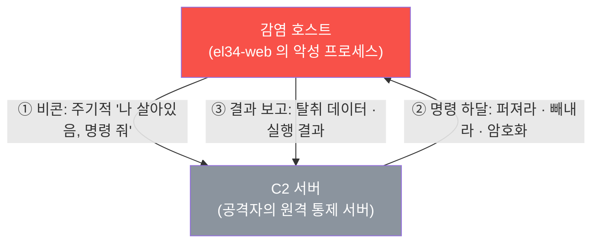
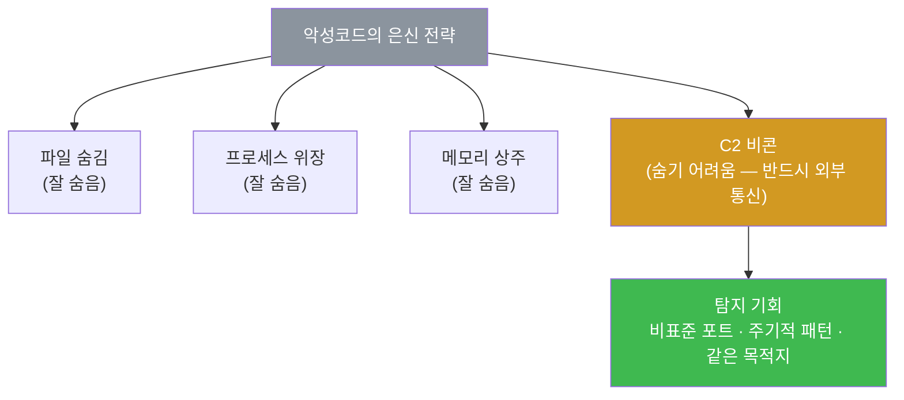
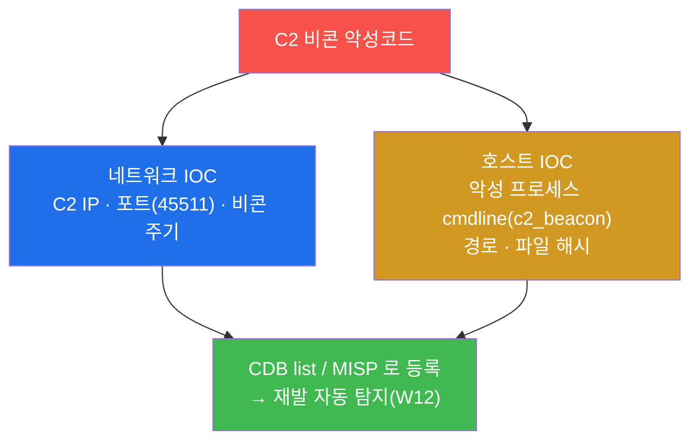
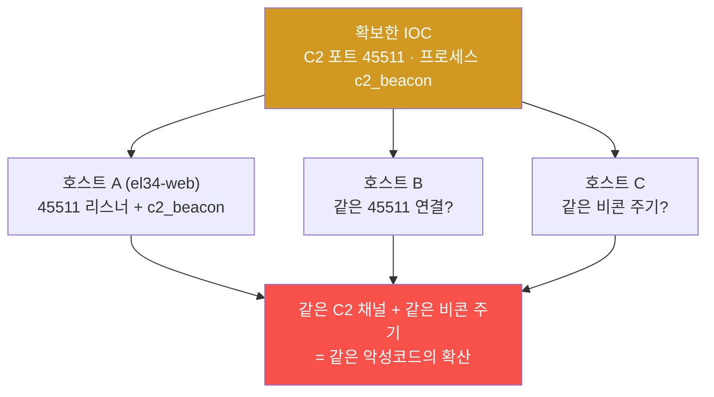
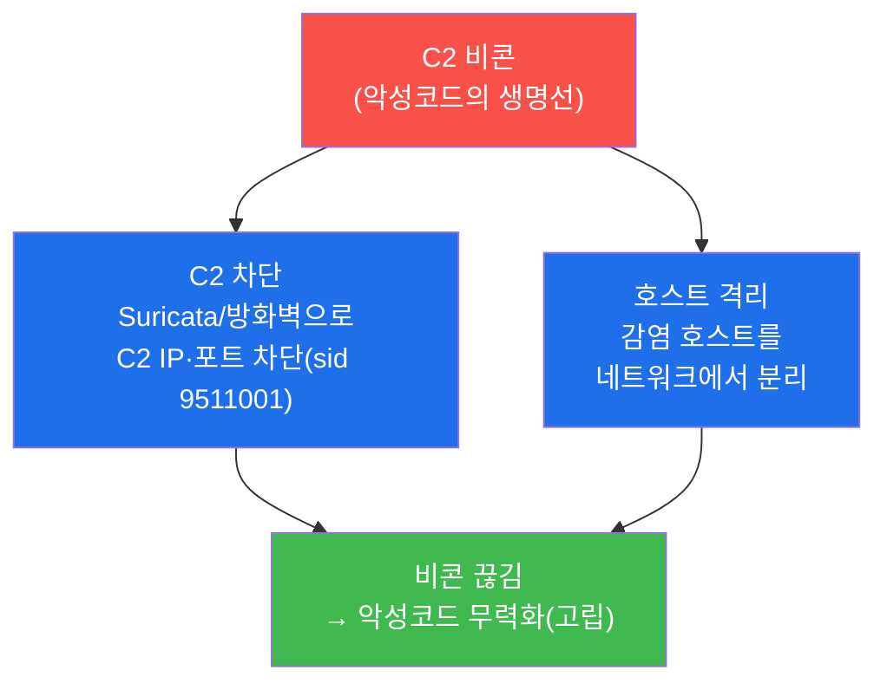
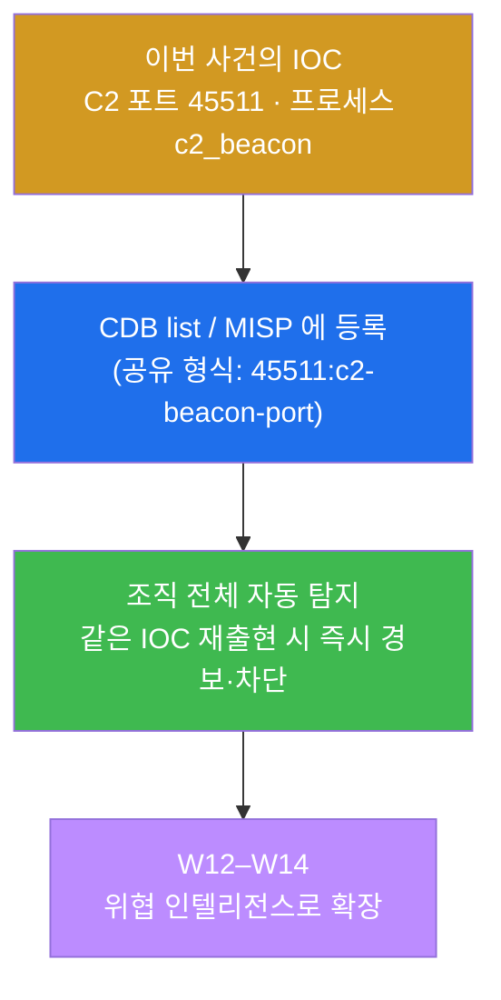
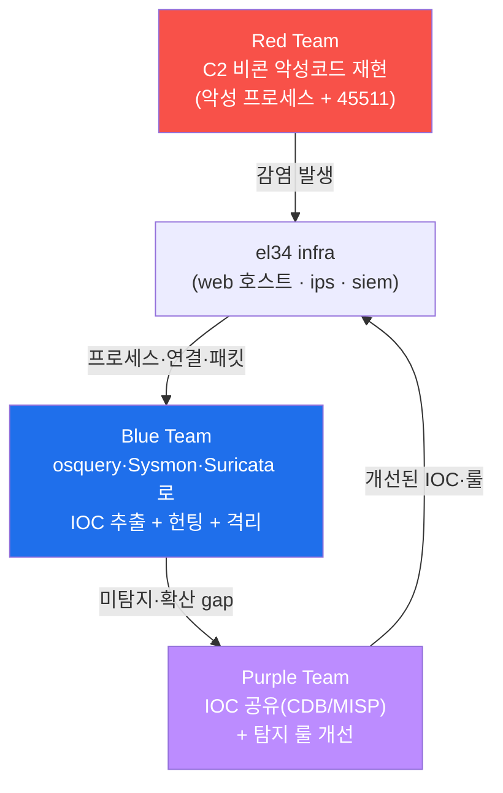
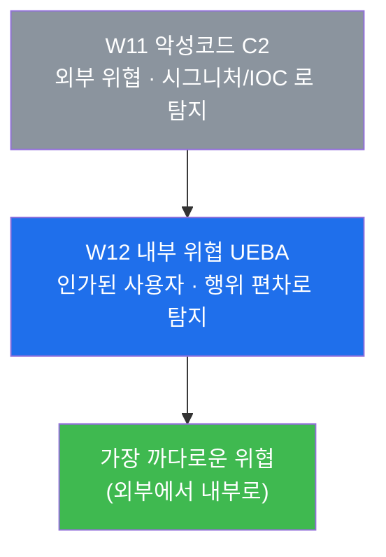

# SOC W11 — 악성코드 감염: C2 비콘을 IOC로 잡고 호스트를 격리하기

> **본 주차의 한 줄 요약**
>
> 서버에 들어온 악성코드는 혼자 일하지 않는다. 거의 모든 악성코드는 **공격자의 원격
> 서버(C2, Command & Control)에 주기적으로 전화를 건다** — 이 주기적 외부 통신을 **비콘
> (beaconing)** 이라 한다. 비콘은 악성코드가 "지시를 받고 결과를 보내기" 위해 반드시 해야
> 하는 행동이므로, 동시에 악성코드의 **가장 큰 약점** 이기도 하다. 본 주차에 학생은 el34 의
> web 호스트에서 C2 비콘을 내는 악성코드를 재현하고, 그 흔적을 **두 호스트 가시화 도구
> (osquery 스냅샷 + Sysmon for Linux 이벤트 스트림)** 와 네트워크 IDS(Suricata)로 잡아, 거기서
> **재사용 가능한 침해 지표(IOC, Indicator of Compromise)** 를 뽑는다. 그다음 W09 에서 배운
> IR 절차(식별 → 격리 → 제거 → 복구)를 그대로 적용해, **C2 통신을 끊어 악성코드를 무력화**
> 하고, 마지막으로 뽑은 IOC 를 조직 전체로 **공유** 해 같은 악성코드가 다시 들어오면 자동으로
> 잡히게 만든다.
>
> **분석가 한 줄 결론**: 악성코드를 잡는 가장 확실한 길은 "악성 파일을 찾는 것"이 아니라
> **"악성코드가 집에 거는 전화(C2 비콘)를 끊는 것"** 이다. 전화선을 끊으면 악성코드는
> 지시받지 못하고 결과도 못 보내, 사실상 죽은 것과 같아진다. 그리고 그 전화번호(IOC)를
> 조직에 돌리면, 다음번 같은 전화는 받기도 전에 차단된다.

---

## 학습 목표

본 주차 종료 시 학생은 다음 6가지를 **본인 손으로** 할 수 있어야 한다.

1. **C2 비콘** 의 개념 — 감염 호스트가 공격자 서버에 주기적으로 거는 외부 통신 — 을 비유
   없이 1분 안에 설명하고, 비콘이 왜 악성코드의 **약점이자 탐지 기회** 인지 근거를 댄다.
2. **네트워크 IOC**(C2 IP·포트·비콘 주기)와 **호스트 IOC**(악성 프로세스 cmdline·경로,
   파일 해시)를 구분하고, el34 의 web 호스트에서 각각을 실제 명령으로 추출한다.
3. 같은 위협을 **osquery(스냅샷)** 와 **Sysmon for Linux(이벤트 스트림)** 두 도구로 보고,
   왜 한쪽(스냅샷)은 단명·인코딩 프로세스를 놓치고 다른 쪽(이벤트)은 그 순간을 잡는지
   대비를 설명한다.
4. 추출한 C2 채널(포트·연결)을 키로 **감염 범위를 헌팅** 해, "한 호스트만인가, 더 퍼졌나"를
   판정한다.
5. W09 의 **IR 라이프사이클(식별 → 격리 → 제거 → 복구)** 을 악성코드에 적용해, **C2 차단
   룰(Suricata sid 9511001)** 로 비콘을 끊고 악성 프로세스를 제거한 뒤 잔재 0 을 검증한다.
6. 추출한 IOC 를 **CDB list / MISP 공유 형식** 으로 정리해, "한 곳에서 잡은 IOC 가 조직
   전체의 자동 탐지가 된다"(W12–W14 인텔 연결)는 흐름을 설명하고, 전 과정을 악성코드 IR
   보고서로 종합한다.

---

## 0. 용어 해설 (악성코드·C2·IOC 입문)

이번 주에 처음 등장하거나 의미를 정확히 못 박아 두어야 하는 용어다. 본문에서 다시 나올 때
막히면 이 표로 돌아오면 흐름이 끊기지 않는다.

| 용어 | 영문 | 뜻 | 비유 |
|------|------|----|------|
| **악성코드** | malware | 공격자가 심은, 시스템을 해치거나 통제하려는 프로그램 | 몰래 들여온 첩자 |
| **C2** | Command & Control | 악성코드가 지시를 받고 결과를 보내는 공격자의 원격 서버 | 첩자가 보고하는 본부 |
| **비콘** | beacon / beaconing | 감염 호스트가 C2 에 **주기적으로** 거는 외부 통신 | 첩자의 정기 무전 |
| **비콘 주기** | beacon interval | 비콘을 보내는 시간 간격(예: 60초마다) | 무전 시간표 |
| **IOC** | Indicator of Compromise | 침해를 가리키는 **재사용 가능한** 지표(악성 IP·포트·해시·cmdline) | 수배범의 지문·차량번호 |
| **네트워크 IOC** | network IOC | 통신에서 보이는 IOC — C2 IP·포트, 비콘 주기 | 범인이 건 전화번호 |
| **호스트 IOC** | host IOC | 호스트 내부에서 보이는 IOC — 악성 프로세스 cmdline·경로, 파일 해시 | 범인이 남긴 지문·도구 |
| **파일 해시** | file hash | 파일 내용을 고정 길이 값으로 요약한 지문(MD5/SHA-256) | 파일의 고유 지문 |
| **osquery** | osquery | OS 의 상태를 **SQL 테이블** 로 조회하는 호스트 가시화 도구 | 시스템에 던지는 질문지 |
| **스냅샷** | snapshot | "지금 이 순간"의 상태를 한 번 찍는 관측(시점) | 한 장의 사진 |
| **이벤트 스트림** | event stream | 사건이 일어나는 "그 순간"을 계속 기록하는 관측(연속) | 돌아가는 CCTV 영상 |
| **Sysmon for Linux** | Sysmon for Linux | 프로세스·연결·파일 생성의 **순간** 을 eBPF 로 기록하는 호스트 센서 | 호스트의 비행기록장치 |
| **eBPF** | extended Berkeley Packet Filter | 커널 안에서 안전하게 이벤트를 가로채는 현대 커널 기술 | 커널에 심은 도청 센서 |
| **Suricata** | Suricata | el34 의 IDS/IPS — 네트워크 트래픽을 시그니처로 탐지 | 출입구 검문 |
| **시그니처** | signature | "이런 패턴이면 악성"을 적은 탐지 규칙(룰) | 수배 전단의 인상착의 |
| **IR 라이프사이클** | Incident Response lifecycle | 식별 → 격리 → 제거 → 복구 → 교훈의 사고 대응 절차(W09) | 화재 진압 표준 절차 |
| **격리(Contain)** | containment | 위협이 더 퍼지기 전에 차단·분리하는 단계 | 불난 방 문을 닫음 |
| **CDB list** | Constant Database list | Wazuh 가 IOC 목록(IP·해시 등)을 빠르게 조회하는 키-값 목록 | 수배자 명단 |
| **MISP** | Malware Information Sharing Platform | 조직 간 위협 정보(IOC)를 공유하는 플랫폼 | 경찰서 간 수배 공유망 |
| **self-clean** | self-clean | 공유 인프라에서 실습이 만든 흔적(룰·프로세스)을 끝에 스스로 지우는 수칙 | 훈련장 원상복구 |

---

## 0.5 신입생 친화 핵심 개념 — "악성코드는 집에 전화한다"

위 용어 표는 한 줄 정의라 그림을 그리기엔 부족하다. 본 절에서는 W11 의 가장 중요한 직관
세 가지를 일상 비유로 풀어 둔다. 이 세 비유가 W11 전체를 관통한다.

### 0.5.1 C2 비콘 = 첩자의 정기 무전

학생이 첩보 영화의 보안 담당관이라고 하자. 적이 우리 건물에 첩자(=악성코드)를 들여보냈다.
첩자는 혼자 판단하지 않는다 — **본부(=C2 서버)** 의 지시를 받아 움직이고, 알아낸 것을 본부에
보고한다. 그러려면 첩자는 **정해진 시각마다 본부에 무전을 친다.** 이 정기 무전이 바로
**비콘(beaconing)** 이다.

여기서 보안 담당관의 통찰이 나온다. 첩자가 아무리 잘 숨어도, **무전을 치는 한 전파는
잡힌다.** 첩자를 직접 찾아 헤매는 것보다, "건물에서 외부로 나가는 정체불명의 정기 무전"을
잡는 편이 훨씬 빠르고 확실하다. 그리고 **무전선을 끊으면** 첩자는 지시도 못 받고 보고도 못
해, 사실상 무력해진다.

이 비유를 보안에 그대로 옮기면 다음과 같다.

| 첩보 비유 | 악성코드 세계 |
|-----------|---------------|
| 첩자 | 악성코드(감염 호스트의 악성 프로세스) |
| 본부 | C2 서버(공격자의 원격 서버) |
| 정기 무전 | C2 비콘(주기적 외부 통신) |
| 무전 주파수·시간표 | C2 IP·포트, 비콘 주기 = **네트워크 IOC** |
| 첩자의 지문·소지품 | 악성 프로세스 cmdline·파일 해시 = **호스트 IOC** |
| 무전선 끊기 | C2 통신 차단(격리) → 악성코드 무력화 |

핵심 통찰: **악성코드의 생명선은 C2 통신이다.** 그래서 탐지도 대응도 이 통신을 중심에
둔다. 본 주차의 모든 미션이 "비콘을 잡고 → 끊는다"는 한 줄로 꿰어진다.

### 0.5.2 IOC = 한 번 잡으면 다시 쓰는 수배 정보

학생이 경찰이라고 하자. 어떤 사건의 범인을 한 번 특정했다. 그때 범인의 **지문, 차량번호,
사용한 전화번호** 를 기록해 둔다. 이 기록의 가치는 **"이번 사건"에 그치지 않는다는 것** 이다.
같은 지문이 다른 현장에서 또 나오면 즉시 "같은 범인"임을 안다. 같은 차량번호가 검문에 걸리면
바로 잡는다. 이렇게 **한 번 확보하면 두고두고 재사용되는 수배 정보** 가 보안에서는 **IOC
(Indicator of Compromise, 침해 지표)** 다.

IOC 는 두 종류로 나뉜다. 첩자 비유로 잇자면 — 첩자가 **건 전화번호·무전 주파수** 는
통신에서 보이는 **네트워크 IOC**(C2 IP·포트, 비콘 주기)이고, 첩자가 **남긴 지문·소지품** 은
호스트 내부에서 보이는 **호스트 IOC**(악성 프로세스 cmdline·경로, 파일 해시)다.

| IOC 종류 | el34 에서의 예 | 어디서 보나 |
|----------|----------------|-------------|
| **네트워크 IOC** | C2 포트 45511, 비콘 주기 | Suricata(eve.json), osquery 소켓 테이블 |
| **호스트 IOC** | 악성 프로세스 cmdline `c2_beacon`, 파일 해시 | osquery `processes`, Sysmon ProcessCreate |

IOC 의 진짜 힘은 **공유** 에 있다. 한 호스트에서 뽑은 IOC 를 조직의 **CDB list / MISP** 에
올리면(§5.3·실습 7), 같은 악성코드가 다른 호스트에 다시 나타날 때 **사람이 분석하기 전에
자동으로** 잡힌다. "한 곳의 분석 = 조직 전체의 면역"이 IOC 공유의 가치이며, 이것이 W12–W14
위협 인텔리전스로 이어지는 다리다.

### 0.5.3 스냅샷 vs 이벤트 스트림 — 사진과 CCTV의 차이

악성코드를 호스트에서 잡으려면 두 종류의 "눈"이 있다. 이 둘의 차이를 이해하는 것이 본 주차
탐지의 핵심이다.

**첫째, 스냅샷(snapshot).** 학생이 방범을 위해 매 시각 정각에 거실 **사진을 한 장씩** 찍는다고
하자. 정각의 모습은 정확히 남는다. 하지만 12:00 과 13:00 사이에 누가 들어와 물건을 훔치고
**1분 만에 빠져나갔다면**, 두 사진 어디에도 그 사람은 없다. 사진은 **"지금 떠 있는 것"** 은
잘 보지만, **잠깐 나타났다 사라진 것** 은 놓친다. 보안에서 이 사진이 **osquery** 다 — OS 의
지금 상태를 SQL 로 조회하는 스냅샷 도구다(W07 에서 학습).

**둘째, 이벤트 스트림(event stream).** 같은 거실에 **CCTV** 를 달면, 누가 언제 들어오고
나가는 그 **순간순간** 이 영상으로 남는다. 1분 만에 빠져나간 사람도, 잠깐 떨어뜨린 물건도
모두 기록된다. 보안에서 이 CCTV 가 **Sysmon for Linux** 다 — 프로세스가 **생성되는 순간**
(ProcessCreate), 외부로 **연결하는 순간**(NetworkConnect), 파일을 **만드는 순간**(FileCreate)을
이벤트로 기록하는 호스트 센서다.

| 측면 | osquery (스냅샷) | Sysmon for Linux (이벤트 스트림) |
|------|------------------|----------------------------------|
| 모델 | "지금 이 순간"의 상태 1장 | "그 순간"들의 연속 기록 |
| 강한 곳 | **지속 상태**(떠 있는 프로세스, 열린 포트, 백도어 계정) | **단명·인코딩 행위**(잠깐 떴다 사라진 프로세스) |
| 약한 곳 | 짧게 떴다 사라진 행위는 놓침 | (config 가 기록 안 하는 종류는 안 남음) |
| el34 위치 | `docker exec el34-web osqueryi` (컨테이너 안) | 호스트(192.168.0.151)에 설치, 컨테이너 내부까지 포착 |

> **el34 사실 — Sysmon 은 호스트에 산다.** el34-web 컨테이너는 비특권이라 eBPF 센서를 직접
> 올릴 권한(`CAP_BPF`/`SYS_ADMIN`)이 없다. 그래서 **Sysmon for Linux 는 el34 호스트
> (192.168.0.151)에 systemd 데몬으로 설치** 돼 있다. 컨테이너 프로세스도 결국 **호스트 커널이
> 실행하는 프로세스** 이므로, 호스트에 올린 eBPF 센서가 el34-web 내부의
> ProcessCreate/NetworkConnect/FileCreate 까지 그대로 본다. 그래서 본 주차 점검(실습 1)의
> `systemctl is-active sysmon` 은 **호스트에서** 실행한다. 이 환경의 Sysmon config 는
> **EventID 1(ProcessCreate) / 3(NetworkConnect) / 11(FileCreate)** 을 `/var/log/syslog` 에
> `Linux-Sysmon` 소스로 기록한다. (Sysmon 의 단명 프로세스 추적은 secuops W11 에서 깊이 다룬다.)

핵심: **두 도구는 경쟁이 아니라 보완** 이다. C2 비콘 악성코드를 잡을 때 — 떠 있는 악성
프로세스와 열린 C2 포트는 **osquery 스냅샷** 이 잘 잡고, 잠깐 떴다 사라지는 인코딩 명령은
**Sysmon 이벤트** 가 잡는다. 여기에 네트워크에서 비콘 패턴을 보는 **Suricata** 가 더해져
세 시각이 합주한다.

---

## 1. 악성코드는 왜 집에 전화하는가 — C2 와 비콘

### 1.1 한 줄 답: 악성코드는 "지시받고 보고하려" 통신해야 한다

악성코드를 한 번 심는 것만으로 공격이 끝나는 경우는 드물다. 공격자는 감염된 호스트로 **계속
새 명령을 내리고**(더 퍼져라, 이 파일을 빼내라, 암호화해라), 그 **결과를 돌려받아야** 한다.
이 양방향 통신의 상대가 공격자의 원격 서버 — **C2(Command & Control)** 다. 그리고 악성코드가
C2 에 **주기적으로** 연결을 시도하는 행동을 **비콘(beaconing)** 이라 한다.



위 ①②③ 이 반복되는 한, 악성코드는 살아 움직인다. 반대로 이 사이클의 어느 한 줄이라도
끊기면 — 특히 ① 비콘이 끊기면 — 악성코드는 지시도 못 받고 보고도 못 해 **고립된다.** 본
주차의 격리(§5)가 정확히 이 한 줄을 끊는 일이다.

### 1.2 왜 중요한가 — 비콘은 악성코드의 약점이자 탐지 기회

악성코드는 파일을 숨기고, 이름을 정상 프로세스처럼 위장하고, 메모리에만 머무는 등 갖은
방법으로 숨는다. 그런데 **비콘만큼은 숨기기 어렵다.** 통제를 받으려면 반드시 외부로 나가는
통신을 해야 하고, 그 통신은 네트워크 IDS(Suricata)와 호스트 가시화 도구(osquery·Sysmon)에
흔적을 남긴다. 게다가 비콘은 **주기적** 이라 패턴이 도드라진다 — 사람의 정상 통신은
불규칙하지만, 악성코드는 "60초마다 한 번"처럼 시계처럼 규칙적으로 같은 목적지를 두드린다.



이것이 "악성코드는 집에 전화한다"가 분석가에게 좋은 소식인 이유다. 우리는 **악성 파일을
완벽히 찾아내려 애쓰는 대신, 악성코드가 어쩔 수 없이 하는 통신** 을 노린다.

### 1.3 el34 에서 어떻게 — web 호스트에 C2 비콘을 재현한다

본 주차 실습은 el34 의 **web 컨테이너** 에 C2 비콘 악성코드를 재현한다(실습 2). 진짜 외부
C2 서버에 연결하면 공유 인프라와 외부에 영향을 주므로, 안전하게 **비표준 포트(45511)로
C2 채널을 모사** 한다 — 악성 프로세스 하나(cmdline 에 `c2_beacon` 표식)와, C2 통신을 흉내
내는 리스너(포트 45511)다. 이 둘이 "악성 프로세스 + C2 채널"이라는 악성코드의 최소 형태이고,
이후 모든 분석·대응 미션의 원천 데이터가 된다.

> **왜 비표준 포트인가.** 정상 서비스는 잘 알려진 포트(80 HTTP, 443 HTTPS, 22 SSH 등)를
> 쓴다. 악성코드는 방화벽을 피하려 종종 **높은 비표준 포트** 를 쓰는데, 역설적으로 이
> "비표준 포트로 나가는 통신"이 그 자체로 의심 신호가 된다. el34 의 45511 은 이 "비표준
> 포트 C2"를 학습용으로 모사한 것이다(W10 의 웹쉘 콜백도 같은 이유로 40000 이상 포트를
> 썼다 — §6 연속성).

### 1.4 한계 — 비콘 탐지가 만능은 아니다

오해를 막아 둔다. C2 탐지에도 한계가 있다. 정교한 악성코드는 **비콘을 정상 트래픽에
숨긴다** — 흔한 HTTPS 443 포트로 나가거나, 정상 클라우드 서비스(예: 합법 도메인)를 C2 로
악용하거나, 비콘 주기에 난수를 섞어(jitter) 규칙성을 흐린다. 그래서 실무에서는 포트 하나에
의존하지 않고, **여러 단서(목적지 평판 + 주기성 + 데이터 양 + 호스트 측 악성 프로세스)** 를
함께 본다. 본 주차의 비표준 포트 45511 은 개념을 또렷이 보여 주는 **출발점** 이지, 모든 C2
가 그렇게 친절하게 드러나지는 않는다.

---

## 2. ① 식별(Identify) + IOC 추출 — 재사용 가능한 지표를 뽑는다

IR 의 첫 단계는 식별이다(W09). 악성코드 사건에서 식별은 단순히 "감염됐다"를 아는 데 그치지
않고, **다시 쓸 수 있는 IOC 를 뽑아내는 것** 까지 간다. 이것이 악성코드 IR 이 일반 IR 보다
한 걸음 더 나아가는 지점이다.

### 2.1 한 줄 정의 — IOC 는 침해를 가리키는 재사용 가능한 지표

**IOC(Indicator of Compromise)** 는 "이 신호가 보이면 침해다"라고 말해 주는, **한 번
뽑으면 두고두고 재사용되는** 지표다(§0.5.2). 한 사건의 분석 결과를 IOC 로 정리해 두면,
같은 악성코드가 다른 호스트·다른 시점에 나타날 때 그 IOC 만으로 즉시 식별·차단할 수 있다.

### 2.2 두 종류의 IOC — 네트워크와 호스트

C2 비콘 악성코드에서 뽑을 IOC 는 두 갈래다.



- **네트워크 IOC** — 통신에서 보이는 지표다. C2 의 IP·포트(여기서는 45511)와 비콘 주기.
  같은 C2 포트로 나가는 통신이 다른 호스트에서도 보이면 그 호스트도 감염된 것이다.
- **호스트 IOC** — 호스트 내부에서 보이는 지표다. 악성 프로세스의 명령줄(cmdline, 여기서는
  `c2_beacon` 표식), 실행 파일 경로, 파일 해시. 같은 cmdline/해시를 가진 프로세스가 다른
  호스트에 있으면 같은 악성코드다.

### 2.3 el34 에서 어떻게 — osquery 로 프로세스·소켓 IOC 추출

el34 의 web 호스트에서 IOC 를 뽑는 1차 도구는 **osquery** 다. OS 의 상태를 SQL 테이블로
조회하므로, 악성 프로세스와 그 통신을 한 줄 질의로 끄집어낸다.

```bash
# 호스트 IOC — 악성 프로세스의 cmdline (악성코드 식별의 지문)
docker exec el34-web osqueryi --json 'SELECT pid,name,cmdline FROM processes WHERE cmdline LIKE "%c2_beacon%";'

# 네트워크 IOC — 비표준(높은) 포트로 나가는 외부 연결
docker exec el34-web osqueryi --json 'SELECT pid,remote_address,remote_port FROM process_open_sockets WHERE remote_port>40000;'
```

**무엇을 보나** — 첫 질의는 `processes` 테이블에서 cmdline 에 `c2_beacon` 이 든 프로세스를
찾아 **호스트 IOC**(pid·name·cmdline)를 뽑는다. 둘째 질의는 `process_open_sockets` 테이블에서
원격 포트가 40000 을 넘는 외부 연결을 찾아 **네트워크 IOC**(어느 프로세스가 어디로 연결하나)를
뽑는다. 정상 서비스가 비표준 고포트로 외부 연결을 유지하는 경우는 드물기에, 이 결과 자체가
강한 의심 신호다.

> **용어 — osquery 테이블.** osquery 는 OS 의 각 측면을 테이블로 제공한다(W07). 본 주차에서
> 쓰는 테이블은 `processes`(실행 중 프로세스: pid/name/cmdline/on_disk), `process_open_sockets`
> (프로세스의 외부 연결: remote_address/remote_port), `listening_ports`(열린 리스너:
> port/address/pid), `file`(파일: path/size/mtime)이다. SQL 의 `WHERE … LIKE "%문자열%"` 은
> "이 문자열을 포함하는 행만"을 뜻한다.

### 2.4 한계 — osquery 스냅샷은 "지금 떠 있는 것"만 본다

§0.5.3 에서 본 대로, osquery 는 스냅샷이다. **지금 떠 있는** 악성 프로세스와 열린 포트는 잘
잡지만, 잠깐 떴다 사라진 인코딩 명령(예: base64 디코드 후 바로 실행하고 종료)은 두 스냅샷
사이로 빠져나갈 수 있다. 그 사각을 **Sysmon for Linux 의 ProcessCreate 이벤트** 가 메운다 —
프로세스가 생성되는 그 순간을 `/var/log/syslog`(Linux-Sysmon)에 남기기 때문이다. 그래서 실무
탐지는 "떠 있는 것은 osquery, 스쳐간 것은 Sysmon"으로 두 도구를 함께 쓴다.

---

## 3. ② 헌팅(Hunt) — 감염 범위를 정한다

식별로 한 호스트의 감염을 확인했다면, 다음 질문은 반드시 **"한 호스트만인가, 더 퍼졌나"** 다.
이 질문에 답하는 것이 헌팅(threat hunting)이다.

### 3.1 한 줄 정의 — 헌팅은 같은 IOC 를 여러 호스트에서 능동적으로 찾는 것

**헌팅** 은 경보를 수동으로 기다리는 대신, 이미 확보한 IOC 를 가설로 삼아 **여러 호스트에서
같은 흔적을 능동적으로 찾아 나서는** 작업이다. C2 비콘 악성코드의 헌팅 키는 **C2 채널** 이다 —
같은 C2 포트(45511)나 같은 C2 연결을 가진 호스트가 또 있으면, 그 호스트도 같은 악성코드에
감염된 것이다.

### 3.2 무엇으로 묶는가 — 같은 C2 = 같은 악성코드



판정 기준은 두 가지다. **첫째, 같은 C2 채널** — 같은 포트로 통신하는 다른 호스트는 확산
후보다. **둘째, 같은 비콘 주기** — 통신 간격까지 같으면 같은 악성코드일 가능성이 매우 높다
(다른 악성코드가 우연히 같은 포트를 쓸 수는 있어도, 주기까지 일치하기는 어렵다).

### 3.3 el34 에서 어떻게 — C2 포트로 리스너·연결 헌팅

el34 에서는 C2 채널(45511)을 키로 호스트의 리스너와 연결을 osquery 로 헌팅한다.

```bash
# C2 채널(45511)을 여는 리스너가 있는가 — 감염 범위 헌팅
docker exec el34-web osqueryi --json 'SELECT pid,port,address FROM listening_ports WHERE port=45511;'
```

**무엇을 보나** — `listening_ports` 테이블에서 포트 45511 을 여는 프로세스가 있는지 본다.
이 호스트에 결과가 보이면 감염 확인이고, 같은 질의를 다른 호스트로 돌려 결과가 나오면
확산이다. 실무에서는 단일 호스트가 아니라 **모든 호스트에 같은 osquery 질의를 분산 실행**
(Wazuh 의 osquery 통합 등)해 한 번에 범위를 그린다.

### 3.4 한계 — 헌팅은 "아는 IOC"만 찾는다

헌팅은 강력하지만, **이미 확보한 IOC 의 범위 안에서만** 찾는다. 공격자가 호스트마다 다른
포트·다른 프로세스 이름을 쓰면 단일 IOC 헌팅은 일부를 놓친다. 그래서 포트 하나가 아니라
**행위 패턴**(비표준 고포트로 나가는 주기적 외부 연결 일반)으로 헌팅 폭을 넓히고, 놓친
변종은 §5 의 IOC 공유 후 재탐지나 W12 의 행위 기반 분석(UEBA)으로 보완한다.

---

## 4. ③ 격리(Contain) — C2 통신을 끊어 악성코드를 무력화한다

범위를 정했으면, W09 의 IR 절차대로 **격리 → 제거 → 복구** 로 넘어간다. 악성코드 격리의
핵심은 단 하나 — **C2 통신을 끊는 것** 이다.

### 4.1 한 줄 정의 — 격리는 위협의 생명선(C2)을 차단하는 단계

§1 에서 본 대로, C2 비콘이 끊기면 악성코드는 지시도 보고도 못 해 고립된다. 그래서 악성코드
격리는 두 갈래로 비콘을 끊는다.



- **C2 차단** — 네트워크 경계에서 C2 의 IP·포트로 가는 통신을 막는다. el34 에서는 Suricata
  룰(sid 9511001)로 C2 포트(45511) 트래픽을 플래그/차단한다.
- **호스트 격리** — 감염 호스트 자체를 네트워크에서 분리한다. 호스트가 끊기면 그 안의 비콘도
  당연히 끊긴다. 다만 너무 넓게 끊으면 정상 서비스도 멈추므로, 격리는 **빠르되 정밀하게** 한다.

### 4.2 왜 차단이 우선인가 — "차단 먼저, 분석 나중"

W09 의 원칙 그대로다. 비콘이 살아 있는 동안 공격자는 계속 명령을 내려 피해를 키울 수 있다
(더 퍼지기, 데이터 빼내기). 그래서 **완벽한 분석을 기다리기보다 통신을 먼저 끊는 것** 이
피해를 줄인다. 분석(추가 IOC 추출 등)은 비콘을 끊어 출혈을 멈춘 뒤에 이어 가도 된다.

### 4.3 el34 에서 어떻게 — Suricata C2 차단 룰(sid 9511001)

el34 의 ips(Suricata)에 C2 포트 45511 을 겨냥한 룰을 작성한다. **sid(signature id)** 는 룰의
고유 번호로, 본 주차의 C2 차단 룰은 **9511001** 을 쓴다(SOC W11 의 네임스페이스).

```
alert ip any any -> any 45511 (msg:"SOC W11 C2 beacon block"; sid:9511001; rev:1;)
```

이 룰은 "어떤 출발지에서든 포트 45511 로 가는 IP 트래픽이 보이면 경보(alert)하라"는 뜻이다.
운영 환경이라면 `alert` 대신 `drop` 으로 실제 차단하고 방화벽 차단을 병행하지만, **여러 학생이
공유하는 el34 에서는** 룰을 **작성 → 문법 검증(`suricata -T`) → 적용(`reload-rules`) → 정리
(삭제)** 까지 한 흐름으로 시연하고, 마지막에 룰을 지워 공유 인프라를 원상복구한다(self-clean,
실습 5).

> **용어 — Suricata 룰의 구조.** `alert`(액션) `ip`(프로토콜) `any any`(출발지 IP·포트)
> `->`(방향) `any 45511`(목적지 IP·포트). 괄호 안은 옵션 — `msg`(경보 메시지), `sid`(룰 고유
> 번호), `rev`(룰 개정 번호)다. 운영의 실제 차단은 액션을 `drop` 으로 바꾼다.

### 4.4 한계 — 차단은 증상 억제, 뿌리는 따로 뽑아야

C2 차단은 비콘을 끊어 **출혈을 멈추는** 응급 처치다. 하지만 악성 프로세스 자체는 여전히
호스트에 떠 있고, 차단을 풀면 다시 통신을 시도할 수 있다. 그래서 격리는 끝이 아니라 시작이고,
반드시 다음 단계 — **제거(Eradicate)** 로 뿌리를 뽑아야 한다.

---

## 5. ④⑤ 제거(Eradicate) · 복구(Recover) · IOC 공유

격리로 비콘을 끊었으면, 악성코드를 **완전히 제거** 하고 시스템을 **정상으로 되돌린** 뒤,
이번에 뽑은 IOC 를 조직에 **공유** 해 재발에 대비한다.

### 5.1 제거 — 악성 프로세스 종료 + persistence 제거

**제거(Eradicate)** 는 악성코드의 흔적을 호스트에서 완전히 없애는 단계다. C2 비콘 악성코드의
제거는 **악성 프로세스를 종료(kill)** 하고, 악성코드가 재부팅 후에도 살아남기 위해 심어 둔
**지속성(persistence)** — 악성 파일, cron 작업, 백도어 계정 등 — 을 제거하는 것이다.

```bash
# 악성 프로세스 + C2 리스너 종료
docker exec el34-web sh -c 'pkill -f "[c]2_beacon"; pkill -f "[h]ttp.server 45511"; true'
# 제거 확인 — 결과가 비어야 정상
docker exec el34-web osqueryi --json 'SELECT pid FROM processes WHERE cmdline LIKE "%c2_beacon%";'
```

**무엇을 보나** — `pkill -f` 는 명령줄 패턴으로 프로세스를 종료한다. 패턴을 `[c]2_beacon`
처럼 첫 글자를 대괄호로 감싸는 것은 **pkill 자기 자신이 그 패턴에 매치되어 죽는 것을 막는
관용 기법** 이다(`[c]2_beacon` 이라는 정규식은 `c2_beacon` 에는 매치되지만, 명령줄에 적힌
`[c]2_beacon` 자체에는 매치되지 않는다). 종료 후 osquery 로 같은 프로세스를 다시 조회해
**결과가 비어 있으면** 제거 성공이다. 제거의 철칙은 **빠짐없이** — 하나라도 남으면 재감염의
씨앗이 된다(W09 §4).

### 5.2 복구 — 잔재 0 검증 + 재감염 감시

**복구(Recover)** 는 위협이 완전히 사라졌음을 검증하고 정상 운영으로 되돌리는 단계다.
악성코드 복구의 핵심은 **잔재(residual) 0 의 확인** 이다 — 악성 프로세스가 정말 한 개도 남지
않았는지 다시 확인하고, 같은 악성코드가 다시 나타나지 않는지 감시를 이어 간다.

```bash
# 잔재 확인 — 악성 프로세스가 하나라도 남았는가
docker exec el34-web sh -c 'pgrep -f "[c]2_beacon" && echo "잔재!" || echo clean'
```

**무엇을 보나** — `pgrep -f` 는 패턴에 맞는 프로세스의 존재를 확인한다. 남아 있으면 `잔재!`,
없으면 `clean` 이 출력된다. `clean` 이 떠야 제거가 완결된 것이다. 운영에서는 여기에 더해
재감염 감시(같은 IOC 의 재출현 모니터링)와 근본 원인(어떻게 들어왔나) 분석을 이어 간다.

### 5.3 IOC 공유 — 한 곳의 분석이 조직 전체의 면역이 된다

악성코드 IR 이 일반 IR 과 갈라지는 마지막 한 걸음이 **IOC 공유** 다. §2 에서 뽑은 IOC(C2 포트
45511, 프로세스 `c2_beacon`)를 조직의 **CDB list** 나 **MISP** 에 등록하면, 같은 악성코드가
다른 호스트·다른 시점에 나타날 때 **사람이 분석하기도 전에 자동으로** 탐지·차단된다.



> **용어 — CDB list 와 MISP.** **CDB list(Constant Database list)** 는 Wazuh 가 IP·해시 같은
> IOC 목록을 빠르게 조회하도록 만든 키-값 목록이다 — 들어오는 로그의 값이 이 목록에 있으면
> 즉시 경보를 격상한다. **MISP(Malware Information Sharing Platform)** 는 조직 간에 IOC 를
> 주고받는 공유 플랫폼이다. 이 "내 IOC 를 등록 → 조직 전체 자동 탐지"의 흐름이 본격적으로
> 다뤄지는 곳이 W12–W14 위협 인텔리전스다. 즉 W11 의 마지막 미션이 그 다리를 놓는다.

---

## 6. Red / Blue / Purple Team 관점에서의 악성코드 대응

본 주차의 활동을 3 팀 관점으로 정리하면, 악성코드 대응에서 각 팀이 무엇을 하는지 분명해진다.



| 팀 | 책임 | 본 주차 활동 |
|----|------|-------------|
| **Red** | 공격 시뮬레이션 | web 호스트에 C2 비콘 악성코드 재현(악성 프로세스 + 45511 리스너) |
| **Blue** | 탐지·대응 | osquery/Sysmon 으로 IOC 추출 → C2 채널 헌팅 → 룰(9511001) 격리 → 제거·복구 |
| **Purple** | 탐지 자산 개선 | 추출 IOC 를 CDB/MISP 로 공유해 조직 전체 자동 탐지로 전환 |

악성코드 대응은 본질적으로 **Blue + Purple 의 협업** 이다. Blue 가 한 사건을 분석해 IOC 를
뽑으면, Purple 이 그 IOC 를 조직의 탐지 자산으로 등록해 "한 번의 분석"을 "지속적인 면역"으로
바꾼다. 이것이 성숙한 SOC 의 악성코드 운영이다.

---

## 7. 실습 안내 (총 8 미션)

각 실습은 **4축 설명** 을 포함한다 — 왜 하는가 / 무엇을 알 수 있는가 / 결과 해석(정상 vs
비정상) / 실전 활용. 미션은 IR 절차를 따라 **점검 → 감염 재현 → IOC 추출 → 헌팅 → 격리 →
제거 → 복구·공유 → 보고** 순서로 흐른다.

> **실습 진행 원칙.** 모든 명령은 el34 호스트(`ssh ccc@192.168.0.151`)에서 실행한다. 감염
> 재현·호스트 분석은 `docker exec el34-web`, C2 차단 룰은 `docker exec el34-ips`, 점검의
> `systemctl is-active sysmon` 은 **호스트에서** 실행한다(Sysmon 이 호스트에 설치돼 있으므로).
> 악성코드와 차단 룰은 **self-clean** — 실습이 만든 프로세스·룰을 끝에 스스로 지워 공유
> 인프라를 보존한다. 합격 임계값은 0.7 이다.

### 실습 1 — 점검: osquery + 네트워크 가시성 (survey)

> **이 실습을 왜 하는가?**
> 악성코드 탐지의 전제는 호스트를 볼 두 눈 — osquery(스냅샷)와 Sysmon(이벤트 스트림) — 이
> 살아 있어야 한다는 것이다. 분석 착수 전 30초 가용성 점검이다.
>
> **이걸 하면 무엇을 알 수 있는가?**
> - el34-web 의 osquery 가 동작하고(버전 응답), 호스트의 Sysmon 데몬이 active 인지.
> - C2 비콘 탐지는 osquery(프로세스/소켓) + Sysmon(연결 이벤트) + Suricata(네트워크)의 세
>   시각이 합주한다는 큰 그림.
>
> **결과 해석**
> 정상: osquery 버전이 출력되고 `systemctl is-active sysmon` 이 `active`. 비정상: Sysmon 이
> 멈춰 있으면 그 순간부터의 이벤트가 사라지므로, 분석 전에 먼저 센서를 살려야 한다.
>
> **실전 활용**
> 운영 인수 첫 점검 — "호스트를 볼 도구가 다 살아 있나"를 1분에 확인하는 표준 절차.

### 실습 2 — 감염 재현: 악성 프로세스 + C2 비콘 (recon)

> **이 실습을 왜 하는가?**
> 이후 모든 분석·대응 미션의 원천 데이터를 만든다 — 악성 프로세스(cmdline `c2_beacon`)와
> C2 채널(포트 45511)이라는 악성코드의 최소 형태를 안전하게 재현한다.
>
> **이걸 하면 무엇을 알 수 있는가?**
> - "악성 프로세스 + C2 채널"이 악성코드의 본질적 두 부품임을, 그리고 주기적 외부 통신(비콘)이
>   IOC 의 핵심임을.
>
> **결과 해석**
> 정상: 재현이 실행되고 `malware done` 이 출력됨. 비정상: 프로세스나 리스너가 안 뜨면
> 이후 IOC 추출·헌팅에서 흔적이 안 보인다 — 재현부터 다시 한다.
>
> **실전 활용**
> 통제된 환경에서 알려진 악성코드를 재현해 "우리 도구가 이 비콘을 다 보는가"를 점검하는
> detection validation 의 표준 형태.

### 실습 3 — Identify + IOC 추출 (analysis)

> **이 실습을 왜 하는가?**
> 식별을 "감염됐다"에서 멈추지 않고, **재사용 가능한 IOC** 까지 뽑는다 — 악성코드 IR 이 한
> 걸음 더 나아가는 지점이다(§2).
>
> **이걸 하면 무엇을 알 수 있는가?**
> - osquery `processes` 로 악성 프로세스의 cmdline(`c2_beacon`)을 호스트 IOC 로 추출하는 법.
> - 이 IOC 가 CDB list/MISP 로 재사용되어 재발 자동 탐지로 이어진다는 흐름(W12).
>
> **결과 해석**
> 정상: 출력에 `c2_beacon` cmdline 이 보인다. 비정상: 안 보이면 미션 2 의 감염 재현이나
> osquery 가동을 점검.
>
> **실전 활용**
> 침해 조사에서 "이 악성코드의 지문(IOC)이 무엇인가"를 호스트 가시화로 즉시 뽑는 1차 작업.

### 실습 4 — Hunt: 감염 범위 (analysis)

> **이 실습을 왜 하는가?**
> "한 호스트만인가, 더 퍼졌나"를 판정한다 — 확보한 C2 채널(45511)을 키로 능동 헌팅한다(§3).
>
> **이걸 하면 무엇을 알 수 있는가?**
> - osquery `listening_ports`/`process_open_sockets` 로 C2 포트(45511)를 헌팅하는 법.
> - 같은 C2 채널 + 같은 비콘 주기 = 같은 악성코드의 확산이라는 판정 기준.
>
> **결과 해석**
> 정상: C2 포트(45511)가 헌팅으로 잡힌다. 비정상: 안 잡히면 감염 재현(미션 2)이나 osquery
> 를 점검. 다른 호스트에서도 잡히면 확산으로 판정.
>
> **실전 활용**
> 실제 사고에서 IOC 하나를 가설로 삼아 전체 자산을 훑어 감염 범위를 그리는 헌팅의 기본형.

### 실습 5 — Contain: C2 차단 (sid 9511001) (manipulation)

> **이 실습을 왜 하는가?**
> 악성코드 격리의 핵심 — **C2 통신을 끊어** 악성코드를 무력화한다(§4). 비콘이 끊기면
> 악성코드는 고립된다.
>
> **이걸 하면 무엇을 알 수 있는가?**
> - C2 포트(45511)를 겨냥한 Suricata 차단 룰(sid 9511001)을 작성 → 문법 검증 → 적용 →
>   정리(삭제)까지 한 흐름으로 다루는 법.
> - 공유 인프라에서 룰을 self-clean 으로 원상복구하는 운영 수칙.
>
> **결과 해석**
> 정상: 룰이 작성·검증·적용되고, 마지막에 삭제돼 `rule_removed`(잔재 0)가 확인된다. 비정상:
> 문법 오류가 나면 룰 구문을, 잔재가 남으면 sed 삭제를 점검.
>
> **실전 활용**
> 사고 대응에서 C2 차단 룰을 신속히 배포하되, 공유·운영 환경을 망가뜨리지 않고 안전하게
> 적용·회수하는 표준 절차.

### 실습 6 — Eradicate: 악성코드 제거 (response)

> **이 실습을 왜 하는가?**
> 격리는 출혈을 멈출 뿐, 뿌리는 제거로 뽑아야 한다(§4.4·§5.1). 악성 프로세스와 C2 채널을
> 완전히 종료한다.
>
> **이걸 하면 무엇을 알 수 있는가?**
> - `pkill -f` 로 악성 프로세스/C2 리스너를 종료하고, `[c]2_beacon` 대괄호 기법으로 pkill
>   자기매치를 막는 법.
> - 제거 후 osquery 재조회로 "빈 결과"를 확인해 제거를 검증하는 법.
>
> **결과 해석**
> 정상: `eradicated` 출력 후 osquery 재조회 결과가 비어 있다. 비정상: 프로세스가 남아 있으면
> 패턴·권한을 점검해 다시 종료한다 — 하나라도 남으면 재감염.
>
> **실전 활용**
> 악성코드 제거의 기본 — 종료 후 반드시 가시화 도구로 "정말 사라졌는지" 재확인하는 습관.

### 실습 7 — Recover + IOC 공유 (response)

> **이 실습을 왜 하는가?**
> 잔재 0 을 검증해 복구를 완결하고, 이번에 뽑은 IOC 를 조직에 공유해 재발에 대비한다 —
> 한 곳의 분석을 조직 전체의 면역으로 바꾸는 단계(§5.2·§5.3).
>
> **이걸 하면 무엇을 알 수 있는가?**
> - `pgrep -f` 로 악성 잔재가 0 인지 검증하는 법.
> - IOC(C2 포트 45511, 프로세스 `c2_beacon`)를 CDB list/MISP 공유 형식으로 정리하는 법과,
>   그것이 조직 전체 자동 탐지(W12 인텔)로 이어지는 흐름.
>
> **결과 해석**
> 정상: 잔재 점검이 `clean` 이고 IOC 가 공유 형식으로 정리된다. 비정상: `잔재!` 가 뜨면
> 미션 6 의 제거로 돌아간다.
>
> **실전 활용**
> 사고 종결 시 "정상 복구 확인 + IOC 자산화"를 함께 수행하는 성숙한 SOC 의 마무리 절차.

### 실습 8 — 악성코드 IR 보고서 (report)

> **이 실습을 왜 하는가?**
> 미션 1–7 을 한 악성코드 IR 서사로 묶어, 식별·격리·제거·복구·공유의 전 과정을 문서로
> 입증한다 — 본 주차의 최종 산출물.
>
> **이걸 하면 무엇을 알 수 있는가?**
> - 식별+IOC → 감염 범위 → 격리(C2 차단) → 제거+복구+IOC 공유를 한 보고서로 종합하는 법.
> - "C2 비콘이 악성코드의 약점 — IOC 로 잡고 통신을 끊어 무력화, IOC 공유로 조직을 방어"라는
>   결론을 증거와 함께 쓰는 것.
>
> **결과 해석**
> 정상: 보고서에 IOC + 감염 범위 + 격리 + 제거·복구·공유가 모두 담긴다. 비정상: 한 축이라도
> 빠지면 해당 미션으로 돌아가 보강.
>
> **실전 활용**
> 악성코드 사고 종결 후 경영진·감사에 제출하는 보고서의 표준 구조(식별·IOC → 범위 → 격리 →
> 제거·복구 → IOC 공유).

---

## 8. 핵심 정리 (1줄씩)

1. **악성코드는 집에 전화한다** — 거의 모든 악성코드는 C2 에 주기적으로 비콘을 보낸다. 이
   통신이 악성코드의 생명선이자 가장 큰 약점이다.
2. **IOC = 재사용 가능한 침해 지표** — 네트워크 IOC(C2 IP·포트·주기)와 호스트 IOC(악성
   프로세스 cmdline·해시)를 뽑아 두면 재발을 자동으로 잡는다.
3. **두 눈으로 본다** — 떠 있는 것은 osquery 스냅샷, 스쳐간 것은 Sysmon 이벤트 스트림, 통신
   패턴은 Suricata. 세 시각이 합주해야 비콘이 또렷이 보인다.
4. **헌팅으로 범위를 정한다** — 같은 C2 채널·같은 비콘 주기를 여러 호스트에서 찾아 확산
   여부를 판정한다.
5. **격리 = C2 통신 끊기** — Suricata 룰(sid 9511001) + 호스트 격리로 비콘을 끊으면 악성코드는
   고립된다. 차단 먼저, 분석 나중.
6. **제거·복구·공유** — 악성 프로세스를 뿌리째 종료(잔재 0)하고, 뽑은 IOC 를 CDB/MISP 로
   공유해 "한 곳의 분석"을 "조직 전체의 면역"으로 바꾼다(W12 인텔로 연결).

---

## 9. 다음 주차 (W12) 예고 — 내부 위협(UEBA)

W11 까지의 대응은 **외부에서 들어온 악성코드** 가 대상이었다 — "들어온 것"의 통신(C2)을 잡고
끊으면 됐다. 하지만 가장 까다로운 위협은 밖이 아니라 **안** 에 있다. **인가된 사용자가 정상
권한으로** 데이터를 빼내거나 권한을 남용하면, 들어오는 악성 시그니처가 없어 지금까지의 방법이
잘 통하지 않는다.

W12 는 그 내부 위협을 다룬다. 시그니처 대신 **행위(behavior)** 를 본다 — 평소와 다른 패턴
(야간 로그인, 갑작스런 sudo 남용, 대량 파일 접근, 데이터 staging)을 baseline 대비 편차로
잡는 **UEBA(User and Entity Behavior Analytics)** 다. 그리고 내부 위협은 법적 대응이 따르므로
**증거 보전** 이 최우선이 된다. 외부 악성코드(W11)에서 내부자(W12)로, 탐지의 무게중심이
"무엇이 들어왔나"에서 "누가 평소와 다르게 행동하나"로 옮겨 가는 전환점이다.


