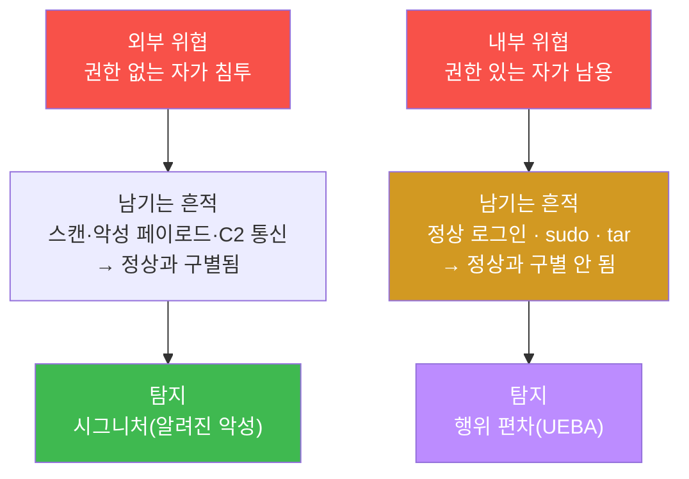
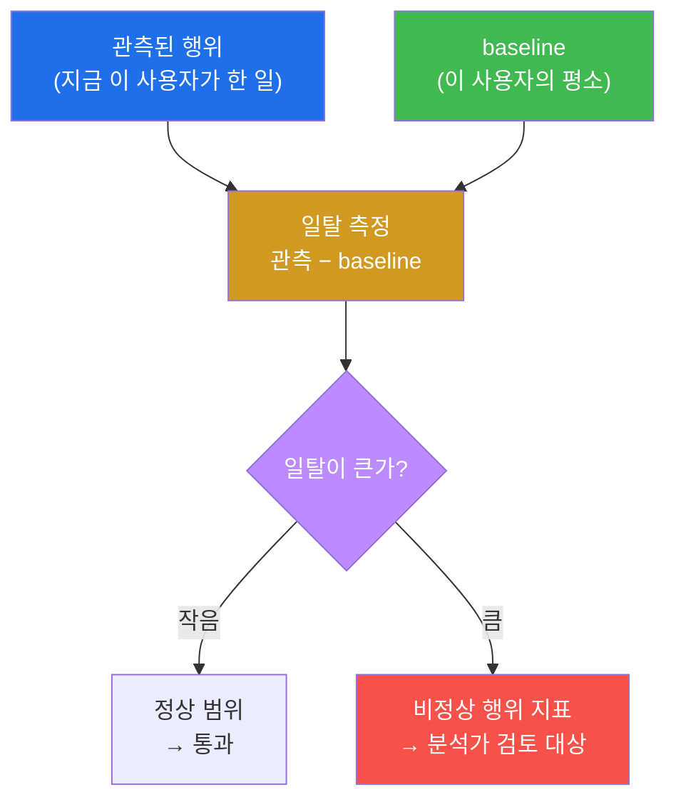
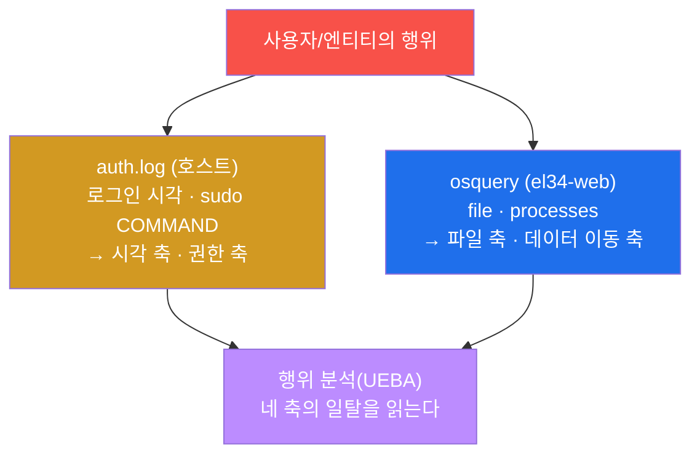
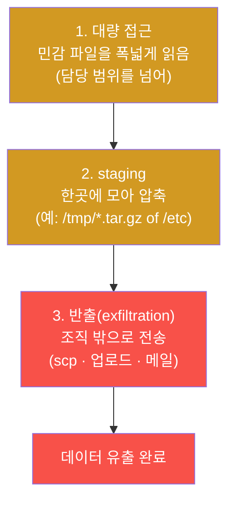
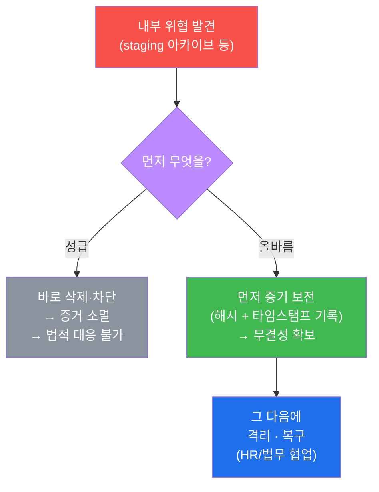
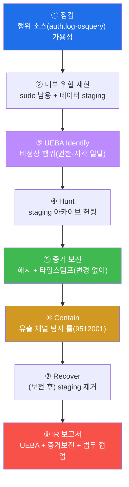
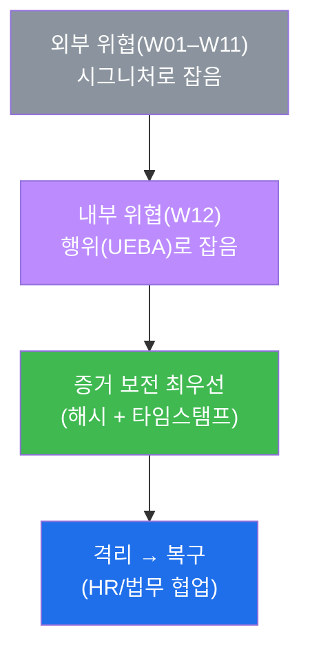
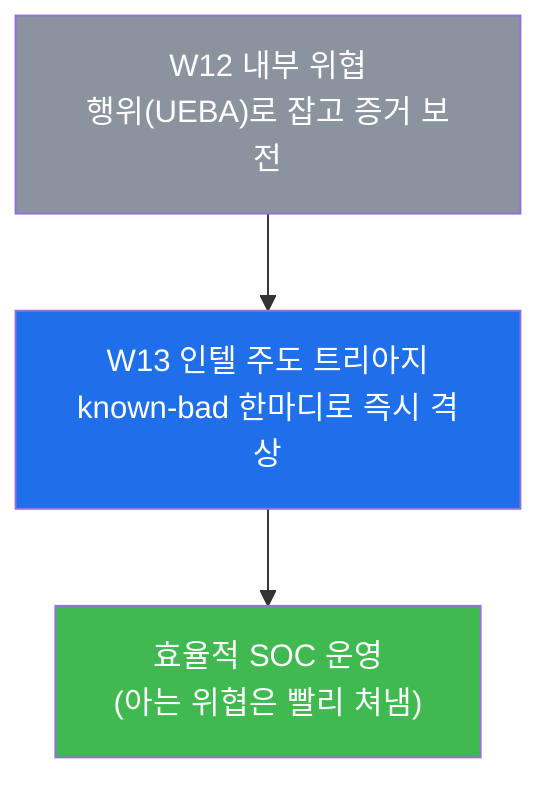

# SOC W12 — 내부 위협: 인가된 사용자의 권한 남용을 UEBA로 잡고, 법적 대응을 위해 증거를 보전하기

> **본 주차의 한 줄 요약**
>
> 지금까지(W01~W11) 우리가 쫓은 적은 모두 **밖에서 들어오는** 공격자였다 — 포트를
> 스캔하고, 알려진 악성 도구(sqlmap)를 쓰고, 악성코드로 C2 에 전화하는 자들이다. 그들은
> "들어오는 길목"에서 시그니처로 잡혔다. 그런데 가장 막기 어려운 위협은 따로 있다. **이미
> 정당한 계정과 권한을 가진 사람**이, 그 권한을 정상 범위 밖으로 휘두를 때다. 들어오는
> 길목이 없으니 막을 문도 없고, 쓰는 도구가 정상 시스템 명령(`sudo`, `tar`)이니 "악성
> 시그니처"도 없다. 이것이 **내부 위협(insider threat)** 이다. 본 주차에 학생은, 시그니처가
> 통하지 않는 이 적을 잡는 유일한 방법인 **UEBA(사용자·엔티티 행위 분석)** 를 배운다. 핵심
> 발상은 "악성인가?"가 아니라 **"평소와 다른가?"** 다 — 그 사람의 평상시 행동(baseline)을
> 알아야, 그로부터의 **일탈(편차)** 이 보인다. 그리고 외부 위협 대응과 결정적으로 다른 한
> 가지 — 내부 위협은 **법적·인사적 후속 조치**가 따르므로, 무엇보다 먼저 **증거를 변경 없이
> 보전**해야 한다.
>
> **분석가 한 줄 결론**: 외부 위협은 "무엇이 악성인가"를 알면 잡힌다. 내부 위협은 "이 사람의
> 평소가 무엇인가"를 알아야 잡힌다. 그리고 잡았다면 — 지우기 전에 **증거부터 보전**한다.
> 내부 위협 대응의 첫 단추는 기술이 아니라 무결성(법적 증거능력)이다.

---

## 학습 목표

본 주차 종료 시 학생은 다음 6가지를 **본인 손으로** 할 수 있어야 한다.

1. **내부 위협(insider threat)** 이 외부 위협과 무엇이 근본적으로 다른지 — 길목·시그니처·
   도구의 세 측면에서 — 설명하고, 왜 기존 시그니처 기반 탐지가 내부자에게 무력한지 근거를
   대 말한다.
2. **UEBA(사용자·엔티티 행위 분석)** 의 핵심 발상인 "**baseline 대비 일탈**"을 이해하고,
   행위를 네 축(로그인 시각 / 권한 사용 / 파일 접근 / 데이터 이동)으로 나눠 각 축의 정상과
   이상을 구분한다.
3. el34 호스트에서 내부 위협의 두 가지 대표 행위 — **`sudo` 권한 남용**과 **데이터
   staging(민감 파일 압축)** — 을 직접 재현하고, 그 흔적이 행위 소스(`auth.log` / osquery)에
   어떻게 남는지 증거와 함께 식별한다.
4. **비정상 행위 지표(anomaly indicator)** — `auth.log` 의 `sudo ... COMMAND` 패턴과 비업무
   시간 로그인, osquery 가 보여주는 `/tmp/*.tar.gz` staging 아카이브 — 를 헌팅 명령으로
   찾아내고, 이것이 "유출 직전 신호"인 이유를 설명한다.
5. 내부 위협 대응에서 다른 모든 기술 조치에 **앞서는** 단계가 **증거 보전(evidence
   preservation)** 임을 이해하고, 파일의 `sha256` 해시와 타임스탬프를 변경 없이 기록해
   무결성(법적 증거능력)을 확보한다.
6. 증거를 보전한 뒤 비로소 진행하는 **격리(유출 채널 탐지 룰) → 복구(staging 제거)** 를
   수행하고, 내부 위협 IR 이 **HR·법무 협업**을 전제로 한다는 절차적 차이를 한 장의 IR
   보고서로 종합한다.

> **본 주차의 시선** — W12 는 새 침투 기법을 배우는 주가 아니다. **적의 성격이 바뀌는** 주다.
> 지금까지는 "밖의 악당"을 시그니처로 잡았다면, 이번엔 "안의 정상 계정"을 행위로 잡는다.
> 채점은 "내부자가 있었다"는 선언이 아니라, **무엇이 baseline 으로부터 일탈했는가**(UEBA),
> 그 일탈을 **어떤 증거로 입증했는가**, 그리고 그 증거를 **법적으로 쓸 수 있게 보전했는가**를
> 본다.

---

## 0. 용어 해설 (내부 위협·행위 분석의 핵심어)

본 주차는 처음 등장하는 용어가 많다. 처음 보는 말이 본문에 나오면 본 표로 돌아와 확인하면
흐름이 끊기지 않는다. 헷갈리기 쉬운 핵심어는 표 아래에서 일상 비유로 다시 풀어 설명한다.

| 용어 | 영문 | 뜻 | 비유 |
|------|------|----|------|
| **내부 위협** | insider threat | 인가된 사용자(직원·협력사 등)가 정당한 권한을 악용·남용해 조직에 해를 끼치는 위협 | 열쇠를 정식으로 받은 직원이 금고를 터는 것 |
| **UEBA** | User and Entity Behavior Analytics | 사용자·엔티티의 행위를 baseline 과 비교해 일탈을 탐지하는 분석 기법 | 평소 출퇴근 패턴을 알아야 "오늘 이상하다"가 보임 |
| **엔티티** | entity | 사용자뿐 아니라 호스트·서비스 계정·디바이스 등 행위 주체 전반 | 사람 + 자동문 + 사무기기까지 |
| **baseline** | baseline | 특정 주체의 평상시 정상 행동 기준선 | 어떤 사람의 "평소 모습" |
| **일탈 / 편차** | deviation / anomaly | baseline 에서 벗어난 정도 — 클수록 의심 | 평소와 다른 행동의 크기 |
| **비정상 행위 지표** | anomaly indicator | 일탈을 가리키는 구체적 신호(야간 로그인, sudo 다발, 대량 접근 등) | "평소답지 않음"의 구체적 단서 |
| **권한 남용** | privilege abuse | 가진 권한을 정당한 업무 범위를 벗어나 사용 | 회계 권한으로 남의 급여를 들춰보기 |
| **sudo** | superuser do | 일반 사용자가 일시적으로 관리자(root) 권한으로 명령을 실행하는 도구 | 잠깐 빌리는 마스터 키 |
| **데이터 staging** | data staging | 유출 전에 데이터를 한곳에 모으고 압축하는 준비 작업 | 훔칠 물건을 가방에 미리 담아두기 |
| **데이터 유출** | data exfiltration | staging 한 데이터를 조직 밖으로 빼내는 행위 | 가방을 들고 건물을 나가기 |
| **유출 체인** | exfiltration chain | 대량 접근 → staging(압축) → 외부 전송으로 이어지는 일련의 단계 | 모으기 → 담기 → 들고 나가기 |
| **증거 보전** | evidence preservation | 로그·파일을 변경 없이 보존해 무결성을 입증하는 일 | 범행 현장을 손대지 않고 봉인 |
| **무결성** | integrity | 증거가 채집 후 단 1바이트도 바뀌지 않았음 | 봉인이 뜯기지 않았음 |
| **해시** | hash (SHA-256) | 데이터를 고정 길이 지문으로 환산한 값 — 1바이트만 바뀌어도 전혀 달라짐 | 파일의 지문 |
| **포렌식** | digital forensics | 법적 증거능력을 갖춰 디지털 증거를 수집·분석하는 절차 | 과학수사 |
| **DLP** | Data Loss Prevention | 데이터 유출을 탐지·차단하는 운영 솔루션 | 출구의 도난방지 게이트 |
| **HR/법무 협업** | HR/Legal collaboration | 내부 위협은 인사·법적 후속이 따르므로 두 부서와 함께 대응 | 사내 징계·소송 절차 동반 |
| **self-clean** | — | 실습에서 만든 흔적(staging·룰)을 끝에 스스로 제거해 공유 인프라를 원상복구 | 실습 후 책상 정리 |

> **헷갈리기 쉬운 한 쌍 — 외부 위협 vs 내부 위협.** 둘의 차이는 "어디서 오느냐"만이 아니다.
> **외부 위협**은 권한이 **없는** 자가 권한을 **얻으려** 침투한다 — 그래서 침투 시도 자체가
> 비정상이고, 알려진 도구·패턴이 **시그니처**로 잡힌다. **내부 위협**은 권한이 **있는** 자가
> 그 권한을 **남용**한다 — 로그인도 정상, 명령도 정상 시스템 명령이라 "악성"이라는 꼬리표를
> 붙일 게 없다. 그래서 외부는 "무엇이 악성인가"(시그니처)로, 내부는 "이 사람의 평소와
> 다른가"(행위/UEBA)로 잡는다. 본 주차의 전환점이 바로 이 한 쌍이다.

> **헷갈리기 쉬운 또 한 쌍 — staging vs 유출.** **staging** 은 유출 **직전의 준비**다 — 흩어진
> 민감 파일을 한곳에 모으고 압축하는 단계(예: `/etc/passwd` 를 `/tmp/*.tar.gz` 로). 아직 밖으로
> 나가지 않았다. **유출(exfiltration)** 은 그 압축본을 실제로 조직 밖으로 보내는 단계다.
> 분석가에게 staging 이 중요한 이유는, **유출이 일어나기 전에** 잡을 수 있는 마지막 신호이기
> 때문이다. "압축 파일이 생겼다"를 보면 "곧 나간다"를 의심해야 한다.

---

## 0.5 신입생 친화 핵심 개념 — UEBA 를 한 문장으로

UEBA 는 이름이 길고 어렵게 들리지만, 발상은 매우 단순하다. 일상 비유로 풀어보자.

학생이 매일 같은 시간에 같은 길로 등교한다고 하자. 어느 날 새벽 3시에 학교 후문으로 누군가
들어가는 것이 CCTV 에 찍혔다. 경비원이 "저게 누구지?"가 아니라 **"이 시간에, 이 문으로는
원래 아무도 안 다니는데?"** 라고 느끼는 그 순간 — 그게 바로 UEBA 다.

핵심은 두 단계다.

1. **baseline 을 안다.** "이 학교는 보통 오전 8~9시에 정문으로 사람이 들어온다." 이 평상시
   패턴을 알아야 한다. 모르면 새벽 3시 후문 출입도 "그러려니" 한다.
2. **일탈을 잰다.** 관측된 행동이 baseline 에서 얼마나 벗어났는지를 본다. 새벽 3시(시각
   일탈) + 후문(경로 일탈)이면 일탈이 크다 → 의심.

여기서 두 가지를 반드시 이해해야 한다.

- **UEBA 는 "선악"을 판단하지 않는다.** 새벽 3시 출입이 곧 범죄는 아니다 — 야간 점검일 수도
  있다. UEBA 가 하는 일은 "**평소와 다르다**"는 **신호를 올리는 것**까지다. 그 신호가 진짜
  악행인지 정당한 사유인지는 분석가가 맥락(누가·왜)을 더해 판정한다. 그래서 UEBA 의 산출물은
  "유죄 판결"이 아니라 "**우선 들여다볼 대상**"이다.
- **그래서 오탐(false positive)이 본질적으로 따라온다.** "평소와 다름"의 상당수는 합법적인
  예외(긴급 야근, 새 업무 인수)다. 외부 위협의 시그니처 탐지보다 오탐률이 높을 수밖에 없다.
  이것은 UEBA 의 결함이 아니라 **성질**이다 — 시그니처가 없는 적을 잡는 대가다.

el34 에서 우리가 보는 행위의 원천은 두 가지다 — 호스트의 **`auth.log`**(누가 언제 로그인했고,
누가 `sudo` 로 무슨 명령을 썼나)와 **osquery**(어떤 파일이 생겼고, 어떤 프로세스가 도나).
W02 에서 `auth.log` 를, W06–W07 에서 osquery 를 이미 다뤘으니, 본 주차는 그 두 소스를 **행위
분석의 눈**으로 다시 읽는다.

---

## 1. 가장 까다로운 위협 — 왜 내부자는 시그니처로 안 잡히는가

### 1.1 한 줄 답: 들어오는 길목도, 악성 도구도 없기 때문

W01–W11 의 모든 탐지는 공통 전제 위에 있었다 — **"악성은 정상과 구별되는 무언가를 남긴다."**
포트 스캔은 비정상적으로 많은 연결을, sqlmap 은 특유의 페이로드와 User-Agent 를, C2 비콘은
비표준 포트로의 주기적 외부 통신을 남긴다. 그 "구별되는 무언가"가 곧 **시그니처**이고,
방화벽·IDS·WAF·SIEM 이 그것을 잡았다.

내부 위협은 이 전제를 무너뜨린다.



세 가지가 동시에 무력해진다. 첫째, **길목이 없다.** 내부자는 이미 안에 있으므로 "들어오는"
순간이 없다 — 경계(perimeter)에서 잡을 기회 자체가 없다. 둘째, **시그니처가 없다.** 그가 쓰는
도구는 `sudo`, `tar`, `scp` 같은 정상 시스템 명령이다 — "이 명령은 악성"이라고 룰을 쓰면 정상
운영까지 다 막힌다. 셋째, **인증이 정상이다.** 정당한 계정으로 정상 비밀번호로 로그인하므로
`Failed password` 도, `Invalid user` 도 남지 않는다. W02 에서 배운 무차별 대입의 신호가 전혀
나타나지 않는 것이다.

### 1.2 그렇다면 무엇이 남는가 — "맥락의 부자연스러움"

내부자가 시그니처를 남기지 않는다고 해서 흔적이 **전혀** 없는 것은 아니다. 남는 것은
"악성"이라는 꼬리표가 아니라 **맥락의 부자연스러움**이다. 같은 `sudo` 명령이라도, **평소 그
계정이 쓰지 않던** 명령을, **평소가 아닌 시각**에, **평소보다 훨씬 많이** 쓰면 — 명령 자체는
정상이어도 그 **패턴**은 비정상이다. 같은 파일 읽기라도, 자기 담당 범위를 넘어 **대량의 민감
파일**을 건드리고 그걸 **압축**하면 — 읽기 자체는 권한 내여도 그 **조합**은 유출의 전조다.

그래서 내부 위협 탐지의 단위는 "한 이벤트가 악성인가"가 아니라 **"이 일련의 행동이 그 사람의
평소에서 얼마나 벗어났는가"** 다. 이 발상의 전환이 곧 UEBA 이며, §2 에서 그 틀을 세운다.

### 1.3 왜 이것이 가장 까다로운가 — 두 가지 어려움

내부 위협이 "가장 까다로운 위협"으로 불리는 데는 두 가지 이유가 있다.

첫째, **탐지의 어려움**이다. 위에서 본 대로 시그니처가 없으니 행위로만 잡아야 하고, 행위
탐지는 baseline 이라는 까다로운 전제(그 사람의 평소를 알아야 함)와 높은 오탐률을 동반한다.

둘째, **대응의 어려움**이다. 이것이 외부 위협과 결정적으로 다른 지점이다. 외부 공격자는 그냥
차단하고 흔적을 지우면 끝이지만, 내부자는 **조직 구성원**이다 — 잘못 지목하면 무고한 직원을
범죄자로 모는 것이고, 진짜 악행이면 **징계·해고·민형사 소송**으로 이어진다. 따라서 대응은
기술만의 문제가 아니라 **HR·법무가 함께하는 절차**이며, 그 절차의 출발점은 "지우기"가 아니라
**"증거 보전"** 이다(§5). 함부로 staging 파일을 지웠다가는 — 그게 유일한 증거였다면 — 소송에서
질 수 있다.

### 1.4 한계 — 이 주차가 다루지 않는 것

본 주차는 내부 위협 탐지·대응의 **SOC 분석가 관점**을 다룬다. 따라서 다음은 범위 밖이다.
**HR·법무의 실제 처분 절차**(징계위원회, 소송 전략)는 SOC 의 일이 아니라 그 부서들의
영역이므로 다루지 않는다 — 다만 SOC 가 그들과 협업해야 한다는 **절차적 사실**과, 협업의
전제인 증거 보전은 다룬다. 또한 본 주차의 재현은 **통제된 시연**이다 — 실제 동료의 계정을
감시하거나 사찰하는 것이 아니라, el34 의 `el34-web` 위에서 내부자 행위를 모사해 "그 흔적이
어떻게 남고 어떻게 보전하는가"를 학습한다. 그리고 모든 실습 흔적은 **self-clean**(끝에 스스로
제거)으로 공유 인프라를 원상 복구한다.

---

## 2. UEBA — 행위 baseline 과 일탈

### 2.1 한 줄 정의와 왜 중요한가

**UEBA(User and Entity Behavior Analytics)** 는 사용자와 엔티티(호스트·서비스 계정 등)의
행위를 **평상시 기준선(baseline)** 과 비교해, 그로부터의 **일탈(편차)** 을 탐지하는 분석
기법이다. "사용자(User)"뿐 아니라 "엔티티(Entity)"를 포함하는 이유는, 위협의 주체가 사람만이
아니기 때문이다 — 탈취된 서비스 계정, 감염된 호스트도 "평소와 다르게" 행동하므로 같은 틀로
본다.

UEBA 가 중요한 이유는 §1 에서 본 그대로다 — **시그니처가 없는 적**(내부자, 탈취된 정상 계정)을
잡는 사실상 유일한 방법이기 때문이다. 시그니처 탐지가 "알려진 악(惡)의 목록과 대조"라면,
UEBA 는 "이 주체의 평소와 대조"다. 전자는 새로운 악을 못 잡지만, 후자는 **무엇을 하든 평소와
다르면** 신호를 올린다.

### 2.2 baseline 과 일탈 — 탐지의 두 기둥

UEBA 의 동작은 항상 두 단계다.



여기서 baseline 이 모든 것의 전제다. **baseline 이 부정확하면 UEBA 전체가 무너진다.** baseline
이 너무 좁으면(정상 행동을 일부만 학습) 정상 변주마다 경보가 터져 오탐 폭주가 일어나고,
baseline 이 너무 넓으면(이상까지 정상으로 학습) 진짜 일탈을 놓친다. 그래서 운영 환경의 UEBA 는
충분한 기간(보통 수 주) 동안 정상 행동을 학습해 baseline 을 세운 뒤에야 일탈을 잰다. 본
실습에서는 학습 기간 없이, **"무엇이 baseline 으로부터 일탈인가"를 사람이 직접 읽는 법**에
집중한다 — 즉 자동화된 점수가 아니라, 분석가가 `auth.log`/osquery 를 보며 "이건 평소답지 않다"를
판단하는 훈련이다.

### 2.3 행위의 네 축 — 무엇을 baseline 으로 잡는가

사용자의 행위는 여러 차원으로 쪼갤 수 있지만, 내부 위협 탐지에서 가장 신호가 강한 것은 다음
**네 축**이다. 각 축마다 "정상은 무엇이고, 어떤 모습이 내부 위협의 신호인가"를 알아야 한다.

| 행위 축 | 정상(baseline) | 이상(내부 위협 신호) | el34 의 관측 소스 |
|---------|----------------|----------------------|-------------------|
| **로그인 시각** | 업무 시간대에 로그인 | 심야·주말 로그인(감시가 느슨한 때를 노림) | `auth.log` 의 `Accepted` 시각 |
| **권한 사용** | 늘 쓰던 소수의 명령 | 갑작스러운 `sudo` 다발, 평소 안 쓰던 관리 명령 | `auth.log` 의 `sudo ... COMMAND` |
| **파일 접근** | 자기 담당 범위 | 담당 밖 대량·민감 파일 접근 | osquery `file` / 접근 흔적 |
| **데이터 이동** | 거의 없음 | staging(압축) → 외부 전송 시도 | osquery `file`(`/tmp/*.tar.gz`) |

이 네 축은 따로 보면 약한 신호지만, **여러 축이 동시에** 일탈하면 강한 신호가 된다. 예를 들어
"심야(시각 일탈)에 로그인해 + 평소 안 쓰던 `sudo`(권한 일탈)로 + `/etc` 의 민감 파일을 대량
읽어(파일 일탈) + `/tmp` 에 `.tar.gz` 로 압축(이동 일탈)"이면 — 명령 하나하나는 정상이지만 네
축이 모두 일탈했으므로 **유출 준비**를 강하게 의심한다. UEBA 의 힘은 이렇게 **여러 약한 신호의
누적**에서 나온다.

> **용어 짚기 — 왜 "시각"이 신호인가.** 내부자가 심야·주말을 노리는 이유는 단순하다 — 감시가
> 느슨하고, 동료의 눈이 없고, 시스템 부하가 적어 대량 작업이 티가 덜 나기 때문이다. 그래서
> "평소 주간에만 일하던 계정의 새벽 3시 활동"은 그 자체로 약한 일탈 신호다. 다만 정당한 야근도
> 있으므로(§0.5), 시각 한 축만으로 단정하지 않고 다른 축과 함께 본다.

### 2.4 el34 에서의 행위 소스 — auth.log 와 osquery

el34 에는 상용 UEBA 엔진이 없지만, UEBA 가 보는 **행위 원천 데이터**는 그대로 있다. 분석가는
이 원천을 직접 읽어 일탈을 판단한다.



- **`auth.log`**(호스트 `/var/log/auth.log`) — W02 에서 배운 인증 로그다. 로그인 성공
  (`Accepted`)의 **시각**으로 로그인 시각 축을, `sudo ... COMMAND` 줄로 **권한 사용 축**을
  본다. 계정 `ccc` 는 `adm` 그룹이라 `sudo` 없이 이 파일을 읽을 수 있다(W02).
- **osquery**(`el34-web` 에 설치된 5.23.0) — W06–W07 에서 배운, OS 를 SQL 테이블로 추상화하는
  도구다. `file` 테이블로 `/tmp/*.tar.gz` 같은 **staging 아카이브**(파일 축 + 데이터 이동
  축)를, `processes` 로 의심 프로세스를 헌팅한다.

두 소스가 행위의 네 축을 나눠 담당한다 — `auth.log` 가 "사람이 언제·무슨 권한을 썼나"를, osquery
가 "그 결과 시스템에 무엇이 생겼나"를 보여준다. 본 주차의 실습은 이 두 소스를 UEBA 의 눈으로
교차해 읽는다.

---

## 3. 유출 체인 — 접근에서 반출까지

내부 위협의 가장 흔한 목적은 **데이터 유출(exfiltration)** 이다. 유출은 한 번에 일어나지 않고
여러 단계를 거치는데, 이 단계들을 **유출 체인**이라 한다. 체인의 각 단계를 알아야 "지금 어느
단계인가"를 식별하고, **반출 전에** 끊을 수 있다.

### 3.1 유출 체인의 세 단계



분석가에게 가장 중요한 단계는 **2. staging** 이다. 그 이유는 명확하다 — 1단계(대량 접근)는
권한 내 행위라 정상과 구별이 어렵고, 3단계(반출)는 이미 데이터가 나간 **사후**다. 그 사이의
staging, 즉 **"민감 파일이 압축되어 한곳에 모인 순간"** 이 **반출 전에 잡을 수 있는 마지막
기회**다. `/etc/passwd` 가 갑자기 `/tmp/*.tar.gz` 안에 들어가 있다면, 그것은 곧 나가려는
짐가방이다.

### 3.2 staging 이 왜 강한 신호인가

정상 운영에서 `/tmp` 에 `/etc` 의 민감 파일을 압축해 둘 일은 거의 없다. 시스템 백업은 지정된
백업 경로와 백업 도구를 쓰지, 사용자 `/tmp` 에 임시 아카이브를 만들지 않는다. 그래서
"**`/tmp/*.tar.gz` 안에 민감 시스템 파일**"이라는 조합은 — 각 요소(tar 명령, /tmp 디렉터리,
/etc 파일 읽기)는 모두 정상이지만 — 그 **조합**이 baseline 에서 크게 벗어난, 유출 직전의 강한
지표다. 본 주차의 실습(미션 2·4)에서 정확히 이 staging 을 재현하고 osquery 로 헌팅한다.

### 3.3 한계 — staging 이 없는 유출도 있다

유출이 항상 staging 을 거치는 것은 아니다. 적은 양이면 압축 없이 바로 메일에 첨부하거나
클립보드로 복사할 수도 있고, 암호화·인코딩으로 staging 흔적을 숨길 수도 있다. 그래서 staging
헌팅은 **강력하지만 만능은 아니다.** 운영 환경에서는 staging 탐지에 더해, 출구에서 데이터
반출 자체를 감시하는 **DLP(Data Loss Prevention)** 와, 네트워크 전송량 이상 탐지를 함께 둔다.
본 주차의 격리(미션 6)에서 만드는 ".tar.gz 전송 탐지 룰"이 바로 이 DLP 발상의 축소판이다.

---

## 4. 비정상 행위 지표 읽기 — 무엇을 어디서 어떻게 보나

UEBA 의 발상을 실제 명령으로 옮긴다. 모든 명령은 el34 호스트(`ssh ccc@192.168.0.151`, 비밀번호
1)에서 실행한다. 인증 로그는 호스트의 `/var/log/auth.log` 를 직접 읽고, 파일/프로세스 행위는
`docker exec el34-web` 의 osquery 로 본다.

### 4.1 권한 사용 축 — sudo COMMAND 패턴 (auth.log)

`sudo` 를 쓸 때마다 sshd/sudo 는 `auth.log` 에 "누가, 어느 디렉터리에서, 어떤 명령을
실행했는가"를 한 줄로 남긴다. 이 줄에 `COMMAND=` 가 들어간다.

```bash
grep -aE "sudo:.*COMMAND" /var/log/auth.log | tail -8
```

무엇을 보나 — **권한 사용 축**의 일탈이다. `COMMAND=` 뒤에 평소 그 계정이 쓰지 않던 관리
명령(`tar`, `cat /etc/shadow`, `useradd` 등)이 **갑자기 다수** 나타나면 권한 남용의 신호다.
`grep -a` 의 `-a` 는 로그를 바이너리로 오인해 출력이 잘리는 것을 막아 텍스트로 강제하는
옵션이다(W02). 한 번의 정당한 `sudo` 는 정상이지만, "평소엔 거의 안 쓰던 계정의 sudo 다발"은
baseline 일탈이다.

> **용어 짚기 — sudo 로그의 구조.** `auth.log` 의 sudo 줄은 보통 `sudo: <user> : ... ;
> COMMAND=<실행한 명령>` 형태다. 분석가는 `<user>`(누가)와 `COMMAND=`(무엇을)를 보고, 그
> 계정의 **평소 명령 집합**과 비교해 일탈을 판단한다.

### 4.2 로그인 시각 축 — Accepted 의 시각 (auth.log)

로그인 성공은 `auth.log` 에 `Accepted` 줄로 남는다(W02). 여기서 우리가 보는 것은 W02 와 달리
"성공했는가"가 아니라 **"언제 성공했는가"** 다.

```bash
grep -a "Accepted" /var/log/auth.log | tail -10
```

무엇을 보나 — **로그인 시각 축**의 일탈이다. 각 줄 앞머리의 타임스탬프를 보고, 평소 업무
시간대(예: 09–18시)를 벗어난 **심야·주말** 로그인이 있는지 본다. 내부자는 감시가 느슨한 때를
노리므로 비업무 시간 로그인은 약한 일탈 신호다. 단, §0.5 에서 강조했듯 정당한 야근도 있으니
이 한 축만으로 단정하지 않고 권한·파일 축과 함께 본다.

### 4.3 데이터 이동 축 — staging 아카이브 헌팅 (osquery)

osquery 의 `file` 테이블은 파일 시스템을 SQL 로 질의하게 해준다(W06). 이걸로 유출 직전의
staging 아카이브를 찾는다.

```bash
docker exec el34-web osqueryi --json 'SELECT path,size FROM file WHERE path="/tmp/socw12_exfil.tar.gz";'
```

무엇을 보나 — **데이터 이동 축**의 일탈이다. `/tmp` 에 민감 파일을 압축한 `.tar.gz` 가
존재하면, 그것은 유출 직전 staging 이다(§3). `path`(어디에)와 `size`(얼마나)가 반환되면
staging 이 실재한다는 증거다. 운영 헌팅에서는 `path LIKE "/tmp/%.tar.gz"` 처럼 패턴으로 넓게
훑어 의심 아카이브 전반을 찾는다 — 압축본의 **위치(`/tmp` 등 비표준)** 와 **내용(민감 파일)** 이
핵심 단서다.

> **용어 짚기 — osqueryi --json.** `osqueryi` 는 osquery 의 대화형 셸이고, `--json` 은 결과를
> JSON 으로 출력하는 옵션이다(W06). 한 번의 질의로 파일의 경로·크기·수정시각 등을 표 형태로
> 얻을 수 있어, "지금 시스템에 무엇이 있나"를 스냅숏으로 본다.

### 4.4 네 축을 합쳐 읽기 — 하나의 일탈 그림

위 세 명령(권한·시각·데이터 이동)을 따로 보면 약한 신호지만, **같은 시간대에 같은 계정에서
함께** 나타나면 강한 일탈이 된다. 분석가는 이 신호들을 한 그림으로 엮는다.

| 행위 축 | 읽는 곳 | 일탈 신호 | 단독 강도 | 합쳐졌을 때 |
|---------|---------|-----------|-----------|-------------|
| 권한 사용 | `auth.log` `sudo ... COMMAND` | 평소 안 쓰던 명령 다발 | 약 | ↑ |
| 로그인 시각 | `auth.log` `Accepted` 시각 | 심야·주말 | 약 | ↑ |
| 데이터 이동 | osquery `file` `/tmp/*.tar.gz` | 민감 파일 압축본 존재 | 중 | **강(유출 준비)** |

이 표를 손으로 채워 "네 축 중 몇 개가 일탈했는가"를 말할 수 있으면, UEBA 의 핵심 사고를 갖춘
것이다. 명령 하나하나는 정상이어도, **여러 축의 동시 일탈**이 곧 내부 위협의 서사다.

---

## 5. 증거 보전 — 다른 모든 조치에 앞서는 단계

여기서 내부 위협 대응이 외부 위협과 **결정적으로** 갈린다. 외부 공격은 격리하고 흔적을 지우면
끝이지만, 내부 위협은 **법적·인사적 후속**(징계·소송)이 따른다. 그래서 무엇을 지우거나 바꾸기
**전에**, 증거를 **변경 없이 보전**해야 한다.

### 5.1 왜 증거 보전이 최우선인가



성급하게 staging 파일을 지우면, 그게 유일한 물증이었을 경우 **법적 대응이 불가능**해진다.
포렌식의 제1원칙은 "원본을 손대지 않는다"이며, 손댄 증거는 법정에서 증거능력을 잃을 수 있다.
그래서 내부 위협 대응의 첫 행동은 — IR 라이프사이클(W09)의 Identify 와 Contain **사이에** —
**증거 보전**이다. 이 한 단계가 빠지면 이후 모든 기술 조치가 법적으로 무의미해질 수 있다.

### 5.2 무결성 입증 — 해시와 타임스탬프

"변경 없이 보전했다"를 어떻게 **증명**하는가? 핵심 도구가 **해시(SHA-256)** 다. 해시는 파일을
고정 길이 지문으로 환산한 값으로, 파일이 **1바이트만 바뀌어도 전혀 다른 값**이 나온다. 따라서
증거 채집 시점의 해시를 기록해 두면, 나중에 "이 파일이 그때 그대로인가"를 해시 재계산으로
입증할 수 있다 — 해시가 같으면 무결성이 보존된 것이다.

```bash
docker exec el34-web sh -c 'sha256sum /tmp/socw12_exfil.tar.gz; stat -c "%y %s" /tmp/socw12_exfil.tar.gz'
```

무엇을 보나 — `sha256sum` 은 파일의 **지문(해시)** 을, `stat -c "%y %s"` 는 파일의 **수정
시각(`%y`)과 크기(`%s`)** 를 출력한다. 이 둘을 기록하면 "언제 만들어진, 어떤 내용의 파일을,
어떤 지문 상태로 확보했다"가 입증된다. 이것이 법무·포렌식에 넘길 **증거의 무결성 기록**이다.
중요한 점 — 이 명령들은 파일을 **읽기만** 할 뿐 **바꾸지 않는다.** 증거 보전은 항상 비파괴
방식이어야 한다.

> **용어 짚기 — 왜 SHA-256 인가.** 해시 함수는 입력이 조금만 달라도 출력이 완전히 달라지는
> 성질(쇄도 효과)을 가진다. SHA-256 은 256비트 해시로, 서로 다른 두 파일이 우연히 같은
> 해시를 가질 확률이 사실상 0 이라 무결성 입증에 널리 쓰인다. "해시가 같다 = 내용이 같다"로
> 신뢰할 수 있다.

### 5.3 증거를 보전한 뒤에야 — 격리와 복구

증거를 보전했다면, 이제 비로소 기술 조치로 넘어간다. 순서가 중요하다 — **보전 → 격리 →
복구**다.

- **격리(Contain)** — 유출 채널을 막는다. 본 실습은 공유 el34 를 보호하기 위해, Suricata
  로컬 룰에 **".tar.gz 전송 탐지 룰(sid 9512001)"** 을 추가해 유출 채널을 **탐지(flag)** 로
  시연하고, 검증 후 곧바로 제거한다(self-clean). 운영 환경에서는 이 자리에 **DLP 차단**과
  **계정 권한 동결(잠금)** 이 들어간다.
- **복구(Recover)** — **증거를 이미 보전했으므로** staging 파일을 제거할 수 있다. 그리고
  비인가 권한을 회수하고 재발을 감시한다.

이 모든 단계가 **HR·법무와 협업** 아래 진행된다는 점이 외부 위협 IR 과의 절차적 차이다. SOC 는
기술 증거와 대응을 책임지고, 처분은 HR·법무가 맡는다.

> **el34 실습 안전장치 — self-clean.** el34 는 여러 학생이 공유하므로, 실습에서 만든
> staging 파일과 Suricata 룰은 미션 끝에 **스스로 제거**한다. 증거 보전(미션 5)은 "보전했다"를
> 시연하는 단계이고, 복구(미션 7)에서 실제로 staging 을 지운다 — 보전이 먼저, 삭제가 나중이라는
> 순서를 실습으로 체득하게 설계돼 있다.

---

## 6. 내부 위협 대응 흐름 — 한눈에

지금까지의 UEBA 식별과 증거 우선 대응을 하나의 흐름으로 정리하면, 본 주차 lab 8 미션의
순서가 그대로 드러난다.



이 흐름에서 가장 강조할 한 가지 — **증거 보전(⑤)이 격리(⑥)·복구(⑦)보다 앞선다.** 외부 위협
IR(W09)에서는 식별 직후 곧바로 격리로 갔지만, 내부 위협에서는 그 사이에 증거 보전이 끼어든다.
이 순서가 내부 위협 대응의 핵심이며, 채점도 이 순서(보전 후 삭제)를 본다.

---

## 7. 실습 안내 — lab 8 미션 (4 축 설명)

본 주차 실습은 8 미션으로 구성되며, 위 §6 의 흐름을 그대로 따른다. 각 미션을 **4 축**으로
설명한다 — 왜 하는가 / 무엇을 알 수 있는가 / 결과 해석(정상 vs 비정상) / 실전 활용.

> **실습 진행 원칙.** 모든 명령은 el34 호스트(`ssh ccc@192.168.0.151`, 비밀번호 1)에서
> 실행한다. 인증 행위는 호스트 `/var/log/auth.log`, 파일/프로세스 행위는 `docker exec
> el34-web` osquery, 유출 채널 격리는 `docker exec el34-ips` 의 Suricata 로컬 룰이다. 만든
> staging 파일과 룰은 **self-clean**(미션 끝에 제거)으로 공유 인프라를 보존한다. 합격
> 임계값은 0.7 이다.

### 미션 1 — 점검: 행위 소스가 준비됐나 (8점)

> **왜 하는가?** UEBA 분석의 전제는 읽을 행위 소스가 모두 살아 있어야 한다는 것이다. 분석가는
> 사건을 파기 전에 항상 데이터 소스의 가용성부터 확인한다.
>
> **무엇을 알 수 있는가?** 두 행위 소스 — 호스트 `auth.log`(로그인 시각·sudo 권한 사용)와
> `el34-web` 의 osquery(파일·프로세스) — 가 존재·동작하는지. osquery 버전이 el34 표준인
> **5.23.0** 임을 확인한다.
>
> **결과 해석.** 정상: `auth.log` 가 존재하고 osquery 가 버전(5.23.0)을 응답. 비정상: 어느
> 하나라도 없으면 그 행위 축은 분석 불가 — 먼저 원인을 파악해야 한다.
>
> **실전 활용.** 내부 위협 조사 착수 전 첫 점검. 행위 소스가 비어 있으면 그 축은 못 보므로,
> 분석 범위를 시작부터 정확히 잡는다.

### 미션 2 — 내부 위협 재현: sudo 남용 + 데이터 staging (10점)

> **왜 하는가?** 분석 대상이 될 내부 위협 행위를 직접 재현해, 그 흔적이 행위 소스에 어떻게
> 남는지 출발점을 만든다. 핵심은 **정상 도구로 비정상 행위**를 만든다는 것 — sudo 와 tar 는
> 둘 다 정상 명령이지만, 그 사용 패턴이 일탈이다.
>
> **무엇을 알 수 있는가?** 권한 사용(`sudo`)이 `auth.log` 에, 데이터 staging(민감 파일을
> `/tmp/socw12_exfil.tar.gz` 로 압축)이 파일 시스템에 흔적을 남긴다는 것. 이 한 번의 재현이
> 이후 모든 분석·보전 미션의 원천 데이터다.
>
> **결과 해석.** 정상: sudo 사용과 staging 이 순서대로 실행되고 `insider done` 이 출력됨.
> 비정상: staging 이 빠지면 미션 4(헌팅)·5(보전)에서 아카이브가 안 보인다 — 재현부터 다시 한다.
>
> **실전 활용.** 탐지 역량 검증 시, 통제된 환경에서 알려진 내부자 행위를 재현해 "우리 행위
> 소스가 이 일탈을 다 보는가"를 점검하는 표준 절차.

### 미션 3 — UEBA Identify: 비정상 행위 (12점)

> **왜 하는가?** baseline 대비 일탈을 읽는 UEBA 의 핵심 동작을 수행한다 — 권한 사용 축과
> 로그인 시각 축에서 "평소답지 않음"을 식별한다.
>
> **무엇을 알 수 있는가?** `auth.log` 의 `sudo ... COMMAND` 패턴으로 권한 사용 일탈을, `Accepted`
> 시각으로 로그인 시각 일탈(야간?)을 읽는 법. "갑작스러운 sudo 다발 / 비업무 시간 로그인 = 행위
> 편차"라는 UEBA 의 판단 기준.
>
> **결과 해석.** 정상: `COMMAND` 가 포함된 sudo 줄이 보임 → 권한 사용 축의 일탈 식별 성공.
> 비정상: sudo 줄이 없으면 미션 2 의 재현을 점검.
>
> **실전 활용.** 내부 위협 조사의 1차 관점 — "이 계정이 평소와 다르게 권한을 쓰거나 이상한
> 시각에 들어왔나"를 인증 로그 한 곳에서 판단.

### 미션 4 — Hunt: 권한 남용 + staging (12점)

> **왜 하는가?** 식별된 일탈의 물증 — 데이터 이동 축의 staging 아카이브 — 을 osquery 로
> 헌팅한다. 유출 체인에서 **반출 전에 잡을 마지막 기회**인 staging 을 잡는 단계다.
>
> **무엇을 알 수 있는가?** osquery `file` 테이블로 `/tmp` 의 민감 파일 압축본을 찾는 법.
> "`/tmp/*.tar.gz` 안의 민감 파일 = 유출 직전 staging"이라는 신호 읽기. 대량 접근 → 압축 →
> 외부 전송이 유출 체인이라는 것.
>
> **결과 해석.** 정상: staging 아카이브(`...exfil.tar.gz`)가 경로·크기와 함께 헌팅됨.
> 비정상: 아무것도 안 나오면 미션 2 의 staging 재현을 점검.
>
> **실전 활용.** 내부 위협·유출 조사에서 "데이터가 나가기 전에 모인 흔적"을 호스트에서 잡는
> 핵심 헌팅 — DLP 와 함께 유출의 마지막 방어선.

### 미션 5 — 증거 보전: 변경 없이 해시 (12점)

> **왜 하는가?** 내부 위협 대응의 **최우선** 단계 — 격리·삭제 전에 증거를 변경 없이 보전한다.
> 이 단계가 빠지면 이후 모든 기술 조치가 법적으로 무의미해질 수 있다.
>
> **무엇을 알 수 있는가?** staging 파일의 `sha256` 해시와 타임스탬프(`stat`)를 기록해 무결성을
> 입증하는 법. "1바이트만 바뀌어도 해시가 달라진다"는 성질이 어떻게 무결성 증명이 되는지. 이
> 명령들이 파일을 **읽기만 하고 바꾸지 않는다**는 비파괴 원칙.
>
> **결과 해석.** 정상: 대상 파일명(`socw12_exfil`)과 함께 해시·타임스탬프가 출력됨 → 증거
> 보전 성공. 비정상: 파일이 없으면(미션 2 미실행/이미 삭제) 보전할 대상이 없다 — 순서를 점검.
>
> **실전 활용.** 포렌식·법무 대응의 출발점 — 증거의 무결성 기록(해시 + 시각)은 법정에서
> 증거능력의 근거가 된다. "지우기 전에 지문부터."

### 미션 6 — Contain: 유출 채널 격리 (sid 9512001) (12점)

> **왜 하는가?** 증거를 보전한 **뒤**, 유출 채널을 막는다. 공유 el34 를 보호하기 위해 차단
> 대신 **탐지(flag) 룰**로 시연하고 곧바로 정리(self-clean)한다.
>
> **무엇을 알 수 있는가?** Suricata 로컬 룰(`sid 9512001`)로 `.tar.gz` 전송을 탐지하는 룰을
> 작성 → 문법 검증(`suricata -T`) → 적용(`reload-rules`) → 삭제하는 룰 수명주기. 이것이 운영
> **DLP**(데이터 유출 차단)의 축소판이라는 것.
>
> **결과 해석.** 정상: 룰이 작성·검증되고 끝에 `rule_removed`(잔재 0)로 정리됨. 비정상: 문법
> 검증이 실패하면 룰 구문을, 잔재가 남으면 정리 단계를 점검.
>
> **실전 활용.** 유출 채널 차단의 표준 — 운영에서는 이 자리에 DLP 차단 + 계정 권한 동결이
> 들어간다. 격리는 **증거 보전 후**에 한다는 순서가 핵심.

### 미션 7 — Recover: 비인가 접근 제거 + 복구 (12점)

> **왜 하는가?** **증거를 이미 보전했으므로** staging 을 안전하게 제거하고 정상으로 되돌린다.
> "보전 후 삭제"라는 내부 위협 대응의 순서를 실습으로 완결한다.
>
> **무엇을 알 수 있는가?** staging 아카이브를 제거하고 잔재가 0 임을 확인하는 법. 증거(해시)는
> 미션 5 에서 보전했기에 원본 삭제가 정당하다는 절차적 근거. 계정 권한 검토·동결과 재발 감시가
> 복구에 포함된다는 것.
>
> **결과 해석.** 정상: staging 제거 후 `clean`(잔재 0). 비정상: `잔재!` 가 뜨면 제거가 안 된
> 것 — 경로를 점검. (단, 미션 5 의 증거 보전을 건너뛰고 여기로 오면 안 된다.)
>
> **실전 활용.** 내부 위협 복구는 HR·법무 협의 하에 진행 — 기술적 제거와 인사·법적 절차가
> 함께 간다. 증거를 보전했음을 전제로만 원본을 정리한다.

### 미션 8 — 내부 위협 IR 보고서 (10점)

> **왜 하는가?** 미션 1–7 을 한 서사로 묶어, 내부 위협 대응 능력을 문서로 입증한다 — 본 주차의
> 최종 산출물.
>
> **무엇을 알 수 있는가?** UEBA 식별(행위 편차) → staging 헌팅 → 증거 보전(해시) →
> 격리/복구(법무 협업)를 한 보고서로 종합하는 법. "내부 위협은 시그니처가 아닌 행위로 잡고,
> 증거 보전이 최우선"이라는 결론을 증거와 함께 쓰는 것.
>
> **결과 해석.** 정상: 보고서에 UEBA(행위 편차) + 증거 보전(해시/타임스탬프) + HR/법무 협업이
> 모두 포함됨. 비정상: 한 축이라도 빠지면 해당 미션으로 돌아가 보강.
>
> **실전 활용.** 내부 위협 사건 후 경영진·HR·법무에 제출하는 보고서의 표준 구조(행위 식별 →
> 헌팅 → 증거 보전 → 격리·복구·권고). 외부 위협 IR 보고서와 달리 **증거 보전과 법무 협업**이
> 명시돼야 한다.

---

## 8. 정리 — 외부에서 내부로, 시그니처에서 행위로

본 주차의 핵심을 세 문장으로 압축한다.

- **적의 성격이 바뀌었다.** 인가된 사용자의 권한 남용(내부 위협)은 길목도 시그니처도 없어,
  "무엇이 악성인가"가 아니라 **"이 사람의 평소와 다른가"**(UEBA)로 잡는다.
- **행위를 네 축으로 읽는다.** 로그인 시각 · 권한 사용 · 파일 접근 · 데이터 이동의 baseline
  대비 일탈을 `auth.log` 와 osquery 로 본다 — 약한 신호 여러 개가 겹치면 강한 서사가 된다.
- **지우기 전에 보전한다.** 내부 위협은 법적·인사적 후속이 따르므로, 다른 모든 조치에 앞서
  **증거를 변경 없이 보전**(해시 + 타임스탬프)하고, 그 뒤에 격리·복구를 HR·법무와 함께 한다.



---

## 9. 다음 주차 (W13) 예고 — 인텔 주도 트리아지

W12 에서 우리는 시그니처 없는 적(내부자)을 **행위**로 잡았다. 이제 시선을 다시 돌려, **이미
알려진 위협**을 더 빨리 쳐내는 법을 본다. W13 은 **인텔 주도 트리아지**다 — 같은 경보라도
"이 출발지/도구는 알려진 악성(known-bad)"이라는 위협 인텔 한마디가 붙으면, 조사하기 전에
우선순위가 정해져 트리아지가 확 빨라진다. el34 의 OpenCTI/MISP 와 Wazuh CDB list 를 엮어,
인텔이 어떻게 SOC 의 처리량을 끌어올리는지를 다룬다 — "아는 위협은 빨리, 모르는 위협에 시간을"
이라는 SOC 운영의 효율 원리를 배우는 주차다.


