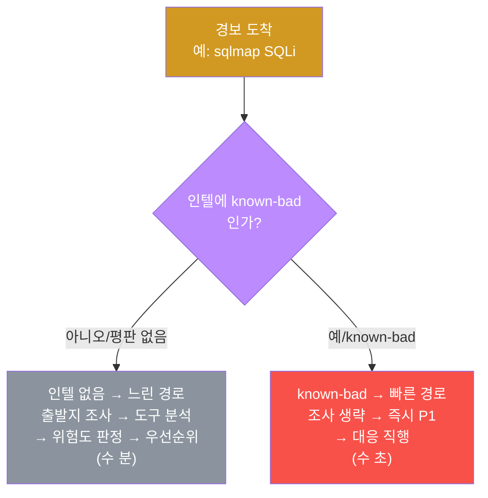
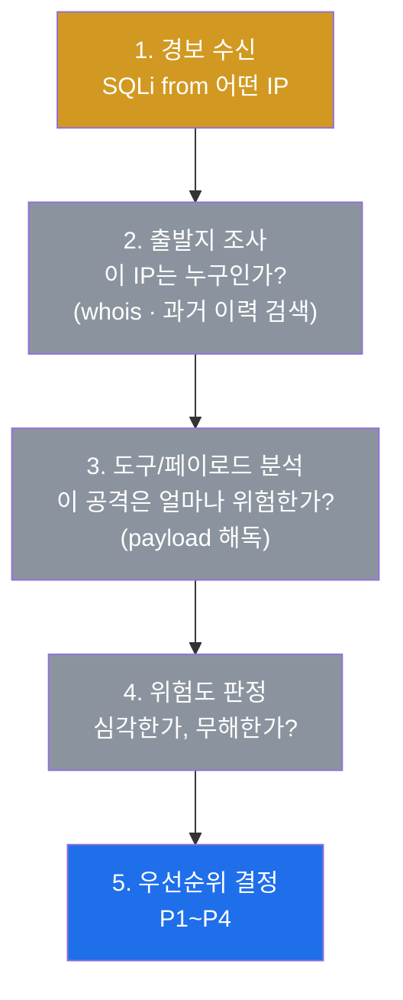
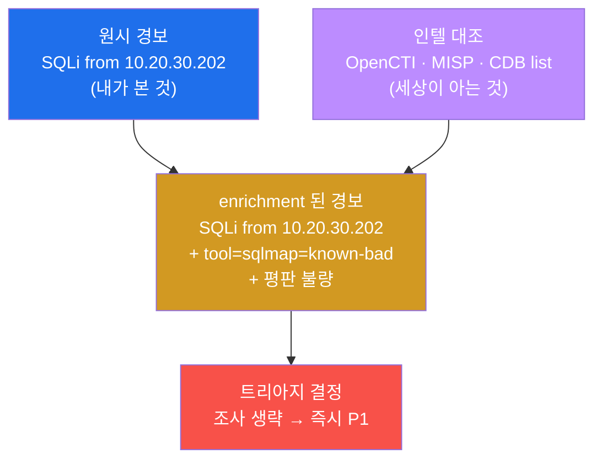
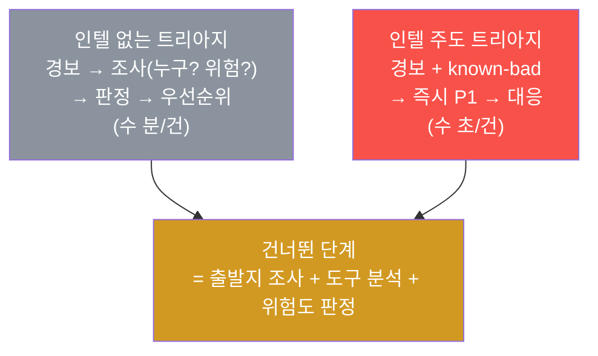
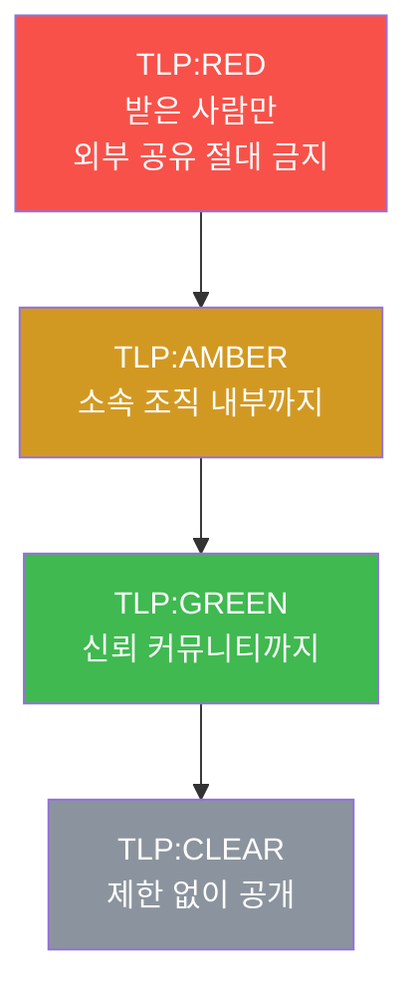
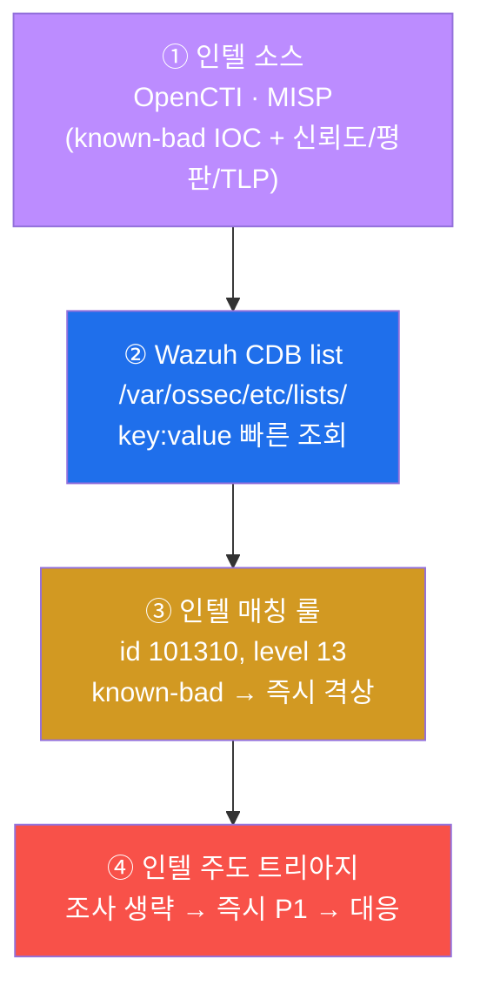
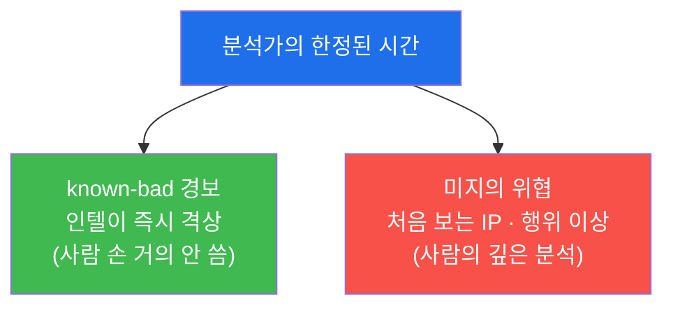
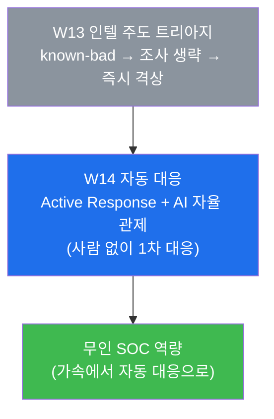

# SOC W13 — 인텔 주도 트리아지: "이미 아는 위협"이라는 한마디가 대응을 가속한다

> **본 주차의 한 줄 요약**
>
> 지난주(W12)에 학생은 외부 위협 지식(IOC)을 우리 SIEM(Wazuh)이 알아듣게 만들어, 평범한
> 경보를 "알려진 위협"으로 **격상**하는 법을 배웠다. 이번 주는 그 격상이 분석가의 일상
> 업무인 **트리아지(triage, 경보 분류·우선순위 판단)** 를 어떻게 **가속**하는지를 본다.
> 핵심 직관은 단순하다 — 같은 경보라도 **"이 출발지·이 도구는 이미 알려진 악성"** 이라는
> 위협 인텔 한마디가 붙으면, 분석가는 "이게 누구지? 위험한가?"를 **조사하기도 전에**
> 우선순위를 정할 수 있다. 학생은 알려진 악성 도구(sqlmap)로 공격을 흘리고, 인텔 없는 느린
> 트리아지와 인텔 있는 빠른 트리아지를 직접 대비해 보고, **인텔 매칭 룰(id 101310)** 로
> known-bad 경보를 즉시 격상한 뒤, 그것이 SOC 의 **처리량(throughput)** 을 어떻게 끌어올리는지
> 데이터와 논리로 확인한다.
>
> **분석가 한 줄 결론**: SOC 의 처리량은 인텔로 결정된다. **아는 위협은 빨리 쳐내고(조사
> 생략 → 즉시 대응), 모르는 위협에 분석가의 한정된 시간을 몰아주는 것** — 이것이 인텔 주도
> 트리아지다. W12 가 "IOC 를 매칭해 격상한다"는 **메커니즘**이었다면, W13 은 그 격상을
> 분석가의 **의사결정·우선순위·시간 배분**이라는 운영 관점에서 다시 본다.

---

## 학습 목표

본 주차 종료 시 학생은 다음 6가지를 **본인 손으로** 할 수 있어야 한다.

1. **트리아지**(경보 분류·우선순위 판단)의 4요소(출발지·도구/시그니처·시각·심각도)에 더해,
   **위협 인텔**이라는 다섯 번째 축이 우선순위를 어떻게 끌어올리는지를 비유 없이 설명한다.
2. **인텔 없는 트리아지**(경보마다 출발지·도구·위험도를 처음부터 조사)와 **인텔 있는
   트리아지**(known-bad 한마디로 즉시 우선순위 결정)를 단계별로 대비하고, 둘의 **처리량
   (throughput) 차이**가 어디서 오는지 설명한다.
3. el34 에 실제 가동 중인 **OpenCTI / MISP** 인텔 소스와 적용 지점 **Wazuh** 의 관계를
   `docker ps` 로 확인하고, "인텔 소스 → CDB list → 매칭 룰 → 자동 격상"의 운영 파이프라인을
   그린다.
4. IOC 의 **신뢰도(confidence)·평판(reputation)** 과 **TLP(Traffic Light Protocol, 정보
   공유 등급)** 가 무엇인지 정의하고, 인텔이 모두 같은 무게가 아니라 **신뢰도에 따라 다르게
   다뤄야** 한다는 것을 설명한다.
5. **인텔 매칭 룰**(id **101310**, level 13)을 `local_rules.xml` 에 직접 작성하고, **라이브
   manager 를 재시작하지 않고** `wazuh-logtest` 로 known-bad 즉시 격상을 검증한 뒤,
   베이스를 원상복구(self-clean)한다.
6. 알려진 악성 도구(sqlmap)로 공격을 재현해, 인텔 한마디가 트리아지 결정을 어떻게 가속하는지
   (조사 생략 → 즉시 P1 → 대응 직행)를 증거와 함께 한 장의 보고서로 종합한다.

> **이번 주의 시선** — W13 은 새 인프라를 깔거나 새 도구를 배우는 주가 아니다. W12 에서 만든
> 인텔 매칭이라는 **부품**을, 분석가의 **의사결정 속도**라는 관점에서 다시 보는 주다. 채점도
> "격상 룰을 썼다"가 아니라 **"인텔이 트리아지의 어느 단계를 건너뛰게 했는가"** 를 설명할 수
> 있는지를 본다.

---

## 강의 시간 배분 (총 3시간 40분)

| 시간        | 내용                                                                       | 유형      |
|-------------|----------------------------------------------------------------------------|-----------|
| 0:00–0:25   | 이론 — 트리아지란 무엇이며 왜 느린가 (인텔 없는 트리아지의 한계)             | 강의      |
| 0:25–0:55   | 이론 — 인텔 enrichment: 경보에 "맥락 한 줄"을 붙이는 다섯 번째 축           | 강의      |
| 0:55–1:05   | 휴식                                                                       | —         |
| 1:05–1:35   | 이론 — IOC 신뢰도·평판·TLP + 인텔 운영 파이프라인(OpenCTI/MISP→CDB→Wazuh)  | 강의/토론 |
| 1:35–2:00   | 실습 1, 2 — 인텔 스택 점검 + 알려진 악성 도구(sqlmap) 공격 재현             | 실습      |
| 2:00–2:30   | 실습 3, 4 — 인텔 없는 트리아지(느린 경로) + 인텔 매칭 룰(101310) logtest    | 실습      |
| 2:30–2:40   | 휴식                                                                       | —         |
| 2:40–3:10   | 실습 5, 6, 7 — 인텔 주도 즉시 격상 + 인텔 플랫폼 + 가속 효과(처리량)        | 실습      |
| 3:10–3:30   | 실습 8 — 인텔 주도 트리아지 종합 보고서                                     | 실습      |
| 3:30–3:40   | 정리 + 과제 안내 + 다음 주차(W14 — AI 자율 관제 + Active Response) 예고     | 정리      |

---

## 0. 용어 해설 (인텔 주도 트리아지 입문)

이번 주에 처음 등장하거나 의미를 정확히 해야 하는 용어를 먼저 모아 둔다. 본문에서 다시
나올 때 막히면 이 표로 돌아오면 흐름이 끊기지 않는다. W12 에서 정의한 용어(IOC·STIX·CDB
list 등)는 §0.5 에서 한 번 더 짧게 짚는다.

| 용어 | 영문 | 뜻 | 비유 |
|------|------|----|------|
| **트리아지** | triage | 경보를 빠르게 분류해 우선순위를 매기는 1차 판단 | 응급실 환자 중증도 분류 |
| **위협 인텔 triage** | intel-driven triage | 위협 인텔(known-bad 여부)을 트리아지의 1차 판단에 곧바로 쓰는 것 | 수배 명단을 든 채 검문하기 |
| **enrichment** | enrichment | 경보에 외부 맥락(평판·known-bad 여부 등)을 한 줄 덧붙이는 것 | 방문객 이름에 "수배자" 라벨 붙이기 |
| **처리량** | throughput | 단위 시간에 분석가가 처리하는 경보 건수 | 검문소가 한 시간에 통과시키는 차량 수 |
| **IOC** | Indicator of Compromise | 침해를 가리키는 구체 지표(악성 IP·해시·도메인·도구명) | 수배범의 지문·차량번호 |
| **known-bad** | known-bad | 인텔에 이미 "악성"으로 등록된 IOC | 수배 명단에 올라 있는 사람 |
| **신뢰도** | confidence | 그 IOC 가 진짜 악성일 가능성에 대한 인텔 제공자의 확신 정도 | 제보의 신빙성 등급 |
| **평판** | reputation | 어떤 IP·도메인·파일이 과거에 보인 악성/정상 이력의 종합 점수 | 신용 점수(과거 행적의 평가) |
| **TLP** | Traffic Light Protocol | 정보를 누구까지 공유해도 되는지를 색(RED/AMBER/GREEN/CLEAR)으로 표시하는 등급 | 문서의 "대외비/사내한정/공개" 도장 |
| **격상** | escalation | 평범한 경보를 더 높은 level/우선순위로 끌어올리는 것 | 일반 사건 → 중요 사건 재분류 |
| **우선순위** | priority (P1~P4) | 경보·사건의 시급성 등급 — P1 이 가장 급함 | 화재 경보 vs 분실물 신고 |
| **OpenCTI** | Open Cyber Threat Intelligence | STIX 객체를 저장·시각화하고 ATT&CK 과 연동하는 인텔 플랫폼 | 수배 정보 통합 DB |
| **MISP** | Malware Information Sharing Platform | IOC 를 수집·공유하는 인텔 플랫폼 | 기관 간 정보 공유망 |
| **CDB list** | Constant DataBase list | Wazuh 가 IOC 를 빠르게 조회하는 `key:value` 테이블 | 검문소의 색인된 수배 명단 |
| **alert fatigue** | alert fatigue | 경보가 너무 많아 분석가가 둔감해지고 놓치는 현상 | 양치기 소년 — 경보에 무감각 |
| **wazuh-logtest** | — | 로그 한 줄을 넣어 룰 매치를 안전하게 검증하는 도구 | 모의재판 |

---

## 0.5 신입생 친화 핵심 개념 — "조사하기 전에 답을 아는" 트리아지

위 용어 표는 한 줄 정의라서 그림을 그리기엔 부족하다. 본 절에서는 W13 의 가장 중요한 직관
세 가지를 일상 비유로 풀어 둔다. 이 세 비유가 W13 전체를 관통한다.

### 0.5.1 트리아지 — 응급실 분류 비유

학생이 응급실 접수 간호사라고 하자. 환자가 끊임없이 들어온다. 모든 환자를 도착 순서대로
정밀 진단할 수는 없다 — 그랬다간 심정지 환자가 감기 환자 뒤에서 기다리다 죽는다. 그래서
간호사는 도착하는 순간 **빠른 1차 판단**을 한다.

- 숨을 못 쉬는가? 피를 흘리는가? → 즉시 1순위(응급).
- 걸어 들어왔고 의식이 또렷한가? → 후순위.

이 빠른 1차 분류가 **트리아지(triage)** 다. 어원도 프랑스어 "분류하다(trier)"에서 왔고,
원래 전장·재난 의료에서 한정된 의료진이 가장 시급한 환자부터 처치하기 위해 쓴 방법이다.

SOC 도 똑같다. 분석가 화면에는 분당 수백 건의 경보가 쏟아진다(W01·W05 에서 다룬 "경보의
강"). 모든 경보를 똑같이 정밀 조사할 수는 없다. 그래서 분석가는 각 경보를 받는 순간 **빠른
1차 판단**으로 우선순위(P1~P4)를 매긴다. 이것이 SOC 의 트리아지다.

> **용어 — 트리아지 4요소(W05 복습).** 분석가가 1차 판단에서 보는 네 가지는 **출발지**(누가
> 보냈나) · **도구/시그니처**(무엇으로 공격했나) · **시각**(언제, 업무시간인가 야간인가) ·
> **심각도**(룰 level). W13 은 여기에 **위협 인텔**이라는 다섯 번째 축을 더한다.

### 0.5.2 인텔 주도 트리아지 — "수배 명단을 손에 든 검문관" 비유

검문소를 다시 떠올려보자(W12 의 CDB list 비유와 같은 검문소다). 검문관 두 명이 있다.

- **명단 없는 검문관.** 차가 올 때마다 운전자에게 묻는다 — "어디서 오셨어요? 무슨 일로?
  트렁크 좀 봅시다." 한 대 한 대 **처음부터 조사**한다. 줄이 길어지고, 진짜 위험인물이 그
  줄에 섞여 있어도 일일이 조사하느라 시간을 다 쓴다.
- **명단을 든 검문관.** 차량번호를 수배 명단과 즉시 대조한다. 명단에 없으면 통과(또는 약식
  조사), **명단에 있으면 묻지도 따지지도 않고 즉시 최우선 대응**한다. 조사는 명단에 없는
  의심 차량에만 집중한다.

두 검문관의 차이가 정확히 **인텔 없는 트리아지 vs 인텔 주도 트리아지**의 차이다.

| 명단 없는 검문관 | 명단 든 검문관 (인텔 주도) |
|------------------|---------------------------|
| 차마다 처음부터 조사(누구? 위험한가?) | 차량번호를 명단과 대조 |
| 줄이 길어짐(처리량 낮음) | 명단 일치 → 즉시 최우선, 나머지는 빠르게 통과 |
| 위험인물이 조사 줄에 묻힘 | 위험인물을 명단으로 즉시 식별 |
| 조사 시간을 모든 차에 분산 | 조사 시간을 "명단에 없는 의심 차"에 집중 |

핵심은 **인텔이 "이미 검증된 답"을 미리 준다**는 것이다. 분석가가 sqlmap 공격을 보았을 때,
sqlmap 이 known-bad 임을 인텔이 알려주면 "이 도구가 위험한가?"를 처음부터 분석할 필요가
없다 — 세상이 이미 분석해 둔 결론을 빌려 쓰는 것이다(W12 §1.2 "전 세계의 분석 결과를 내
SIEM 에 빌려온다"의 운영적 결과가 바로 트리아지 가속이다).



### 0.5.3 신뢰도·평판·TLP — "모든 제보가 같은 무게는 아니다"

수배 명단 비유를 한 걸음 더 밀어 보자. 명단에 오른 정보라고 다 똑같이 믿을 수는 없다.

- **익명 제보 한 건**으로 올라온 이름과, **여러 기관이 교차 확인한 지명수배**는 무게가
  다르다. 전자는 "참고", 후자는 "확실"이다. 이 **확신의 정도**가 IOC 의 **신뢰도
  (confidence)** 다.
- 어떤 사람이 **과거에 여러 번 사고를 친 이력**이 있으면 신용이 낮다. 어떤 IP·도메인·파일이
  과거에 보인 악성/정상 행적을 종합한 **신용 점수**가 **평판(reputation)** 이다. 평판이
  나쁜 출발지의 경보는 같은 경보라도 더 무겁게 본다.
- 어떤 제보는 "**우리끼리만** 보고 외부에 흘리지 말 것"이고, 어떤 정보는 "**누구에게나
  공개**해도 된다". 정보를 어디까지 공유해도 되는지를 색으로 표시한 약속이 **TLP(Traffic
  Light Protocol)** 다.

세 개념의 공통 메시지는 하나다 — **인텔은 모두 같은 무게가 아니다.** 신뢰도가 높고 평판이
확실한 known-bad 는 조사 없이 즉시 격상해도 되지만, 신뢰도가 낮은 단발 제보는 격상하되 사람
확인을 남겨야 한다. W13 의 실습은 가장 확실한 경우(이름이 박힌 악성 도구 sqlmap = 신뢰도
높은 known-bad)를 다루지만, 운영에서는 신뢰도·평판에 따라 격상 강도를 조절한다는 것을
반드시 이해해야 한다(§4 에서 상세).

> **용어 — TLP(Traffic Light Protocol).** 위협 인텔을 주고받을 때 **"이 정보를 누구까지
> 공유해도 되는가"** 를 신호등 색으로 표시하는 국제 약속(FIRST.org 표준)이다. 네 단계다 —
> **TLP:RED**(받은 사람만, 외부 공유 금지) · **TLP:AMBER**(소속 조직 내부까지) ·
> **TLP:GREEN**(커뮤니티까지) · **TLP:CLEAR**(제한 없이 공개). 인텔을 다룰 때 분석가는 그
> 정보의 TLP 등급을 반드시 확인하고, 등급을 넘어 공유하지 않는다. (OpenCTI/MISP 는 객체마다
> 이 TLP 마킹을 보관한다.)

---

## 1. 트리아지는 왜 느린가 — 인텔 없는 트리아지의 한계

### 1.1 한 줄 답: 경보마다 "누구지? 위험한가?"를 처음부터 조사하기 때문

트리아지가 느린 근본 원인은, 인텔이 없으면 분석가가 **경보 하나하나를 처음부터 조사**해야
하기 때문이다. SQLi 경보 한 건이 떴다고 하자. 인텔 없는 분석가는 다음을 순서대로 한다.



문제는 이 다섯 단계가 **경보마다 반복**된다는 점이다. 분당 수백 건이 쏟아지는데 한 건에 몇
분씩 걸리면, 분석가는 금세 밀린다. 그리고 밀리면 위험한 일이 생긴다.

### 1.2 왜 중요한가 — 느린 트리아지는 alert fatigue 를 부른다

처리량이 따라가지 못하면 경보 큐가 쌓인다. 큐가 쌓이면 분석가는 둔감해진다 — 이것이 **alert
fatigue(경보 피로)** 다. 너무 많은 경보에 시달리다 보면 "또 SQLi 겠지" 하고 대충 닫게 되고,
그 둔감함 속에서 **진짜 위협이 묻힌다.** 2021 인터파크 사례(W01 에서 언급)의 사고 후 분석
공통 결론 중 하나가 "SIEM alert fatigue"였다 — 경보는 떴지만 너무 많은 경보에 묻혀 제때
대응하지 못했다는 뜻이다.

즉 트리아지 속도는 단순한 효율 문제가 아니라 **놓치느냐 잡느냐의 문제**다. 느린 트리아지는
처리량을 떨어뜨리고, 떨어진 처리량은 fatigue 를 부르고, fatigue 는 진짜 위협을 놓치게 한다.

### 1.3 el34 에서 어떻게 — 느린 경로를 직접 따라가 본다

인텔 없는 느린 경로의 한계를 말로만 이해하는 것과 직접 따라가 보는 것은 다르다. 실습 3 에서
학생은 인텔 없는 트리아지가 경보마다 어떤 조사를 거치는지를 단계로 정리한다 — 이 "느림"을
몸으로 알아야, §3 에서 인텔이 주는 가속이 왜 그렇게 큰지 체감할 수 있다.

```bash
# 실습 3 — 인텔 없는 트리아지(느린 경로)의 단계 정리
echo "=== 인텔 없는 트리아지 (느린 경로) ==="
echo "경보 수신 → 출발지 IP 조사(누구?) → 도구/페이로드 분석(위험?) → 위험도 판정 → 우선순위"
echo "→ 경보마다 조사 필요. 처리량 제한, alert fatigue 위험"
```

### 1.4 한계 — 모든 위협을 인텔이 아는 것은 아니다

미리 짚어 둘 것이 있다. 인텔 주도 트리아지가 강력하다고 해서 **모든 경보가 빨라지는 것은
아니다.** 인텔이 가속하는 것은 **"이미 아는 위협(known-bad)"** 뿐이다. 처음 보는 IP, 이름을
바꾼 도구, 신종 수법은 인텔 명단에 없으므로 여전히 느린 경로(조사)를 타야 한다(W12 §1.4 의
"IOC 는 알려진 것만 잡는다"와 같은 한계다). 그래서 인텔의 진짜 가치는 "모든 걸 빠르게"가
아니라 **"아는 건 빨리 쳐내서, 모르는 것에 시간을 몰아주는 것"** 이다 — 이 시간 재배분이 §3
의 핵심이다.

---

## 2. 인텔 enrichment — 경보에 "맥락 한 줄"을 붙인다

### 2.1 한 줄 정의 — 경보 옆에 외부 지식을 한 줄 덧대는 작업

**enrichment(인리치먼트, 맥락 보강)** 는 들어온 경보의 출발지·도구·해시를 외부 인텔과
대조해, 경보 옆에 **"이건 known-bad다" / "평판 불량이다"** 같은 **맥락 한 줄**을 덧붙이는
작업이다. enrichment 가 붙으면, 분석가는 경보 자체만 보는 게 아니라 **그 경보에 대한 세상의
평가까지 함께** 본다.

### 2.2 왜 중요한가 — 맥락 한 줄이 트리아지의 판단 재료를 바꾼다

§0.5.1 의 트리아지 4요소(출발지·도구·시각·심각도)는 모두 **"내가 본 것"** 에서 나온다.
enrichment 는 여기에 **"세상이 아는 것"** 이라는 다섯 번째 재료를 더한다. 같은 SQLi 경보라도
"출발지가 평판 불량 + 도구가 known-bad"라는 맥락이 붙으면, 분석가는 조사 없이도 "이건
심각하다"를 판단할 수 있다. enrichment 가 곧 **인텔 주도 트리아지의 입력**인 셈이다.



### 2.3 el34 에서 어떻게 — CDB 매칭이 enrichment 의 가장 단순한 형태

el34 에서 enrichment 의 가장 단순하고 확실한 형태는 W12 에서 만든 **CDB list 매칭**이다.
경보의 `tool` 필드 값을 known-bad 명단(CDB list)과 대조해, 일치하면 "known-bad"라는 맥락을
붙이고 룰이 그 경보를 격상한다. 아래는 한 줄 로그를 인텔 매칭 룰에 던져 격상을 확인하는
가장 작은 enrichment 검증이다.

```bash
# 알려진 IOC와 대조 — tool=sqlmap 이 known-bad 매칭 룰을 발화시키는지 확인(모의재판)
echo '{"tool":"sqlmap","src_ip":"10.20.30.202"}' | sudo /var/ossec/bin/wazuh-logtest
#   → 인텔 매칭 룰(§5)이 이 경보를 즉시 격상 = "known-bad" 맥락이 붙은 것
```

여기서 보는 것은 "tool 필드 값 sqlmap 이 known-bad 명단에 있으니 경보를 격상한다"는,
enrichment 의 가장 기본형이다. 운영에서는 IP 평판·GeoIP·자산 가치 같은 더 풍부한 맥락이
붙지만, **"경보에 외부 맥락을 한 줄 더한다"** 는 본질은 같다.

### 2.4 한계 — enrichment 는 트리아지를 돕지 자동 대응을 대신하진 않는다

enrichment 는 분석가의 **판단 재료**를 늘려 트리아지를 가속하지만, 그 자체가 차단·격리 같은
**대응 행동**을 하지는 않는다. "이건 known-bad다"라는 맥락이 붙어도, 실제 차단을 자동으로
할지 사람이 할지는 별도 설계다(그 자동 대응이 다음 주 W14 의 Active Response 다). 또한
enrichment 의 품질은 **인텔의 품질**에 달려 있다 — 인텔이 낡았거나 신뢰도가 낮으면 잘못된
맥락이 붙어 오판할 수 있다(§4).

---

## 3. 인텔 주도 트리아지 — 결정을 가속한다

### 3.1 한 줄 정의 — 인텔로 우선순위를 "조사 전에" 정하는 것

**인텔 주도 트리아지(intel-driven triage)** 는, enrichment 로 붙은 known-bad 맥락을 곧바로
우선순위 결정에 써서 **조사 단계를 건너뛰고** 대응으로 직행하는 트리아지 방식이다. 핵심은
**순서의 변화**다 — 인텔 없는 트리아지는 "조사 → 판정 → 우선순위" 순이지만, 인텔 주도
트리아지는 **"우선순위(인텔이 즉답) → (필요시) 조사"** 순이다.

### 3.2 왜 중요한가 — 같은 경보, 다른 트리아지 결정

같은 종류의 경보라도 인텔 맥락에 따라 트리아지 결정이 달라진다. 아래 표가 W13 의 핵심이다.

| 경보 | 인텔 맥락 | 트리아지 결정 |
|------|----------|--------------|
| SQLi from X | X = known-bad(OpenCTI/MISP 등록) | **즉시 P1** — 조사 생략 가능, 대응 직행 |
| 스캔 from Y | Y = 평판 없음(처음 보는 IP) | 일반 절차 — 조사 후 판정(느린 경로) |
| 로그인 from Z | Z = 내부 정상(known-good) | **P4** — 오탐 가능, 후순위 |

같은 "SQLi"라도 출발지가 known-bad 면 즉시 P1 이고, 같은 출발지라도 인텔이 "내부 정상"이라
말하면 P4 다. **인텔이 트리아지의 답을 미리 쥐여 주는 것** — 이것이 가속의 원천이다.

### 3.3 el34 에서 어떻게 — 빠른 경로를 직접 선언한다

실습 5 에서 학생은 인텔 주도의 빠른 경로를 단계로 정리한다. §1.3 의 느린 경로(5단계 조사)와
나란히 놓고 보면, 인텔이 **어느 단계를 건너뛰게 했는지**가 한눈에 보인다.

```bash
# 실습 5 — 인텔 주도 트리아지(빠른 경로)
echo "=== 인텔 주도 트리아지 (빠른 경로) ==="
echo "경보 + 인텔(sqlmap=known-bad) → 즉시 P1 격상 → 조사 생략 가능 → 대응 직행"
echo "→ '이미 아는 답'을 인텔이 제공 → 조사 시간 절약"
```



### 3.4 한계 — 가속은 신뢰도가 받쳐 줄 때만 안전하다

조사를 생략하고 즉시 격상하는 것은 강력하지만, **인텔의 신뢰도가 받쳐 줄 때만** 안전하다.
신뢰도 낮은 인텔로 무작정 즉시 P1 을 남발하면, 오히려 오탐 P1 이 쌓여 새로운 alert fatigue
를 만든다. 그래서 §4 에서 보듯, 신뢰도·평판이 확실한 known-bad 만 "조사 생략"을 적용하고,
애매한 인텔은 격상하되 사람 확인을 남기는 것이 운영의 원칙이다. "인텔 주도 = 무조건 조사
생략"이 아니라 **"확실한 인텔에 한해 조사 생략"** 임을 반드시 기억해야 한다.

---

## 4. 인텔의 무게 — 신뢰도·평판·TLP

### 4.1 한 줄 정의 — 인텔은 모두 같은 무게가 아니다

§3.4 에서 본 대로, 인텔 주도 트리아지의 안전성은 인텔의 품질에 달려 있다. 그 품질을 세
축으로 본다 — **신뢰도(얼마나 확실한가)** · **평판(과거 행적이 어떤가)** · **TLP(어디까지
공유 가능한가)**. 분석가는 known-bad 한마디를 그대로 믿기 전에 이 세 축을 함께 본다.

### 4.2 신뢰도(confidence) — "얼마나 확실한가"

**신뢰도(confidence)** 는 그 IOC 가 진짜 악성일 가능성에 대한 인텔 제공자의 확신 정도다.
OpenCTI/MISP 는 IOC 마다 신뢰도 점수(예: 0~100, 또는 Low/Medium/High)를 함께 보관한다.
신뢰도가 높을수록 "조사 생략 → 즉시 격상"을 적용해도 안전하고, 낮을수록 격상하되 사람
확인을 남긴다.

| 신뢰도 | 트리아지 적용 |
|--------|--------------|
| **High** (여러 출처 교차 확인) | 조사 생략 → 즉시 격상 안전 |
| **Medium** (단일 신뢰 출처) | 격상하되 빠른 확인 권장 |
| **Low** (미확인 단발 제보) | 참고만 — 격상 신중, 사람 판단 필수 |

### 4.3 평판(reputation) — "과거 행적이 어떤가"

**평판(reputation)** 은 어떤 IP·도메인·파일이 과거에 보인 악성/정상 이력을 종합한 신용
점수다. 사람의 신용 점수처럼, 과거에 여러 번 공격 출처로 관측된 IP 는 평판이 나쁘고, 그
출발지의 경보는 같은 경보라도 더 무겁게 본다. 운영에서는 VirusTotal·abuse.ch 같은 외부
평판 소스를 enrichment 에 결합해, "이 출발지는 평판 점수 ○○(불량)"이라는 맥락을 경보에
붙인다. (W13 실습은 도구명 known-bad 매칭에 집중하지만, IP 평판도 같은 enrichment 원리의
한 종류임을 이해해 둔다.)

### 4.4 TLP — "어디까지 공유해도 되는가"

**TLP(Traffic Light Protocol)** 는 인텔을 **누구까지 공유해도 되는지**를 색으로 표시하는
약속이다(§0.5.3). 신뢰도·평판이 "그 인텔을 얼마나 믿고 쓸까"의 문제라면, TLP 는 "그 인텔을
어디까지 퍼뜨려도 되는가"의 문제다 — 무게의 세 번째 축이자, **공유 윤리**의 축이다.



분석가는 인텔을 받을 때와 내보낼 때 항상 TLP 등급을 확인한다. 예컨대 어느 기관이
TLP:AMBER 로 공유한 IOC 를 외부 블로그에 공개하면 **약속 위반**이다. OpenCTI/MISP 는 객체
마다 TLP 마킹을 보관하므로, 인텔을 운영할 때 이 등급을 반드시 존중해야 한다.

### 4.5 한계 — 무게 판단은 자동화의 마지막 사람 몫

신뢰도·평판·TLP 는 인텔 주도 트리아지를 **안전하게** 만드는 안전장치이지만, 이 무게를
어떻게 정책으로 반영할지는 결국 사람의 판단이 들어간다. "신뢰도 몇 점 이상이면 자동 즉시
격상, 그 미만은 사람 확인"이라는 임계는 조직마다 다르고, 잘못 잡으면 과격상(오탐 P1
홍수)이나 과소격상(진짜 위협 누락)이 된다. 이 임계 설계가 다음 주(W14)에서 다룰 자동 대응의
안전장치(level 임계·화이트리스트)와 직결된다.

---

## 5. 인텔 매칭 룰 — known-bad 를 즉시 격상하는 실제

### 5.1 한 줄 정의 — IOC 가 보이면 즉시 고위험으로 올리는 룰

**인텔 매칭 룰**은 디코딩된 경보에 known-bad IOC 가 나타나면 그 경보의 level 을 즉시
끌어올리는 커스텀 룰이다. W12 의 IOC 매칭/격상 룰(id 101210)과 메커니즘은 같지만, W13 은
그것을 **트리아지 가속의 도구**로 본다 — 이 룰이 발화하는 순간, 분석가의 느린 5단계 조사가
"즉시 P1"로 치환된다. 본 트랙 W13 의 룰 id 는 **101310**, level 은 **13**(고위험)이다.

```xml
<group name="soc_w13,">
  <rule id="101310" level="13">
    <decoded_as>json</decoded_as>        <!-- ① json decoder 가 잡은 로그만 대상 -->
    <field name="tool">sqlmap</field>    <!-- ② tool 필드 값이 known-bad IOC 'sqlmap' -->
    <description>SOC W13 - known-bad tool (intel), escalate</description>
  </rule>
</group>
```

각 줄의 의미:

- `id="101310" level="13"` — 이 룰의 고유 번호와 격상 후 형량. **level 13 은 고위험**이다
  (W09: 12 이상 고위험). 격상 즉시 대시보드 최상단으로 올라 트리아지에서 먼저 처리된다.
- `<decoded_as>json</decoded_as>` — json decoder 가 파싱한 로그만으로 대상을 좁힌다.
- `<field name="tool">sqlmap</field>` — 로그의 `tool` 필드 값이 known-bad IOC `sqlmap` 일
  때만 매치한다. (운영에서는 이 한 줄을 W12 의 `<list lookup>` 으로 바꿔 CDB 의 수천 IOC 를
  한 번에 본다.)
- `<description>` — 판결문에 적히는 사람이 읽는 설명.

### 5.2 왜 중요한가 — 격상이 곧 "트리아지 결정의 자동화"

W12 에서 격상은 "분석가 시선의 우선순위"였다. W13 에서 한 걸음 더 나아가면, 이 격상 룰은
**트리아지의 1차 판단 자체를 자동화**한 것이다. known-bad 경보가 들어오면 사람이 5단계
조사를 거쳐 "P1"이라 판단할 것을, 룰이 즉시 level 13 으로 격상해 **사람의 조사를 기다리지
않고** 우선순위를 결정한다. 즉 인텔 매칭 룰은 §3 의 "빠른 경로"를 코드로 구현한 것이다.

### 5.3 el34 에서 어떻게 — 매칭 룰 추가 + logtest 검증 + self-clean

본 트랙의 표준 절차는 W09·W12 와 동일하다: (1) 백업 → (2) 커스텀 룰 추가 → (3) **라이브
재시작 없이 `wazuh-logtest` 로 발화 검증** → (4) 원복(self-clean). el34-siem 은 모든 학생이
함께 쓰는 단일 manager 이므로, `wazuh-control restart` 로 라이브 반영하는 것은 금지된다
(다른 학생의 ingest 중단). `wazuh-logtest` 는 현재 룰셋을 별도 테스트 인스턴스에서 평가하므로
라이브 analysisd 를 전혀 건드리지 않는다.

```bash
# el34-siem 안에서
# (1) 백업
sudo cp /var/ossec/etc/rules/local_rules.xml /tmp/socw13_lr.bak

# (2) 인텔 매칭 룰 추가 — id 네임스페이스: 본 트랙 W13 = 1013xx
sudo bash -c 'cat >> /var/ossec/etc/rules/local_rules.xml <<EOF
<group name="soc_w13,">
  <rule id="101310" level="13">
    <decoded_as>json</decoded_as>
    <field name="tool">sqlmap</field>
    <description>SOC W13 - known-bad tool (intel), escalate</description>
  </rule>
</group>
EOF'

# (3) 발화 검증 — 라이브 manager 무중단(모의재판)
echo '{"tool":"sqlmap","src_ip":"10.20.30.202"}' | sudo /var/ossec/bin/wazuh-logtest
#   → Phase 3: id 101310, level 13, "Alert to be generated."   (known-bad 즉시 격상)

# (4) self-clean — 베이스 원상복구
sudo cp /tmp/socw13_lr.bak /var/ossec/etc/rules/local_rules.xml; sudo rm -f /tmp/socw13_lr.bak
```

이 룰이 하는 일: json decoder 가 잡은 로그 중 `tool` 필드 값이 known-bad `sqlmap` 인 것을
level 13 으로 격상한다 — 즉 트리아지의 "즉시 P1" 결정을 코드가 대신한다. `<field>` 한 줄을
`<list field="tool" lookup="match_key">etc/lists/...</list>` 로 바꾸면 그대로 CDB 의 수천
IOC 를 보는 운영 룰이 된다(격상 논리는 동일, W12 §5.3).

### 5.4 한계와 안전 수칙 — id 충돌 금지 · 공유 보존

- **id 네임스페이스.** **100000 미만은 Wazuh 예약**이라 사용 금지(W09). 본 트랙 W13 은
  `1013xx`(예: 101310)로 격리하고, 끝나면 그룹째 삭제한다. (참고: W12=1012xx, W09=1009xx.)
- **라이브 반영의 조건.** 실제 운영 적용은 `wazuh-control restart` 가 필요하지만, 공유
  el34 에서는 **logtest 검증만** 하고 끝나면 룰을 지운다.
- **XML 문법 주의.** local_rules.xml 에 문법 오류가 있으면 analysisd 가 룰셋 로딩에
  실패한다. `wazuh-logtest` 는 시작 시 룰셋 로드 에러를 보여주므로, 검증 단계에서 문법
  오류를 먼저 잡을 수 있다.
- **공유 인프라 보존.** 끝나면 반드시 cp 복원으로 베이스 `local_rules.xml` 을 원래대로
  되돌린다(`grep -c 101310` 잔재 0 확인). 잔재가 남으면 다른 학생의 평결에 영향을 준다.

---

## 6. 인텔 운영 파이프라인 — OpenCTI/MISP → CDB → Wazuh

### 6.1 한 줄 정의 — 인텔이 자동으로 트리아지를 가속하는 흐름

지금까지(§2–§5)는 인텔 한 건이 트리아지를 어떻게 가속하는지를 봤다. 이것을 **운영
파이프라인**으로 묶으면, 인텔 소스에 새 IOC 가 들어올 때마다 경보가 **자동으로** 격상되는
구조가 된다. el34 는 이 파이프라인의 양 끝(OpenCTI/MISP 인텔 소스, Wazuh 적용 지점)을 실제로
갖추고 있다.



### 6.2 왜 중요한가 — 인텔이 들어오면 트리아지가 저절로 빨라진다

이 파이프라인의 가치는 **자동성**이다. 인텔 팀이 OpenCTI/MISP 에 새 known-bad 를 등록하면,
그것이 CDB list 로 내려가고, 매칭 룰이 그 IOC 를 보는 경보를 자동 격상하며, 분석가는 별도
작업 없이도 더 빠른 트리아지를 하게 된다. 즉 **"인텔의 갱신"이 곧 "트리아지의 가속"** 으로
이어진다 — 사람이 매번 룰을 손보지 않아도 된다.

### 6.3 el34 에서 어떻게 — 인텔 소스 가동 확인

```bash
# el34 호스트(ssh ccc@192.168.0.151)에서 — 인텔 소스가 살아 있는지
docker ps --format '{{.Names}}' | grep -iE 'opencti|misp' | head
#  → el34-opencti-1, el34-misp-core-1 … 가 보이면 인텔 소스 가동
```

`el34-opencti-1` 이 보이면 STIX 인텔 저장소가, `el34-misp-core-1` 이 보이면 IOC 공유
플랫폼이 가동 중이다. 적용 지점 Wazuh 의 가용성은 W09·W12 와 동일하게
`docker exec el34-siem /var/ossec/bin/wazuh-control status | grep analysisd` 로 따로
확인한다. 인텔 소스(OpenCTI/MISP)와 적용 지점(Wazuh)을 **따로 보는 습관**이 인텔 운영
점검의 핵심이다(W12 §3.2 의 분리 원칙).

### 6.4 한계 — 파이프라인이 살아도 인텔이 낡으면 가속이 오판이 된다

파이프라인이 자동으로 돈다는 것은 양날이다. 인텔이 정확하면 자동으로 빨라지지만, 인텔이
낡으면(악성 IP 가 정상으로 회수되었는데도 명단에 남아 있으면) **자동으로 오판**한다 —
정상 출발지를 known-bad 로 격상해 사람의 시간을 엉뚱한 곳에 쓰게 만든다. 그래서 인텔은
주기적 갱신과 §4 의 신뢰도·평판 관리가 전제다. 자동화는 좋은 인텔 위에서만 좋은 결과를
낸다.

---

## 7. 인텔 가속 효과 — 처리량과 시간 재배분

### 7.1 한 줄 정의 — SOC 의 처리량은 인텔로 결정된다

지금까지의 모든 절을 한 문장으로 모으면 이것이다 — **SOC 의 처리량(throughput)은 인텔로
결정된다.** 인텔이 아는 위협을 수 초에 쳐내면, 같은 시간에 더 많은 경보를 처리하고(처리량
↑), 남는 시간을 인텔이 모르는 진짜 어려운 위협에 쓸 수 있다(시간 재배분).

### 7.2 왜 중요한가 — "아는 건 빨리, 모르는 건 깊게"

분석가의 시간은 한정된 자원이다. 인텔 없이 모든 경보를 똑같이 조사하면, 정작 분석가의 깊은
역량이 필요한 신종·미지의 위협에 쓸 시간이 남지 않는다. 인텔 주도 트리아지는 분석가의 시간을
**재배분**한다 — known-bad 는 룰이 자동으로 즉시 격상해 사람의 손을 거의 안 쓰고, 사람은
**인텔이 답을 주지 못하는 위협**(처음 보는 IP, 행위 이상)에 집중한다. 이것이 "아는 건 빨리,
모르는 건 깊게"의 운영적 의미다.



### 7.3 el34 에서 어떻게 — 가속 효과를 수치 감각으로 정리한다

실습 7 에서 학생은 인텔 없는 경로와 있는 경로의 시간 차이를 수치 감각으로 정리한다. 정확한
초 단위 측정이 목적이 아니라, **"경보당 수 분 → 수 초"** 라는 자릿수의 차이가 곧 처리량
수배라는 것을 체감하는 것이 핵심이다.

```bash
# 실습 7 — 인텔 가속 효과(처리량) 정리
echo "=== 인텔 가속 효과 ==="
echo "인텔 없음: 경보당 조사 수 분, 처리량 제한"
echo "인텔 있음: known-bad 즉시 격상 수 초 → 처리량 수배, 모르는 위협에 집중"
echo "→ SOC 처리량은 인텔로 결정 — 아는 건 빨리, 모르는 건 깊게"
```

### 7.4 한계 — 처리량만 좇으면 오탐 격상의 함정에 빠진다

처리량을 끌어올리는 것이 목적이지만, **처리량만 좇아 격상을 남발하면** 오히려 역효과다.
신뢰도 낮은 인텔로 무차별 즉시 P1 을 만들면, 오탐 P1 이 큐를 채워 새로운 alert fatigue 를
부른다(§3.4·§4.5). 즉 인텔 주도 트리아지의 진짜 목표는 "많이 격상"이 아니라 **"정확히
격상해서, 사람의 시간을 진짜 위협에 몰아주는 것"** 이다. 처리량과 정확성은 함께 가야 한다.

---

## 8. 실습 안내 (총 8 미션)

각 실습은 **4축 설명**을 포함한다 — 왜 하는가 / 무엇을 알 수 있는가 / 결과 해석(정상 vs
비정상) / 실전 활용. 모든 명령은 el34 호스트(`ssh ccc@192.168.0.151`, 비밀번호 1)에서
실행한다. 인텔 매칭 룰은 **logtest 로만 검증**(라이브 restart 금지)하고, 끝나면 룰 잔재를
삭제(공유 인프라 보존)한다.

### 실습 1 — 인텔 스택 점검(Wazuh + OpenCTI/MISP)

> **이 실습을 왜 하는가?**
> 인텔 주도 트리아지의 토대는 적용 지점(Wazuh 의 평결 엔진 analysisd)과 인텔 소스
> (OpenCTI/MISP)가 모두 살아 있어야 한다는 것이다(§6). 운영 인수 첫 점검이다.
>
> **이걸 하면 무엇을 알 수 있는가?**
> - `wazuh-control status | grep analysisd` 로 평결 엔진(격상이 실제로 일어날 곳) 가용성
> - `docker ps` 로 `opencti`/`misp` 인텔 소스 컨테이너 가동 여부
>
> **결과 해석**
> 정상: `wazuh-analysisd is running` + OpenCTI/MISP 컨테이너가 보임. 비정상: analysisd 가
> 멈추면 격상 자체가 안 난다(최우선 복구). OpenCTI 가 아직 안 보이면 인텔 소스가 준비 안 된
> 것이므로 잠시 후 재확인.
>
> **실전 활용**
> "인텔 주도 트리아지를 할 준비가 됐는가"를 1분에 답하는 점검. 소스(OpenCTI)와 적용 지점
> (Wazuh)을 따로 보는 습관이 핵심이다.

### 실습 2 — 알려진 악성 도구(sqlmap) 공격 재현

> **이 실습을 왜 하는가?**
> 인텔 가속을 검증하려면, 먼저 인텔이 "악성"으로 아는 도구의 공격이 실제 텔레메트리에 나타나야
> 한다. sqlmap 은 UA 에 이름이 박혀 있어 그 자체가 known-bad IOC 다(§2, §5).
>
> **이걸 하면 무엇을 알 수 있는가?**
> - 외부/내부 발판 attacker 의 sqlmap UA + SQLi 가 경보로 남는다는 것
> - "도구 시그니처 = known-bad IOC" 라는 개념(이후 매칭 룰의 매칭 대상)
>
> **결과 해석**
> 정상: 공격이 재현되고 `attack done` 이 출력됨(이 sqlmap 흔적이 이후 미션의 원천 데이터다).
> 비정상: 재현이 안 되면 Host 헤더(`dvwa.el34.lab`)나 attacker 컨테이너 경로를 점검.
>
> **실전 활용**
> 인텔 매칭을 검증하기 전, "known-bad IOC 가 실제 텔레메트리에 나타나는가"를 먼저 만드는
> detection validation 의 출발점.

### 실습 3 — 인텔 없는 트리아지(느린 경로) 정리

> **이 실습을 왜 하는가?**
> 인텔이 주는 가속을 체감하려면, 먼저 인텔 없는 트리아지가 경보마다 얼마나 많은 조사를
> 반복하는지를 직접 정리해야 한다(§1).
>
> **이걸 하면 무엇을 알 수 있는가?**
> - 인텔 없는 트리아지의 5단계 경로(수신 → 출발지 조사 → 도구 분석 → 위험도 판정 → 우선순위)
> - 그 경로가 처리량을 제한하고 alert fatigue 를 부른다는 한계
>
> **결과 해석**
> 정상: 느린 경로의 단계와 "조사 필요·처리량 제한"이 정리됨. 비정상: 단계 없이 "느리다"만
> 적으면 §3 의 가속이 왜 큰지 설명할 근거가 없다 — 단계를 구체적으로 적는다.
>
> **실전 활용**
> 인텔 도입의 효과를 정량화하는 출발점 — "현재(인텔 없음) 트리아지가 몇 단계, 얼마나 걸리는가"를
> 기준선으로 잡는다.

### 실습 4 — 인텔 매칭 룰(id 101310) logtest 검증 → self-clean

> **이 실습을 왜 하는가?**
> 인텔 주도 트리아지의 "빠른 경로"를 코드로 구현한 것이 인텔 매칭 룰이다(§5). known-bad 경보를
> 즉시 고위험으로 격상하는 핵심 로직을, 라이브를 안 건드리고 검증한다.
>
> **이걸 하면 무엇을 알 수 있는가?**
> - `local_rules.xml` 에 `decoded_as`/`field` 매치 룰(id 101310, level 13)을 쓰는 법
> - 라이브 재시작 없이 `wazuh-logtest` 로 known-bad 즉시 격상을 검증하는 무중단 절차
> - 끝나면 cp 복원으로 베이스를 보존하는 self-clean
>
> **결과 해석**
> 정상: logtest Phase 3 에 rule `101310` level 13 이 "Alert to be generated" 로 발화하고,
> 정리 후 잔재(`grep -c 101310`)가 0 이다. 발화 안 하면 XML 문법 오류일 가능성이 크다
> (logtest 시작 시 룰셋 로드 에러를 표시).
>
> **실전 활용**
> 인텔로 트리아지의 1차 판단을 자동화하는 표준 작업 — 미격상 known-bad 를 발견하면 그 자리에서
> 격상 룰을 쓴다. 단, 공유 인프라에선 logtest 검증 후 반드시 정리한다.

### 실습 5 — 인텔 주도 즉시 격상(빠른 경로) 선언

> **이 실습을 왜 하는가?**
> 매칭 룰(실습 4)이 발화시킨 격상이 트리아지 결정으로 어떻게 이어지는지 — known-bad → 즉시 P1
> → 대응 직행 — 를 분석가의 언어로 정리한다(§3).
>
> **이걸 하면 무엇을 알 수 있는가?**
> - 인텔 주도 빠른 경로(경보 + known-bad → 즉시 P1 → 조사 생략)와, 그것이 §1.3 느린 경로의
>   어느 단계를 건너뛰는지
>
> **결과 해석**
> 정상: known-bad → 즉시 P1 결정과 "조사 생략·대응 직행"이 정리됨. 비정상: 격상만 적고
> "건너뛴 단계(출발지 조사·도구 분석·위험도 판정)"를 짚지 못하면 가속의 원리를 놓친 것이다.
>
> **실전 활용**
> 트리아지 SOP(표준 운영 절차)에 "known-bad 출발지는 즉시 Px"라는 룰을 넣는, 인텔 운영의
> 실무 산출물.

### 실습 6 — 인텔 플랫폼(OpenCTI/MISP) 확인

> **이 실습을 왜 하는가?**
> 인텔 가속의 출발점인 인텔 소스가 el34 에 실제 가동 중임을 확인한다(§6). 이 소스가 known-bad
> 를 공급해야 매칭 룰이 의미를 갖는다.
>
> **이걸 하면 무엇을 알 수 있는가?**
> - `el34-opencti-1`·`el34-misp-core-1` 등 인텔 소스 가동
> - "OpenCTI/MISP 인텔 → CDB list → Wazuh 매칭 룰 → 자동 격상" 운영 파이프라인의 출발점
>
> **결과 해석**
> 정상: opencti/misp 컨테이너가 가동 중. 비정상: 안 보이면 인텔 소스가 준비 안 된 것 —
> 적용 지점(Wazuh)만으로는 인텔이 공급되지 않음을 이해한다.
>
> **실전 활용**
> 인텔 운영의 자산 인벤토리 — "우리가 어떤 인텔 소스를 갖고 있나"를 즉시 답하는 점검.

### 실습 7 — 가속 효과(처리량) 정리

> **이 실습을 왜 하는가?**
> 인텔 주도 트리아지의 결과를 처리량·시간 재배분이라는 운영 지표로 정리한다(§7). W13 의 결론을
> 수치 감각으로 묶는 단계다.
>
> **이걸 하면 무엇을 알 수 있는가?**
> - 경보당 "수 분(인텔 없음) → 수 초(인텔 있음)"의 자릿수 차이가 곧 처리량 수배라는 것
> - 남는 시간을 "인텔이 모르는 위협"에 재배분하는 "아는 건 빨리, 모르는 건 깊게" 원리
>
> **결과 해석**
> 정상: 처리량 향상과 시간 재배분이 정리됨. 비정상: "빨라진다"만 적고 "남는 시간을 어디에
> 쓰는가(모르는 위협)"를 짚지 못하면 인텔의 진짜 가치를 놓친 것이다.
>
> **실전 활용**
> 인텔 도입의 효과를 경영진에게 설명하는 지표 — "같은 인원으로 처리량 N배, 분석가는 고난도
> 위협에 집중"이라는 운영 논거.

### 실습 8 — 인텔 주도 트리아지 종합 보고서

> **이 실습을 왜 하는가?**
> 실습 1~7 을 "인텔 주도 트리아지"라는 한 관점으로 묶는다. "막았다"가 아니라 "인텔이 트리아지의
> 어느 단계를 건너뛰게 했는가"를 증거로 쓰는 훈련이다.
>
> **이걸 하면 무엇을 알 수 있는가?**
> - 인텔 없는 vs 있는 트리아지 / 인텔 매칭 룰(101310) 격상 / 인텔 플랫폼(OpenCTI/MISP→CDB→
>   Wazuh) / 가속 효과(처리량)를 하나의 흐름으로 종합하는 법
>
> **결과 해석**
> 정상: 보고서에 네 축(없음↔있음 대비, 매칭 룰 격상, 인텔 운영 파이프라인, 가속 효과)이 모두
> 포함됨. 비정상: 한 축이라도 빠지면 해당 미션으로 돌아가 보강.
>
> **실전 활용**
> 인텔 도입 보고·SOC 운영 개선 보고의 기본 양식. "외부 지식(인텔) → 트리아지 가속 → 처리량"의
> 인과를 단계별로 배치하는 습관이 핵심.

---

## 9. 핵심 정리 (1줄씩)

1. **트리아지는 경보의 응급실 분류** — 분당 수백 건을 다 정밀 조사할 수 없으니 빠른 1차
   판단으로 우선순위를 매긴다. 인텔 없으면 경보마다 처음부터 조사라 느리다.
2. **인텔 = 다섯 번째 트리아지 축** — 출발지·도구·시각·심각도(W05)에 "known-bad 여부"를
   더하면, 조사 전에 우선순위가 정해진다.
3. **enrichment = 경보에 맥락 한 줄** — known-bad/평판을 덧대 트리아지의 입력을 바꾼다.
   가장 단순한 형태가 W12 의 CDB 매칭이다.
4. **인텔 주도 트리아지 = 조사 생략 → 즉시 격상** — 같은 경보라도 known-bad 면 즉시 P1,
   내부 정상이면 P4. 단, 신뢰도가 받쳐 줄 때만 안전.
5. **인텔의 무게 = 신뢰도·평판·TLP** — 인텔은 같은 무게가 아니다. 확실한 것만 조사 생략,
   애매한 건 사람 확인. TLP 는 공유 범위(RED/AMBER/GREEN/CLEAR)를 지킨다.
6. **인텔 매칭 룰(id 101310, level 13) = 빠른 경로의 코드** — known-bad 를 즉시 격상.
   logtest 로만 검증, 끝나면 삭제(공유 보존). `<field>` ↔ `<list lookup>` 논리 동일.
7. **SOC 처리량은 인텔로 결정** — 아는 건 빨리 쳐내 처리량을 올리고, 남는 시간을 모르는
   위협에 재배분한다. 처리량과 정확성은 함께 가야 한다.

---

## 10. 다음 주차 (W14) 예고 — 야간 근무는 잠들지 않는다(AI 자율 관제 + Active Response)

W13 은 인텔로 트리아지를 **가속**했다 — known-bad 한마디로 조사를 건너뛰고 즉시 격상했다.
하지만 격상까지는 여전히 **사람이 화면을 보고 있어야** 그다음 대응이 일어난다. 위협은
사람이 적은 야간·주말에 더 몰리는데, 분석가가 24/7 다 볼 수는 없다.

W14 는 자동화의 끝을 다룬다 — 규칙 기반 **Active Response**(고위험 경보에 사람을 기다리지
않고 자동 차단)와 **AI 자율 관제**(룰+인텔+빈도로 자동 트리아지). W13 의 인텔 매칭 룰이
"누가 위험한지를 자동으로 안다"였다면, W14 는 "그래서 사람 없이도 자동으로 대응한다"로
나아간다. 다만 자동 대응은 양날이라(오탐 한 번에 정상 IP 영구 차단 = 자가 DoS), W13 에서
배운 신뢰도·임계의 안전장치가 그대로 W14 의 핵심 안전장치가 된다.


