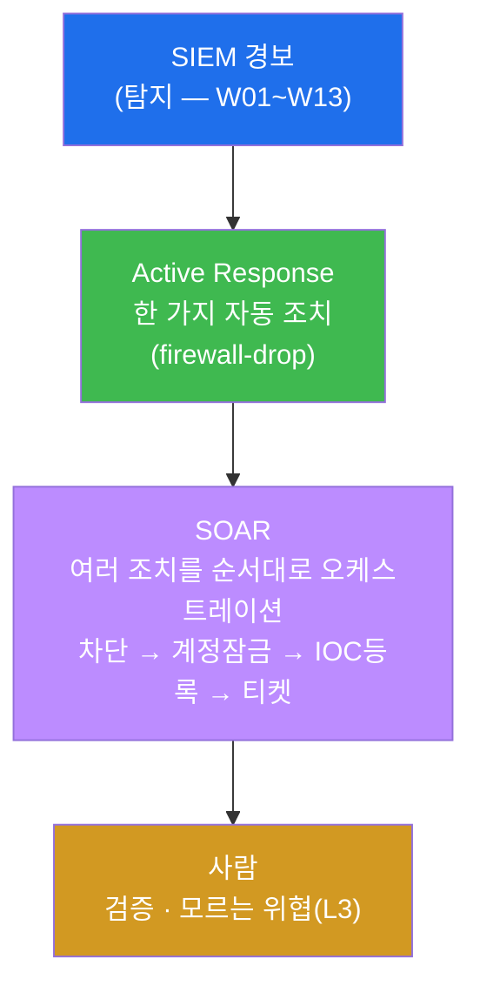
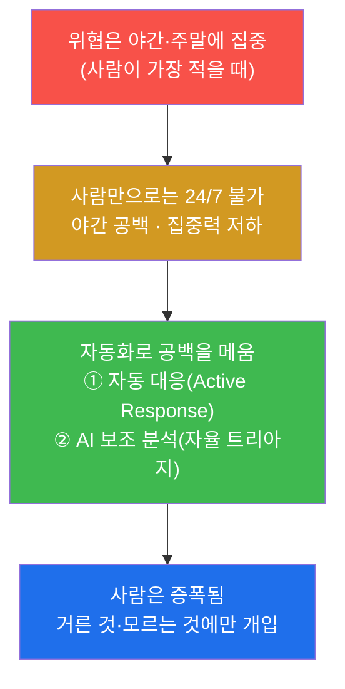
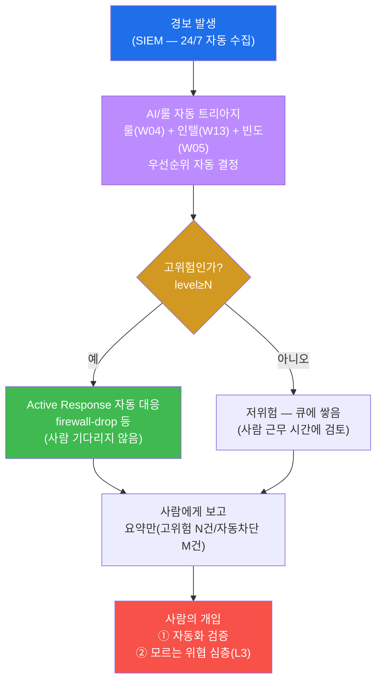
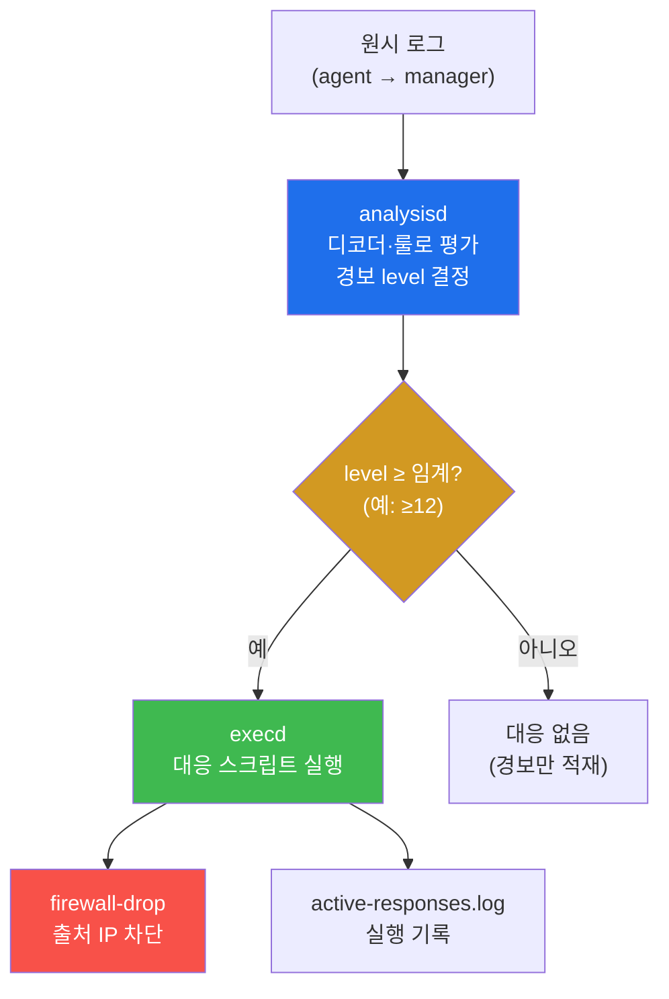
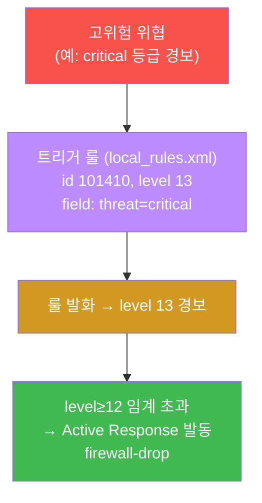
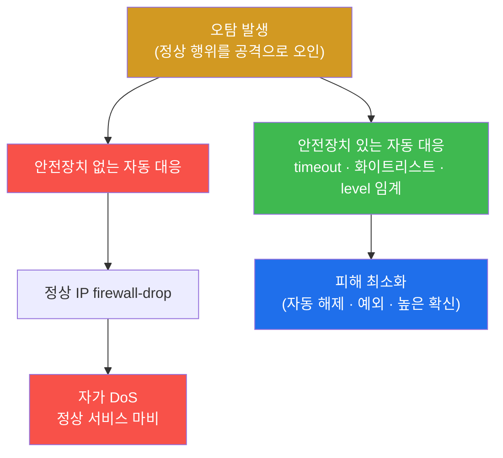
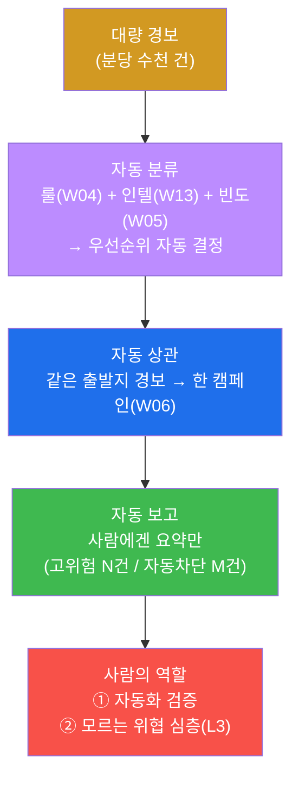
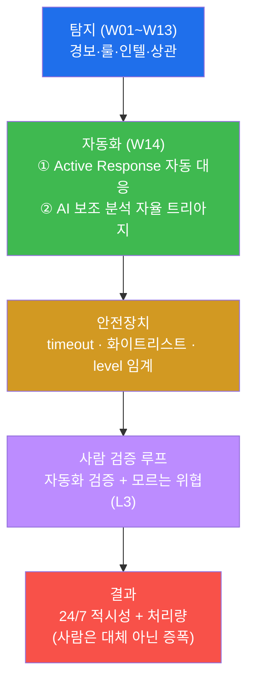
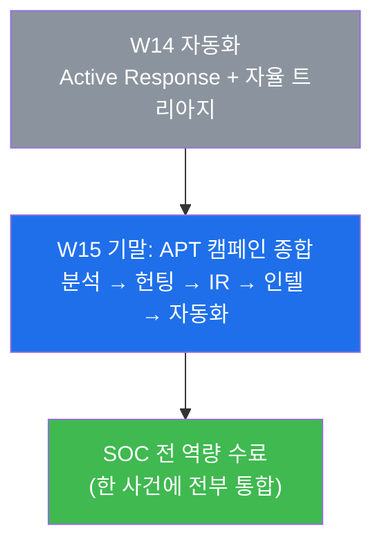

# SOC W14 — 야간 근무는 잠들지 않는다: AI 보조 분석과 Active Response 자동 대응

> **본 주차의 한 줄 요약**
>
> 지난 13주 동안 학생은 SOC 분석가의 손기술을 하나씩 쌓았다 — 트리아지(W01),
> 인증·웹·네트워크 로그 분석(W02–W03), Wazuh 커스텀 룰(W04), 경보 관리(W05),
> ATT&CK 캠페인(W06), SIGMA(W07), IR 절차(W09), 위협 헌팅(W11), 위협 인텔(W13).
> 그런데 이 모든 분석에는 한 가지 전제가 있었다 — **사람이 화면 앞에 있어야 한다.**
> 위협은 사람이 가장 적은 **야간·주말**에 몰려오는데, 분석가는 24시간 7일 내내 깨어
> 있을 수 없다. W14 는 이 빈틈을 메우는 두 가지 자동화를 다룬다 — 사람을 기다리지 않고
> 규칙대로 즉시 조치하는 **Active Response(자동 대응)** 와, 1차 분류를 사람 대신 해 주는
> **AI 보조 분석(자율 트리아지)** 이다. 다만 자동화는 양날의 칼이다 — 한 번의 오탐이
> 정상 서비스를 영구 차단하는 **자가 DoS** 를 일으킬 수 있다. 그래서 이번 주의 진짜
> 주제는 "자동화를 어떻게 켜느냐" 가 아니라 "**안전장치를 갖춘 자동화를 어떻게
> 설계하느냐**" 다.
>
> **분석가 한 줄 결론**: 자동화는 사람을 **대체**하는 것이 아니라 **증폭**한다. 자동화가
> 거른 위협과 자동화가 모르는 위협에만 사람이 개입하면, 같은 인원으로 더 많은 위협을
> 더 빠르게 막는다. 단, 안전장치(timeout · 화이트리스트 · level 임계)와 사람의 검증
> 루프가 없는 자동화는 위협보다 위험하다.

---

## 학습 목표

본 주차 종료 시 학생은 다음 6가지를 **본인 손으로** 할 수 있어야 한다.

1. SOC 자동화의 두 축 — **Active Response**(규칙 기반 자동 조치)와 **AI 보조 분석**(자동
   트리아지) — 이 각각 무엇을 자동화하는지, 사람의 역할이 어떻게 재배치되는지를 한 그림으로
   설명한다.
2. Wazuh 의 자동 대응 토대(`analysisd` 평결 → `execd` 실행 → `active-responses.log` 기록)를
   직접 점검하고, `ossec.conf` 의 `<command>` 와 `<active-response>` 블록이 "무엇을·언제·얼마나"를
   어떻게 매핑하는지 읽는다.
3. 고위험 경보(level≥12)에서만 자동 대응이 발동하도록 **트리거 룰**(`local_rules.xml`, level 13)을
   설계하고 `wazuh-logtest` 로 발화를 검증한다(공유 인프라이므로 실제 차단은 하지 않는다).
4. 자동화의 양날 — **자가 DoS** 의 위험을 설명하고, 이를 막는 세 안전장치(**timeout** 자동 해제 ·
   **화이트리스트** 예외 · **level 임계** 확신)를 설계에 적용한다.
5. **AI 보조 분석(자율 트리아지)** 이 룰(W04) + 인텔(W13) + 빈도(W05)로 1차 분류를 자동화하고,
   상관(W06)으로 캠페인을 묶고, 사람에게는 요약만 올리는 흐름을 설명한다. tw2 플랫폼의 관제(gwanje)가
   이 자율 트리아지의 실례임을 안다.
6. 위 전 과정(자동 대응 설계 → 안전장치 → 자율 트리아지 → 무인 효과)을 한 장의 자동 대응 보고서로
   종합하고, "자동화는 안전장치 + 사람 검증 루프와 함께여야 한다"는 결론을 근거와 함께 쓴다.

> **본 주차의 시선** — W14 는 새 분석 기법을 배우는 주가 아니라, 지금까지 배운 분석·탐지·인텔을
> **사람 없이도 굴러가게 자동화**하는 주다. 그래서 채점은 "자동화를 켰는가"가 아니라, **자동 대응이
> 언제·무엇을·얼마나 하도록 설계했는가**, **안전장치로 자가 DoS 를 어떻게 막았는가**, 그리고 **사람의
> 역할을 어디에 남겼는가**를 본다. 공유 el34 에서 실제 firewall-drop 은 **설계·점검까지만** 한다(아래
> §3 경고).

---

## 0. 용어 해설 (자동 대응·AI 보조 분석 입문)

본 주차는 자동화 용어가 처음 다수 등장한다. 한 줄 정의를 먼저 표로 두고, 신입생이 가장 헷갈리는
세 개념(Active Response, SOAR, 자가 DoS)은 §0.5 에서 일상 비유로 풀어 설명한다. 본문에서 다시
만나 막히면 본 절로 돌아오면 흐름이 끊기지 않는다.

| 용어 | 영문 | 뜻 | 비유 |
|------|------|----|------|
| **자동 대응** | Active Response | 고위험 경보에 사람을 기다리지 않고 SIEM 이 즉시 조치(차단 등) | 화재경보가 울리면 자동으로 작동하는 스프링클러 |
| **AI 보조 분석** | AI-assisted analysis | 1차 트리아지·분류·상관을 규칙/AI 가 사람 대신 자동 수행 | 1차 환자 분류를 대신하는 자동 접수 시스템 |
| **자율 트리아지** | autonomous triage | AI 보조 분석의 구체형 — 경보를 자동 분류·우선순위화 | 응급실 자동 중증도 분류기 |
| **SOAR** | Security Orchestration, Automation & Response | 탐지(SIEM) 뒤 대응을 **자동화·오케스트레이션**하는 상위 개념 | 경보부터 출동·보고까지 잇는 자동 관제 시스템 |
| **firewall-drop** | — | Wazuh 의 내장 자동 대응 — 공격 출처 IP 를 방화벽에서 일시 차단 | 침입자 출입카드를 즉시 무효화 |
| **execd** | execution daemon | Wazuh 에서 자동 대응 스크립트를 **실제로 실행**하는 데몬 | 스프링클러를 트는 작동 모터 |
| **analysisd** | analysis daemon | 로그를 디코더·룰로 평가해 경보 level 을 매기는 Wazuh 의 두뇌 | 화재 감지 센서의 판단 회로 |
| **level 임계** | level threshold | 자동 대응을 발동시킬 최소 경보 심각도(예: level≥12) | 스프링클러를 트는 최소 연기 농도 |
| **timeout** | — | 자동 차단을 일정 시간 뒤 **스스로 해제**하는 안전장치 | 일정 시간 뒤 자동으로 풀리는 임시 잠금 |
| **화이트리스트** | whitelist / allow-list | 자동 대응에서 **절대 차단하지 않을** 신뢰 IP 목록 | 차단 대상에서 빼두는 VIP 명단 |
| **자가 DoS** | self-inflicted DoS | 오탐 한 번에 자동 대응이 정상 서비스를 차단해 스스로 마비 | 오작동 스프링클러가 멀쩡한 사무실을 물바다로 |
| **무인 대응** | unattended response | 사람이 없는 시간(야간·주말)에 자동화만으로 1차 대응 | 야간 무인 경비 시스템 |
| **검증 루프** | human-in-the-loop | 자동화 결과를 사람이 사후 검증·교정하는 안전 절차 | 자동 분류 후 의사가 재확인 |
| **오탐** | false positive | 정상 행위를 공격으로 잘못 판정 | 멀쩡한 사람을 침입자로 오인 |

> **헷갈리기 쉬운 한 쌍 — 탐지 vs 대응.** W01–W13 은 거의 전부 **탐지·분석**이었다 — "무슨 일이
> 일어났나"를 읽는 일. W14 의 Active Response 는 **대응**이다 — "그래서 즉시 무엇을 하나". SIEM 이
> 경보를 띄우는 것(탐지)과, 그 경보에 자동으로 IP 를 차단하는 것(대응)은 다른 단계다. W14 는 탐지의
> 끝에 **자동 대응**을 붙인다.

---

## 0.5 신입생 친화 핵심 용어 개념 설명

### 0.5.1 Active Response — 자동 스프링클러 비유

건물에 화재경보기가 있다고 하자. 경보기는 연기를 감지하면 "삐── 불이야!" 하고 **알린다**. 하지만
알리기만 해서는, 야간에 건물에 아무도 없으면 불은 그대로 번진다. 그래서 현대 건물은 한 단계를 더
둔다 — 연기 농도가 일정 기준을 넘으면 **사람을 기다리지 않고 스프링클러가 자동으로 물을 뿌린다.**

이 자동 스프링클러가 SOC 세계에서는 **Active Response(자동 대응)** 다.

**Active Response** 는 SIEM 이 고위험 경보를 받았을 때, 분석가가 화면을 보고 손을 쓸 때까지 기다리지
않고 **미리 정한 조치를 즉시 자동 실행**하는 기능이다. el34 의 Wazuh 에서 대표 조치는
**firewall-drop** — 공격 출처 IP 를 방화벽에서 일시 차단하는 것이다.

**비유 매핑.**

| 자동 스프링클러 | Wazuh Active Response |
|------------------|----------------------|
| 연기 감지 센서 | `analysisd` (로그를 평가해 경보 level 결정) |
| "농도 N 이상이면 작동" 기준 | `level≥12` 임계 |
| 물을 트는 작동 모터 | `execd` (대응 스크립트 실행) |
| 물 뿌리기 | `firewall-drop` (출처 IP 차단) |
| 일정 시간 뒤 잠금 자동 해제 | `timeout` (예: 600초 후 차단 해제) |

핵심은 **사람이 그 자리에 없어도 동작한다**는 것이다. 그것이 야간·주말 위협을 막는 힘이자, 동시에
오작동했을 때 위험한 이유다(§0.5.3).

### 0.5.2 SOAR — 경보부터 출동까지 잇는 자동 관제

Active Response 는 "한 가지 조치를 자동으로" 하는 것이다. 이것을 더 크게, "**여러 조치를 순서대로
자동으로**" 엮은 상위 개념이 **SOAR** 다.

**SOAR(Security Orchestration, Automation and Response)** 는 탐지(SIEM) 이후의 대응 과정을
**자동화(Automation)** 하고 여러 도구를 **오케스트레이션(Orchestration)** 하는 플랫폼·개념이다. 예를
들면 "고위험 경보 발생 → ① 출처 IP 방화벽 차단 → ② 관련 계정 잠금 → ③ 인텔 플랫폼에 IOC 등록 →
④ 담당자에게 티켓 자동 생성"을 사람 손 없이 한 흐름으로 잇는 것이다.



**el34 의 위치.** el34 의 Wazuh Active Response 는 **SOAR 로 가는 첫 걸음** — "한 가지 조치
(firewall-drop)의 자동화"다. 완성형 SOAR 플랫폼(예: Shuffle, Cortex XSOAR)은 본 과정의 범위를
넘지만, "탐지 뒤의 대응을 자동화한다"는 발상은 동일하다. W14 에서 배우는 Active Response 설계가 곧
SOAR 설계의 축소판이다.

### 0.5.3 자가 DoS — 오작동 스프링클러 비유

자동 스프링클러의 무서운 점을 떠올려보자. 누군가 담배 연기를 잠깐 피웠을 뿐인데 센서가 과민 반응해
스프링클러가 작동하면, **불도 없는데 멀쩡한 사무실이 물바다**가 된다. 침입자가 한 일이 아니라,
**방어 장치 스스로가** 업무를 마비시킨 것이다.

이 사고가 SOC 자동화에서는 **자가 DoS(self-inflicted Denial of Service)** 다.

**자가 DoS** 는 자동 대응이 **오탐**(정상 행위를 공격으로 오인)에 발동해, 정상 사용자·서비스를 차단해
스스로 서비스 거부 상태를 만드는 사고다. 예를 들어 자동 대응이 회사 본사의 공인 IP 를 공격으로
오판해 firewall-drop 하면, 그 IP 뒤의 전 직원이 서비스에 못 들어간다. 공격자는 아무것도 안 했는데
방어가 스스로 무너지는 것이다.

그래서 자동 대응에는 반드시 세 안전장치가 따라붙는다(§3).

- **timeout** — 차단을 영구로 두지 않고 일정 시간 뒤 **자동 해제**한다(오탐이어도 피해가 시간제한).
- **화이트리스트** — 내부망·중요 서버 IP 는 **절대 차단하지 않는다**(VIP 명단).
- **level 임계** — **충분히 확신할 때(level≥12)만** 자동 대응하고, 낮은 확신은 사람이 확인한다.

스프링클러로 비유하면 — 일정 시간 뒤 물을 자동으로 잠그고(timeout), 서버실 위에는 스프링클러를 두지
않으며(화이트리스트), 연기 농도가 확실히 높을 때만 작동시키는(level 임계) 것이다.

### 0.5.4 AI 보조 분석 — 자동 접수·중증도 분류 비유

응급실을 떠올려보자. 환자가 밀려들 때 의사가 한 명씩 처음부터 다 진찰하면 정작 위급한 환자가
밀린다. 그래서 입구에 **자동 접수 + 1차 중증도 분류**를 둔다 — 체온·혈압·증상을 자동으로 재서
"이 환자는 즉시 처치(빨강), 이 환자는 대기 가능(초록)"으로 미리 나눈다. 의사는 그 분류를 **검증**하고,
애매하거나 위중한 환자에 집중한다.

이 자동 1차 분류가 SOC 에서는 **AI 보조 분석(자율 트리아지)** 이다.

**AI 보조 분석** 은 사람이 하던 1차 트리아지(경보 분류·우선순위화)를 규칙 또는 AI 가 **자동으로
대신**하는 것이다. el34/tw2 에서는 다음을 자동화한다.

- **자동 분류** — 룰(W04) + 인텔(W13) + 빈도(W05)를 종합해 우선순위를 자동 결정한다.
- **자동 상관** — 같은 출발지의 경보들을 한 캠페인으로 묶는다(W06).
- **자동 보고** — 사람에게는 raw 경보가 아니라 **요약**만 올린다("고위험 N건, 자동 차단 M건").

> **참고 — tw2 의 gwanje 가 그 실례다.** tw2 플랫폼의 관제 도구(`gwanje`)가 바로 이 자율 트리아지의
> 한 예다 — **deterministic 규칙**(무료·결정론적)으로 1차 분류하고, 필요할 때만 **선택적으로 AI**를
> 붙인다. "전부 AI 에 맡긴다"가 아니라 "규칙으로 거를 수 있는 건 규칙으로, 판단이 필요한 것만 AI 로"가
> 핵심이다. 그리고 최종 판단과 모르는 위협의 심층 분석(L3)은 사람이 한다.

이 비유에서 잊지 말 것 — 자동 분류기는 의사를 **대체**하지 않는다. 의사는 분류를 **검증**하고 위중한
환자에 집중한다. SOC 도 같다 — 사람은 자동화가 거른 것을 검증하고, 자동화가 **모르는** 위협(L3)에
시간을 쓴다.

---

## 1. 사람은 자지만 SOC 는 안 잔다

### 1.1 한 줄 답: 위협은 사람이 가장 적을 때 온다

W01 에서 우리는 SOC 를 "경보의 강을 다루는 곳"이라 했다. 그 강은 24시간 멈추지 않고 흐르는데,
강을 지키는 분석가는 24시간 깨어 있을 수 없다. 공격자도 이 사실을 안다 — 그래서 침입은 **야간·주말·
연휴**, 즉 분석가가 가장 적은 시간에 몰린다. 사람만으로 24/7 을 메우려면 3교대 인력이 필요하고,
야간에는 집중력도 떨어진다. 답은 사람을 늘리는 것이 아니라 **자동화**다.



### 1.2 자동화 파이프라인 — 경보에서 무인 대응까지

자동화 SOC 의 전체 흐름은 다음과 같다. 왼쪽(탐지)은 W01–W13 에서 이미 다 배웠고, W14 는 오른쪽
(자동 트리아지 + 자동 대응)을 새로 붙인다.



이 그림이 W14 전체의 지도다. 경보는 24시간 자동으로 수집되고(SIEM), AI/룰이 1차로 분류해
(자율 트리아지), 고위험이면 사람을 기다리지 않고 자동 조치하며(Active Response), 사람에게는 요약만
올린다. 사람의 역할은 사라지는 게 아니라 **재배치**된다 — raw 경보를 일일이 보는 노동에서 벗어나,
**자동화가 거른 것을 검증**하고 **자동화가 모르는 위협**에 집중한다.

### 1.3 왜 중요한가 — 적시성과 처리량

자동화가 주는 이득은 두 가지다. 첫째 **적시성(timeliness)** — 야간 03시에 일어난 고위험 공격에
사람은 아침 09시에야 반응하지만, 자동 대응은 **수 초 안에** 출처를 차단한다. 그 6시간의 차이가
데이터 유출이 일어나느냐 아니냐를 가른다. 둘째 **처리량(throughput)** — 분당 수천 건의 경보를
사람이 다 볼 수는 없지만, 룰·AI 가 1차로 걸러 요약하면 같은 인원이 훨씬 많은 위협을 감당한다.
한마디로 자동화는 **느린 인간의 반응 속도와 한정된 처리 용량**이라는 두 병목을 동시에 푼다.

### 1.4 한계 — 자동화가 다루지 못하는 것

자동화는 만능이 아니다. 첫째, **모르는 위협은 못 막는다** — 자동 대응과 자율 트리아지는 모두 "이미
정의된 룰·인텔·임계"에 기댄다. 시그니처 없는 신종 공격(0-day)이나 정상으로 위장한 정교한 공격은
자동화의 그물을 빠져나간다. 그래서 사람의 심층 분석(L3)이 여전히 필요하다. 둘째, **틀리면 위험하다** —
자동 대응이 오탐에 발동하면 자가 DoS 를 일으킨다(§3). 셋째, **완전 무인은 위험하다** — 자동화는
사람의 검증 루프(human-in-the-loop) 안에서만 안전하다. 그래서 W14 의 목표는 "사람을 없애는 자동화"가
아니라 "**사람을 증폭하는, 안전장치를 갖춘 자동화**"다.

---

## 2. Active Response — 자동 대응의 구조

### 2.1 한 줄 정의: 고위험 경보에 사람을 기다리지 않고 즉시 조치

**Active Response** 는 Wazuh 가 고위험 경보를 받았을 때, 사람의 손을 기다리지 않고 미리 정한 조치를
자동 실행하는 기능이다. el34 의 대표 조치는 **firewall-drop** — 공격 출처 IP 를 방화벽에서 일시
차단하는 것이다(앞 §0.5.1 의 자동 스프링클러).

### 2.2 세 톱니바퀴 — analysisd · execd · 설정

Active Response 가 돌아가려면 세 부품이 맞물려야 한다. 이 셋의 관계를 정확히 이해하는 것이 W14 의
핵심이다.



- **`analysisd`(분석 데몬)** — Wazuh 의 두뇌. 들어온 로그를 디코더·룰로 평가해 경보 level 을 매긴다
  (W04 에서 배운 탐지 파이프라인의 핵심). "이 경보가 얼마나 심각한가"를 결정하는 곳.
- **`execd`(실행 데몬)** — Active Response 의 손. level 이 임계를 넘으면 정해진 대응 스크립트를
  **실제로 실행**한다. firewall-drop 을 트는 것이 바로 이 데몬이다.
- **설정(`ossec.conf`)** — "무엇을·언제·얼마나" 하는지를 적어 둔 매뉴얼. analysisd 와 execd 는 이
  설정을 보고 동작한다.

> **점검 명령(el34 호스트에서).** 자동 대응의 토대가 살아 있는지는 두 데몬과 설정 수로 확인한다.
> ```bash
> docker exec el34-siem /var/ossec/bin/wazuh-control status | grep -E "analysisd|execd"
> docker exec el34-siem sh -c 'grep -c active-response /var/ossec/etc/ossec.conf'
> ```
> `analysisd`(평결)와 `execd`(실행)가 모두 running 이고 `active-response` 설정이 존재해야 자동 대응의
> 토대가 갖춰진 것이다. 이 점검이 실습 lab 1 의 내용이다.

### 2.3 설정 읽기 — command 와 active-response 의 매핑

`ossec.conf` 의 자동 대응 설정은 **두 블록의 쌍**으로 이루어진다 — **무엇을 하느냐**(`<command>`)와
**언제·얼마나 하느냐**(`<active-response>`)다.

```xml
<!-- ① command: "무엇을" — firewall-drop 이라는 조치를 정의 -->
<command>
  <name>firewall-drop</name>
  <executable>firewall-drop</executable>     <!-- execd 가 실행할 스크립트 -->
  <timeout_allowed>yes</timeout_allowed>      <!-- 자동 해제 허용 -->
</command>

<!-- ② active-response: "언제·얼마나" — 그 조치를 어떤 경보에, 얼마 동안 -->
<active-response>
  <command>firewall-drop</command>            <!-- 위에서 정의한 조치를 -->
  <location>local</location>                  <!-- 어디서 실행할지 -->
  <level>12</level>                           <!-- level≥12 경보에 발동 (임계) -->
  <timeout>600</timeout>                       <!-- 600초 후 자동 해제 (안전장치) -->
</active-response>
```

각 줄의 의미는 다음과 같다.

- `<command>` 블록은 **조치 자체를 정의**한다. `name` 은 이름표, `executable` 은 execd 가 실제로
  돌릴 스크립트(firewall-drop), `timeout_allowed`는 "이 조치는 자동 해제될 수 있다"는 허가다.
- `<active-response>` 블록은 그 조치를 **언제·얼마나** 적용할지 묶는다. `level` 은 발동 임계
  (level≥12 의 고위험 경보에만), `timeout` 은 차단 지속 시간(600초 뒤 자동 해제)이다.

즉 "**firewall-drop(무엇을)을 level≥12 경보(언제)에 600초 동안(얼마나)** 적용한다"가 이 한 쌍의
의미다. 실행 결과는 `/var/ossec/logs/active-responses.log` 에 한 줄씩 기록된다 — 언제 어느 IP 를
차단·해제했는지의 감사 추적이다.

> **el34 의 기본 상태 — 주석 템플릿(미활성).** el34 의 `ossec.conf` 에는 위와 같은 active-response
> 설정이 **주석 처리된 템플릿**으로만 들어 있다. 즉 **기본값은 비활성**이다. 활성화하려면 주석을
> 풀고 manager 를 재시작해야 하며, 그 순간부터 level≥12 경보에 firewall-drop 이 자동 발동한다.
> **본 실습에서는 활성화하지 않는다** — 이유는 바로 다음 §3 의 경고다.

### 2.4 트리거 룰 — 자동 대응의 방아쇠 (level≥12)

Active Response 는 "level 이 임계를 넘는 경보"에만 발동한다. 그러므로 자동 대응을 설계한다는 것은
곧 "어떤 위협을 **level≥12 로 평가하는 룰**을 만드느냐"다. 이것이 W04 에서 배운 커스텀 룰 작성의
연장이다 — W04 가 "탐지(경보를 띄운다)"였다면, W14 는 "그 경보의 level 을 자동 대응 임계 이상으로
올려 방아쇠를 당긴다"다.



실습 lab 4 에서 학생은 `local_rules.xml` 에 **id 101410, level 13** 의 트리거 룰을 추가하고
`wazuh-logtest` 로 발화를 검증한다. level 13 은 자동 대응 임계(level≥12)를 넘으므로, 활성 환경이라면
이 룰이 발화하는 순간 firewall-drop 이 자동 실행될 것이다. 다만 **공유 인프라이므로 실제 발동은 하지
않고, logtest 로 "룰이 제대로 발화하는가"까지만 검증**한다. 그리고 검증 후에는 반드시 `local_rules.xml`
을 백업본으로 **원상 복구**한다(W04 에서 배운 베이스 보존 원칙).

> **용어 — wazuh-logtest.** Wazuh 의 룰 검증 도구다(W04 에서 학습). 로그 한 줄을 표준입력으로 넣으면
> 디코더·룰을 거쳐 "어느 룰이 발화하고 level 이 얼마인지"를 보여준다. 공유 SIEM 을 건드리지 않고
> 룰을 안전하게 시험하는 표준 방법이다.

---

## 3. 안전장치 — 자동화의 양날

### 3.1 자가 DoS — 자동화가 스스로를 공격한다

§0.5.3 에서 본 대로, 자동 대응의 가장 큰 위험은 **자가 DoS** 다. 자동 대응이 **오탐**에 발동해
정상 IP 를 차단하면, 공격자는 아무것도 안 했는데 방어 장치 스스로가 서비스를 마비시킨다. 예컨대
정상 트래픽이 우연히 고위험 룰을 발화시키고, 그 출처가 회사 본사의 공인 IP 였다면 — firewall-drop
한 번에 전 직원이 서비스에서 차단된다. **자동화는 빠른 만큼, 틀렸을 때의 피해도 빠르고 크다.**



### 3.2 세 안전장치

자가 DoS 를 막는 세 안전장치는 자동 대응 설계의 필수 요소다. 하나라도 빠지면 자동 대응은 위협보다
위험할 수 있다.

| 안전장치 | 무엇을 하나 | 왜 필요한가 |
|----------|------------|------------|
| **timeout** | 차단을 일정 시간(예: 600초) 뒤 **자동 해제** | 오탐이어도 피해가 시간제한 — 영구 차단을 원천 방지 |
| **화이트리스트** | 내부망·중요 서버 IP 는 **절대 차단 안 함** | 핵심 자산을 자동 대응의 사고로부터 보호 |
| **level 임계** | **충분히 확신할 때(level≥12)만** 자동 대응 | 낮은 확신은 사람이 확인 — 오탐 발동 자체를 줄임 |

- **timeout** 은 "틀려도 영구는 아니다"를 보장한다. 차단을 600초 뒤 자동으로 풀면, 오탐으로 정상 IP
  를 막았더라도 피해가 10분으로 제한된다. firewall-drop 의 `<timeout>600</timeout>` 이 이것이다.
- **화이트리스트** 는 "이 IP 는 무슨 일이 있어도 건드리지 않는다"는 예외 명단이다. 내부 관리망,
  본사 공인 IP, 모니터링 서버 등 자동 차단되면 큰 사고가 나는 대상을 미리 빼둔다.
- **level 임계** 는 "확신이 높을 때만 손을 쓴다"는 원칙이다. level 을 충분히 높게(≥12) 잡으면 어지간한
  오탐은 임계 아래에 머물러 자동 대응이 발동조차 하지 않고, 그런 애매한 경보는 사람이 검토한다.

### 3.3 사람의 검증 루프 — 완전 무인은 위험하다

세 안전장치 위에 한 겹이 더 있다 — **사람의 검증 루프(human-in-the-loop)** 다. 자동 대응이 무엇을
차단했는지를 사람이 사후에 검토해, 오탐이면 화이트리스트에 추가하고 룰을 교정한다. 자동화는 **사람을
대체하는 것이 아니라 1차 방어를 맡아 시간을 벌어 주는 것**이고, 그 시간에 사람은 자동화의 결정을
검증하고 개선한다. "켜두고 잊는(set and forget)" 자동화가 가장 위험하다.

> ⚠️ **공유 el34 에서의 절대 수칙.** el34 는 여러 학생이 함께 쓰는 공유 인프라다. 따라서 실제
> firewall-drop 을 **활성화하거나 트리거하지 않는다** — 한 학생의 자동 차단이 다른 학생의 출처 IP 를
> 막아 전체 실습을 마비시킬 수 있다(공유 환경에서의 자가 DoS). 본 주차의 실습은 **설정 점검 · 룰
> 설계 · logtest 검증까지만** 한다. 실제 차단의 발동은 하지 않는다.

---

## 4. AI 보조 분석 — 자율 트리아지

### 4.1 한 줄 정의: 1차 트리아지를 사람 대신 자동화

**AI 보조 분석(자율 트리아지)** 은 사람이 하던 1차 경보 분류·우선순위화를 규칙 또는 AI 가 자동으로
대신하는 것이다(§0.5.4 의 응급실 자동 분류). 지금까지 배운 분석 자산을 자동화에 그대로 투입한다.

### 4.2 무엇을 자동화하나 — 분류 · 상관 · 보고



- **자동 분류** — 한 경보의 우선순위를 세 신호로 자동 결정한다. **룰**(W04 — 무엇이 탐지됐나) +
  **인텔**(W13 — 출처/도구가 알려진 악성인가) + **빈도**(W05 — 얼마나 자주 발생하나)를 종합한다.
  예컨대 "SQLi 경보 + 출처가 known-bad + 단시간 다발"이면 자동으로 P1 로 격상한다.
- **자동 상관** — 같은 출발지에서 온 흩어진 경보들을 하나의 캠페인으로 자동으로 묶는다(W06 의
  ATT&CK 캠페인 읽기를 기계가 대신). "정찰 → 침투 → 자격증명"이 한 출처에서 시간순으로 보이면 한
  사건으로 합친다.
- **자동 보고** — 사람에게 raw 경보를 다 던지지 않고 **요약**만 올린다 — "지난 8시간 동안 고위험
  N건 발생, 그중 M건은 자동 차단됨, 미해결 K건은 검토 요망". 사람은 이 요약에서 시작한다.

### 4.3 tw2 의 gwanje — 자율 트리아지의 실례

> **tw2 플랫폼의 관제(gwanje)가 이 자율 트리아지의 구체적 예다.** gwanje 는 **deterministic
> 규칙**(무료·결정론적)으로 학생 행동·경보를 1차 분류하고, 판단이 필요한 경우에만 **선택적으로 AI**를
> 붙인다(과금은 기본 차단). 이것이 현실적인 AI 보조 분석의 모습이다 — **규칙으로 거를 수 있는 건
> 규칙으로(싸고 빠르고 예측 가능), 진짜 판단이 필요한 것만 AI 로**. "전부 AI"는 비싸고 불투명하며,
> "전부 규칙"은 새로운 패턴에 약하다. 둘을 섞는 것이 정답에 가깝다.

### 4.4 사람의 역할 재배치 — 대체가 아니라 증폭

자율 트리아지의 핵심 오해를 짚자 — 자동화는 분석가를 **해고**하는 것이 아니다. 자동화는 raw 경보를
일일이 읽는 단순 노동을 가져가고, 사람은 두 가지 고부가 작업으로 **재배치**된다. 첫째 **자동화 검증** —
자동 분류·자동 차단이 옳았는지 사후 점검하고 오탐을 교정한다. 둘째 **모르는 위협의 심층 분석(L3)** —
룰·인텔에 없는 신종 위협, 정상으로 위장한 정교한 공격을 사람의 직관과 경험으로 파고든다. 자동화가
처리량을 떠받쳐 주므로, 사람은 비로소 **가장 어려운 위협**에 시간을 쓸 수 있다. 이것이 "대체가 아니라
증폭"의 의미다.

---

## 5. 실습 안내 — lab 8 미션 (4 축 설명)

본 주차 실습은 8 미션이다. 각 미션을 **4 축**으로 설명한다 — 왜 하는가 / 무엇을 알 수 있는가 /
결과 해석(정상 vs 비정상) / 실전 활용. 미션은 점검 → 위협 재현 → 자동 대응 설계·검증 → 안전장치 →
AI 자율 트리아지 → 무인 효과 → 종합 보고 순서로 흐른다.

> **실습 진행 원칙.** 모든 명령은 el34 호스트(`ssh ccc@192.168.0.80`, 비밀번호 1)에서 실행한다.
> 자동 대응 관련 작업은 `docker exec el34-siem`(Wazuh manager)에서 하고, 위협 재현은
> `docker exec el34-attacker` 다. **Active Response 는 점검·설계·logtest 까지만** 하고 실제
> firewall-drop 은 활성화·트리거하지 않는다(공유 인프라 — §3 경고). 룰을 추가한 미션은 반드시
> 백업본으로 원상 복구한다. 합격 임계값은 0.7 이다.

### 미션 1 — 점검: Wazuh + Active Response 설정 (10점)

> **왜 하는가?** 자동 대응을 설계하기 전에, 그 토대(평결 데몬 + 실행 데몬 + 설정)가 살아 있는지부터
> 확인한다. 토대가 없으면 어떤 자동 대응도 동작하지 않는다.
>
> **무엇을 알 수 있는가?** `analysisd`(경보 level 평결)와 `execd`(대응 실행)가 모두 running 인지,
> `ossec.conf` 에 `active-response` 설정이 존재하는지. 이 셋이 자동 대응의 세 톱니바퀴다(§2.2).
>
> **결과 해석.** 정상: `analysisd` 와 `execd` 가 모두 running 으로 보이고 `active-response` 설정
> 수가 1 이상. 비정상: `execd` 가 안 보이면 자동 대응 실행 자체가 불가하므로 먼저 데몬 상태를 점검.
>
> **실전 활용.** 자동 대응을 켜기 전 운영자의 첫 점검 — "조치를 실행할 손(execd)이 살아 있는가"를
> 확인하는 표준 절차.

### 미션 2 — 야간 위협 재현: 고위험 공격 (8점)

> **왜 하는가?** 자동 대응의 대상이 될 고위험 위협을 직접 만들어, 이후 설계가 겨냥할 표적을 세운다.
> 야간·주말에 몰려오는 위협을 통제된 환경에서 재현하는 것이다.
>
> **무엇을 알 수 있는가?** sqlmap UA 를 단 SQLi 공격(`sqlmap/1.7`, dvwa vhost 대상)이 어떻게 고위험
> 경보로 이어지는지. 이 한 번의 재현이 이후 자동 대응 설계의 맥락이 된다.
>
> **결과 해석.** 정상: 공격이 실행되고 `night threat done` 이 출력됨. 비정상: 공격이 실패하면 이후
> 미션에서 겨냥할 위협 맥락이 비므로, 재현부터 다시 한다.
>
> **실전 활용.** 자동 대응 설계를 검증할 때, 통제된 고위험 공격을 재현해 "우리 자동화가 이 위협을
> 잡고 조치하는가"를 점검하는 표준 절차.

### 미션 3 — Active Response 점검: 자동 대응 설계 (12점)

> **왜 하는가?** el34 의 `ossec.conf` 에 들어 있는 자동 대응 템플릿을 직접 읽어, "무엇을·언제·얼마나"
> 매핑이 어떻게 되어 있는지 본다.
>
> **무엇을 알 수 있는가?** `<command>`(firewall-drop = 무엇을)와 `<active-response>`(level/timeout =
> 언제·얼마나)의 쌍 구조(§2.3), 그리고 실행 기록이 남는 `active-responses.log` 의 경로. el34 기본은
> **주석 템플릿(미활성)** 임을 확인.
>
> **결과 해석.** 정상: `active-response`·`firewall-drop`·`timeout` 키워드와 로그 경로가 보임. 비정상:
> 설정이 전혀 안 보이면 ossec.conf 경로나 컨테이너를 점검.
>
> **실전 활용.** 자동 대응을 인수받았을 때 "현재 무엇이·어떤 임계로·얼마 동안 자동 차단되도록
> 설계돼 있나"를 설정에서 읽어내는 핵심 작업.

### 미션 4 — 자동 대응 룰 설계: 고위험 트리거 (id 101410, 14점)

> **왜 하는가?** 자동 대응의 방아쇠 — 고위험 위협을 자동 대응 임계(level≥12) 이상으로 평가하는
> 트리거 룰을 직접 설계하고, 그것이 제대로 발화하는지 검증한다.
>
> **무엇을 알 수 있는가?** `local_rules.xml` 에 **id 101410, level 13** 의 룰을 추가해
> `wazuh-logtest` 로 발화를 확인하는 법. level 13 은 임계(≥12)를 넘으므로 활성 환경이라면 이 룰이
> firewall-drop 을 자동 발동시킨다는 것. 그리고 검증 후 백업본으로 원상 복구하는 안전 운영.
>
> **결과 해석.** 정상: logtest 출력에 룰 `101410` 이 발화하고 level 이 보이며, 복원 후 잔재가 0.
> 비정상: 룰이 안 잡히면 XML 문법(field 이름·decoded_as)을, 복원 잔재가 남으면 cp 복원을 점검.
>
> **실전 활용.** 자동 대응 설계의 핵심 — "이 위협을 만나면 자동 차단하라"는 정책을 룰의 level 로
> 표현하고, 공유 SIEM 을 망가뜨리지 않고 logtest 로 검증하는 표준 작업.

### 미션 5 — 안전장치: 자가 DoS 방지 (12점)

> **왜 하는가?** 자동 대응을 빠르게만 만들면 위협보다 위험하다. 자가 DoS 를 막는 세 안전장치를
> 정리해, "안전한 자동화"의 조건을 손에 익힌다.
>
> **무엇을 알 수 있는가?** **timeout**(자동 해제로 영구 차단 방지) · **화이트리스트**(내부/중요 IP
> 예외) · **level 임계**(높은 확신에만 발동)의 역할과, 셋이 없을 때의 자가 DoS 위험(§3).
>
> **결과 해석.** 정상: timeout·화이트리스트·level 임계 세 안전장치가 모두 정리됨. 비정상: 하나라도
> 빠지면 §3 으로 돌아가 자가 DoS 시나리오와 함께 보강.
>
> **실전 활용.** 자동 대응을 운영에 올릴 때의 필수 점검표 — "이 자동화가 오탐에 발동해도 자가 DoS 가
> 안 나는가"를 세 안전장치로 보증.

### 미션 6 — AI 자율 트리아지: 자동 분류 (8점)

> **왜 하는가?** 대량 경보를 사람이 다 볼 수 없을 때, 1차 분류를 자동화하는 자율 트리아지의 동작을
> 정리한다.
>
> **무엇을 알 수 있는가?** 룰(W04) + 인텔(W13) + 빈도(W05)로 우선순위를 자동 결정하고(자동 분류),
> 같은 출발지를 캠페인으로 묶고(자동 상관, W06), 사람에겐 요약만 올리는(자동 보고) 흐름. tw2 의
> gwanje 가 그 실례임(§4.3).
>
> **결과 해석.** 정상: 자동 분류·자동 상관·자동 보고와 사람 역할 재배치가 정리됨. 비정상: 사람의
> 역할이 빠지면 "대체가 아니라 증폭"(§4.4) 관점으로 보강.
>
> **실전 활용.** SOC 운영 설계 — 어떤 트리아지를 자동화하고 사람을 어디에 둘지 결정하는 관점.

### 미션 7 — 무인 대응 효과: 24/7 적시성 (8점)

> **왜 하는가?** 자동화가 주는 이득(적시성·처리량)과 그 한계(안전장치·검증 루프 필수)를 함께
> 정리해, 자동화의 가치와 위험을 균형 있게 본다.
>
> **무엇을 알 수 있는가?** 야간·주말 고위험 위협에 수 초 내 자동 대응이 주는 **24/7 적시성**과
> **처리량**, 그리고 "완전 무인은 위험 — 안전장치 + 사람 검증 루프 필수"라는 한계(§1.4).
>
> **결과 해석.** 정상: 적시성·처리량의 이득과 사람 검증 루프의 필요가 함께 정리됨. 비정상: 이득만
> 적고 한계가 빠지면 "자동화는 증폭이지 무인 만능이 아니다"로 보강.
>
> **실전 활용.** 경영진에게 자동화 도입을 설득할 때 — 이득(적시성·처리량)과 안전 조건(검증 루프)을
> 함께 제시하는 균형 잡힌 보고.

### 미션 8 — 자동 대응 보고서 (10점)

> **왜 하는가?** 미션 1–7 을 한 문서로 종합해, 자동화 SOC 설계 능력을 입증한다 — 본 주차의 최종
> 산출물.
>
> **무엇을 알 수 있는가?** Active Response 설계(firewall-drop/level/timeout) + 자동 대응 룰(101410)
> + 안전장치(timeout/화이트리스트/임계) + AI 자율 트리아지·무인 효과를 한 보고서로 묶는 법.
>
> **결과 해석.** 정상: 보고서에 Active Response · 안전장치 · AI 자율이 모두 포함됨. 비정상: 한 축이라도
> 빠지면 해당 미션으로 돌아가 보강.
>
> **실전 활용.** 자동화 SOC 를 도입·인수인계할 때의 표준 설계 문서 — 자동 대응 정책 · 안전장치 ·
> 자율 트리아지 흐름을 한 장으로 정리.

---

## 6. 본 주차 마무리 — 안전장치를 갖춘 자동화

W14 를 한 그림으로 요약하면 다음과 같다. 자동화는 탐지(W01–W13) 위에 **자동 대응**과 **자율
트리아지**를 얹어 24/7 적시성과 처리량을 얻되, 반드시 **안전장치 + 사람 검증 루프** 안에서 동작해야
한다.



기억할 한 문장 — **자동화는 사람을 대체하는 것이 아니라 증폭한다.** 그리고 안전장치(timeout ·
화이트리스트 · level 임계)와 사람의 검증 루프가 없는 자동화는 위협보다 위험하다. 자동 대응은 빠르게
하되 안전하게, 자율 트리아지는 많이 거르되 사람이 검증하는 것 — 그것이 야간에도 잠들지 않는 SOC 의
바른 모습이다.

---

## 7. 다음 주차 (W15) 예고 — 기말: APT 캠페인 종합

W14 까지 학생은 SOC 의 전 역량을 익혔다 — 트리아지·로그 분석·커스텀 룰·경보 관리·ATT&CK·SIGMA·IR·
헌팅·인텔, 그리고 이번 주의 **자동화(자동 대응 + 자율 트리아지)**. W15 는 수료 시험이다. 한 **APT(지능형
지속 위협, Advanced Persistent Threat) 캠페인**을 SOC 전 역량으로 처음부터 끝까지 — 분석 → 트리아지 →
헌팅 → IR → 인텔 → 자동화 대응까지 — 일관되게 다룬다. W14 가 "사람 없이도 도는 자동화를 설계"하는
주였다면, W15 는 "그 모든 도구를 한 사건 위에서 통합"하는 종합 평가다.


