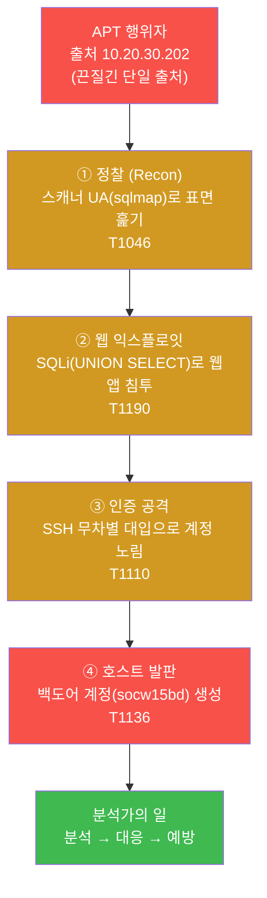
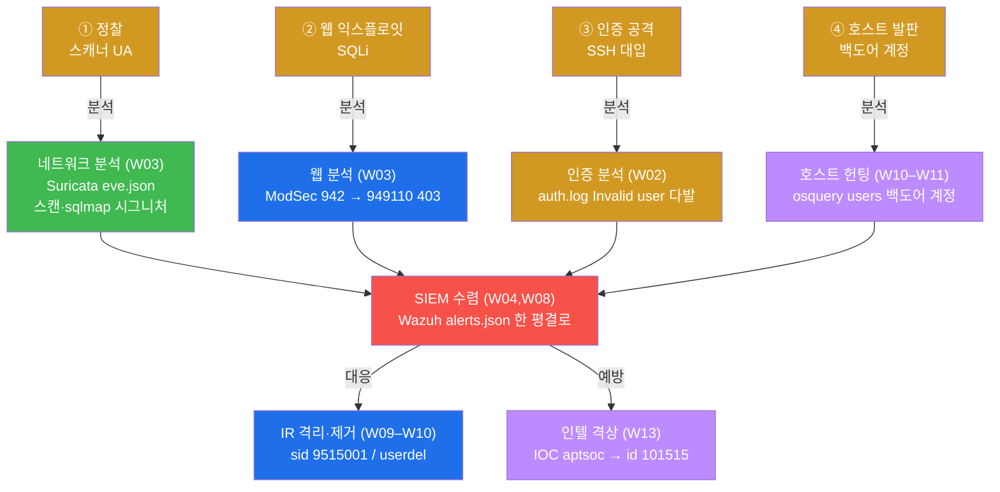
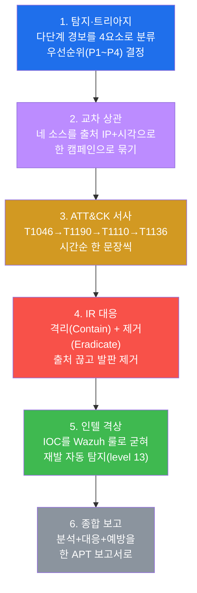
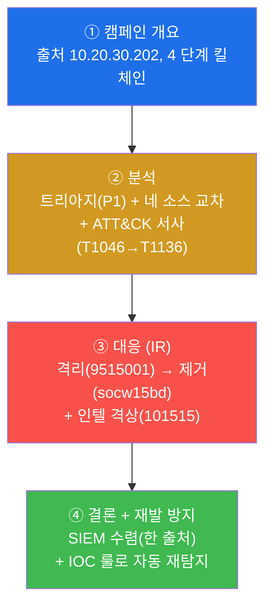
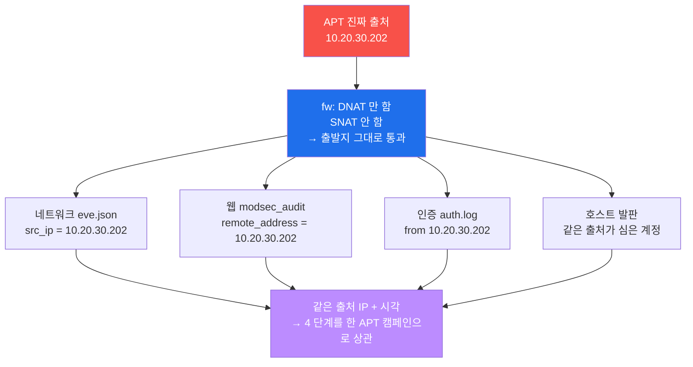
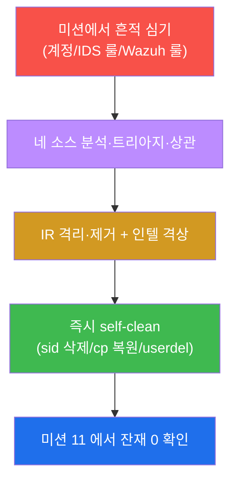
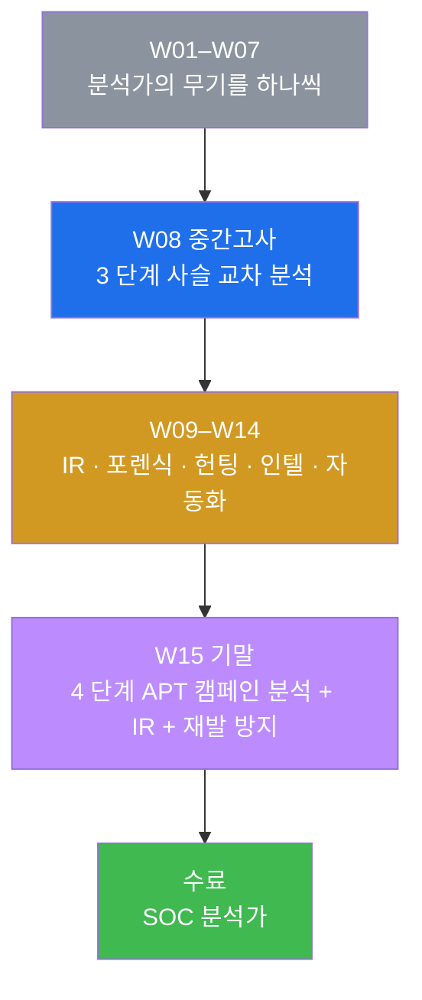

# SOC W15 — 기말(수료): 한 APT 캠페인을 SOC 분석가의 전 역량으로 분석하고 끝까지 대응하기

> **본 주차의 한 줄 요약**
>
> 지난 14주 동안 학생은 SOC(보안관제센터) 분석가의 무기를 **하나씩** 익혔다 —
> 경보 트리아지(W01) · 인증 로그 분석(W02) · 웹 로그 교차(W03) · Wazuh 커스텀 룰
> (W04) · 경보 관리·오탐 판정(W05) · ATT&CK 캠페인 읽기(W06) · SIGMA 다중 플랫폼
> 이식(W07) · 교차 분석 종합(W08 중간고사) · 사고대응(IR) 절차(W09) · 웹쉘 포렌식
> (W10) · 악성코드·C2 비콘(W11) · 내부 위협·UEBA(W12) · 인텔 주도 트리아지(W13) ·
> AI 자율 관제·자동 대응(W14). W08 중간고사가 한 침입자의 **3 단계 사슬**(정찰 → 웹
> 침투 → 인증 공격)을 흩어진 로그로 읽어 **한 서사로 종합**하는 시험이었다면, 기말은
> 그것을 끝까지 확장한다 — 한 **APT 그룹**이 **4 단계 킬체인**(정찰 → 웹 익스플로잇 →
> 인증 공격 → 호스트 발판)으로 들어오고, 학생은 **14주의 모든 무기를 하나의 캠페인에
> 총동원**해 분석(트리아지 → 교차 상관 → ATT&CK 서사)하고, **끝까지 대응**(IR 격리 →
> 제거 → 인텔 격상)한 뒤, 출처 IP 하나로 4 단계를 한 타임라인에 엮어 **APT 종합 보고서**로
> 마무리한다.
>
> **분석가 한 줄 결론**: 로그 하나만 보면 영영 단편이다. 그리고 분석은 "무슨 일이
> 일어났나"까지이고, 거기서 멈추면 공격자는 다시 온다. SOC 분석가의 완성형은 셋이다 —
> **흩어진 텔레메트리를 한 캠페인 서사로 읽고**(분석), **격리·제거로 끊고**(대응),
> **IOC 를 인텔로 굳혀 재발까지 자동으로 잡히게**(예방) 하는 것. 이걸 한 캠페인에서 끝까지
> 해내면 SOC 관제 과정을 **수료**할 자격이 있다.

---

## 학습 목표

본 주차(기말 평가) 종료 시 학생은 다음 6가지를 **본인 손으로** 할 수 있어야 한다.

1. APT(끈질긴 표적 공격)가 단발 공격과 어떻게 다른지, 그리고 **4 단계 킬체인**(정찰 → 웹
   익스플로잇 → 인증 공격 → 호스트 발판)이 각각 **어느 분석 소스에 어떤 흔적으로** 남고
   **SOC 분석가가 어느 단계에서 어떻게 대응**하는지를 한 표로 그린다.
2. 한 APT 행위자(출처 IP `10.20.30.202`)의 4 단계 캠페인을 재현하고, 그 흩어진 흔적을
   **트리아지 4요소**(출발지·시그니처·시각·심각도)로 분류해 **우선순위(P1~P4)**를 매긴다.
3. 네 소스(웹 `ModSec` / 인증 `auth.log` / 호스트 `osquery` / 통합 `Wazuh alerts.json`)를
   같은 출처 IP 로 **교차 상관**하고, 각 단계를 **MITRE ATT&CK**(T1046 정찰 → T1190 웹 침투
   → T1110 인증 공격 → T1136 발판)으로 매핑해 하나의 **공격 서사**로 종합한다.
4. 분석에서 멈추지 않고 **사고대응(IR)**을 끝까지 수행한다 — **격리(Contain)**로 APT
   출발지를 IDS 룰(sid `9515001`)로 플래그하고, **제거(Eradicate)**로 백도어 발판(계정
   `socw15bd`)을 osquery 확인 후 삭제한다.
5. 이 APT 의 IOC(`aptsoc`)를 **Wazuh 인텔 룰(id `101515`, level 13)**로 격상해 재발/변형이
   오면 자동으로 고위험 경보가 뜨게 만들고, 4 단계의 흔적이 `alerts.json` 한 곳으로 수렴해
   같은 출처 IP 로 한 캠페인에 엮임을 데이터로 증명한다.
6. 위 모든 과정(분석 → 대응 → 예방)을 **APT 종합 보고서**로 작성하고, 공유 인프라에 심은
   모든 흔적(계정 · IDS 룰 · Wazuh 룰)을 self-clean 해 베이스 상태로 복원한다.

---

## 0. 용어 해설 (기말에서 다시 쓰는 핵심어)

본 주차는 W01–W14 의 용어를 한 캠페인 위에서 종합한다. 처음 나오거나 기말에서 특히
중요한 용어를 다시 정리한다. 이미 앞 주차에서 정의한 용어라도, 기말에서 **이 의미로
쓴다**는 것을 분명히 하기 위해 다시 적는다. 처음 보는 용어가 있으면 본 표를 기준으로
이해하고, 본문에서 다시 만나면 여기로 돌아오면 흐름이 끊기지 않는다.

| 용어 | 영문 | 뜻 | 비유 |
|------|------|----|------|
| **SOC** | Security Operations Center | 경보를 24/7 감시·분석·대응하는 보안관제센터 | 도시 전체를 보는 통합 관제실 |
| **APT** | Advanced Persistent Threat | 목표를 정해 끈질기게 단계적으로 침투하는 표적 공격 | 한 집을 점찍고 몇 주에 걸쳐 침입하는 전문 절도단 |
| **킬체인** | kill chain | 공격자가 목표 달성까지 거치는 단계들의 연쇄 | 절도단의 작업 순서(정찰→침입→내부 거점→반출) |
| **정찰** | Recon(naissance) | 공격 전 표면을 훑어 약점을 찾는 단계 | 집 주위를 며칠 돌며 약한 창문을 찾음 |
| **웹 익스플로잇** | Exploit | 발견한 약점(웹앱 취약점)으로 실제 침입하는 단계 | 따낸 창문으로 안에 들어감 |
| **인증 공격** | Brute Force | 계정·비밀번호를 반복 시도해 로그인을 뚫는 단계 | 자물쇠 번호를 0000부터 차례로 돌려봄 |
| **호스트 발판** | Foothold / Persistence | 침입한 호스트에 재진입 수단(백도어 계정 등)을 심는 단계 | 들어온 집 뒷문에 몰래 복제 열쇠를 숨겨둠 |
| **트리아지** | triage | 경보를 빠르게 분류해 우선순위를 매기는 1차 판단 | 응급실 환자 중증도 분류 |
| **교차 분석** | cross-source analysis | 여러 소스를 함께 보아 한 소스로는 안 보이는 그림을 그림 | 여러 목격자의 증언을 맞춰 사건을 재구성 |
| **상관 분석** | correlation | 흩어진 흔적을 공통 키(출처 IP·시각)로 묶어 한 사건으로 봄 | 여러 CCTV 영상을 시각·인물로 한 줄로 이음 |
| **공격 서사** | attack narrative | 한 공격자가 단계적으로 한 일을 시간순으로 엮은 이야기 | 도둑의 침입 순서를 시간표로 재현 |
| **MITRE ATT&CK** | — | 실제 공격에서 관찰된 전술·기술을 표준 번호로 정리한 지식 베이스 | 공격 수법의 공용 번호표 |
| **IR** | Incident Response | 침해를 탐지·분석·격리·제거·복구·보고하는 대응 전 과정 | 사건 발생 후 수사·복구·보고서 작성 |
| **격리 / 제거** | Contain / Eradicate | IR 의 핵심 두 동작 — 공격을 끊고(격리) 발판을 뽑음(제거) | 불을 차단막으로 가두고(격리) 불씨를 끔(제거) |
| **SNAT** | Source NAT | 통과하는 패킷의 **출발지 IP** 를 다른 IP 로 바꾸는 변환 | 봉투의 보내는 사람 주소를 바꿔치기 |
| **출처 보존** | source preservation | SNAT 를 안 해서 공격자의 진짜 출발지 IP 가 끝까지 남는 것 | 봉투의 보낸 주소가 위조 없이 그대로 남음 |
| **IOC** | Indicator of Compromise | 침해 지표(악성 IP·도구·해시·마커) | 수배범의 지문·차량번호 |
| **인텔 격상** | intel escalation | IOC 가 나타나면 경보를 상위 level 로 끌어올림 | 수배자 일치 시 경계 단계 즉시 상향 |
| **anomaly score** | — | ModSec CRS 가 룰 위반마다 점수를 누적해 임계 초과 시 차단 | 벌점 누적 — 일정 점수 넘으면 퇴장 |
| **self-clean** | — | 실습 중 심은 흔적을 그 단계에서 스스로 정리함 | 훈련 후 사격장 탄피 회수 |

> **헷갈리기 쉬운 한 쌍 — 일반 공격 vs APT.** 둘 다 침해지만 결정적 차이는 **끈질김
> (persistent)** 과 **단계성**이다. 일반 공격은 한 약점을 한 번 찔러보고 안 되면 떠난다.
> **APT** 는 목표를 정해두고 정찰 → 침투 → 인증 → 거점을 **몇 단계에 걸쳐** 진행하며, 한
> 단계가 막히면 다른 경로로 우회한다. 그래서 APT 대응의 핵심은 "한 경보를 한 번 닫기"가
> 아니라 **"흩어진 흔적을 한 캠페인으로 엮어 분석하고, 격리·제거로 끊고, 재발까지 막기"**
> 다. 이 시험이 정확히 그 능력을 본다.

> **헷갈리기 쉬운 또 한 쌍 — 분석 vs 대응.** SOC 분석가의 일은 두 박자다. **분석**은 "무슨
> 일이 일어났나"를 흩어진 로그에서 읽어 서사로 종합하는 것 — W08 중간고사가 여기까지였다.
> **대응(IR)**은 그 분석을 근거로 **실제로 무엇을 할 것인가** — 공격을 격리하고(Contain),
> 발판을 제거하고(Eradicate), 재발을 막는(인텔 격상) 행동이다. W09 부터 배운 것이 바로 이
> 대응이며, 기말은 분석과 대응을 **한 캠페인 위에서 처음부터 끝까지** 합친다.

---

## 1. APT 란 무엇이고, 왜 분석만으로는 끝나지 않는가

### 1.1 한 줄 답: APT 는 끈질기게 단계적으로 들어오고, 막아도 다시 온다

**APT(Advanced Persistent Threat)** 는 단발 공격이 아니라, 특정 표적을 정해 **끈질기게
(persistent)** 여러 단계로 침투하는 공격이다. 이름 그대로 풀면 — **Advanced**(정교한
기법), **Persistent**(목표를 정해 오래 끈질기게), **Threat**(실제 위협 행위자)다. 일반
공격이 한 약점을 한 번 찔러보고 떠난다면, APT 는 정찰 → 침투 → 인증 → 거점을 **단계적으로**
진행하며, 한 단계가 막히면 다른 경로로 우회한다.

SOC 분석가 관점에서 이 끈질김·단계성은 세 가지 원칙을 낳는다.

- **흩어진 흔적을 한 캠페인으로 엮어야 한다.** 각 단계는 서로 다른 소스에 흔적을 남긴다.
  이것을 한 공격자의 한 캠페인으로 묶지 못하면, 분석가는 "정찰 한 건, 침투 한 건, 계정 한
  건"을 **따로따로 본 별개 사건**으로 착각한다. 이것이 W08 에서 배운 교차 상관이고, 기말의
  출발점이다.
- **분석에서 멈추면 안 된다 — 격리·제거까지 가야 한다.** "공격이 있었다"를 밝히는 것은
  분석의 끝일 뿐 사고의 끝이 아니다. 진행 중인 출처를 격리하고(Contain), 이미 심긴 발판을
  제거(Eradicate)해야 비로소 사고가 닫힌다. 이것이 W09 의 IR 절차다.
- **IOC 를 인텔로 격상해 재발/변형을 자동 탐지해야 한다.** APT 는 끈질기다 — 한 번 쫓아내도
  변형해 다시 온다. 그래서 이번 캠페인의 IOC(공격 마커 `aptsoc`)를 Wazuh 룰로 굳혀, 같은
  APT 가 재발하면 **자동으로 고위험 경보**가 뜨게 만든다. 이것이 W13 의 인텔 운영을 한
  캠페인에 적용하는 것이다.

이 시험의 APT 는 한 공격자(`el34-attacker`, 출처 IP `10.20.30.202`)가 **일관된 출처**로
4 단계를 진행하는 시나리오다.

### 1.2 4 단계 킬체인 — 한 캠페인의 전체 그림



W08 중간고사가 ①②③ 의 3 단계까지를 **분석(교차 → 서사)**으로 다뤘다면, 기말은 여기에 **④
호스트 발판**을 더하고, 무엇보다 분석 뒤에 **대응(IR 격리·제거)**과 **예방(인텔 격상)**을
더해 사고를 처음부터 끝까지 닫는다. 발판 단계가 더해지는 순간, "공격이 시도에 그쳤나, 실제로
뚫렸나"의 판정이 결정적으로 중요해진다 — 발판(백도어 계정)이 심겼다는 것은 곧 **침투
성공**의 증거이기 때문이다.

> **용어 — 호스트 발판(Foothold)과 침투 성공.** 발판은 침입에 성공한 공격자가 그 호스트에
> **재진입 수단을 심는** 행위다(예: 백도어 계정 생성, T1136). W08 에서는 "Accepted(SSH
> 로그인 성공) 유무"로 침투 성공을 가렸다. 기말은 한 발 더 나아가, 호스트에 실제로 심긴
> 발판(계정 `socw15bd`)을 osquery 로 직접 확인하는 것을 침투 성공의 확정 증거로 본다.
> 발판이 있으면 단순 "시도"가 아니라 "침해"이므로 트리아지 우선순위가 **P1**로 올라간다.

### 1.3 14주의 역량을 한 캠페인에 — 어느 단계를 어느 무기로 분석·대응하나

같은 4 단계에 "SOC 분석가가 그 단계를 어느 소스로 분석하고 어느 동작으로 대응하는가"를
겹쳐 보면, 14주 동안 하나씩 익힌 역량이 한 캠페인 위에 전부 배치된다.



이 그림이 기말 전체의 지도다. 정찰은 네트워크 로그가, 웹 익스플로잇은 웹 로그가, 인증 공격은
인증 로그가, 호스트 발판은 osquery 가 **분석**의 1차 단면을 보여주고, **모든 흔적은 SIEM
(Wazuh)으로 수렴**한다. 거기서 분석가는 두 갈래로 행동한다 — **대응**(IR 격리·제거)으로
사고를 끊고, **예방**(인텔 격상)으로 재발을 막는다. 학생이 시험에서 할 일은 이 지도를 실제
명령과 증거로 채우고, 마지막에 4 단계를 한 캠페인으로 엮어 보고하는 것이다.

### 1.4 핵심 평가 — 단일 분석 실력이 아니라 분석·대응·예방의 통합

기말의 채점 시선은 W08 과 같되 더 넓다. W08 은 **분석가가 흩어진 로그를 한 서사로 읽는가**
까지였다. 기말은 거기에 두 박자를 더한다 — **읽은 서사를 근거로 격리·제거까지 끊는가**(대응),
그리고 **재발을 자동으로 잡히게 굳히는가**(예방). 인증 로그만 봤다면 정찰의 스캐너 UA 를 못
봤을 것이고(인증 로그에는 UA 가 안 남음), 네트워크·웹 로그만 봤다면 침투 후 심긴 백도어 계정을
못 봤을 것이며(네트워크 로그는 호스트 내부 계정을 못 봄), 분석에서 멈췄다면 진행 중인 출처를
끊지도, 재발을 막지도 못했을 것이다. 그래서 네 소스 분석 + IR 대응 + 인텔 예방을 모두 동원하는
통합 사고가 정답이다.

### 1.5 한계 — 이 시험이 다루는 범위

본 기말은 W01–W14 의 범위 안에서 한 APT 캠페인을 종합 평가한다. 실제 APT 는 더 많은 단계와
정교한 회피를 쓰지만(예: 0-day 익스플로잇, 합법 도구 악용, 장기 잠복, C2 비콘·유출), 본
시험은 14주에 배운 무기로 **분석·트리아지·상관·대응·격상이 가능한 형태**로 4 단계를
재현한다. 또한 본 시험은 SOC 분석가의 일관된 관점에서 진행되며, 인프라의 baseline(방화벽 정책,
Suricata 베이스 룰, Wazuh 베이스 룰셋, 정상 계정)은 절대 바꾸지 않는다. IR 의 격리·제거와
인텔 격상은 학습용 마커(`socw15bd`, sid `9515001`, 룰 id `101515`, IOC `aptsoc`)로만
수행하고, 끝나면 전부 self-clean 한다(§7).

---

## 2. SOC 관점의 APT 대응 흐름 — 분석에서 예방까지

SOC 분석가가 한 APT 캠페인을 만났을 때 따르는 흐름은 다음 여섯 단계다. 기말의 lab 미션들도
이 순서를 그대로 따른다 — 탐지·트리아지 → 교차 상관 → ATT&CK 서사 → IR(격리·제거) → 인텔
격상 → 종합 보고.



### 2.1 탐지·트리아지 — 다단계 경보를 4요소로 분류하고 우선순위를 매긴다

**한 줄 정의.** 트리아지는 쏟아지는 경보를 빠르게 분류해 "무엇부터 볼지" 우선순위를 매기는
1차 판단이다(W01).

**무엇을 하나.** APT 의 흔적이 `alerts.json` 에 다단계 경보로 떠 있을 때, 분석가는 W01 의
**트리아지 4요소**로 각 경보를 본다 — **출발지**(같은 IP 인가?), **시그니처**(무슨 공격인가?),
**시각**(연이어 일어났나?), **심각도**(level 이 얼마나 높은가?). 그리고 이 캠페인 전체의
우선순위를 결정한다.

**핵심 — 진행 단계가 우선순위를 끌어올린다.** 단발 정찰 한 건은 P3 이지만, 같은 출처가
정찰 → 침투 → 인증 → **발판**까지 진행했다면 이것은 침투에 성공한 진행형 침해다. 특히 호스트에
백도어 계정(`socw15bd`)이 심겼다는 것은 **침투 성공의 확정 증거**이므로, 이 캠페인은 **P1**
이다(lab 미션 3).

| 우선순위 | 신호 | 본 시험의 예 |
|----------|------|--------------|
| **P1 (높음)** | 침투 성공 확인 / 발판 심김 | 백도어 계정 `socw15bd` 발견 = 침해 확정 |
| **P2 (중간)** | 진행형 다단계 공격 / 침투 시도 | 정찰 → 웹 침투 진행(발판 흔적 없음) |
| **P3 (낮음)** | 단발 정찰 / 저심각도 | 포트 스캔 1회 |
| **P4 (정보)** | 오탐 / 무해한 단발 | 정상 사용자의 일시적 실패 |

### 2.2 교차 상관 — 네 소스를 출처 IP + 시각으로 한 캠페인으로 묶는다

**한 줄 정의.** 교차 상관은 네 소스에 흩어진 흔적을 공통 키(출처 IP·시각)로 묶어 "한
공격자의 한 캠페인"으로 확정하는 단계다(W08).

**무엇을 하나.** 웹(`ModSec` 의 942/949110), 인증(`auth.log` 의 Invalid user 다발), 호스트
(osquery 의 백도어 계정), 네트워크(Suricata eve)의 흔적을 모두 같은 출처 `10.20.30.202` 로
묶는다. el34 가 SNAT 를 하지 않아 출처가 보존되므로(§4) 이 상관이 가능하다.

**왜 한 소스로는 안 되나.** 인증 로그만 보면 SSH 대입은 보여도 그 전의 SQLi 는 못 본다. 웹
로그만 보면 SQLi 는 보여도 그 뒤에 심긴 백도어 계정은 못 본다. **한 소스가 못 보는 단면을
다른 소스가 본다** — 그래서 넷을 함께(교차) 보고, 같은 출처로 묶어야(상관) 전체 사슬이
드러난다.

### 2.3 ATT&CK 서사 — 각 단계를 표준 번호로 매핑해 시간순으로 잇는다

**한 줄 정의.** ATT&CK 서사는 묶인 각 단계에 MITRE ATT&CK 의 표준 번호로 이름표를 붙여,
분석 결과를 누구나 같은 언어로 읽는 이야기로 만드는 단계다(W06).

**무엇을 하나.** 포트 스캔 → **T1046**(정찰), SQLi → **T1190**(웹 침투), SSH 무차별 대입 →
**T1110**(인증 공격), 백도어 계정 → **T1136**(발판/계정 생성)으로 시간순 매핑한다. 좋은
서사의 조건은 넷이다 — **출처로 묶이고**, **시간순이며**, **ATT&CK 단계가 일관되고**,
**단계마다 증거(로그 줄)가 붙는다**.

> **용어 — MITRE ATT&CK 과 전술/기술.** ATT&CK 은 실제 공격에서 관찰된 행위를 표준화한
> 지식 베이스다(W06 에서 학습). **전술(Tactic, TA…)** 은 공격자의 "목적"(예: 자격증명을
> 얻겠다 = TA0006)이고, **기술(Technique, T…)** 은 그 목적을 이루는 "수법"(예: 무차별 대입 =
> T1110)이다. 같은 행위를 운영자들이 같은 번호로 부르므로, 서사와 보고가 일관되고 소통이
> 빨라진다.

### 2.4 IR 대응 — 격리(Contain)와 제거(Eradicate)로 사고를 끊는다

**한 줄 정의.** IR 대응은 분석으로 밝힌 캠페인을 실제로 끊는 행동이다 — 진행 중인 출처를
격리하고(Contain), 이미 심긴 발판을 제거(Eradicate)한다(W09).

**무엇을 하나.** **격리(Contain)** — APT 출처(`10.20.30.202`)를 IDS 룰(sid `9515001`)로
플래그해 더 들어오지 못하게 막는다. 운영 환경이라면 방화벽 drop 이지만, 공유 인프라에서는
출발지를 alert 로 플래그하는 시연으로 한다. **제거(Eradicate)** — 호스트에 심긴 백도어 계정
(`socw15bd`)을 osquery 로 확인한 뒤 `userdel` 로 완전히 뽑는다. 빠짐없이 제거하지 않으면
공격자는 그 발판으로 다시 들어온다.

> **용어 — Contain vs Eradicate.** IR 의 두 핵심 동작이다(W09). **격리(Contain)**는 "더
> 번지지 않게 가두는" 동작 — 진행 중인 공격의 출처를 끊어 추가 피해를 막는다. **제거
> (Eradicate)**는 "이미 들어온 것을 뽑는" 동작 — 심긴 백도어·계정·웹쉘을 제거해 재진입
> 통로를 없앤다. 격리가 출혈을 멈추는 응급 처치라면, 제거는 병원체를 제거하는 근본 치료다.
> 둘 다 해야 사고가 닫힌다.

### 2.5 인텔 격상 — IOC 를 Wazuh 룰로 굳혀 재발을 자동 탐지한다

**한 줄 정의.** 인텔 격상은 이번 캠페인의 IOC 를 Wazuh 룰로 운영화해, 같은 IOC 가 재발/변형해
오면 자동으로 고위험 경보가 뜨게 만드는 예방 단계다(W13).

**무엇을 하나.** 이 APT 의 IOC(공격 마커 `aptsoc`)를 매칭하는 Wazuh 룰(id `101515`,
level 13)을 `local_rules.xml` 에 쓰고, 라이브 manager 를 재시작하지 않고 `wazuh-logtest`
로만 격상이 발화하는지 검증한 뒤, `cp` 복원으로 베이스를 보존한다. 그러면 같은 APT 가 같은
IOC 를 다시 쓰면 평범한 경보로 묻히지 않고 **자동으로 level 13 고위험**으로 뜬다.

> **용어 — IOC 와 인텔 격상.** **IOC(Indicator of Compromise)** 는 침해를 가리키는 지표다
> — 악성 IP, 공격 도구 이름, 파일 해시, 그리고 본 시험에서는 공격 마커 `aptsoc`. **인텔
> 격상**은 "이 IOC 가 보이면 그냥 넘기지 말고 즉시 고위험으로 다뤄라"를 룰로 박아두는 것이다.
> APT 가 끈질긴 만큼, 한 번 본 IOC 를 인텔로 굳혀두면 같은 적의 재방문을 자동으로 잡는다.

### 2.6 종합 보고 — 분석·대응·예방을 한 보고서로

**한 줄 정의.** 종합 보고는 트리아지 → 교차 상관 → ATT&CK 서사 → IR(격리·제거) → 인텔
격상을 한 APT 보고서로 묶어, SOC 분석가의 통합 능력을 문서로 입증하는 마지막 단계다.

**무엇을 하나.** 캠페인 개요(출처·4 단계) → 분석(트리아지·교차·ATT&CK 서사) → 대응(IR 격리·
제거) → 예방(인텔 격상)·SIEM 수렴을 한 보고서로 종합한다(§3). 이것이 수료의 최종 산출물이다.

---

## 3. APT 종합 보고서 — 분석·대응·예방의 종합 (수료의 마무리)

기말의 마무리는 **APT 종합 보고서**다. 개별 분석을 넘어, 한 캠페인을 분석하고 대응하고 재발
방지까지 담는 것이 SOC 분석가의 최종 산출물이다.

> **용어 — 종합 보고서의 위상.** 실제 사고가 닫힌 뒤, 경영진·감사·다음 근무조에 제출하는
> 문서다. "막았다"로 끝나는 게 아니라, **무엇이·어느 단계에서·어느 증거로 일어났고, 어떻게
> 분석했고, 어떻게 격리·제거했으며, 재발을 어떻게 막을 것인가**를 한 장에 담아야 다음 사람이
> 같은 캠페인을 빠르게 이해하고 대응할 수 있다.

### 3.1 보고서가 채워야 할 4 단계 표

| 단계 | 공격 | 분석 소스 | 대응 | 핵심 증거 |
|------|------|-----------|------|-----------|
| ① 정찰 | 스캐너 UA(sqlmap) | 네트워크 eve / 웹 audit | 트리아지(P 결정) | eve 시그니처 / src 10.20.30.202 |
| ② 침투 | SQLi(UNION SELECT) | 웹 ModSec(942 → 949110) | 격리(sid 9515001) | audit 403 + remote 10.20.30.202 |
| ③ 인증 | SSH 무차별 대입 | 인증 auth.log | 트리아지(진행형) | Invalid user 다발 |
| ④ 발판 | 백도어 계정 socw15bd | 호스트 osquery(users) | 제거(userdel) | uid / username socw15bd |
| (전체) | 한 APT 캠페인 | SIEM alerts.json 수렴 | 인텔 격상(id 101515) | 다그룹 수렴, src 보존 / logtest level 13 |

이 표를 **증거와 함께** 채울 수 있으면 SOC 관제 과정을 수료할 자격이 있다. 핵심은 마지막 두
열 — "막았다"가 아니라 **무엇으로 대응했고 어떤 증거**(로그·audit·eve·osquery·logtest
결과)가 있는가가 점수다.

### 3.2 종합 보고서의 표준 구조

좋은 APT 보고서는 다음 흐름을 따른다(lab 미션 10 양식).



이 구조는 실제 사고 대응 후 제출하는 보고서의 표준이다 — 개요 → 분석 → 대응 → 결론·재발
방지. 특히 마지막 "재발 방지"에 **인텔 격상(id 101515)**을 담는 것이 APT 대응의 특징이다.
일반 사고는 "막았다"로 끝나지만, APT 는 끈질기므로 "다음에 같은 IOC 가 오면 자동으로 잡히게
했다"까지 보고해야 대응이 완결된다.

---

## 4. 출처 IP 보존 — 4 단계를 한 캠페인으로 엮는 키

중간고사(W08)에서 배운 핵심 성질을 기말에서도 그대로 쓴다. 모든 교차 상관은 "네 소스가 같은
출처 IP 를 본다"는 사실에 의존하므로, 이 성질이 어디서 오는지 정확히 이해해야 "왜 묶을 수
있는가"를 설명할 수 있다.

### 4.1 왜 출처 보존이 캠페인 상관의 전제인가

4 단계는 서로 다른 소스에 흔적을 남긴다 — 정찰은 네트워크에, 침투는 웹에, 인증 공격은
인증 로그에, 발판은 호스트(osquery)에. 이 흩어진 흔적을 한 공격자의 한 캠페인으로 묶으려면
**공통 키**가 필요한데, 그 핵심이 **출처 IP** 다.

> **헷갈리기 쉬운 한 쌍 — SNAT vs DNAT(W08 복습).** 둘 다 NAT(주소 변환)지만 바꾸는 곳이
> 정반대다. **DNAT** 는 **목적지**를 바꾼다 — el34 의 fw 가 공개 주소 `10.20.30.1` 로 온
> 요청을 내부 web `10.20.32.80` 으로 보내는 것(우체국이 사서함 → 실제 집주소). **SNAT** 는
> **출발지**를 바꾼다 — 만약 el34 가 SNAT 를 했다면 안쪽 소스들은 공격자의 진짜 IP 대신 fw
> 의 IP 만 보게 된다(봉투의 보낸 사람을 위조). **el34 는 SNAT 를 하지 않는다.**

### 4.2 el34 는 출처를 보존한다 — 그래서 캠페인이 보인다



fw 가 SNAT 를 하지 않으므로, 안쪽의 모든 소스가 APT 의 **진짜 출처 IP `10.20.30.202`** 를
본다. Suricata 의 `src_ip`, ModSec 의 `remote_address`, `auth.log` 의 `from <IP>`, 그리고
그 출처가 호스트에 심은 발판이 모두 같은 IP 로 연결된다. 이 한 IP 가 정찰·침투·인증·발판이라는
흩어진 흔적을 **한 APT 의 한 캠페인**으로 엮는 키다(lab 미션 9 의 수렴·상관이 바로 이것을
증명한다).

el34 의 4-tier 세그먼트는 `ext 10.20.30` / `pipe 10.20.31` / `dmz 10.20.32` / `int
10.20.40` 이며, 공격은 ext 의 공격자(`10.20.30.202`)에서 시작해 fw(`10.20.30.1`)를 거쳐
`dvwa.el34.lab` vhost(차단 모드)로 흐른다.

---

## 5. 소스·도구별 빠른 복습 — 기말에서 동원하는 분석·대응 무기

기말에서 각 소스를 읽고 각 도구를 조작하는 핵심 명령을 한 번에 정리한다. 모든 명령은 el34
호스트(`ssh ccc@192.168.0.80`, 비밀번호 1)에서 실행한다 — 컨테이너 작업은 `docker exec
el34-<comp>`, 인증 로그는 호스트의 `/var/log/auth.log` 를 직접 본다.

### 5.1 네트워크 분석 — Suricata eve.json (W03)

Suricata 는 네트워크 패킷을 시그니처로 검사하는 IDS 이고, 그 결과는 `eve.json` 에 한 줄당
하나의 JSON 이벤트로 남는다. 정찰(스캔)과 sqlmap UA 의 흔적이 여기에 보인다.

```bash
docker exec el34-ips sh -c 'sudo tail -2000 /var/log/suricata/eve.json | jq -rc "select(.event_type==\"alert\" and .src_ip==\"10.20.30.202\")|.alert.signature" | sort | uniq -c | tail'
```

무엇을 보나 — 출발지 `10.20.30.202` 의 alert 시그니처 분포. `event_type=="alert"` 로 거른 뒤
`src_ip` 로 한 공격자만 골라내는 것이 핵심 필터링이다. Suricata 의 버전·가동은
`suricata -V` 로 점검한다(lab 미션 1).

### 5.2 웹 분석 — ModSec audit (W03)

ModSecurity + OWASP CRS 는 HTTP L7 페이로드를 검사하는 WAF 이고, audit 로그는 JSON 라인으로
`/var/log/apache2/modsec_audit.log` 에 남는다.

```bash
docker exec el34-web sh -c 'sudo tail -60 /var/log/apache2/modsec_audit.log | grep -oE "9[0-9]{5}" | sort -u'
```

무엇을 보나 — 매치된 CRS 룰 ID 분포. SQLi 는 **단일 룰이 아니라** anomaly score 누적으로
차단된다 — **942**(SQLi 탐지)가 점수를 올리고 **949110**(Inbound Anomaly Score Exceeded)이
누적 임계 초과로 403 한다. `dvwa.el34.lab` vhost 는 차단 모드라 403 이 뜨고, `remote_address`
가 출처 IP 다.

> **용어 — anomaly score(W05 복습).** OWASP CRS 는 룰 위반마다 점수를 누적하고, 그 합이
> 임계값(기본 5)을 넘으면 949110 룰이 발동해 차단한다. "942 가 직접 막았다"가 아니라 "942 가
> 점수를 올리고 949110 이 누적으로 막았다"라고 읽는 것이 정확하다.

### 5.3 인증 분석 — auth.log (W02)

`auth.log` 는 호스트의 SSH 로그인 시도가 한 줄씩 기록되는 인증 로그다. 무차별 대입의 핵심
증거다.

```bash
grep -aoE "Invalid user [a-z]+" /var/log/auth.log | sort | uniq -c | sort -rn | head
```

무엇을 보나 — `Invalid user <계정>` 이 여러 계정(root/admin/oracle 등)에 걸쳐 다수면 **무차별
대입(T1110)**, 단발이면 정상 오타다. 본 시험의 인증 공격은 이 패턴으로 남는다.

> **용어 — Invalid user.** sshd 는 없는 계정 로그인 시도에 `Invalid user`/`Failed password`
> 를 남긴다. 여러 계정에 걸친 `Invalid user` 다발은 "여러 계정을 찍어보는 무차별 대입"의
> 신호다.

### 5.4 호스트 헌팅 — osquery (W10–W11)

osquery 는 OS 를 SQL 테이블로 질의하는 호스트 가시화 도구다. 네트워크 소스가 못 보는 호스트
내부 발판(백도어 계정)을 SQL 로 사냥한다.

```bash
# 백도어 계정 헌팅
docker exec el34-web osqueryi --json 'SELECT username,uid,shell FROM users WHERE username="socw15bd";'
```

무엇을 보나 — 정상 계정 사이에 숨은 백도어 계정 `socw15bd`. 이것이 보이면 침투가 시도에
그치지 않고 **성공**했다는 확정 증거다(트리아지 P1 의 근거). 제거(Eradicate) 미션에서 이
계정을 `userdel` 로 뽑는다.

### 5.5 IR 격리 — Suricata local.rules (W09)

격리(Contain)는 진행 중인 APT 출처를 더 들어오지 못하게 끊는 동작이다. 운영은 방화벽 drop
이지만, 공유 인프라에서는 출발지를 alert 로 플래그하는 시연 + 정리로 한다.

```bash
# 출발지 격리 룰(sid 9515001) 추가 → reload → 트리거 → eve 확인 → sed 삭제 (lab 미션 6)
docker exec el34-ips sh -c 'sudo bash -c "cat >> /etc/suricata/rules/local.rules <<EOF
alert ip 10.20.30.202 any -> any any (msg:\"SOC W15 APT contain\"; sid:9515001; rev:1;)
EOF"'
docker exec el34-ips sh -c 'sudo suricatasc -c reload-rules'   # 무중단 reload
# 트리거 후: eve.json 에서 sid 확인, 끝나면 sed 로 삭제
docker exec el34-ips sh -c 'sudo sed -i "/sid:9515001/d" /etc/suricata/rules/local.rules; sudo suricatasc -c reload-rules'
```

무엇을 보나 — 내가 만든 격리 룰이 출처 `10.20.30.202` 의 트래픽을 플래그하는지. **base 룰은
보존**하고, 내 룰은 SOC W15 네임스페이스 `9515001` 을 쓰며 끝나면 sid 로 삭제한다.

> **용어 — suricatasc / reload-rules.** `suricatasc` 는 Suricata 에 명령을 보내는 소켓
> 클라이언트이고, `reload-rules` 는 데몬을 멈추지 않고 룰만 다시 읽게 한다(무중단 reload).
> 공유 인프라에서 라이브 IDS 를 재시작하지 않고 룰을 적용·철회하는 안전한 방법이다.

### 5.6 IR 제거 — userdel (W09–W10)

제거(Eradicate)는 이미 심긴 발판을 뽑는 동작이다. 백도어 계정을 osquery 로 확인한 뒤 완전히
삭제한다.

```bash
docker exec el34-web osqueryi --json 'SELECT username,uid FROM users WHERE username="socw15bd";'  # 확인
docker exec el34-web sh -c 'userdel -r socw15bd 2>/dev/null; echo eradicated'                      # 제거
```

무엇을 보나 — 백도어 계정이 확인되고, `userdel -r`(홈 디렉터리까지 제거)로 완전히 뽑혔는지.
빠짐없이 제거하지 않으면 그 발판으로 재진입이 가능하다.

### 5.7 인텔 격상 — Wazuh local_rules.xml (W13)

이 APT 의 IOC 를 Wazuh 룰로 격상해 재발을 자동 탐지하게 만든다. 공유 인프라이므로 라이브
재시작 없이 `wazuh-logtest` 로만 검증하고 끝나면 `cp` 복원으로 룰을 되돌린다.

```bash
# IOC 격상 룰(id 101515, level 13) 추가 → logtest 검증 → cp 복원 (lab 미션 8 참조)
echo '{"apt_ioc":"aptsoc","src_ip":"10.20.30.202"}' | docker exec -i el34-siem sudo /var/ossec/bin/wazuh-logtest
#  → Phase 3: id 101515, level 13, "Alert to be generated."
```

무엇을 보나 — 이 APT 의 IOC(`aptsoc`)가 평범한 경보가 아니라 **level 13 고위험**으로
격상되는지. **id 네임스페이스:** 사용자 룰 100000+, 본 트랙 W15 = `1015xx`(W09=1009xx,
W13=1013xx 와 격리).

> **용어 — wazuh-logtest.** Wazuh manager 에 한 줄의 로그를 입력해 "어느 디코더·룰이 매치되고
> 어떤 경보가 날지"를 즉석에서 보여주는 도구다(W04, W13). 라이브 manager 를 재시작하지 않고
> 룰을 검증하므로, 다른 학생의 ingest 를 끊지 않는다.

### 5.8 SIEM 수렴 — Wazuh manager (W04, W08)

Wazuh manager 는 흩어진 로그를 한 평결로 수렴시키는 SIEM 의 두뇌다. el34 의 활성 agent 는
**ips(003)** 와 **web(004)** 둘이다.

```bash
docker exec el34-siem /var/ossec/bin/wazuh-control status | grep analysisd   # 평결 엔진(심장) 가동
docker exec el34-siem sh -c 'tail -500 /var/ossec/logs/alerts/alerts.json | jq -rc "select(.data.src_ip==\"10.20.30.202\")|.rule.groups" | sort | uniq -c | head'   # 출처별 수렴
```

무엇을 보나 — ips·web agent 의 경보가 한 manager 로 수렴하고, 그 출처가 모두 같은 APT
IP(`10.20.30.202`)인지. 여러 소스 그룹(`ids` 등)이 한 출처로 모이는 것이 4 단계를 한 캠페인으로
보는 통합 가시성의 실체다(lab 미션 9).

> **용어 — alerts.json 과 수렴(W08 복습).** `alerts.json` 은 Wazuh manager 가 각 소스(agent)
> 에서 받은 로그를 디코더·룰로 평가해 만든 통합 경보 스트림이다. 여러 소스가 한 파일로 모이는
> 것을 "수렴(convergence)"이라 하며, `analysisd` 가 이 평결을 만드는 심장이다.

---

## 6. 판단 프레임워크 — "어느 단계를 어느 소스로 분석하고 어떻게 대응하나"

기말의 가장 중요한 능력은 **"이 단계는 어느 소스로 분석하고 어떤 동작으로 대응해야 하는가"**
를 즉시 판단하는 것이다. 다음 표가 그 판단의 정답지다. 학생은 이 표를 머릿속에 두고, 각
단계를 알맞은 소스로 분석한 뒤 알맞은 동작으로 대응하고 그 증거를 제시한다.

| 킬체인 단계 | 1차 분석 소스 | 보조(교차 확인) | 못 보는 소스 | SOC 대응 | 핵심 증거 |
|-------------|--------------|----------------|-------------|----------|----------|
| ① 정찰(스캐너 UA) | 네트워크(Suricata eve) | 웹(audit) | 인증 로그(UA 안 남음) | 트리아지(P 결정) | eve 시그니처 / src |
| ② 웹 익스플로잇(SQLi) | 웹(ModSec 942→949110) | 네트워크 | 인증 로그 | 격리(sid 9515001) | audit 403 + remote IP |
| ③ 인증 공격(SSH 대입) | 인증(auth.log) | SIEM | 웹·osquery | 트리아지(진행형) | Invalid user 다발 |
| ④ 호스트 발판(백도어 계정) | 호스트(osquery users) | Wazuh FIM | 네트워크(호스트 내부 못 봄) | 제거(userdel) | uid / username |
| (전체) | SIEM(alerts.json 수렴) | 출처 IP 상관 | — | 인텔 격상(id 101515) | 다그룹 수렴 + src 보존 |

이 표를 읽는 법은 세 방향이다. **"무엇으로 분석하나"** — 정찰은 네트워크, 침투는 웹, 인증은
auth.log, 발판은 osquery, 전체는 SIEM. **"무엇이 못 보나"** — 인증 로그는 UA 를, 네트워크는
호스트 내부 계정을 못 본다. **"어떻게 대응하나"** — 침투 출처는 격리(IDS 룰), 발판은 제거
(userdel), 캠페인은 인텔 격상(Wazuh 룰). 세 방향을 모두 말할 수 있으면 SOC 분석·대응의 통합
사고를 체득한 것이다.

> **시험의 채점 포인트.** 각 단계를 올바른 소스로 분석하고, 올바른 동작으로 대응하며, 그
> 증거(로그·audit·eve·osquery·logtest 결과)를 제시하고, 마지막에 4 단계가 SIEM 으로 수렴함과
> 출처 IP 로 한 캠페인이 됨을 보이는 것. "막았다"는 선언이 아니라 **증거**가 점수다.

---

## 7. 실습 안내 — 기말 lab 11 미션 (4 축 설명)

기말 실습은 11 미션으로 구성된다. 각 미션을 **4 축**으로 설명한다 — 왜 하는가 / 무엇을 알 수
있는가 / 결과 해석(정상 vs 비정상) / 실전 활용. 미션은 SOC 의 APT 대응 흐름을 따라 점검 →
4 단계 재현 → 트리아지 → 교차 분석 → ATT&CK 서사 → IR(격리·제거) → 인텔 격상 → 수렴·상관 →
보고 → 정리 순서로 흐른다.

> **시험 진행 원칙.** 모든 명령은 el34 호스트(`ssh ccc@192.168.0.80`)에서 `docker exec
> el34-<comp>` 로(인증 로그는 호스트 `auth.log`). 각 미션은 **독립적**이며, 심은 것은 그
> 미션에서 정리한다(self-clean). IDS/Wazuh 룰은 추가 → 검증 → 삭제, 발판(계정)은 userdel.
> baseline 은 절대 바꾸지 않는다. 합격 임계값은 0.7 이다.

### 미션 1 — 점검: SOC 전 도구가 모두 살아있나 (8점)

> **왜 하는가?** APT 종합 대응의 전제는 동원할 모든 도구가 가용해야 한다는 것이다. 분석가는
> 사건을 파기 전에 항상 데이터 소스·도구의 가용성부터 확인한다.
>
> **무엇을 알 수 있는가?** SIEM(Wazuh `analysisd`) · 호스트 헌팅(osquery) · 네트워크
> (Suricata)이 모두 응답하는지. 4 단계를 분석·대응할 SOC 의 핵심 도구가 전부 살아 있는지.
>
> **결과 해석.** 정상: analysisd 가 running 이고 osquery·Suricata 버전이 응답. 비정상: 어느
> 하나라도 응답이 없으면 그 단계는 분석/대응 불가 — 먼저 원인을 파악해야 한다.
>
> **실전 활용.** 사건 대응 착수 전 첫 점검. 어떤 도구가 죽어 있으면 그 단면은 못 보므로,
> 분석 범위를 시작부터 정확히 잡을 수 있다.

### 미션 2 — APT 4 단계 재현: 정찰 → 웹 → 인증 → 발판 (10점)

> **왜 하는가?** 종합 분석·대응의 대상이 될 APT 캠페인을 직접 재현해, 네 소스에 흩어진 흔적이
> 어떻게 남는지 출발점을 만든다.
>
> **무엇을 알 수 있는가?** 한 공격자(`10.20.30.202`)의 네 단계 — 포트 스캔(정찰) → SQLi(웹
> 침투) → SSH 무차별 대입(인증) → 백도어 계정 `socw15bd`(발판) — 가 각각 네트워크·웹·인증·
> 호스트 소스에 흔적을 남긴다는 것. 한 번의 재현이 이후 모든 분석·대응 미션의 원천 데이터다.
>
> **결과 해석.** 정상: 네 단계가 순서대로 실행되고 `apt campaign done` 이 출력됨. 비정상:
> 단계가 빠지면 이후 해당 소스 분석에서 흔적이 안 보인다 — 재현부터 다시 한다.
>
> **실전 활용.** 탐지·대응 역량을 검증할 때, 통제된 환경에서 알려진 APT 캠페인을 재현해 "우리
> SOC 가 이 사슬을 다 보는가"를 점검하는 표준 절차.

### 미션 3 — 트리아지: 4요소 + 우선순위 (10점)

> **왜 하는가?** 쏟아지는 다단계 경보를 빠르게 분류해 "무엇부터 볼지"를 정하는 것이 SOC 의
> 첫 판단이다(W01). 분석은 트리아지에서 시작한다.
>
> **무엇을 알 수 있는가?** `alerts.json` 에서 출처 `10.20.30.202` 의 경보를 **4요소**(출발지·
> 시그니처·시각·심각도)로 보는 법, 그리고 발판(침투 성공)이 있으면 우선순위를 **P1**로
> 끌어올리는 판단.
>
> **결과 해석.** 정상: 출처 `10.20.30.202` 의 다단계 경보가 보이고 P1 으로 판정됨. 비정상:
> 출처 경보가 비어 있으면 미션 2 의 재현이나 agent 연결을 점검.
>
> **실전 활용.** 모든 사건 대응의 출발점 — 4요소로 빠르게 분류하고 진행 단계로 우선순위를
> 결정하는 1차 트리아지.

### 미션 4 — 교차 분석: 네 소스 (10점)

> **왜 하는가?** 한 소스로는 단편만 보인다. 네 소스를 함께(교차) 보아 "한 공격자의 단계적
> 캠페인"임을 입증한다(W08).
>
> **무엇을 알 수 있는가?** 웹(ModSec 942)+인증(auth.log Invalid user)+호스트(osquery 백도어
> 계정 `socw15bd`)를 한자리에 펼쳐 같은 출처의 다단계로 종합하는 법. 한 소스가 못 보는 단면을
> 다른 소스가 본다는 것.
>
> **결과 해석.** 정상: 웹·인증·호스트의 흔적이 모두 보이고 백도어 계정 `socw15bd` 가 확인됨
> (= 침투 성공). 비정상: 호스트에 발판이 안 보이면 미션 2 의 발판 재현을 점검.
>
> **실전 활용.** 침해 조사의 핵심 — 흩어진 소스를 교차로 펼쳐 한 사건의 전체 단면을 모으는
> 작업.

### 미션 5 — ATT&CK 서사: 단계별 매핑 (10점)

> **왜 하는가?** 묶인 캠페인에 ATT&CK 표준 번호로 이름표를 붙여, 분석 결과를 누구나 같은
> 언어로 읽는 공격 서사로 만든다(W06).
>
> **무엇을 알 수 있는가?** 포트 스캔 → **T1046**, SQLi → **T1190**, SSH 대입 → **T1110**,
> 백도어 계정 → **T1136** 으로 시간순 매핑하는 법. 좋은 서사의 네 조건(출처 일관·시간순·
> ATT&CK 일관·증거 첨부).
>
> **결과 해석.** 정상: T1046 → T1190 → T1110 → T1136 이 시간순으로 일관되게 연결됨. 비정상:
> 단계가 빠지거나 출처가 섞이면 교차 분석(미션 4)으로 돌아가 다시 묶는다.
>
> **실전 활용.** 사고 보고·위협 공유에서 ATT&CK 으로 서사를 표준화하면, 다른 분석가·조직과의
> 소통과 탐지 개선이 빨라진다.

### 미션 6 — IR Contain: 출발지 격리 (sid 9515001) (12점)

> **왜 하는가?** 분석에서 멈추지 않고 **대응**으로 넘어가는 첫 동작 — 진행 중인 APT 출처를
> 격리해 추가 침투를 끊는다(W09).
>
> **무엇을 알 수 있는가?** Suricata `local.rules` 에 출발지 격리 룰(sid 9515001)을 추가하고,
> 무중단 reload → 트리거 → eve 확인 → **sed 로 삭제**까지의 룰 수명주기 전체. 운영은 방화벽
> drop, 공유 환경은 alert 플래그 시연이라는 차이.
>
> **결과 해석.** 정상: 격리 룰이 출처를 플래그하고, 정리 후 `rule_removed` 가 출력됨. 비정상:
> 트리거 후에도 안 잡히면 룰 문법·reload 를 점검.
>
> **실전 활용.** 진행 중인 공격의 출처를 즉시 끊는 격리(Contain)의 표준 — 운영은 방화벽 drop,
> 공유·검증 환경은 플래그 시연 후 정리.

### 미션 7 — IR Eradicate: 발판 제거 (12점)

> **왜 하는가?** 격리로 출혈을 멈췄다면, 이미 심긴 발판을 뽑아야 재진입을 막는다 — 제거
> (Eradicate)다(W09–W10).
>
> **무엇을 알 수 있는가?** osquery 로 백도어 계정 `socw15bd` 를 확인한 뒤 `userdel -r` 로
> 완전히 제거하는 법. 확인 없이 지우지 않고, 증거를 본 뒤 제거하는 절차.
>
> **결과 해석.** 정상: 발판이 확인되고 `eradicated` 가 출력됨. 비정상: 계정이 안 보이면 미션
> 2 의 발판 재현을 점검.
>
> **실전 활용.** 침해 호스트의 백도어·계정·웹쉘을 빠짐없이 제거하는 제거(Eradicate)의 핵심 —
> 하나라도 남으면 공격자가 그 통로로 다시 들어온다.

### 미션 8 — 인텔 격상: APT IOC 룰 (id 101515) (12점)

> **왜 하는가?** APT 는 끈질기다 — 쫓아내도 변형해 다시 온다. 이 APT 의 IOC 를 Wazuh 룰로
> 굳혀 재발 시 자동 고위험으로 잡히게 만든다(W13).
>
> **무엇을 알 수 있는가?** `local_rules.xml` 에 IOC 매칭 룰(id 101515, level 13)을 쓰고,
> 라이브 재시작 없이 `wazuh-logtest` 로 격상을 검증한 뒤, `cp` 복원으로 베이스를 보존하는
> 절차.
>
> **결과 해석.** 정상: logtest 에 rule `101515` level 13 이 발화하고, 정리 후 잔재 0. 비정상:
> 발화 안 하면 XML 문법·필드명을 점검.
>
> **실전 활용.** 캠페인의 IOC 를 운영화(operationalize)해 재발/변형을 자동 탐지하는 것이 APT
> 대응의 특징 — "막았다"를 넘어 "다음에 자동으로 잡힌다"까지. 단, 공유 인프라에선 logtest
> 검증 후 반드시 정리한다.

### 미션 9 — SIEM 수렴 + 출처 상관: 4 단계를 한 캠페인으로 (10점)

> **왜 하는가?** 종합의 핵심 — 4 단계의 흔적이 **SIEM 한 곳으로 수렴**하고, 같은 출처 IP 로
> 한 캠페인에 엮이는지 확인한다(§4).
>
> **무엇을 알 수 있는가?** Wazuh `alerts.json` 의 그룹에 출처 `10.20.30.202` 가 (다단계)
> 수렴함. el34 가 SNAT 를 안 하므로 출처가 전 계층에 보존된다는 사실.
>
> **결과 해석.** 정상: alerts.json 에 출처 `10.20.30.202` 가 `ids` 등 다그룹으로 수렴. 비정상:
> 출처가 fw IP 로 보이면 SNAT 가 끼었거나 다른 사건 — 상관 전제를 재점검. 안 보이면 ips
> agent·analysisd 점검.
>
> **실전 활용.** 실제 사고 조사에서 출처 IP + 시각으로 다중 소스 로그를 한 캠페인 타임라인으로
> 재구성하는 핵심 기법.

### 미션 10 — APT 종합 보고서 (수료) (6점)

> **왜 하는가?** 미션 1–9 를 한 APT 보고서로 종합해, 분석·대응·예방의 통합 능력을 문서로
> 입증한다. 수료의 핵심 산출물이다(§3).
>
> **무엇을 알 수 있는가?** 캠페인 개요 → 분석(트리아지·교차·ATT&CK 서사) → 대응(IR 격리·제거·
> 인텔 격상) → 결론·재발 방지를 한 보고서로 종합하는 법. "한 로그는 단편, 교차로 봐야 서사,
> 분석에서 멈추면 재발"이라는 결론을 증거와 함께 쓰는 것.
>
> **결과 해석.** 정상: 보고서에 출처·4 단계 + 분석(P1·교차·T1046→T1136) + 대응(9515001·
> socw15bd·101515) + 재발 방지가 모두 포함됨. 비정상: 한 축이라도 빠지면 해당 미션으로 돌아가
> 보강.
>
> **실전 활용.** 사고 대응 후 경영진·감사에 제출하는 보고서의 표준 구조(개요 → 분석 → 대응 →
> 결론·재발 방지).

### 미션 11 — 정리 확인: 공유 인프라 베이스 복원 (수료 마무리) (6점)

> **왜 하는가?** 공유 인프라에서는 기말 실습 흔적을 끝까지 남기지 않아야 한다. 다음 학생·운영
> 에 영향을 주면 안 된다.
>
> **무엇을 알 수 있는가?** 각 미션 self-clean 결과 — 계정 `socw15bd` / IDS sid `9515001` /
> Wazuh 룰 `101515` 가 모두 사라졌는지.
>
> **결과 해석.** 정상: 모든 흔적 0 이고 `check done` 출력. 비정상: 잔재가 있으면 해당 미션의
> 정리 명령을 다시 실행.
>
> **실전 활용.** 운영·훈련 환경에서 변경분을 추적·원복하는 변경 관리 규율 — "내가 심은 것은
> 내가 정리한다".

---

## 8. 시험 수칙 — 공유 인프라 보존, 증거 우선

el34 는 여러 학생이 함께 쓰는 공유 인프라다. 기말도 다음 수칙을 반드시 지킨다.

- **baseline 을 수정/삭제하지 말 것.** fw 정책, Suricata base 룰, apache vhost, Wazuh 베이스
  룰셋, 정상 계정은 점검만 하고 절대 바꾸지 않는다.
- **내 흔적은 내가 정리(self-clean).** IDS 룰은 sid 로 삭제, Wazuh 룰은 cp 복원, 계정은
  userdel. 각 미션 안에서 즉시 정리한다.
- **라이브 manager 를 재시작하지 말 것.** Wazuh 인텔 룰(101515)은 `wazuh-logtest` 로만
  검증한다. `wazuh-control restart` 는 다른 학생의 ingest 를 끊는다(W09 IR 수칙).
- **네임스페이스를 지킨다.** IDS sid 는 `9515001`, Wazuh 룰은 `101515`, 계정은 `socw15bd`,
  IOC 마커는 `aptsoc` 로 고정해 다른 학생과 겹치지 않게 한다.
- **증거 우선.** "막았다/분석했다"가 아니라 **로그/audit/eve/osquery/logtest 의 실제 줄을
  제시**해야 점수다. 결과 선언만으로는 채점되지 않는다.



---

## 9. 수료 — SOC 분석가가 되었다

15주 동안 학생은 한 침입을 **트리아지하고(W01), 인증·웹·네트워크 로그를 분석하고(W02–W03),
탐지 룰을 작성하고(W04), 경보를 관리하고(W05), ATT&CK 으로 캠페인을 읽고(W06), SIGMA 로 이식
하고(W07), 흩어진 로그를 한 서사로 교차 분석하고(W08), IR 로 대응하고(W09), 웹쉘·악성코드·
내부 위협을 포렌식·헌팅하고(W10–W12), 인텔로 가속하고(W13), 자동화로 24/7 지키는(W14)** SOC
분석가의 전 역량을 익혔다.

기말에서는 그 모든 무기를 **하나의 APT 캠페인**에 총동원해, 4 단계 킬체인을 네 소스로 분석하고,
트리아지로 우선순위를 매기고, 출처 IP 하나로 한 캠페인에 엮어 ATT&CK 서사로 종합하고, IR
격리·제거로 끊고, IOC 를 격상해 재발까지 자동 탐지하게 만든 뒤, 한 보고서로 마무리했다. 이제
학생은 한 APT 캠페인을 흩어진 텔레메트리에서 읽어 끝까지 분석·대응하는 **SOC 분석가**다.



다음 단계는 더 넓은 실전이다 — 실제 위협 인텔 피드 구독, 더 정교한 APT 시뮬레이션(레드팀
훈련), 탐지 룰의 지속적 튜닝과 자동 대응(SOAR). 하지만 그 모든 것의 토대 — **흩어진 텔레메트리를
한 캠페인 서사로 읽고, 격리·제거로 끊으며, 증거로 말하고, 재발까지 막는** 사고방식 — 을 학생은
이미 갖추었다. 수료를 축하한다. 🎓
