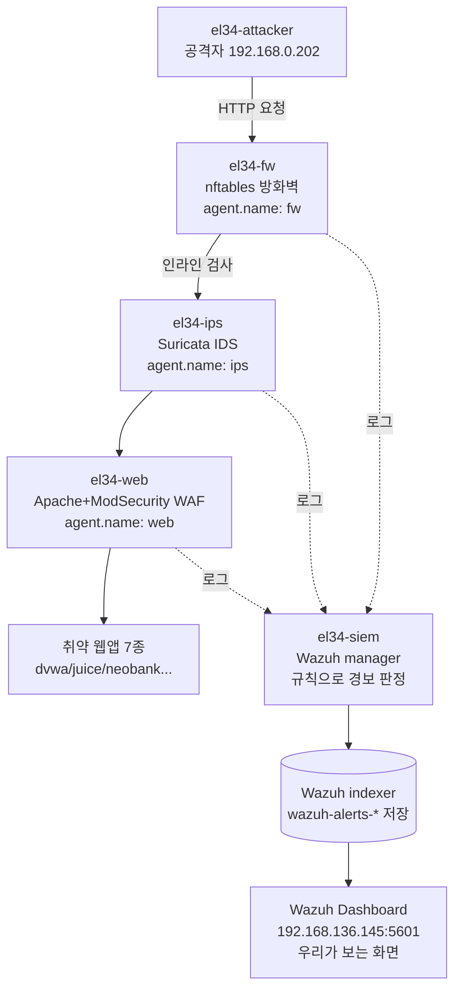

# 특강 W01 — Wazuh Dashboard와 KQL 기초: el34 4대 보안시스템 로그 한눈에 보기

> **한 줄 요약** — el34의 방화벽·IDS·WAF·엔드포인트에서 쏟아지는 모든 보안 경보(alert)는 결국 한 곳, **Wazuh**로 모인다. 이 한 곳을 **검색어 문법(KQL)** 으로 자유자재로 뒤지는 법을 익히면, 분석가는 "지금 우리 인프라에 무슨 일이 일어나는가"를 1분 안에 답할 수 있다.

---

## 학습 목표

이 주차를 마치면 다음을 할 수 있다.

- **Wazuh Dashboard**(웹 화면)에 접속해 **Discover** 에서 실시간 경보를 읽는다.
- **KQL(Kibana Query Language)** 12가지 문법을 막힘 없이 입력해 원하는 경보만 골라낸다.
- el34의 **4대 보안시스템**(방화벽 `fw` · IDS `ips` · WAF `web` · 엔드포인트 에이전트)이 만든 경보를 **에이전트별로 구분**하고, 각 경보의 핵심 필드를 읽는다.
- 경보를 **막대 차트(Visualize)** 로 집계하고, 여러 차트를 모아 **대시보드** 한 장으로 인프라 전체를 조망한다.

---

## 0. 용어 해설

| 용어 | 뜻 | 비유 |
|------|----|------|
| **SIEM** | Security Information & Event Management. 흩어진 보안 로그를 한 곳에 모아 검색·경보·시각화하는 시스템 | 건물 곳곳 CCTV 영상을 한 화면에 모아 보는 **중앙 관제실** |
| **Wazuh** | el34가 쓰는 오픈소스 SIEM 제품(v4.10). manager·indexer·dashboard 3부분으로 구성 | 관제실의 **브랜드/모델명** |
| **Wazuh manager** | 각 에이전트가 보낸 로그를 규칙(rule)에 비춰 "이건 경보다"라고 판정하는 두뇌 | 영상 보고 "수상하다"를 판단하는 **관제 요원** |
| **Wazuh indexer** | 판정된 경보를 검색 가능하게 저장하는 데이터베이스(OpenSearch 기반) | 영상이 날짜별로 정리된 **녹화 서버** |
| **Wazuh Dashboard** | 그 경보를 사람이 보는 웹 화면(OpenSearch Dashboards 기반) | 관제 요원이 들여다보는 **모니터 월** |
| **agent(에이전트)** | 각 컨테이너 안에서 로그를 수집해 manager로 보내는 작은 프로그램 | 각 층에 설치된 **CCTV 카메라** |
| **alert(경보)** | manager가 규칙에 걸렸다고 판정한 사건 1건. JSON 한 덩어리 | "3층 비상구 열림" 같은 **알림 한 건** |
| **rule.id** | 그 경보를 만든 규칙의 번호. 같은 종류 사건은 같은 번호 | 알림의 **유형 코드** |
| **Discover** | Dashboard에서 경보를 시간순으로 한 줄씩 펼쳐 보는 화면 | 녹화 목록을 **최신순으로 넘겨 보기** |
| **KQL** | Discover 검색창에 쓰는 질의 문법. `필드:값` 형태가 기본 | 녹화 검색창에 넣는 **검색어 규칙** |
| **index pattern** | 검색 대상 데이터 묶음의 이름. 경보는 `wazuh-alerts-*` | "**보안경보** 폴더"를 지정하는 것 |

---

## 0.5 신입생을 위한 핵심 개념

### "로그는 강물처럼 흐르고, SIEM은 그 강에 친 그물이다"

el34 인프라의 모든 컨테이너는 끊임없이 **로그**를 쏟아낸다. 방화벽은 "누가 어느 포트로 들어왔다", WAF는 "이 요청에 `<script>` 가 들어있다", IDS는 "sqlmap 스캐너 흔적이 보인다"를 각자 자기 파일에 적는다. 문제는 — 이 로그들이 **각자 다른 컨테이너의, 다른 형식의, 다른 파일에** 흩어져 있다는 것이다. 사고가 났을 때 컨테이너 7~8개에 일일이 `docker exec` 로 들어가 `grep` 하는 것은 현실적으로 불가능하다.

그래서 **에이전트**라는 작은 수집기를 각 컨테이너에 심어, 로그를 전부 한 곳(**Wazuh manager**)으로 흘려보낸다. manager는 흘러온 로그를 **규칙(rule)** 이라는 그물에 통과시켜, "이건 그냥 평범한 접속"과 "이건 공격 신호"를 갈라낸다. 걸러진 것이 **경보(alert)** 다. 경보는 **indexer**(녹화 서버)에 차곡차곡 쌓이고, 우리는 **Dashboard**(모니터)로 그것을 본다.

> 📌 **임의로 지은 비유 정리** — 이 교재에서 반복해 쓸 그림:
> **CCTV(agent) → 관제 요원(manager, 규칙으로 판정) → 녹화 서버(indexer, 저장) → 모니터 월(Dashboard, 열람)**.
> 네 단계를 머릿속에 그려두면 "왜 fw 컨테이너 로그가 siem 화면에 뜨지?" 같은 의문이 사라진다.

### el34의 "4대 보안시스템" — 누가 무슨 경보를 만드나

el34에서 경보를 만드는 주체는 크게 넷이다. Dashboard에서는 `agent.name` 필드로 구분된다.

| `agent.name` | 시스템 | 무엇을 보나 | 대표 경보 |
|--------------|--------|-------------|-----------|
| `fw` | **방화벽**(nftables) | 어떤 출발지 IP가 어느 포트로 들어왔나 | 포트 접속/차단, 비정상 연결 |
| `ips` | **IDS**(Suricata, 인라인) | 패킷 내용에 알려진 공격 시그니처가 있나 | 스캐너(sqlmap) UA, 익스플로잇 패턴 |
| `web` | **WAF**(Apache + ModSecurity + OWASP CRS) | HTTP 요청에 XSS·SQLi 같은 웹 공격이 있나 | `941xxx`(XSS), `942xxx`(SQLi) |
| (각 컨테이너) | **엔드포인트 에이전트**(Wazuh) | 파일 변조(FIM)·설정 점검(SCA)·로그인 | `550/554`(파일 변경), `5710`(SSH 무차별) |

> ⚠️ **새 용어 미리 풀기** — 위 표에 처음 나온 단어들:
> - **nftables**: 리눅스 커널의 방화벽 엔진. el34는 이걸로 외부 포트를 내부 컨테이너로 분기(DNAT)하며, **출발지 IP를 보존**한다(공격자 IP가 그대로 찍힘).
> - **Suricata**: 패킷을 실시간으로 들여다보며 시그니처에 맞으면 경보를 내는 IDS/IPS. "인라인"은 트래픽이 이 검사를 **거쳐서** 지나간다는 뜻.
> - **ModSecurity / OWASP CRS**: 웹 서버 앞단의 방어막(WAF)과 그 룰셋. CRS의 룰 번호 앞자리로 공격 종류를 안다(941=XSS, 942=SQLi).
> - **FIM(File Integrity Monitoring)**: 중요한 파일이 누가 바꿨는지 감시. **SCA**: 보안 설정이 기준에 맞는지 점검.
> 이 단어들은 W02 이후에도 계속 나오니, 지금 "방화벽·IDS·WAF·엔드포인트" 4칸으로만 기억해 두면 충분하다.

---

## 1. el34 SIEM 구조 — 경보는 어디서 와서 어디로 가나

el34의 트래픽과 로그 흐름을 한 그림으로 보면 이렇다.



핵심 세 가지:

1. **트래픽은 한 줄로 흐른다** — 공격자 → 방화벽 → IDS → WAF → 웹앱. 어느 단계에서 걸리든 그 단계의 에이전트가 경보를 만든다. 그래서 한 번의 SQLi 공격이 `fw`(접속)·`ips`(스캐너 패턴)·`web`(SQLi 룰) 에이전트 **셋에 동시에** 흔적을 남길 수 있다.
2. **로그는 전부 manager로 모인다**(점선) — 어느 컨테이너에서 났든 경보는 결국 `el34-siem`의 manager가 판정하고 indexer에 저장한다.
3. **우리는 Dashboard만 본다** — `https://192.168.136.145:5601`. 이 한 화면에서 4대 시스템의 경보를 전부 검색한다.

> 💡 **출발지 IP가 보존된다는 것의 의미** — el34는 방화벽에서 NAT 변조(masquerade)를 하지 않는다. 즉 경보의 `data.srcip`(또는 `data.src_ip`)에 **진짜 공격자 IP**(예: `192.168.0.202`)가 찍힌다. "누가 했나"를 추적할 수 있다는 뜻이고, 이번 실습 내내 이 필드를 근거로 삼는다.

---

## 2. Dashboard 접속과 Discover 화면

### 접속

el34의 Wazuh Dashboard는 **내부 관리망(ens38)** 에만 열려 있다. 외부에 노출하지 않는 것이 운영 원칙이므로, **el34 호스트의 브라우저(Firefox)** 에서 접속한다.

| 항목 | 값 |
|------|-----|
| URL | `https://192.168.136.145:5601/` (자체 서명 인증서 → 경고 무시하고 진행) |
| 계정 | `admin` |
| 비밀번호 | `SecretPassword` |

> 🔐 이 계정은 indexer의 관리자 계정이다. 실습용 고정 비밀번호이며, 실제 운영에서는 반드시 변경한다.

### Discover로 들어가기

1. 로그인 후 좌상단 **☰** → **Explore → Discover**
2. 좌상단 **인덱스 패턴 드롭다운**에서 `wazuh-alerts-*` 선택
3. 우상단 **시계 아이콘** → **Last 1 hour** (또는 Last 24 hours)
4. **Refresh**

화면 구성:

- **왼쪽(Available fields)**: 경보에 들어있는 50여 개 필드 목록. `rule.id`, `rule.level`, `agent.name`, `data.srcip` 등.
- **가운데**: 경보가 최신순으로 한 줄씩. 펼치면 JSON 전체가 보인다.
- **위쪽**: 시간대별 경보 개수 막대그래프.
- **맨 위 검색창**: 여기에 **KQL**을 입력한다. ← 이번 주의 핵심.

> 📌 경보가 한 건도 안 보이면? (1) 시간 범위가 너무 짧거나(→ Last 24 hours), (2) 최근 트래픽이 없어서다. 3장 실습에서 우리가 직접 공격을 일으켜 경보를 만든다.

---

## 3. KQL 12가지 문법 — 검색의 전부

KQL은 `필드:값` 이 기본이다. 여기에 비교·와일드카드·논리·범위·시간을 얹으면 어떤 경보든 골라낼 수 있다. 아래 12개가 실무의 95%를 덮는다.

| # | 문법 | 예시 | 뜻 |
|---|------|------|----|
| 1 | 정확 일치 | `agent.name:web` | web 에이전트의 경보만 |
| 2 | 비교(이상/초과) | `rule.level:>=10` | 위험도 10 이상 |
| 3 | 와일드카드 | `rule.description:*sql*` | 설명에 sql 포함 |
| 4 | OR(다중 매치) | `agent.name:(fw OR ips OR web)` | 셋 중 아무거나 |
| 5 | AND(교집합) | `agent.name:web AND rule.level:>5` | web이면서 위험도 5 초과 |
| 6 | NOT(부정) | `NOT agent.name:fw` | fw가 아닌 것 |
| 7 | 복합 | `rule.level:>5 AND NOT agent.name:fw` | 위험하지만 방화벽 건 아닌 |
| 8 | 범위 | `data.id:[941000 TO 941999]` | ModSec XSS 룰 대역 |
| 9 | 존재 여부 | `data.srcip:*` | srcip 필드가 있는 경보 |
| 10 | 시간 상대 | `@timestamp:>now-15m` | 최근 15분 |
| 11 | 정확 문구 | `rule.description:"sshd: brute force"` | 따옴표로 통문장 매치 |
| 12 | 중첩 필드 | `data.alert.signature_id:*` | Suricata 시그니처 ID 존재 |

### 워크드 예제 — "방금 들어온 위험 경보 Top"

> 상황: 분석가가 출근해 "지난 1시간, 방화벽 잡소음 빼고 진짜 위험한 것만" 보고 싶다.

검색창에 입력:

```kql
rule.level:>=7 AND NOT agent.name:fw AND @timestamp:>now-1h
```

- `rule.level:>=7` — 위험도 7 이상(주의~심각).
- `NOT agent.name:fw` — 방화벽의 단순 접속 로그는 양이 많아 제외.
- `@timestamp:>now-1h` — 최근 1시간.

결과 행을 하나 펼쳐 `rule.description`(무슨 일인지), `data.srcip`(누가), `agent.name`(어느 시스템이 잡았나) 세 필드만 봐도 사건의 윤곽이 잡힌다. **이 3필드 읽기가 분석의 기본기**다.

> ⚠️ **한계** — KQL은 "필터"이지 "계산"이 아니다. "에이전트별 경보 개수"처럼 **집계**가 필요하면 5장의 Visualize로 넘어가야 한다. 또 와일드카드 `*` 를 단어 앞(`*sql`)에 붙이면 매우 느리므로 가급적 뒤(`sql*`)에 붙인다.

---

## 4. el34 4대 보안시스템 로그 읽기

이제 각 시스템이 만든 경보를 KQL로 골라내고, 그 핵심 필드를 읽어 본다. (실제 경보 생성과 검증은 이번 주 **실습**에서 직접 한다. 여기서는 "무엇을 어떻게 읽나"를 익힌다.)

### 4-1. 방화벽 `fw` — 누가 어느 포트로

```kql
agent.name:fw AND @timestamp:>now-15m
```

읽을 필드: `data.srcip`(출발지), `data.dstport`(목적지 포트), `rule.description`. el34는 출발지 IP를 보존하므로 `data.srcip`가 곧 공격자다.

### 4-2. IDS `ips`(Suricata) — 알려진 공격 시그니처

```kql
agent.name:ips AND data.alert.signature_id:*
```

읽을 필드:
- `data.alert.signature` — 룰 설명(사람이 읽는 문장).
- `data.alert.signature_id` — 룰 번호. el34는 사용자 정의 룰 `1000003`(sqlmap User-Agent 탐지)을 포함한다.
- `data.alert.severity` — 1(심각)~3(정보).
- `data.alert.category` — 공격 분류.

### 4-3. WAF `web`(ModSecurity) — 웹 공격

XSS만 보려면 OWASP CRS의 941 대역을 범위로 건다.

```kql
agent.name:web AND data.id:[941000 TO 941999]
```

SQLi는 942 대역이다.

```kql
agent.name:web AND data.id:[942000 TO 942999]
```

읽을 필드: `data.id`(룰 번호 → 공격 종류), `data.uri`(공격받은 URL), `data.client_ip`(공격자), `data.msg`(룰 메시지).

> 📎 **CRS 번호 앞자리 = 공격 종류** (자주 보는 것만):
> `913`=스캐너, `920`=프로토콜 위반, `932`=원격 명령 실행(RCE), `941`=XSS, `942`=SQLi, `949`=종합 점수(차단 결정). 번호만 봐도 "무슨 공격인지" 즉답할 수 있다.

### 4-4. 엔드포인트 에이전트(Wazuh) — 파일·로그인·설정

에이전트 자체가 만드는 호스트 경보다.

```kql
rule.groups:(syscheck OR sca OR authentication_failed)
```

- `syscheck` — 파일 무결성(FIM). 변조 시 `550`(수정)·`554`(생성).
- `sca` — 보안 설정 점검.
- `authentication_failed` / `5710` — SSH 무차별 대입 등 로그인 실패.

---

## 5. 집계와 시각화 — 막대 차트와 대시보드

KQL로 "고르기"를 익혔으니, 이제 "세기"다.

### Visualize: rule.id Top 10 막대 차트

1. **☰ → Visualize Library → Create new visualization → Vertical Bar**
2. 인덱스: `wazuh-alerts-*`
3. **Y축**: Count(자동)
4. **X축(Buckets)**: Add → X-axis → Aggregation **Terms** → Field `rule.id` → Order by Count 내림차순 → Size 10
5. **Save** → "Top 10 Rules - {본인 이름}"

이러면 "가장 자주 터진 규칙 10개"가 막대로 보인다. 운영에서 잡소음 규칙을 찾거나, 공격 캠페인의 주력 패턴을 파악할 때 가장 먼저 만드는 차트다.

### Dashboard: 인프라 한 장 요약

1. **☰ → Dashboards → Create new dashboard**
2. **Add panel** → 방금 만든 "Top 10 Rules" 추가
3. **Add filter** → `agent.name:(fw OR ips OR web)`
4. 시간 → Last 1 hour → **Save** → "el34 Security Overview - {본인 이름}"

여러 차트를 한 화면에 모으면, 새로고침 한 번으로 인프라 상태를 조망하는 **상황판**이 된다.

---

## 실습 안내

이번 주 실습(`lab_week01.yaml`, 8단계)은 위 내용을 **el34에서 직접** 검증한다. Dashboard로 KQL을 익히되, 각 단계는 **공격을 일으키고 → 그 경보를 찾아내** 통과를 확인한다. 4개 축으로 묻는다.

1. **왜(목적)** — 왜 SIEM 한 곳으로 로그를 모으나, 왜 에이전트별로 나눠 보나.
2. **무엇을(수집/생성)** — `el34-attacker`로 SQLi·XSS·스캐너 트래픽을 일으켜 4대 시스템 경보를 만든다.
3. **해석(분석)** — `alerts.json`/Dashboard에서 `rule.id`·`agent.name`·`data.srcip`·`data.id`를 읽어 사건을 재구성한다.
4. **실전(종합)** — 한 번의 공격이 fw·ips·web에 남긴 흔적을 상관(correlate)해 보고서로 정리한다.

> 🧪 실습은 모두 `el34-attacker`(공격 발생)와 `el34-siem`/`el34-web`(경보 확인) 컨테이너에서 이뤄지므로, Dashboard에 접속할 수 없는 환경에서도 동일한 데이터를 CLI로 확인할 수 있게 설계돼 있다. **Dashboard로 본 것과 CLI로 본 것이 같은 데이터**임을 체감하는 것이 목표다.

---

## 흔한 오해

- ❌ **"경보가 안 보이면 시스템이 멈춘 것"** → 아니다. 최근 트래픽이 없으면 경보도 없다. 시간 범위를 넓히거나(Last 24h), 직접 트래픽을 일으켜라.
- ❌ **"fw 로그는 fw 컨테이너에서 봐야 한다"** → 아니다. 모든 경보는 manager로 모여 `el34-siem`의 `alerts.json`과 Dashboard에서 통합 조회된다. 컨테이너별로 들어갈 필요가 없는 것이 SIEM의 존재 이유다.
- ❌ **"`agent.name:Web` 처럼 대소문자 아무렇게"** → KQL 값은 보통 대소문자를 구분한다. el34 에이전트 이름은 소문자 `fw`/`ips`/`web` 이다.
- ❌ **"와일드카드는 어디 붙여도 같다"** → `*sql`(앞 와일드카드)은 인덱스를 못 써서 느리다. 가능하면 `sql*` 로 뒤에 붙인다.
- ❌ **"rule.level과 data.alert.severity는 같은 숫자 체계"** → 다르다. Wazuh `rule.level`은 0~15(클수록 위험), Suricata `severity`는 1~3(작을수록 위험). 헷갈리지 말 것.

---

## 예고 — W02

W01이 "Dashboard로 4대 시스템 경보를 **읽는** 법"이었다면, W02는 **하나의 공격 시나리오를 끝까지 추적**한다. 한 공격자가 정찰 → 스캔 → 침투를 이어갈 때 fw·ips·web에 시간순으로 남는 흔적을 KQL로 **상관 분석(correlation)** 하고, 그 결과를 사고 대응 보고서 한 장으로 묶는 법을 배운다. 이번 주에 익힌 `data.srcip`/`rule.id`/`agent.name` 읽기가 그대로 무기가 된다.
