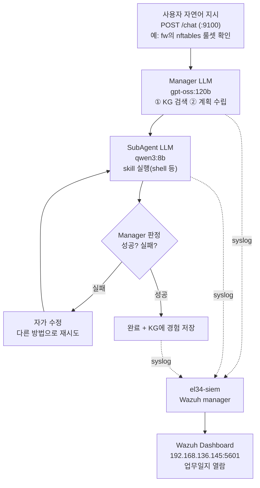

# 특강 W02 — 자율 보안 에이전트(bastion) 로그 분석: 미션 한 건의 일생을 추적하기

> **한 줄 요약** — el34에는 사람의 자연어 지시를 받아 스스로 계획·실행·판정하는 **자율 보안 에이전트 `bastion`** 이 있다. bastion이 미션 하나를 처리할 때마다 수~수십 개의 의사결정이 Wazuh로 흘러든다. 이 주차는 그 흐름을 **request_id로 한 줄에 꿰어**, "이 미션이 무엇을·왜·얼마나 걸려·안전하게 했는가"를 읽어 내는 법을 배운다.

---

## 학습 목표

이 주차를 마치면 다음을 할 수 있다.

- **자율 에이전트(bastion)** 가 미션 1건을 처리하는 **생애주기(lifecycle) 8단계**를 설명한다.
- 모든 단계에 공통으로 박히는 **request_id** 로 한 미션의 전 단계를 시간순으로 **상관(correlation)** 한다.
- 미션의 **KG 결정**(new/reuse/adapt), **자가 수정**(self-correct), **느린 미션**, **위험 미션**을 KQL/CLI로 식별한다.
- 운영자 관점에서 "왜 이 미션이 느렸나 · 위험한 변경을 시도했나"를 **Wazuh 한 화면**으로 진단한다.

---

## 0. 용어 해설

| 용어 | 뜻 | 비유 |
|------|----|------|
| **자율 에이전트(agent)** | 사람이 목표만 주면 스스로 단계를 계획·실행·점검하는 LLM 기반 프로그램 | 지시 한 줄 받고 알아서 일 처리하는 **신입 비서** |
| **bastion** | el34의 자율 보안 운영 에이전트(`el34-bastion`, API :9100) | 그 비서의 **이름** |
| **Manager(LLM)** | 미션을 해석해 **계획을 세우고 결과를 판정**하는 두뇌. el34에선 `gpt-oss:120b` | 일을 설계하는 **팀장** |
| **SubAgent(LLM)** | Manager의 지시(skill)를 받아 **실제 명령을 실행**하는 손발. el34에선 `qwen3:8b` | 시키는 일을 하는 **실무자** |
| **skill** | SubAgent가 쓰는 도구 한 종류(예: `shell`, `docker_manage`) | 실무자의 **연장** |
| **mission(미션)** | 사용자가 자연어로 던진 작업 1건. `/chat` API로 들어옴 | 비서에게 맡긴 **업무 1건** |
| **lifecycle(생애주기)** | 미션 1건이 거치는 단계들(수신→계획→실행→완료) | 업무의 **착수~보고 과정** |
| **request_id** | 미션 1건에 부여되는 고유 ID. 모든 단계 로그에 동일하게 박힘 | 업무에 붙는 **사건 번호** |
| **KG(경험 그래프)** | 과거 미션 경험을 저장해 비슷한 일을 다시 만나면 재활용하는 지식 저장소 | 비서의 **업무 노트(과거 사례집)** |
| **self-correct(자가 수정)** | 한 시도가 실패하면 스스로 방법을 바꿔 다시 시도하는 것 | "이 방법 안 되네, 다르게" 하는 **재시도** |
| **decoder/audit** | bastion이 보낸 syslog를 Wazuh가 해석하는 규칙(`bastion-lifecycle`)과 미션 요약(`bastion-audit`) | 비서 보고서를 정리하는 **양식** |

---

## 0.5 신입생을 위한 핵심 개념

### "자율 에이전트는 알아서 일하는 신입 비서, 우리는 그 업무일지를 읽는다"

지금까지(W01) 우리가 본 경보는 방화벽·WAF 같은 **고정된 규칙**이 만든 것이었다. 이번엔 다르다. **bastion**은 사람이 `"fw의 nftables 룰셋을 확인해줘"` 같은 **자연어 한 줄**을 던지면, 스스로:

1. 무슨 일인지 **해석**하고(Manager LLM),
2. 과거에 비슷한 일을 했는지 **노트(KG)** 를 뒤지고,
3. 실행 **계획**을 세워,
4. **SubAgent** 에게 명령을 시키고,
5. 결과가 맞는지 **판정**하고(틀리면 다시),
6. 끝나면 **완료 보고**를 한다.

문제는 — 이 모든 과정이 LLM의 "머릿속"에서 일어나 **눈에 보이지 않는다**는 것이다. "왜 이 미션이 4분이나 걸렸지?", "혹시 운영 인프라를 함부로 바꾼 건 아닐까?" 같은 질문에 답하려면, 에이전트가 **자기 행동을 낱낱이 로그로 남겨야** 한다. bastion은 매 단계를 syslog로 Wazuh에 보낸다. 우리는 그 **업무일지**를 읽는 것이다.

> 📌 **임의로 지은 비유 정리** — 이 교재가 쓰는 그림:
> **팀장(Manager LLM, 계획·판정) ↔ 실무자(SubAgent LLM, 실행)** 가 한 팀이고,
> 업무 1건(mission)에는 **사건 번호(request_id)** 가 붙는다.
> 우리는 사건 번호로 그 업무의 **착수~보고 전 과정**을 한 줄에 꿴다(= correlation).

### 새로 등장하는 개념 세 가지 미리 풀기

- **계층적 에이전트(Manager–SubAgent)**: 하나의 LLM이 다 하지 않는다. **큰 모델(gpt-oss:120b)** 이 머리(계획·판정)를 맡고, **작은 모델(qwen3:8b)** 이 손발(명령 실행)을 맡는다. 큰 모델은 똑똑하지만 느리다 — 그래서 미션이 수백 초 걸리기도 한다(뒤에서 실측으로 본다).
- **KG(Knowledge Graph, 경험 그래프)**: 사람이 일을 반복하면 요령이 생기듯, bastion은 끝낸 미션을 노트에 저장한다. 다음에 비슷한 미션이 오면 **new(처음)** 가 아니라 **reuse(재활용)** 또는 **adapt(조금 고쳐 씀)** 로 처리해 더 빠르고 안정적이 된다. 이 결정이 로그의 `data.decision` 에 남는다.
- **위험 미션 통제**: 자율 에이전트는 편리하지만, 잘못하면 **운영 인프라를 실제로 바꿀** 수 있다(방화벽 룰 추가 등). 그래서 위험 키워드(`MASQUERADE`, `drop counter`, `reverse shell` …)가 들어간 미션은 **별도 고위험 경보(rule 100204, 위험도 10)** 로 즉시 떠야 한다. 이것이 "사람이 자율 에이전트를 감시하는" 장치다.

---

## 1. bastion이란 무엇이고, 왜 로그를 분석하나

### 1-1. 미션 처리 흐름



핵심: 매 단계가 **syslog 한 줄**로 manager에 전달된다. bastion은 별도 Wazuh 에이전트가 아니라 **manager에 직접 syslog를 쏘므로**, 경보의 `agent.name` 은 `wazuh.manager`(id 000)로 찍힌다(W01의 fw/ips/web 와 다른 점).

### 1-2. 왜 분석하는가 — 운영자의 4가지 질문

| 질문 | 무엇으로 답하나 |
|------|-----------------|
| 이 미션은 **무슨 단계**를 거쳤나? | request_id로 상관한 lifecycle timeline |
| 왜 이렇게 **느렸나**? | `rule.id:100201`(SLOW) + 단계 간 시간 간격 |
| 과거 경험을 **재활용**했나? | `rule.id:100213` 의 `data.decision`(new/reuse/adapt) |
| **위험한 변경**을 시도했나? | `rule.id:100204`(위험도 10) |

---

## 2. 미션의 생애주기 8단계와 Wazuh rule.id

### 2-1. 1 미션 = 1 request_id

`/chat` 호출 시 백엔드가 UUID(예: `aae085d42d3d4c9d8f39289e280ed5c1`)를 만들어, 그 미션의 **모든 단계 로그에 `data.request_id` 로 동일하게** 박는다. Wazuh에서 이 ID로 묶으면 미션의 전 단계가 한 화면에 시간순으로 모인다.

### 2-2. 단계별 rule.id (el34 실제 값)

| 단계 | stage(`data.stage`) | rule.id | level | 의미 |
|------|----------------------|---------|-------|------|
| ① 수신 | `bastion.request.received` | **100211** | 3 | 사용자가 미션을 던짐 |
| ② 계획/단계전환 | `bastion.event.stage` | 100212 | 3 | planning 등 단계 전환 |
| ③ KG 결정 | `bastion.event.lookup_decision` | **100213** | 3 | new/reuse/adapt + confidence |
| ④ skill 지시 | `bastion.event.skill_start` | **100214** | 3 | skill 이름 + attempt |
| ⑤ skill 결과 | `bastion.event.skill_result` | **100215** | 3 | success + 출력 |
| ⑥ 자기 판정 | `bastion.event.self_verify` | 100216 | 4 | score + 근거 |
| ⑦ 재시도(자가 수정) | `bastion.event.step_retry` | **100217** | 5 | attempt+1 |
| ⑧ 완료 | `bastion.request.completed` | **100218** | 3 | 총 단계 수 |

미션이 끝나면 **요약 1건**이 추가로 뜬다(decoder `bastion-audit`):

| 요약 경보 | rule.id | level | 트리거 |
|-----------|---------|-------|--------|
| 미션 요약 | 100200 | 3 | 모든 완료 미션 |
| **느린 미션** | **100201** | 5 | `duration_ms` ≥ 60초 |
| 실패 미션 | 100202 | 7 | outcome=fail |
| 자가 수정 미션 | 100203 | 4 | user_prompt에 "자기 수정" |
| **위험 변경 미션** | **100204** | **10** | user_prompt에 `MASQUERADE`/`drop counter`/`reverse shell` 등 |

### 2-3. 실측 timeline — "fw의 nftables 확인" 미션 (el34에서 직접 측정)

아래는 el34에서 실제로 돌린 미션(request_id `aae085d4…`)의 Wazuh 경보를 시간순으로 정렬한 것이다.

```
14:54:07.838  100211  bastion.request.received     "fw의 nftables 룰셋을 확인해줘"  model=gpt-oss:120b
                ⋮  (Manager LLM이 계획 수립 — 약 227초)
14:57:55.613  100213  bastion.event.lookup_decision   decision=new   ← KG에 없던 새 미션
14:57:55.616  100214  bastion.event.skill_start       skill=shell
14:57:55.616  100215  bastion.event.skill_result      skill=shell  success=true
14:57:55.646  100214  bastion.event.skill_start       skill=shell
14:57:55.646  100215  bastion.event.skill_result      skill=shell  success=true
14:57:55.647  100214  bastion.event.skill_start       skill=shell
14:57:55.647  100215  bastion.event.skill_result      skill=shell  success=true
14:57:55.649  100218  bastion.request.completed
   + 요약: 100201 (SLOW) duration_ms=227760  ← 60초 넘어 "느린 미션"으로 분류
```

> 💡 **이 timeline이 말해 주는 것** — 수신(14:54:07)과 실행(14:57:55) 사이 **3분 47초의 공백**이 전부 **Manager LLM(gpt-oss:120b)의 계획 시간**이다. 실제 명령 실행(skill 3건)은 0.04초 만에 끝났다. 즉 이 미션이 느린 원인은 "명령이 무거워서"가 아니라 "**큰 모델의 계획이 오래 걸려서**"다. 이런 진단이 로그 분석의 목적이다. (참고: 미션이 ~227초 걸리므로, 실습에서 미션을 띄울 때는 **완료를 기다리지 않고** 백그라운드로 보낸 뒤 쌓인 로그를 본다.)

---

## 3. 핵심 KQL 8가지

W01의 KQL 문법을 bastion 로그에 적용한다. (Dashboard 검색창 / Discover 기준. 실습에선 같은 질의를 CLI로도 한다.)

```kql
# 1) 최근 모든 bastion 단계 로그
decoder.name:bastion-lifecycle AND @timestamp:>now-30m

# 2) 특정 미션의 전체 timeline (← 가장 자주 씀)
data.request_id:"aae085d42d3d4c9d8f39289e280ed5c1"

# 3) 완료된 미션만 (요약)
rule.id:100218

# 4) KG 결정 분포 (new/reuse/adapt)
rule.id:100213

# 5) 자가 수정이 일어난 미션
rule.id:100217

# 6) 느린 미션 (60초 이상)
rule.id:100201

# 7) 위험 변경 미션 (위험도 10)
rule.id:100204

# 8) 특정 과목의 미션만
rule.groups:bastion_audit AND data.course:wazuh-special
```

질의 2번이 핵심이다. 어떤 미션이 이상하면 그 미션의 request_id를 잡아 2번에 넣고, 좌측 fields에 `@timestamp`·`rule.id`·`data.stage`·`data.skill`·`data.success` 를 추가한 뒤 시간순 정렬하면 — 2-3절의 timeline 표가 그대로 화면에 그려진다.

---

## 4. 분석 시나리오 3가지

### 4-1. "왜 이 미션이 느렸나?"

1. `rule.id:100201` 로 느린 미션을 찾는다 → `data.duration_ms` 확인(예: 227760).
2. 그 행의 `data.request_id` 복사 → 질의 2번에 넣어 timeline 펼친다.
3. **단계 간 시간 간격**을 본다:
   - 100211 → 100213 사이가 길면 → **Manager LLM 계획 지연**(2-3절 사례가 이 경우).
   - 100214 → 100215 사이가 길면 → **SubAgent/대상 컨테이너 부하**.
   - 100217(retry)이 여러 번이면 → **자가 수정 반복**.

### 4-2. "KG가 정말 경험을 재활용하나?"

1. 같은 미션을 **두 번** 던진다.
2. `rule.id:100213` 로 두 미션의 `data.decision` 비교: 1차 `new` → 2차 `reuse`(또는 `adapt`)면 학습 효과.
3. 두 미션의 `duration_ms` 비교: 2차가 짧으면 재활용이 시간을 줄인 증거.

### 4-3. "에이전트가 위험한 변경을 시도했나?" (가장 중요)

1. `rule.id:100204` (위험도 10) 검색 — 결과가 있으면 **즉시 확인 대상**.
2. `data.user_prompt` 로 어떤 미션인지, `data.request_id` 로 그 미션의 skill 실행(100214/100215) 추적.
3. 실제 변경이 일어났는지 대상 컨테이너 점검 → 필요 시 수동 원복.

> ⚠️ **실습 주의** — 위험 경보(100204)를 "발생시켜 보기" 위해 prompt에 `MASQUERADE` 같은 키워드를 **설명 요청 형태**로만 넣는다(예: "MASQUERADE 룰의 의미를 설명해줘"). 절대 운영 인프라를 실제로 바꾸는 미션을 던지지 않는다. 경보는 prompt의 키워드로 트리거되므로 설명 요청만으로도 100204를 관찰할 수 있다.

---

## 5. Bastion Operations 대시보드

운영자가 매일 1분 보고 어제의 에이전트 활동을 파악하는 상황판. 추천 패널:

1. **완료 미션 수**(Metric) — `rule.id:100218` count
2. **평균 소요시간**(Metric) — `rule.id:100201`/`100200` 의 `data.duration_ms` 평균
3. **KG 결정 분포**(Pie) — `rule.id:100213` terms `data.decision`
4. **느린 미션 추세**(Line) — `rule.id:100201` 시간 히스토그램
5. **위험 미션**(Data Table) — `rule.id:100204` 열 `@timestamp`,`data.user_prompt`

만드는 법은 W01과 동일(Visualize에서 각 패널을 저장 → Dashboard에 모음 → Last 24 hours). 5번(위험 미션) 패널은 비어 있는 것이 정상이고, **한 줄이라도 뜨면 경보**다.

---

## 실습 안내

이번 주 실습(`lab_week02.yaml`)은 el34-bastion에 **실제 미션을 던져** lifecycle을 발생시키고, 그 경보를 CLI로 추적한다. 4개 축:

1. **왜(목적)** — 자율 에이전트의 행동을 왜 로그로 감시하나(투명성·진단·안전).
2. **무엇을(생성)** — `/chat` API(:9100, X-API-Key)로 미션을 **백그라운드로** 던져 lifecycle/audit 경보를 만든다.
3. **해석(분석)** — request_id로 한 미션의 단계를 시간순으로 묶고, KG 결정·skill 실행·완료를 식별한다.
4. **실전(통제)** — 위험 키워드 미션의 100204 경보를 확인하고, 느린 미션의 원인을 단계 간격으로 진단한다.

> 🧪 미션은 완료까지 수백 초가 걸리므로, 실습의 미션 구동은 **완료를 기다리지 않는다**(백그라운드 전송 후 즉시 로깅되는 `request.received` 부터 검증). 분석 단계는 **이미 쌓인 경보**를 대상으로 한다 — 실제 운영에서도 분석은 늘 "지나간 로그"를 본다.

---

## 흔한 오해

- ❌ **"bastion 경보는 `agent.name:bastion` 으로 찾는다"** → 아니다. bastion은 syslog로 manager에 직접 보내므로 `agent.name` 은 `wazuh.manager`. 찾을 땐 `decoder.name:bastion-lifecycle` 또는 `rule.groups:bastion_audit`.
- ❌ **"느린 미션 = 무거운 명령"** → 대개 아니다. el34 실측처럼 시간의 대부분은 **Manager LLM의 계획**이다. 단계 간 간격을 봐야 진짜 원인을 안다.
- ❌ **"decision=new 면 KG가 고장"** → 아니다. 처음 보는 미션은 당연히 new. 같은 미션을 반복해야 reuse가 나타난다.
- ❌ **"100204(위험)가 떴으니 사고다"** → 경보는 **prompt 키워드**로도 뜬다. 실제 변경 여부는 그 미션의 skill 실행(100214/100215)과 대상 컨테이너를 확인해야 안다. 100204는 "확인하라"는 신호이지 "사고 확정"이 아니다.
- ❌ **"미션을 던지면 바로 완료 경보(100218)가 뜬다"** → 수백 초 뒤다. 제출 직후 뜨는 건 `request.received`(100211) 뿐.

---

## 특강을 마치며 — 다음 학습

2주짜리 Wazuh 특강은 여기까지다. W01에서 **고정 규칙 보안시스템(방화벽·IDS·WAF)** 의 경보를 KQL로 읽었고, W02에서 **자율 에이전트** 의 행동 로그까지 같은 SIEM 한 곳에서 추적했다. 두 주의 공통 무기는 변하지 않는다 — `agent.name`/`decoder.name` 으로 출처를 가르고, `rule.id` 로 사건 유형을 알고, `request_id`/`srcip` 로 한 사건을 한 줄에 꿴다.

더 나아가려면:

- **secuops / soc 트랙** — el34 4-tier 보안 운영을 주차별로 깊게.
- **Wazuh custom rule 작성** — 자기 환경의 특수 패턴을 직접 탐지 규칙으로(이번 주 본 `bastion-audit-rules.xml` 이 그 예).
- **active-response** — 100204 같은 고위험 경보 발생 시 자동 알림/차단 연동.
