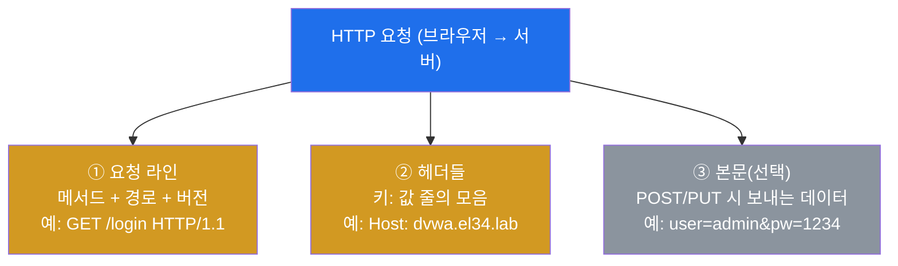
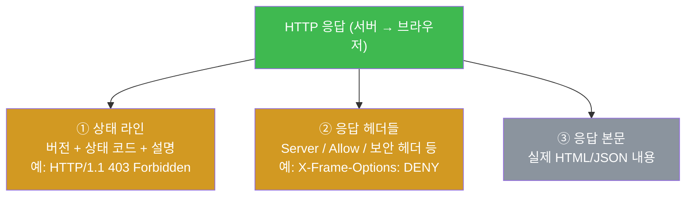
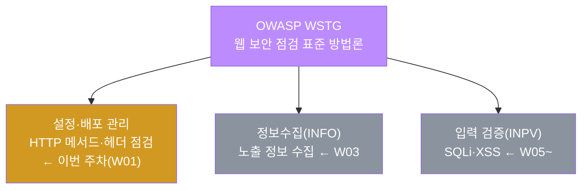
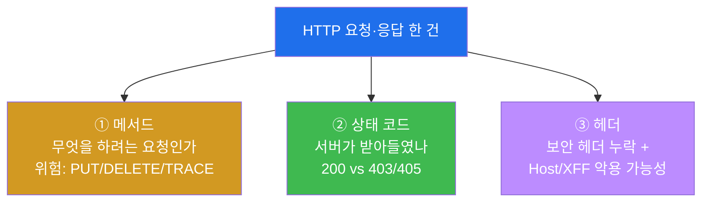
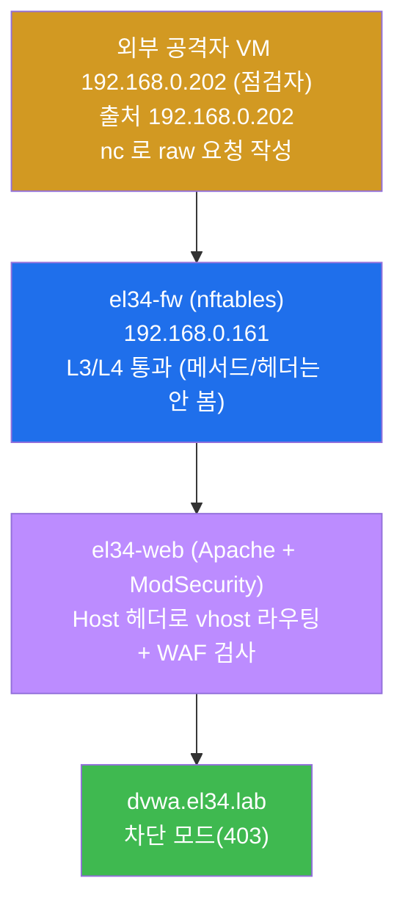
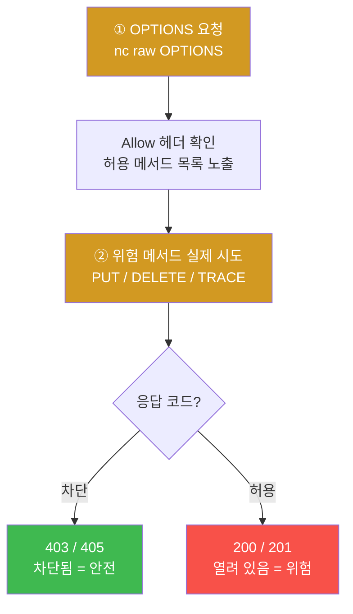
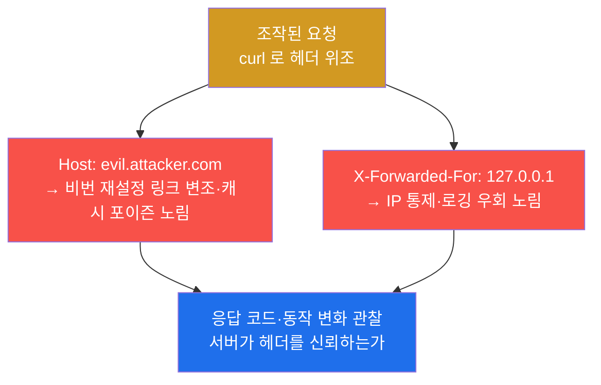
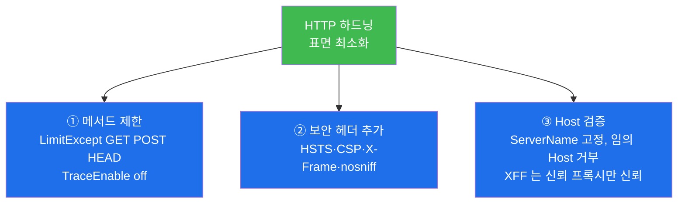
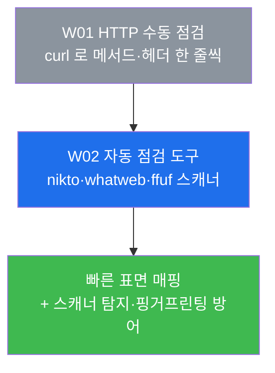

# 웹취약점 W01 — HTTP 프로토콜 기초와 점검 환경: 위험 메서드·보안 헤더·헤더 악용

> **본 주차의 한 줄 요약**
>
> 웹 취약점 점검(OWASP WSTG)의 출발점은 화려한 익스플로잇이 아니라 **HTTP 프로토콜 자체**다.
> 학생은 점검자(웹 모의해킹/진단 엔지니어)의 시선으로, 대상 웹 서버에 어떤 **메서드**가
> 열려 있는지(OPTIONS 열거), 위험한 메서드(PUT/DELETE/TRACE)가 차단되는지, 응답에 **보안
> 헤더**가 빠져 있는지, 그리고 `Host`·`X-Forwarded-For` 같은 헤더를 조작했을 때 서버가
> 어떻게 반응하는지를 **el34 인프라 위에서 본인 손으로** 점검한다. 마지막엔 같은 점검 행위가
> 대상의 access.log·WAF 에 어떤 흔적으로 남는지 확인하고, 발견을 한 장짜리 점검 보고서로
> 정리한다.
>
> **점검자 한 줄 결론**: 웹 취약점 진단은 "취약점을 찍어 맞히는 것"이 아니라, **HTTP 요청·응답
> 한 줄 한 줄을 읽어 무엇이 정상이고 무엇이 위험 신호인지 판별하는 능력**에서 시작한다. 이번
> 주는 그 판별의 기초 어휘(메서드·상태 코드·헤더)를 손에 익히는 주다.

---

## 학습 목표

본 주차 종료 시 학생은 다음 5가지를 **본인 손으로** 할 수 있어야 한다.

1. HTTP 요청·응답의 구조(요청 라인 / 헤더 / 본문, 상태 코드)를 그림으로 그리고, 점검에서
   "무엇을 봐야 하는지"를 메서드·상태 코드·헤더의 세 축으로 설명한다.
2. el34 의 점검 대상 웹 서버(`dvwa.el34.lab` vhost)에 `nc`(넷캣)로 도달하고, `OPTIONS` 메서드로
   허용 메서드(`Allow` 헤더)를 **열거**한다.
3. 위험 메서드(`PUT` / `DELETE` / `TRACE`)를 시도해 응답 코드를 읽고, 차단(405/403)인지
   허용(200/201)인지를 판별해 위험도를 매긴다.
4. 응답 헤더에서 **보안 헤더**(HSTS / CSP / X-Frame-Options / X-Content-Type-Options)의 누락을
   식별하고, `Host` 인젝션·`X-Forwarded-For` 위조 같은 **헤더 악용**의 결과를 관찰한다.
5. 위 점검 행위가 대상의 access.log 에 남기는 흔적을 확인하고, 메서드·헤더 점검 결과와 방어
   권고를 담은 1페이지 **HTTP 점검 보고서**를 작성한다.

---

## 0. 용어 해설 (웹 취약점 점검 입문)

본 주차에 처음 등장하거나 점검에서 특히 중요한 용어를 먼저 정리한다. 본문에서 다시 막히면
이 표로 돌아오면 흐름이 끊기지 않는다.

| 용어 | 영문 | 뜻 | 비유 |
|------|------|----|------|
| **HTTP** | HyperText Transfer Protocol | 웹 브라우저와 서버가 주고받는 요청·응답의 약속(규약) | 식당의 주문서 양식 |
| **HTTP 메서드** | HTTP method / verb | 요청이 "무엇을 하려는가"를 나타내는 동사(GET/POST/PUT/DELETE/…) | 주문서의 "주문/취소/변경" 칸 |
| **상태 코드** | status code | 서버가 요청 처리 결과를 숫자로 알려주는 응답 코드(200/403/405/…) | 주문 접수증의 "완료/거절" 도장 |
| **헤더** | header | 요청·응답에 붙는 부가 정보(키:값) 줄들 | 주문서 위쪽의 메모란 |
| **요청 본문** | request body | POST/PUT 등에서 실제로 보내는 데이터 | 주문서에 동봉한 첨부물 |
| **OPTIONS** | — | 서버가 허용하는 메서드를 물어보는 메서드 | "이 식당, 뭘 주문할 수 있나요?" 라고 묻기 |
| **PUT / DELETE** | — | 서버에 파일을 올리거나(PUT) 지우는(DELETE) 메서드 | 가게 진열대에 물건을 직접 놓거나 빼기 |
| **TRACE** | — | 보낸 요청을 그대로 되돌려 보여주는 진단용 메서드 | 메아리 — 외친 말을 그대로 돌려줌 |
| **XST** | Cross-Site Tracing | TRACE 를 악용해 쿠키 등 민감 헤더를 탈취하는 공격 | 메아리로 남의 비밀을 엿듣기 |
| **보안 헤더** | security headers | 브라우저에 안전 동작을 강제하는 응답 헤더(HSTS/CSP 등) | 제품에 붙은 안전 사용 경고문 |
| **Host 헤더** | Host header | 요청이 어느 사이트(도메인)를 향하는지 알리는 헤더 | 주문서에 적는 "어느 지점인지" |
| **X-Forwarded-For** | XFF | 프록시를 거친 요청의 원래 클라이언트 IP 를 담는 헤더 | "원래 손님은 누구였는지" 메모 |
| **WSTG** | Web Security Testing Guide | OWASP 의 웹 보안 점검 표준 방법론 | 웹 진단의 표준 점검 체크리스트 |
| **nc** | — | TCP 소켓에 raw HTTP 요청을 손수 흘려보내는 도구(브라우저의 수동 버전) | 손으로 주문서를 직접 쓰는 펜 |
| **vhost** | Virtual Host | 같은 IP/포트에서 도메인별로 다른 사이트를 응답하는 방식 | 한 건물의 여러 매장 |
| **WAF** | Web Application Firewall | HTTP 페이로드를 검사해 공격을 차단하는 응용 계층 방화벽 | 입구 금속탐지기 |

> **헷갈리기 쉬운 한 쌍 — 메서드 vs 상태 코드.** 둘 다 HTTP 의 핵심이지만 방향이 반대다.
> **메서드**는 *요청* 쪽이 "무엇을 해 달라"고 보내는 동사(GET/PUT/DELETE)이고, **상태 코드**는
> *응답* 쪽이 "그래서 어떻게 됐다"고 돌려주는 숫자(200=성공/403=거부/405=메서드 불허)다. 점검자는
> "어떤 메서드를 보냈을 때 어떤 상태 코드가 돌아오는가"의 짝을 읽어 위험을 판별한다. 예를 들어
> `PUT` 을 보냈는데 `201`(생성됨)이 오면 위험(파일 업로드 가능)이고, `405`(메서드 불허)가 오면
> 안전(서버가 PUT 을 막음)이다.

---

## 0.5 핵심 개념 — HTTP 요청·응답은 어떻게 생겼나

위 표는 한 줄 정의라 처음 보는 학생에겐 부족하다. 본 절에서는 본격 점검에 들어가기 전에, HTTP
요청과 응답이 실제로 어떤 모양인지 일상 비유와 함께 풀어 설명한다. 이 구조가 머릿속에 그려져야
이후의 모든 점검(메서드 열거·보안 헤더·헤더 악용)이 "어디를 보는 작업인지" 분명해진다.

### 0.5.1 HTTP 는 "주문서와 접수증"의 왕복이다

학생이 식당에서 음식을 주문하는 장면을 떠올려보자. 손님은 **주문서**(무엇을, 몇 개, 어느 지점에서)를
적어 건네고, 주방은 처리한 뒤 **접수증**(완료/거절, 영수증 내역)을 돌려준다. 웹에서 브라우저(손님)와
서버(주방)가 주고받는 것이 정확히 이 구조이며, 그 약속이 **HTTP** 다.

- **요청(request)** = 손님이 건네는 주문서. 브라우저가 서버에 "이것을 해 달라"고 보낸다.
- **응답(response)** = 주방이 돌려주는 접수증. 서버가 "처리 결과는 이렇다"고 돌려준다.

웹 취약점 점검은 결국 **이 주문서와 접수증을 한 줄씩 뜯어보는 일**이다. 정상 손님은 주문서를 대충
보고 음식만 받지만, 점검자는 "이 식당이 어떤 주문까지 받아주는가, 위험한 주문(가게 물건을 직접
빼가는 DELETE)도 받아주는가, 접수증에 안전 경고문이 빠지진 않았는가"를 따진다.

### 0.5.2 HTTP 요청의 구조 — 세 부분

HTTP 요청은 세 부분으로 나뉜다. `nc` 로 raw 요청을 보내면 실제로 이 순서대로 전송된다.



- **① 요청 라인** — "무엇을(메서드) 어디에(경로) 어떤 규약 버전으로(HTTP/1.1)" 보내는지의 첫 줄이다.
  점검자가 가장 먼저 조작하는 곳이 이 메서드 칸이다(GET 을 PUT/TRACE 로 바꿔 보낸다).
- **② 헤더들** — 부가 정보를 담는 `키: 값` 줄들이다. `Host`(어느 사이트), `User-Agent`(어떤
  클라이언트), `Cookie`(세션) 등이 여기 들어간다. 헤더 악용 점검은 이 줄들을 조작하는 작업이다.
- **③ 본문** — POST/PUT 처럼 데이터를 보낼 때만 붙는다. 로그인 폼 값이나 업로드 파일이 여기 담긴다.

### 0.5.3 HTTP 응답의 구조와 상태 코드

응답도 비슷한 구조이며, 첫 줄에 **상태 코드**가 있다. 점검자는 이 숫자로 요청이 받아들여졌는지를
판별한다.



점검에서 자주 만나는 상태 코드는 다음과 같다. 같은 요청이라도 코드가 무엇이냐에 따라 "위험"과
"안전"이 갈린다.

| 상태 코드 | 뜻 | 점검자의 해석 |
|-----------|----|--------------|
| **200 OK** | 성공 | 요청이 처리됨. 위험 메서드에 200 이면 그 메서드가 **열려 있다**(주의) |
| **201 Created** | 생성됨 | PUT 으로 파일이 실제로 만들어짐 → **업로드 가능**(위험) |
| **302 Found** | 리다이렉트 | 다른 위치로 안내. 로그인/세션 흐름에서 흔함 |
| **403 Forbidden** | 거부 | 서버/WAF 가 요청을 막음. 위험 메서드에 403 이면 **차단됨**(안전 신호) |
| **405 Method Not Allowed** | 메서드 불허 | 서버가 그 메서드 자체를 허용하지 않음 → **안전** |

핵심은 **상태 코드 단독이 아니라 "보낸 메서드 + 받은 코드"의 짝**으로 읽는다는 것이다. `200` 이
무조건 좋고 `403` 이 무조건 나쁜 게 아니다. 위험 메서드(PUT/DELETE/TRACE)에 대해서는 오히려
`403`/`405`(차단)가 점검자에게 반가운 결과다.

### 0.5.4 WSTG — 웹 점검의 표준 체크리스트

학생이 건물 안전 점검원이라면, 손에 든 표준 점검표가 있을 것이다. 웹 보안 점검에서 그 표준
체크리스트가 **WSTG**(Web Security Testing Guide)다.

**WSTG** 는 OWASP 가 만든 웹 애플리케이션 보안 점검의 표준 방법론으로, 점검 항목을 단계(정보수집,
설정 관리, 인증, 세션, 인가, 입력 검증, 암호화 등)로 체계화해 둔 문서다. 점검자가 "무엇을 빠뜨리지
않고 봐야 하는가"의 기준이 된다.

이번 주차가 다루는 **메서드·HTTP 헤더 점검**은 WSTG 의 **설정·배포 관리(Configuration and
Deployment Management Testing)** 영역에 속한다. 특히 "허용된 HTTP 메서드 점검(Test HTTP Methods)"이
이 단계의 대표 항목이다. 즉 이번 주는 WSTG 의 가장 앞 단계 중 하나인 **서버 설정 점검**을 손에
익히는 것이며, 이후 주차에서 정보수집(W03)·인증(W04)·입력 검증(SQLi/XSS, W05~) 으로 점검 단계가
이어진다.



### 0.5.5 nc — 손으로 쓰는 HTTP 주문서

브라우저는 주문서(요청)를 자동으로 만들어 보내준다. 그런데 점검자는 메서드를 PUT 으로 바꾸거나
헤더를 위조하는 등 **주문서를 마음대로 손으로 써야** 한다. 이때 쓰는 도구가 **nc**(netcat) 다.

**nc** 는 TCP 소켓에 바이트를 그대로 흘려보내는 도구다. HTTP 요청 라인·헤더를 `echo -en` 으로 손수
작성해 `nc` 로 보내면, 브라우저가 가려주는 요청·응답의 원본을 날것 그대로 다룰 수 있어 점검의 기본기다.
요청 골격은 `echo -en 'GET /경로 HTTP/1.0\r\nHost: dvwa.el34.lab\r\nConnection: close\r\n\r\n' | nc -w3 192.168.0.161 80`
이고, 이번 주에 반복해서 쓰는 조각은 다음과 같다.

| 요청 조각 | 의미 | 점검에서의 쓰임 |
|-----------|------|----------------|
| 요청 라인 `<메서드> /경로 HTTP/1.0` | 메서드·경로 지정 | `OPTIONS` / `PUT` / `TRACE` 로 위험 메서드 시도 |
| 헤더 `키: 값\r\n` | 헤더 추가 | `Host: dvwa.el34.lab` 로 vhost 지정, `X-Forwarded-For: 127.0.0.1` 로 위조 |
| `\r\n\r\n` (빈 줄) | 헤더 끝 | 여기까지가 요청 헤더, 이후가 본문 |
| `nc -w3 192.168.0.161 80` | 웹 진입점으로 전송 | `-w3` 은 3초 타임아웃 |
| `head -1` | 응답 첫 줄(상태 라인) | 상태 코드·`Allow` 헤더 확인 |
| `grep -oE '[0-9]{3}'` | 상태 코드 추출 | 응답 코드만 깔끔히 뽑아 보기 |

> 이번 주의 모든 점검 명령은 이 raw HTTP 요청의 조합이다. 요청 라인과 헤더의 의미만 알면 명령이
> 길어도 "메서드를 바꿔 보낸다 / 헤더를 위조해 보낸다 / 코드만 본다"의 단순한 행위임을 알 수 있다.

---

이 다섯 개념(요청·응답 구조, 상태 코드, WSTG, curl)이 W01 본격 내용의 기반이다. 이제 실제 점검
항목으로 들어간다.

---

## 1. 왜 HTTP 부터 점검하는가

### 1.1 한 줄 답: 웹의 모든 입력·출력이 HTTP 위에 있기 때문

웹 애플리케이션에 대한 모든 공격과 모든 점검은 결국 **HTTP 요청·응답**으로 이루어진다. SQL
Injection 도, XSS 도, 파일 업로드도 전부 "어떤 메서드로, 어떤 헤더와 본문을 담은 HTTP 요청을
보냈을 때 서버가 어떤 응답을 돌려주는가"의 문제다. 따라서 HTTP 자체를 읽고 조작할 줄 모르면 그
위의 어떤 취약점도 정확히 점검할 수 없다.

이번 주차가 다루는 메서드·헤더 점검은 화려하지 않지만, **가장 먼저·가장 빠르게 위험을 드러내는**
항목이다. 서버 설정이 잘못되어 PUT 이 열려 있으면 그 자체로 파일을 올려 웹셸을 심을 수 있고, 보안
헤더가 빠져 있으면 XSS·클릭재킹의 피해가 커진다. 즉 HTTP 설정 점검은 "비싼 익스플로잇을 시도하기
전에 줍는, 값싸고 확실한 발견"이다.

### 1.2 점검자의 세 가지 시선 — 메서드·상태 코드·헤더

점검자는 HTTP 요청·응답을 볼 때 다음 세 축을 동시에 본다. 이번 주차의 미션들이 모두 이 세 축에
대응한다.



이 세 축을 한 번에 읽을 수 있으면, 낯선 웹 서버를 만나도 5분 안에 "이 서버의 HTTP 설정에 어떤
위험이 있는가"를 1차 진단할 수 있다. 그것이 이번 주의 목표다.

### 1.3 el34 에서의 점검 대상과 경로

이 트랙의 모든 점검은 **인가된 실습 환경 el34** 안에서만 수행한다. 점검자는 외부 공격자 VM 컨테이너
`외부 공격자 VM 192.168.0.202`(출처 IP `192.168.0.202`)에서 방화벽 게이트웨이 `192.168.0.161` 을 향해 `Host:` 헤더로
대상 vhost 를 지정해 요청을 보낸다. 이번 주의 점검 대상은 차단형 WAF 가 걸린 `dvwa.el34.lab`
vhost 다.



여기서 중요한 두 가지를 짚어 둔다. 첫째, **방화벽(fw)은 IP/포트만 보는 L3/L4 계층**이라 HTTP 의
메서드나 헤더를 검사하지 않는다 — 위험 메서드 점검이 fw 에서 막히지 않고 web 까지 도달하는 이유다.
둘째, **L7(메서드·헤더 해석)과 WAF 차단은 web 의 Apache + ModSecurity 가 담당**한다. 그래서 위험
메서드나 공격성 헤더의 차단(403)은 web 단에서 일어난다. 이 구조를 알아야 "내 요청이 어디까지 가서
어디서 막히는가"를 정확히 추적할 수 있다.

> ⚠️ **인가된 실습만.** 본 트랙의 모든 점검은 인가된 실습 환경(el34)의 정해진 대상
> (`외부 공격자 VM 192.168.0.202` → el34 내부 vhost)에 한해서만 수행한다. 실제 외부 시스템을 대상으로 한 시도는
> 불법이며 본 과정의 윤리 규정을 위반한다.

---

## 2. HTTP 메서드 점검 — OPTIONS 열거와 위험 메서드

### 2.1 한 줄 정의와 왜 중요한가

**HTTP 메서드**는 요청이 서버에 "무엇을 하려는가"를 나타내는 동사다. 일상 웹은 거의 GET(읽기)과
POST(보내기)만 쓰지만, HTTP 표준에는 PUT(올리기)·DELETE(지우기)·TRACE(되돌리기)·OPTIONS(묻기)
등이 더 있다.

이 메서드들이 **점검에서 중요한 이유**는, 서버 설정이 잘못되어 위험한 메서드가 열려 있으면 그 자체가
치명적 취약점이기 때문이다. PUT 이 열려 있으면 공격자가 서버에 파일(웹셸)을 직접 올릴 수 있고,
DELETE 가 열려 있으면 콘텐츠를 지울 수 있다. TRACE 는 보낸 요청을 그대로 되돌려주는데, 이를 악용한
**XST**(Cross-Site Tracing)로 `HttpOnly` 쿠키까지 탈취될 수 있어 비활성화가 표준 권고다.

| 메서드 | 본래 용도 | 점검 시 위험 |
|--------|----------|-------------|
| **GET** | 자원 읽기 | (정상) |
| **POST** | 데이터 전송·생성 | (정상) |
| **PUT** | 자원 업로드·갱신 | 열려 있으면 **파일 업로드(웹셸)** |
| **DELETE** | 자원 삭제 | 열려 있으면 **콘텐츠 삭제** |
| **TRACE** | 요청 echo(진단) | **XST 쿠키 탈취** → 비활성화 필수 |
| **OPTIONS** | 허용 메서드 질의 | 위험은 아니나 **메서드 노출**(정찰 단서) |

### 2.2 el34 에서 어떻게 — OPTIONS 로 열거하고 위험 메서드를 시도

점검의 첫 단계는 **OPTIONS 메서드로 서버가 허용하는 메서드를 물어보는 것**이다. 서버는 응답의
`Allow:` 헤더에 허용 메서드 목록을 담아 돌려준다.

```bash
echo -en 'OPTIONS / HTTP/1.0\r\nHost: dvwa.el34.lab\r\nConnection: close\r\n\r\n' | nc -w3 192.168.0.161 80 | grep -iE '^Allow|^HTTP'
```

이 명령은 `-X OPTIONS` 로 메서드를 지정하고, `-i` 로 응답 헤더를 출력한 뒤, `Allow` 와 상태 라인
(`HTTP`)만 골라 본다. `Allow:` 에 PUT/DELETE/TRACE 가 보이면 점검 대상이고, 보이지 않거나 405 가
오면 그 메서드는 제한된 것이다.

다음으로 위험 메서드를 **직접 시도**해 실제 응답 코드를 확인한다. OPTIONS 가 알려주는 `Allow` 가
실제 동작과 다를 수 있으므로(서버가 거짓 광고를 하거나, vhost별 설정이 다를 수 있으므로) 점검자는
반드시 실제로 보내 본다.

```bash
echo "PUT=$(echo -en 'PUT /wvtest.txt HTTP/1.0\r\nHost: dvwa.el34.lab\r\nConnection: close\r\n\r\n' | nc -w3 192.168.0.161 80 | head -1 | grep -oE '[0-9]{3}')"
echo "TRACE=$(echo -en 'TRACE / HTTP/1.0\r\nHost: dvwa.el34.lab\r\nConnection: close\r\n\r\n' | nc -w3 192.168.0.161 80 | head -1 | grep -oE '[0-9]{3}')"
```

**결과 해석.** `-w 'PUT=%{http_code}'` 로 응답 코드만 뽑아 본다. dvwa.el34.lab 은 차단형 WAF 가
걸려 있으므로, 위험 메서드 시도가 **403/405** 로 막히면 그 자산은 안전 신호다. 반대로 **200/201** 이
돌아오면 그 메서드가 실제로 열려 있다는 뜻으로, 즉시 보고해야 할 취약점이다.



### 2.3 한계 / 주의

OPTIONS 의 `Allow` 헤더는 **서버가 스스로 신고한 값**이라 실제 동작과 다를 수 있다. 또한 vhost·경로
별로 허용 메서드가 다르게 설정되어 있을 수 있으므로, "OPTIONS 가 PUT 을 안 보여줬으니 안전"이라고
단정하면 안 된다. 반드시 실제 메서드를 보내 응답 코드로 검증한다. 한편 위험 메서드 시도는 access.log
와 WAF 에 그대로 남으므로(§5), 점검자는 자기 행위가 흔적을 남긴다는 사실을 인지하고 인가 범위
안에서만 수행한다.

---

## 3. 보안 헤더 점검 — 무엇이 빠졌는가

### 3.1 한 줄 정의와 왜 중요한가

**보안 헤더**는 서버가 응답에 실어 보내, 브라우저에게 "이렇게 안전하게 동작하라"고 강제하는 응답
헤더들이다. 이 헤더들이 **빠져 있으면**, 그 자체가 취약점이거나 다른 공격(XSS·클릭재킹)의 피해를
키우는 요인이 된다. 점검자는 응답 헤더를 훑어 어떤 보안 헤더가 누락되었는지를 찾는다.

| 보안 헤더 | 역할 | 누락 시 위험 |
|-----------|------|-------------|
| `Strict-Transport-Security` (HSTS) | HTTPS 사용을 브라우저에 강제 | 평문 HTTP 다운그레이드·중간자 위험 |
| `Content-Security-Policy` (CSP) | 실행 가능한 스크립트 출처 제한 | XSS 피해 확대 |
| `X-Frame-Options` | 다른 사이트가 iframe 으로 끼우는 것 차단 | 클릭재킹 |
| `X-Content-Type-Options: nosniff` | 브라우저의 MIME 추측 금지 | MIME 스니핑 기반 공격 |

> **용어 — 클릭재킹 / MIME 스니핑.** **클릭재킹**은 공격자가 정상 사이트를 투명한 iframe 으로
> 덮어, 사용자가 모르고 위험한 버튼을 누르게 하는 공격이다(`X-Frame-Options` 로 방지). **MIME
> 스니핑**은 브라우저가 응답의 실제 타입을 임의로 추측하다 악성 콘텐츠를 실행 가능한 타입으로
> 오인하는 것이다(`nosniff` 로 방지).

### 3.2 el34 에서 어떻게

응답 헤더만 빠르게 보려면 `-I`(HEAD 요청, 본문 없이 헤더만)를 쓰고, 관심 있는 보안 헤더 이름만
골라 본다.

```bash
echo -en 'HEAD / HTTP/1.0\r\nHost: dvwa.el34.lab\r\nConnection: close\r\n\r\n' | nc -w3 192.168.0.161 80 | grep -iE 'strict-transport|content-security|x-frame|x-content' || echo '보안 헤더 누락'
```

**결과 해석.** `grep` 이 보안 헤더를 하나도 못 찾으면 `||` 뒤의 `echo` 가 실행되어 "보안 헤더
누락"이 출력된다. 헤더가 보이면 그 항목은 적용된 것이고, 안 보이면 누락이다. 누락된 헤더는 보통
위험도 낮음~중간으로 평가하지만, HSTS·CSP 누락은 다른 취약점과 결합해 영향이 커질 수 있어 보고
대상이다.

### 3.3 한계 / 주의

보안 헤더의 **존재**만으로 안전을 단정할 수 없다. 예를 들어 CSP 가 있어도 정책이 느슨하면(예:
`unsafe-inline` 허용) XSS 를 못 막는다. 즉 "있다/없다"는 1차 점검이고, 정책의 내용까지 보는 것은
심화 점검이다. 이번 주는 누락 식별까지를 목표로 하고, 정책 품질 점검은 이후 입력 검증·암호화 주차에서
다룬다.

---

## 4. 헤더 악용 — Host 인젝션과 X-Forwarded-For 위조

### 4.1 한 줄 정의와 왜 중요한가

서버는 요청 헤더의 값을 신뢰해 동작을 바꾸는 경우가 많다. 점검자는 이 헤더 값을 **일부러 조작**해
서버가 위험하게 반응하는지를 본다. 대표적인 두 가지가 `Host` 인젝션과 `X-Forwarded-For`(XFF)
위조다.

- **Host 헤더 인젝션** — 요청의 `Host` 헤더는 "어느 사이트로 가는 요청인가"를 알린다. 일부 앱은 이
  값을 그대로 가져다 비밀번호 재설정 링크나 메일 본문을 만든다. 공격자가 `Host: evil.attacker.com`
  으로 보내면, 피해자에게 가는 재설정 링크가 공격자 도메인으로 바뀌어 **계정 탈취**로 이어질 수
  있다. 또한 캐시 서버가 이 값을 키로 쓰면 **캐시 포이즌**(오염된 응답을 다른 사용자에게 제공)도
  가능하다.
- **X-Forwarded-For 위조** — XFF 는 프록시를 거친 요청의 원래 클라이언트 IP 를 담는 헤더다. 서버가
  이 값을 신뢰해 IP 기반 접근 제어나 로깅을 한다면, 공격자가 `X-Forwarded-For: 127.0.0.1` 처럼
  위조해 **내부 전용 화면 접근**이나 **로그 출처 위장**을 시도할 수 있다.

> **용어 — 캐시 포이즌 / 신뢰 프록시.** **캐시 포이즌**은 공격자가 조작한 응답을 캐시에 저장시켜,
> 그 캐시를 받는 다른 정상 사용자에게까지 악성 응답이 퍼지게 하는 공격이다. **신뢰 프록시**는 서버가
> XFF 같은 헤더를 믿어도 되는, 자기 앞단의 검증된 프록시를 말한다. XFF 는 신뢰 프록시가 붙인 값만
> 신뢰해야 하며, 외부에서 온 XFF 를 무조건 믿으면 위조에 당한다.

### 4.2 el34 에서 어떻게

두 헤더 악용을 차례로 시도하고 응답 코드·동작 변화를 관찰한다.

```bash
echo -en "GET / HTTP/1.0\r\nHost: evil.attacker.com\r\nConnection: close\r\n\r\n" | nc -w3 192.168.0.161 80 | head -1 | grep -oE '[0-9]{3}'
echo "xff=$(echo -en 'GET / HTTP/1.0\r\nHost: dvwa.el34.lab\r\nX-Forwarded-For: 127.0.0.1\r\nConnection: close\r\n\r\n' | nc -w3 192.168.0.161 80 | head -1 | grep -oE '[0-9]{3}')"
```

**결과 해석.** 첫 줄은 정상 vhost 대신 `Host: evil.attacker.com` 을 보내 서버가 어떻게 반응하는지를
본다(임의 Host 거부 여부). 둘째 줄은 정상 Host 를 유지한 채 XFF 만 `127.0.0.1` 로 위조해, 서버가
이 값에 따라 동작·로깅을 바꾸는지를 본다. 응답 코드와 본문 변화를 비교해 "이 서버가 헤더 값을 얼마나
신뢰하는가"를 진단한다.



### 4.3 한계 / 주의

헤더 악용의 **실제 영향**은 응답 코드 하나로 단정할 수 없다. 예를 들어 Host 인젝션이 200 을 받아도,
그것이 곧 계정 탈취로 이어지는지는 "그 Host 값이 비밀번호 재설정 메일에 실제로 쓰이는가"까지
확인해야 한다. 이번 주는 "서버가 조작된 헤더에 어떻게 반응하는가"의 1차 관찰을 목표로 하고, 구체적
악용 사슬(재설정 링크 추적 등)은 인증 주차(W04)에서 깊게 다룬다.

---

## 5. 점검 흔적과 방어 — 점검자가 남기는 로그와 하드닝

### 5.1 점검 행위는 access.log 에 남는다

지금까지의 모든 점검(OPTIONS·PUT·TRACE·조작 헤더)은 대상 서버에 그대로 기록된다. 점검자는 자기
요청이 어떤 흔적으로 남는지 직접 확인해 두어야, 나중에 방어자(블루팀) 관점에서 "이런 점검·공격은
이렇게 탐지된다"를 설명할 수 있다.

```bash
ssh ccc@10.20.32.80 'sudo tail -50 /var/log/apache2/dvwa_access.log | grep -aE "OPTIONS|PUT|DELETE|TRACE" | tail -5 || sudo tail -30 /var/log/apache2/access.log | grep -aE "OPTIONS|PUT|TRACE"'
```

**결과 해석.** Apache 의 access.log 에는 각 요청의 메서드가 그대로 기록된다. 정상 사용자 트래픽에는
OPTIONS/PUT/DELETE/TRACE 가 거의 없으므로, 이 메서드들이 보이면 점검 또는 공격 신호다. 방어자는
이런 비정상 메서드 빈도와 출처 IP 를 묶어 탐지 룰을 만든다.

### 5.2 방어 — HTTP 표면 최소화(하드닝)

점검으로 위험을 찾았다면, 방어 권고는 곧 **HTTP 표면을 최소화하는 서버 하드닝**이다. 핵심 세 가지는
다음과 같다.



- **메서드 제한** — Apache 의 `<LimitExcept GET POST HEAD>` 로 불필요한 메서드를 막고,
  `TraceEnable off` 로 TRACE(XST)를 끈다.
- **보안 헤더 추가** — `Header set` 으로 HSTS/CSP/X-Frame-Options/X-Content-Type-Options 를 응답에
  실어 보낸다.
- **Host 검증** — `ServerName` 을 고정해 임의 Host 요청을 거부하고, XFF 는 자기 앞단의 신뢰 프록시가
  붙인 값만 신뢰한다.

이 세 가지가 "HTTP 표면을 줄여 공격할 입구 자체를 없애는" 웹 보안의 기본이며, 점검 보고서의 방어
권고 항목이 된다.

---

## 6. 실습 안내 (총 8 미션, 4 축 설명)

이번 주 실습(lab)은 8 미션으로 구성된다. 각 미션을 **4 축**으로 설명한다 — 왜 하는가 / 무엇을 알 수
있는가 / 결과 해석(정상 vs 비정상) / 실전 활용. 미션은 점검의 자연스러운 순서를 따른다: 점검 대상
도달 → 메서드 열거 → 위험 메서드 → 보안 헤더 → 헤더 악용 → 탐지 흔적 → 방어 → 점검 보고서.

> **진행 원칙.** 모든 명령은 el34 호스트(`ssh ccc@192.168.0.80`, 비밀번호 1)에서
> `ssh att@192.168.0.202`(점검) 또는 `ssh ccc@10.20.32.80`(흔적 확인)로 실행한다. **인가된
> 실습 환경(el34)에서만** 수행한다. 합격 임계값은 0.7 이다.

### 미션 1 — 점검 대상 도달 (10점, survey)

> **왜 하는가?** 어떤 점검이든 첫 단계는 대상이 실제로 응답하는지 확인하는 것이다. 도달성이
> 확보되어야 이후의 모든 점검이 의미를 가진다.
>
> **무엇을 알 수 있는가?** `nc` 로 `dvwa.el34.lab` vhost 에 도달해 HTTP 응답 코드를 받는 법.
> 점검 환경(attacker → fw → web 경로)이 정상인지.
>
> **결과 해석.** 정상: `dvwa=<응답코드>`(예: 200/302/403)가 출력되면 대상 도달. 비정상: 무응답이거나
> 출력이 비면 경로·Host 헤더를 점검한다.
>
> **실전 활용.** 모의해킹 착수 시 RoE(허용 범위) 확인 직후 가장 먼저 하는 도달성 점검.

### 미션 2 — 메서드 열거: OPTIONS (12점, recon)

> **왜 하는가?** 서버가 어떤 메서드를 허용하는지 알아야 위험 메서드 점검의 후보를 좁힐 수 있다
> (WSTG 설정 점검의 첫 항목).
>
> **무엇을 알 수 있는가?** `nc` raw OPTIONS 요청으로 `Allow` 헤더를 받아 허용 메서드를 열거하는 법. 상태
> 라인(HTTP)으로 응답이 정상 수신됐는지.
>
> **결과 해석.** 정상: `Allow:` 에 메서드 목록이 보이거나 상태 라인(HTTP)이 출력됨. PUT/DELETE/TRACE
> 가 보이면 점검 대상, 없거나 405 면 제한된 것. 단, `Allow` 는 서버의 자기 신고라 실제 시도로 검증해야
> 한다(미션 3).
>
> **실전 활용.** 낯선 서버를 만났을 때 메서드 표면을 30초에 그리는 정찰 기법.

### 미션 3 — 위험 메서드 시도: PUT/DELETE/TRACE (12점, manipulation)

> **왜 하는가?** OPTIONS 의 신고와 무관하게, 위험 메서드가 실제로 동작하는지를 직접 보내 검증한다.
> 열려 있으면 그 자체가 치명적 취약점이다.
>
> **무엇을 알 수 있는가?** PUT(파일 업로드)·DELETE(삭제)·TRACE(XST)의 실제 응답 코드. 같은 위험
> 메서드라도 자산마다 차단/허용이 다를 수 있다는 것.
>
> **결과 해석.** 정상(안전): `405`/`403`(제한됨). 비정상(위험): `200`/`201`(허용됨 — PUT 업로드/
> DELETE 삭제/TRACE XST 가능). dvwa 는 차단형이라 보통 차단된다.
>
> **실전 활용.** 서버 설정 미스로 PUT 이 열려 있으면 웹셸 업로드로 곧장 침투할 수 있다. 가장 값싼
> 고위험 발견 중 하나.

### 미션 4 — 보안 헤더 점검 (12점, analysis)

> **왜 하는가?** 응답에 보안 헤더가 빠져 있으면 그 자체가 취약점이거나 다른 공격(XSS·클릭재킹)의
> 피해를 키운다. 누락 식별은 빠르고 확실한 점검이다.
>
> **무엇을 알 수 있는가?** `nc` raw HEAD 요청으로 응답 헤더만 받아 HSTS/CSP/X-Frame-Options/nosniff 의
> 존재·누락을 식별하는 법.
>
> **결과 해석.** 헤더가 보이면 적용된 것, 안 보여 "보안 헤더 누락"이 출력되면 누락이다. 누락은 낮음~중간
> 위험으로 평가하되 보고 대상. 단, 존재만으로 안전을 단정하지 않는다(정책 품질은 심화 점검).
>
> **실전 활용.** 진단 보고서의 단골 항목. 적용·수정 비용이 낮아 권고가 잘 받아들여진다.

### 미션 5 — 헤더 악용: Host/X-Forwarded-For (12점, manipulation)

> **왜 하는가?** 서버가 요청 헤더 값을 신뢰해 동작을 바꾸는지를 본다. Host 인젝션·XFF 위조는 계정
> 탈취·접근 통제 우회로 이어질 수 있다.
>
> **무엇을 알 수 있는가?** `Host: evil.attacker.com` 으로 임의 Host 거부 여부를, `X-Forwarded-For:
> 127.0.0.1` 위조로 IP 통제·로깅 우회 가능성을 관찰하는 법.
>
> **결과 해석.** 응답 코드·본문 변화를 정상 요청과 비교한다. 변화가 크면 서버가 헤더를 과신하는
> 것으로, 추가 점검(재설정 링크 추적 등)이 필요한 신호다.
>
> **실전 활용.** 비밀번호 재설정 흐름이 있는 서비스 점검 시 반드시 포함하는 항목.

### 미션 6 — 탐지: 비정상 메서드 흔적 (12점, analysis)

> **왜 하는가?** 점검자가 자기 행위가 남기는 흔적을 알아야, 방어자 관점에서 "이런 점검은 이렇게
> 탐지된다"를 설명하고 방어 권고로 이을 수 있다.
>
> **무엇을 알 수 있는가?** 대상 web 의 access.log 에 OPTIONS/PUT/DELETE/TRACE 가 기록되는 것을
> 확인하는 법. 비정상 메서드가 점검·공격 신호인 이유.
>
> **결과 해석.** 정상: access.log 에 앞 미션에서 보낸 비정상 메서드가 보임. 정상 트래픽에는 드물어
> 곧 탐지 단서가 된다.
>
> **실전 활용.** 방어자가 access.log 의 비정상 메서드 빈도와 출처 IP 로 탐지 룰을 만드는 기초 데이터.

### 미션 7 — 방어: 메서드 제한 + 보안 헤더 (10점, report)

> **왜 하는가?** 점검으로 찾은 위험을 실제로 줄이는 방어책을 정리해, 발견을 권고로 전환한다.
>
> **무엇을 알 수 있는가?** 메서드 제한(`LimitExcept`, `TraceEnable off`)·보안 헤더 추가·Host 검증의
> 세 축으로 HTTP 표면을 최소화하는 하드닝 방법.
>
> **결과 해석.** 정상: 메서드 제한·보안 헤더·Host 검증이 모두 정리된 방어 산출물이 나옴.
>
> **실전 활용.** 진단 보고서의 "조치 권고" 절. 표면 최소화가 웹 서버 하드닝의 기본 원칙이다.

### 미션 8 — HTTP 점검 보고서 (10점, report)

> **왜 하는가?** 미션 1~7 을 한 보고서로 종합해, 점검 결과를 문서로 입증한다(WSTG 점검의 마무리).
>
> **무엇을 알 수 있는가?** 메서드(허용/위험)·보안 헤더 누락·헤더 악용·방어 권고를 한 장으로 정리하는
> 보고서의 표준 구조.
>
> **결과 해석.** 정상: 보고서에 메서드·헤더 점검과 방어 권고가 모두 포함됨. 발견을 "취약점 나열"이
> 아니라 위험도·근거·권고로 설명하는 것이 핵심.
>
> **실전 활용.** 모의해킹·진단 종료 후 고객에게 제출하는 보고서의 첫 장(서버 설정 점검 결과).

---

## 7. 다음 주차 (W02) 예고 — 점검 도구(스캐너)로 표면을 빠르게 훑다

이번 주(W01)는 `nc`(raw HTTP) 로 HTTP 요청·응답을 **한 줄씩 손으로** 점검하는 기초를 익혔다. 메서드·상태
코드·헤더를 읽는 눈이 생겼다면, 다음은 이 점검을 **자동화·고속화**할 차례다.

W02 에서는 자동 점검 도구(**스캐너**)를 다룬다 — `nikto`(웹 취약점 스캐너), `whatweb`(기술 스택
핑거프린팅), `ffuf`(숨은 경로 디렉터리 브루트포스). 공격자는 이 스캐너로 표면을 빠르게 훑고,
방어자는 스캐너 특유의 시끄러운 패턴(다량 요청·스캐너 UA)을 탐지하며, 서버는 핑거프린팅으로부터
버전·기술 정보를 숨긴다. 손으로 익힌 W01 의 점검 어휘가 있어야, W02 의 스캐너가 "무엇을 자동으로
하고 있는지"를 정확히 읽을 수 있다.


